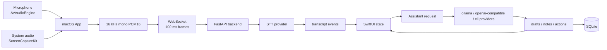

我這學期要做一個畢業專題，是要做出一個會議輔助工具。預計以 macOS App 的方式做到。

功能包括：

* 生成即時的逐字稿
* 即時對話輔助：在通話或線上會議中，AI 會即時聆聽對話內容，分析對方提出的問題，並自動生成自然的回應建議或話術。
* 會議筆記與下一步行動：除了應答之外，它也能在通話中同步記錄重點，並歸納出後續的執行步驟。
* 有即時的對話框可以問 AI。
* 可以點擊按鈕：`What should I say?`、`Follow-up questions`。
* 模型要能夠自己選擇，可以串自己的 API，如 GitHub Copilot、Codex。

## Repository Guidance

這個 repo 的文件入口集中在：

* `README.md`：專案總覽、執行方式、簡報入口。
* `AGENTS.md`：給協作者和 coding agent 的需求、架構、選型、限制與開發規範。
* `docs/research/translated/`：中文研究整理版，簡報與技術選型的主要依據。
* `docs/slides/slides.md`：Slidev 畢業專題報告。

子目錄 README 已清除，後續不要再新增 `apps/**/README.md`、`docs/**/README.md` 這類分散文件。若有重要資訊，整理到根 `README.md` 或本檔；若是研究長文，放到 `docs/research/`；若是簡報，放到 `docs/slides/slides.md`。

## Product Positioning

研究結論指出，會議摘要與 action items 已是成熟競品的基本功能；本專題的差異化應是：

**一個私密、macOS 原生、低摩擦、模型可選的即時會議副駕，把目前通話逐字稿轉成下一句可說的話、可追問的問題、會議筆記和下一步行動。**

第一版應避免做成「所有會議工作流平台」，而是專注在可 demo 的端到端體驗：

1. Start Meeting。
2. 收到麥克風與系統音訊。
3. 顯示即時逐字稿。
4. 按下 `What should I say?` 取得保守、自然、可直接說出口的建議。
5. 按下 `Follow-up questions` 取得追問。
6. 右側 Meeting Notes 每 30 秒用 final transcript 整理重點與下一步。
7. 匯出 Markdown 會議紀錄。

## Current Architecture



### macOS App

Location: `apps/macos/emeet`

Important modules:

* `Audio/MicrophoneCaptureService.swift` uses `AVAudioEngine` for microphone capture.
* `ScreenCapture/SystemAudioCaptureService.swift` uses `ScreenCaptureKit` `.audio` output for system audio.
* `Audio/PCM16AudioConverter.swift` converts microphone audio to 16 kHz mono PCM16.
* `Audio/SampleBufferPCM16AudioConverter.swift` converts `CMSampleBuffer` system audio to mono PCM16.
* `Transcription/TranscriptionWebSocketClient.swift` sends session metadata, 100 ms PCM16 frames, heartbeat pings, and parses transcript events.
* `App/CaptureViewModel.swift` owns capture status, transcript state, assistant provider selection, automatic 30 second summaries, delete/export actions.
* `UI/ContentView.swift`, `UI/TranscriptWorkspace.swift`, `UI/AssistantWorkspace.swift` compose the prototype workspace.

The UI currently has:

* left input panels for microphone/system audio levels,
* center transcript panel,
* right assistant panel with provider/model/thinking controls,
* `What should I say?` and `Follow-up questions`,
* Meeting Notes and Next Actions with a 30 second auto-summary countdown,
* `Delete Records` and `Export`.

### Backend

Location: `apps/backend`

Important modules:

* `meeting_backend/main.py` exposes `/health`, `/v1/transcribe/ws`, and the assistant router.
* `meeting_backend/sessions.py` manages one WebSocket STT session and records transcript events.
* `meeting_backend/transcription/segmenter.py` implements speech-window segmentation with RMS threshold, trailing silence, and max duration.
* `meeting_backend/transcription/faster_whisper_provider.py` and `mlx_whisper_provider.py` run real STT providers after segmentation.
* `meeting_backend/assistant/prompts.py` defines action-specific prompts.
* `meeting_backend/assistant/schema.py` validates and normalizes assistant JSON.
* `meeting_backend/assistant/service.py` dispatches to `ollama`, `openai-compatible`, `codex-cli`, and `github-copilot-cli`.
* `meeting_backend/storage.py` stores sessions, transcript segments, assistant runs, suggestions, notes, and actions in SQLite.

Primary endpoints:

```text
GET  /health
GET  /v1/assistant/providers
POST /v1/assistant/respond
WS   /v1/transcribe/ws
```

## Technology Choices

### Audio Capture

Research source: `docs/research/translated/02-音訊擷取技術研究.md`

Chosen MVP line:

* Microphone: `AVAudioEngine`.
* System/remote audio: `ScreenCaptureKit`.
* Source separation: keep microphone and system audio as separate sessions.

Rationale:

* Official macOS APIs and no driver install for the demo target.
* Better than mixing both sources into one track.
* Avoids full speaker diarization complexity in MVP.

Deferred:

* BlackHole/Loopback style virtual device fallback.
* Meeting SDK/WebRTC raw participant tracks.
* Core Audio per-process taps as a later OS/version-specific route.

### STT / ASR

Research sources:

* `docs/research/translated/03-即時逐字稿系統研究.md`
* `docs/research/translated/04-音訊分塊與即時處理策略.md`
* `docs/research/translated/12-Apple-Silicon即時會議助理技術可行性.md`

Chosen MVP line:

* Client sends 16 kHz mono PCM16 to backend over WebSocket.
* Backend segments speech windows, then runs `faster-whisper` or `mlx-whisper`.
* Apple Silicon demo preference: `mlx-whisper` with `large-v3-turbo`.

Important distinction:

* This project is STT/ASR, not TTS. TTS would mean speaking AI output aloud and is not in the MVP because the product should not automatically speak for the user.

### Realtime Chunking

Current implementation:

* 100 ms WebSocket audio frames.
* `SpeechWindowSegmenter` ignores leading silence, accumulates speech, finalizes after trailing silence or max duration.
* Default values:

```text
MEETING_BACKEND_SEGMENT_MIN_MS=800
MEETING_BACKEND_SEGMENT_SILENCE_MS=700
MEETING_BACKEND_SEGMENT_MAX_MS=8000
MEETING_BACKEND_VAD_RMS_THRESHOLD=0.012
```

Research conclusion:

* STT transport can be high-frequency.
* LLM calls should be low-frequency and semantic.
* Notes should use final transcript, not unstable partial transcript.

### Assistant / Model Provider

Research sources:

* `docs/research/translated/06-即時回應建議與對話輔助設計.md`
* `docs/research/translated/09-模型供應商與自帶金鑰研究.md`
* `docs/research/translated/17-提示詞工程與結構化輸出策略.md`

Current provider strategy:

* `ollama`: local LLM.
* `openai-compatible`: LM Studio, vLLM, llama.cpp server, OpenAI API, or any compatible endpoint.
* `codex-cli`: experimental CLI provider, read-only sandbox, text output capture.
* `github-copilot-cli`: experimental CLI provider through GitHub CLI/Copilot CLI.

Architecture rule:

* UI must consume normalized `drafts`, `notes`, `actions`.
* UI should not parse arbitrary model prose.
* CLI agent providers are optional experiments, not the safest low-latency default.

### Prompt and Schema

Prompt design:

* Split prompts by action.
* Keep transcript as untrusted input.
* Tell the model not to invent owners, dates, budgets, approvals, or commitments.
* Return compact JSON only.

Output contract:

```json
{
  "drafts": [{ "title": "...", "detail": "...", "badge": "...", "icon_name": "..." }],
  "notes": [{ "title": "...", "detail": "..." }],
  "actions": [{ "title": "...", "owner": "...", "state": "..." }]
}
```

Next schema improvements:

* Add `schema_version`.
* Add `evidence_segment_ids`.
* Add invalid-output retry.
* Separate `suggested_reply_v1`, `follow_up_questions_v1`, and `meeting_notes_v1`.

### Notes and Actions

Research source: `docs/research/translated/07-會議筆記與行動項目格式設計.md`

Current MVP behavior:

* Local draft notes update when final transcript arrives.
* Automatic `meeting_notes` action runs every 30 seconds after `Start Meeting`.
* Auto summary uses only final transcript lines.
* Export writes Markdown with notes, actions, suggestions, and transcript.

Preferred future structure:

* TL;DR
* Topics
* Decisions
* Action items
* Open questions
* Risks/blockers
* Follow-ups
* Evidence segment references

### Storage

Research source: `docs/research/translated/16-本機資料結構與SQLite儲存設計.md`

Current MVP storage:

* `sessions`
* `transcript_segments`
* `assistant_runs`
* `assistant_suggestions`
* `notes`
* `actions`

Current storage is append-first and local. Full meeting-level schema, FTS5, rolling memory snapshots, evidence links, and export/query APIs are future work.

Secrets must not be stored in SQLite. Future BYOK UI should store user keys in Keychain or route through backend-scoped ephemeral credentials.

## Run Commands

Backend faster-whisper:

```bash
cd apps/backend
python3 -m venv .venv
source .venv/bin/activate
python -m pip install -e ".[stt]"
MEETING_BACKEND_PROVIDER=faster-whisper ./scripts/dev.sh
```

Backend MLX Whisper:

```bash
cd apps/backend
source .venv/bin/activate
python -m pip install -e ".[mlx-whisper]"
MEETING_BACKEND_PROVIDER=mlx-whisper \
MEETING_BACKEND_MODEL=large-v3-turbo \
./scripts/dev.sh
```

macOS App:

```bash
cd apps/macos/emeet
./Scripts/build-app.sh
open .build/app/emeet.app
```

Slidev:

```bash
cd docs/slides
pnpm install
pnpm dev
```

Tests:

```bash
cd apps/backend
source .venv/bin/activate
python -m pytest
```

## Demo Script

Use this order for the graduation project live demo:

1. Start backend with `MEETING_BACKEND_PROVIDER=mlx-whisper` for Apple Silicon local STT, or `faster-whisper` for a CPU-compatible route.
2. Open `emeet.app`.
3. Press `Start Meeting`.
4. Show microphone and system audio level meters.
5. Speak a short question or play a meeting audio clip.
6. Show `Self` / `Other` transcript lines.
7. Click `What should I say?`.
8. Click `Follow-up questions`.
9. Wait for the 30 second auto-summary countdown or use a prepared transcript flow.
10. Show Meeting Notes and Next Actions.
11. Export Markdown.
12. Switch provider/model selection to show the provider abstraction.

## Known Limits

* Real STT providers currently emit final speech-window segments, not true token streaming partials.
* RMS VAD is a simple MVP gate. It should be upgraded for noisy environments.
* `speaker_hint` is source-based, not full diarization.
* The chat box is not yet a full meeting Q&A route in the UI.
* SQLite does not yet have meeting-level query/export APIs or FTS.
* No automatic external actions should be added without explicit user confirmation.

## Future Work

* Add full meeting-level persistence and export API.
* Add evidence segment IDs to assistant outputs.
* Add rolling summary state to avoid long-context degradation.
* Add meeting chat UI grounded in transcript and notes.
* Benchmark Zoom, Google Meet, Teams system audio capture.
* Evaluate WER/CER, source attribution accuracy, button-to-suggestion latency, notes faithfulness, and user acceptance rate.
* Add local-first privacy mode with stronger on-device STT/LLM support.

## Commit And PR Guidance

Use Linux kernel/Git-style commit subjects with an area, subsystem, or component prefix:

```text
area: concise patch summary
sub/sys: concise patch summary
```

The prefix should name the repository area changed, such as a directory, package, file, subsystem, or component. The summary after the colon should briefly describe what the patch does, because it becomes the first line shown in the git changelog. Keep it short, imperative, and specific. Use lowercase for the first word after the colon unless it is a proper noun, and do not end the subject with a period.

Examples:

```text
docs: clarify Storybook build ownership
web/routes: split route-level chunks
ui/field: fix select menu positioning
server/auth: validate session cookie
githooks.txt: improve the intro section
```

PRs should describe the changed area, list validation commands run, link related issues, and include screenshots for visible web UI changes.
