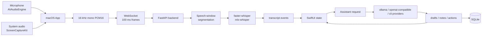

# emeet

emeet 是一個以一個本地、macOS 原生 App 實作的即時會議輔助工具。在會議進行中把目前通話逐字稿轉成下一句可說的話、可追問的問題、會議筆記與下一步行動。

## Current MVP

目前原型已涵蓋可 demo 的端到端流程：

- `Start Meeting` 後同時擷取麥克風與系統音訊。
- 麥克風透過 `AVAudioEngine` 擷取，系統/遠端音訊透過 `ScreenCaptureKit` `.audio` 擷取。
- 兩路音訊都轉成 16 kHz mono PCM16，約每 100 ms 透過 WebSocket 傳給 backend。
- Backend 以 speech-window segmentation 產生 final speech segment，再交給 `faster-whisper` 或 `mlx-whisper`。
- macOS UI 顯示 `Self` 與本機分群出的 `Speaker 1` / `Speaker 2` 等來源標籤。
- 右側 assistant 面板提供 provider/model/thinking 設定。
- `What should I say?` 產生保守、自然、可直接說出口的回覆建議。
- `Follow-up questions` 產生可推進對話的追問。
- Meeting Notes 每 30 秒根據新增 final transcript 與上一輪 rolling notes/actions 自動整理重點與 Next Actions。
- 可刪除紀錄與匯出 Markdown meeting record。

## Project Layout

```text
.
├── apps/
│   ├── backend/                         # FastAPI STT + assistant backend
│   └── macos/
│       └── emeet/                       # SwiftUI macOS App
├── docs/
│   ├── research/
│   │   ├── raw-reports/                 # 原始研究輸出
│   │   ├── translated/                  # 中文整理版，簡報與選型主要依據
│   │   └── notes/                       # 開發筆記
│   └── slides/
│       ├── package.json                 # Slidev tooling
│       ├── pnpm-lock.yaml
│       └── slides.md                    # 畢業專題 Slidev 簡報
├── AGENTS.md                            # 協作者 / coding agent 指南
└── README.md                            # 專案入口文件
```

## Architecture



設計重點是把音訊、逐字稿事件、assistant 請求與會議紀錄拆開。音訊可以高頻傳輸，LLM 呼叫低頻且語意化：按鈕由使用者觸發，筆記只使用 final transcript 低頻更新。

## Run the Prototype

Backend with `faster-whisper`:

```bash
cd apps/backend
python3 -m venv .venv
source .venv/bin/activate
python -m pip install -e ".[stt]"
MEETING_BACKEND_PROVIDER=faster-whisper ./scripts/dev.sh
```

Backend with MLX Whisper on Apple Silicon:

```bash
cd apps/backend
source .venv/bin/activate
python -m pip install -e ".[mlx-whisper]"
MEETING_BACKEND_PROVIDER=mlx-whisper \
MEETING_BACKEND_MODEL=large-v3-turbo \
./scripts/dev.sh
```

Optional assistant provider examples:

```bash
MEETING_BACKEND_ASSISTANT_PROVIDER=ollama \
MEETING_BACKEND_ASSISTANT_MODEL=llama3.2 \
./scripts/dev.sh
```

```bash
MEETING_BACKEND_ASSISTANT_PROVIDER=openai-compatible \
MEETING_BACKEND_ASSISTANT_OPENAI_BASE_URL=http://127.0.0.1:1234/v1 \
MEETING_BACKEND_ASSISTANT_MODEL=local-model \
./scripts/dev.sh
```

Local speaker labeling:

```bash
MEETING_BACKEND_DIARIZATION_PROVIDER=local-clustering \
MEETING_BACKEND_DIARIZATION_MAX_SPEAKERS=4 \
./scripts/dev.sh
```

`local-clustering` 是本機 segment-level speaker numbering，會把系統音訊標成 `Speaker 1` / `Speaker 2` 等。若 demo 只想保留穩定來源標籤，可改成：

```bash
MEETING_BACKEND_DIARIZATION_PROVIDER=source ./scripts/dev.sh
```

Build and open the macOS app:

```bash
cd apps/macos/emeet
./Scripts/build-app.sh
open .build/app/emeet.app
```

第一次測試需要授權：

- Microphone：麥克風權限。
- Screen Recording：`ScreenCaptureKit` 系統音訊需要螢幕錄製權限，授權後通常要重開 App。

App 預設連到：

```text
ws://127.0.0.1:8765/v1/transcribe/ws
```

## Slides

畢業專題 Slidev 簡報在：

```text
docs/slides/slides.md
```

啟動簡報：

```bash
cd docs/slides
pnpm install
pnpm dev
```

預設 URL：

```text
http://127.0.0.1:3030
```

產生靜態版：

```bash
cd docs/slides
pnpm build
```

## Validation

Backend tests:

```bash
cd apps/backend
source .venv/bin/activate
python -m pytest
```

macOS build:

```bash
cd apps/macos/emeet
./Scripts/build-app.sh
```

Slidev build:

```bash
cd docs/slides
pnpm build
```

## Demo Flow

建議畢業專題 live demo 順序：

1. 啟動 backend，Apple Silicon demo 優先使用 `MEETING_BACKEND_PROVIDER=mlx-whisper`。
2. 開啟 `emeet.app`。
3. 按 `Start Meeting`。
4. 展示麥克風與系統音訊 level meters。
5. 說一段問題或播放會議音訊片段。
6. 展示 `Self` / `Speaker 1` / `Speaker 2` 逐字稿。
7. 點 `What should I say?`。
8. 點 `Follow-up questions`。
9. 等待 30 秒自動摘要或使用準備好的 transcript flow。
10. 展示 Meeting Notes 與 Next Actions。
11. 匯出 Markdown。
12. 切換 provider/model，展示模型抽象層。

## Known Limits

- 真實 STT provider 目前輸出 speech-window final segments，還不是 token-level streaming partial。
- RMS VAD 是 MVP gate，噪音環境需要升級成 Silero/WebRTC VAD 或語意邊界策略。
- `speaker_hint` 仍區分 `self` / `other`；`speaker_label` 會以本機音訊特徵做 segment-level `Speaker 1` / `Speaker 2` 標籤，但還不是完整多講者 DER 最佳化 diarization。
- UI 中的 chat box 尚未成為完整會議 Q&A route。
- SQLite 目前是 append-first MVP schema，已記錄 speaker label，但尚未加入 meeting-level query/export API、FTS5、持久化 rolling memory snapshots 或 evidence segment ids。
- 不應加入任何自動外部動作；寄信、發訊息、建 task 都必須保留人工確認。

## Next Steps

1. 補 meeting-level persistence、query、export API 與 FTS5。
2. 將 assistant schema 加入 `schema_version`、`evidence_segment_ids` 與 invalid-output retry。
3. 升級 VAD：Silero/WebRTC，加上語意邊界。
4. 補會議聊天框，讓使用者可針對逐字稿與筆記問 AI。
5. 將目前 app 端 rolling summary state 持久化到 meeting-level storage，避免長會議 context degradation。
6. Benchmark Zoom、Google Meet、Teams 系統音訊擷取穩定性。
7. 評估 WER/CER、source attribution accuracy、button-to-suggestion latency、notes faithfulness 與 user acceptance rate。
