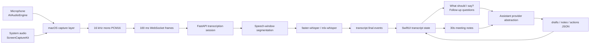

# Meeting Assistant Capstone

這是一個以 macOS App 實作的即時會議輔助工具。目標是在會議中同時提供即時逐字稿、回覆建議、追問問題、會議筆記、下一步行動，以及可切換模型/provider 的 AI 助理工作台。

目前原型採用本地優先的混合式架構：macOS App 負責音訊擷取、UI、逐字稿狀態與使用者操作；FastAPI backend 負責 STT session、assistant provider dispatch、JSON 結構驗證與 SQLite append-first 儲存。

## Current Scope

已實作的 MVP 功能：

- 麥克風音訊：`AVAudioEngine` 擷取並轉成 16 kHz mono PCM16。
- 系統音訊：`ScreenCaptureKit` `.audio` stream 擷取遠端/系統聲音，再轉成 16 kHz mono PCM16。
- 即時傳輸：macOS client 以約 100 ms binary WebSocket frames 傳到 backend。
- STT provider：`faster-whisper`、`mlx-whisper`。
- 逐字稿 UI：以 `Self` / `Other` source label 區分麥克風與系統音訊，保留 partial/final 狀態。
- AI 按鈕：`What should I say?`、`Follow-up questions`。
- 會議筆記：每 30 秒以 final transcript 自動整理 meeting notes 與 next actions。
- Assistant provider：Ollama、OpenAI-compatible endpoint、Codex CLI、GitHub Copilot CLI。
- 匯出：macOS App 可匯出 Markdown meeting record。
- 簡報：`docs/slides/slides.md` 是畢業專題報告 Slidev deck。

## Project Layout

```text
.
├── apps/
│   ├── backend/                         # FastAPI STT + assistant backend
│   └── macos/
│       └── MeetingAssistantPrototype/   # SwiftUI macOS App prototype
├── docs/
│   ├── research/
│   │   ├── raw-reports/                 # 原始研究輸出
│   │   ├── translated/                  # 中文整理版，簡報主要依據
│   │   └── notes/                       # 較短的開發筆記
│   └── slides/
│       ├── package.json                 # Slidev tooling
│       ├── pnpm-lock.yaml
│       └── slides.md                    # Slidev 畢業專題簡報
├── AGENTS.md                            # 專案需求、技術選型與協作規範
└── README.md                            # 專案入口文件
```

子目錄 README 已移除，避免同一份執行方式和技術說明分散維護。重要背景請集中看 `README.md`、`AGENTS.md`、`docs/research/translated/` 和 `docs/slides/slides.md`。

## End-to-End Flow



設計重點是把音訊封包、語音段落、逐字稿事件和 AI 建議分開。音訊可以 100 ms 一包送給 STT，但 LLM 不應每 100 ms 被呼叫；目前建議由按鈕觸發，筆記以 30 秒低頻更新。

## Technical Decisions

### Audio Capture

研究結論建議先用官方且可交付的音訊路線：

- 本機講者：`AVAudioEngine` / AVFoundation。
- 遠端或系統音訊：`ScreenCaptureKit`，需要 Screen Recording 權限。
- Big Sur / Monterey 回退可研究 BlackHole 類虛擬裝置。
- 逐參與者原始音訊只有在控制會議 SDK / WebRTC 堆疊時才比較可行。

目前原型選擇 `AVAudioEngine + ScreenCaptureKit`，因為它不需要安裝額外 driver，且能將自己與對方聲音分成 `microphone` / `system` 兩條來源。這不是完整 speaker diarization，但對 MVP 的 `Self` / `Other` 判斷已足夠。

### STT, Not TTS

需求中提到「把聲音丟 AI 做 TTS」時，本專案核心實際是 STT/ASR：speech-to-text。TTS 是 text-to-speech，較適合作為未來把 AI 建議念出來的延伸功能；目前不做自動念稿，避免 AI 代表使用者發言。

### Realtime Strategy

研究建議把三種節奏拆開：

- 傳輸分塊：50-200 ms，原型採約 100 ms PCM16 frame。
- STT 分段：用 speech window、VAD/silence 和 max duration 決定何時送模型。
- LLM 更新：只吃穩定逐字稿或使用者按鈕，筆記每 30 秒更新。

目前 backend 的預設分段參數：

```text
MEETING_BACKEND_SEGMENT_MIN_MS=800
MEETING_BACKEND_SEGMENT_SILENCE_MS=700
MEETING_BACKEND_SEGMENT_MAX_MS=12000
MEETING_BACKEND_VAD_RMS_THRESHOLD=0.012
```

### Model and Provider Strategy

研究結論是做能力感知的 provider abstraction，而不是把產品綁死在單一 API。實作上分成兩層：

- STT provider：把 audio segment 轉 transcript。
- Assistant provider：把 transcript context 轉 structured JSON。

目前 assistant provider 支援 `ollama`、`openai-compatible`、`codex-cli`、`github-copilot-cli`。預設 assistant 設定是 provider `ollama`、model `fast`、thinking `high`。Codex CLI 和 GitHub Copilot CLI 是展示「可串自己的 agent / API」的實驗線；正式低延遲會議話術仍應優先使用 chat provider 或本機 LLM。

### Prompt and Output Contract

後端在 `apps/backend/meeting_backend/assistant/prompts.py` 依 action 拆提示詞：

- `what_should_i_say`
- `follow_up_questions`
- `meeting_notes`
- `chat`

模型必須輸出固定 JSON：

```json
{
  "drafts": [{ "title": "...", "detail": "...", "badge": "...", "icon_name": "..." }],
  "notes": [{ "title": "...", "detail": "..." }],
  "actions": [{ "title": "...", "owner": "...", "state": "..." }]
}
```

`assistant/schema.py` 會把 provider 輸出正規化並驗證，確保 UI 不依賴自由文字解析。

## Run the Prototype

Backend faster-whisper STT:

```bash
cd apps/backend
python3 -m venv .venv
source .venv/bin/activate
python -m pip install -e ".[stt]"
MEETING_BACKEND_PROVIDER=faster-whisper ./scripts/dev.sh
```

Apple Silicon MLX Whisper demo:

```bash
cd apps/backend
source .venv/bin/activate
python -m pip install -e ".[mlx-whisper]"
MEETING_BACKEND_PROVIDER=mlx-whisper \
MEETING_BACKEND_MODEL=large-v3-turbo \
./scripts/dev.sh
```

Ollama assistant demo:

```bash
cd apps/backend
source .venv/bin/activate
MEETING_BACKEND_ASSISTANT_PROVIDER=ollama \
MEETING_BACKEND_ASSISTANT_MODEL=fast \
MEETING_BACKEND_ASSISTANT_THINKING=high \
./scripts/dev.sh
```

OpenAI-compatible assistant demo:

```bash
cd apps/backend
source .venv/bin/activate
MEETING_BACKEND_ASSISTANT_PROVIDER=openai-compatible \
MEETING_BACKEND_ASSISTANT_OPENAI_BASE_URL=http://127.0.0.1:1234/v1 \
MEETING_BACKEND_ASSISTANT_MODEL=local-model \
MEETING_BACKEND_ASSISTANT_THINKING=high \
./scripts/dev.sh
```

Build and open the macOS app:

```bash
cd apps/macos/MeetingAssistantPrototype
./Scripts/build-app.sh
open .build/app/MeetingAssistantPrototype.app
```

第一次測試需要授權：

- Microphone：麥克風權限。
- Screen Recording：ScreenCaptureKit 系統音訊需要螢幕錄製權限，授權後通常要重開 App。

App 預設連到：

```text
ws://127.0.0.1:8765/v1/transcribe/ws
```

## Slides

畢業專題 Slidev 簡報在：

```text
docs/slides/slides.md
```

啟動簡報：

```bash
cd docs/slides
pnpm install
pnpm dev
```

預設 URL：

```text
http://127.0.0.1:3030
```

產生靜態版：

```bash
cd docs/slides
pnpm build
```

## Validation

Backend tests:

```bash
cd apps/backend
source .venv/bin/activate
python -m pytest
```

WebSocket smoke test:

```bash
cd apps/backend
source .venv/bin/activate
MEETING_BACKEND_PROVIDER=faster-whisper ./scripts/dev.sh
python scripts/send_test_audio.py
```

macOS build:

```bash
cd apps/macos/MeetingAssistantPrototype
./Scripts/build-app.sh
```

Slidev:

```bash
cd docs/slides
pnpm build
```

## Current Limitations

- 真實 STT provider 目前以 speech window 產生 `transcript.final`，還不是 token-level streaming partial。
- RMS VAD 足夠輕量，但噪音場景仍需要 Silero/WebRTC VAD 或更完整的語意邊界策略。
- `speaker_hint` 目前只根據音訊來源推斷 `self` / `other`。
- 會議聊天框尚未成為完整 UI route，目前先完成按鈕建議和筆記/action drafts。
- SQLite 已保存 sessions、transcript segments、assistant runs、suggestions、notes、actions，但還沒有 meeting-level 查詢、匯出 API、FTS 或 evidence segment ids。
- 長會議 rolling summary 和 prompt state object 仍是下一階段。

## Next Steps

1. 補 meeting-level API、查詢、匯出與 FTS。
2. 將 assistant schema 版本化，加入 invalid-output retry 與 evidence segment ids。
3. 將 RMS VAD 替換或升級成 Silero/WebRTC VAD 加語意邊界。
4. 補會議聊天框，讓使用者可以針對目前逐字稿問 AI。
5. 在 Zoom、Google Meet、Teams 上做系統音訊穩定性測試。
6. 量測 capture-to-final、backend RTT、button-to-suggestion、notes refresh latency。
