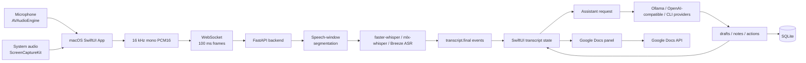

# emeet

emeet 是一個 macOS 原生的即時會議副駕。它在會議中擷取麥克風與系統音訊，產生逐字稿，並結合正在討論的 Google Docs 文件脈絡，提供可直接說出口的回覆建議、追問問題、會議紀錄、下一步行動，以及保守的文件更新支援。

產品定位不是完整會議平台，也不是單純會後摘要工具。emeet 的 MVP 聚焦在一個可展示的端到端 loop：會議音訊進來，逐字稿與 Google Docs 脈絡一起進入 assistant，使用者在會中取得 follow-up support，並把 notes/actions 同步回文件與本機紀錄。

## Current MVP

目前原型已涵蓋可 demo 的端到端流程：

- `Start Meeting` 後同時擷取麥克風與系統音訊。
- 麥克風透過 `AVAudioEngine` 擷取，系統/遠端音訊透過 `ScreenCaptureKit` `.audio` 擷取。
- 兩路音訊都轉成 16 kHz mono PCM16，約每 100 ms 透過 WebSocket 傳給 backend。
- Backend 以 speech-window segmentation 產生 final speech segment，再交給 `faster-whisper` 或 `mlx-whisper` / Breeze ASR 25。
- macOS UI 顯示 `Self` / `Other`，並可用本機 segment-level clustering 顯示 `Speaker 1` / `Speaker 2` 等初步 speaker label。
- 右側 assistant 面板提供 provider、model 與 thinking 設定。
- Google Docs panel 可授權、連接、讀取文件脈絡、開啟文件，並更新 `emeet Live Notes` 區塊。
- `What should I say?` 產生保守、自然、可直接說出口的回覆建議。
- `Follow-up questions` 產生有助於釐清需求、限制、風險、時程與責任分工的追問。
- Meeting Notes 每 30 秒根據新增 final transcript、rolling notes/actions 與 Google Docs 脈絡整理重點與 Next Actions。
- 語音中出現明確 AI-directed edit command 時，可規劃並執行單一步驟 Google Docs 編輯，例如 replace text、insert under heading、rewrite paragraph。
- SQLite 儲存會議、逐字稿、assistant runs、notes、actions；UI 支援 meeting history、重新命名、延續會議與 Markdown 匯出。

目前明確不做：

- 不建立完整會議平台。
- 不自動替使用者發言。
- 不在沒有明確指令時修改 Google Docs。
- 不自動寄信、發訊息或建立外部任務。
- 不把 `Speaker 1` / `Speaker 2` 宣稱為完整 speaker diarization。

## Project Layout

```text
.
├── apps/
│   ├── backend/                         # FastAPI STT + assistant + Google Docs backend
│   └── macos/
│       └── emeet/                       # SwiftUI macOS App
├── docs/
│   ├── final-report.md                  # 期末報告
│   ├── research/
│   │   ├── raw-reports/                 # 原始研究輸出
│   │   ├── translated/                  # 中文整理版，簡報與選型主要依據
│   │   └── notes/                       # 開發筆記
│   └── slides/
│       ├── package.json                 # Slidev tooling
│       ├── pnpm-lock.yaml
│       └── slides.md                    # 畢業專題 Slidev 簡報
├── AGENTS.md                            # 協作者 / coding agent 指南
└── README.md                            # 專案入口文件
```

## Architecture



設計重點是把音訊、逐字稿事件、assistant 請求、Google Docs context 與會議紀錄拆開。音訊可以高頻傳輸；LLM 呼叫維持低頻且語意化：回覆與追問由使用者按鈕觸發，筆記只使用 final transcript 低頻更新，文件修改只在明確指令下執行。

## Backend API

主要 endpoint：

```text
GET   /health
GET   /v1/transcribe/options
WS    /v1/transcribe/ws
GET   /v1/assistant/providers
POST  /v1/assistant/respond
GET   /v1/meetings
GET   /v1/meetings/{meeting_id}
PATCH /v1/meetings/{meeting_id}
GET   /v1/meetings/{meeting_id}/export
POST  /v1/meetings/{meeting_id}/generate-title
GET   /v1/google/auth/status
POST  /v1/google/auth/start
POST  /v1/google/docs/connect
POST  /v1/google/docs/refresh
POST  /v1/google/docs/update-live-notes
POST  /v1/google/docs/replace-text
POST  /v1/google/docs/insert-under-heading
POST  /v1/google/docs/rewrite-paragraph
```

Optional browser helper endpoints also exist under `/v1/google/browser/*` for opening, scrolling, and visible-text search. Direct document writes use the Google Docs API, not browser automation.

## Run the Prototype

Backend with `faster-whisper`:

```bash
cd apps/backend
uv python install 3.12
uv sync --extra faster-whisper
MEETING_BACKEND_PROVIDER=faster-whisper ./scripts/dev.sh
```

Backend with MLX Whisper on Apple Silicon:

```bash
cd apps/backend
uv python install 3.12
uv sync --extra mlx-whisper
MEETING_BACKEND_PROVIDER=mlx-whisper \
MEETING_BACKEND_MODEL=breeze-asr-25 \
MEETING_BACKEND_WHISPER_LANGUAGE=zh \
./scripts/dev.sh
```

`breeze-asr-25` is resolved internally to the MLX model `schsu/breeze-asr-25-mlx`.

Optional assistant provider examples:

```bash
MEETING_BACKEND_ASSISTANT_PROVIDER=ollama \
MEETING_BACKEND_ASSISTANT_MODEL=llama3.2 \
./scripts/dev.sh
```

```bash
MEETING_BACKEND_ASSISTANT_PROVIDER=openai-compatible \
MEETING_BACKEND_ASSISTANT_OPENAI_BASE_URL=http://127.0.0.1:1234/v1 \
MEETING_BACKEND_ASSISTANT_MODEL=local-model \
./scripts/dev.sh
```

Local speaker labeling:

```bash
MEETING_BACKEND_DIARIZATION_PROVIDER=local-clustering \
MEETING_BACKEND_DIARIZATION_MAX_SPEAKERS=4 \
./scripts/dev.sh
```

`local-clustering` 是本機 segment-level speaker numbering，會把系統音訊標成 `Speaker 1` / `Speaker 2` 等。若 demo 只想保留穩定來源標籤，可改成：

```bash
MEETING_BACKEND_DIARIZATION_PROVIDER=source ./scripts/dev.sh
```

Build and open the macOS app:

```bash
cd apps/macos/emeet
./Scripts/build-app.sh
open .build/app/emeet.app
```

第一次測試需要授權：

- Microphone：麥克風權限。
- Screen Recording：`ScreenCaptureKit` 系統音訊需要螢幕錄製權限，授權後通常要重開 App。

App 預設連到：

```text
ws://127.0.0.1:8765/v1/transcribe/ws
```

## Google Docs Setup

Google Docs MVP 使用單使用者 local OAuth flow。後端會讀取 OAuth client JSON，完成授權後產生 local token；所有文件修改透過 Google Docs API `batchUpdate` 執行。

1. Create a Google Cloud project.
2. Enable the Google Docs API.
3. Configure the OAuth consent screen for your test user.
4. Create an OAuth client with application type `Desktop app`.
5. Save the downloaded client JSON to:

```text
apps/backend/secrets/google_oauth_client.json
```

6. Install backend dependencies if needed:

```bash
cd apps/backend
uv sync --extra stt
```

7. Start the backend and click `Authorize` in the macOS app Google Docs panel. The local OAuth flow creates:

```text
apps/backend/secrets/google_token.json
```

Both files are ignored by git. Production TODO: move Google tokens to macOS Keychain or encrypted backend-scoped storage.

Useful overrides:

```bash
MEETING_BACKEND_GOOGLE_OAUTH_CLIENT_PATH=secrets/google_oauth_client.json \
MEETING_BACKEND_GOOGLE_TOKEN_PATH=secrets/google_token.json \
./scripts/dev.sh
```

Optional Selenium-backed `Open` button:

```bash
uv sync --extra stt --extra browser
MEETING_BACKEND_UV_EXTRA=browser ./scripts/dev.sh
```

`Open` uses Selenium/ChromeDriver when available and falls back to macOS `open`. If the backend process cannot find ChromeDriver, set `CHROMEDRIVER_PATH=/opt/homebrew/bin/chromedriver` or your local path.

## Final Report

期末報告在：

```text
docs/final-report.md
```

報告主軸是 Google Docs 即時 referencing 的會議副駕：不是再做一個會後摘要工具，而是在會議當下把共同文件與即時逐字稿結合，讓系統提供追問、下一句話、notes/actions 與可控文件修改。

## Slides

畢業專題 Slidev 簡報在：

```text
docs/slides/slides.md
```

啟動簡報：

```bash
cd docs/slides
pnpm install
pnpm dev
```

預設 URL：

```text
http://127.0.0.1:3030
```

產生靜態版：

```bash
cd docs/slides
pnpm build
```

## Validation

Backend tests:

```bash
cd apps/backend
uv run pytest
```

macOS build:

```bash
cd apps/macos/emeet
./Scripts/build-app.sh
```

Slidev build:

```bash
cd docs/slides
pnpm build
```

The final report records the latest project validation as `71 passed` for backend tests and a successful macOS `swift build`.

## Demo Flow

建議畢業專題 live demo 順序：

1. 啟動 backend，Apple Silicon demo 優先使用 `MEETING_BACKEND_PROVIDER=mlx-whisper`、`MEETING_BACKEND_MODEL=breeze-asr-25` 與 `MEETING_BACKEND_WHISPER_LANGUAGE=zh`。
2. 開啟 `emeet.app`。
3. 在右側 Google Docs panel 貼上文件 URL；如果尚未授權，先按 `Authorize`，再按 `Connect` 讀取文件脈絡。
4. 可按 `Open` 讓文件顯示在瀏覽器中。
5. 按 `Start Meeting`。
6. 展示麥克風與系統音訊 level meters。
7. 說一段問題或播放會議音訊片段。
8. 展示 `Self` / `Other` / `Speaker 1` / `Speaker 2` 逐字稿。
9. 點 `What should I say?`，展示文件脈絡下的保守回覆建議。
10. 點 `Follow-up questions`，展示追問問題。
11. 等待 30 秒自動摘要或使用準備好的 transcript flow。
12. 展示 Meeting Notes、Next Actions，以及 Google Docs 中的 `emeet Live Notes` 更新。
13. 說出明確文件編輯指令，例如 `AI 請幫我把第二段改成...`，展示 10 秒 voice-edit loop 的文件修改。
14. 打開 meeting history，展示重新命名、延續會議或已儲存紀錄。
15. 匯出 Markdown。
16. 切換 STT 或 assistant provider/model，展示模型抽象層。

## Known Limits

- 真實 STT provider 目前輸出 speech-window final segments，還不是 token-level streaming partial。
- RMS VAD 是 MVP gate，噪音、鍵盤聲、音樂、外放回音與多人搶話會降低分段品質。
- `Self` / `Other` 是來源分流；`Speaker 1` / `Speaker 2` 是本機音訊特徵的 segment-level numbering，不是完整 speaker diarization，也不能穩定判斷真實姓名。
- Google Docs 目前是單文件 MVP；尚未支援 Google Drive 搜尋、本地檔案 RAG、簡報 navigation 或完整自然語言游標移動。
- Google Docs voice edit 尚未有完整 preview / confirm UI；正式文件修改前仍需要更強的人類確認流程。
- UI 中的 chat box 尚未成為完整會議 Q&A route。
- Assistant schema 尚未加入 `schema_version`、`evidence_segment_ids`、invalid-output retry，也尚未拆成版本化 action schema。
- SQLite 目前是 append-first MVP schema，尚未加入 FTS5、完整 meeting-level query、持久化 rolling memory snapshots 或長期 meeting memory。
- 隱私與同意 UX 仍需補強，例如 capturing indicator、資料保存期限、local/cloud 模式標籤，以及顯示內容會送到哪個模型供應商。
- 不應加入任何自動外部動作；寄信、發訊息、建 task、修改外部系統都必須保留人工確認、audit log 與 dry-run preview。

## Next Steps

近期：

1. 補完整 meeting chat UI，讓使用者可針對逐字稿與會議紀錄提問。
2. Assistant schema 加入 `schema_version`、`evidence_segment_ids` 與 invalid-output retry。
3. Google Docs voice edit 加入 preview / confirm UI。
4. 將 browser scroll / find 做成 assistant action，例如「幫我切到注意事項」。
5. 補 benchmark script，量測 button-to-suggestion latency、STT latency 與 auto-summary latency。

中期：

1. 加入 Silero VAD 或 WebRTC VAD。
2. 加入 true partial transcript。
3. 支援 Google Drive 搜尋與本地檔案索引。
4. 加入 RAG，讓 AI 可在會議中搜尋相關文件、合約、紀錄或研究資料。
5. 建立 local-first privacy mode：本機語音轉文字、本機語言模型、不上傳逐字稿。
6. 加入 FTS5 與 meeting-level query / export API。

長期：

1. 整合會議平台層級的 participant track，例如 Zoom RTMS、Teams media bot 或 Meet Media API。
2. 建立更完整的 speaker identity 與 evidence-grounded diarization。
3. 支援簡報、文件與瀏覽器頁面的可控 navigation。
4. 建立可審計的外部 action layer。
5. 應用於高隱私與高紀錄需求場景，例如警察筆錄、法律諮詢、醫療諮詢、心理諮商與機密專案會議。
