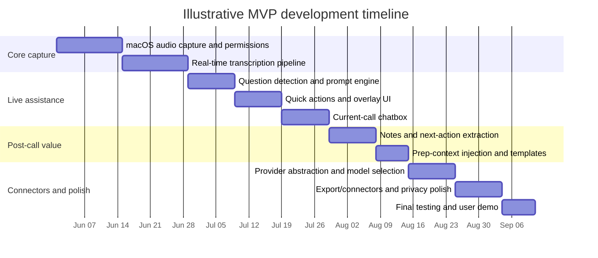

# Product Positioning and Competitive Analysis for a macOS Meeting Assistant Graduation Project

## Executive Summary

This market is already crowded for **transcription, summaries, and action-item extraction**. Otter, Fireflies, Granola, Fathom, tl;dv, Notion, Zoom, and Teams all cover some version of “record the meeting, summarize it, and make it searchable.” What is **less saturated** is a **macOS-native, low-friction, real-time tactical copilot** that helps the user decide what to say *during* the conversation, while staying private, cross-platform, and model-flexible. Existing products do offer pieces of this—Otter AI Chat/voice, Fireflies Live Assist/Sales Assist, Fathom’s conversational meeting assistant, Zoom meeting questions/My Notes, and Teams Facilitator/Copilot—but those experiences are usually tied to a platform ecosystem, optimized for post-call workflow, or aimed at broader team deployment rather than an individual “live response layer” on macOS. citeturn36view0turn19search0turn25view0turn12search0turn14search9

The strongest recommendation is **not** to target “all” pain points at once. If you must choose from the categories in your brief, the best beachhead is **sales calls**, or more precisely, **high-stakes external conversations** such as discovery calls, demos, customer-success calls, and consulting/client meetings. That segment has obvious ROI, repeated meeting patterns, real pain around objection handling and next steps, and clear demand signaled by existing vendor investment in sales assist, CRM sync, and coaching. By contrast, **general meeting assistant** is too broad for an academic MVP, **online class notes** underuse your most distinctive live-reply features, and **interview aid** carries higher fairness, consent, and reputational risk as a public-facing position. citeturn6search1turn18search9turn25view0turn8search9turn3search20turn12search4

The product should therefore be positioned as a **private, bot-light or bot-free, model-agnostic live meeting copilot for macOS** rather than another generic note taker. Its differentiator should not be “we also do transcription” or “we can call APIs,” because those are rapidly becoming table stakes across the category. The differentiator should be: **real-time, user-invoked tactical assistance** with explicit quick actions like **“What should I say?”** and **“Follow-up questions,”** grounded in the current transcript and optional prep context, with a flexible provider layer for external models and APIs. citeturn18search1turn20search5turn3search8turn21search3turn29search5turn28search1turn10search0

## Research Frame and Assumptions

This assessment was grounded primarily in **official product pages, pricing pages, help centers, and API/developer docs** checked on **May 25, 2026**. Where helpful, I also used **recent secondary reviews** to identify practical limitations that official marketing pages tend to understate, especially Zapier’s 2026 comparison of AI meeting assistants and a recent Verge report on Granola’s sharing/privacy defaults. Official Traditional Chinese documentation was available mainly from Microsoft support; most other vendors surfaced English-first documentation. citeturn33view0turn32search2turn14search3turn14search4

Several assumptions remain open because your brief leaves them unspecified: **target user segment**, **budget**, and **timeline**. That matters. Pricing and packaging in this market are highly sensitive to segment. Enterprise-native tools such as Teams Copilot and Zoom AI Companion benefit from platform bundling, while standalone tools compete via freemium entry, bot-free experience, or specialized sales workflow features. Because your project is a graduation project rather than a company-scale rollout, the most defensible path is to optimize for **clarity of user value and demonstrable core interaction**, not breadth of enterprise administration. citeturn16view1turn15search4turn25view0turn3search3turn36view0

A final market caveat: list prices and availability are sometimes **region-dependent** and can differ by billing interval, promotional period, or account eligibility. This is especially visible in Microsoft and Zoom documentation, and to a lesser extent in some dynamically rendered pricing pages. So the comparison below focuses on **pricing model and current public pricing signals**, not procurement-grade quoting. citeturn16view1turn15search4turn12search7

## Which Pain Points to Target

The fundamental pain pattern is clear: modern work is overloaded by interruptions, ad hoc meetings, and weak follow-through. Microsoft’s 2025 Work Trend Index reported that employees are interrupted by meetings, email, or pings roughly every two minutes during the workday, and Atlassian reports that **77%** of workers frequently sit through meetings that end by scheduling another meeting. In other words, the business pain is not only “I need a transcript,” but also “I need help staying oriented, asking better questions, and capturing the next move before the moment is gone.” citeturn35search5turn35search1turn35search2turn35search6

That said, your current feature ideas lean much more strongly toward **live conversational support** than toward passive archival notes. Real-time transcription, question analysis, natural reply suggestions, quick actions, and a live ask-AI chatbox all matter most when the user is under **interactive pressure**. That is why **online class notes** are a weaker primary wedge: class-note users benefit from transcription and summaries, but they usually get less value from “What should I say?” than a salesperson, consultant, founder, recruiter, or customer-success operator. Research on AI-assisted note-taking in lecture contexts does suggest benefits for comprehension and cognitive burden, which supports education as a possible future adjacency, but it does not match your most differentiated interaction surface as closely as live external calls do. citeturn35search7turn35search0

For a first market wedge, **sales calls** are the best fit among your suggested options. The evidence is indirect but strong: Fireflies explicitly invests in **Sales Assist** and knowledge-based live suggestions; Otter has an **OtterPilot for Sales** and “Assist: call objectives + live coaching”; Fathom emphasizes **CRM field sync, Deal View, coaching metrics, and AI scorecards**; tl;dv pushes CRM fill and search/reporting; and even platform suites such as Zoom and Teams increasingly turn meetings into action-oriented workflows. That means the pain is validated, the buyer understands ROI, and the meeting format is repetitive enough for quick-action prompts to feel immediately useful. citeturn6search1turn19search0turn18search9turn36view0turn25view0turn8search2turn12search0turn14search1

**Interview aid** should not be the public primary positioning. The feature mechanics overlap with your concept, but it is a riskier proposition. Leading vendors repeatedly emphasize participant consent and privacy controls: Granola recommends always asking for consent before transcribing others; Zoom offers explicit AI-consent settings and prompts for some participants; Fathom states there is no way to silently record without some visibility or consent mechanism. Positioning the app as covert interview coaching would therefore create a fairness/compliance narrative around the product before it has earned trust as a legitimate work tool. If you explore interview workflows at all, the safer framing is **mock interviews, internal interviewer support, or interview debriefing**, not secret real-interview assistance. citeturn3search20turn12search4turn22search0

**Recommended answer to your “which pain points?” question:** choose **sales calls first**, and design the UX so it can later expand into a **general high-stakes meeting assistant**. Do **not** position the first version as “for all meetings,” and do **not** lead with interview aid.

**One-sentence product positioning:**  
**A private, macOS-native live meeting copilot for high-stakes external conversations that turns real-time transcripts into grounded reply suggestions, follow-up questions, and actionable next steps using the user’s preferred AI models and connectors.**

## Competitor Comparison

| Tool | Core features | Interaction mode | Known limitations | Pricing model | Integrations and APIs | Evidence |
|---|---|---|---|---|---|---|
| **Otter.ai** | Live transcription, speaker identification, summaries, action items, AI Chat within/across meetings, meeting workflows, live notes/captioning, sales/recruiting use cases | Otter joins Zoom, Teams, and Google Meet; desktop/mobile/web; AI Chat can be used during and after meetings; voice mode is documented for Zoom | Lower tiers have minute and per-meeting caps; API/Webhooks are Enterprise-only; independent review says it struggles more with technical language/jargon | Free Basic; Pro; Business; Enterprise. Official pricing shows Pro at $8.33 annually / $16.99 monthly, Business at $19.99 annually / $30 monthly, Enterprise custom | Slack, Salesforce, HubSpot, Zapier, Google Drive, Zoom/Meet/Teams, MCP server, Public API, Webhooks | citeturn36view0turn31search0turn31search2turn18search1turn33view0 |
| **Fireflies.ai** | Automatic transcription, AI summaries, AskFred, AI Skills, topic analysis, Live Assist, Sales Assist, desktop floating panel, multilingual transcription | Bot can join meetings, or desktop app can record system audio; Live Assist shows live notes/transcripts/suggestions during the meeting | Free plan uses transcription credits, AI credits, and storage caps; system-audio mode has no named speakers, no saved audio/video files, and no Sales Assist; reviewer notes UI can feel cluttered | Freemium seat-based plan family with Free, Pro, Business, Enterprise; advanced features also consume AI credits | 50+ to 100+ app integrations depending tier/docs, CRM/dialer/support integrations, GraphQL API, Webhooks, MCP connector support | citeturn6search0turn19search0turn19search1turn19search3turn19search5turn20search0turn20search10turn6search5turn33view0 |
| **Granola** | Bot-free meeting notes, real-time transcription, AI-enhanced summaries after the call, templates, Granola Chat across notes, team spaces | Runs on the user’s computer with system audio and mic; no meeting bot; iPhone app supports in-person meetings and outbound phone calls | No transcription starts unless user opens the note; iPhone cannot capture virtual meeting audio and does not support inbound calls; no video recording/playback in Zapier review; shared-link behavior has received privacy criticism in recent reporting | Basic free; Business at $14/user/month; Enterprise starts at $35/user/month | Notion, Slack, HubSpot, Attio, Affinity, Zapier; API access; MCP for ChatGPT/Claude-style tools | citeturn4search0turn4search3turn4search1turn4search11turn3search3turn3search22turn3search0turn3search4turn3search8turn32search2turn33view0 |
| **Fathom** | Unlimited recordings/transcriptions, summaries, advanced summaries, AI action items, Ask Fathom chat, clips/playlists, team search, Deal View, coaching metrics, AI scorecards | Bot joins Zoom/Meet/Teams, or bot-free capture in beta; desktop app on Mac/Windows | Only Mac/Windows are supported; one meeting at a time; no external recording uploads; some unsupported call types; reviewer notes quirks on Meet and Teams; bot-free is still marked beta in pricing | Free for individuals; Premium; Team; Business. Official pricing shows Premium $16 annually / $20 monthly, Team $15 annually / $19 monthly, Business $25 annually / $34 monthly | Slack, Asana, HubSpot, Salesforce, Zapier/Make, ChatGPT, Claude, Public API, Webhooks, MCP | citeturn25view0turn21search0turn21search3turn22search0turn22search1turn22search4turn33view0 |
| **tl;dv** | Recording, transcription, AI notes/summaries, AI-powered search, templates, clips, CRM workflows, reporting/coaching | Primarily bot-style assistant for Zoom, Meet, and Teams; desktop app/manual notes also surface in product materials | Narrower platform scope than “works with anything” tools; concurrency is limited by plan; Zapier review says it can fail to join when servers are busy | Free Forever; Pro; Business; Enterprise. Public tl;dv pricing references show $0 / $18 / $39 / custom annually | Native integrations plus 5,000+ through Zapier; official API docs available | citeturn8search2turn8search6turn23search0turn23search1turn8search5turn33view0 |
| **Notion AI Meeting Notes** | Meeting transcription, summaries, insight extraction, searchability inside Notion AI, follow-up organization inside the workspace, enterprise search and connected-app context | “No bot needed”; works with any client; lives inside Notion’s workspace and AI surfaces | Still beta; AI Meeting Notes are a Business/Enterprise feature, while Free/Plus only get limited complimentary AI responses; official docs reviewed emphasize capture/search and workspace memory more than tactical live reply prompting | Seat-based Notion plans; AI Meeting Notes are positioned on Business/Enterprise | Notion API connections plus AI connectors for Slack, GitHub, Google Drive, Jira, Teams, and others; Notion also highlights model-agnostic AI workflows | citeturn10search0turn10search1turn10search2turn17search6turn17search14 |
| **Zoom AI Companion** | Meeting summaries, meeting questions, My Notes, third-party meeting note taking, action-item extraction, AI Companion 3.0 web work surface | Native in Zoom Meetings and Zoom Workplace; also supports note taking across Teams, Google Meet, and other third-party contexts through My Notes | AI eligibility is plan- and account-dependent; some features have account, region, or industry exclusions; My Notes without AI can still hold manual notes, but enhanced notes/transcripts require AI Companion; AI Companion 3.0 launched web-first | Included in eligible paid Zoom Workplace plans; also offered as a standalone AI Companion subscription | Slack auto-send for summaries, third-party meeting support, AI Companion APIs, Zoom AI Services, admin-managed external data integrations in AI Companion 3.0 | citeturn15search4turn12search0turn27search1turn12search7turn12search11turn15search7turn29search5turn29search7 |
| **Teams Copilot** | Real-time meeting Q&A, action items, intelligent recap, AI-generated notes, Facilitator agent, post-meeting summaries, can also operate without transcription/recording in some modes | Native inside Teams meeting windows, chat, recap, and Loop-based notes; Facilitator works during meetings | Licensing is complex and enterprise-centric; some recap experiences are richer when recording/transcription are enabled; intelligent recap features may require Teams Premium or Microsoft 365 Copilot depending capability | Copilot Chat is included for eligible Microsoft 365 users; Microsoft 365 Copilot is a paid add-on requiring a qualifying plan; some recap features can also come via Teams Premium | Microsoft Graph grounding, Copilot Studio agents, Microsoft 365 Copilot connectors using synced and federated/MCP models | citeturn14search1turn14search9turn14search19turn13search1turn16view1turn28search1turn28search0turn28search4 |

The comparison reveals three important pattern shifts. First, **notes and summaries are no longer enough**; they are baseline features across nearly every serious competitor. Second, **bot-free capture is no longer a sufficient differentiator either**, because Granola, Fireflies desktop system-audio capture, and Fathom bot-free capture already address that angle. Third, **ecosystem openness is rising fast**: Otter has MCP and enterprise APIs, Fireflies has GraphQL/MCP, Granola has API and MCP, Fathom offers Public API plus ChatGPT/Claude integrations, Zoom has AI Companion APIs and AI Services, Notion is connector-heavy and model-agnostic, and Teams extends through Copilot Studio and connectors. In other words, “connect to external APIs” is increasingly expected. citeturn18search1turn20search0turn20search5turn3search4turn3search8turn21search3turn29search5turn10search0turn28search1

That is why your graduation project should focus less on matching breadth and more on owning one crisp interaction: **fast, trustworthy, user-invoked live assistance on macOS**.

## Differentiation Opportunities

The strongest opportunity is to center the product on **live tactical assistance**, not meeting memory alone. Most incumbents are strongest *after* the meeting: searchable archives, CRM sync, post-call notes, reports, and action items. Some have in-meeting capabilities, but those are usually embedded inside a broader platform flow. Your project can differentiate by making the primary experience an always-available **assistant overlay** for the individual speaker: one click for “What should I say?”, one click for “Follow-up questions,” and one click for “Summarize the last minute,” all grounded in the current call and optional prep context. citeturn19search0turn5search18turn14search9turn12search0turn25view0

A second opportunity is **provider flexibility with opinionated UX**. Mere API support is not distinctive anymore, but **routing different tasks to different providers** can be. For example, one model can handle low-latency transcript summarization, another can produce more thoughtful reply suggestions, and a third can answer questions over historical meeting context via MCP or connector-based retrieval. Notion explicitly markets model-agnostic workflows; Zoom exposes AI Companion APIs and AI Services; Microsoft pushes agents/connectors; Fireflies, Otter, Granola, and Fathom all expose API or MCP surfaces. Your advantage is not “we have integrations,” but “the user decides which model does which job, without leaving the meeting.” citeturn10search0turn29search5turn29search7turn28search1turn20search5turn18search1turn3search8turn21search3

A third opportunity is **trustworthy privacy and consent design**. Bot-free or invisible capture can easily become a liability if the product seems deceptive. The better approach is to be clearly **assistive rather than covert**: explicit consent affordances, visible capture state, configurable storage and deletion, and clear control over whether transcript context is kept local, sent to a provider, or persisted for later search. Vendors increasingly foreground these controls because the category is maturing under compliance scrutiny. A research project that gets privacy design visibly right will look more rigorous than one that simply demos clever prompts. citeturn3search20turn26search2turn12search19turn14search19

The differentiation strategy I would recommend is therefore this: **be the fastest path from “I’m in a hard conversation” to “I have a usable next line and a clear next action,” with model choice and privacy controls built in from the start.**

## Recommended Scope and MVP Timeline

Because incumbents already compete aggressively on team workspaces, CRM sync, scorecards, admin controls, clip libraries, and enterprise search, a graduation-project MVP should stay disciplined. The right sequence is **capture → understand → assist → summarize → connect**, not “build the whole meeting platform.” citeturn25view0turn36view0turn6search0turn10search0turn12search11turn14search1

**MVP** should include the smallest set of features that proves your unique value. That means: a macOS app that can capture system audio and microphone input; real-time transcription; basic speaker segmentation if feasible; live question detection; grounded reply suggestions; grounded follow-up-question suggestions; a compact chatbox that can answer questions about the current call; post-meeting summary plus next-action extraction; and a simple provider abstraction layer so the user can choose among supported LLM APIs. The MVP should also include explicit capture state, minimal consent/privacy controls, and a way to inject short prep context such as agenda, notes, job description, or account brief.

**Nice-to-have** features are the ones that increase usability or go-to-market clarity but are not essential to proving the concept. These include calendar sync, custom meeting templates, export to Notion/Slack/Markdown, multilingual translation, historical search across meetings, customizable quick-action buttons, meeting-type presets such as “discovery call” or “stakeholder sync,” and richer connectors for CRM/task systems. These matter, but they are not the first proof of differentiation.

**Research-only** features should be explicitly de-scoped from the first release. I would place “autonomous talking AI,” in-ear whisper mode, full enterprise admin console, robust cross-meeting retrieval over large history, and fully local/offline best-in-class ASR+reasoning in this bucket. I would also place **real interview-answer coaching for live hiring or exam-like environments** in research-only territory because the product and ethics burden is disproportionate for a graduation project. The same is true for any design that aims to record or coach without clear participant awareness. citeturn3search20turn12search4turn22search0

A compact categorization follows:

| Category | Recommended features |
|---|---|
| **MVP** | Real-time transcription on macOS; current-call grounding; quick actions for “What should I say?” and “Follow-up questions”; live ask-AI chatbox; post-meeting notes + next actions; provider/model selection layer; visible privacy/capture controls |
| **Nice-to-have** | Calendar sync; prep-context templates; Notion/Slack export; historical meeting search; multilingual translation; saved prompts; meeting-type presets; lightweight CRM/task export |
| **Research-only** | Voice whisper/covert assist modes; autonomous agent participation; enterprise governance suite; fully local state-of-the-art inference; real interview-answer coaching as a public positioning |

An illustrative MVP sequence, assuming a semester-style build rather than a startup roadmap:

## Typical User Scenarios

**Sales discovery call.** A founder, AE, or consultant joins a discovery call with a prospective client. The app listens locally on macOS, transcribes in real time, notices the prospect asking about budget, timeline, and integration risk, and surfaces two cards: **“What should I say?”** and **“Follow-up questions.”** The first suggests a concise response grounded in the user’s prep note and current transcript; the second suggests two discovery questions that deepen qualification. After the call, the app outputs a short summary, objections heard, and next actions.

**Customer-success or escalation call.** A CSM is on a tense renewal or issue-escalation meeting. Instead of using the app to “sell,” they use it to **stay calm and structured**. During the conversation, the chatbox can answer things like “What did the client say their main blocker is?” or “Summarize the last two minutes before I respond.” The quick actions propose clarification questions and a closing recap line. At the end, the app generates a stakeholder-friendly follow-up with risks, commitments, and owners.

**Founder or product lead in a partner/stakeholder meeting.** In a cross-functional external meeting, the user is not following a sales script, but they still need support. The app uses an attached agenda or prep memo to ground suggestions, helping the user answer objections, remember talking points, and capture decisions without breaking eye contact to type notes. This scenario is important because it demonstrates that the assistant can expand beyond sales later, while still being useful in the same **high-stakes, live-response** interaction pattern.

The three scenarios above all preserve the same core product logic: the user is actively speaking, the conversation matters, the response window is short, and the value lies in transforming a transcript into an immediate next move rather than merely an archive.

