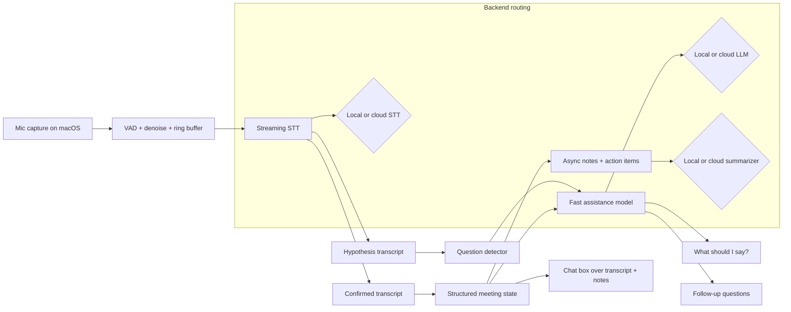

# Building a Real-Time macOS Meeting Assistant on Apple Silicon

## Executive summary

A macOS meeting-assistant app with live transcription, reply coaching, follow-up suggestions, notes, and a chat surface is technically feasible on Apple Silicon, but only if “real-time” is defined narrowly and budgeted per component. In human conversation, average turn-transition gaps are on the order of about 200 ms, which means a coaching system that waits for a full, polished answer will often miss the social window unless it streams partial intent early. At the same time, classical telecom guidance shows that highly interactive voice tasks are affected by delays much lower than 400 ms, and general UX guidance still treats about 100 ms as the boundary for “instantaneous” feedback and about 1 s as the boundary before flow feels interrupted. In practice, a meeting assistant should therefore target three different real-time tiers rather than one: immediate UI acknowledgment in under 100 ms, live caption partials in roughly sub-second territory, and first useful reply coaching within roughly 0.8–1.5 s after enough of the question is known to answer it. citeturn5search13turn39view0turn5search18turn36search8turn37search0

For the transcription path, Apple’s current native stack is materially stronger than the older speech APIs for meeting use cases: Apple’s WWDC 2025 SpeechAnalyzer session explicitly says the new model is faster, more flexible, and suitable for long-form and distant audio such as lectures, meetings, and conversations. If you need a fully local secondary path or broader model control, WhisperKit and whisper.cpp are the strongest Apple-centric open-source options in the sources reviewed here. WhisperKit’s paper reports sub-second transcription behavior through dual “hypothesis” and “confirmed” streams, 45% lower decoder latency on M3 ANE via stateful Core ML, and a 75% drop in per-forward-pass energy for that decoder path; whisper.cpp documents Apple Silicon optimization via Metal and Core ML, with encoder execution on the Apple Neural Engine yielding more than 3× speed-up versus CPU-only execution. citeturn38search1turn19view0turn12view1turn12view6

For local reply coaching, Apple Silicon performance is good enough for short suggestions on the right hardware, but decode throughput is strongly memory-bandwidth-bound rather than purely generation-dependent. Public llama.cpp Apple Silicon benchmarks show 7B Q4 text generation around 14.13 tok/s on an M1 MacBook Air, 21.91 tok/s on an M2 10-GPU system, 37.87 tok/s on an M2 Pro 16-GPU system, and 66.31 tok/s on an M3 Max 40-GPU system. Notably, M3 Pro can trail M2 Pro on decode because Apple’s official specs show lower memory bandwidth for M3 Pro than M2 Pro, and Apple’s MLX research separately notes that time-to-first-token is compute-bound while subsequent generation is memory-bandwidth-bound. That makes the architectural conclusion straightforward: for always-on local coaching, keep the live assistant model small and quantized, and reserve larger models for asynchronous notes, explicit button taps, or cloud escalation. citeturn14view3turn14view1turn14view2turn26search1turn26search2turn33search11

The most robust product architecture is hybrid by default: on-device audio capture and VAD, on-device streaming STT when privacy or network quality requires it, a small local LLM for “What should I say?” and “Follow-up questions,” and an optional cloud model for higher-quality rewrite, action-item extraction, and difficult long-context queries. GitHub Copilot should not be treated as a local model backend, because GitHub’s own docs describe Copilot models as cloud-hosted through providers such as AWS, Anthropic, and Google Cloud. OpenAI Codex is split: Codex Web is cloud-based, while Codex CLI runs locally on the user’s computer. Both are coding-oriented rather than meeting-oriented, so they make sense only as pluggable backends if you explicitly want a general agent adapter layer. citeturn25search1turn25search4turn25search9

## What real-time means in live meetings

The most common design failure in meeting assistants is treating “real-time” as a single number. It is better to define it against the user’s actual task.

The first task is **perceptual liveness**. When the user begins speaking, asks for help, or taps a button, the app must acknowledge that event almost immediately. Apple’s responsiveness guidance treats main-thread work longer than about 100 ms as a hang, and Apple’s display guidance notes that a 60 Hz screen updates every 16.7 ms. For this class of work, meters, typing indicators, “listening…” affordances, and transcript cursor motion should stay well below 100 ms end-to-end, and preferably within one frame or a few frames. citeturn36search8turn37search0

The second task is **caption real-time**. Users will tolerate partial captions that lag the speaker slightly, but not so much that names, numbers, or follow-up turns arrive too late to be useful. OpenAI’s realtime transcription guide explicitly frames this as a latency/accuracy tradeoff: lower delay yields earlier partial text, while higher delay improves quality through more context. Deepgram’s latency guide similarly distinguishes transcript latency from end-of-turn latency and notes that server-side transcription latency is optimized to 300 ms or less for streaming workloads, with network and client buffering layered on top. In practice, a meeting-caption experience is meaningfully real-time if first partial text is usually visible within roughly 300–700 ms and stable text follows within roughly 1–2 s. That is an engineering inference from vendor streaming semantics, not a universal standard. citeturn24view1turn24view0

The third task is **conversation-assistance real-time**. Human turn-taking research shows average turn-transition gaps near 200 ms across languages, so a system that waits until the other person fully stops, finalizes every word, and then starts thinking will usually be too slow for natural spontaneous response. The usable product definition is therefore not “final answer complete,” but “first useful suggestion appears before the user’s reply window closes.” That usually means a short, interruptible coaching snippet in roughly 0.8–1.5 s after enough of the question is understood, not after the entire utterance is perfectly finalized. Beyond about 2 s, assistance still helps for difficult questions, but increasingly becomes “after-the-fact advice” rather than live turn support. citeturn5search13turn5search18turn39view0

The fourth task is **meeting summarization real-time**. Notes and action items do not need turn-taking speed. They need freshness, stability, and low disruption. A summary panel updated every 30–90 s, or at topic boundaries, is still functionally real-time in meeting software if the visible lag is small enough that users trust it as a live artifact rather than a post-process batch job. This is precisely why systems such as WhisperKit separate a low-latency hypothesis stream from a more stable confirmed stream: the UI can remain responsive without letting unstable text pollute durable notes. citeturn19view0

A practical threshold map for a meeting assistant is therefore:

| Layer | Precise definition | Strong target | Usually acceptable | Usually too slow |
|---|---|---:|---:|---:|
| UI acknowledgement | user event to visible feedback | < 50 ms | < 100 ms | > 100 ms |
| Live caption partial | contributing audio to first visible partial | 300–700 ms | 700–1500 ms | > 2000 ms |
| Live caption stable | utterance end to stable transcript | 500–1200 ms | 1200–2500 ms | > 3000 ms |
| Reply coaching | question evidence to first useful phrase | 800–1200 ms | 1200–1500 ms | > 2000 ms |
| Button-driven follow-ups | tap to first streamed text | 150–500 ms | 500–1000 ms | > 1500 ms |

These numeric bands are engineering targets synthesized from conversational turn-taking, voice-delay guidance, UI responsiveness guidance, and streaming API behavior, not a published single-source standard. citeturn5search13turn39view0turn5search18turn36search8turn37search0turn24view0turn24view1

```mermaid
gantt
    title Meeting-assistant latency budget for a strong live experience
    dateFormat  X
    axisFormat %L ms

    section Audio path
    Capture + VAD + enqueue           :a1, 0, 40
    STT first partial                 :a2, 40, 500
    Stable transcript                 :a3, 500, 900

    section Assistance path
    Question detection + retrieval    :b1, 350, 120
    LLM first streamed tokens         :b2, 470, 350
    First useful reply suggestion     :milestone, 820, 0

    section UI path
    Render transcript delta           :c1, 540, 20
    Render coaching card              :c2, 820, 20
```



## Latency decomposition and how to measure it

The latency budget only becomes actionable when every segment is measured separately. For a meeting assistant, there are four load-bearing latency dimensions.

The first is **audio-capture latency**. On Apple platforms, hardware and engine time information is exposed through Core Audio timestamps. Apple’s AudioDeviceIOBlock docs describe the timestamp as the time at which the first frame in the buffer is passed to the hardware, while the Audio Unit latency docs explain that presentation latency includes device latency, safety offset, I/O buffer size, and processing latency in the audio chain. Apple’s own pro-audio support docs for Logic Pro and MainStage also reiterate the practical rule: smaller I/O buffers reduce latency but consume more processing headroom; larger buffers do the reverse. In a meeting assistant, this dimension should be measured from hardware or engine timestamp to the moment the buffer is enqueued into the STT pipeline, not from “microphone button pressed.” citeturn35search15turn35search11turn35search9turn35search1

The second is **STT latency**, and it must be split into at least three metrics: transcript latency, stable-text latency, and end-of-turn latency. Deepgram’s docs make this distinction explicit and recommend measuring both transcript latency and EOT latency for streaming systems. OpenAI’s realtime transcription documentation adds a directly relevant control point: `audio.input.transcription.delay`, with settings from `minimal` to `xhigh`, which should be tuned empirically because the exact millisecond impact varies by configuration. That means your benchmark harness should log: timestamp of last audio sample contributing to a token, timestamp of first hypothesis token, timestamp of first confirmed token, timestamp of utterance-end event, and timestamp of final transcript commit. citeturn24view0turn24view1

The third is **LLM response latency**. Here the right KPI is almost never total completion time. It is a bundle of metrics: turn-detection latency, request dispatch time, time to first token, time to first useful phrase, steady-state tokens per second, and full-response time. Anthropic’s streaming docs warn that tool-use can introduce quiet gaps between streaming events while the model is still working; Apple’s and Google’s real-time systems similarly encourage thinking in terms of continuous streams rather than one opaque request. For a meeting assistant, “time to first useful phrase” is the most important metric, because a suggestion like “Start with: ‘Yes, here’s the main point…’” is useful even if the rest of the paragraph streams later. citeturn24view2turn24view4

The fourth is **UI update latency**. Apple’s guidance on responsiveness and hitches gives two hard constraints that are directly relevant: keep main-thread stalls under roughly 100 ms to avoid hangs, and remember that at 60 Hz the frame budget is 16.7 ms. So the UI should log at least four points: model delta received, state update applied, layout/commit finished, and frame displayed. If transcript scrolling or coaching cards cause visible hitches, the problem is no longer “LLM latency”; it is render-loop latency. citeturn36search8turn37search0

A measurement matrix that is sufficiently precise for engineering decisions looks like this:

| Dimension | What to record | Canonical measurement method | Expected strong range |
|---|---|---|---|
| Audio capture | hardware/engine timestamp → STT enqueue | `AudioTimeStamp` / input callback timestamp + `os_signpost` around enqueue | 5–40 ms p95 with tuned buffers |
| STT first partial | last contributing sample → first visible hypothesis token | per-chunk signposts; log token times and contributing sample offset | 300–700 ms |
| STT stable/final | utterance end → stable/final visible transcript | VAD/EOT signpost + confirmed transcript signpost | 500–2000 ms |
| LLM first token | request start → first streamed token | websocket/SSE timestamping + signposts | 150–1200 ms depending backend |
| First useful suggestion | request start → first semantically usable clause | post-process token stream; mark first phrase boundary | 300–1500 ms |
| UI data-to-visible | delta received → frame displayed | `os_signpost` + Core Animation / hitches instruments | < 50 ms, with no > 100 ms stalls |

The instruments to use are also straightforward. Apple documents `os_signpost`/Points of Interest for marking intervals, Power Profiler in Instruments for subsystem power costs, CPU Counters and Processor Trace for Apple Silicon CPU analysis, audio performance instruments for engine timing, and Core ML tooling for inference timing and compute-device usage. For network behavior, Apple’s WWDC network guidance explicitly points developers to `networkQuality` and Network Link Conditioner for realistic delay testing. citeturn31search4turn31search1turn31search3turn35search2turn2search15turn30search6

## Architecture and buffering strategy

The right architecture is not one giant pipeline. It is three pipelines that share audio and transcript state but not latency budgets.

The first is the **caption pipeline**. This pipeline should ingest microphone audio continuously, perform local VAD and echo/noise gating, and feed a streaming STT system that emits both unstable and stable text. WhisperKit’s “hypothesis” and “confirmed” streams provide a useful conceptual model even if you choose another backend: use unstable text for the scrolling live transcript, but only stable text for persistent notes, action items, embeddings, and chat grounding. That keeps the interface lively without creating note churn from retroactive transcript corrections. citeturn19view0

The second is the **assistance pipeline**. This pipeline should not wait for full transcript finalization. It should watch the most recent live transcript window, detect likely questions or requests, and trigger a small, fast model that returns short streamed coaching. The “What should I say?” button should force this path on demand using the last stable transcript plus a narrow rolling hypothesis window. The “Follow-up questions” button should use the same context, but produce a fixed small list of candidate questions. This path benefits heavily from streaming; even a one-sentence suggestion shown early is useful, while a perfect paragraph shown late often is not. Anthropic’s docs are a useful caution here: when tool use is involved, streaming can visibly pause while the model is working, so tool-heavy flows should be used sparingly on the critical path. citeturn24view2

The third is the **notes pipeline**. This should run asynchronously over stable transcript windows, not token-by-token. A practical design is hierarchical summarization: keep a 30–90 s rolling topic buffer, summarize it into structured notes and action-item candidates, then fold those summaries into a longer-lived meeting state. This prevents the LLM context from growing without bound and materially reduces long-meeting degradation. The core reason is algorithmic: transformer attention costs grow with sequence length, and KV-cache memory also grows with sequence length, making long prompts and long sessions slower and heavier over time. citeturn22search0turn22search1turn22search2

A strong reference architecture looks like this:



The buffering defaults that make sense for first implementation are conservative rather than extreme: keep input audio in short fixed-size frames, batch only modestly before network send, and keep separate bounded queues for transcript UI, assistance, notes, and archival logging. The thing to avoid is a single unbounded queue whose backlog makes the app look progressively “laggier” over a 90-minute meeting. This is especially important in hybrid stacks, where network path variation can silently increase queue dwell time.

Streaming and non-streaming are best treated as complementary, not mutually exclusive. Streaming wins on perceived latency, partial utility, and smooth UX. Non-streaming wins on implementation simplicity, output stability, and sometimes accuracy. Hugging Face’s Whisper large-v3 guidance explicitly notes that chunked processing is preferable when speed matters for a single long file, while the sequential long-form algorithm can be up to about 0.5% WER more accurate when speed matters less. OpenAI’s realtime transcription docs make the same tradeoff explicit through configurable delay. The implication is clear: stream for captions and coaching, but use stable windows or non-streaming passes for durable notes and final export. citeturn15search7turn24view1

Network variability matters more than many app teams assume. Deepgram’s latency guide separates connection latency from per-message latency. IETF RTP guidance defines jitter as variation in packet spacing and timing, and packet-delay-variation work exists specifically because variation, not just average RTT, determines how much buffering a real-time system needs. Apple’s `networkQuality` guidance and Network Link Conditioner support are therefore not optional nice-to-haves; they are part of the minimum acceptable benchmark setup for any hybrid design. A practical policy is: keep the websocket warm, continuously measure loaded latency and reconnect time, and switch to local STT or local coaching when loaded responsiveness deteriorates enough that streaming deltas stop arriving inside your product’s usable window. citeturn24view0turn6search1turn6search3turn30search6

## Apple Silicon performance and long-meeting sustainability

Apple Silicon makes this category unusually attractive because the hardware is unified-memory and the tooling for on-device ML has become materially better. Apple’s Core ML guidance emphasizes fully on-device execution, privacy, efficient transformer operations, model compression, and stateful models. Apple’s stateful-model docs say that, starting with macOS 15, model state can persist across inference runs. WhisperKit’s paper shows exactly why this matters in practice: by keeping the decoder KV cache in state rather than shuttling it as tensors, the team cut decoder latency on M3 ANE from 8.4 ms to 4.6 ms and reduced energy for that forward pass from 1.5 W to 0.3 W. For a meeting assistant that runs for 1–4 hours, that kind of per-step efficiency is the difference between a plausible laptop feature and a thermal problem. citeturn21search2turn21search0turn19view0

There is also an important runtime split on Apple hardware. MLX is optimized for Apple Silicon’s unified memory model and currently runs operations on CPU and GPU, not ANE. That makes it attractive for local LLMs, especially when you want developer flexibility and easy model bring-up. By contrast, whisper.cpp’s Core ML path and Apple native Core ML stacks can use ANE-friendly execution for supported models and operators. That suggests a deliberately asymmetric design: use Core ML / ANE-oriented execution for always-on streaming STT where power-per-watt matters most, and use GPU-oriented local runtimes such as MLX or llama.cpp for short-burst reply generation where flexibility matters more. citeturn12view2turn12view4turn11search2turn12view6

The local LLM benchmark data in the reviewed sources is strong enough to support concrete device-tier guidance. The table below uses public llama.cpp Apple Silicon benchmark results for a 7B Q4 model with full Metal offload. These are not your exact application latencies, but they are a reproducible and useful decode-throughput baseline.

| Apple Silicon class | Prompt processing, 7B Q4 | Text generation, 7B Q4 | Interpretation for meeting assistance |
|---|---:|---:|---|
| M1 MacBook Air 8 GPU | 115.67 tok/s | 14.13 tok/s | Viable for short local hints; keep output short and context clipped. citeturn14view3 |
| M2 10 GPU | 179.57 tok/s | 21.91 tok/s | Acceptable for short “What should I say?” streaming on-device. citeturn14view1 |
| M2 Pro 16 GPU | 294.24 tok/s | 37.87 tok/s | Comfortable local assistant tier for 3B–8B quantized models. citeturn14view1 |
| M3 Pro 18 GPU | 341.67 tok/s | 30.74 tok/s | Better prompt processing, but decode can trail M2 Pro because bandwidth matters. citeturn14view2turn26search1turn26search2 |
| M3 Max 40 GPU | 759.70 tok/s | 66.31 tok/s | Strong local-first machine; practical for richer on-device assistance. citeturn14view2 |

That M2 Pro versus M3 Pro result is not noise; it reinforces a real systems principle. Apple’s official specs put M2 Pro at 200 GB/s memory bandwidth and M3 Pro at 150 GB/s in the referenced configurations, while Apple’s MLX research notes that TTFT is compute-bound and subsequent token generation is memory-bandwidth-bound. Decode-heavy applications like live coaching therefore do not always improve monotonically with chip generation. If your product depends on sustained local generation throughput, memory bandwidth matters at least as much as CPU generation. citeturn26search1turn26search2turn33search11

For higher-scale local inference, newer Apple-centric research is promising but not yet the default baseline most teams should optimize around. A 2026 vLLM-MLX paper reports 21%–87% higher throughput than llama.cpp on Apple hardware across selected models and up to 525 tok/s on M4 Max with 4.3× aggregate throughput at 16 concurrent requests. That is impressive, but it is a newer framework result on newer silicon, not the safest starting point for a production meeting assistant that needs stable, debuggable single-user behavior today. For most teams, the highest-confidence production choices today are still MLX or llama.cpp for local LLMs, and Apple SpeechAnalyzer / Core ML / WhisperKit for local STT. citeturn13view1turn13view3turn34view0

Performance over 1–4 hour meetings can degrade, but not for one single reason. The major causes are predictable. First, if transcript and prompt context grow unbounded, transformer prefill gets slower and KV-cache memory grows with sequence length. Second, if you push GPU-heavy local models continuously on fanless or light-cooling systems, thermal limits and power-state changes can reduce sustained throughput. Third, if you stream through the network, changing RTT, jitter, or websocket reconnect behavior can silently increase effective transcript lag even when server processing time stays flat. The engineering takeaway is that long-term stability is mostly an architecture problem: cap contexts, summarize hierarchically, reset or compact long sessions, and keep local always-on work power-efficient. citeturn22search0turn22search1turn22search2turn19view0turn24view0turn6search1turn6search3

## STT and LLM option comparison

The tables below prioritize options that are credible for a macOS meeting assistant and for which the reviewed sources provide enough documentation to support architectural decisions. Where vendors do not publish directly comparable standardized latency or accuracy figures, the table says so rather than pretending the data is cleaner than it is.

### STT options

| Option | Runs where | What the source documents | Latency and accuracy implications | Cost | Privacy posture |
|---|---|---|---|---|---|
| Apple SpeechTranscriber via SpeechAnalyzer | On device | Apple describes SpeechTranscriber as suitable for normal conversation and says the new SpeechAnalyzer model is faster, more flexible, and good for meetings, lectures, and conversations. citeturn38search0turn38search1 | Strong candidate for privacy-first macOS apps; benchmark yourself because Apple does not publish a directly comparable WER/latency table in the sources reviewed here. | No per-minute API fee. | Best privacy; transcript can stay entirely on device. citeturn21search2turn38search1 |
| WhisperKit | On device | WhisperKit documents real-time streaming and device benchmarks; maintainers report Large V3 Turbo at 42× real-time on M2 Ultra with default ANE-only config and up to 72× with GPU+ANE. The paper reports sub-second latency behavior and lower power via stateful ANE execution. citeturn12view7turn16view0turn19view0 | Excellent Apple-first local fallback or primary STT path, especially for long meetings and offline use. | No per-minute API fee. | On device. |
| whisper.cpp with Core ML encoder | On device | whisper.cpp is optimized for Apple Silicon via Metal and Core ML; Core ML encoder support can yield more than 3× speed-up over CPU-only; first run is slower because model compilation is device-specific. citeturn12view1turn12view6 | Very strong open-source baseline when you want raw control and C/C++ portability, but you must benchmark streaming wrappers and correction behavior yourself. | No per-minute API fee. | On device. |
| OpenAI GPT-Realtime-Whisper | Cloud | OpenAI documents realtime transcription deltas, delay controls from `minimal` to `xhigh`, and pricing at $0.017/min. OpenAI also documents newer GPT-4o transcribe models as improving WER over original Whisper. citeturn24view1turn9search0turn32search0 | Strong managed streaming option when network is reliable; exact app-level latency depends on delay setting and RTT. | $0.017/min for GPT-Realtime-Whisper. citeturn9search0 | Audio/transcript leave device. |
| Deepgram streaming STT | Cloud | Deepgram separates transcript latency from EOT latency and states server-side transcription latency is optimized to 300 ms or less for streaming. Deepgram’s docs and product pages emphasize streaming use; pricing details in the reviewed sources are not as cleanly exposed for current flagship models as for OpenAI or Google. citeturn24view0turn23search8 | Excellent latency posture on paper; still benchmark under your own RTT and buffering conditions. | Verify current plan/model pricing directly before procurement. | Audio/transcript leave device. |
| Google Cloud Speech-to-Text with Chirp | Cloud | Google’s docs position Chirp 3 as offering enhanced multilingual accuracy and speed. Google’s pricing page states billing by processed audio seconds and the review-page snippet shows standard rates such as $0.016/min with logging and $0.024/min without logging for standard recognition. citeturn32search2turn8search0 | Good multilingual managed option; latency must be benchmarked in your own gRPC/WebSocket path. | Standard recognition starts around $0.016/min with logging or $0.024/min without logging in the retrieved pricing snippet. citeturn8search0 | Audio/transcript leave device. |

### LLM options for live coaching and notes

| Option | Runs where | What the source documents | Latency and quality implications | Cost | Privacy posture |
|---|---|---|---|---|---|
| Apple Foundation Models framework | On device | Apple documents direct Swift access to the on-device model and highlights guided generation, tool calling, and offline operation. citeturn2search0turn1search2 | Attractive for privacy-first, low-network, Apple-only deployments; benchmark carefully because public comparative latency/quality data for this exact meeting-assistant task is still sparse in the reviewed sources. | No API fee. | On device. |
| Local MLX / llama.cpp with 3B–8B quantized instruct model | On device | MLX is unified-memory, Apple-Silicon-focused, CPU/GPU-only; llama.cpp is optimized for Apple Silicon via NEON, Accelerate, and Metal. Public Apple Silicon benchmarks show meaningful on-device decode rates, but long-context slowdown and runtime tradeoffs remain real. citeturn12view2turn12view4turn12view0turn34view0turn14view1turn14view2turn14view3 | Best fit for instant short coaching, lower privacy risk, and predictable cost; weaker than frontier cloud models for nuanced social reasoning unless prompts are tightly scoped. | No API fee beyond local compute/battery. | On device. |
| OpenAI Realtime / text models | Cloud | OpenAI pricing docs expose GPT-Realtime and GPT-Realtime-mini token prices, and OpenAI’s realtime docs focus on low-latency audio/text interaction. citeturn7search4turn23search5 | Strong managed option for fast streamed suggestions and cloud notes; quality/cost tradeoffs depend heavily on model choice. | GPT-Realtime-mini text pricing in the retrieved pricing snippet is $0.60/M input and $2.40/M output; audio pricing is higher. citeturn7search4 | Prompt and transcript leave device. |
| Anthropic Claude Haiku 4.5 | Cloud | Anthropic documents Haiku 4.5 as the fastest Claude for latency-sensitive applications and gives official pricing of $1/M input and $5/M output tokens. Anthropic also documents that tool use can introduce quiet gaps during streaming. citeturn24view3turn40search3turn40search12turn24view2 | Strong cloud option for low-latency text coaching; avoid complex tool chains on the hot path. | $1/M input, $5/M output. citeturn40search3 | Prompt and transcript leave device. |
| Gemini Live / Gemini Flash Live | Cloud | Google’s Live API is explicitly positioned for low-latency real-time voice and vision interaction over stateful WebSockets with barge-in and tool use. citeturn24view4turn23search11 | Attractive if you want a single live multimodal agent path; benchmark carefully because pricing and latency vary by exact Live model generation. | Token-billed; verify the exact Live model generation and rate currently in production. | Prompt, audio, and transcript leave device. |
| GitHub Copilot / Codex adapters | Mostly cloud, except Codex CLI local execution | GitHub documents Copilot models as cloud-hosted by providers such as AWS, Anthropic, and Google Cloud. OpenAI documents Codex Web as cloud-based and Codex CLI as local on the user’s machine. citeturn25search1turn25search4turn25search9 | Feasible only as a backend-adapter experiment; these products are coding-oriented, not meeting-oriented, so they are usually a mismatch for natural conversational coaching. | Product-plan based, not optimized for this use case. | Varies by product path; Copilot is not local-only. |

A design implication follows from the tables: if the product promise is **privacy-first and reliable under unstable Wi‑Fi**, the strongest composition is Apple SpeechAnalyzer or WhisperKit for STT plus Apple Foundation Models or a small local MLX/llama.cpp model for coaching, with optional cloud escalation for notes export. If the product promise is **quality-first and managed infrastructure**, use local audio capture and buffering, then cloud STT plus a fast cloud text model, but keep a local emergency fallback for STT and a minimal local reply generator when network responsiveness drops. citeturn38search1turn19view0turn2search0turn12view2turn24view4turn24view3turn30search6

## Reproducible benchmark plan and scripts

A credible benchmark plan needs to separate silicon, battery state, thermal state, model choice, and network condition. The minimum test matrix should include at least one base-tier machine, one Pro-tier machine, and one Max-tier machine from the M1/M2/M3 families. For example: M1 Air 16 GB, M2 Pro Mac mini 16–32 GB, and M3 Max MacBook Pro 36–64 GB. The benchmark scenarios should include a quiet single-speaker meeting, a noisy two-speaker overlap case, a long monologue with domain terminology, and a 90-minute stress run with rolling notes and chat interactions. These scenarios should be run in local-only mode, cloud-only mode, and hybrid mode; and for hybrid mode, under good Wi‑Fi, constrained Wi‑Fi, and impaired network conditions via Link Conditioner or real `networkQuality` logging. citeturn30search6turn17view0turn12view5

The KPIs that matter most are:

- caption first-partial latency, stable-transcript latency, and EOT latency;
- first useful coaching latency and tokens/s;
- UI hitches and main-thread stalls;
- CPU/GPU/ANE utilization and power over 1 h, 2 h, and 4 h runs;
- memory high-water mark, context length, and queue backlog;
- degradation slope over time rather than only median performance.

For instrumentation, Apple’s own tooling is sufficient for most of the work: signposts/Points of Interest for interval timing, Power Profiler for subsystem power, CPU Counters and Processor Trace for CPU analysis, audio instruments for input timing, and Core ML instrumentation for inference timing and compute-device usage. citeturn31search4turn31search1turn31search3turn35search2turn2search15

A practical signpost wrapper in Swift is enough to anchor the whole trace:

```swift
import os

enum Perf {
    static let log = OSLog(subsystem: "com.example.meetingassistant", category: .pointsOfInterest)
    static let signposter = OSSignposter(log: log)
}

struct Span {
    let state: OSSignpostIntervalState
    init(_ name: StaticString) {
        state = Perf.signposter.beginInterval(name)
    }
    func end(_ message: StaticString = "") {
        Perf.signposter.endInterval(message, state)
    }
}

// Example usage
func handleAudioBuffer(_ bufferID: UInt64) {
    let span = Span("AudioCaptureToEnqueue")
    // enqueue PCM to STT
    span.end("buffer=\(bufferID)")
}
```

The capture path should log the engine or hardware timestamp, enqueue time, and first transcript callback. The assistance path should log question-detected time, request dispatch time, first token, first useful phrase, and completion. The UI layer should log delta-received time and frame-displayed time.

For local STT benchmarking, WhisperKit already ships a reproducible benchmark workflow. Its `BENCHMARKS.md` documents `make list-devices`, `make benchmark-devices`, the Xcode/Fastlane setup, output locations, and JSON export. That is the highest-confidence starting point if you want cross-device Apple-native STT measurements without inventing your own harness first. citeturn17view0

For local LLM benchmarking, the clearest reproducible baseline in the reviewed sources is the public llama.cpp Apple Silicon thread, which publishes the exact benchmark command used for a standard 7B model:

```bash
git checkout 8e672efe
make clean && make -j llama-bench && ./llama-bench \
  -m ./models/llama-7b-v2/ggml-model-f16.gguf  \
  -m ./models/llama-7b-v2/ggml-model-q8_0.gguf \
  -m ./models/llama-7b-v2/ggml-model-q4_0.gguf \
  -p 512 -n 128 -ngl 99 2> /dev/null
```

That benchmark was explicitly collected to compare Apple Silicon M-series devices and reports both prompt-processing and text-generation tokens per second. citeturn12view5

For long-meeting power and system profiling on macOS, a minimal shell harness should collect network state, power samples, and app logs in parallel:

```bash
#!/usr/bin/env bash
set -euo pipefail

RUN_ID="${1:-run-$(date +%Y%m%d-%H%M%S)}"
mkdir -p "$RUN_ID"

# Snapshot network responsiveness before the run
networkQuality -c > "$RUN_ID/networkquality_pre.json" || true

# Start power sampling (requires sudo on most systems)
sudo powermetrics --samplers cpu_power,gpu_power,thermal \
  --show-process-energy -i 1000 > "$RUN_ID/powermetrics.txt" &
PWR_PID=$!

# Collect app signposts / logs
log stream --style compact \
  --predicate 'subsystem == "com.example.meetingassistant"' \
  > "$RUN_ID/app.log" &
LOG_PID=$!

echo "Running benchmark... press Ctrl+C when done"
wait || true

kill $PWR_PID $LOG_PID 2>/dev/null || true
networkQuality -c > "$RUN_ID/networkquality_post.json" || true
```

And for post-processing, the analysis script should not stop at averages. It should compute p50, p95, p99, and slope-over-time segments, because a 4-hour meeting often fails through drift rather than an obvious crash. A simple analysis pipeline should bucket metrics into 15-minute windows and answer questions such as: did EOT latency rise, did first useful suggestion time rise, did watts rise, and did queue depth increase?

A pass/fail gate for release candidates can be simple and strict:

- no p95 main-thread stall above 100 ms;
- no p95 caption first-partial above 1.5 s on the chosen production path;
- no p95 “What should I say?” first useful suggestion above 2 s on the user’s target hardware tier;
- no monotonic latency drift greater than a defined threshold across a 90-minute soak run;
- no unbounded memory growth.

## Actionable recommendations

If the product goal is a serious macOS meeting assistant, the best near-term architecture is **local-first STT plus bounded-context assistance plus asynchronous notes**. That is the strongest way to satisfy both privacy and latency constraints with today’s Apple Silicon ecosystem. Apple’s current native speech stack is explicitly aimed at meetings and long-form conversation, and WhisperKit gives you a mature open-source alternative with ANE-aware performance work that directly addresses latency and power. citeturn38search1turn19view0

For the assistance layer, start with a **small local model** rather than a big local model. On M1-class machines, use short prompts and very short outputs, because 7B Q4 around 14 tok/s is viable for a one-sentence streamed hint but not for heavy multi-feature agent behavior. On M2 Pro and especially M3 Max, on-device assistance becomes much more comfortable. This is also where the M-series SKU choice matters: for decode-heavy use, memory bandwidth is often the real bottleneck. citeturn14view3turn14view1turn14view2turn26search1turn26search2turn33search11

The two buttons should not be implemented symmetrically. **“What should I say?”** should be wired to the fastest low-context path in the system: recent stable transcript, narrow recent hypothesis window, a small prompt template, and a short streamed answer. **“Follow-up questions”** can tolerate slightly more latency and should use a richer context summary. The chat box should sit on top of stable transcript, rolling summaries, and extracted action items, not directly on top of raw full-meeting token history. That keeps both latency and degradation under control. The confirmed/hypothesis separation documented by WhisperKit is the clearest supporting pattern for this decision. citeturn19view0

Cloud backends should be used deliberately, not reflexively. OpenAI Realtime, Anthropic Haiku, and Gemini Live all make sense for high-quality or higher-capability assistance, but they introduce transport variability and, in some architectures, extra quiet time around tools or endpointing. They are best suited to explicit user actions, fallback paths, or higher-quality notes generation rather than the innermost always-on hot path—unless you can prove, with your instrumentation, that the real network path consistently stays inside your latency budget. citeturn23search5turn24view2turn24view3turn24view4turn24view0turn30search6

The single biggest cause of long-meeting slowdown will be **context growth**, not Apple Silicon itself. Keep the live assistance prompt bounded, summarize older context, and treat the meeting as a sequence of compacted topical states rather than one endlessly growing conversation. The transformer and KV-cache literature makes the direction of scaling clear, and the Apple Silicon benchmark evidence reinforces that long-context behavior must be managed rather than assumed away. citeturn22search0turn22search1turn22search2turn34view0

Finally, if you need a crisp product decision tree:

- If **privacy/offline capability** is the top requirement, choose Apple SpeechAnalyzer or WhisperKit, plus Apple Foundation Models or a small MLX/llama.cpp model.
- If **best overall response quality** is the top requirement and network is acceptable, keep capture and buffering local, but use a cloud LLM for explicit coaching and notes.
- If you must support **all M1/M2/M3 consumer laptops without user frustration**, make cloud LLM the default for rich suggestions and keep local LLM limited to emergency fallback or very short coaching.
- If you intend to market **“real-time”** aggressively, do not use the term unless you can demonstrate p95 first useful suggestions under about 1.5 s and p95 caption partials under about 1.5 s on representative hardware and networks.

## Open questions and limitations

Some information in this space is not published in a standardized, apples-to-apples way. In particular, vendors do not generally publish directly comparable meeting-assistant TTFT, stable-transcript latency, or real-world 1–4 hour degradation curves under identical hardware and network assumptions. Apple’s native speech and foundation-model stacks are also newer than Whisper/llama-style ecosystems, so public third-party benchmark coverage is thinner than for open-source runtimes. For those reasons, the most important numbers in this report are the **measurement framework and per-component latency budgets**, not any single headline benchmark outside your own target devices and workloads.