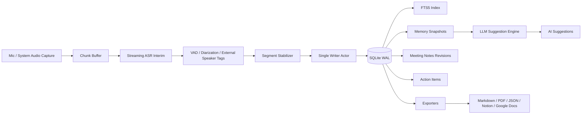
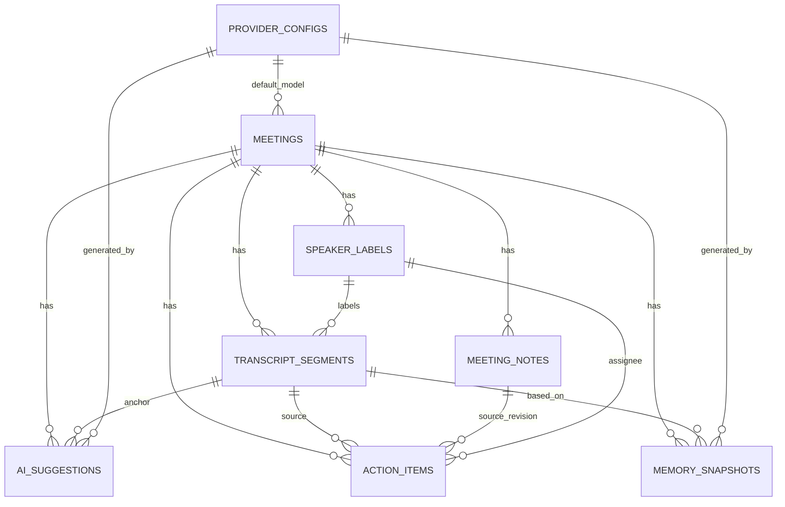

# macOS 會議助理 App 的本機資料結構與 SQLite 儲存設計

## 執行摘要

這類 macOS 會議助理的儲存負載，核心不是一般 CRUD，而是「高頻追加寫入 + 毫秒級時間軸查詢 + 長文本搜尋 + 版本化摘要/筆記 + 可插拔模型設定」。在這個前提下，**直接 SQLite 當作主事實來源**通常比把熱路徑交給 SwiftData 或 Core Data 更合適：SQLite 原生就有 WAL、FTS5、partial index、generated columns、JSON 函式、online backup 與 `VACUUM INTO` 等能力；而 SwiftData 雖然有 migration、ModelActor、history、自訂 store 與 iCloud 同步優勢，但它預設仍建立在 Core Data 後端上，對 transcript 這種 append-heavy 工作負載的細部控制較少。Core Data 則適合把「CloudKit 同步、背景 context、batch operation、persistent history」放在第一優先。若「跨裝置 iCloud/CloudKit 同步」是第一天就必須的硬性需求，Core Data 是 Apple 原生方案中更穩健的選擇；若主要訴求是本機即時錄音轉寫與搜尋，直接 SQLite 最合理。 citeturn22view1turn20search0turn20search1turn20search10turn16search0turn16search1turn1search26turn1search0turn1search1turn19search5turn19search0turn5search1turn23search18turn14search2turn36search4

推薦的落地做法是：**一個 SQLite 主庫作為會議、逐段 transcript、speaker labels、AI suggestions、meeting notes revisions、action items、memory snapshots、provider configs 的持久層；錄音檔與其他大型二進位資料放在外部 sidecar 檔案；provider API key 只在 Keychain 中保存引用，不進資料庫**。即時寫入採單一 writer actor/queue、WAL 模式、100–300ms 批次 commit；搜尋用 FTS5 external-content table；notes 預設採「不可變 revision + current head」的簡單版本法，只有在你真的要做**多使用者/多裝置同筆記同時編輯**時，才考慮 OT 或 CRDT。 citeturn22view2turn39search1turn20search0turn36search12turn2search3turn2search10turn15search0turn15search17turn15search6

下表是決策濃縮版：

| 情境 | 建議 |
|---|---|
| 本機即時轉寫、毫秒時間軸、全文搜尋是主戰場 | 直接 SQLite 當主庫 |
| 同一使用者多裝置 iCloud/CloudKit 同步是第一優先 | Core Data 優先；SwiftData 次之 |
| 純 SwiftUI、小型資料模型、開發速度優先 | SwiftData 可行，但不宜主扛 transcript 熱路徑 |
| 需要 provider 可插拔、模型能力旗標、嚴格 migration/backup/restore | 直接 SQLite 最容易精準控制 |

這個結論基於 Apple 與 SQLite 官方文件；表中「熱路徑表現」「檔案體積」屬工程推論，而非 Apple 官方 benchmark。 citeturn1search26turn1search2turn5search1turn23search18turn23search0turn22view1turn16search0turn16search1

## 前提與推薦架構

本報告採以下前提：未指定最大會議長度，因此假定單場可能從數分鐘到數小時；未指定 retention period，因此以下會提出**預設政策**，但視為可配置而非硬編碼；系統以**local-first** 為前提，離線可用；若日後要加同一使用者跨裝置同步，應同步「結構化資料」而不是直接同步**活的 SQLite 主檔**。這一點很重要，因為 SQLite WAL 需要同主機共享記憶體，不適合把活躍中的 WAL 資料庫當作一般網路檔案系統上的共享檔；若你真的要做雲端同步，應改用 CloudKit/record-level sync 或匯出檔案。 citeturn22view1turn22view2turn36search4turn1search2

另外，長錄音、系統聲音快取、embedding 向量檔、PDF 匯出中間產物，都不應直接塞進主 SQLite。Apple 文件對大型 BLOB 的建議也明確偏向**把大二進位資料放到 store 外**；因此我建議主庫只存 metadata、雜湊、檔案路徑或 asset identifier，實體音訊與暫存檔放在 app container 的 sidecar 目錄。 citeturn36search12turn36search0



若你採混合架構，例如「直接 SQLite 存 transcript + Core Data/SwiftData 存少量 UI metadata 或 CloudKit 同步資料」，可以做，但邊界必須非常乾淨。因為 Core Data **不支援跨 store 關聯**；跨 store 的 join 必須在 app layer 自己做，不能期待 ORM 幫你處理。因此，除非你非常需要 Apple 原生 CloudKit 同步，不然本案更適合**單一 SQLite 主庫**。如需保存完整互動聊天歷史，再額外加一個非核心擴充表 `chat_messages`；若不加，最小可用方案是把聊天室的可重建上下文放在 `memory_snapshots`，而把顯示給使用者的 AI 提示放在 `ai_suggestions`。 citeturn18search15turn5search1turn1search2

## SwiftData、Core Data 與直接 SQLite 的取捨

下表聚焦你指定的面向：併發、效能、migration、CloudKit、加密與檔案體積。

| 面向 | SwiftData | Core Data | 直接 SQLite |
|---|---|---|---|
| 抽象層 | Swift 原生模型 API；適合 SwiftUI | 成熟的 object graph 與 persistence framework | 最低抽象、最高控制 |
| 併發 | `ModelActor` 與 `ModelContext`；簡潔，但熱路徑細節較少 | 背景 context / `perform` / batch ops 成熟 | 自定單 writer、多 reader；最符合 transcript append 模式 |
| 寫入熱路徑 | 中等；適合一般 app persistence | 中高；可用 batch insert/update | 高；可精控 WAL、UPSERT、checkpoint、索引 |
| Migration | `SchemaMigrationPlan` / `MigrationStage` | 輕量與自訂 migration 成熟 | `user_version` + SQL migration；最透明，但全手做 |
| iCloud / CloudKit | 官方支援 iCloud 同步，相容 schema 前提下可自動同步 | `NSPersistentCloudKitContainer` 是最成熟 Apple 原生解 | 沒有對等的 first-party ORM 同步；須自己做 record/file sync |
| 搜尋與索引 | 可做一般索引；全文搜尋通常仍需額外方案 | 一般查詢成熟；全文搜尋仍常落回 SQLite/外部引擎 | FTS5 是原生能力，最直接 |
| 加密 | 無明確 per-store 內建資料庫加密；通常靠 OS 或自訂 store | 同左 | 可搭 SQLite SEE 或 SQLCipher |
| 檔案體積 | 與 Core Data 同級；因預設後端相同 | 中等到偏高；history/CloudKit 會增加資料面 | 下限最小，但 WAL/FTS/歷史版本仍會增長 |
| 最適合 | SwiftUI-first、小中型資料模型 | sync-first、Apple stack 團隊 | transcript-first、本機高吞吐與嚴格可控性 |

表中的能力面來自 Apple/SQLite 官方文件；其中「熱路徑表現」「檔案體積級別」是根據框架架構、WAL/FTS/歷史機制與雲同步元資料行為所做的工程推論。值得特別注意的是：SwiftData 預設使用 Core Data 作為底層儲存，支援 migration plan、ModelActor、history API、自訂 data store，並可在相容 schema 下自動透過 iCloud 同步；Core Data 則有背景作業、batch processing、persistent history 與 `NSPersistentCloudKitContainer`。相較之下，SQLite 官方文件直接給你 WAL、FTS5、generated columns、partial indexes、online backup 與 `VACUUM INTO` 等低階能力。 citeturn1search26turn1search0turn1search1turn19search5turn19search0turn1search2turn5search1turn23search18turn23search0turn23search1turn14search2turn22view1turn20search0turn20search1turn20search10turn16search0turn16search1

對本案的實務建議是：

| 選項 | 最終建議 |
|---|---|
| SwiftData | 不建議作為 transcript 主庫；可做小型 companion store 或 UI-first app |
| Core Data | 如果 CloudKit 同步、Apple 原生 sharing、persistent history 是硬需求，可以選 |
| 直接 SQLite | **建議作為主庫**；再以 Swift actor/DAO 層包裝，維持 API 整潔 |

## 推薦 SQLite Schema 與 DDL

建議採用**內部 `INTEGER PRIMARY KEY` + 外部公開 ID (`meeting_id`/`segment_id`/`speaker_id` …)** 的雙層識別。原因是：內部整數 rowid 更利於索引密度、FK 與 FTS `content_rowid` 對接；外部公開 ID 則方便 JSON 匯出、除錯、跨裝置合併與 provider/connector 整合。範例也採用 **STRICT tables**、`json_valid()` 約束、generated columns 與 partial indexes。若你依賴的是系統 libsqlite3 而非自帶版本，啟動時應檢查 FTS5、JSON、STRICT 等能力沒有被編譯裁剪；SQLite 官方文件明確指出這些能力可由 compile-time 選項省略。 citeturn21search0turn20search1turn20search10turn20search0turn38search9turn31search7



### 核心資料表摘要

| 表 | 主要欄位 | 關鍵索引與約束 | 範例資料列 |
|---|---|---|---|
| `meetings` | `meeting_id`, `title`, `status`, `started_at_ms`, `default_provider_config_id` | `UNIQUE(meeting_id)`、依開始時間索引 | `{meeting_id:"mtg_20260525_demo", title:"API 週會", status:"recording"}` |
| `transcript_segments` | `segment_id`, `meeting_id`, `seq_no`, `start_ms`, `end_ms`, `text`, `source`, `speaker_label_id`, `language`, `word_timing_json` | `UNIQUE(segment_id)`、`UNIQUE(meeting_id,seq_no)`、時間軸索引 | `{segment_id:"seg_0012", seq_no:12, start_ms:32100, source:"system"}` |
| `speaker_labels` | `speaker_id`, `meeting_id`, `display_name`, `label_source`, `external_tag`, `is_confirmed` | `UNIQUE(speaker_id)`、會議內排序索引 | `{speaker_id:"spk_alice", display_name:"Alice", label_source:"manual"}` |
| `ai_suggestions` | `suggestion_id`, `meeting_id`, `anchor_segment_rowid`, `kind`, `status`, `suggestion_text`, `provider_config_id` | 依狀態/時間索引 | `{suggestion_id:"sug_01", kind:"reply", status:"shown"}` |
| `meeting_notes` | `note_revision_id`, `note_id`, `meeting_id`, `note_kind`, `version`, `merge_strategy`, `content_markdown`, `is_current` | `UNIQUE(note_id,version)`、`WHERE is_current=1` partial unique index | `{note_id:"note_main", version:7, note_kind:"running_notes"}` |
| `action_items` | `action_item_id`, `meeting_id`, `source_segment_rowid`, `assignee_speaker_label_id`, `title`, `due_at_ms`, `status` | 依 `status/due_at_ms` 與 assignee 索引 | `{action_item_id:"act_01", title:"確認 rate limit", status:"open"}` |
| `memory_snapshots` | `snapshot_id`, `meeting_id`, `snapshot_type`, `start_ms`, `end_ms`, `content_json`, `provider_config_id` | 依 `snapshot_type/end_ms` 索引 | `{snapshot_id:"mem_05", snapshot_type:"rolling_summary", end_ms:180000}` |
| `provider_configs` | `provider_config_id`, `provider_type`, `api_base_url`, `model_id`, `auth_kind`, `capability_json` | `UNIQUE(provider_config_id)`；不存實際 secret | `{provider_config_id:"prov_gh", provider_type:"github_models", model_id:"gpt-4.1"}` |

`provider_configs` 之所以要有 `capability_json`、`supports_streaming`、`supports_tools`、`supports_json` 這類欄位，是因為 GitHub Models 的 catalog/inference API 本來就會暴露 model ID、publisher、input/output modalities 與部分 rate-limit/capability 資訊；而 GitHub Copilot CLI 的 BYOK 文件也明確支援 OpenAI-compatible、Azure OpenAI、Anthropic 與本地模型一類的 provider，因此本地 schema 應該把「端點」「模型識別」「驗證方式」「能力旗標」拆開，而不是把 provider 設定寫死。 citeturn11search3turn11search0turn11search11turn11search17

### 例示 DDL

下面的 DDL 是可以直接落地的「最小但完整」版本。錄音檔本體不在這個 schema 內；存檔路徑或 content hash 建議放進 `meetings.metadata_json` 或另外加一張非核心的 `media_assets` 表。SQLite 對 foreign keys 的約束支援是正式特性，但**要記得每個 connection 都開 `PRAGMA foreign_keys = ON`**。 citeturn37search10turn3search4turn36search12

```sql
PRAGMA foreign_keys = ON;
PRAGMA journal_mode = WAL;
PRAGMA synchronous = NORMAL;
PRAGMA wal_autocheckpoint = 1000;
PRAGMA journal_size_limit = 67108864;   -- 64 MiB
PRAGMA auto_vacuum = INCREMENTAL;
PRAGMA application_id = 0x4D474154;     -- 'MGAT'
PRAGMA user_version = 1;

CREATE TABLE provider_configs (
    id INTEGER PRIMARY KEY,
    provider_config_id TEXT NOT NULL UNIQUE,
    provider_type TEXT NOT NULL CHECK (
        provider_type IN (
            'github_models',
            'openai_compatible',
            'anthropic',
            'azure_openai',
            'local',
            'custom'
        )
    ),
    display_name TEXT NOT NULL,
    api_base_url TEXT NOT NULL,
    model_id TEXT NOT NULL,
    auth_kind TEXT NOT NULL CHECK (auth_kind IN ('keychain_ref', 'oauth', 'none')),
    keychain_service TEXT,
    keychain_account TEXT,
    supports_streaming INTEGER NOT NULL DEFAULT 1 CHECK (supports_streaming IN (0, 1)),
    supports_tools INTEGER NOT NULL DEFAULT 0 CHECK (supports_tools IN (0, 1)),
    supports_json INTEGER NOT NULL DEFAULT 0 CHECK (supports_json IN (0, 1)),
    capability_json TEXT NOT NULL DEFAULT '{}' CHECK (json_valid(capability_json)),
    request_defaults_json TEXT NOT NULL DEFAULT '{}' CHECK (json_valid(request_defaults_json)),
    is_enabled INTEGER NOT NULL DEFAULT 1 CHECK (is_enabled IN (0, 1)),
    created_at_ms INTEGER NOT NULL,
    updated_at_ms INTEGER NOT NULL
) STRICT;

CREATE TABLE meetings (
    id INTEGER PRIMARY KEY,
    meeting_id TEXT NOT NULL UNIQUE,
    title TEXT NOT NULL,
    status TEXT NOT NULL CHECK (
        status IN ('scheduled', 'recording', 'processing', 'completed', 'archived', 'deleted')
    ),
    created_at_ms INTEGER NOT NULL,
    started_at_ms INTEGER,
    ended_at_ms INTEGER,
    timezone TEXT NOT NULL DEFAULT 'UTC',
    primary_language TEXT,
    default_provider_config_id INTEGER
        REFERENCES provider_configs(id) ON DELETE SET NULL,
    retention_policy TEXT NOT NULL DEFAULT 'default',
    metadata_json TEXT NOT NULL DEFAULT '{}' CHECK (json_valid(metadata_json))
) STRICT;

CREATE INDEX idx_meetings_started_at
    ON meetings(started_at_ms DESC);

CREATE INDEX idx_meetings_status_started_at
    ON meetings(status, started_at_ms DESC);

CREATE TABLE speaker_labels (
    id INTEGER PRIMARY KEY,
    speaker_id TEXT NOT NULL UNIQUE,
    meeting_id INTEGER NOT NULL
        REFERENCES meetings(id) ON DELETE CASCADE,
    display_name TEXT,
    label_source TEXT NOT NULL CHECK (
        label_source IN ('manual', 'vad', 'diarization', 'external_asr', 'merged')
    ),
    external_tag TEXT,
    is_confirmed INTEGER NOT NULL DEFAULT 0 CHECK (is_confirmed IN (0, 1)),
    color_hex TEXT,
    sort_order INTEGER NOT NULL DEFAULT 0,
    confidence REAL CHECK (confidence IS NULL OR (confidence >= 0.0 AND confidence <= 1.0)),
    first_seen_ms INTEGER,
    last_seen_ms INTEGER,
    metadata_json TEXT NOT NULL DEFAULT '{}' CHECK (json_valid(metadata_json))
) STRICT;

CREATE INDEX idx_speaker_labels_meeting_order
    ON speaker_labels(meeting_id, sort_order, id);

CREATE INDEX idx_speaker_labels_meeting_confirmed
    ON speaker_labels(meeting_id, is_confirmed);

CREATE TABLE transcript_segments (
    id INTEGER PRIMARY KEY,
    segment_id TEXT NOT NULL UNIQUE,
    meeting_id INTEGER NOT NULL
        REFERENCES meetings(id) ON DELETE CASCADE,
    seq_no INTEGER NOT NULL,
    start_ms INTEGER NOT NULL CHECK (start_ms >= 0),
    end_ms INTEGER NOT NULL CHECK (end_ms >= start_ms),
    duration_ms INTEGER GENERATED ALWAYS AS (end_ms - start_ms) STORED,
    text TEXT NOT NULL,
    confidence REAL CHECK (confidence IS NULL OR (confidence >= 0.0 AND confidence <= 1.0)),
    source TEXT NOT NULL CHECK (source IN ('mic', 'system', 'mixed')),
    speaker_label_id INTEGER
        REFERENCES speaker_labels(id) ON DELETE SET NULL,
    language TEXT NOT NULL,
    is_final INTEGER NOT NULL DEFAULT 0 CHECK (is_final IN (0, 1)),
    punctuation_mode TEXT NOT NULL DEFAULT 'model' CHECK (
        punctuation_mode IN ('none', 'model', 'postprocess', 'human')
    ),
    word_timing_json TEXT CHECK (
        word_timing_json IS NULL OR json_valid(word_timing_json)
    ),
    asr_engine TEXT,
    revision INTEGER NOT NULL DEFAULT 1 CHECK (revision >= 1),
    created_at_ms INTEGER NOT NULL,
    updated_at_ms INTEGER NOT NULL,
    UNIQUE (meeting_id, seq_no)
) STRICT;

CREATE INDEX idx_transcript_segments_meeting_time
    ON transcript_segments(meeting_id, start_ms, end_ms);

CREATE INDEX idx_transcript_segments_meeting_final_time
    ON transcript_segments(meeting_id, is_final, start_ms);

CREATE INDEX idx_transcript_segments_meeting_speaker_time
    ON transcript_segments(meeting_id, speaker_label_id, start_ms);

CREATE TABLE ai_suggestions (
    id INTEGER PRIMARY KEY,
    suggestion_id TEXT NOT NULL UNIQUE,
    meeting_id INTEGER NOT NULL
        REFERENCES meetings(id) ON DELETE CASCADE,
    anchor_segment_rowid INTEGER
        REFERENCES transcript_segments(id) ON DELETE SET NULL,
    kind TEXT NOT NULL CHECK (
        kind IN ('reply', 'question', 'summary', 'action_item', 'note', 'followup')
    ),
    status TEXT NOT NULL CHECK (
        status IN ('pending', 'shown', 'accepted', 'edited', 'dismissed', 'expired')
    ),
    prompt_snapshot_json TEXT NOT NULL DEFAULT '{}' CHECK (json_valid(prompt_snapshot_json)),
    suggestion_text TEXT NOT NULL,
    provider_config_id INTEGER
        REFERENCES provider_configs(id) ON DELETE SET NULL,
    model_name TEXT NOT NULL,
    latency_ms INTEGER,
    token_usage_json TEXT CHECK (
        token_usage_json IS NULL OR json_valid(token_usage_json)
    ),
    created_at_ms INTEGER NOT NULL,
    expires_at_ms INTEGER,
    accepted_at_ms INTEGER,
    metadata_json TEXT NOT NULL DEFAULT '{}' CHECK (json_valid(metadata_json))
) STRICT;

CREATE INDEX idx_ai_suggestions_meeting_created
    ON ai_suggestions(meeting_id, created_at_ms DESC);

CREATE INDEX idx_ai_suggestions_meeting_status_kind
    ON ai_suggestions(meeting_id, status, kind, created_at_ms DESC);

CREATE INDEX idx_ai_suggestions_anchor
    ON ai_suggestions(anchor_segment_rowid);

CREATE TABLE meeting_notes (
    id INTEGER PRIMARY KEY,
    note_revision_id TEXT NOT NULL UNIQUE,
    note_id TEXT NOT NULL,
    meeting_id INTEGER NOT NULL
        REFERENCES meetings(id) ON DELETE CASCADE,
    note_kind TEXT NOT NULL CHECK (
        note_kind IN ('running_notes', 'summary', 'decision_log')
    ),
    version INTEGER NOT NULL CHECK (version >= 1),
    parent_version INTEGER,
    editor_type TEXT NOT NULL CHECK (
        editor_type IN ('user', 'ai', 'merge', 'import')
    ),
    merge_strategy TEXT NOT NULL DEFAULT 'simple_versioning' CHECK (
        merge_strategy IN ('simple_versioning', 'ot', 'crdt', 'manual_merge')
    ),
    base_revision_token TEXT,
    content_markdown TEXT NOT NULL,
    content_json TEXT CHECK (content_json IS NULL OR json_valid(content_json)),
    is_current INTEGER NOT NULL DEFAULT 1 CHECK (is_current IN (0, 1)),
    created_at_ms INTEGER NOT NULL,
    author_label TEXT,
    checksum_sha256 TEXT,
    UNIQUE (note_id, version)
) STRICT;

CREATE INDEX idx_meeting_notes_meeting_kind_version
    ON meeting_notes(meeting_id, note_kind, version DESC);

CREATE UNIQUE INDEX idx_meeting_notes_current
    ON meeting_notes(note_id)
    WHERE is_current = 1;

CREATE TABLE action_items (
    id INTEGER PRIMARY KEY,
    action_item_id TEXT NOT NULL UNIQUE,
    meeting_id INTEGER NOT NULL
        REFERENCES meetings(id) ON DELETE CASCADE,
    source_segment_rowid INTEGER
        REFERENCES transcript_segments(id) ON DELETE SET NULL,
    source_note_rowid INTEGER
        REFERENCES meeting_notes(id) ON DELETE SET NULL,
    assignee_speaker_label_id INTEGER
        REFERENCES speaker_labels(id) ON DELETE SET NULL,
    title TEXT NOT NULL,
    details TEXT,
    due_at_ms INTEGER,
    status TEXT NOT NULL CHECK (
        status IN ('open', 'in_progress', 'done', 'cancelled')
    ),
    confidence REAL CHECK (confidence IS NULL OR (confidence >= 0.0 AND confidence <= 1.0)),
    created_by TEXT NOT NULL CHECK (created_by IN ('user', 'ai', 'import')),
    created_at_ms INTEGER NOT NULL,
    updated_at_ms INTEGER NOT NULL,
    resolved_at_ms INTEGER,
    external_ref_json TEXT CHECK (
        external_ref_json IS NULL OR json_valid(external_ref_json)
    )
) STRICT;

CREATE INDEX idx_action_items_meeting_status_due
    ON action_items(meeting_id, status, due_at_ms);

CREATE INDEX idx_action_items_meeting_assignee_status
    ON action_items(meeting_id, assignee_speaker_label_id, status);

CREATE TABLE memory_snapshots (
    id INTEGER PRIMARY KEY,
    snapshot_id TEXT NOT NULL UNIQUE,
    meeting_id INTEGER NOT NULL
        REFERENCES meetings(id) ON DELETE CASCADE,
    snapshot_type TEXT NOT NULL CHECK (
        snapshot_type IN ('rolling_summary', 'semantic_memory', 'prompt_cache', 'chat_context', 'export_manifest')
    ),
    start_ms INTEGER NOT NULL CHECK (start_ms >= 0),
    end_ms INTEGER NOT NULL CHECK (end_ms >= start_ms),
    based_on_segment_rowid INTEGER
        REFERENCES transcript_segments(id) ON DELETE SET NULL,
    content_text TEXT,
    content_json TEXT NOT NULL CHECK (json_valid(content_json)),
    token_estimate INTEGER,
    embedding_ref TEXT,
    provider_config_id INTEGER
        REFERENCES provider_configs(id) ON DELETE SET NULL,
    created_at_ms INTEGER NOT NULL,
    expires_at_ms INTEGER,
    checksum_sha256 TEXT
) STRICT;

CREATE INDEX idx_memory_snapshots_meeting_type_end
    ON memory_snapshots(meeting_id, snapshot_type, end_ms DESC);

CREATE INDEX idx_memory_snapshots_meeting_end
    ON memory_snapshots(meeting_id, end_ms DESC);

CREATE VIRTUAL TABLE transcript_segments_fts USING fts5(
    text,
    content='transcript_segments',
    content_rowid='id',
    tokenize='unicode61 remove_diacritics 2'
);

CREATE TRIGGER transcript_segments_ai
AFTER INSERT ON transcript_segments BEGIN
    INSERT INTO transcript_segments_fts(rowid, text)
    VALUES (new.id, new.text);
END;

CREATE TRIGGER transcript_segments_ad
AFTER DELETE ON transcript_segments BEGIN
    INSERT INTO transcript_segments_fts(transcript_segments_fts, rowid, text)
    VALUES ('delete', old.id, old.text);
END;

CREATE TRIGGER transcript_segments_au
AFTER UPDATE OF text ON transcript_segments BEGIN
    INSERT INTO transcript_segments_fts(transcript_segments_fts, rowid, text)
    VALUES ('delete', old.id, old.text);
    INSERT INTO transcript_segments_fts(rowid, text)
    VALUES (new.id, new.text);
END;

CREATE VIRTUAL TABLE meeting_notes_fts USING fts5(
    content_markdown,
    content='meeting_notes',
    content_rowid='id',
    tokenize='unicode61 remove_diacritics 2'
);

CREATE TRIGGER meeting_notes_ai
AFTER INSERT ON meeting_notes BEGIN
    INSERT INTO meeting_notes_fts(rowid, content_markdown)
    VALUES (new.id, new.content_markdown);
END;

CREATE TRIGGER meeting_notes_ad
AFTER DELETE ON meeting_notes BEGIN
    INSERT INTO meeting_notes_fts(meeting_notes_fts, rowid, content_markdown)
    VALUES ('delete', old.id, old.content_markdown);
END;

CREATE TRIGGER meeting_notes_au
AFTER UPDATE OF content_markdown ON meeting_notes BEGIN
    INSERT INTO meeting_notes_fts(meeting_notes_fts, rowid, content_markdown)
    VALUES ('delete', old.id, old.content_markdown);
    INSERT INTO meeting_notes_fts(rowid, content_markdown)
    VALUES (new.id, new.content_markdown);
END;
```

### Transcript segment 格式

建議把 **SQL schema** 與 **匯出/API schema** 分開看：  
SQL 層，用 `speaker_label_id INTEGER` 當緊湊 FK；  
匯出/API 層，暴露穩定公開 ID `speaker_id: "spk_alice"`。  

`word_timing_json` 應保存每詞/每 token 的開始與結束時間、可選 confidence、可選 speaker tag，以及必要時的 punctuation 資訊。這不是多餘——因為 Google Speech-to-Text 可以回傳 per-word time offsets、word confidence、自動標點與 diarization；Deepgram 也能做到逐詞 speaker diarization。若你只存 segment-level `start_ms/end_ms`，之後要做字幕重切、talk-time analytics、精準回放定位與 speaker re-alignment，幾乎一定不夠。另一方面，對工作負載本身，diarization 仍未解決；新的 benchmark 也顯示主因仍是 missed speech 與 speaker confusion。 citeturn7search10turn7search14turn7search2turn7search3turn7search19turn8search12turn8search1

建議的匯出 JSON 片段如下：

```json
{
  "segment_id": "seg_0012",
  "meeting_id": "mtg_20260525_demo",
  "seq_no": 12,
  "start_ms": 32100,
  "end_ms": 34820,
  "confidence": 0.97,
  "source": "system",
  "speaker_id": "spk_alice",
  "language": "zh-Hant",
  "text": "我們先確認 API 的 rate limit。",
  "punctuation_mode": "model",
  "word_timing": [
    {"w": "我們", "start_ms": 32100, "end_ms": 32540, "conf": 0.99},
    {"w": "先", "start_ms": 32540, "end_ms": 32710, "conf": 0.98},
    {"w": "確認", "start_ms": 32710, "end_ms": 33320, "conf": 0.98},
    {"w": "API", "start_ms": 33320, "end_ms": 33880, "conf": 0.96},
    {"w": "的", "start_ms": 33880, "end_ms": 34020, "conf": 0.98},
    {"w": "rate", "start_ms": 34020, "end_ms": 34360, "conf": 0.95},
    {"w": "limit", "start_ms": 34360, "end_ms": 34760, "conf": 0.95, "punct_after": "。"}
  ]
}
```

若遇到重疊語音而 segment 內含多名 speaker，建議把 `speaker_label_id` 設為 `NULL`，並把逐詞 speaker tag 寫進 `word_timing_json`；不要為了滿足單一欄位而硬把整段歸給一個人。這樣後續 re-diarization 才可逆。 citeturn28search7turn28search8turn28search12

## 即時寫入、索引、WAL 與全文檢索

### 寫入模式與批次策略

WAL 的關鍵特性是：讀者不阻塞寫者、寫者不阻塞讀者，但**同一時間仍只有一個 writer**。因此，對這種會議 app，最佳實踐不是把多個執行緒同時拿同一個連線亂寫，而是做成**一個 writer actor/serial queue + 一到多個 read-only 連線**。如果你用 SwiftData，對應概念是 `ModelActor`；但就 transcript 來說，直接 SQLite 的 writer actor 更直觀。 citeturn22view1turn22view2turn1search1

實務上，**不要把每一個 interim token 都持久化**。建議做法是：

| 資料類型 | 寫入位置 | 建議策略 |
|---|---|---|
| Interim hypotheses | 記憶體 buffer | 只保留最近幾秒，用於 UI 即時字幕 |
| Stable partial segments | SQLite | `segment_id` 固定、UPSERT 更新 `text/end_ms/revision` |
| Final segments | SQLite + FTS5 | `is_final=1` 後再納入主搜尋/摘要流程 |
| Rolling summaries / memory | SQLite | 每 1–5 分鐘或 topic shift 存一次 snapshot |

這樣可顯著減少寫入放大與 FTS churn。SQLite 對 UPSERT 和 RETURNING 都有正式語義支援，適合這種「依唯一鍵合併 segment」的寫法。 citeturn32search1turn32search0

### WAL、checkpoint、vacuum 與 retention

SQLite 在 WAL mode 下，預設大約在 WAL 檔成長到 **1000 pages** 時自動 checkpoint；也可以在 idle moment 手動 checkpoint。`journal_size_limit` 可限制 checkpoint/reset 後殘留的 journal/WAL 大小。對大多數 WAL workload，官方文件把 `synchronous=NORMAL` 視為效能與安全的平衡點：它保持一致性，但在系統斷電時最近的 transaction 可能回滾；若要在「停止錄音」「匯出前」「建立備份前」提高 durability，可以主動 checkpoint，再視情況切到更保守策略。 citeturn22view2turn4search1turn39search1turn39search8

空間管理方面，`VACUUM` 會重建檔案、回收 free pages，但可能需要接近**兩倍原始檔案大小**的暫時磁碟空間；`VACUUM INTO` 是建立 live DB 緊湊備份的好工具，備份檔更小，且能清除已刪除內容痕跡。若你不想常做全庫 VACUUM，`auto_vacuum=INCREMENTAL` 搭配排程 `incremental_vacuum` 更適合長期運作的桌面 app。SQLite 官方也說明了：從 `auto_vacuum=none` 轉到 `incremental/full`，必須在新資料庫建立前設定，或透過 `VACUUM` 重建。 citeturn4search0turn16search1turn31search0turn31search3turn31search14

在 retention policy 上，我建議預設如下：

| 資料 | 預設保留 |
|---|---|
| Final transcript segments | 長期保留 |
| `meeting_notes` revisions | 長期保留，但可只永久保留 head + milestone revisions |
| AI suggestions | `accepted/edited` 長期保留；`dismissed/expired` 30 天後刪除 |
| `memory_snapshots` | 保留最近 N 個 + 每 5 分鐘一個 checkpoint snapshot |
| `word_timing_json` | 匯出後可做可選壓縮/裁剪；若高隱私環境，保留較短 |
| 原始錄音 | 視產品定位；預設可設定 7–90 天 |

這些是產品政策，不是 SQLite 限制；但若你長時間保留所有 interim 與每詞細節，資料成長速度會遠高於 final transcript。 citeturn36search12turn4search0turn31search14

### 索引與 FTS5 設計

SQLite query planner 文件明確說明 multi-column index 以**最左欄**作順序主鍵，因此本案的時間軸查詢應優先用 `(meeting_id, start_ms)` 系列索引，而不是單獨為每欄各建一個 index。若你常按 speaker 過濾，再加 `(meeting_id, speaker_label_id, start_ms)`。對 notes，`(meeting_id, note_kind, version DESC)` 足以支援最新 head/revision 讀取；`WHERE is_current = 1` 的 partial unique index 可保證每個 `note_id` 只存在一個 current head。 citeturn4search2turn20search10

FTS5 方面，官方支援 **external content table**、`content_rowid`、多種 tokenizer、prefix indexes 與自訂 tokenizer。預設 `unicode61` 對英文與一般 Latin-based 文本是合理起點；如果 transcript 以中文/日文為主，官方描述的 `unicode61` 規則是把「連續 token 字元 run」視為一個 token，這對無空白斷詞語言通常不夠理想，因此可考慮另建 `trigram` FTS 或自訂 tokenizer。若你不想引第三方中文 tokenizer，`trigram` 是 SQLite 內建且保守的 fallback，但索引會更大。 citeturn20search0turn35search0

### 常用操作程式碼

下面的片段假設你使用 UPSERT + RETURNING、WAL 與前述 schema。SQLite 對這些語意都有明確定義。 citeturn32search1turn32search0turn22view1

#### Swift 插入或更新 transcript segment

```swift
import Foundation
import SQLite3

struct SegmentInput {
    let segmentID: String
    let meetingRowID: Int64
    let seqNo: Int
    let startMS: Int
    let endMS: Int
    let text: String
    let confidence: Double?
    let source: String
    let speakerLabelRowID: Int64?
    let language: String
    let isFinal: Bool
    let punctuationMode: String
    let wordTimingJSON: String?
    let asrEngine: String?
    let nowMS: Int64
}

enum DBError: Error {
    case prepare(String)
    case step(String)
}

func upsertTranscriptSegment(db: OpaquePointer?, input: SegmentInput) throws {
    let transient = unsafeBitCast(-1, to: sqlite3_destructor_type.self)
    let sql = """
    INSERT INTO transcript_segments (
        segment_id, meeting_id, seq_no, start_ms, end_ms, text, confidence,
        source, speaker_label_id, language, is_final, punctuation_mode,
        word_timing_json, asr_engine, created_at_ms, updated_at_ms
    )
    VALUES (?, ?, ?, ?, ?, ?, ?, ?, ?, ?, ?, ?, ?, ?, ?, ?)
    ON CONFLICT(segment_id) DO UPDATE SET
        end_ms = excluded.end_ms,
        text = excluded.text,
        confidence = excluded.confidence,
        source = excluded.source,
        speaker_label_id = excluded.speaker_label_id,
        language = excluded.language,
        is_final = excluded.is_final,
        punctuation_mode = excluded.punctuation_mode,
        word_timing_json = excluded.word_timing_json,
        asr_engine = excluded.asr_engine,
        revision = transcript_segments.revision + 1,
        updated_at_ms = excluded.updated_at_ms
    RETURNING id, revision;
    """
    var stmt: OpaquePointer?
    guard sqlite3_prepare_v2(db, sql, -1, &stmt, nil) == SQLITE_OK else {
        throw DBError.prepare(String(cString: sqlite3_errmsg(db)))
    }
    defer { sqlite3_finalize(stmt) }

    sqlite3_bind_text(stmt, 1, input.segmentID, -1, transient)
    sqlite3_bind_int64(stmt, 2, input.meetingRowID)
    sqlite3_bind_int(stmt, 3, Int32(input.seqNo))
    sqlite3_bind_int(stmt, 4, Int32(input.startMS))
    sqlite3_bind_int(stmt, 5, Int32(input.endMS))
    sqlite3_bind_text(stmt, 6, input.text, -1, transient)

    if let c = input.confidence {
        sqlite3_bind_double(stmt, 7, c)
    } else {
        sqlite3_bind_null(stmt, 7)
    }

    sqlite3_bind_text(stmt, 8, input.source, -1, transient)
    if let speaker = input.speakerLabelRowID {
        sqlite3_bind_int64(stmt, 9, speaker)
    } else {
        sqlite3_bind_null(stmt, 9)
    }

    sqlite3_bind_text(stmt, 10, input.language, -1, transient)
    sqlite3_bind_int(stmt, 11, input.isFinal ? 1 : 0)
    sqlite3_bind_text(stmt, 12, input.punctuationMode, -1, transient)

    if let wordJSON = input.wordTimingJSON {
        sqlite3_bind_text(stmt, 13, wordJSON, -1, transient)
    } else {
        sqlite3_bind_null(stmt, 13)
    }

    if let engine = input.asrEngine {
        sqlite3_bind_text(stmt, 14, engine, -1, transient)
    } else {
        sqlite3_bind_null(stmt, 14)
    }

    sqlite3_bind_int64(stmt, 15, input.nowMS)
    sqlite3_bind_int64(stmt, 16, input.nowMS)

    guard sqlite3_step(stmt) == SQLITE_ROW else {
        throw DBError.step(String(cString: sqlite3_errmsg(db)))
    }
}
```

#### Objective-C 更新 speaker label

```objective-c
#import <Foundation/Foundation.h>
#import <sqlite3.h>

- (BOOL)confirmSpeakerLabelInDB:(sqlite3 *)db
                    speakerRowID:(sqlite3_int64)speakerRowID
                     displayName:(NSString *)displayName
                           error:(NSError **)error
{
    const char *sql =
        "UPDATE speaker_labels "
        "SET display_name = ?, label_source = 'manual', is_confirmed = 1 "
        "WHERE id = ?;";

    sqlite3_stmt *stmt = NULL;
    if (sqlite3_prepare_v2(db, sql, -1, &stmt, NULL) != SQLITE_OK) {
        if (error) {
            *error = [NSError errorWithDomain:@"DB"
                                         code:1
                                     userInfo:@{NSLocalizedDescriptionKey:
                                                @(sqlite3_errmsg(db))}];
        }
        return NO;
    }

    sqlite3_bind_text(stmt, 1, displayName.UTF8String, -1, SQLITE_TRANSIENT);
    sqlite3_bind_int64(stmt, 2, speakerRowID);

    int rc = sqlite3_step(stmt);
    sqlite3_finalize(stmt);

    if (rc != SQLITE_DONE) {
        if (error) {
            *error = [NSError errorWithDomain:@"DB"
                                         code:2
                                     userInfo:@{NSLocalizedDescriptionKey:
                                                @(sqlite3_errmsg(db))}];
        }
        return NO;
    }
    return YES;
}
```

#### SQL 查詢會議時間軸

```sql
SELECT
    ts.segment_id,
    ts.start_ms,
    ts.end_ms,
    ts.text,
    ts.source,
    ts.language,
    sl.speaker_id,
    sl.display_name
FROM transcript_segments AS ts
LEFT JOIN speaker_labels AS sl
    ON sl.id = ts.speaker_label_id
WHERE ts.meeting_id = ?
  AND ts.start_ms < ?   -- windowEnd
  AND ts.end_ms   > ?   -- windowStart
  AND ts.is_final = 1
ORDER BY ts.start_ms, ts.seq_no;
```

#### SQL 匯出 JSON 所需資料

```sql
SELECT json_object(
    'meeting_id', m.meeting_id,
    'title', m.title,
    'status', m.status,
    'started_at_ms', m.started_at_ms,
    'ended_at_ms', m.ended_at_ms,
    'timezone', m.timezone,
    'primary_language', m.primary_language
) AS meeting_json
FROM meetings AS m
WHERE m.meeting_id = ?;
```

## 說話者標註、筆記版本、匯出、備份與加密

### 說話者標註策略

speaker labeling 不應只做單一策略。較務實的做法是把 `speaker_labels` 視為「**會議內 speaker dictionary**」，而不是單純映射 ASR 提供的瞬時標籤。具體建議如下：

| 策略 | 優點 | 缺點 | SQL 對映 | 建議用法 |
|---|---|---|---|---|
| 手動標註 | 語意最準，可綁真實姓名/角色 | 需要 UI 與人工 | `label_source='manual'`, `is_confirmed=1` | 最終確認層 |
| VAD-only | 低延遲、先切出 speech boundaries | 不知道誰在說話 | `speaker_label_id=NULL` 或暫時匿名 speaker | 串流最前段 |
| 背景 diarization | 可自動給出「誰在何時說話」 | 仍有 missed speech / speaker confusion | `label_source='diarization'`, `external_tag='diar:spk0'` | 主力自動標註 |
| 外部 ASR speaker tags | 整合簡單，常有逐詞 speaker | 品質受 provider 影響 | `label_source='external_asr'`, per-word speaker in JSON | 若 provider 已支援，優先吃現成欄位 |

pyannote 的公開 pipeline 代表了目前很典型的做法：**短窗 segmentation → speaker embedding → agglomerative clustering**；作者在論文中也提供了 out-of-box pipeline 與 domain adaptation recipe。另一方面，較新的 benchmark 仍指出 diarization 沒有被「解決」，錯誤主因常是 missed speech 與 speaker confusion。對本案而言，最穩妥的流程是：**低延遲先用 VAD/ASR 產 provisional labels，背景再跑 diarization merge，最後讓使用者在 UI 裡手動確認與重命名**。若 provider 本身就能回逐詞 speaker，優先保留它，不要在 ingest 當下把資訊丟掉。 citeturn33view0turn8search12turn8search1turn7search3turn7search14turn7search10

若你要衡量品質，建議分開追三個指標：  
轉寫文字品質看 WER；  
誰在何時說話看 DER；  
「誰說了什麼」看 SA-WER / speaker-attributed metrics。這些指標在近年的 speaker-attributed ASR 與 diarization 文獻中仍是核心。 citeturn8search10turn28search2turn28search13

### 筆記版本與衝突處理

對這類單機會議 app，**預設應採 simple versioning，而不是一開始就上 OT/CRDT**。理由很直接：會議筆記通常是單使用者主編、少量 AI 協助、多數時間在本機，真正的同一份 note 多端同時編輯不是核心主路徑。你已經有 `meeting_notes` revision table；因此，最省風險的策略是每次保存都插入新 revision、用 partial unique index 維持一個 current head，必要時建立 sibling revisions 讓使用者手動 merge。這比一開始引入 OT/CRDT 的實作風險小很多。 citeturn15search0turn15search17turn15search6

三種策略可這樣取捨：

| 策略 | 適用場景 | 優點 | 代價 | 本案建議 |
|---|---|---|---|---|
| Simple versioning | 單使用者、本機優先、偶發衝突 | 最易實作、最易備份與匯出 | 衝突時需要人工 merge | **預設** |
| OT | 中央伺服器主導的即時共編 | 網路協作成熟 | 需要中央權威與操作轉換邏輯 | 若日後做多人共編再考慮 |
| CRDT | 離線、peer-to-peer、多端協作 | 強 eventual consistency | metadata/載入/記憶體成本較高；實作更重 | 只有在真正 offline 多人共編時才值得 |

OT 是協作編輯的經典路線；CRDT 則在近年持續強調無協調、離線與 eventually consistent 的優勢，但研究界也仍在處理載入與 metadata 成本。較新的工作如 Eg-walker，本質上就是在回應「OT 與既有 CRDT 各自的性能弱點」。因此，本案若沒有真正的多人共編需求，simple versioning 仍然是最合理的 engineering choice。 citeturn15search0turn15search13turn15search17turn15search6turn15search8

### 匯出格式與對映規則

| 目標格式 | 建議對映 |
|---|---|
| Markdown | YAML front matter + `# 標題` + `## 摘要 / 決策 / 行動項目 / Transcript`；Transcript 每行 `"[mm:ss.xxx-mm:ss.xxx] Speaker: text"` |
| PDF | 與 Markdown 結構對齊，加入頁碼、會議 metadata、可選 talk-time 表格與附件索引 |
| JSON | 單一 canonical export schema；適合 restore、connector、測試與後處理 |
| Notion | Page properties 放時間/語言/狀態；頁面內容用 block children；action items 可映射到 `to_do` blocks 或資料庫 |
| Google Docs | 用 `batchUpdate` 送 headings、insert text、bullets；協作時用 `targetRevisionId` |

對 Notion，官方文件明確區分了**page properties** 與 **page content**：像 due date、category、relation 這種結構化資料適合 page properties；自由文字內容則應建模成 block children。此外，Append block children API 單次最多 **100 個 block children**、單請求最多兩層巢狀，這直接決定了 transcript/notes 匯出時要做 block chunking。 citeturn27view0turn27view1turn27view2

對 Google Docs，`documents.batchUpdate` 有兩個非常重要的性質：一是**整批 request 原子性**，二是 `targetRevisionId` 允許你的寫入像另一個協作者一樣套用到較新的文件版本上，交由 Docs server 處理衝突。這意味著匯出到 Google Docs 時，不應自己在 app 端做「假 OT」，而應把文件視為外部協作系統，善用它的 revision control。Docs API 也提供 `InsertTextRequest`、`UpdateTextStyleRequest`、`CreateParagraphBulletsRequest` 等 request 類型，足夠把 meeting notes/action items 映射成標題、內文與清單。 citeturn26view1turn26view0turn26view2

PDF 匯出則建議維持與 Markdown 同樣的邏輯結構，渲染時再套版面。Apple 的 PDFKit 文件把 PDF 視為可寫入、搜尋與選取的文件物件；因此，若 app 已經在 macOS 上，使用 Apple 的 PDF 相關 API 維持原生整合最合理。 citeturn10search2turn10search1

下面是一個簡化的 canonical JSON 匯出示例：

```json
{
  "schema_version": 1,
  "meeting": {
    "meeting_id": "mtg_20260525_demo",
    "title": "API 週會",
    "status": "completed",
    "started_at_ms": 1748167200000,
    "ended_at_ms": 1748170800000,
    "timezone": "Asia/Taipei",
    "primary_language": "zh-Hant"
  },
  "providers": [
    {
      "provider_config_id": "prov_gh",
      "provider_type": "github_models",
      "model_id": "gpt-4.1",
      "supports_streaming": true
    }
  ],
  "speakers": [
    {"speaker_id": "spk_alice", "display_name": "Alice", "is_confirmed": true}
  ],
  "segments": [
    {
      "segment_id": "seg_0012",
      "seq_no": 12,
      "start_ms": 32100,
      "end_ms": 34820,
      "speaker_id": "spk_alice",
      "source": "system",
      "language": "zh-Hant",
      "text": "我們先確認 API 的 rate limit。"
    }
  ],
  "notes": [
    {
      "note_id": "note_main",
      "version": 7,
      "note_kind": "running_notes",
      "merge_strategy": "simple_versioning",
      "content_markdown": "## 決策\n- 先驗證 GitHub Models rate limit"
    }
  ],
  "action_items": [
    {
      "action_item_id": "act_01",
      "title": "確認 GitHub Models 的配額",
      "status": "open",
      "assignee_speaker_id": "spk_alice"
    }
  ]
}
```

對應的 Swift 匯出程式碼可以非常直接：

```swift
import Foundation

struct MeetingExport: Codable {
    let schemaVersion: Int
    let meeting: [String: String]
    let speakers: [[String: String]]
    let segments: [[String: String]]
    let notes: [[String: String]]
    let actionItems: [[String: String]]
}

func writeExportJSON<T: Encodable>(_ value: T, to url: URL) throws {
    let encoder = JSONEncoder()
    encoder.outputFormatting = [.prettyPrinted, .sortedKeys]
    let data = try encoder.encode(value)
    try data.write(to: url, options: .atomic)
}
```

### 備份、還原與加密

備份有兩種推薦路徑。  
**日常自動備份**：用 SQLite online backup API，因為它可增量地把 source DB 複製到 backup DB，source 只在讀取時短暫 read-lock，CPU 成本通常低於 `VACUUM INTO`。  
**使用者手動匯出/歸檔備份**：用 `VACUUM INTO` 產生緊湊副本，因為它會產出體積更小、且不殘留已刪除內容痕跡的檔案。 citeturn16search0turn21search12turn16search1

還原時不要直接覆寫現用主庫。建議流程是：

| 步驟 | 驗證 |
|---|---|
| 開啟候選備份 | 以隔離連線開啟，不直接替換現用檔 |
| 檢查 `application_id` 與 `user_version` | 確認是你的 app 格式與可支援 schema |
| 跑 `PRAGMA quick_check` | 快速 O(N) 檢查 |
| 必要時跑 `PRAGMA integrity_check` | 深度檢查 |
| 跑 `PRAGMA foreign_key_check` | 因為 `integrity_check` 不找 FK 錯誤 |
| 驗證 sidecar asset manifest | 錄音與附件是否齊全 |
| 通過後原子替換 | swap file、重新開啟連線 |

SQLite 文件明確指出 `application_id`/`user_version` 是應用檔案格式辨識與版本控制用；`quick_check` 比 `integrity_check` 快，但略過 UNIQUE 與 index consistency；`integrity_check` 也不會替你找 foreign key 錯誤，所以要另跑 `foreign_key_check`。對 STRICT tables，這些檢查還會驗證欄位型別內容是否符合 strict typing。 citeturn31search10turn38search3turn38search0turn38search11

加密方面，建議分三層看：

| 層級 | 建議 |
|---|---|
| 裝置/磁碟層 | 依賴 macOS FileVault 作為 baseline |
| 應用 secret 層 | provider token、refresh token、API key 存 Keychain，不進 SQLite |
| 應用資料庫層 | 若需要 app-managed DB encryption，再加 SQLCipher 或 SQLite SEE |

Apple Platform Security 文件說明了 macOS FileVault 的 AES-XTS 全卷加密；Keychain 與 iCloud Keychain 則是 Apple 明確定位的敏感資料儲存庫。另一方面，SQLite 核心本身沒有免費內建的資料庫加密；SQLite 官方方案是商業版 **SEE**，而社群最常見的替代是 **SQLCipher**。若採 SQLCipher，文件也強調要把 key 設定成連線建立後的第一個操作。 citeturn2search9turn2search1turn2search3turn2search10turn17search1turn17search6turn17search14turn17search9turn17search12turn17search15

最後，對本案最務實的安全建議是：

| 項目 | 建議 |
|---|---|
| `provider_configs` | 只存 endpoint、model_id、capabilities、Keychain reference |
| 錄音 sidecar | 檔名用內容雜湊，metadata 存 DB；刪除時同步清 manifest |
| 高敏感資料刪除 | 定期緊湊備份或 VACUUM；必要時考慮 `secure_delete`/加密 DB |
| 匯出檔 | JSON/PDF/Markdown 匯出前可提示敏感資料遮罩選項 |
| 同步 | 若未做真正的 record-level sync，不要同步 live SQLite 主檔 |

這樣的分層實作，能把 transcript 熱路徑、搜尋、版本化筆記、AI 供應商配置與安全邊界，分到各自最合適的位置，同時避免早期過度工程化。