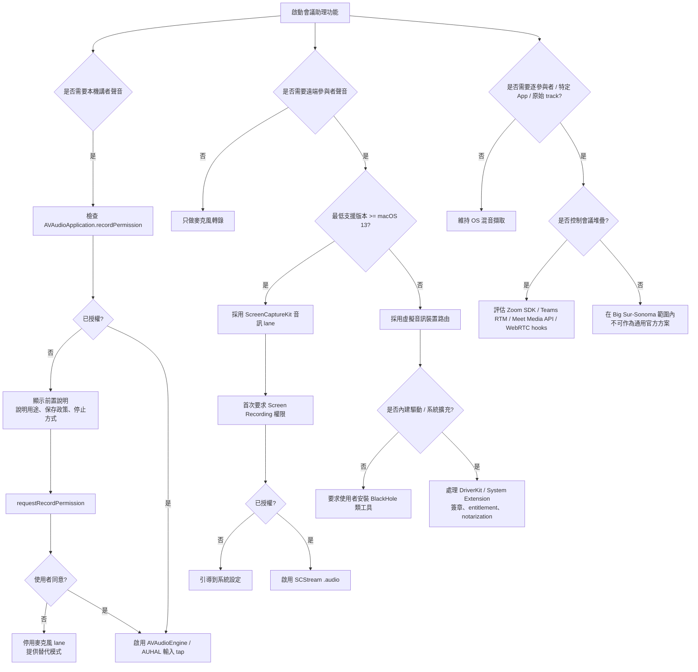

# macOS 會議助理的音訊擷取技術深度研究報告

## 執行摘要

對一個 macOS 會議助理 App 而言，**麥克風絕不是唯一可行的音訊來源**。在現實可交付的工程路線上，至少有四種來源：本機麥克風、系統輸出音訊、以虛擬音訊裝置重新路由的會議音訊，以及在你控制會議堆疊時使用會議 SDK / WebRTC hook 的原始媒體流。Apple 官方路線中，`AVAudioEngine` / AVFoundation 最適合做麥克風 PCM 擷取；`ScreenCaptureKit` 從 macOS 12.3 引入畫面擷取，**音訊擷取則從 macOS 13 起可用**；而 **針對特定 process 的官方系統音訊 tap**，目前 Apple 公開文件顯示是 **macOS 26** 的新能力，**不在 Big Sur、Monterey、Ventura、Sonoma 的支援範圍內**。對你指定的版本範圍來說，若要穩定吃到「遠端參與者聲音」，最務實的主線仍是 **麥克風 + ScreenCaptureKit 系統音訊**（Ventura / Sonoma）或 **麥克風 + 虛擬音訊驅動**（Big Sur / Monterey 回退方案）。citeturn17search14turn17search13turn18search1turn7search1turn16search3turn16search5

若你的目標是「同時錄到自己與遠端參與者」，答案是**可以**，但方法取決於 OS 版本與你是否控制會議堆疊。對 Big Sur 到 Sonoma：本機講者聲音可由麥克風路徑取得，遠端參與者聲音通常來自會議 App 的輸出裝置，因此要靠 `ScreenCaptureKit` 音訊輸出或虛擬音訊裝置來再導入；若你使用的是會議平台 SDK，則可直接取得更乾淨、甚至逐參與者的原始資料，例如 Zoom Meeting SDK / Video SDK 可取得 raw audio data、Microsoft Teams Real-time Media Platform 可讓 bot 逐 frame 接收音視訊，而 Google Meet 在 2026 年公開的 Meet Media API Developer Preview 也開始提供原始音視訊串流能力。**只有用 SDK / WebRTC track hook，才比較接近逐參與者、逐 track 的能力；純 OS 層擷取一般只能拿到混音之後的 lane。** citeturn40search0turn40search16turn40search7turn28search2turn28search3turn23search1turn23search3

若你要兼顧 App Store、實作時間與可靠性，**首選建議**是：  
**主線**：`AVAudioEngine` / AVFoundation 處理麥克風，Ventura / Sonoma 以上用 `ScreenCaptureKit` 處理系統音訊；  
**回退線**：Big Sur / Monterey 用 BlackHole 類虛擬裝置導出會議 App 的輸出；  
**高控制線**：若你能把會議能力做到自己的產品裡，改走 Zoom / Teams / Meet 的 SDK / Media API；  
**未來線**：若未來最低支援版本可以拉到 macOS 26，再評估 Core Audio taps 做 per-process 擷取。citeturn35view0turn8search0turn8search1turn7search1turn28search2turn28search3turn40search0

從合規與上架角度看，這類產品最敏感的不是 API 能不能呼叫，而是**權限、透明揭露、錄製指示、資料最小化、以及 reviewer 是否能清楚理解你為何需要錄音/錄螢幕**。Apple App Review Guidelines 明確要求：錄製使用者活動時必須取得明確同意並提供清楚的視覺或聲音指示；收集使用者資料必須取得同意、提供撤回方式，並以最小必要原則為限。對沙盒 App，麥克風還需要 `com.apple.security.device.audio-input` entitlement 與 `NSMicrophoneUsageDescription`；對畫面 / 系統音訊路線，官方樣板會在首次執行時要求 Screen Recording 權限，而且授權後常需重啟 App。citeturn10view1turn10view2turn31search0turn33search11turn19search1

## 可行性判斷與建議路線

**結論先講清楚**：  
若你的產品是一般 macOS 會議助理，而不是你自己掌控的會議客戶端，最可行的工程方案不是「直接偷取某會議 App 的內部 PCM」，而是**透過官方輸入 API 取得麥克風**，再**透過系統音訊擷取或虛擬裝置**拿到遠端參與者聲音。Big Sur 到 Sonoma 期間，Apple 公開 API 並沒有一條成熟、普遍可用、App Store 友善、又能穩定對任意第三方 App 做 per-process 音訊擷取的道路；這也是為什麼第三方生態長期依賴虛擬音訊裝置，而 Apple 官方直到 macOS 26 才公開 Core Audio taps 來「擷取某個 process 或 process 群組的輸出音訊」。citeturn7search1turn36search13turn16search3turn16search5

我對技術路線的優先排序如下。

**第一優先：`AVAudioEngine` 麥克風 + `ScreenCaptureKit` 系統音訊**。這條路最適合 **Ventura / Sonoma**。`AVAudioEngine` 讓你對 input node 做 tap，取得低延遲 PCM；`ScreenCaptureKit` 可同時把畫面與音訊 sample buffer 送進來，Apple 官方 sample 直接示範把 `CMSampleBuffer` 轉成 `AVAudioPCMBuffer`。它的優點是：不用額外安裝驅動、API 正規、上架說得通。缺點是：需要 Screen Recording 權限、首次授權後常需重啟；而且在 Big Sur / Monterey 上不成立，因為 Monterey 雖然有 ScreenCaptureKit 12.3，但官方音訊型別是從 macOS 13 才可用。citeturn35view0turn17search13turn17search14turn19search1

**第二優先：`AVAudioEngine` 麥克風 + 虛擬音訊裝置**。這條路最適合 **Big Sur / Monterey 的回退相容**，也適用於任何你需要把特定會議 App 輸出明確送到另一個 input device 的情境。BlackHole 官方定位就是「現代 macOS 音訊 loopback driver」，可把一個 app 的音訊傳給另一個 app，並宣稱零額外延遲；Loopback 則能把多個 app 與實體輸入組合成新的虛擬裝置。優點是版本覆蓋廣、對使用者可預測、可把 Zoom / Meet / Discord / Teams 的輸出顯式導到你的 App。缺點是使用者教育成本高、音訊路由 UI 容易出錯、若你打算「內建驅動」還會碰到系統擴充、簽章、授權與審查問題；另外 BlackHole 以 GPL-3.0 發佈，若你直接整合其程式碼或衍生散布，還要做授權相容性評估。citeturn8search0turn8search1turn8search19

**第三優先：會議平台 SDK / WebRTC hook**。若你可以控制會議堆疊，這通常是品質最好的路。Zoom Meeting SDK 與 Video SDK 都公開 raw audio / video data 能力，Teams 的 Real-time Media Platform 讓 bot 可逐 frame 接收音視訊，Google Meet 在 2026 年也公布了 Meet Media API Developer Preview。若你的場景是公司內部產品、受控流程、或要做逐參與者 diarization / 即時回應，這類整合的可觀測性與資料品質明顯優於 OS 混音擷取。缺點是產品面更重：你不是「擷取其他 App」，而是「變成會議生態裡的一員」，必須處理平台 app type、驗證、host 授權、bot 加會、甚至伺服器端媒體處理。citeturn40search0turn40search16turn40search7turn28search2turn28search3turn23search1

**第四優先：自製 Audio HAL / AudioDriverKit 裝置，或未來的 Core Audio taps**。這適合對音訊系統非常熟、且願意承擔平台依賴的團隊。Apple 官方支援「建立 Audio Server Driver Plug-in 以做虛擬音訊裝置」，而 AudioDriverKit 則是與 CoreAudio HAL 溝通的現代 user-space driver extension；WWDC21 甚至明說可以透過 App 方式安裝音訊驅動，並可經 Mac App Store 發佈。不過這條路的工程成本、測試矩陣與部署風險都遠高於前兩條；若你的最低版本仍涵蓋 Big Sur 到 Sonoma，且產品重點是會議助理而不是音訊基礎設施，通常不值得先走這條。citeturn16search3turn16search5turn15search4turn11search5turn11search1

## 擷取方法比較表

下表聚焦你要求的四種主要方法；評等是依 Apple 官方 API 可用性、權限模型、版本支援與第三方工具官方說明做出的工程判斷。citeturn31search0turn35view0turn17search13turn7search1turn8search0turn16search3

| 方法 | 可行性 | 延遲 | 需要的使用者權限 | App Store 友善度 | macOS 版本支援 | 複雜度 | 可靠性 |
|---|---|---|---|---|---|---|---|
| 麥克風擷取 `AVAudioEngine` / AVFoundation citeturn32search0turn31search0turn33search11 | 很高 | 低 | 麥克風權限；沙盒需 `com.apple.security.device.audio-input`；`NSMicrophoneUsageDescription` citeturn31search0turn33search11 | 很高 | Big Sur 以上 | 低 | 很高 |
| 系統音訊經虛擬裝置 `BlackHole` / `Loopback` citeturn8search0turn8search1 | 高 | 低到中 | 通常不靠 TCC 麥克風權限，主要是音訊路由設定；若你自帶驅動則另有系統擴充/安裝流程 citeturn11search1turn15search1 | 中 | Big Sur 以上 | 中到高 | 高，但高度依賴使用者路由設定 |
| `ScreenCaptureKit` 音訊擷取 citeturn17search13turn17search14turn35view0 | Ventura / Sonoma 高；Monterey 僅畫面、無音訊；Big Sur 不支援 | 中 | Screen Recording 權限；首次授權後常需重啟 App citeturn19search1turn35view0 | 中到高 | 12.3 起有框架；**音訊 13.0+**；**麥克風獨立輸出 15.0+** citeturn17search14turn17search13turn18search1 | 中 | 中到高 |
| 任意特定 App 的官方 per-app 音訊擷取 | **Big Sur–Sonoma：低**；**macOS 26+：可用 Core Audio taps** citeturn7search1turn36search13 | 低到中 | 視實作而定；若走 taps 或自製 driver，還牽涉更重的系統層能力 citeturn15search4turn11search1 | 低到中 | **不適用於你指定的 Big Sur–Sonoma 主範圍**；26+ 才有官方 taps citeturn7search1 | 高 | 在目標版本範圍內偏低 |

兩個補充結論值得單獨講。第一，**`ScreenCaptureKit` 在你指定的版本範圍內，最像「官方系統音訊 API」**，但它不是 Big Sur / Monterey 的通用答案；Monterey 12.3 只有框架與畫面擷取，Apple 的 `.audio` 輸出型別與 `capturesAudio` 屬性都標示為 macOS 13.0+。第二，**「指定某一個 App 的輸出音訊」在 Big Sur–Sonoma 沒有對等成熟的 Apple 官方通用 API**；你若需要這件事，只能靠虛擬路由、自己控制的 WebRTC / SDK 堆疊，或調高最低版本到支援 Core Audio taps 的新系統。citeturn17search13turn17search14turn7search1turn36search13

## API 與平台版本分析

針對麥克風擷取，**`AVAudioEngine` + `AVAudioApplication` / AVFoundation 授權**是最標準的 macOS App 路徑。Apple 現代文件把錄音權限收斂到 `AVAudioApplication.requestRecordPermission()` 與 `recordPermission`，而 AVFoundation 也提供 `AVCaptureDevice.authorizationStatus(for: .audio)` 與 `requestAccess(for: .audio)` 來檢查/要求授權。對沙盒 App，還必須開啟 `com.apple.security.device.audio-input`，Apple 官方說明明確寫到這個 entitlement 允許 App 使用內建麥克風並透過 Core Audio 存取音訊輸入。citeturn32search0turn32search4turn12search3turn12search12turn31search0

`AVAudioEngine` 的定位，是對**輸入裝置**與圖形音訊處理非常好用，但它**本身不是系統音訊擷取 API**。若你要更低階地直接面向裝置，Apple 的 HAL / AUHAL 文檔說得很清楚：Audio HAL 是讓 App 存取音訊硬體的抽象層，而 HAL Output Audio Unit（AUHAL）可以綁定單一 `AudioDevice` 做輸入或輸出。因此，`AVAudioEngine` / AUHAL 都很適合「麥克風、USB 麥克風、虛擬音訊裝置」這類 input device；對「任意第三方 App 的播放音訊」則不會神奇地繞過系統路由限制。citeturn36search0turn36search1

`ScreenCaptureKit` 的版本界線要記得很清楚。Apple 在 WWDC23 回顧中明確說它是 **macOS 12.3** 引入；但官方型別文件又明確標示 `.audio` 與 `capturesAudio` 是 **macOS 13.0+**，而麥克風獨立輸出 `SCStreamOutputType.microphone` 則是 **macOS 15.0+**。Apple 官方 sample 也直接示範：先用 `SCShareableContent` 取得 display / app / window，接著建立 `SCContentFilter`，再把 `SCStreamConfiguration.capturesAudio = true`，並將 `.audio` stream output 的 `CMSampleBuffer` 轉成 `AVAudioPCMBuffer`。這代表你的版本矩陣應該這樣判斷：**Big Sur 11：無 SCK；Monterey 12：有 SCK 視訊但沒有官方音訊 lane；Ventura 13 與 Sonoma 14：可吃到系統音訊；macOS 15 之後才有獨立 microphone output。** citeturn17search14turn17search13turn18search1turn35view0

對「虛擬音訊裝置」這個類別，Apple 官方有兩個相關層面。第一是傳統 **Audio Server Driver Plug-in / HAL plug-in**，官方文件直接寫明它可用來**建立虛擬音訊裝置**。第二是 **AudioDriverKit**，Apple 說它是與 CoreAudio HAL 溝通的 DriverKit-based user-space audio extension；WWDC21 則指出可以把 Audio Server plug-in 與 DriverKit extension 打包進 App，簡化安裝，並可透過 Mac App Store 分發。這也是為什麼從架構上看，BlackHole 這類 loopback device 並不是旁門左道，而是符合 macOS 音訊架構思路的務實做法。citeturn16search3turn15search4turn16search5

**Kernel vs user-space 驅動**方面，Apple 自 2020 起就持續把方向拉離 kext。官方支援頁寫得很明白：從 macOS Big Sur 開始，使用已棄用 KPI 的 kernel extension 預設不再載入；Apple 推薦的是 System Extensions 與 DriverKit，而 DriverKit/system extensions 在 user space 執行、較不會危及系統穩定性。若你要自己做系統擴充或 driver，官方還要求：System Extension 要不是走 Mac App Store，要不就做 notarization；Developer ID 散布的 macOS 軟體自 macOS 10.15 起也以 notarization 為標準流程。citeturn11search2turn11search5turn11search1turn11search3

驅動簽章與 entitlement 不能忽略。AudioDriverKit 官方文件指出，建立音訊 driver extension 需要 DriverKit Audio Family entitlement；若你的 App 要開啟 driver 的 `IOUserClient`，還需要 `com.apple.developer.driverkit.userclient-access`。Apple 的 DriverKit entitlement 申請文件也說，DriverKit 開發需要向 Apple 請求相關 entitlement。這意味著：**「我想做自己的虛擬音訊驅動」在技術上可行，但產品上不是零摩擦。** citeturn15search1turn15search2turn15search5turn15search17

`CoreMediaIO` 在你這個問題裡應該被**排除為主要音訊解法**。Apple 官方文件明確把 Core Media I/O 描述為**支援自訂 camera devices** 的框架，並在 12.3 起改走 system extensions；官方 sample 也是「建立 camera extension」。也就是說，CMIO 對虛擬攝影機、會議視訊效果很重要，但**不是會議音訊擷取的主要入口**。citeturn39search0turn39search3

對即時轉錄與 live response，樣本率與 buffer 策略應該保守務實。WebRTC 音訊規格要求端點支援 Opus，Opus 內部 MDCT layer 以 **48 kHz** 運作，且可用 2.5、5、10、20、40、60 ms frame duration；Apple 官方則提供 `AVAudioConverter` 做 PCM sample-rate conversion，而 Audio HAL 的 `kAudioDevicePropertyBufferFrameSize` 讓你控制 I/O buffer 大小。實務上，建議**內部採集保持原始裝置率（常見 48 kHz），進 ASR 前再用 `AVAudioConverter` 統一轉成 16 kHz 或 24 kHz mono**；若你把 buffer 設得太小，雖有利低延遲，但 CPU 負載與 underrun 風險會上升。這裡比較合理的做法是：UI 顯示波形時用小 buffer，ASR / LLM 管線則在背景以固定 chunk 聚合。citeturn14view1turn14view3turn13search2turn13search6turn13search3turn13search7

下面兩段 API 片段，代表最核心的兩種官方能力。第一段是麥克風權限；第二段是 `ScreenCaptureKit` 音訊 lane。它們都可以直接當成 PoC 的骨架。citeturn32search0turn32search4turn35view0

```swift
import AVFAudio

switch AVAudioApplication.shared.recordPermission {
case .granted:
    break
case .undetermined:
    AVAudioApplication.requestRecordPermission { granted in
        print("mic granted =", granted)
    }
case .denied:
    print("導向系統設定中的麥克風權限")
@unknown default:
    break
}
```

```swift
import ScreenCaptureKit

let config = SCStreamConfiguration()
config.capturesAudio = true
config.excludesCurrentProcessAudio = true

let stream = SCStream(filter: filter, configuration: config, delegate: output)
try stream.addStreamOutput(output, type: .audio, sampleHandlerQueue: audioQueue)
try stream.startCapture()
```

## 主要會議平台限制與緩解策略

對 **Zoom**，官方支援文件證實使用者可在桌面版中選擇 speaker / microphone 裝置，並且 Zoom 預設會對麥克風做 noise suppression 與 echo cancellation；若你使用 Zoom 自家 SDK，Meeting SDK 與 Video SDK 又都提供 raw audio / raw data 能力。這代表對非整合式會議助理而言，**Zoom 的遠端聲音最好走 speaker/output device 路徑**，例如讓 Zoom 輸出到 BlackHole，再由你的 App 當成 input device 讀入；若你控制客戶端或 bot，則應優先改用 Zoom SDK raw data，因為 OS 層混音會失去更多結構資訊。若轉錄品質比「還原現場聽感」更重要，應提醒使用者關閉過重的語音處理，改用較原始的 microphone mode / professional audio 設定。citeturn20search0turn26search6turn26search14turn40search0turn40search16turn40search7

對 **Google Meet**，最核心限制是它多半跑在瀏覽器裡。Google Meet 官方 help 只保證你能在 Meet 設定中改 speaker / microphone，而 Chrome 官方文件與 `chrome.tabCapture` 文檔則說明：若你想拿到某個 tab 的影音，必須透過瀏覽器 API 或 extension，且通常需要**使用者手勢**與瀏覽器授權。換句話說，對一個普通 native macOS App 來說，**Google Meet 的遠端音訊通常只表現為「Chrome / Edge 的輸出音訊」**；你要嘛用 `ScreenCaptureKit` / 虛擬裝置捕 browser output，要嘛自己做 Chrome extension / WebRTC 整合。再加上 Google Meet 的 noise cancellation 官方說明會對非語音噪音做處理，而且明確說「螢幕分享時，音訊擷取不受 noise cancellation 影響」，這也表示本機麥克風與會議內容在語音處理鏈上的待遇未必一致。緩解策略是：**Meet on browser 時，盡量把 browser output 明確路由到專用裝置；若能接受平台依賴，研究 Meet Media API / Chrome tabCapture。** citeturn20search1turn23search1turn23search3turn27search0turn28search3

對 **Discord**，官方支援文件證實桌面端可選 input / output devices，且提供 Krisp noise suppression、echo cancellation、AGC 等語音處理選項。這類選項對「聊天好不好聽」有幫助，但對「逐字稿是不是最接近原始訊號」未必有利。實作上，Discord 沒有在已查到的官方來源中顯示出等同 Zoom / Teams / Meet 的通用 raw meeting media 擷取路線，因此把 Discord 視為**一般桌面 VoIP App**比視為可整合平台更實際：使用者選一個乾淨的 input device 給 Discord，另一個 output device（或虛擬 device）給你的會議助理；若必須共用一支麥克風，則要接受 Discord 自身語音處理可能改變可轉錄性。citeturn21search0turn21search2turn21search10turn25search2

對 **Microsoft Teams**，官方支援文件同樣證實桌面端能選 speaker / mic，並提供多級 noise suppression 與 voice isolation；另一方面，Microsoft 的 Teams Real-time Media Platform 又允許 bot 逐 frame 存取 voice / video / screen sharing stream。這代表工程選擇非常明確：**若你只是做本機桌面輔助，Teams 與其他桌面會議 App 一樣，遠端聲音走 output device 路徑；若你做企業級 notetaker/bot，應改走 Teams bot / Graph Real-time Media。** 此外，Teams 的 noise suppression 與 voice isolation 都是 AI 處理，對本機麥克風的頻譜/殘響會有實際影響；做高品質 ASR 時，應考慮讓使用者選擇較少處理的模式。citeturn20search3turn25search3turn25search12turn28search2turn28search18

把這四個平台合起來看，可以得到一個很實際的判斷：**Zoom / Teams / Discord 原生桌面客戶端的遠端音訊，本質上都會經過一個「使用者可選的輸出裝置」；Google Meet 則常是瀏覽器輸出。** 因此，對 Big Sur–Sonoma 的一般 macOS App，最通用的抓法仍是「抓 input device 或抓 output device」，而不是期待用 Apple 官方舊版 API 去直讀某個 App 內部的音訊 graph。若你需要逐參與者分離、低失真、可控 metadata，就不要停留在 OS capture，應進入供應商 SDK / bot / WebRTC track 層。citeturn20search0turn20search1turn21search0turn20search3turn40search0turn28search2turn28search3

## 權限、沙盒、上架與隱私

對 Sandboxed Mac App，**麥克風**是最明確的一個權限組合：  
你需要 `com.apple.security.device.audio-input` entitlement，而且 Info.plist 要有 `NSMicrophoneUsageDescription`；Apple 的授權文件也說，macOS 10.14 之後，camera 與 microphone 都需要使用者明示授權。這一組合是 reviewer 最熟悉、最容易接受的。citeturn31search0turn33search11turn12search1

對 **畫面 / 系統音訊** 路線，`ScreenCaptureKit` 走的是 screen-capture 權限，而不是公開列出的「音訊輸入 entitlement」。Apple 官方 sample 明確提到：首次執行會跳出 Screen Recording 權限提示，而且授權後要重啟 App 才能開始擷取。對工程與 UX 來說，這代表你應提供「前置說明畫面」：先告訴使用者你為何需要這個權限、只在什麼時機錄、怎麼停止，然後再觸發系統流程。citeturn19search1turn35view0

若你要走 **自製 driver / system extension**，合規工作量會更大。Apple 的 System Extensions 文件指出：system extension 要不是經由 Mac App Store 分發，就是要做 notarization。Apple 的 Developer ID 與 notarization 文件也明說：Developer ID 散布的 macOS 軟體需要 notarization。再加上 DriverKit entitlement、user-client entitlement 與可能的使用者批准流程，這條路不適合作為會議助理的第一版 MVP。citeturn11search1turn11search3turn11search0turn15search1turn15search17

App Review 的敏感點比很多團隊想得更嚴格。Apple 明文規定：App 在記錄、錄製、記錄使用者活動時，必須取得**明確同意**並提供**清楚的視覺與/或聲音指示**；資料收集要取得同意、說明用途與資料保存/刪除政策，且不得把與核心功能無關的資料權限綁成必須條件。對會議助理而言，這意味著你不應把「背景永久錄音」設成預設；使用者必須看到一個清楚的錄製狀態，且能隨時停止與撤回。citeturn10view1turn10view2

下面的 Mermaid 流程圖，把實際產品的權限分流整理成可以直接交給 PM / iOS/macOS 工程 / 法務共同討論的版本。



這個流程圖背後的規則依據是：麥克風必須走 Apple 的麥克風權限與 audio-input entitlement；`ScreenCaptureKit` 首次跑會觸發 Screen Recording 權限；system extension 必須是 App Store 或 notarized 分發；而逐參與者 / raw track 的能力通常要升到供應商 SDK 或你控制的 WebRTC 層。citeturn31search0turn33search11turn35view0turn19search1turn11search1turn11search3turn40search0turn28search2turn28search3

## 最小 PoC 設計

最小 PoC 我建議做成兩階段，但**第一版只先做麥克風**。原因很簡單：它能最快驗證三件事——權限流程、音訊 UI（波形 / level meter）、以及 10 秒錄音到檔案——而且完全符合 App Store 最友善的路線。等這版穩定，再把 `ScreenCaptureKit` 或虛擬裝置加進去，做成第二條遠端音訊 lane。這樣的開發順序，可把 debug 面積從「音訊+權限+會議平台」縮成「你的 App 自身」。citeturn32search0turn31search0turn35view0

**PoC 目標**：  
視窗中顯示一條簡單波形或音量柱；按下「Start」後請求麥克風權限；取得授權後以 `AVAudioEngine.inputNode.installTap` 每 1024 frame 取一次 PCM；一邊計算 RMS 更新 UI，一邊把 buffer 寫入 `AVAudioFile`；10 秒後自動停止並把錄音存到 sandbox container 或由使用者以 `NSSavePanel` 決定匯出位置。這整條路不需要第三方付費工具。citeturn32search0turn32search4turn31search0

**建議專案設定**：  
如果是 sandboxed App，啟用 App Sandbox 與 Audio Input；Info.plist 放入 `NSMicrophoneUsageDescription`。若錄音檔只寫到 app container，無須額外檔案 entitlement；若要讓使用者自選儲存位置，走 `NSSavePanel` 即可。citeturn31search0turn33search11turn5search2

```xml
<!-- .entitlements -->
<key>com.apple.security.app-sandbox</key>
<true/>
<key>com.apple.security.device.audio-input</key>
<true/>
```

```xml
<!-- Info.plist -->
<key>NSMicrophoneUsageDescription</key>
<string>此 App 需要使用麥克風來擷取會議語音、顯示波形並產生逐字稿；只有在你主動開始錄音時才會收音。</string>
```

下面這個極簡 Swift 骨架可同時滿足「顯示音量 waveform」與「錄 10 秒音」兩個要求。它沒有做完整 UI，但已足以構成最小 PoC。做法本質上是用 `installTap` 拿 PCM，RMS 更新 UI，`AVAudioFile` 落地，10 秒後停止。這條思路與 Apple 的麥克風權限與 `ScreenCaptureKit` sample 中的 PCM 處理方式一致。citeturn32search0turn32search4turn35view0

```swift
import Cocoa
import AVFoundation
import AVFAudio

final class MicRecorder: ObservableObject {
    @Published var level: Float = 0.0
    @Published var isRecording = false

    private let engine = AVAudioEngine()
    private var audioFile: AVAudioFile?
    private var stopTimer: DispatchSourceTimer?

    func start10sRecording(to url: URL) {
        Task { @MainActor in
            let granted = await requestMicPermission()
            guard granted else { return }
            do {
                let input = engine.inputNode
                let format = input.inputFormat(forBus: 0)

                audioFile = try AVAudioFile(
                    forWriting: url,
                    settings: format.settings,
                    commonFormat: format.commonFormat,
                    interleaved: format.isInterleaved
                )

                input.removeTap(onBus: 0)
                input.installTap(onBus: 0, bufferSize: 1024, format: format) { [weak self] buffer, _ in
                    guard let self else { return }

                    // 寫檔
                    do { try self.audioFile?.write(from: buffer) } catch {
                        print("write error:", error)
                    }

                    // 計算 RMS 當成波形/音量 UI
                    guard let data = buffer.floatChannelData?[0] else { return }
                    let frameCount = Int(buffer.frameLength)
                    if frameCount == 0 { return }

                    var sum: Float = 0
                    for i in 0..<frameCount {
                        let s = data[i]
                        sum += s * s
                    }
                    let rms = sqrt(sum / Float(frameCount))

                    DispatchQueue.main.async {
                        self.level = rms
                    }
                }

                engine.prepare()
                try engine.start()
                isRecording = true

                let timer = DispatchSource.makeTimerSource(queue: .main)
                timer.schedule(deadline: .now() + 10)
                timer.setEventHandler { [weak self] in
                    self?.stop()
                }
                stopTimer = timer
                timer.resume()
            } catch {
                print("start error:", error)
                stop()
            }
        }
    }

    func stop() {
        engine.inputNode.removeTap(onBus: 0)
        engine.stop()
        stopTimer?.cancel()
        stopTimer = nil
        audioFile = nil
        isRecording = false
    }

    private func requestMicPermission() async -> Bool {
        switch AVAudioApplication.shared.recordPermission {
        case .granted:
            return true
        case .denied:
            return false
        case .undetermined:
            return await withCheckedContinuation { continuation in
                AVAudioApplication.requestRecordPermission { granted in
                    continuation.resume(returning: granted)
                }
            }
        @unknown default:
            return false
        }
    }
}
```

若你要把 PoC 往「同時吃到遠端參與者」延伸，**第二步**是在 Ventura / Sonoma 以上加入 `ScreenCaptureKit` 音訊 lane。Apple sample 已經示範如何用 `SCShareableContent` 建 filter、用 `SCStreamConfiguration.capturesAudio = true` 啟動音訊樣本輸出、再把 `CMSampleBuffer` 轉成 `AVAudioPCMBuffer`。你的簡版做法可以是：  
一條 lane 保留麥克風 `AVAudioEngine`，另一條 lane 接 `ScreenCaptureKit` 的 `.audio`；UI 面同時計兩條 RMS；檔案層先分開寫兩個 WAV，再在離線階段 mixdown。**不要在第一版就急著合成單一檔案**，因為兩條 lane 的時間戳與 drift 對齊會讓 debug 複雜很多。citeturn35view0

對使用虛擬音訊裝置的回退版 PoC，實作流程更簡單但 UX 更重：讓使用者把 Zoom / Teams / Discord / Browser 的輸出切到 BlackHole，再讓你的 App 以 BlackHole 當 input device 讀入。若你只想快速驗證「遠端聲音可不可以進來」，這其實比 `ScreenCaptureKit` 更快；但產品化時，**它的風險在使用者支援成本，不在 coder 實作。** citeturn8search0turn8search1

## 風險排序、App Store 審查重點與結論

**最高優先風險是權限與透明度不夠。** 你的 App 若會在會議期間擷取麥克風、螢幕或系統音訊，reviewer 第一個會看的是：你有沒有明白告知、是不是只有在使用者明確啟動後才錄、畫面上有沒有持續可見的錄製狀態、使用者能不能停。這不是「文案加一下」等級的事，因為 Apple 2.5.14 與 5.1.1/5.1.2 都把它寫成原則性要求。citeturn10view1turn10view2

**第二個風險是版本錯配。** 很多團隊會以為 ScreenCaptureKit 一出現就代表有音訊；但對你的目標版本範圍，Monterey 12.3 只是有框架與畫面擷取，**官方音訊 lane 是 13.0+**，麥克風獨立輸出更是 **15.0+**。如果你把產品宣稱成「Monterey 以上都可擷取會議系統音訊」，實際上就會踩坑。citeturn17search14turn17search13turn18search1

**第三個風險是把「OS 混音擷取」誤當成「逐參與者資料」。** 如果你的需求是高精度 speaker diarization、agent 插話、或會議後每個人獨立 lane 回放，OS 層把遠端聲音抓進來是不夠的；你需要 Zoom SDK、Teams RTM、Meet Media API 或自己控制的 WebRTC track。否則你得到的是「終端上已混完的輸出」，不是會議拓撲。citeturn40search0turn28search2turn28search3turn23search1

**第四個風險是驅動 / 系統擴充讓 MVP 過早複雜化。** AudioDriverKit 與 system extension 在架構上是正路，但 entitlement、簽章、notarization、使用者批准與跨版本測試都會拉高成本。只要你的產品不是音訊基礎設施本身，第一版通常不應先做自製 driver。citeturn15search1turn15search5turn11search1turn11search3

**第五個風險是第三方工具整合的法律與支援成本。** BlackHole 很好用，但它是 GPL-3.0；Loopback 好用，但它是付費產品，商務與部署模式不同。若你只把它們當「外部可選依賴」，風險小很多；若你要內嵌、重包、或深度整合，就必須在法務與發行策略上先講清楚。citeturn8search0turn8search1

我建議你在產品內與 App Store metadata 使用這類**隱私 / 權限文案**：

- **麥克風用途字串**：  
  「此 App 需要使用麥克風，以在你主動開始時擷取會議語音、顯示音量波形，並產生即時逐字稿與摘要。」 citeturn33search11turn10view2
- **螢幕 / 系統音訊前置說明**：  
  「若要轉錄遠端參與者聲音，App 需要 macOS 的螢幕擷取權限來讀取會議播放音訊；只有在你開始會議擷取時才會啟用，而且畫面上會持續顯示錄製狀態。」 citeturn19search1turn10view1
- **資料政策摘要**：  
  「音訊僅用於會議逐字稿、摘要與即時回應；你可以隨時停止錄製、刪除資料，或撤回授權。」 citeturn10view2

最後給一個最務實的總結。  
如果你的目標是 **Big Sur 到 Sonoma**、想做 **一般使用者可安裝的 macOS 會議助理**，最穩的產品策略是：

1. **先做麥克風版 PoC**，用 `AVAudioEngine` 顯示波形與錄 10 秒。  
2. **Ventura / Sonoma** 再加 `ScreenCaptureKit` 音訊 lane，支援遠端參與者聲音。  
3. **Big Sur / Monterey** 用 BlackHole 類方案做回退。  
4. 若未來產品要進入企業 notetaker / agent 領域，再評估 **Zoom SDK / Teams RTM / Meet Media API**。  
5. **不要把任意 App 的 per-app capture 當成 Big Sur–Sonoma 的官方通用能力**；那條路要嘛靠虛擬路由，要嘛等新系統的 Core Audio taps。citeturn32search0turn35view0turn8search0turn7search1turn40search0turn28search2turn28search3

**開放問題與限制**：在本次蒐集到的高可信來源中，Discord 沒有出現等同 Zoom / Teams / Meet 的公開 raw meeting media 路線，因此對 Discord 的結論偏向「以桌面輸入/輸出裝置路由為主」；若未來你要做 Discord 專項整合，還需要另外針對其開發者文件與商業政策做獨立驗證。另，Core Audio taps 已是 Apple 官方新方向，但它的公開樣板明示為 macOS 26 範圍，故不應倒推適用於 Sonoma 以前。citeturn21search0turn21search2turn7search1