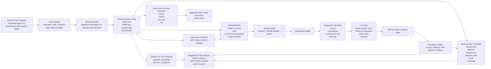

# macOS 會議助理即時回應建議與對話輔助系統設計研究

## 執行摘要

如果你的畢業專題目標是做一個真正可用、而不是只會「會後摘要」的 macOS 會議助理，最合理的總體方案不是把所有事情交給單一端到端語音代理，而是採用**分層式、可控的 chained pipeline**：macOS 端先做音訊擷取與串流、即時 ASR 產生穩定與不穩定兩種文字層、再做問題偵測與會議狀態分類、最後才進入回應建議生成、行動項目抽取與互動式 chat。這個方向與 OpenAI 對 voice agents 的架構建議一致：speech-to-speech 比較適合自然低延遲的語音對話；而 chained voice pipeline 更適合需要可預測流程、可重用文字代理、耐久逐字稿與中間控制邏輯的產品。對會議助理而言，後者更符合逐字轉錄、會中 notes、風險控制、外部 API 工具調用與可稽核性的需求。即時字幕可用 Realtime transcription 或 Whisper 系列；結構化 notes / action items 則應使用文字模型與 Structured Outputs。citeturn30search5turn27view1turn25view1turn25view2

建議生成模組不應在「任何時候都產生一句話」，而應先回答兩件事：**現在是不是值得建議**，以及**此刻應該建議哪一類建議**。前者依賴 turn-taking / VAD / end-turn detection / partial transcript stability；後者依賴 question probability、dialogue act / meeting state、commitment risk、以及使用者選擇的 style。近期與基礎研究共同指出，對話行為辨識、turn-taking、prosody 與文字上下文的結合，對於 question / objection / incomplete turn 等情況尤其重要；而短句、語意多樣化且可一鍵採用的 suggestion，是 Smart Reply 類系統成熟可行的產品形式。citeturn30search0turn32view4turn32view5turn35search15turn35search2turn20search13turn20search0

就工程落地而言，我最推薦你把系統拆成六個核心服務：**音訊擷取、串流 ASR、分類器層、prompt builder、model router、UI/state store**。macOS 端採用 `AVAudioEngine` 擷取麥克風，`ScreenCaptureKit` 擷取螢幕/系統音訊；前者處理本機說話聲，後者讓你的 app 能跨 Zoom、Meet、Teams 等第三方會議平台運作，但也因此必須處理 Screen Recording 權限、隱私告知與本機暫存策略。Apple 官方文件明確把 ScreenCaptureKit 定位為在 Mac app 中高效擷取螢幕與音訊內容的框架，而其 sample 也指出首次執行會要求 Screen Recording 權限；`AVAudioEngine` 則是 Apple 官方的即時音訊處理與擷取基礎設施。citeturn18search4turn18search0turn18search8turn18search11

模型供應商層要做成**可插拔 provider abstraction**。如果你沒有供應商限制，OpenAI 的 Realtime / Responses API 適合做即時字幕、工具調用與結構化輸出；GitHub Models 則很適合作為「多模型目錄 + 推理 API」的後備或對照平台，因為它能列出模型的 modalities、publisher、rate limits，也支援 inference、stream、tools、temperature、top_p。相對地，GitHub Copilot CLI 與 Codex CLI 雖然都可程式化調用，但它們本質上是**code agent / terminal agent**；官方也明確說明它們可讀寫本機目錄、執行命令，因此若把它們直接作為你的會議回覆引擎，安全與權限風險會明顯高於一般 LLM inference API。最保守的做法，是把 Copilot / Codex 僅當成研究用 provider adaptor 或開發期測試目標，不作為預設 production backend。citeturn26view3turn26view2turn26view1turn26view0turn25view9turn26view4turn26view5turn26view6turn26view7

## 產品目標與核心設計原則

你的需求其實包含四條不同難度、不同風險的產品線：**逐字轉錄**、**會中回應建議**、**會中筆記與行動項目**、**互動式 AI chat**。業界成熟產品多半先把前三者做到穩，再逐步打開會中問答。Otter 已經提供即時逐字稿、summary、AI chat、action items、follow-up emails 與把 notes 轉成後續工作流；Zoom AI Companion 則提供 in-meeting questions、meeting summary、跨第三方平台的 AI note taking、可套用模板的會議摘要，以及 side panel 式查詢。這說明你的題目方向是產品上成立的，但目前主流產品比較偏向「會議理解與 recap」，**真正會中替人擬自然回話**仍然是相對稀少、也更需要保守設計的區域。citeturn36view0turn36view1turn36view2turn36view3turn36view4turn36view5turn36view6turn36view7

因此，我建議把核心產品原則定成以下三點。第一，**先理解，再建議**：字幕、問題偵測、狀態分類與風險評估必須先於 suggestion generation。第二，**預設簡短，按需展開**：預設給一行自然答句，必要時再讓使用者點開 detailed / follow-up-question / risk-warning。第三，**只生成「可說」的話，不替使用者做承諾**：所有會中建議都必須是建議，不是自動代表使用者發言，更不能直接觸發外部 write action。這與 OpenAI 對 Realtime prompting 的建議一致：對工具使用要清楚定義 read/write 邊界，並依工具層級控制是否需先確認；同時也不要讓模型在音訊不清楚時猜測內容。citeturn29view0turn30search10

從平台角度看，macOS 最實際的做法是把音源分開處理。麥克風音源用 `AVAudioEngine`；會議平台音源用 `ScreenCaptureKit` 或平台原生 API（若有）。Apple 對 ScreenCaptureKit 的定位，是支援 Mac app 擷取螢幕與音訊內容；sample 也指出第一次執行會要求 Screen Recording 權限。若你的 app 要做第三方會議的 system audio 監聽，這個權限與對應的 onboarding copy 不是可選項，而是 UX 主流程的一部分。citeturn18search4turn18search0turn18search6

模型層則建議做成三層抽象。第一層是 **ASR provider**，負責 live transcript 與 partial stabilization；第二層是 **reasoning / generation provider**，負責 suggestion、chat、summary、action items；第三層是 **tooling provider**，負責 GitHub Models、OpenAI function calling、MCP 或其他外部 API。OpenAI Responses API 與 Structured Outputs 很適合 notes / action items 這種 schema 嚴格任務；GitHub Models API 則適合做 model-selection UI 與 cross-model A/B；GitHub Copilot/Codex 若納入，應放在隔離沙箱後的 optional backend，而非預設路徑。citeturn25view1turn26view2turn26view0turn25view6turn25view8turn26view5turn26view6

## 即時架構與決策流程

下面的架構圖是我對你題目最推薦的實作形態。它刻意把「轉錄」與「建議」分成兩條不同節奏的路徑：字幕追求低延遲；建議追求穩定與自然，因此必須消化更多上下文再輸出。這種拆法同時符合 OpenAI 關於 Realtime transcription、VAD、voice agents 與 chained pipeline 的文件，也符合 Whisper-Streaming、即時 ASR 延遲研究與 streaming diarization 研究對「partial hypotheses 會抖動、chunking 策略會影響 quality-latency tradeoff」的觀察。citeturn30search4turn30search0turn30search5turn32view6turn22search1turn32view8turn32view9

在 suggestion policy 上，我建議不要把「要不要顯示建議」直接交給大模型，而是先用一個**小型、可解釋的門控器**。最簡單實作是五個 gating signal：`turn_complete_confidence`、`asr_stability`、`question_probability`、`meeting_state_confidence`、`commitment_risk`。只有當前兩者足夠高、且第三或第四者足以說明「此刻值得幫忙」，才喚起大模型產生建議。這等於把生成成本和錯誤干擾率壓低，也符合 turn-taking / VAD / end-turn detection 系列工作的方向：先判斷是否輪到系統介入，再決定介入內容。citeturn30search0turn32view4turn32view5turn12search3

更具體地說，可以把顯示策略分成四類。**即時自動浮現**：僅在對方明確提問、提出 objection、卡住或進入 decision point 時顯示。**輕提示不打斷**：只顯示一個小 chip，例如「對方在問時程」或「可能是需求澄清」。**按鈕即時生成**：使用者點 `What should I say?` 或 `Follow-up questions` 才進一步生句子。**完全不顯示**：small talk、語音不清楚、說話重疊、ASR 不穩定時，寧可沉默。這與 OpenAI realtime 文件對 unclear audio、background audio 以及非必要不說話的建議方向一致。citeturn29view0turn27view1

在延遲設計上，建議把畫面切成三層。第一層是 **verbatim transcript**，可以接受 partial flicker；第二層是 **stable meeting understanding layer**，每 1–2 秒更新一次狀態標籤與 notes；第三層是 **reply suggestion layer**，只在 turn 末端或按鈕觸發時更新。這樣做的原因，是即時 ASR 文獻指出 chunking 與 partial hypothesis 會在 latency 與穩定度之間折衷，Whisper 類模型若硬做 streaming，常見解法是 local agreement、self-adaptive latency 或 partial reranking。UI 不應把同一種抖動直接暴露到建議層。citeturn32view6turn22search1turn22search2

## 建議生成策略與 Prompt 模板

### 何時該給哪一種建議

「現在應該給什麼建議」最穩定的做法，是把生成任務明確切成四種輸出格式：**one-sentence**、**detailed**、**follow-up-question**、**risk-warning**。這樣一來，UI 與 prompt 都能更可控，也方便後續做 acceptance-rate 與 satisfaction 評估。從產品角度看，預設只顯示 one-sentence；detailed 與 follow-up-question 則由按鈕或展開操作觸發；risk-warning 不應是主要 CTA，而應是低頻、高價值的安全提示。這種「先短後長、先建議後展開」的表現形式，也和 Smart Reply 類系統強調可快速採用、短句、語義多樣化的設計邏輯一致。citeturn20search13turn20search0

具體判斷可用如下規則。當 `question_probability` 高、且對方停頓或結束發話時，預設生成 **one-sentence**。當 meeting state 是 requirement description 或 decision point，且使用者按下 `What should I say?`，則生成 **detailed**。當 state 是 objection、stuck、or ambiguity high，按 `Follow-up questions` 時生成 **follow-up-question**。當偵測到 deadline、price、approval、commitment verbs、external promise 等語義風險時，生成 **risk-warning**，提醒使用者不要直接答應。這是推薦性的產品規則；基礎支撐來自 dialogue act / question detection / proactive conversation / tool-boundary prompting 的研究與文件。citeturn33view1turn35search15turn20search1turn29view0

### 推薦的 prompt 工程模式

對這類系統，prompt 應維持**短、分段、可版本化**，而不是寫成一長段「人格設定 + 禁令大全」。OpenAI 的 prompt guidance 與 reasoning best practices 都明確建議：對真正不變的安全規則才用絕對語言；其餘應用 decision rules；推理模型用簡潔、直接、分節提示往往更好，不需要反覆要求模型「一步一步思考」；clear labeled sections、few-shot anchor phrases、specific end goals 會比散文式指令更穩。這些原則對你的產品尤其重要，因為 suggestion 需要可預測、可比較、可 A/B。citeturn25view4turn25view5turn29view1

我建議把 developer prompt 固定成七個區塊：`Role/Objective`、`Current Meeting Context`、`User Speaking Style`、`Suggestion Rules`、`Commitment Guardrails`、`Output Format Contract`、`Sample Phrases`。對 Realtime 類模型，還要補上 `Unclear Audio` 與 `Exact Entity Capture` 區塊，避免模型在音訊不清時猜測，或在 ID/數字這類高精度資訊上偷做推斷。citeturn29view0turn27view1

### 風格到生成參數的對應

下面的參數是**建議起始值**，不是唯一正解。重點不是追求某個固定 temperature，而是把「風格」與「預期輸出長度」綁定起來，並維持 `top_p` 接近預設值。OpenAI 與 GitHub Models 文件都建議一般不要同時大幅調整 `temperature` 與 `top_p`；因此若你是做生產系統，最好主調 temperature，讓 top_p 固定。citeturn26view2turn25view9

| 風格 | 建議 temperature | 建議 top_p | 建議 max output tokens | 適用情境 | 生成規則 |
|---|---:|---:|---:|---|---|
| professional | 0.20 | 1.0 | 32 | 面試、正式會議、客戶會議 | 先 acknowledge，再回答，不加俚語 |
| concise | 0.10 | 1.0 | 18 | 高節奏會議、短答 | 嚴格一到兩子句，避免背景解釋 |
| natural | 0.35 | 1.0 | 28 | 一般討論、同學專題、日常會議 | 可用口語連接詞，但不裝熟 |
| conservative | 0.10 | 1.0 | 24 | 涉及承諾、成本、時程、法務 | 多用「目前看起來」「我需要先確認」 |
| proactive | 0.45 | 1.0 | 36 | 對方卡住、你要推進會議 | 回答後加一個安全的下一步或澄清問題 |

若你要做 provider-agnostic UI，也可以在設定頁面用「Style preset」而不是直接讓使用者拉 temperature。GitHub Models 的 playground 與 comparison/evaluation 流程支援同 prompt 比較兩個模型、並用 relevance、groundedness 等 evaluator 比對結果；這很適合做畢業專題中的 prompt 對照實驗。citeturn25view6

### 按鈕 Prompt 模板比較表

下表全部是**可直接用來做原型測試**的模板。每個模板我都同時放中文與英文變體，方便你做 bilingual A/B。表中的 prompt 文字是設計建議，背後遵循的是上面提到的短、分節、明確輸出契約與 guardrail 原則。citeturn25view4turn25view5turn29view1

| Button | Intent | Prompt text | 預期輸出長度 / 風格 | Example output |
|---|---|---|---|---|
| What should I say? | 直接回答對方問題 | **ZH**：你是會議中的回覆建議器。根據最近 60 秒逐字稿、當前話題、與使用者設定風格，產生 3 個可立即說出口的中文回覆。每個回覆不超過 22 個中文字。不要替使用者做承諾；若資訊不足，優先用保守說法。輸出 JSON：`{suggestions:[...]}`。 **EN**: You are an in-meeting reply suggester. Using the last 60 seconds of transcript, current topic, and user style, generate 3 speakable replies. Each reply must be under 16 words. Do not make commitments on the user’s behalf. If context is insufficient, prefer conservative wording. Return JSON. | 短；professional / natural | 「可以，我先整理兩個方案，稍後給你明確時間。」 |
| What should I say? | 先承接再回答 | **ZH**：先用一句自然承接語，再給一句核心回答。總長不超過 28 字。避免生硬官話。 **EN**: Give one natural acknowledgment line plus one core answer. Keep the full response under 20 words. Avoid corporate-sounding phrasing. | 短；natural | 「我了解你的顧慮，這部分我傾向先做小範圍驗證。」 |
| What should I say? | 高風險保守答法 | **ZH**：若涉及 deadline、預算、是否承諾、是否保證結果，生成 2 個保守答法與 1 個需要先確認的版本。禁止直接答應。 **EN**: If the topic involves deadlines, budget, commitments, or guarantees, generate 2 conservative replies and 1 confirm-first variant. Never answer with a hard commitment. | 短；conservative | 「我先確認資源與時程，再回你一個可執行版本。」 |
| Follow-up questions | 需求澄清 | **ZH**：根據最近談話，生成 3 個最能推進會議的追問。每句只問一件事，避免複合問句。 **EN**: Generate 3 follow-up questions that best move the meeting forward. Ask one thing per question only. | 短；proactive | 「你希望第一版先覆蓋哪些核心情境？」 |
| Follow-up questions | objection handling | **ZH**：對方剛表達顧慮。生成 3 個不對抗、能釐清風險的追問。先理解，再推進。 **EN**: The other party just raised a concern. Generate 3 non-confrontational follow-up questions that clarify the risk before pushing forward. | 短；professional / conservative | 「你最擔心的是成本、時間，還是維護負擔？」 |
| Follow-up questions | decision point | **ZH**：會議接近決策點。生成 3 個能促成收斂的問題：優先順序、責任人、下一步。 **EN**: The meeting is near a decision point. Generate 3 convergence questions focused on priority, owner, and next step. | 短；proactive | 「如果今天只定一件事，你希望先定範圍還是時程？」 |
| What should I say? | 英文會議即時回覆 | **EN**: Draft 3 natural spoken English replies for a live meeting. Keep them brief, non-awkward, and easy to say aloud. Prefer plain spoken English over written English. Avoid sounding overly polished. If unsure, hedge carefully. | 短；natural | “That makes sense. I’d like to validate the scope before I commit to a date.” |
| Follow-up questions | 英文探索問題 | **EN**: Generate 3 follow-up questions for a live meeting. Questions should be specific, low-friction, and likely to surface requirements, blockers, or decision criteria. | 短；proactive | “What would make this good enough for the first version?” |

### 四種輸出格式範例

下面給你一組同一情境下的四種輸出格式。情境是假設對方說：「你們下週能交第一版嗎？」這組例子可以直接作為前端 UI mock 的內容。

| Format | 中文 sample | English sample |
|---|---|---|
| one-sentence | 「下週要交第一版的話，我建議先對齊範圍，這樣時間會比較準。」 | “If next week is the target, I’d like to align on scope first so the timeline is realistic.” |
| detailed | 「可以朝下週第一版努力，但我想先確認你說的第一版包含哪些必要功能；如果我們先鎖定核心流程，我比較有把握給你準確時程。」 | “We can aim for a first version next week, but I want to confirm what must be included. If we lock the core flow first, I can give you a more reliable timeline.” |
| follow-up-question | 「你希望第一版一定要完成的功能，有哪兩三個？」 | “Which two or three features are absolutely required in version one?” |
| risk-warning | 「這題有承諾風險：不要直接答應日期，先確認範圍、資源與 owner。」 | “Commitment risk: don’t promise the date yet. Confirm scope, resources, and ownership first.” |

## 分類器設計與資料集

### 問題偵測與會議狀態分類的建議架構

我不建議你把「是否是問題」與「目前會議狀態」做成單一大分類器。更穩定的設計是**多頭模型**：一個 head 做 `question detection`，一個 head 做 `meeting state classification`，一個 head 做 `commitment risk`，再加上一個 `turn-complete / readiness` 分數。這樣做的好處是可以分別收集資料、分開校準閾值，也方便做 error analysis。對 data-poor 狀態，還可以先用 LLM zero-shot / weak supervision 產 pseudo labels，再用小模型蒐斂成低延遲分類器。這個方向和近期的 online dialogue act classification、有限資料 dialogue act recognition，以及 question-type / prosody 文獻是一致的。citeturn33view1turn33view2turn33view5turn35search15

對 `question detection`，最少要融合四類特徵。第一類是**文字訊號**：疑問詞、助動詞開頭、是否要求確認、是否出現選項比較。第二類是**句法與標點恢復**：ASR 即使沒有問號，也可以透過 punctuation restoration 與語法結構補回 interrogative 線索。第三類是**prosody**：特別是 declarative questions，單靠文字常常不夠，歷來研究反覆指出 prosodic features 對 question detection 有額外價值。第四類是**上下文與輪次位置**：例如前一輪是否已在澄清、當前是否是一個 decision push、對方是否停頓等。citeturn35search15turn35search2turn35search0turn32view4

對 `meeting state classification`，我建議你的標籤不是直接照搬 MRDA / SwDA，而是做**雙層標註方案**。第一層沿用標準 dialogue act 或其簡化映射，例如 statement、question、agreement、disagreement、backchannel、instruction。第二層才是你產品真正需要的六個狀態：`questioning`、`objection`、`requirement_description`、`decision_point`、`stuck`、`small_talk`。前者讓你能用公共語料預訓練；後者讓你能服務實際 UX。AMI 與 MRDA 本來就都是會議導向語料，而 AMI 還提供 dialogue acts、手寫摘要、actions 等 annotation guidelines，正好適合做你的第二層擴充。citeturn15search0turn15search4turn32view2

### 可直接採用的標註 schema

以下 schema 很適合你的專題：

| 欄位 | 類型 | 說明 |
|---|---|---|
| utterance_id | string | ASR 穩定片段 ID |
| speaker | enum | self / other / unknown |
| start_ms, end_ms | int | 時間戳 |
| text | string | 穩定文字稿 |
| is_question | bool | 是否需要回應的問題 |
| question_type | enum | yes-no / wh / choice / declarative / rhetorical / unclear |
| dialog_act_base | enum | statement / question / agreement / disagreement / backchannel / proposal / instruction / other |
| meeting_state | enum | questioning / objection / requirement_description / decision_point / stuck / small_talk / none |
| commitment_risk | enum | low / medium / high |
| suggested_output_format | enum | one-sentence / detailed / follow-up-question / risk-warning |
| action_item_span | span list | 若有 |
| decision_span | span list | 若有 |
| owner / due_date | optional | 結構化抽取欄位 |

標註規則上，建議以 **5–20 秒 rolling window** 作為狀態判斷單位，而不是單句硬判。像 `objection`、`decision_point`、`stuck` 這些狀態，很少只靠一個 utterance 就能穩定判斷。AMI 的 decision / action / summary annotation 經驗也暗示：有些 meeting semantics 天生就是 segment-level，而不是單句級。citeturn15search4turn8search2turn8search12

### 建議資料集與用途

| 資料集 | 主要用途 | 為何適合 |
|---|---|---|
| MRDA | 會議式 dialogue act 預訓練 | ICSI 會議資料、meeting-oriented dialog acts，對多方會議更接近你的場景。citeturn32view2 |
| AMI Corpus | 會議摘要、decision / action / DA、多模態音訊 | 100 小時會議、多層 annotation，適合 notes / actions / decision 檢測。citeturn15search0turn15search4 |
| ICSI Corpus | 會議 ASR / diarization / DA | 約 70 小時會議資料，接近多講者研究傳統基準。citeturn14search6 |
| SwDA / RASwDA | 問題型、prosody、二人對話 act 分類 | SwDA 大、經典；RASwDA 修正 speech-text 對齊，更適合語音特徵。citeturn14search10turn32view3 |
| ETD dataset | end-turn detection | 超過 120k samples、300+ 小時資料，適合 readiness / end-turn head。citeturn32view5 |
| QMSum | query-focused meeting Q&A / chat box | 232 meetings、1,808 query-summary pairs，適合會中 chat 問答摘要。citeturn9search1 |
| ELITR Minuting Corpus | minutes / structured note generation | 比 generic summary 更接近「會議記錄」任務。citeturn9search2 |
| MeetingBank | 長會議摘要與結構抽取 | 1,366 meetings、3,579+ hours，適合長會議 recap。citeturn8search7turn8search11 |
| VCSum | 中文會議摘要 | 239 場真實會議、230+ 小時，適合中文摘要與 segmentation。citeturn9search18 |

### 建議模型路線

在工程上，最實際的分類器路線是三階段。**第一階段**，用公共資料集做 text-only baseline，例如 DeBERTa / RoBERTa / 小型 instruction-tuned encoder；**第二階段**，對 `is_question` 加入 prosody features 或小型音訊 encoder 融合；**第三階段**，把接受/忽略/編輯 suggestion 的真實產品訊號回流成 online adaptation 特徵。近期研究一方面顯示 LLM zero-shot 對 online dialogue act classification 有可用性，另一方面也顯示傳統或中型模型在資料穩定後更容易做到低延遲、可校準與可部署。citeturn33view1turn33view5turn34view1

評估指標方面，請不要只報 accuracy。`is_question` 與 `meeting_state` 都應報 **precision / recall / macro-F1**；`turn_complete` 可報 **AUC / F1 / latency-at-threshold**；`action_item` 與 `decision` 抽取可報 **span F1** 與 **field-level exact match**；speaker attribution 要報 **DER / speaker assignment accuracy**；整體產品還要報 **p50 / p95 transcript latency**、**speech-end-to-suggestion latency** 與 **user acceptance rate**。即時 ASR 的文獻明確指出，real-time 場景不能只看 WER；還必須一起看 fragment strategy 與 end-to-end delay。citeturn22search1turn32view8turn32view9

## UX 呈現與安全防護

### 建議如何呈現，才不會打斷人

會中 suggestion 的核心 UX 原則是：**顯示存在感要弱，採用成本要低，錯誤成本要更低**。因此不要做成像聊天機器人一樣的大對話框不停跳字，而要分三個層次：底部安靜字幕、右側 notes / action items、近輸入區或浮動面板的小型 reply chips。只有在使用者主動點按鈕時，才展開更完整的內容。Zoom 把 AI 問答放在 AI Companion side panel，Otter 則把 transcript、takeaways、AI chat 和 action items 分開呈現；你可以借鏡這種「資訊層次化」的做法，但把 reply suggestion 做得更輕。citeturn36view4turn36view5turn36view0turn36view3

我建議預設介面元素如下。主畫面右下角兩個主要按鈕：`What should I say?`、`Follow-up questions`。其上方一列最多三個短 suggestion chip；右側側欄顯示 `Live Notes` 與 `Next Actions`；底部 chat box 則讓使用者輸入像「剛剛對方真正的 concern 是什麼？」這樣的問題。若分類器判斷是高風險承諾場景，chip 不要直接顯示具體承諾句，而改顯示 `⚠ 建議先確認範圍/時程`。這樣才能把 AI 的主動性限制在「提醒與輔助」，而不是「代表你」。citeturn36view5turn29view0

下面是一組適合原型測試的 UI 微文案：

- `What should I say?`：**幫我擬一句可直接說的話**
- `Follow-up questions`：**幫我想接下來該問什麼**
- `Keep it safe`：**避免承諾**
- `Natural`：**自然口語**
- `Concise`：**短句**
- `Professional`：**正式**
- chip 狀態：**對方好像在問交付時程**
- risk chip：**這題有承諾風險，先確認資源**

### 防止 AI 替使用者亂承諾的 guardrails

這一塊是整個專題最重要的安全設計。首先，**所有 suggestion 都必須用「建議輸出」而非「自動送出」模型**。其次，對外部 write action 或任何高風險語意，模型必須要求人類確認。OpenAI 的 realtime prompting 文件直接指出，工具層級規則可以設計成 read tools 主動使用、write tools 需要明確確認；GitHub Copilot CLI 與 Codex CLI 文件也都提醒，自動批准工具後，代理會取得和使用者類似的本機檔案與 shell 權限。把這些原則轉到你的產品，就是：**不得自動寄信、不得自動發 chat、不得自動加 Jira ticket、不得自動承諾 deadline**。citeturn29view0turn26view5turn26view6

語言層的 guardrail 建議做成可檢查規則。高風險詞包括：`我保證`、`我們一定`、`下週一定交`、`沒問題我們會做`、`肯定來得及`。當模型產生這類句子時，reranker 直接降分或攔截，改寫為：`我先確認後回覆你`、`照目前資訊，我傾向…`、`如果先縮小範圍，時程會更可控`。這裡應該把 conservative style 視為一級安全機制，而不是 UI 裝飾。citeturn29view0turn25view4turn25view5

### 失敗模式與緩解策略

| 失敗模式 | 典型症狀 | 緩解策略 |
|---|---|---|
| ASR partial 抖動 | 字幕不斷改寫，建議句跟著變 | 將 partial transcript 與 stable transcript 分層；建議層只用 stable text；加 prefix stability 閾值。citeturn32view6turn22search2 |
| Whisper / ASR hallucination | 無語音或雜音時出現不存在文字 | 先做 VAD；在 unclear audio 狀態不生成建議；對非語音片段設 suppress；優先測試真實噪音場景。citeturn29view0turn6search18turn31view0 |
| 問題誤判 | 對方只是陳述，系統卻當提問 | 問題偵測加入 prosody 與上下文，不只靠問號/疑問詞。citeturn35search15turn35search2turn35search0 |
| suggestion 太長太書面 | 看起來像 email，不像口語 | 口語輸出合約；限制 token；加入 sample phrases；rerank on speakability。citeturn29view1turn20search13 |
| 過度打擾 | AI 不斷浮現 chip，使用者反感 | 嚴格 gating；每個 speaker turn 最多一次提示；small talk 預設 suppress。citeturn29view0turn30search0 |
| 過度承諾 | 生成「可以、沒問題、保證」 | commitment risk classifier + conservative rewrite + no auto-send。citeturn29view0 |
| 隱私疑慮 | 使用者不知道 app 正在聽什麼 | 首次啟動要明確說明 mic / screen recording；所有 uploads 與 retention 可控；可選本機暫存或不留存。citeturn18search0turn18search4turn27view1 |
| 第三方代理權限過大 | Copilot/Codex 類 provider 能動本地檔案與 shell | 僅放沙箱；預設停用；與一般 inference API 分離。citeturn26view4turn26view5turn26view6 |

## 評估計畫與業界對照

### 你應該怎麼做實驗

最完整的評估要分成**離線資料回放**、**半控制真人會議**、**真實長時使用**三層。離線層可用 AMI / MRDA / QMSum / MeetingBank / VCSum 做分類、摘要、action items 與 chat box 測試；半控制真人會議層則請同學或受試者扮演 interviewer / reviewer / stakeholder，刻意加入 objection、ambiguous requirement、decision pressure；真實長時使用層則讓受試者在 1–2 週內把 app 用在實際課堂、lab meeting 或專題討論。這樣你才能同時量到模型效能、產品打擾感與真實採用率。citeturn15search0turn32view2turn9search1turn8search7turn9search18

離線層建議指標如下。ASR：WER / CER / p50 latency / p95 latency / revision rate。Question detection：precision / recall / F1 / AUC。Meeting state：macro-F1 與 confusion matrix。Action items：span F1、owner exact match、due-date exact match。Suggestion quality：讓三位以上人工標註者評 `appropriateness`、`speakability`、`naturalness`、`non-commitment safety`。如果你走 GitHub Models 或 OpenAI eval 路徑，也可以額外做自動化 relevance / groundedness 對照，但最終仍應有人評「像不像人會說的話」。citeturn25view6turn16search10turn22search1

真人使用層則建議你追蹤四個產品指標：**suggestion acceptance rate**、**edit distance after accept**、**speech-end-to-suggestion latency**、**self-reported usefulness / interruption cost**。如果 acceptance 低但 edit distance 也低，代表系統方向對但措辭不好；如果 acceptance 高但 latency 高，代表 UI 策略可能要調；如果 usefulness 高但 interruption cost 也高，代表你該把自動浮現改成更保守的按鈕式互動。citeturn19search5turn20search13

### 與現有產品相比，你的專題應該主打什麼

| 產品 / 方向 | 既有強項 | 你應避免直接複製的地方 | 你可以主打的差異化 |
|---|---|---|---|
| Otter.ai citeturn36view0turn36view1turn36view2turn36view3 | 即時逐字稿、summary、AI chat、action items、follow-up emails、跨工具整合 | 它偏重會議紀錄與 workflow 後處理，不是細緻的即時「下一句怎麼說」輔助 | 做得更即時、更口語、更重視會中回話自然度與 overcommitment guardrails |
| Zoom AI Companion citeturn36view4turn36view5turn36view6turn36view7turn36view8 | in-meeting questions、meeting summary、跨平台 AI note taking、模板化 summary、side panel 查詢 | 平台綁定較強；雖然有問答與 notes，但回應建議不是其最核心的可見 UI | 做成跨平台 macOS overlay，並把 `What should I say?` / `Follow-up questions` 變成第一級互動 |
| 你的專題 | 可做到 macOS 全域 overlay、針對說話場景微調、風格可控、provider-agnostic | 若想同時做「最強 ASR + 最強 notes + 最強 suggestion + 最強 chat」，很可能全部普通 | 專注於「即時說話輔助 + 會中 notes/action items + 安全可控」這三件事的整合體驗 |

我的判斷是：**不要把產品定位成 another note taker**；那會直接落入 Otter / Zoom 已成熟的賽道。比較有研究價值與展示價值的定位是：**一個以即時回應建議為核心、同時具備逐字稿與 action-item 輔助的 out-of-meeting-platform macOS assistant**。這個定位同時符合你的研究題目，也更適合做明確的 classifier、prompt、UX 與安全評估。citeturn36view0turn36view4turn36view6

## 開放問題與限制

有幾個地方值得在報告或 demo 中明確承認。第一，**meeting state labels 並沒有現成完全對應你需求的公開大語料**；你很可能需要以 MRDA / AMI / SwDA 為底，再自行擴充 `objection`、`stuck`、`decision_point` 等產品標籤。第二，**會中回覆自然度的黃金標準仍主要依賴人工評估**；公開 benchmark 很少直接衡量「像不像人在會議中會講出口」。第三，若你要支援中英混合或台灣口音場景，公開英語資料集雖可用來預訓練，但最終仍需要你的真實場景資料做 adaptation。第四，**Copilot / Codex 作為外部 provider** 在理論上可接，但因其產品定位是 coding agent / terminal agent，若要拿來跑 production meeting assistance，安全邊界、授權與沙箱設計都必須比一般 inference API 嚴格得多。citeturn33view1turn15search4turn26view5turn26view6turn26view7

如果把範圍控制在畢業專題的合理複雜度，我會建議你以以下最小可行版本收斂：**macOS 音訊擷取 + 穩定字幕 + 問題/狀態分類 + 兩顆按鈕 + notes/action items 側欄 + conservative guardrails**。這樣的系統已經足以回答你提出的大多數研究問題，也能做出清楚的模型對照、prompt 對照與 UX 評估。再往上擴充時，最值得加的不是更多花俏 agent 功能，而是**更好的 question detection、better reranking、以及更嚴格的 commitment safety**。citeturn30search5turn29view0turn20search13

## 參考來源

本報告優先使用了官方文件、官方產品頁與學術論文，包括 Apple ScreenCaptureKit / AVAudioEngine 文件、OpenAI Realtime / Responses / Structured Outputs / Prompting / Audio 模型文件、GitHub Models / Copilot / Codex 官方文件，以及 AMI、MRDA、QMSum、ELITR、MeetingBank、VCSum、Whisper-Streaming、turn-taking / question detection / dialogue act recognition 等相關研究。對業界功能對照，主要引用 Zoom AI Companion 與 Otter 官方頁面與官方支援文件。相關主張已在正文逐段標註。citeturn18search4turn18search8turn27view1turn30search0turn25view1turn25view2turn26view0turn25view8turn26view6turn15search0turn32view2turn9search1turn9search2turn8search7turn9search18turn32view6turn32view4turn35search15turn36view0turn36view4