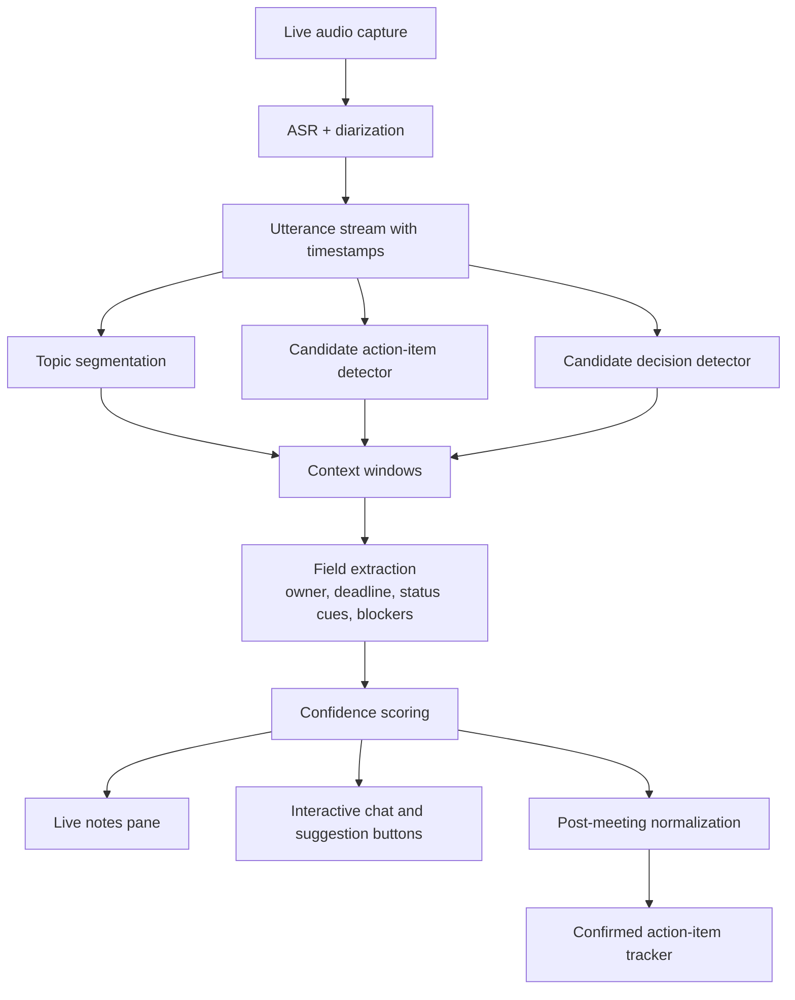
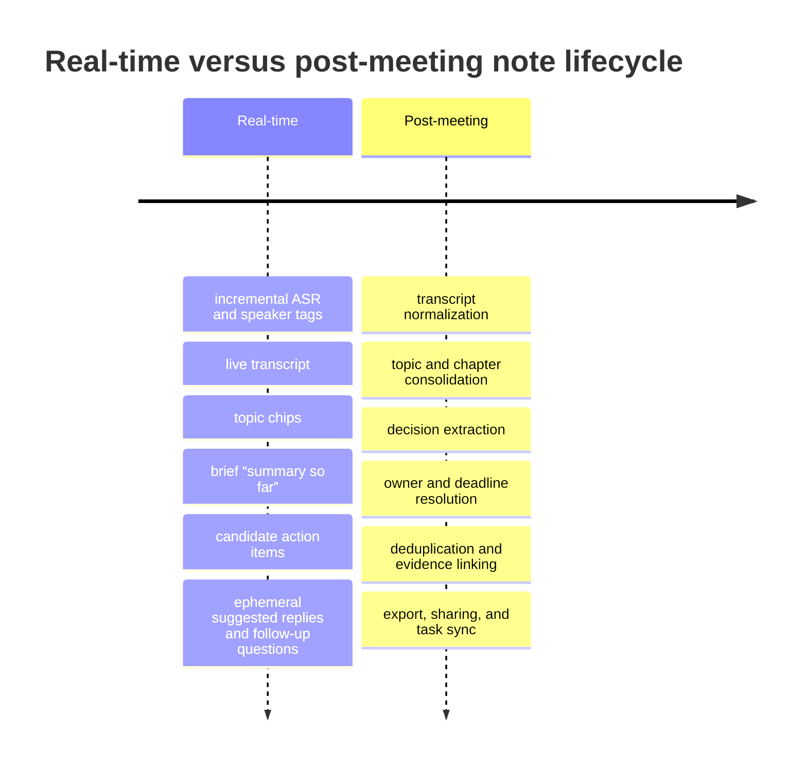

# Designing Meeting Notes and Action Item Formats for a macOS Meeting Assistant

## Executive Summary

The strongest design pattern for this kind of app is **not** a single universal notes view. It is a **dual-representation system**: a low-latency **live highlights view** for in-meeting cognition and a richer **post-meeting hierarchical minutes view** for reconstruction, sharing, and task tracking. This recommendation is consistent with HCI research showing that “highlights” help attendees with quick reminders and weekly task planning, while hierarchical minutes better support deeper catch-up and contextual understanding; it also matches current product behavior in Fireflies, Google Meet, Teams, Zoom, Otter, and Notion, which increasingly split live assistance from recap artifacts. citeturn16view2turn16view7turn29view3turn28view0turn27view4turn27view2turn29view0turn29view1

For the note format itself, the most robust canonical section set is the one you specified: **TL;DR, Topics, Decisions, Action Items, Open Questions, Risks/Blockers, and Follow-up**. The evidence suggests these sections should not all behave identically. “Decisions” and “Action Items” need to be separated, because meeting systems such as Google Meet, Teams, Fireflies, and Feishu already distinguish outcomes from next steps, and HCI work shows users often need transcript context to interpret whether a statement is a settled decision, a provisional suggestion, or a task. citeturn28view1turn27view4turn29view2turn22view9turn33view1

A production-grade **Action Item** object should always contain the required fields **owner, deadline, context, and status**, and should usually add **evidence span**, **confidence**, and **external-sync state**. That recommendation is directly supported by product and research patterns: Microsoft’s recap prototype used editable assignee and date fields plus transcript context; Fireflies exposes action items with associated speakers; Feishu explicitly advertises extraction of decisions, action items, assignees, and deadlines; Google Meet’s notes system distinguishes Decisions from Next steps and can list assigned tasks. citeturn16view0turn16view7turn29view2turn22view9turn28view1

For extraction, the evidence does **not** support a pure “LLM summarize everything” approach as the default. The better architecture is a **hybrid pipeline**: ASR and diarization, utterance- and topic-level candidate detection, explicit owner/date/context extraction, then LLM-based normalization or rephrasing grounded in evidence windows. Earlier meeting NLP work found lexical, temporal, prosodic, and dialogue-act signals all materially improved action-item and decision detection, while later work showed action-item rephrasing improves when the model gets additional context such as coreference information. At the same time, HCI research found that transcript-derived action items without enough social and conversational context are often rated poorly by users. citeturn19view0turn19view1turn19view3turn21view0turn33view1

Real-time assistance should be **ephemeral, conservative, and reversible**. Fireflies’ live interface and Google Meet’s “Summary so far” demonstrate that mid-meeting recap is useful, but Teams and Zoom also show that the most reliable structured recap often lands after the meeting ends, when the full transcript and retention/storage paths are available. For buttons such as **“What should I say?”** and **“Follow-up questions,”** the design should follow the HCI principle of **ask before intervene**: suggestions should appear as transient prompts, not autonomous behavior. citeturn29view3turn29view4turn28view0turn27view4turn27view3turn35view0

The macOS-specific recommendation is a **privacy-forward, model-pluggable, local-first-when-possible** design. Apple’s current platform guidance emphasizes on-device foundation models, advanced on-device transcription through SpeechAnalyzer, protected-resource prompts, and transient/supportive UI affordances such as help tags, popovers, and progress indicators. GitHub Models and Copilot documentation show a practical pattern for model catalogs, side-by-side evaluations, Auto model selection, and standardized context/tool integration through MCP. citeturn23view1turn5search8turn5search26turn5search1turn5search13turn5search16turn5search19turn22view10turn22view11turn22view12turn23view0turn6search17turn6search9

Finally, evaluation should measure **more than summary text quality**. Meeting-summarization research shows that standard automatic metrics and even current LLM evaluators are weak or self-biased on long meeting transcripts; therefore the product should track extraction precision/recall, owner and deadline accuracy, completeness/conciseness/faithfulness, user edit effort, downstream confirmation, and completion rate of confirmed tasks. User edits, shares, and context lookups are especially valuable telemetry because research shows they are strong signals of relevance and quality. citeturn26view0turn38view0turn38view1turn38view2

## Note Architecture and Canonical Formats

The cleanest document model is a single **meeting object** with two synchronized renderings:

1. a **live working view** optimized for the current participant, and  
2. a **post-meeting record** optimized for review, sharing, and execution.  

This is directly aligned with the “highlights versus hierarchical minutes” distinction found in meeting-recap research, where highlights acted as memory cues and the minutes-style view provided a more complete chronological record. citeturn16view4turn16view2turn16view1

| Section | Recommended content | Live behavior | Post-meeting behavior | Evidence basis |
|---|---|---|---|---|
| TL;DR | 3–5 concise sentences on what mattered most | Show as “Summary so far” and refresh cautiously | Finalize after transcript cleanup | Google Meet uses an in-meeting “Summary so far”; Fireflies offers short live recap; recap research finds highlights useful as quick reminders. citeturn28view0turn29view4turn16view2 |
| Topics | Topic chips with timestamps and links to transcript windows | Dynamic topic chips; user can pin or ignore | Convert to stable chapters with headings and timespans | Fireflies generates dynamic topic suggestions and topic-linked notes; Teams recap exposes chapters and topics. citeturn29view4turn27view4 |
| Decisions | Resolved outcomes, each with decision state and evidence | Only show when confidence is high or multiple signals agree | Normalize wording and attach evidence spans | Google Meet exposes a dedicated Decisions section with explicit status labels; classic meeting research models decision-related dialogue acts and topic segments separately from general discussion. citeturn28view1turn19view3turn19view5 |
| Action Items | Imperative task statement plus owner, deadline, context, status | Show as suggested candidates, never silently sync outside the app | Confirm, dedupe, and optionally export | Microsoft’s recap UI used assignee/date/context; Fireflies includes associated speakers; Feishu advertises owner/deadline extraction. citeturn16view7turn29view2turn22view9 |
| Open Questions | Unresolved issues, ambiguities, pending approvals | Very useful live; surface as follow-up prompts | Keep unresolved items separate from Decisions | Meeting QA and context work suggest interactive question handling is a first-class use case; unresolved items are often better modeled as questions than weak decisions. citeturn15view4turn33view1 |
| Risks/Blockers | Dependencies, blockers, legal/compliance risk, missing inputs | Show as warnings only when evidence is strong | Expand with owner/dependency links post-meeting | Feishu explicitly supports custom extraction dimensions such as risk points; HCI work shows context is often needed to interpret whether a statement is an actual blocker. citeturn22view9turn33view1 |
| Follow-up | Emails to send, docs to circulate, next meeting, external task sync | Keep separate from Actions during the meeting | Convert into outbound artifacts after confirmation | Fireflies AskFred, Otter AI Chat, and Zoom AI Companion support follow-up generation and meeting-grounded drafting. citeturn3search2turn2search12turn27view3 |

A recommended **Action Item** record for this app is:

```json
{
  "id": "ai_024",
  "title": "Send revised onboarding email copy",
  "owner": "Ava",
  "deadline": "2026-05-28",
  "context": "Needed before launch review; depends on legal-approved language",
  "status": "Proposed",
  "confidence": 0.91,
  "evidence": [
    {
      "speaker": "Ava",
      "timestamp": "00:14:22",
      "text": "I'll send the revised onboarding copy by Thursday."
    }
  ],
  "topic_id": "launch_readiness",
  "sync_state": "not_exported"
}
```

Two design choices matter here. First, **context must be explicit**, not implicit. Research and prototype work show users often need nearby transcript context to understand what a task means, and Microsoft’s recap prototype explicitly provided a “show context” function around detected notes and tasks. Second, **status should begin as `Proposed`**, not prematurely as `Open` or `Assigned`, because transcript-only extraction is error-prone and users need a chance to confirm meaning before the app makes the item operational. citeturn16view7turn33view1turn38view3

A practical status taxonomy is:

- **Proposed**  
- **Confirmed**  
- **In Progress**  
- **Blocked**  
- **Done**  
- **Deferred**

This is a product recommendation rather than a published standard, but it is consistent with the separation between draft suggestions and verified tasks implied by meeting-recap research and by product UIs that require review, editing, or sharing before downstream use. citeturn38view0turn27view3turn29view2

## Transcript-to-Decision and Action Extraction

A meeting assistant should treat extraction as a **multi-stage information-extraction problem**, not as one monolithic summarization step. Existing research and product behavior together point toward a layered workflow: utterance-level detection, topic/decision segmentation, field extraction, evidence linking, and only then surface-level rephrasing. citeturn19view0turn19view3turn21view0turn15view7

The workflow below captures the recommended architecture.



The most useful extraction methods are not mutually exclusive. They are complementary.

| Method | What it uses | Strengths | Weaknesses | Recommended role |
|---|---|---|---|---|
| Heuristics and pattern rules | Commitment verbs, imperatives, “can you,” “I’ll,” “let’s,” TIMEX/date expressions, speaker roles | Very fast, transparent, easy to tune per scenario | Brittle on indirect commitments, multilingual nuance, sarcasm, fragmented speech | First-pass candidate generator in live mode. Early meeting work found lexical, temporal, and TIMEX features useful for action-item detection. citeturn19view0turn19view1turn19view2 |
| Classical supervised utterance classification | Lexical, contextual, prosodic, syntactic, temporal, dialog-act features | Good for high-recall candidate spotting on noisy transcripts | Requires labeled data; often needs separate calibration by meeting type | Use for candidate ranking before LLM normalization. Prosodic and fine-grained dialog-act features materially improved F-measure in early work. citeturn19view1turn19view0 |
| Decision-related DA and topic-segment detection | Dialogue acts, topical structure, prosody, lexical cues | Better at distinguishing “discussion about a topic” from “decision reached” | Harder to maintain without good topic segmentation and DA features | Use for the Decisions section, rather than inferring decisions from generic summary text. citeturn19view3turn19view5 |
| Context-aware argument extraction | Coreference, named entities, date resolution, speaker identity, nearby turns | Better owner/deadline/context filling; improves rephrasing quality | Sensitive to diarization and pronoun errors | Required for owner/deadline/context fields. Microsoft reports action-item rephrasing improves when additional contextual information is provided. citeturn21view0turn16view5 |
| LLM normalization or summarization | Evidence windows, chapter summaries, retrieval over transcript | Produces readable notes, collapses duplicates, generates natural-language follow-up drafts | Highest risk of hallucination, overgeneralization, or wrong assignment if unconstrained | Use only after extraction and grounding, with evidence-linked outputs. Explainability and long-context evaluation work strongly support evidence alignment and caution with meeting summaries. citeturn15view7turn26view0turn38view3 |
| Hybrid production pipeline | Combination of the above | Best balance of latency, controllability, and readability | More engineering complexity | Recommended default architecture for this app. citeturn19view0turn19view3turn21view0turn33view1 |

A useful mental model is that **actions** and **decisions** are distinct objects. A decision is a resolved outcome; an action item is a future obligation. An utterance like “Let’s move launch to sprint 14” is a **candidate decision**, while “Ava will update the launch deck by Thursday” is a **candidate action item**. Meeting research on decision-related dialogue acts, together with product patterns like Google Meet’s split between Decisions and Next steps, supports this separation. citeturn19view5turn28view1

A practical **confidence score** should combine multiple signals rather than trust a single model probability. The most defensible components are: transcript quality, diarization certainty, cue strength of the utterance, completeness of extracted fields, nearby contextual support, and agreement across windows or models. This follows directly from early work showing multiple feature classes matter, from Microsoft’s finding that extra context improves action-item rephrasing, and from HCI evidence that users struggle when context is missing. citeturn19view0turn21view0turn33view1

The recommended threshold policy is conservative:

| Confidence band | UI treatment | External side effects | Fallback UX |
|---|---|---|---|
| **0.85 and above** | Insert into notes as **Suggested Action** or **Candidate Decision** with visible badge and evidence link | No automatic external task creation; allow one-click confirm | If owner or date is missing, keep the item but mark the missing field explicitly |
| **0.65 to 0.84** | Keep in a review tray or inline chip near the relevant topic | Never auto-export | Show short evidence window and quick actions: “Confirm,” “Edit,” “Dismiss” |
| **0.45 to 0.64** | Do not promote into the main notes body by default | None | Surface only when the user opens “Possible tasks/decisions” or asks via chat |
| **Below 0.45** | Suppress proactive surfacing | None | Keep retrievable through transcript search only |

This thresholding policy is a design recommendation, but it is justified by three recurrent findings: users value editable notes and task items, transcript context improves trust, and under-contextualized auto-generated actions can produce false positives and extra cleanup work. citeturn16view7turn38view0turn33view1

An illustrative extraction example makes the distinction concrete.

**Transcript excerpt**

> **Ava:** I’ll send the revised onboarding copy by Thursday.  
> **Ben:** Let’s postpone the SSO rollout to sprint 14 until legal signs off.  
> **Chen:** Can I get two slides from you for the client review on Friday?  
> **Ava:** Yes, I’ll send those too.  
> **Ben:** We’re aligned on deferring the rollout, then.

**Extracted output**

- **Decision**  
  - *SSO rollout is deferred to sprint 14 pending legal sign-off.*  
  - Status: `Aligned`  
  - Confidence: `0.88`

- **Action Item**  
  - Title: *Send revised onboarding copy*  
  - Owner: *Ava*  
  - Deadline: *Thursday*  
  - Context: *Needed before launch review*  
  - Status: `Proposed`  
  - Confidence: `0.93`

- **Action Item**  
  - Title: *Send two client-review slides*  
  - Owner: *Ava*  
  - Deadline: *Friday`*  
  - Context: *For client review requested by Chen*  
  - Status: `Proposed`  
  - Confidence: `0.79`

The second task has lower confidence because the date is attached to the meeting (“client review on Friday”), not clearly to the sending action itself. That is exactly the kind of ambiguity that should produce a review prompt instead of silent export. This recommendation is consistent with the contextual failures described in HCI work on meeting action items. citeturn33view1

## Real-Time and Post-Meeting Flows

Live notes and post-meeting notes should be treated as **different products sharing the same data**, not as the same artifact generated at different times. The real-time job is to reduce cognitive load and support participation; the post-meeting job is to maximize coherence, completeness, and executability. This distinction is strongly supported by “Markup as You Talk,” which framed lightweight cues as a way to reduce note-taking burden during meetings, and by current product behavior in Fireflies, Google Meet, Teams, Zoom, and Otter. citeturn30search0turn29view3turn28view0turn27view4turn27view3turn29view0



| Dimension | Real-time notes | Post-meeting notes | Evidence basis |
|---|---|---|---|
| Primary goal | Support attention, memory cues, and participation | Produce a reliable record and executable follow-up | HCI work on memory cues and recap designs supports this split. citeturn30search0turn16view4 |
| Latency tolerance | Very low; users need immediate but partial help | Higher; users accept slower but richer synthesis | Fireflies Live Assist and Google Meet “Summary so far” are mid-meeting features; Teams and Zoom emphasize recap after the meeting. citeturn29view3turn28view0turn27view4turn27view2 |
| Accuracy requirement | Enough to aid the current moment | High enough to be shared, exported, and acted on | Google and Zoom both acknowledge recap documents are generated after or shortly after the meeting; Teams’ recap is explicitly post-meeting. citeturn28view2turn27view2turn27view4 |
| UI affordance | Chips, badges, inline popovers, quick confirm/edit | Chapters, sections, filters, exports, evidence drill-down | Fireflies offers real-time suggestions and live notes; Teams recap exposes chapters, topics, and personalized timeline markers. citeturn29view4turn27view4 |
| Safe automation level | Low; suggestions should be provisional | Medium; finalization and dedupe are acceptable | HCI work shows transcript-only actions can be misleading without context. citeturn33view1 |
| Best sync target | Internal note workspace only | External systems such as Docs, tasks, CRM, email | Google saves notes docs to Drive/Calendar; Teams exposes recap in chat/calendar; Zoom and Fireflies support post-meeting review and sharing/export. citeturn28view2turn27view4turn29view2turn27view2 |

The **interactive chat box** should be built as a transcript-grounded retrieval layer, not as a free-form chatbot disconnected from evidence. MeetingQA explicitly motivates interactive meeting browsers and QA interfaces on top of transcripts, while Fireflies, Otter, and Zoom show clear product demand for meeting-grounded Q&A. The right design is “answer + evidence link + jump to moment,” not “answer only.” citeturn15view4turn29view4turn29view0turn27view3

The **“What should I say?”** button should generate **1–3 short, private, ephemeral reply suggestions** based on the last topic window, the user’s selected role, and the current meeting goal. Those suggestions should disappear when the topic changes unless the user pins them. This is the correct balance because research on inclusive AI agents found that people preferred systems that **observe, ask, and only then intervene**, rather than autonomous intervention; Apple’s interface guidance for popovers, help tags, and feedback also fits this transient-assistance pattern better than a persistent, intrusive panel. citeturn35view0turn5search13turn5search1turn5search16

The **“Follow-up questions”** button should prioritize unresolved entities and clarification points: missing success metrics, unresolved objections, blockers, missing owner, missing date, or unverified assumptions. Fireflies’ live interface already exposes follow-up-oriented prompts and dynamic topic suggestions, and Google Meet’s “Summary so far” plus configurable Decisions/Next steps sections show that these derived prompts are particularly valuable when users join late or temporarily lose context. citeturn29view4turn28view0turn28view1

## Scenario Templates and Example Outputs

Scenario-specific templates are worth the engineering effort. QMSum was explicitly created because different users ask different questions of meetings across multiple domains, and Fireflies already operationalizes this product insight by offering many summary templates, including Team Meeting and Interview Summary. A single fixed template is therefore weaker than a small, deliberate template library. citeturn15view5turn29view2

| Scenario | Recommended emphasis | Template notes | Example excerpt |
|---|---|---|---|
| **Project meeting** | Milestones, dependencies, decisions, risks, owners, dates | Keep all canonical sections. Add **Dependencies** as a structured subfield inside Risks/Blockers or Action Items. | *Decision: Defer SSO rollout to sprint 14 pending legal review. Risk: release copy blocked by compliance edits. Action: Ava to send updated onboarding copy by Thursday.* |
| **Client interview** | Client goals, pains, objections, requirements, commitments, commercial risks | Add **Client Goals**, **Pain Points**, **Objections**, and **Commercial Follow-up**. Keep Decisions sparse unless the client explicitly commits. | *Topic: onboarding friction. Open Question: whether SSO is a must-have for Q3. Follow-up: send pricing sheet and 2-slide summary by Friday.* |
| **Hiring interview** | Evidence, signals, unanswered questions, recommendation status | Add **Evidence by competency** and **Concerns**. Keep **Decision** as “recommendation status,” not final hiring outcome unless the workflow requires it. | *Evidence: strong systems-debugging explanation. Open Question: depth in distributed systems at scale. Follow-up: collect second-loop feedback before recommendation is finalized.* |
| **Class or research discussion** | Hypotheses, claims, evidence, readings, experiments, open questions | Add **Readings**, **Hypotheses**, **Experiment Design**, **Citations to check**. Risks often become methodological blockers. | *TL;DR: group narrowed study scope to retrieval grounding. Open Question: whether bilingual evaluation should include code-switching. Action: Chen to compare QMSum and MeetingBank by Monday.* |
| **Team standup** | Yesterday/today/blockers/asks, lightweight decisions, deduped tasks | Compress TL;DR and Topics. Emphasize **Blockers** and **Needs Help**. Deduplicate repetitive status items across days. | *Today: finish billing endpoint tests. Blocker: staging DB access. Follow-up: DevOps to restore access before 2 p.m. Decisions are usually minimal unless priorities changed.* |

A fuller **project-meeting** example is helpful because this is the template that most closely exercises the full system.

**Illustrative notes output**

**TL;DR**  
The team aligned on delaying the SSO rollout to sprint 14 until legal signs off. Launch-readiness work continues in parallel, but revised onboarding email copy and the client-review slides remain time-sensitive. The main blocker is compliance wording in external-facing materials.

**Topics**  
- Launch readiness  
- SSO rollout timing  
- Client review prep

**Decisions**  
- SSO rollout is deferred to sprint 14 pending legal sign-off.  
- Client review will proceed this Friday with a reduced deck.

**Action Items**  
- Ava — send revised onboarding copy — Thursday — `Proposed`  
- Ava — send two client-review slides — Friday — `Proposed`  
- Legal — review external SSO wording — no explicit date stated — `Needs owner/date confirmation`

**Open Questions**  
- Is legal review expected before sprint planning or after?  
- Does the Friday client review require updated security language?

**Risks/Blockers**  
- Compliance wording may block launch communications.  
- Missing legal turnaround date may delay final documentation.

**Follow-up**  
- Share Friday’s client deck after the review.  
- Revisit SSO rollout timing in next week’s planning meeting.

**Illustrative extracted action items**

| Title | Owner | Deadline | Context | Status | Confidence |
|---|---|---|---|---|---|
| Send revised onboarding copy | Ava | Thursday | Needed for launch-readiness communications | Proposed | 0.93 |
| Send two client-review slides | Ava | Friday | Requested during client-review preparation | Proposed | 0.79 |
| Review external SSO wording | Legal | Unclear | Blocking release communications | Proposed | 0.58 |

The last row is important. The correct UX is **not** to discard it and **not** to export it immediately. The correct UX is to keep it as a visible but unresolved item: “Owner/date unclear — confirm after meeting.” That behavior is directly motivated by contextual ambiguity findings in meeting-assistant HCI work. citeturn33view1

## Evaluation and Data Strategy

Evaluation for this app should be **multi-layered**. Meeting-summarization research shows that standard overlap metrics and even current LLM-based evaluators are not reliable enough on long transcript data, often exhibiting weak correlation with human judgment and strong self-bias. A production system should therefore combine extraction metrics, fidelity metrics, and workflow metrics. citeturn26view0

| Metric family | What to measure | Why it matters | Evidence basis |
|---|---|---|---|
| **Extraction quality** | Action-item precision, recall, F1; decision precision, recall, F1; owner accuracy; deadline normalization accuracy | This is the core IE problem. Good prose with bad extraction is still a bad meeting assistant. | Meeting IE papers on action items and decisions evaluate this level directly. citeturn19view1turn19view3 |
| **Summary fidelity** | Completeness, conciseness, faithfulness | Meeting notes fail when they omit key facts, over-include low-value text, or misstate facts | CREAM shows these three dimensions are central and hard for current evaluators on meetings. citeturn26view0 |
| **User effort** | Median edits per note/task, time to finalize notes, rate of context lookups | Low edit burden is the operational sign that extraction is actually helpful | Asthana’s work shows edits, shares, and source lookups are useful feedback signals about quality and relevance. citeturn38view0turn38view2 |
| **Workflow adoption** | Confirm rate, export rate, share rate, reopen rate, percentage of meetings with at least one accepted action item | Shows whether notes are valuable beyond a demo | Sharing and section-open behavior in recap systems are informative quality signals. citeturn38view0turn38view1 |
| **Outcome quality** | Completion rate of confirmed tasks, overdue rate, blocker resolution rate | Measures whether extracted items improve execution rather than only documentation | This is a product metric recommendation, but it follows naturally from the app’s purpose and the accountability emphasis of current meeting tools. citeturn29view2turn27view4 |
| **Safety and trust** | False-positive external task creation, privacy-mode usage, dismissal rate of live suggestions | Over-automation will degrade trust quickly | HCI studies show poor context and intrusive automation degrade perceived usefulness. citeturn33view1turn35view0 |

The **data sources to prioritize** should be chosen by function, not prestige alone.

| Priority source group | Best use in this app | Why prioritize it |
|---|---|---|
| **Meeting corpora with summaries or minutes**: AMI, QMSum, MeetingBank, ELITR Minuting Corpus | Topic structuring, recap generation, minutes-style formatting, long-context evaluation | These are the core public benchmarks for long meeting summarization and minuting. QMSum adds query-oriented use cases; MeetingBank and ELITR are especially useful for minutes-like outputs. citeturn18search16turn15view5turn11search1turn18search11 |
| **Action and decision corpora**: ICSI, MRDA, AIMU, Chinese action-item corpus | Action-item and decision detection, dialog-act modeling, bilingual extraction work | ICSI/MRDA and AIMU are foundational for meeting action understanding; the Chinese action-item corpus matters if English and Chinese are both product priorities. citeturn18search2turn18search14turn20view1turn25view0 |
| **Explainability and QA corpora**: ExplainMeetSum, MeetingQA | Evidence linking, transcript-grounded chat, source attribution | These directly support the app’s interactive chat and “show evidence” capabilities. citeturn15view7turn15view4 |
| **Official product docs and exemplar outputs**: Google Meet, Teams, Zoom, Otter, Fireflies, Notion, Feishu | Section design, live/post split, task fields, recap affordances, privacy controls | These sources show what users already expect from current tools and where the market is converging. citeturn29view0turn29view1turn29view2turn28view1turn27view4turn27view2turn22view9 |
| **Internal telemetry and reviewed user corrections** | Threshold tuning, template quality, model retraining | Research on recap systems suggests edits and related interactions are high-value feedback signals. citeturn38view0 |

For evaluation methodology, a strong setup is:

- offline benchmark evaluation on the public corpora above,  
- a **shadow mode** in production where the system suggests tasks without exporting them,  
- human review with pairwise comparisons on completeness and conciseness, and  
- ongoing telemetry from edits, confirmations, shares, and external task completion.  

That overall strategy follows both the meeting-evaluation literature and the product-feedback signals identified in recap-system HCI work. citeturn26view0turn38view0

## macOS UX, Privacy, and Implementation Risks

On macOS, the app should feel like a **companion layer**, not a second desktop environment. Apple’s HIG describes popovers as transient overlays above content, help tags/tooltips as brief contextual assistance, and progress indicators as signals that work is progressing. That argues for small, anchored interfaces: inline action chips in the transcript, transient popovers for “What should I say?” and “Follow-up questions,” and lightweight progress states for slower post-meeting normalization. citeturn5search13turn5search1turn5search16turn5search19

Privacy and offline behavior should be **first-class product settings**, not buried preferences. Apple’s current platform materials emphasize both on-device foundation models that can work without internet connectivity and advanced on-device transcription through SpeechAnalyzer; that makes a meaningful local-first path realistic on modern Macs. At the same time, current commercial products store or distribute meeting outputs in materially different ways: Google Meet saves generated notes docs to Drive and attaches them to Calendar, Teams stores transcript/recap data in Exchange Online and OneDrive, Zoom can share summaries and allows deletion of associated assets, and Notion advertises zero data retention with LLM providers for Enterprise and limited retention for non-Enterprise plans. A serious product should expose these retention consequences clearly in the UI. citeturn23view1turn28view2turn27view1turn27view2turn37search1turn37search5

Model selection should follow a similar principle: **simple by default, explicit when needed**. GitHub Models provides a model catalog, API access, and quantitative evaluations; GitHub Copilot’s docs show both a current-model dropdown and Auto model selection; MCP provides a standardized way to connect models to tools and data sources. For this app, the right UX is an **Auto** default plus advanced per-task overrides for at least three pipelines: **live assistance**, **post-meeting recap**, and **interactive chat**. The UI should also show two badges for each provider choice: **latency class** and **privacy mode**. GitHub’s own comparison materials note that some models provide lower latency while others offer fewer hallucinations or stronger task-specific performance, which is exactly the trade-off the app must surface. citeturn22view10turn22view11turn22view12turn23view0turn6search17turn6search9

A bilingual English/Chinese app should also **not rely on one upstream provider** for all capabilities. Google Meet’s current note-taking and transcript support is limited to a defined set of spoken languages that does not include Chinese in the note-taking flow shown here, while Teams’ multilingual recap includes Simplified Chinese, and Feishu explicitly emphasizes Chinese meeting summarization with action items, owners, deadlines, and decisions. That means Chinese support should be designed deliberately in the extraction layer and evaluation data, not assumed from a single integrated product. citeturn28view0turn28view3turn27view4turn22view9

The main implementation risks are as follows.

| Risk | Why it matters | Recommended mitigation | Evidence basis |
|---|---|---|---|
| **ASR and diarization errors** | Wrong speaker attribution cascades into wrong owner assignment and misleading summaries | Show transcript evidence by default; allow fast owner correction; separate “speaker” from “task owner” in the data model | Meeting recap work reports pronoun/name issues; Zoom notes that if pronouns are not provided, the LLM may choose them; HCI work flags transcription errors as disruptive. citeturn16view5turn27view2turn33view1 |
| **Context loss** | A locally plausible utterance can still be globally wrong as an action item | Require context windows, topic links, and evidence drill-down; avoid transcript-only export | Users in HCI studies often asked for more surrounding context and rated context-poor action items poorly. citeturn16view7turn33view1 |
| **False-positive or low-value action items** | Creates cleanup burden and can reduce trust faster than misses | Use conservative thresholds; keep external sync behind confirmation | “More to Meetings” found many generated action items were poor or low-value; recap studies show deletion signals are ambiguous and should be interpreted carefully. citeturn33view1turn38view3 |
| **Privacy and consent friction** | Meeting recording/transcription can violate norms or policy expectations | Point-of-need consent, visible recording/transcription state, local-only mode, retention dashboard | Asthana’s study noted recording discomfort and privacy concerns; Google, Teams, Zoom, and Notion all make storage/retention an explicit operational concern. citeturn38view3turn28view2turn27view1turn27view2turn37search1 |
| **Over-intrusive live assistance** | Autonomy during meetings can feel socially disruptive | Make suggestions ephemeral and user-invoked; prefer “ask before intervene” | Inclusive-meetings research found users preferred the Observe–Ask–Intervene pattern over full autonomy. citeturn35view0 |
| **Metric drift and hallucinated “good summaries”** | Pretty summaries may still omit key actions or invent content | Evaluate with extraction metrics plus completeness/conciseness/faithfulness and human review | CREAM shows standard and LLM evaluators remain unreliable on long meeting summaries. citeturn26view0 |
| **Model-provider churn** | APIs, model availability, policies, and latency change over time | Use a provider abstraction, pinned eval suites, and per-task routing policies | GitHub’s docs explicitly support model catalogs, evaluations, Auto selection, and MCP-based tool integration. citeturn22view10turn22view11turn23view0 |

A useful way to frame the product strategy is this: the **mainstream market direction** is increasingly aggressive automation of note-taking, summaries, tasks, and in-meeting Q&A across Otter, Fireflies, Google Meet, Teams, and Zoom. A **minority but better-supported HCI position** is more conservative: prioritize contextual evidence, human verification, low-overhead cues, and privacy-respecting operation over autonomous action. Given the published evidence on context loss, privacy discomfort, and preference for ask-before-intervene behavior, the second approach is the safer default for a serious macOS meeting assistant. citeturn29view0turn29view2turn28view0turn27view4turn27view3turn33view1turn30search0turn35view0turn38view3