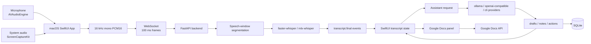
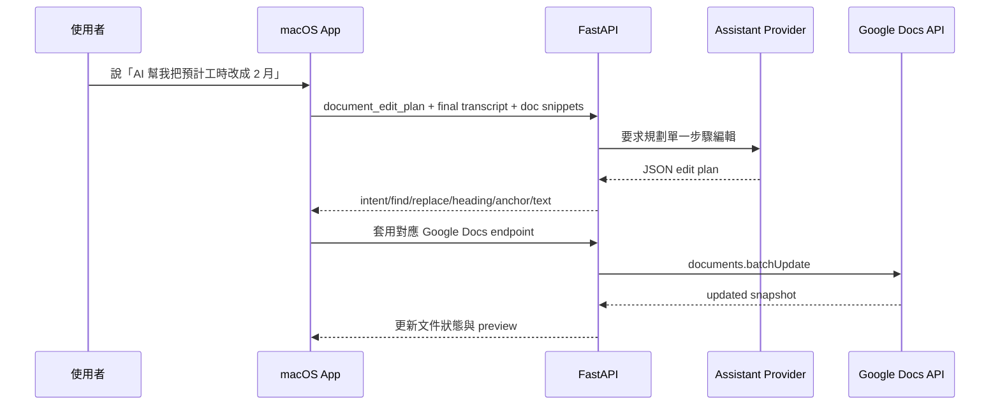

# emeet 期末報告

## 摘要

emeet 是一個以 macOS 原生 App 實作的即時會議輔助工具。它可以在任何線上會議或通話旁邊提供一個私密、易用、模型可切換的「即時會議副駕」。使用者按下 `Start Meeting` 後，App 會擷取麥克風與系統音訊，產生即時逐字稿；使用者可以按 `What should I say?` 取得下一句可直接說出口的保守回覆建議，按 `Follow-up questions` 取得追問問題，甚至一起協助瀏覽與編輯文件；系統也會每 30 秒根據逐字稿更新會議記錄與下一步動作，並能匯出 Markdown 紀錄。

本專題和一般會議軟體的差異，在於 emeet 把重點放在「會議進行中」而不是「會後整理」。一般 AI notetaker 多半擅長錄音、轉錄、摘要與會後搜尋；emeet 則希望在使用者還在對話中的時候，幫助使用者回答問題、延續討論、提出更好的追問，並在需要時協助使用者對正在討論的文件做即時修改。目前共同協助已支援 Google Docs：App 可連線指定文件、讀取文件內容、產生即時會議記錄，並根據明確語音指令規劃與套用單一步驟文件編輯，例如「幫我替換文字」、「把專案預計時長改成一小時」、「插入在標題下」、「頁面滾動到注意事項」。

這份報告介紹專題動機、競品比較、系統設計考量、系統架構、目前實作、限制、驗證方式與後續改進方向。

## 1. 動機與問題定義

現代會議的問題不只是「會後忘記內容」，更常見的是「會中來不及反應」。當對方在會議中提出需求、質疑時程、詢問風險或要求承諾，使用者通常同時要聽、理解、查資料、整理下一句話、記筆記、確認待辦事項。會後摘要工具能補救紀錄問題，但無法在關鍵回覆窗口內協助使用者。

emeet 想解決的是會議中的三個即時痛點：

1. 使用者不知道下一句怎麼回，或怕回答過度承諾。
2. 使用者需要追問，卻很難在當下整理出精準問題。
3. 使用者需要同步整理文件、筆記與行動項目，但不能中斷對話。

因此 emeet 的產品定位是：

**一個私密、macOS 原生、低摩擦、模型可選的即時會議副駕，把目前通話逐字稿轉成下一句可說的話、可追問的問題、會議筆記、下一步行動，以及可套用到文件的保守 AI 編輯建議。**

本專題並不是一個完整的會議平台。它不管理行事曆、不取代會議軟體、不自動寄信、不自動代表使用者發言。專注在一個可展示的端到端 loop：音訊擷取、即時轉錄、按鈕式回覆建議、追問、rolling notes、Markdown 匯出、provider/model 切換，以及 Google Docs 即時共編。

## 2. 競品比較與定位

目前 AI 會議工具市場已經很擁擠。Otter.ai、Fireflies.ai、Fathom、Granola、Krisp、Notion AI Meeting Notes、Zoom AI Companion、Microsoft Teams Copilot、Google Meet Gemini notes 等產品，都已經提供不同形式的轉錄、摘要、行動項目與會後查詢。

| 產品 | 主要強項 | 和 emeet 的差異 |
|---|---|---|
| Otter.ai | 即時轉錄、會議摘要、AI Chat、action items | 強在跨會議筆記與會後工作流，emeet 更強調本機執行、模型可換、建議接下來要做什麼、怎麼說。 |
| Fireflies.ai | 會議錄音、轉錄、摘要、action items、AskFred | 需要有一個機器人加入支援的會議軟體。 |
| Fathom | AI notetaker、摘要模板、action items、CRM 工作流 | 偏會後紀錄與團隊流程，emeet 更聚焦於即時回覆與文件共編。 |
| Granola | 無 bot AI notepad，結合手寫筆記與 AI notes | 也偏會議筆記，emeet 進一步做回覆建議、追問、provider 抽象與文件操作。 |
| Krisp AI Meeting Assistant | 轉錄、notes、action items、AI Chat、噪音處理 | 強在音訊處理與會議紀錄，emeet 更強調模型/推論可選與本機實驗性。 |
| Notion AI Meeting Notes | 會議轉錄後直接進 Notion workspace | emeet 目前以 Google Docs MVP 驗證即時文件共編，未綁死特定 workspace。 |
| Zoom AI Companion | Zoom 內建摘要、meeting questions、smart recording | emeet 可使用於任何會議軟體，甚至是通話。 |
| Teams Copilot | Teams 會議 Q&A、recap、follow-up tasks、Microsoft 365 grounding | emeet 可使用本地模型、任意平台，並且及時以語音互動。 |
| Google Meet Gemini notes | Meet 中 Take notes for me，會議 notes 進 Google Docs | emeet 可即時互動，並且不綁定任何平台。 |
| Hedy / Cluely 類工具 | 會中即時 coaching、real-time suggestions | 可即時進行文件共同編輯以及選擇 provider 與本地模型。 |

由競品可以看出：轉錄、摘要、action items 已經是基本能力，單純做「又一個 AI notetaker」沒有足夠差異。emeet 的比較優勢應放在四點：

1. **即時**：在會議進行中產生下一句回覆和追問，而不是只做會後摘要。
2. **文件共編**：會議討論時可同步讀取與修改工作文件，例如 Google Docs、未來的簡報、合約、委託書或本機檔案。
3. **本機與隱私**：可走本機 STT、本機 LLM，未來適合警察筆錄、機密會議、法律諮詢、醫療/心理諮詢等不適合雲端上傳的情境。
4. **模型與 provider 可切換**：可依速度、品質、成本、語言和隱私需求，切換 mlx-whisper、faster-whisper、Breeze ASR 25、Ollama、OpenAI-compatible endpoint、Codex CLI、GitHub Copilot CLI 等路徑。

## 3. 系統目標與範圍

目前功能如下：

1. 同時擷取麥克風與系統音訊。
2. 將音訊轉成 16 kHz mono PCM16，約每 100 ms 送到後端。
3. 後端以 speech-window segmentation 切出 final speech segment。
4. 使用 `faster-whisper`、`mlx-whisper` 或 `Breeze ASR 25` 產生逐字稿。
5. UI 顯示 `Self`、`Other` 或 `Speaker 1` / `Speaker 2` 等說話者標籤。
6. `What should I say?` 產生保守、自然、可直接說出口的回覆。
7. `Follow-up questions` 產生能釐清需求、限制、風險與下一步的問題。
8. Meeting Notes 每 30 秒根據新 final transcript 與既有 rolling notes/actions 更新。
9. 匯出 Markdown meeting record。
10. 切換 assistant provider / model / thinking。
11. 連接 Google Docs，讀取文件脈絡、更新 live notes，並可由語音觸發文件編輯。

非目標如下：

- 不讓 AI 自動替使用者發言。
- 不自動寄信、發訊息、建立任務或做外部副作用。
- 不把產品做成全功能會議平台。
- 不預設把所有逐字稿送到單一雲端模型。

## 4. Design Considerations

### 4.1 即時與會後是不同問題

會中輔助和會後筆記的延遲、準確性和風險不同。回覆建議需要快，通常只需要最近上下文與保守句子；會議筆記可以慢一點，但必須更穩定、可追溯、不能亂猜負責人或期限。因此 emeet 採用不同更新節奏：

- 音訊傳輸：100 ms PCM16 frame。
- STT：後端累積 speech window，產生 final transcript segment。
- 回覆/追問：使用者按鈕觸發。
- Meeting Notes：30 秒低頻自動更新。
- Google Docs voice edit：10 秒檢查一次新的 final transcript。

### 4.2 音訊來源要分流

如果把自己和遠端聲音先混成一軌，再做 speaker diarization，難度會大幅上升。MVP 先把麥克風和系統音訊分成兩條 session：

- 麥克風：`AVAudioEngine`。
- 系統/遠端音訊：`ScreenCaptureKit` `.audio`。

這樣至少能穩定區分 `Self` 與 `Other`。系統音訊內的不同遠端說話者，目前用本機音訊特徵做 segment-level clustering，產生 `Speaker 1`、`Speaker 2`。這不是完整 speaker diarization，但足以 demo 「不同使用者」的基本分辨。

### 4.3 模型不應綁死

會議助理的場景差異很大。一般課堂或專題討論可以用便宜快速模型；機密會議可能要求完全離線；中文/中英混雜會議可能需要特定 ASR 模型；高品質摘要可能要使用較強的雲端模型。因此 emeet 把 STT provider 與 assistant provider 都抽象化：

- STT：`faster-whisper`、`mlx-whisper`。
- Assistant：`ollama`、`openai-compatible`、`codex-cli`、`github-copilot-cli`。

UI 不直接解析模型自由文，而是吃後端正規化後的 `drafts`、`notes`、`actions`。

### 4.4 回覆建議必須保守

會議中最危險的 AI 輔助，是替使用者承諾日期、預算、負責人、法務核准或結果。因此 prompt 明確要求：

- 不 invent facts。
- 不猜 owner、date、budget、approval、commitment。
- 資訊不足時保持草稿或 unassigned。
- 產出 compact JSON。

這和產品定位一致：AI 是副駕，不是代理人。

### 4.5 文件共編要有人類可控

Google Docs MVP 已經能透過 API 寫文件，但文件修改仍應限制為保守的、可解釋的單一步驟操作。後端的 `document_edit_plan` prompt 只在 final transcript 內出現明確「AI 幫我...」指令時才規劃編輯；若資訊不足，就回傳 `intent: none` 和原因。

目前可執行的 intent 包含：

- `replace_text`
- `insert_under_heading`
- `rewrite_paragraph_containing_anchor`
- `append_meeting_notes`

這個設計避免 AI 在沒有明確指令時亂改文件。

## 5. Approach and System Architecture

整體架構如下：



### 5.1 macOS App

macOS App 位於 `apps/macos/emeet`。主要模組：

- `Audio/MicrophoneCaptureService.swift`：使用 `AVAudioEngine` 擷取麥克風。
- `ScreenCapture/SystemAudioCaptureService.swift`：使用 `ScreenCaptureKit` 擷取系統音訊。
- `Audio/PCM16AudioConverter.swift`：把麥克風音訊轉成 16 kHz mono PCM16。
- `Audio/SampleBufferPCM16AudioConverter.swift`：把 `CMSampleBuffer` 系統音訊轉成 mono PCM16。
- `Transcription/TranscriptionWebSocketClient.swift`：送 session metadata、100 ms audio frame、heartbeat ping，並解析後端事件。
- `App/CaptureViewModel*.swift`：管理 capture、transcript、assistant、auto summary、Google Docs、history、export 等狀態。
- `UI/ContentView.swift`、`UI/TranscriptWorkspace.swift`、`UI/AssistantWorkspace.swift`：組成主要工作區。

目前 UI 分成三欄：

- 左側：麥克風與系統音訊狀態、音量 meter、event log。
- 中間：即時逐字稿、backend latency、transcription latency。
- 右側：assistant provider/model/thinking、兩個 quick actions、Google Docs panel、Meeting Notes、Next Actions。

另外 App 也有 settings、meeting history、rename、continue saved meeting、saved meeting export 等功能。

### 5.2 Backend

Backend 位於 `apps/backend`，使用 FastAPI。主要入口：

- `GET /health`
- `GET /v1/transcribe/options`
- `WS /v1/transcribe/ws`
- `GET /v1/assistant/providers`
- `POST /v1/assistant/respond`
- `GET /v1/meetings`
- `GET /v1/meetings/{meeting_id}`
- `GET /v1/meetings/{meeting_id}/export`
- `POST /v1/google/docs/connect`
- `POST /v1/google/docs/update-live-notes`
- `POST /v1/google/docs/replace-text`
- `POST /v1/google/docs/insert-under-heading`
- `POST /v1/google/docs/rewrite-paragraph`

音訊進入後，`TranscriptionSession` 會解析 `session.start`，套用使用者選擇的 STT provider/model/language，再建立 transcriber。每個 audio frame 交給 `SpeechWindowSegmenter`；segmenter 會忽略 leading silence，累積 speech，遇到 trailing silence 或 max duration 後輸出 `SpeechSegment`。後端再呼叫 `faster-whisper` 或 `mlx-whisper`，回傳 `transcript.final`。

### 5.3 Assistant 管線

Assistant request 由 App 組出：

- action：`what_should_i_say`、`follow_up_questions`、`meeting_notes`、`document_briefing`、`document_edit_plan`、`meeting_title`。
- 最近逐字稿。
- rolling summary。
- previous notes/actions。
- Google Doc title、summary、snippets、briefing。
- provider/model/thinking。

後端的 `meeting_backend/assistant/prompts.py` 根據 action 選 prompt；`service.py` dispatch 到不同 provider；`schema.py` 正規化輸出。一般 assistant 輸出契約為：

```json
{
  "drafts": [{ "title": "...", "detail": "...", "badge": "...", "icon_name": "..." }],
  "notes": [{ "title": "...", "detail": "..." }],
  "actions": [{ "title": "...", "owner": "...", "state": "..." }]
}
```

這讓 UI 不需要解析任意模型 prose，而是直接渲染結構化資料。

### 5.4 Google Docs 共編管線

Google Docs 整合目前採用單使用者 local OAuth flow。後端會讀取 `apps/backend/secrets/google_oauth_client.json`，授權後產生 `google_token.json`。`GoogleDocsService` 透過 Google Docs API 讀取 document snapshot，flatten 成：

- plain text
- headings
- sections
- paragraphs
- text offset 到 Google Docs structural index 的 mapping

這個 mapping 讓後端可以安全產生 `batchUpdate` request，例如替換文字、插入 heading 下方、改寫含 anchor 的段落，或更新 `emeet Live Notes` 區塊。為了降低協作衝突，後端使用 revision id 的 write control；若遇到 revision conflict，會重新讀取文件再重試一次。

Voice edit flow 如下：



目前 UI 主要 expose Authorize、Connect、Open；後端和 ViewModel 也已有 scroll/find 相關方法，但完整「AI 幫我切到注意事項頁面」的自然語言導航還沒有做成一級 UI/assistant action。

### 5.5 Storage

SQLite schema 目前包含：

- `meetings`
- `sessions`
- `transcript_segments`
- `assistant_runs`
- `assistant_suggestions`
- `notes`
- `actions`

儲存設計是 append-first。逐字稿事件和 assistant result 都會記錄，meeting history 可以列出、讀取、重新命名、產生標題、匯出 Markdown。這已經足夠 demo，但還不是完整的長期 meeting memory 系統。

## 6. 實作細節

### 6.1 音訊處理

麥克風採 `AVAudioEngine.inputNode.installTap`。App 先要求 microphone permission，再把 input buffer 轉成 16 kHz mono PCM16，同時更新音量 meter。

系統音訊採 `ScreenCaptureKit`。App 要求 Screen Recording permission，建立 `SCStream`，設定 `capturesAudio = true`，收到 `.audio` sample buffer 後轉成 PCM16。這讓 emeet 可以擷取 Zoom、Google Meet、Teams、瀏覽器等第三方會議的輸出聲音，但也代表使用者需要理解為什麼 App 需要螢幕錄製權限。

WebSocket client 將 PCM16 audio buffer 聚合成 100 ms chunk 傳送，並每 5 秒送 heartbeat ping 量測 backend latency。

### 6.2 Segmentation 與 STT

後端不是每 100 ms 都呼叫 Whisper。100 ms 是傳輸 frame；真正送 STT 的是 speech window。`SpeechWindowSegmenter` 目前參數：

- `segment_min_ms = 800`
- `segment_silence_ms = 700`
- `segment_max_ms = 8000`
- `vad_rms_threshold = 0.012`

這個策略簡單、可 demo、成本低，但它目前只產生 final speech-window segment，還不是真正 token-level streaming partial。對畢業專題展示來說足夠；若要接近商用品質，未來應改成 Silero/WebRTC VAD 或語意邊界策略，並加入真正的 partial transcript。

### 6.3 說話者標籤

目前最穩的是來源標籤：

- microphone -> `Self`
- system audio -> `Other`

若啟用 `local-clustering`，系統音訊 segment 會抽取簡單 voice feature，做 online cluster，產生 `Speaker 1`、`Speaker 2`。這可展示「不同使用者」的基本概念，但限制很明顯：

- 不是完整 speaker diarization。
- 不處理重疊語音。
- 不能穩定知道真實姓名。
- 短句、噪音、外放回音會降低準確度。

未來若要高可信 speaker identity，需要平台層資料，例如 Zoom/Teams/Meet SDK 的 participant track，或使用已知 speaker reference。

### 6.4 回覆建議與追問

`What should I say?` 使用最近 transcript，產生 2-3 個短句。Prompt 要求「自然、保守、可直接說出口」，並避免承諾日期、預算、owner。

`Follow-up questions` 產生 3 個問題，優先釐清：

- 目標
- 限制
- 負責人
- 時程
- 風險
- 決策標準

這兩個功能應是 demo 的核心，因為它們直接展示 emeet 和一般會後整理工具的差異。

### 6.5 Rolling Notes 與 Next Actions

App 啟動會議後，每 30 秒檢查新增 final transcript。若有新內容，就呼叫 assistant `meeting_notes` action，傳入：

- 新 finalized transcript lines
- existing rolling notes/actions
- connected Google Doc context

Prompt 要求把 note 結構化為：

- 討論主題與內容
- 目前結論
- 待討論事項
- 未解決問題

Next Actions 則需要 task、owner、state。若 owner 未明示，使用 `Unassigned`。

### 6.6 Google Docs Live Notes 與 Voice Edit

當 Google Docs 已連線時，auto summary 產生的新 notes/actions 會同步更新文件內的 `emeet Live Notes` 區塊。這是「即時共編」的 MVP：會議還在進行時，文件就會滾動更新目前重點與下一步。

Voice edit 則每 10 秒檢查新增 final transcript，並要求 assistant 判斷是否有明確 AI-directed edit command。這種設計讓使用者可以說：

- 「AI 幫我把預計工時改成 2 月。」
- 「AI 請幫我在注意事項下面加一段...」
- 「AI 幫我把第二段改成...」

目前它只支援單一 connected Google Doc，還沒有支援 Google Drive 搜尋、本地檔案搜尋、簡報切頁或多文件 RAG。

## 7. 驗證與目前狀態

本次盤點時已執行：

```bash
cd apps/backend
uv run pytest
```

結果：`71 passed in 0.32s`。

也執行：

```bash
cd apps/macos/emeet
swift build
```

結果：build 成功。

目前測試覆蓋包含：

- assistant prompts/schema/service
- audio helper
- config
- Google Docs service
- MLX Whisper provider
- protocol
- segmenter
- local speaker assignment
- storage
- transcription options

尚缺的驗證包括：

- 實際 Zoom / Google Meet / Teams 系統音訊 benchmark。
- 中文/中英混雜 WER/CER。
- speaker label accuracy。
- button-to-suggestion latency。
- notes faithfulness。
- Google Docs voice edit 的端到端 UI 測試。
- 長時間 1-2 小時會議的記憶體、延遲與穩定性測試。

## 8. 目前限制與漏掉的功能

### 8.1 即時性還不是真正 streaming

目前後端輸出 speech-window final segments，不是 token-level streaming partial。這代表字幕和建議會有 segment delay。若要讓「我該說什麼？」更像真正即時副駕，下一步要加入 partial transcript、語意邊界與更快的 suggestion precompute。

### 8.2 VAD 太簡單

RMS threshold 對 demo 夠用，但在咖啡廳、鍵盤聲、多人搶話、音樂或外放回音環境會失準。應升級成 Silero/WebRTC VAD，並保留 hysteresis、speech padding、semantic boundary。

### 8.3 Speaker diarization 還不完整

目前可說「可分析不同使用者」但要精準描述：它能做來源式 `Self` / `Other`，以及系統音訊的本機 segment-level speaker numbering。它還不能穩定處理真實姓名、重疊語音、跨長會議 identity drift。

### 8.4 Google Docs 功能還是單文件 MVP

目前可連一份 Google Doc、讀內容、更新 live notes、做有限類型編輯。尚未完成：

- 從 Google Drive 找文件，例如「找出委託書」。
- 讀本地檔案並做 RAG。
- 操作簡報 Demo，例如切到某頁。
- 依自然語言移動游標到指定位置。
- 對高風險文件修改做明確人工確認 UI。

### 8.5 Chat box 還未完整產品化

後端已有 `chat` prompt template，但 UI 目前還沒有完整會議 Q&A route。這是很重要的缺口，因為使用者會自然想問：

- 「剛剛對方主要 concern 是什麼？」
- 「目前有哪些未決問題？」
- 「我們剛剛有承諾什麼嗎？」

### 8.6 證據與 schema 需要升級

目前 assistant schema 沒有 `schema_version`、`evidence_segment_ids`、invalid-output retry，也沒有把 `suggested_reply_v1`、`follow_up_questions_v1`、`meeting_notes_v1` 拆開。這會限制後續可驗證性、回歸測試與 UI 演進。

### 8.7 BYOK 與 secrets 還不完整

目前 backend 支援環境變數式 provider config。未來若做 BYOK UI，API keys、Google token、provider credentials 不應放 SQLite，應放 Keychain 或 backend-scoped ephemeral credentials。

### 8.8 隱私與同意 UX 還不足

MVP 有 macOS 系統權限流程，但產品層還應補：

- 明確 recording/capturing indicator。
- 會議前同意提醒。
- 本機/雲端模式標籤。
- 資料保存期限。
- 一鍵刪除本場會議資料。
- 哪些內容會送到哪個 provider 的可視化說明。

### 8.9 尚未完成外部 action 安全流程

未來若要建立 Jira、寄 email、發 Slack、改 Drive 檔案，必須有 user confirmation、audit log、undo/rollback 或至少 dry-run preview。MVP 不應自動做外部副作用。

## 9. 未來工作

### 9.1 近期可完成

1. 補完整 meeting chat UI，讓使用者針對逐字稿和 notes 問 AI。
2. Assistant schema 加入 `schema_version`、`evidence_segment_ids`、invalid-output retry。
3. Google Docs voice edit 加入 preview/confirm UI。
4. 把 browser scroll/find 做成 assistant action，例如「幫我切到注意事項」。
5. 補 benchmark script，量測 button-to-suggestion latency、STT latency、auto summary latency。

### 9.2 中期改進

1. 加入 Silero/WebRTC VAD 與語意邊界。
2. 加入 true partial transcript。
3. 支援 Google Drive 搜尋與本地檔案索引。
4. 加入 RAG，讓 AI 可在會議中找相關案子、合約、文件或研究資料。
5. 建立 local-first privacy mode：本機 STT + 本機 LLM + 不上傳逐字稿。
6. 加入 FTS5 與 meeting-level query/export API。

### 9.3 長期方向

1. 接平台層 participant track，例如 Zoom RTMS、Teams media bot、Meet Media API。
2. 做更完整的 speaker identity 與 evidence-grounded diarization。
3. 支援簡報、文件、瀏覽器頁面的可控 navigation。
4. 建立可審計的外部 action layer。
5. 做企業或高隱私場景：警察筆錄、法律諮詢、機密專案會議。

## 10. 結論

emeet 的價值不在於再做一個會後摘要工具，而是在會議當下把逐字稿轉成可立即使用的互動支援：下一句話、追問、筆記、行動項目與文件修改。它目前已經具備可 demo 的端到端 MVP：macOS 音訊擷取、WebSocket STT、Whisper provider、speaker labeling、assistant provider abstraction、rolling notes、history/export、Google Docs live notes 與 voice edit。

但要把它從 prototype 推向更可信的產品，接下來最重要的不是增加更多按鈕，而是提升基礎可靠性：true streaming partial、VAD、speaker labeling、evidence-grounded schema、隱私/同意 UX、文件操作確認流程、以及完整 benchmark。只要這些基礎補上，emeet 就能很清楚地和一般會議軟體拉開距離：它不是會議後的記錄員，而是會議中的私密 AI 副駕。

## 參考資料

### Repo 內部參考

- `README.md`
- `AGENTS.md`
- `apps/macos/emeet/Sources/emeet/Audio/MicrophoneCaptureService.swift`
- `apps/macos/emeet/Sources/emeet/ScreenCapture/SystemAudioCaptureService.swift`
- `apps/macos/emeet/Sources/emeet/Transcription/TranscriptionWebSocketClient.swift`
- `apps/macos/emeet/Sources/emeet/App/CaptureViewModel*.swift`
- `apps/backend/meeting_backend/main.py`
- `apps/backend/meeting_backend/sessions.py`
- `apps/backend/meeting_backend/transcription/segmenter.py`
- `apps/backend/meeting_backend/speakers.py`
- `apps/backend/meeting_backend/assistant/prompts.py`
- `apps/backend/meeting_backend/assistant/schema.py`
- `apps/backend/meeting_backend/google_docs_api.py`
- `apps/backend/meeting_backend/google_docs_service.py`
- `apps/backend/meeting_backend/storage.py`
- `docs/research/translated/01-產品定位與競爭分析.md`
- `docs/research/translated/02-音訊擷取技術研究.md`
- `docs/research/translated/04-音訊分塊與即時處理策略.md`
- `docs/research/translated/05-說話者分離研究.md`
- `docs/research/translated/06-即時回應建議與對話輔助設計.md`
- `docs/research/translated/07-會議筆記與行動項目格式設計.md`
- `docs/research/translated/09-模型供應商與自帶金鑰研究.md`
- `docs/research/translated/13-人工智慧管線與系統架構.md`
- `docs/research/translated/16-本機資料結構與SQLite儲存設計.md`
- `docs/research/translated/17-提示詞工程與結構化輸出策略.md`

### 競品與外部資料

- Otter.ai features: https://help.otter.ai/hc/en-us/articles/360047872833-Otter-ai-features
- Fireflies.ai overview: https://fireflies.zendesk.com/hc/en-us/articles/13940162530577-What-is-Fireflies-ai
- Fathom overview: https://www.fathom.ai/overview
- Granola docs: https://docs.granola.ai/article/granola-101
- Krisp AI Meeting Assistant overview: https://help.krisp.ai/hc/en-us/articles/8214720684956-AI-Meeting-Assistant-overview
- Notion AI Meeting Notes: https://www.notion.com/help/ai-meeting-notes
- Zoom AI Companion getting started: https://support.zoom.com/hc/en/article?id=zm_kb&sysparm_article=KB0057623
- Microsoft Teams Copilot meetings: https://support.microsoft.com/en-us/teams/copilot/catch-up-on-meetings-with-microsoft-365-copilot-in-teams
- Google Meet Take notes for me: https://support.google.com/meet/answer/14754931
- Gemini in Google Docs: https://support.google.com/docs/answer/15123226
- Google Docs API `documents.batchUpdate`: https://developers.google.com/docs/api/reference/rest/v1/documents/batchUpdate
- Hedy Automatic Suggestions: https://help.hedy.bot/en/articles/11657928-automatic-suggestions
- Cluely: https://cluely.com/
