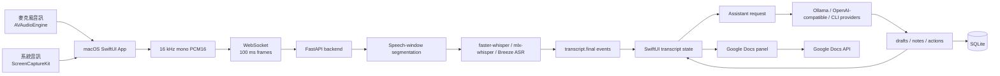
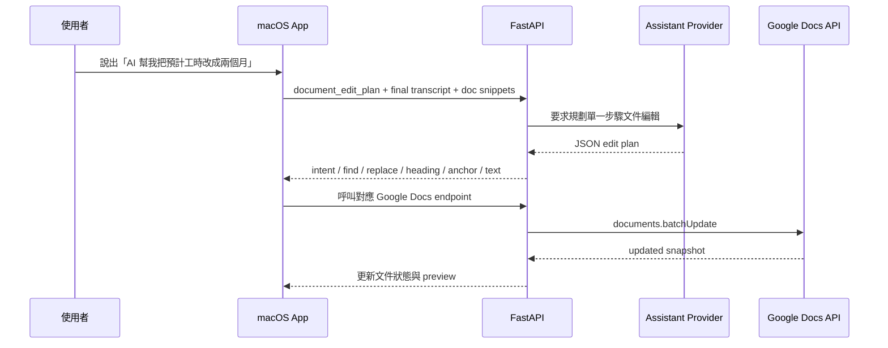

# 國立陽明交通大學百川學士學位學程<br>專題探索期末報告

## emeet：即時會議輔助與文件共編系統

## 摘要

emeet 是一個以 macOS 原生應用程式實作的即時會議輔助工具。它的核心目標不是單純替會議產生會後摘要，而是在會議進行中提供低干擾、可即時使用的輔助：包括即時逐字稿、下一句回覆建議、追問問題、滾動式會議紀錄、下一步行動，以及對 Google Docs 文件的即時讀取與有限度編輯。

使用者在啟動會議後，emeet 會同時擷取麥克風與系統音訊，將音訊轉換為 16 kHz mono PCM16 格式，透過 WebSocket 傳送至後端進行語音分段與語音轉文字。系統會將逐字稿依來源標示為 `Self`、`Other`，並可對系統音訊做初步的本機說話者分群。使用者可在會議中按下 `What should I say?` 取得保守、自然、可直接說出口的回覆建議；也可以按下 `Follow-up questions` 取得有助於釐清需求、風險、時程與責任分工的追問。系統另會每 30 秒根據新增逐字稿更新會議紀錄與下一步行動，並支援匯出 Markdown 形式的會議紀錄。

本專題的另一項重點是文件共編。emeet 目前已支援連接指定 Google Docs 文件，讀取文件內容，將會議中產生的重點與行動項目同步更新至文件中的 `emeet Live Notes` 區塊，也能根據明確的語音指令規劃並執行單一步驟的文件編輯，例如替換文字、在指定標題下插入內容、改寫包含特定關鍵字的段落等。

整體而言，emeet 嘗試將會議輔助工具從「會後整理」推進到「會中協作」。目前系統已完成可展示的端到端原型，包含 macOS 音訊擷取、後端語音轉文字、模型供應商抽象、會議輔助建議、會議紀錄儲存與匯出，以及 Google Docs 即時共編功能。後續若要進一步走向穩定產品，仍需補強真正串流式逐字稿、語音活動偵測、說話者辨識、文件操作確認流程、隱私與同意介面，以及更完整的延遲與準確率測試。

---

## 一、專題動機與問題定義

現代線上會議常見的問題，不只是會後忘記討論內容，而是會議進行中就已經來不及反應。當對方提出需求、質疑時程、詢問風險或要求承諾時，使用者往往需要同時完成多件事：聽懂對方的意思、判斷目前情境、整理下一句回答、避免過度承諾、記下重點，甚至同步修改文件或確認待辦事項。

目前許多 AI 會議工具已能做到錄音、轉錄、摘要與會後搜尋，但這些功能多半在會議結束後才發揮價值。對實際會議情境而言，很多關鍵時刻發生在當下。例如，使用者可能需要馬上回答「這件事什麼時候可以完成？」、「這樣做有什麼風險？」、「你們可以直接改文件嗎？」。如果 AI 只能在會後整理紀錄，就無法協助使用者處理這些即時互動。

因此，本專題希望探索的問題是：

**能否建立一個私密、低干擾、可切換模型的即時會議副駕，將會議中的逐字稿即時轉換為可說出口的回覆、可追問的問題、會議紀錄、下一步行動，以及可套用到文件的保守編輯建議？**

基於這個問題，emeet 的產品定位並不是完整的會議平台，也不是單純的 AI 會後筆記工具。它不管理行事曆、不取代 Zoom、Google Meet 或 Microsoft Teams，也不自動替使用者發言或發送訊息。它專注於一個明確的端到端流程：擷取音訊、產生逐字稿、提供會中輔助、更新會議紀錄，並在使用者明確指示下協助修改文件。

本專題想解決的即時痛點可分為三類：

1. **回覆困難**：使用者在會議中不知道下一句該怎麼回，或擔心自己回答得太快而做出不必要的承諾。
2. **追問不足**：使用者知道對方的說法還不夠清楚，但很難在當下整理出精準的追問。
3. **同步整理困難**：使用者需要一邊參與討論，一邊整理文件、會議紀錄與行動項目，容易中斷對話節奏。

emeet 的設計就是圍繞這三個問題展開。

---

## 二、相關工具比較與專題定位

AI 會議工具市場已經相當成熟。Otter.ai、Fireflies.ai、Fathom、Granola、Krisp、Notion AI Meeting Notes、Zoom AI Companion、Microsoft Teams Copilot、Google Meet Gemini notes 等工具，都已提供不同形式的轉錄、摘要、會議紀錄與行動項目整理。這些工具的共同價值在於降低會後整理成本，讓使用者能快速回顧會議內容。

然而，本專題觀察到，單純再做一個 AI notetaker 並沒有明顯差異。轉錄、摘要、action items 已逐漸成為基礎功能。若要做出新的價值，重點應放在會議進行中的互動支援，以及和會議中正在使用的文件、資料、工作流連動。

| 工具                         | 主要強項                                          | 與 emeet 的差異                                                                   |
| -------------------------- | --------------------------------------------- | ----------------------------------------------------------------------------- |
| Otter.ai                   | 即時轉錄、會議摘要、AI Chat、action items                | Otter.ai 強在跨會議筆記與會後工作流；emeet 更重視會議當下的回覆建議、追問與文件共編。                            |
| Fireflies.ai               | 會議錄音、轉錄、摘要、action items、AskFred               | Fireflies.ai 通常需要以機器人形式加入會議；emeet 採 macOS 本機音訊擷取，不綁定特定會議平台。                   |
| Fathom                     | AI notetaker、摘要模板、action items、CRM 工作流        | Fathom 偏向會後紀錄與團隊流程；emeet 聚焦即時會議輔助與文件操作。                                       |
| Granola                    | 無 bot AI notepad，結合手寫筆記與 AI notes             | Granola 的方向與 emeet 較接近，但 emeet 進一步實驗回覆建議、追問、模型供應商抽象與文件共編。                     |
| Krisp AI Meeting Assistant | 轉錄、會議紀錄、action items、噪音處理                     | Krisp 強在音訊處理與會議紀錄；emeet 更重視即時互動與可替換模型架構。                                      |
| Notion AI Meeting Notes    | 會議轉錄後整合進 Notion workspace                     | Notion 適合已在 Notion 工作流中的使用者；emeet 目前以 Google Docs 作為文件共編 MVP，未綁死單一 workspace。 |
| Zoom AI Companion          | Zoom 內建會議摘要、meeting questions、smart recording | Zoom AI Companion 綁定 Zoom；emeet 可用於不同會議軟體或一般語音通話。                             |
| Teams Copilot              | Teams 會議 Q&A、recap、Microsoft 365 grounding    | Teams Copilot 深度整合 Microsoft 365；emeet 則探索跨平台、本機優先與模型可替換的方向。                  |
| Google Meet Gemini notes   | Meet 內建 Take notes for me，筆記可進 Google Docs    | Gemini notes 重點在 Meet 生態系；emeet 嘗試將同樣概念延伸為任意通話旁的即時副駕。                         |
| Hedy / Cluely 類工具          | 會中即時 coaching、real-time suggestions           | emeet 除會中建議外，也加入文件讀取、文件編輯與本機模型供應商切換。                                          |

由上述比較可見，emeet 的差異化重點不在於「能不能摘要」，而在於以下四點：

### 1. 即時輔助

emeet 的主要價值發生在會議進行中。它希望在使用者還在對話時，就能根據最新逐字稿產生可用的回覆與追問，而不是等會議結束後才整理內容。

### 2. 文件共編

許多會議其實圍繞文件進行，例如企劃書、合約、課程文件、需求規格、專案紀錄等。emeet 將會議內容和 Google Docs 串接，讓 AI 不只理解語音，也能理解正在討論的文件脈絡，並在使用者明確要求下協助修改。

### 3. 本機與隱私彈性

部分會議不適合將音訊或逐字稿送往雲端，例如機密專案、法律諮詢、醫療諮詢、心理諮商或警察筆錄。emeet 的架構允許語音轉文字與語言模型使用本機或私有端點，未來可朝 local-first privacy mode 發展。

### 4. 模型與供應商可切換

不同會議對速度、成本、準確率、語言能力與隱私需求不同。emeet 將語音轉文字與助理模型分層抽象，目前支援 `faster-whisper`、`mlx-whisper`、Ollama、OpenAI-compatible endpoint、Codex CLI、GitHub Copilot CLI 等路徑，方便依情境選擇不同模型。

---

## 三、專題目標與範圍

本專題的目標是完成一個可實際展示的即時會議輔助原型。系統需要能從 macOS 擷取會議音訊，將其轉成逐字稿，提供會中輔助，並把會議內容整理成可保存、可匯出的紀錄。同時，系統也要驗證「會議輔助」和「文件共編」能否整合在同一個使用流程中。

目前完成的功能包括：

1. 同時擷取麥克風與系統音訊。
2. 將音訊轉成 16 kHz mono PCM16，約每 100 ms 傳送至後端。
3. 後端依 speech window 進行語音分段。
4. 支援 `faster-whisper`、`mlx-whisper` 與 Breeze ASR 25 等語音轉文字路徑。
5. 在 UI 中顯示 `Self`、`Other` 或 `Speaker 1`、`Speaker 2` 等說話者標籤。
6. 使用 `What should I say?` 產生保守、自然、可直接說出口的回覆。
7. 使用 `Follow-up questions` 產生有助於釐清需求、限制、風險與下一步的問題。
8. 每 30 秒根據新增逐字稿更新會議紀錄與下一步行動。
9. 支援 Markdown 形式的會議紀錄匯出。
10. 支援助理模型供應商、模型與 thinking 設定切換。
11. 連接 Google Docs，讀取文件脈絡、更新 live notes，並可由語音觸發有限度文件編輯。
12. 使用 SQLite 儲存會議、逐字稿、助理執行結果、會議筆記與行動項目。

本專題也明確界定了目前不處理的範圍：

* 不建立完整會議平台。
* 不自動替使用者發言。
* 不自動寄信、發訊息或建立外部任務。
* 不在沒有使用者明確指令時修改文件。
* 不預設將所有逐字稿送到單一雲端模型。
* 不把目前的說話者分群宣稱為完整 speaker diarization。

這些限制是刻意保留的設計邊界。因為會議輔助工具一旦牽涉自動承諾、自動發言或自動修改外部資料，就會有較高風險。因此 emeet 目前將 AI 定位為副駕，而不是代理人。

---

## 四、設計考量

### 4.1 會中輔助與會後整理是不同問題

會中輔助和會後摘要對系統的要求不同。會後摘要可以等待較長時間，但要求完整、穩定、可追溯；會中回覆則要求速度快、語氣自然、內容保守，即使資訊不完整，也要避免胡亂推論。

因此 emeet 採用不同的更新節奏：

* 音訊傳輸：每 100 ms 傳送 PCM16 frame。
* 語音轉文字：後端累積 speech window 後產生 final transcript segment。
* 回覆與追問：由使用者按鈕觸發。
* 會議紀錄：每 30 秒低頻自動更新。
* Google Docs 語音編輯：每 10 秒檢查是否出現新的明確文件編輯指令。

這樣的節奏能避免系統過度頻繁呼叫模型，也能讓不同功能使用適合自己的延遲與準確性取捨。

### 4.2 音訊來源需要分流

若一開始就把自己和遠端聲音混成同一軌，再嘗試做 speaker diarization，難度會大幅提高。因此 emeet 在 MVP 階段採用較務實的做法：將麥克風音訊與系統音訊拆成兩條 session。

目前音訊來源如下：

* 麥克風音訊：透過 `AVAudioEngine` 擷取。
* 系統音訊：透過 `ScreenCaptureKit` 的 `.audio` 擷取。

這樣可以穩定區分 `Self` 與 `Other`。對系統音訊內的多位遠端說話者，emeet 目前使用本機音訊特徵做 segment-level clustering，標示為 `Speaker 1`、`Speaker 2`。這不是完整的說話者辨識，但足以展示「不同來源與不同遠端說話者初步區分」的概念。

### 4.3 模型不應綁死

會議場景差異很大。一般課堂討論可能只需要便宜且快速的模型；正式商務會議可能需要更好的摘要品質；機密討論可能要求完全離線；中文與中英混雜會議則可能需要特定語音辨識模型。

因此 emeet 在架構上將語音轉文字與助理模型拆開：

* 語音轉文字供應商：`faster-whisper`、`mlx-whisper`、Breeze ASR 25。
* 助理模型供應商：Ollama、OpenAI-compatible endpoint、Codex CLI、GitHub Copilot CLI。

前端 UI 不直接處理模型任意產生的自由文字，而是接收後端正規化後的 `drafts`、`notes`、`actions` 等結構化資料。這可以降低不同模型輸出格式不穩定對 UI 造成的影響。

### 4.4 回覆建議必須保守

會議中最危險的 AI 輔助，是替使用者做出不存在的承諾。例如未經確認就答應日期、預算、負責人、法務核准或交付成果。因此 emeet 的 prompt 設計明確要求模型避免編造事實：

* 不猜測 owner、date、budget、approval 或 commitment。
* 資訊不足時維持草稿狀態或標示為 `Unassigned`。
* 回覆應短、自然、可直接說出口。
* 輸出應為 compact JSON，便於 UI 穩定渲染。

這樣的設計符合 emeet 的定位：AI 提供建議，但最後仍由使用者判斷是否採用。

### 4.5 文件共編需要人類可控

Google Docs 整合雖然可以直接透過 API 修改文件，但文件修改具有外部副作用，因此不能讓 AI 在沒有明確指令的情況下自由改文。emeet 目前只在 final transcript 中出現明確 AI-directed edit command 時，才要求模型規劃文件編輯。若資訊不足，系統會回傳 `intent: none` 與原因。

目前支援的文件編輯 intent 包含：

* `replace_text`
* `insert_under_heading`
* `rewrite_paragraph_containing_anchor`
* `append_meeting_notes`

這樣可以將風險控制在較明確、單一步驟、容易理解的文件操作內。未來若要處理更高風險的文件，例如合約、委託書或正式報告，仍需要加入人工確認、修改預覽與版本回復機制。

---

## 五、系統架構

emeet 採用 macOS 前端應用程式加 FastAPI 後端的架構。前端負責擷取音訊、顯示逐字稿與助理結果、管理使用者操作；後端負責語音分段、語音轉文字、模型呼叫、資料儲存與 Google Docs API 整合。

整體流程如下：



### 5.1 macOS 前端

macOS 應用程式位於 `apps/macos/emeet`，使用 SwiftUI 實作。主要模組包括：

* `Audio/MicrophoneCaptureService.swift`：使用 `AVAudioEngine` 擷取麥克風。
* `ScreenCapture/SystemAudioCaptureService.swift`：使用 `ScreenCaptureKit` 擷取系統音訊。
* `Audio/PCM16AudioConverter.swift`：將麥克風音訊轉為 16 kHz mono PCM16。
* `Audio/SampleBufferPCM16AudioConverter.swift`：將系統音訊的 `CMSampleBuffer` 轉為 mono PCM16。
* `Transcription/TranscriptionWebSocketClient.swift`：負責 WebSocket 連線、傳送 session metadata、傳送音訊 frame、heartbeat ping，以及解析後端事件。
* `App/CaptureViewModel*.swift`：管理擷取狀態、逐字稿、助理結果、自動摘要、Google Docs、歷史紀錄與匯出。
* `UI/ContentView.swift`、`UI/TranscriptWorkspace.swift`、`UI/AssistantWorkspace.swift`：組成主要操作介面。

目前 UI 分成三個主要區域：

1. **左側狀態區**：顯示麥克風與系統音訊狀態、音量 meter、event log。
2. **中央逐字稿區**：顯示即時逐字稿、backend latency、transcription latency。
3. **右側助理區**：顯示模型供應商與模型設定、quick actions、Google Docs panel、Meeting Notes 與 Next Actions。

應用程式也支援 settings、meeting history、重新命名會議、延續已儲存會議，以及匯出已儲存會議紀錄。

### 5.2 後端服務

後端位於 `apps/backend`，使用 FastAPI 實作。主要 API 包含：

* `GET /health`
* `GET /v1/transcribe/options`
* `WS /v1/transcribe/ws`
* `GET /v1/assistant/providers`
* `POST /v1/assistant/respond`
* `GET /v1/meetings`
* `GET /v1/meetings/{meeting_id}`
* `GET /v1/meetings/{meeting_id}/export`
* `POST /v1/google/docs/connect`
* `POST /v1/google/docs/update-live-notes`
* `POST /v1/google/docs/replace-text`
* `POST /v1/google/docs/insert-under-heading`
* `POST /v1/google/docs/rewrite-paragraph`

音訊進入後，`TranscriptionSession` 會解析 `session.start`，套用使用者選擇的語音轉文字供應商、模型與語言設定，再建立 transcriber。每個 audio frame 交給 `SpeechWindowSegmenter`，由 segmenter 忽略 leading silence、累積 speech，並在偵測到 trailing silence 或達到最大片段長度時輸出 `SpeechSegment`。後端再呼叫指定的語音轉文字模型，回傳 `transcript.final` 事件給前端。

### 5.3 助理管線

前端在使用者按下 quick action 或自動更新會議紀錄時，會組出 assistant request。request 內容包含：

* action：例如 `what_should_i_say`、`follow_up_questions`、`meeting_notes`、`document_briefing`、`document_edit_plan`、`meeting_title`。
* 最近逐字稿。
* 目前 rolling summary。
* 既有 notes 與 actions。
* Google Docs 文件標題、摘要、片段與 briefing。
* 使用者選擇的模型供應商、模型與 thinking 設定。

後端的 `meeting_backend/assistant/prompts.py` 根據 action 選擇 prompt；`service.py` dispatch 到不同供應商；`schema.py` 負責正規化模型輸出。一般助理回傳格式如下：

```json
{
  "drafts": [
    {
      "title": "...",
      "detail": "...",
      "badge": "...",
      "icon_name": "..."
    }
  ],
  "notes": [
    {
      "title": "...",
      "detail": "..."
    }
  ],
  "actions": [
    {
      "title": "...",
      "owner": "...",
      "state": "..."
    }
  ]
}
```

這種格式讓前端不必解析模型自由文字，而是直接呈現結構化結果，也方便後續測試與版本演進。

### 5.4 Google Docs 共編管線

Google Docs 整合目前採單使用者 local OAuth flow。後端讀取 `apps/backend/secrets/google_oauth_client.json`，完成授權後產生 `google_token.json`。`GoogleDocsService` 透過 Google Docs API 讀取文件 snapshot，並將文件整理為：

* plain text
* headings
* sections
* paragraphs
* text offset 到 Google Docs structural index 的 mapping

這個 mapping 使後端能較安全地產生 `batchUpdate` request，例如替換文字、在指定 heading 下插入內容、改寫包含 anchor 的段落，或更新 `emeet Live Notes` 區塊。為了降低多人協作衝突，後端使用 revision id 的 write control；若遇到 revision conflict，會重新讀取文件並重試一次。

語音驅動文件編輯的流程如下：



目前 UI 已提供 Authorize、Connect、Open 等基本操作。後端與 ViewModel 也已具備 scroll/find 相關方法，但自然語言導覽，例如「幫我切到注意事項那一段」，尚未完整做成一級 UI 與 assistant action。

### 5.5 資料儲存

emeet 使用 SQLite 儲存會議資料。主要資料表包括：

* `meetings`
* `sessions`
* `transcript_segments`
* `assistant_runs`
* `assistant_suggestions`
* `notes`
* `actions`

目前儲存策略偏向 append-first。逐字稿事件與助理執行結果都會被記錄，使用者可以在 meeting history 中查看、重新命名、產生標題，或匯出 Markdown 紀錄。這樣的設計已足以支撐展示與基本使用，但還不是完整的長期 meeting memory 系統。若未來要支援跨會議查詢、語意搜尋與長期知識庫，仍需加入全文搜尋、embedding 或 RAG 架構。

---

## 六、實作內容

### 6.1 音訊擷取與轉換

麥克風擷取使用 `AVAudioEngine.inputNode.installTap`。應用程式會先要求 microphone permission，再將 input buffer 轉成 16 kHz mono PCM16，同時更新 UI 中的音量 meter。

系統音訊擷取使用 `ScreenCaptureKit`。應用程式會要求 Screen Recording permission，建立 `SCStream`，設定 `capturesAudio = true`，收到 `.audio` sample buffer 後轉成 PCM16。這使 emeet 可以擷取 Zoom、Google Meet、Microsoft Teams、瀏覽器或其他通話軟體的輸出聲音。

這項設計的優點是跨平台會議軟體通用，不需要每個會議平台都提供 API 或 bot 整合。缺點是使用者必須理解為什麼一個會議助理需要 macOS 螢幕錄製權限。未來在產品化時，這部分需要更清楚的權限說明與隱私提示。

WebSocket client 會將 PCM16 audio buffer 聚合成 100 ms chunk 傳送至後端，並每 5 秒送出 heartbeat ping，用於量測後端延遲與連線狀態。

### 6.2 語音分段與語音轉文字

後端不是每收到 100 ms 音訊就呼叫 Whisper，而是先由 `SpeechWindowSegmenter` 將連續音訊切成適合語音轉文字的片段。這樣能降低模型呼叫頻率，也能避免過短音訊片段造成辨識不穩。

目前 segmenter 主要參數如下：

* `segment_min_ms = 800`
* `segment_silence_ms = 700`
* `segment_max_ms = 8000`
* `vad_rms_threshold = 0.012`

這個策略實作簡單，適合目前展示用的原型，但仍有明顯限制。RMS threshold 對背景噪音、鍵盤聲、多人搶話、外放回音與音樂較敏感。若要提升穩定性，未來應改用 Silero VAD、WebRTC VAD 或結合語意邊界的分段策略。

目前逐字稿輸出是 speech-window final segment，並不是真正 token-level streaming partial。也就是說，使用者會在一句話或一小段話結束後看到 final transcript，而不是每個字即時跳出。這對專題展示已足夠，但若要接近商用品質，仍需要加入真正的 partial transcript。

### 6.3 說話者標籤

目前最穩定的說話者區分方式是來源標籤：

* 麥克風音訊標示為 `Self`。
* 系統音訊標示為 `Other`。

若啟用 `local-clustering`，系統會對遠端音訊 segment 抽取簡單 voice feature，進行 online cluster，並標示為 `Speaker 1`、`Speaker 2`。這可以展示不同遠端說話者初步分辨的可能性，但目前仍有以下限制：

* 不是完整 speaker diarization。
* 不處理重疊語音。
* 不能穩定判斷真實姓名。
* 短句、噪音與外放回音會降低準確度。
* 長時間會議中可能發生 identity drift。

因此在本專題中，這項功能應被定位為「來源分流與初步說話者分群」，而非完整的說話者辨識系統。

### 6.4 即時回覆建議

`What should I say?` 是 emeet 的核心功能之一。它會根據最近逐字稿與目前會議脈絡，產生 2 到 3 個短句形式的回覆建議。這些建議的設計原則是：

* 可以直接說出口。
* 語氣自然，不像正式書面摘要。
* 不過度承諾。
* 不編造日期、預算、負責人或核准狀態。
* 在資訊不足時，建議使用者先釐清條件。

例如在對方詢問時程但會議中沒有明確資訊時，系統不應直接回答「我們下週五會完成」，而應提供類似「我先確認一下目前資源和優先順序，再給你一個比較可靠的時間」這類保守回覆。

### 6.5 追問問題

`Follow-up questions` 會根據會議內容產生幾個適合當下提出的追問。這些問題通常用來釐清：

* 目標與成功標準。
* 時程限制。
* 責任分工。
* 風險與阻礙。
* 決策依據。
* 是否已有既定限制或不可變條件。

追問功能的重要性在於，它不只是幫使用者「回答」，也幫使用者把討論推向更清楚的方向。這對會議品質的提升比單純摘要更直接。

### 6.6 滾動式會議紀錄與下一步行動

會議啟動後，系統每 30 秒檢查是否有新增 final transcript。若有新內容，就呼叫 assistant 的 `meeting_notes` action，將新增逐字稿、既有會議紀錄、既有行動項目，以及已連接的 Google Docs 脈絡一起送入模型。

會議紀錄主要整理為：

* 討論主題與內容。
* 目前結論。
* 待討論事項。
* 未解決問題。

下一步行動則包含：

* 任務內容。
* 負責人。
* 狀態。

如果會議中沒有明確指定負責人，系統會標示為 `Unassigned`，避免模型自行猜測。

### 6.7 Google Docs Live Notes 與語音驅動文件編輯

當 Google Docs 已連線時，emeet 會將自動產生的 notes 與 actions 更新到文件中的 `emeet Live Notes` 區塊。這是目前文件共編的 MVP：會議進行中，文件會同步呈現目前討論重點與下一步行動。

語音驅動文件編輯則採更保守的設計。系統每 10 秒檢查新增 final transcript，並要求 assistant 判斷是否出現明確的 AI-directed edit command。例如：

* 「AI 幫我把預計工時改成兩個月。」
* 「AI 請幫我在注意事項下面加一段文字。」
* 「AI 幫我把第二段改寫得更正式。」

若模型判斷指令明確，才會產生單一步驟的文件編輯計畫，並呼叫對應的 Google Docs endpoint。若指令不明確，則不執行任何修改。

目前這部分已能展示會議語音、文件脈絡與 API 寫入的整合，但還需要更完整的人工確認介面。對正式文件而言，使用者應該能在套用前看到修改前後差異，並明確按下確認。

---

## 七、專題歷程

本專題的進行可分為四個階段。

### 7.1 期初：問題界定與產品定位

期初主要工作是釐清題目方向。最初的想法是做一個 AI 會議紀錄工具，但在比較現有工具後，我發現單純轉錄與摘要已經有許多成熟產品。如果只做另一個 notetaker，專題價值不夠明確。

因此，我將題目重新定位為「即時會議副駕」。這個定位讓功能重點從會後整理轉向會中互動，並形成幾個核心問題：如何在會議中即時提供回覆？如何避免 AI 過度承諾？如何把會議內容和文件連動？如何保留本機與隱私彈性？

### 7.2 期中：建立音訊與語音轉文字原型

期中階段主要處理 macOS 音訊擷取與後端語音轉文字。這部分比原先想像複雜，因為會議助理需要同時處理麥克風與系統音訊。若只擷取麥克風，就無法理解對方說了什麼；若只擷取系統音訊，又無法知道使用者自己的回覆。

最後我採用 `AVAudioEngine` 擷取麥克風，並使用 `ScreenCaptureKit` 擷取系統音訊。前端將兩種音訊都轉成 16 kHz mono PCM16，再透過 WebSocket 傳給後端。後端以 speech window 方式切分語音，再交給 Whisper 類模型辨識。這個階段完成後，系統已能產生基本即時逐字稿。

### 7.3 期中後：加入助理功能與會議紀錄

在逐字稿流程穩定後，我開始加入會議助理功能。最先完成的是 `What should I say?` 與 `Follow-up questions`。這兩個功能讓系統不再只是記錄工具，而能在會議當下提供互動支援。

接著加入每 30 秒更新的 meeting notes 與 next actions。這部分的挑戰在於模型輸出必須穩定，否則 UI 很難呈現。因此我將助理輸出設計成結構化 JSON，並在後端做 schema 正規化，讓不同模型供應商的輸出可以被統一渲染。

### 7.4 期末：Google Docs 共編與系統整理

期末階段主要完成 Google Docs 整合。系統能透過 OAuth 連接文件，讀取文件內容，將文件拆成 heading、section、paragraph 等結構，並建立文字 offset 與 Google Docs structural index 的 mapping。這使系統可以在會議進行中更新 live notes，也能根據語音指令執行有限的文件編輯。

同時，我也整理了 meeting history、Markdown export、模型供應商切換、測試與建置流程。最後，本專題形成一個可完整展示的端到端原型：從 macOS 音訊擷取，到後端語音轉文字，再到會議助理、資料儲存與 Google Docs 文件共編。

---

## 八、目前成果與驗證

目前已完成的成果包括：

1. macOS 原生應用程式介面。
2. 麥克風與系統音訊雙來源擷取。
3. PCM16 音訊轉換與 WebSocket 傳輸。
4. 後端 speech-window segmentation。
5. Whisper 類語音轉文字供應商整合。
6. `Self` / `Other` 來源標籤與初步說話者分群。
7. 會中回覆建議。
8. 會中追問問題。
9. 每 30 秒更新的會議紀錄與下一步行動。
10. SQLite 會議資料儲存。
11. 會議歷史、重新命名、延續與 Markdown 匯出。
12. 助理模型供應商抽象。
13. Google Docs 授權、連接、讀取、live notes 更新與有限度文件編輯。

本次盤點時已執行後端測試：

```bash
cd apps/backend
uv run pytest
```

測試結果為：

```text
71 passed in 0.32s
```

也執行 macOS 應用程式建置：

```bash
cd apps/macos/emeet
swift build
```

結果為 build 成功。

目前測試涵蓋範圍包括：

* assistant prompts、schema 與 service。
* audio helper。
* config。
* Google Docs service。
* MLX Whisper provider。
* protocol。
* segmenter。
* local speaker assignment。
* storage。
* transcription options。

尚未完成的驗證包括：

* Zoom、Google Meet、Microsoft Teams 等實際會議場景的系統音訊 benchmark。
* 中文與中英混雜會議的 WER / CER。
* speaker label accuracy。
* button-to-suggestion latency。
* notes faithfulness。
* Google Docs voice edit 的端到端 UI 測試。
* 1 到 2 小時長會議的記憶體、延遲與穩定性測試。

---

## 九、目前限制

### 9.1 還不是真正串流式逐字稿

目前系統輸出的是 speech-window final segment，而不是 token-level streaming partial。這代表字幕會在一小段語音結束後出現，而非逐字即時出現。若要讓系統更接近真正的即時副駕，未來需要加入 partial transcript、語意邊界與更快的 suggestion precompute。

### 9.2 語音活動偵測仍較簡單

目前使用 RMS threshold 作為語音活動偵測基礎，對展示足夠，但在吵雜環境中容易失準。若背景有鍵盤聲、音樂、外放回音或多人同時說話，分段品質會下降。未來應改用 Silero VAD、WebRTC VAD 或混合式策略。

### 9.3 說話者辨識尚不完整

目前最可靠的是 `Self` 與 `Other` 的來源分流。系統音訊內的 `Speaker 1`、`Speaker 2` 只是初步本機分群，不應被視為完整 speaker diarization。若要取得高可信度的說話者身份，未來可能需要整合會議平台的 participant track，或使用已知說話者 reference。

### 9.4 Google Docs 仍是單文件 MVP

目前 emeet 可連接一份 Google Docs，讀取文件、更新 live notes，並做有限類型的文件編輯。尚未完成的功能包括：

* 從 Google Drive 搜尋指定文件。
* 讀取本地檔案並做 RAG。
* 操作簡報，例如切到指定頁面。
* 依自然語言移動游標到指定位置。
* 對高風險文件修改提供明確人工確認 UI。

### 9.5 會議問答尚未完整產品化

後端已有 chat prompt template，但前端尚未完成完整的會議 Q&A route。這是一個重要缺口，因為使用者很自然會想問：

* 「剛剛對方主要 concern 是什麼？」
* 「目前有哪些未決問題？」
* 「我們剛剛有承諾什麼嗎？」
* 「下一步誰要做什麼？」

這類問題若能直接在會議中詢問，會讓 emeet 更像真正的會議副駕。

### 9.6 證據追蹤與 schema 需要升級

目前 assistant schema 尚未加入 `schema_version`、`evidence_segment_ids`、invalid-output retry，也還沒有將 `suggested_reply_v1`、`follow_up_questions_v1`、`meeting_notes_v1` 拆成更明確的版本化 schema。這會限制未來的可測試性、回歸測試與 UI 演進。

### 9.7 隱私與同意介面仍需補強

目前系統有使用 macOS 權限流程，但產品層仍需要更完整的隱私 UX，例如：

* 明確 recording / capturing indicator。
* 會議前同意提醒。
* 本機模式與雲端模式標籤。
* 資料保存期限說明。
* 一鍵刪除本場會議資料。
* 顯示哪些內容會送到哪個模型供應商。

對會議輔助工具而言，隱私不是附加功能，而是基礎設計的一部分。

### 9.8 外部操作需要安全流程

未來若要讓系統建立 Jira issue、寄 email、發 Slack 訊息、修改 Drive 檔案或操作其他外部工具，必須加入 user confirmation、audit log、dry-run preview，甚至 undo / rollback。MVP 階段不應自動執行這類高風險外部副作用。

---

## 十、後續工作

### 10.1 近期可完成方向

1. 補完整 meeting chat UI，讓使用者可針對逐字稿與會議紀錄提問。
2. Assistant schema 加入 `schema_version`、`evidence_segment_ids` 與 invalid-output retry。
3. Google Docs voice edit 加入 preview / confirm UI。
4. 將 browser scroll / find 做成 assistant action，例如「幫我切到注意事項」。
5. 補 benchmark script，量測 button-to-suggestion latency、STT latency 與 auto summary latency。

### 10.2 中期改進方向

1. 加入 Silero VAD 或 WebRTC VAD。
2. 加入 true partial transcript。
3. 支援 Google Drive 搜尋與本地檔案索引。
4. 加入 RAG，讓 AI 可在會議中搜尋相關文件、合約、紀錄或研究資料。
5. 建立 local-first privacy mode：本機語音轉文字、本機語言模型、不上傳逐字稿。
6. 加入 FTS5 與 meeting-level query / export API。

### 10.3 長期方向

1. 整合會議平台層級的 participant track，例如 Zoom RTMS、Teams media bot 或 Meet Media API。
2. 建立更完整的 speaker identity 與 evidence-grounded diarization。
3. 支援簡報、文件與瀏覽器頁面的可控 navigation。
4. 建立可審計的外部 action layer。
5. 應用於高隱私與高紀錄需求場景，例如警察筆錄、法律諮詢、醫療諮詢、心理諮商與機密專案會議。

---

## 十一、專題反思

這次專題最大的收穫，是我更清楚理解「做一個 AI 應用」和「把 AI 放進真實工作流」之間的差異。只要呼叫模型產生摘要，其實很快就能做出看起來有用的 demo；但要讓系統能在真實會議中穩定運作，就必須處理音訊擷取、延遲、分段、模型輸出格式、資料保存、文件 API、權限、隱私與錯誤恢復等細節。

我也在專題中學到，AI 會議輔助不能只追求「聰明」，還必須追求「保守」與「可控」。在會議中，一句錯誤建議可能導致錯誤承諾；一次不該發生的文件修改，可能造成協作混亂。因此我在設計 prompt、schema 與文件編輯流程時，都刻意避免讓模型直接做高風險決策。

另一個重要收穫是，產品定位會影響技術架構。一開始若把 emeet 定義成會後摘要工具，可能只需要錄音、轉錄與摘要。但當目標改成即時會議副駕後，系統就必須重視低延遲、會中按鈕互動、保守回覆、追問生成、文件脈絡與可控編輯。這讓專題的技術範圍更複雜，但也更有探索價值。

目前 emeet 還不是成熟產品，但已經證明一個端到端方向是可行的：會議音訊可以即時轉成逐字稿，逐字稿可以轉成當下有用的建議，會議紀錄可以持續更新，文件也可以在使用者明確指示下被安全地修改。接下來真正重要的工作，是把這個原型變得更穩、更快、更可驗證，也更尊重使用者對隱私與控制權的需求。

---

## 十二、結論

emeet 的價值不在於再做一個會後摘要工具，而是在會議當下把逐字稿轉換成可立即使用的互動支援：下一句話、追問問題、會議筆記、行動項目與文件修改。它目前已完成可展示的端到端 MVP，包含 macOS 音訊擷取、WebSocket 語音轉文字、Whisper 類模型供應商、說話者標籤、助理模型抽象、滾動式會議紀錄、歷史紀錄、Markdown 匯出、Google Docs live notes 與語音驅動文件編輯。

不過，要讓 emeet 從 prototype 走向更可信的產品，接下來最重要的不是增加更多表面功能，而是提升基礎可靠性。包含真正串流式 partial transcript、更穩定的 VAD、更可靠的說話者標籤、可追溯的 evidence-grounded schema、完整的隱私與同意介面、文件操作確認流程，以及可重複執行的 benchmark。

若這些基礎逐步補上，emeet 將能和一般 AI 會議工具拉開明確差異。它不是會議後的記錄員，而是會議進行中的私密 AI 副駕。

---

## 參考資料

* Otter.ai features: https://help.otter.ai/hc/en-us/articles/360047872833-Otter-ai-features
* Fireflies.ai overview: https://fireflies.zendesk.com/hc/en-us/articles/13940162530577-What-is-Fireflies-ai
* Fathom overview: https://www.fathom.ai/overview
* Granola docs: https://docs.granola.ai/article/granola-101
* Krisp AI Meeting Assistant overview: https://help.krisp.ai/hc/en-us/articles/8214720684956-AI-Meeting-Assistant-overview
* Notion AI Meeting Notes: https://www.notion.com/help/ai-meeting-notes
* Zoom AI Companion getting started: https://support.zoom.com/hc/en/article?id=zm_kb&sysparm_article=KB0057623
* Microsoft Teams Copilot meetings: https://support.microsoft.com/en-us/teams/copilot/catch-up-on-meetings-with-microsoft-365-copilot-in-teams
* Google Meet Take notes for me: https://support.google.com/meet/answer/14754931
* Gemini in Google Docs: https://support.google.com/docs/answer/15123226
* Google Docs API `documents.batchUpdate`: https://developers.google.com/docs/api/reference/rest/v1/documents/batchUpdate
* Hedy Automatic Suggestions: https://help.hedy.bot/en/articles/11657928-automatic-suggestions
* Cluely: https://cluely.com/
