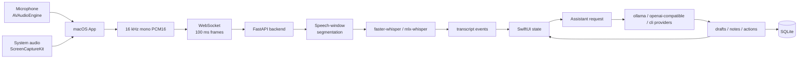

# emeet A1 海報與報告內容草稿

> 用途：這份文件是一份可直接拿去排版 A1 海報、擴寫書面報告、或整理口頭報告講稿的內容草稿。

## 一句話主軸

**emeet 是一個 macOS 原生的即時會議副駕，將麥克風與系統音訊轉成逐字稿，再根據目前對話產生可直接說出口的回覆建議、追問問題、會議筆記與下一步行動。**

海報與報告要讓評審在最短時間理解三件事：

1. 我不是只做「會後摘要」，而是做「會議當下的即時輔助」。
2. 我有研究音訊擷取、即時 STT、分塊策略、LLM provider、提示詞與隱私安全。
3. 我已經做出可 demo 的端到端 MVP：Start Meeting -> Transcript -> What should I say? -> Follow-up questions -> Notes/Actions -> Export。

## A1 海報建議版面
建議使用三欄式版面，讓中間放系統架構與 demo flow，左右放問題、功能、研究與成果。

```text
┌──────────────────────────────────────────────────────────────┐
│ Title: emeet - macOS 即時會議副駕                            │
│ Subtitle / one-liner / 作者資訊                               │
├──────────────────────┬──────────────────────┬────────────────┤
│ 1. 問題與目標        │ 3. 系統架構            │ 5. 實作成果    │
│ 2. 核心功能          │ 4. 研究與技術選型      │ 6. 限制與未來  │
└──────────────────────┴──────────────────────┴────────────────┘
```

### 海報標題區

```markdown
# emeet
## macOS 原生即時會議副駕

把目前通話逐字稿轉成下一句可說的話、可追問的問題、會議筆記與下一步行動。

作者：毛宥鈞
專題：百川專題探索報告
```

### 1. 問題背景

```markdown
## 問題背景

線上會議中，使用者常同時面對三種壓力：

- 要即時聽懂對方正在說什麼。
- 要在短時間內想出合適、保守、自然的回覆。
- 會後還要整理重點、決策與下一步行動。

現有 AI 會議工具多半擅長會後摘要與逐字稿搜尋；本專題聚焦在會議進行中的「下一句該怎麼說」與「接下來該問什麼」。
```

### 2. 專題目標

```markdown
## 專題目標

建立一個可展示的 macOS 即時會議輔助工具：

1. 擷取麥克風與系統音訊。
2. 產生即時逐字稿，並區分 Self / Other 來源。
3. 根據目前對話產生回覆建議。
4. 產生追問問題，協助釐清需求、限制、風險與下一步。
5. 每 30 秒根據 final transcript 整理 Meeting Notes 與 Next Actions。
6. 支援 provider/model 切換，展示模型抽象層。
7. 匯出 Markdown 會議紀錄。
```

### 3. 核心功能

| 功能 | 說明 | Demo 重點 |
|---|---|---|
| Start Meeting | 啟動麥克風與系統音訊擷取 | 顯示兩路音量 meter |
| 即時逐字稿 | 將音訊轉為 final transcript segments | 顯示 Self / Other |
| What should I say? | 產生自然、保守、可直接說出口的回覆 | 不亂承諾時程、預算、責任 |
| Follow-up questions | 產生能推進會議的追問 | 聚焦需求、限制、風險、下一步 |
| Meeting Notes | 每 30 秒根據 final transcript 自動更新 | 不使用不穩定 partial 內容 |
| Next Actions | 擷取下一步行動 | 保持 draft/proposed 狀態 |
| Provider / Model | 可切換 ollama、openai-compatible、CLI providers | 展示模型抽象層 |
| Export | 匯出 Markdown 會議紀錄 | 包含 notes、actions、suggestions、transcript |

### 4. 系統架構

海報中建議放這張架構圖，旁邊用短句解釋「音訊高頻、LLM 低頻」。



說明文案：

```markdown
系統將音訊、逐字稿、AI 建議與儲存分層。音訊以約 100 ms PCM16 frame 高頻傳輸；LLM 則只在使用者按鈕觸發或 30 秒筆記更新時低頻呼叫，避免不穩定逐字稿造成錯誤建議。
```

### 5. 研究與技術選型

| 研究主題 | 比較內容 | MVP 選擇 | 原因 |
|---|---|---|---|
| 產品定位與競品 | Otter、Fireflies、Granola、Fathom、Zoom、Teams 等 | macOS 私密即時副駕 | 避免只做會後摘要，聚焦會議當下的回覆輔助 |
| 音訊擷取 | AVAudioEngine、ScreenCaptureKit、虛擬音訊裝置、SDK/WebRTC | AVAudioEngine + ScreenCaptureKit | 官方 API、不需 driver，適合 demo |
| STT / ASR | Apple Speech、WhisperKit、faster-whisper、mlx-whisper、雲端 STT | backend 使用 faster-whisper / mlx-whisper | Python backend 容易替換 provider，Apple Silicon 可 demo 本機 STT |
| 即時分塊 | 固定 5/10/30 秒、VAD、語意邊界 | 100 ms transport + speech-window segmentation | 小封包穩定傳輸，停頓後產生 final segment |
| 說話者分離 | 完整 diarization、來源分離 | Self / Other source-based label | MVP 先用麥克風與系統音訊來源區分，不過度承諾 diarization |
| 模型供應商 | OpenAI-compatible、Ollama、LM Studio、CLI agents | provider abstraction | 展示可切換模型與本機/雲端彈性 |
| 提示詞與 schema | 自由文字、JSON、Structured Outputs | normalized drafts / notes / actions | UI 不直接解析模型 prose，降低不穩定性 |
| 筆記與行動項目 | 會中摘要、會後紀錄、任務欄位 | Notes + Next Actions + Markdown export | 支援 demo 端到端 loop |
| 隱私與倫理 | 同意、可見狀態、資料最小化、刪除 | 手動 start/stop、delete records、local storage | 會議內容敏感，AI 只做建議不自動代替使用者發言 |

### 6. 即時處理策略

```markdown
## Realtime Strategy

本專題將「即時」拆成不同層級：

- 音訊傳輸：每約 100 ms 傳送 16 kHz mono PCM16。
- STT：累積 speech window，停頓後產生 final transcript segment。
- 回覆建議：由使用者按 `What should I say?` 觸發。
- 追問問題：由使用者按 `Follow-up questions` 觸發。
- 會議筆記：每 30 秒根據 final transcript 更新。

研究結論是：STT 可以高頻；LLM 不應每 100 ms 呼叫。回覆建議與筆記應以穩定語意和 final transcript 為依據。
```

### 7. Demo Flow

```markdown
## Demo Flow

1. 啟動 backend。
2. 開啟 emeet.app。
3. 按 `Start Meeting`。
4. 展示麥克風與系統音訊 level meters。
5. 說一段問題或播放會議音訊。
6. 顯示 `Self` / `Other` 逐字稿。
7. 點 `What should I say?` 取得回覆建議。
8. 點 `Follow-up questions` 取得追問。
9. 等待 30 秒自動整理 Meeting Notes 與 Next Actions。
10. 匯出 Markdown 會議紀錄。
11. 切換 provider/model，展示模型抽象層。
```

### 8. 實作成果

```markdown
## 實作成果

- 完成 macOS SwiftUI prototype。
- 完成麥克風與系統音訊擷取。
- 完成 PCM16 音訊轉換與 WebSocket 傳輸。
- 完成 FastAPI backend、speech-window segmentation 與 STT provider。
- 完成 assistant provider discovery 與 respond endpoint。
- 完成 `What should I say?`、`Follow-up questions`、Meeting Notes、Next Actions UI。
- 完成 SQLite append-first storage。
- 完成 Markdown export 與 Delete Records。
```

### 9. 已知限制

```markdown
## 已知限制

- 目前 STT 產生 final speech-window segments，尚非 token-level streaming partials。
- VAD 目前是 RMS threshold，噪音環境需要升級為 Silero 或 WebRTC VAD。
- Self / Other 來自音訊來源，不是完整 speaker diarization。
- 會議聊天框尚未成為完整 Q&A route。
- assistant outputs 尚未包含 evidence_segment_ids。
- SQLite 尚未加入完整 meeting-level query/export API 與 FTS5。
```

### 10. 未來工作

```markdown
## Future Work

- 加入 evidence segment IDs，讓每個建議與筆記可回鏈逐字稿。
- 加入 rolling summary state，降低長會議 context degradation。
- 升級 VAD 與語意邊界判斷。
- 補完整會議 Q&A chat UI。
- 強化本機模型支援，例如 WhisperKit、Ollama、LM Studio。
- 評估 WER/CER、source attribution accuracy、button-to-suggestion latency、notes faithfulness 與 user acceptance rate。
- 強化本機隱私模式與 Keychain/BYOK 設計。
```

## A1 海報短版文案

這一版可以直接貼到海報，再依版面刪減。

```markdown
# emeet - macOS 即時會議副駕

emeet 是一個私密、低摩擦、模型可選的 macOS 原生會議輔助工具。它在會議進行中擷取麥克風與系統音訊，產生逐字稿，並根據目前對話提供「我該說什麼？」與「追問問題」兩種即時輔助，同步整理 Meeting Notes 與 Next Actions。

## Motivation

線上會議不只需要會後摘要，也需要會議當下的即時支援。使用者常需要快速理解對話、回應問題、提出追問，並記住下一步行動。現有工具多聚焦於錄音、轉錄與會後整理；本專題聚焦於「正在會議中，下一句該怎麼說」。

## Core Features

- 即時麥克風與系統音訊擷取。
- `Self` / `Other` 逐字稿顯示。
- `What should I say?` 產生自然、保守、可直接說出口的回覆。
- `Follow-up questions` 產生釐清需求、限制、風險與下一步的追問。
- Meeting Notes 與 Next Actions 每 30 秒根據 final transcript 更新。
- provider/model 可切換，支援本機模型與 OpenAI-compatible endpoints。
- 匯出 Markdown 會議紀錄。

## Technical Approach

macOS 端使用 `AVAudioEngine` 擷取麥克風，使用 `ScreenCaptureKit` 擷取系統/遠端會議音訊。兩路音訊轉換為 16 kHz mono PCM16，約每 100 ms 透過 WebSocket 傳至 FastAPI backend。Backend 以 speech-window segmentation 過濾靜音並切出語音段，再交給 `faster-whisper` 或 `mlx-whisper` 產生 final transcript events。Assistant 端透過 provider abstraction 呼叫 `ollama`、`openai-compatible` 或 CLI experimental providers，並要求模型輸出 normalized JSON：`drafts`、`notes`、`actions`。

## Research Basis

本專題研究了產品定位與競品、macOS 音訊擷取、即時 STT/ASR、音訊分塊與 VAD、說話者來源區分、模型供應商與 BYOK、提示詞工程與結構化輸出、會議筆記格式、SQLite 本機儲存，以及隱私安全與倫理。研究結論是：MVP 不應做成完整會議工作流平台，而應完成一個可展示的即時副駕 loop。

## Result

目前原型已完成 Start Meeting、音訊 level meters、逐字稿、回覆建議、追問問題、30 秒自動筆記、Next Actions、Delete Records、Markdown export 與 provider/model 切換。系統展示了從音訊擷取、STT、LLM 建議到本機儲存與匯出的完整端到端流程。

## Limitations and Future Work

目前逐字稿仍是 speech-window final segments，不是真正 token-level streaming partials；RMS VAD 也需要升級以適應噪音環境。未來將加入 evidence segment IDs、rolling summary、完整 Q&A chat UI、FTS5 meeting search、WhisperKit/Ollama/LM Studio 本機隱私模式，並以 WER/CER、建議延遲、筆記忠實度與使用者接受率進行評估。
```

## 書面報告建議架構

### 封面

```markdown
# emeet：macOS 原生即時會議副駕

作者：毛宥鈞
專題類型：畢業專題 / 百川專題探索報告
關鍵字：macOS、SwiftUI、即時逐字稿、STT/ASR、LLM、會議助理、ScreenCaptureKit、AVAudioEngine
```

### 摘要

```markdown
本專題實作一個 macOS 原生的即時會議輔助工具 emeet。系統透過 `AVAudioEngine` 擷取本機麥克風，並透過 `ScreenCaptureKit` 擷取系統音訊，將兩路音訊轉換為 16 kHz mono PCM16 後，以 WebSocket 傳送至 FastAPI backend。Backend 使用 speech-window segmentation 切分語音片段，並透過 `faster-whisper` 或 `mlx-whisper` 產生逐字稿事件。使用者可在會議中按下 `What should I say?` 取得自然、保守、可直接說出口的回覆建議，也可按下 `Follow-up questions` 取得追問問題。系統另會每 30 秒根據 final transcript 自動整理 Meeting Notes 與 Next Actions，並支援 Markdown 匯出與 provider/model 切換。

本專題的研究涵蓋產品定位與競品分析、macOS 音訊擷取、即時 STT/ASR、音訊分塊與 VAD、說話者來源區分、模型供應商與自帶金鑰、提示詞工程與結構化輸出、會議筆記格式、本機 SQLite 儲存，以及隱私安全與倫理。研究結論指出，第一版不應做成完整會議工作流平台，而應聚焦在可展示的端到端 loop：擷取音訊、產生逐字稿、產生即時建議、整理筆記與匯出紀錄。
```

### 第一章：研究動機與問題定義

應寫重點：

- 線上會議與遠距協作普及。
- 會議中的困難不是只有「會後忘記內容」，也包含「當下不知道怎麼回」。
- AI 會議工具市場已經有大量摘要/轉錄工具，因此本專題要切出不同定位。
- 目標不是自動替使用者說話，而是提供可採用的草稿與追問。

可用段落：

```markdown
現代線上會議中，使用者常需要一邊聽、一邊思考、一邊記錄。當對方提出問題、異議或需求時，使用者可能需要在很短時間內給出合適的回應；然而過度依賴會後摘要，無法解決會議當下的互動壓力。因此，本專題將問題定義為：如何在 macOS 上建立一個低摩擦、私密、模型可選的即時會議副駕，將目前逐字稿轉換成下一句可說的話、可追問的問題、會議筆記與下一步行動。
```

### 第二章：相關產品與研究整理

應寫重點：

- 競品：Otter、Fireflies、Granola、Fathom、Zoom AI Companion、Teams Copilot、Notion AI Meeting Notes。
- 共同能力：逐字稿、摘要、action items、會後搜尋。
- 差異化空間：macOS 原生、跨會議平台、無 bot 或低 bot、使用者主動觸發的即時建議、模型可切換。
- 風險：不要把產品定位成秘密面試輔助或自動代替使用者發言。

建議表格：

| 類別 | 現有產品常見能力 | 本專題聚焦 |
|---|---|---|
| 逐字稿 | 會議錄音、轉錄、搜尋 | 即時顯示 Self / Other transcript |
| 摘要 | 會後摘要、action items | 30 秒 final transcript notes |
| 會中 AI | 問答、側邊欄、平台內 assistant | `What should I say?` 與 `Follow-up questions` |
| 平台整合 | Zoom/Teams/Meet bot 或 workspace integration | macOS 原生、擷取麥克風與系統音訊 |
| 模型策略 | 多綁定單一平台或企業模型 | provider/model abstraction |

### 第三章：需求分析與 MVP 範圍

應寫重點：

- Product goal。
- Functional requirements。
- Non-functional requirements。
- 不做哪些東西。

```markdown
本專題的 MVP 範圍設定為一個可展示的端到端流程，而不是完整會議平台。必要功能包含：開始會議、音訊擷取、即時逐字稿、回覆建議、追問問題、Meeting Notes、Next Actions、Markdown export 與 provider/model 切換。非功能需求包含低摩擦、可見的擷取狀態、本機儲存、資料可刪除，以及模型供應商可替換。
```

功能需求表：

| 編號 | 需求 | 說明 |
|---|---|---|
| FR-1 | Start Meeting | 啟動會議 session 與音訊擷取 |
| FR-2 | Capture Microphone | 使用 `AVAudioEngine` 擷取本機語音 |
| FR-3 | Capture System Audio | 使用 `ScreenCaptureKit` 擷取遠端/系統音訊 |
| FR-4 | Live Transcript | 顯示 final transcript events |
| FR-5 | Suggested Reply | 按鈕觸發回覆建議 |
| FR-6 | Follow-up Questions | 按鈕觸發追問問題 |
| FR-7 | Meeting Notes | 每 30 秒整理筆記 |
| FR-8 | Next Actions | 顯示下一步行動 |
| FR-9 | Provider Selection | 切換 assistant provider/model |
| FR-10 | Export/Delete | 匯出 Markdown 與刪除紀錄 |

非功能需求表：

| 類別 | 需求 |
|---|---|
| 隱私 | 使用者手動啟動，資料可刪除，不自動外部發送 |
| 可替換性 | STT provider 與 LLM provider 不綁死 |
| 穩定性 | UI 消費 normalized JSON，不解析自由文 |
| 即時性 | 音訊高頻傳輸，LLM 低頻觸發 |
| 可展示性 | 能完成 live demo loop |

### 第四章：系統架構設計

應寫重點：

- macOS client、backend、STT provider、assistant provider、SQLite storage。
- 為什麼音訊、逐字稿、assistant、storage 要分層。
- WebSocket audio frames 與 REST assistant endpoints。

可用段落：

```markdown
系統分為 macOS App 與 FastAPI backend。macOS App 負責音訊擷取、PCM16 轉換、WebSocket 傳輸、UI 狀態管理與使用者互動。Backend 負責管理 STT session、切分 speech window、呼叫 STT provider、儲存 transcript events，並提供 assistant endpoint 產生回覆建議、追問、筆記與行動項目。這種分層設計讓音訊處理、逐字稿產生、LLM 建議與儲存彼此解耦，未來可以替換 STT 或 LLM provider，而不需重寫整個 UI。
```

建議插圖：

- 系統架構圖。
- WebSocket transcription sequence diagram。
- Assistant request/response sequence diagram。

### 第五章：音訊擷取研究與實作

應寫重點：

- 麥克風與遠端音訊是不同來源。
- `AVAudioEngine` 適合麥克風。
- `ScreenCaptureKit` 適合 macOS 13+ 系統音訊。
- 虛擬音訊裝置與會議 SDK 是未來/替代方案。
- MVP 以來源分離做 `Self` / `Other`，不是完整 diarization。

可用段落：

```markdown
音訊擷取是會議助理的第一個核心問題。若只使用麥克風，系統可能無法穩定取得遠端參與者的聲音；若只擷取系統音訊，又無法清楚取得使用者自己的發言。因此本專題採用雙路來源：麥克風使用 `AVAudioEngine`，系統/遠端音訊使用 `ScreenCaptureKit`。兩路音訊在 client 端分別轉換為 16 kHz mono PCM16，並以不同 source metadata 傳至 backend，使 UI 能以 `Self` / `Other` 顯示逐字稿來源。
```

### 第六章：即時逐字稿與分塊策略

應寫重點：

- STT 是 speech-to-text；不是 TTS。
- client 傳 100 ms PCM16 frames。
- backend 不是每個 frame 都送模型，而是做 speech-window segmentation。
- final transcript 才進 notes/action。
- RMS VAD 是 MVP gate，未來可換 Silero/WebRTC。

可用段落：

```markdown
本專題目前實作的是 STT/ASR，也就是 speech-to-text，而不是 TTS。TTS 是 text-to-speech，會讓 AI 將文字唸出來；這不符合本專題的 MVP，因為系統不應自動替使用者說話。逐字稿管線中，client 以約 100 ms 的 PCM16 frame 傳送音訊，backend 透過 `SpeechWindowSegmenter` 忽略 leading silence、累積語音、並在 trailing silence 或 max duration 條件達成時產生 final segment。此策略可降低無聲片段與雜音對 STT provider 的負擔，並讓 assistant 功能以較穩定的 final transcript 為依據。
```

建議加入目前參數：

```text
MEETING_BACKEND_SEGMENT_MIN_MS=800
MEETING_BACKEND_SEGMENT_SILENCE_MS=700
MEETING_BACKEND_SEGMENT_MAX_MS=8000
MEETING_BACKEND_VAD_RMS_THRESHOLD=0.012
```

### 第七章：AI 建議、提示詞與模型供應商

應寫重點：

- `What should I say?` 與 `Follow-up questions` 是主要 UI。
- prompt 要分 action。
- transcript 是 untrusted input。
- 不得編造 owner/date/budget/commitment。
- 回傳 JSON，不讓 UI 解析 prose。
- provider abstraction：ollama、openai-compatible、codex-cli、github-copilot-cli。

可用段落：

```markdown
Assistant 模組的目標不是讓 AI 自動代表使用者發言，而是產生短、自然、保守、可直接採用的草稿。系統將不同任務拆成不同 action，例如 suggested reply、follow-up questions 與 meeting notes，並透過 action-specific prompts 控制輸出。提示詞明確要求模型只根據 transcript context，不得編造負責人、日期、預算、核准或承諾。輸出格式固定為 JSON，包括 `drafts`、`notes` 與 `actions`，並由 backend schema 做 normalize 與 validate，避免 SwiftUI 直接解析任意模型 prose。
```

輸出契約：

```json
{
  "drafts": [{ "title": "...", "detail": "...", "badge": "...", "icon_name": "..." }],
  "notes": [{ "title": "...", "detail": "..." }],
  "actions": [{ "title": "...", "owner": "...", "state": "..." }]
}
```

### 第八章：會議筆記、Next Actions 與儲存

應寫重點：

- 即時筆記與會後紀錄是不同層次。
- notes 每 30 秒根據 final transcript 更新。
- actions 保持 draft/proposed，避免自動建立外部任務。
- SQLite append-first storage。
- export Markdown。

可用段落：

```markdown
會議筆記設計採取保守策略：即時逐字稿可以快速更新，但 Meeting Notes 與 Next Actions 只根據 final transcript 低頻整理。目前系統在 `Start Meeting` 後啟動 30 秒 countdown，到期後呼叫 `meeting_notes` action，將模型回傳的 notes/actions 更新到 UI。SQLite 儲存採 append-first 設計，記錄 sessions、transcript_segments、assistant_runs、assistant_suggestions、notes 與 actions。使用者可刪除紀錄，或匯出包含筆記、行動項目、AI 建議與逐字稿的 Markdown 會議紀錄。
```

### 第九章：隱私、安全與倫理

應寫重點：

- 會議錄音與逐字稿是敏感資料。
- 使用者必須看得到系統是否正在擷取。
- 不應背景偷偷錄音。
- AI 只產生草稿，不自動寄信、不自動發訊息、不自動建立外部任務。
- BYOK/secrets 不應存 SQLite；未來用 Keychain 或 backend-scoped ephemeral credentials。

可用段落：

```markdown
即時會議輔助工具處理的是高度敏感的音訊、逐字稿與會議內容，因此隱私與倫理必須成為系統設計的一部分。本專題採取使用者手動啟動、可見擷取狀態、資料可刪除、AI 不自動執行外部動作的設計。`What should I say?` 與 `Follow-up questions` 只提供草稿，最終是否採用由使用者決定。未來若加入自帶金鑰或雲端 provider 設定，API secrets 不應存入 SQLite，而應使用 Keychain 或後端短效憑證。
```

### 第十章：實作結果與 Demo

應寫重點：

- 實際做出的 UI。
- backend endpoints。
- demo script。
- 可展示的成果。

建議列出主要 endpoints：

```text
GET  /health
GET  /v1/assistant/providers
POST /v1/assistant/respond
WS   /v1/transcribe/ws
```

Demo 敘述：

```markdown
展示時先啟動 backend，再開啟 macOS App。按下 `Start Meeting` 後，畫面左側顯示麥克風與系統音訊 level meters，中間顯示 `Self` / `Other` transcript，右側顯示 assistant panel。當逐字稿出現後，使用者可按下 `What should I say?` 取得回覆建議，再按 `Follow-up questions` 取得追問。等待 30 秒後，Meeting Notes 與 Next Actions 會根據 final transcript 自動更新，最後可匯出 Markdown 會議紀錄。
```

### 第十一章：評估方式

即使目前還沒做完整 benchmark，報告應寫出未來如何評估，這會讓專題更嚴謹。

| 評估面向 | 指標 | 說明 |
|---|---|---|
| STT 準確度 | WER / CER | 英文用 WER，中文可用 CER |
| 即時性 | audio-to-transcript latency | audio end_ms 到 transcript arrival |
| 建議延遲 | button-to-suggestion latency | 按下按鈕到顯示建議 |
| 來源標籤 | source attribution accuracy | Self / Other 是否正確 |
| 筆記忠實度 | notes faithfulness | 筆記是否被 transcript 支持 |
| 行動項目 | owner/action/state accuracy | 是否正確抽取任務與狀態 |
| 使用體驗 | acceptance rate / edit distance | 使用者是否採用建議、修改幅度多大 |

### 第十二章：限制與未來工作

可用段落：

```markdown
目前系統仍有多項限制。第一，STT provider 目前輸出 speech-window final segments，尚未支援真正 token-level streaming partials。第二，VAD 使用 RMS threshold，對噪音環境的魯棒性有限。第三，`Self` / `Other` 是根據麥克風與系統音訊來源標記，不是完整 speaker diarization。第四，assistant output 尚未加入 evidence_segment_ids，因此筆記與建議尚不能直接回鏈到逐字稿片段。第五，SQLite schema 仍是 MVP append-first 設計，尚未加入完整 meeting-level query、export API、FTS5 與 rolling memory snapshots。

未來工作包含升級 Silero/WebRTC VAD、加入語意邊界、加入 evidence segment IDs、補完整會議 Q&A chat UI、建立 rolling summary state、強化本機 WhisperKit/Ollama/LM Studio 隱私模式，以及以 WER/CER、建議延遲、筆記忠實度與使用者接受率進行系統化評估。
```

## 口頭報告建議順序

如果報告時間只有 8 到 12 分鐘，建議順序如下：

1. **30 秒：一句話介紹**
   - emeet 是 macOS 即時會議副駕，不只是會後摘要。
2. **1 分鐘：問題與動機**
   - 會議當下需要回覆、追問、記錄。
3. **2 分鐘：Live demo**
   - Start Meeting -> Transcript -> What should I say? -> Follow-up questions -> Notes -> Export。
4. **2 分鐘：系統架構**
   - AVAudioEngine、ScreenCaptureKit、PCM16、WebSocket、FastAPI、STT、LLM provider。
5. **2 分鐘：研究與選型**
   - 音訊擷取、STT、分塊、LLM provider、提示詞/schema、隱私。
6. **1 分鐘：成果與限制**
   - 做到什麼、還沒做到什麼。
7. **30 秒：未來工作**
   - VAD、evidence ids、Q&A、rolling summary、本機隱私模式。

## 報告中應避免的說法

- 不要說「TTS」是目前功能；目前是 STT/ASR。
- 不要說已完成完整 speaker diarization；目前是 source-based Self / Other。
- 不要說 AI 會自動替使用者發言；AI 只提供草稿。
- 不要說能完全取代會議紀錄或專案管理工具；MVP 是即時副駕。
- 不要過度承諾所有 provider 都有同等即時能力；provider abstraction 是能力感知與可實驗的設計。
- 不要把秘密錄音或面試作弊當成產品賣點；要強調透明、同意、可停止與可刪除。

## 建議放進海報的圖片

1. macOS App 主畫面截圖。
2. 架構圖。
3. Demo flow 圖。
4. `What should I say?` 建議卡片截圖。
5. Meeting Notes / Next Actions 截圖。
6. Markdown export 範例。

## 最終總結段落

```markdown
emeet 展示了一個以 macOS 原生應用程式為中心的即時會議副駕原型。它將音訊擷取、即時逐字稿、AI 回覆建議、追問問題、會議筆記、行動項目與模型供應商抽象層串成一個可 demo 的端到端流程。研究與實作的核心結論是：會議 AI 不應只追求會後摘要，也不應自動替人發言；更實用且安全的方向，是在使用者需要時，根據穩定逐字稿提供短、自然、保守、可採用的輔助，並保留使用者最終決定權。
```
