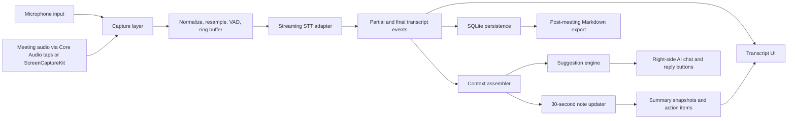
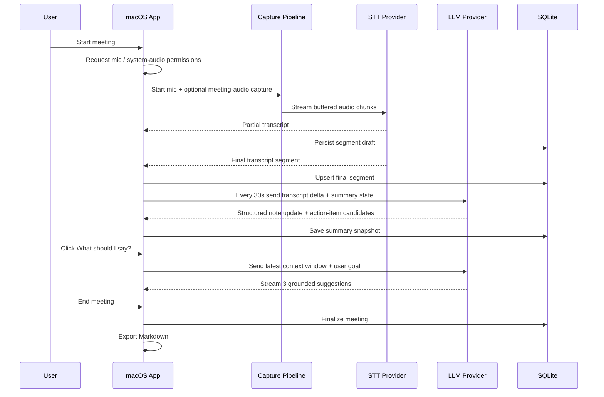
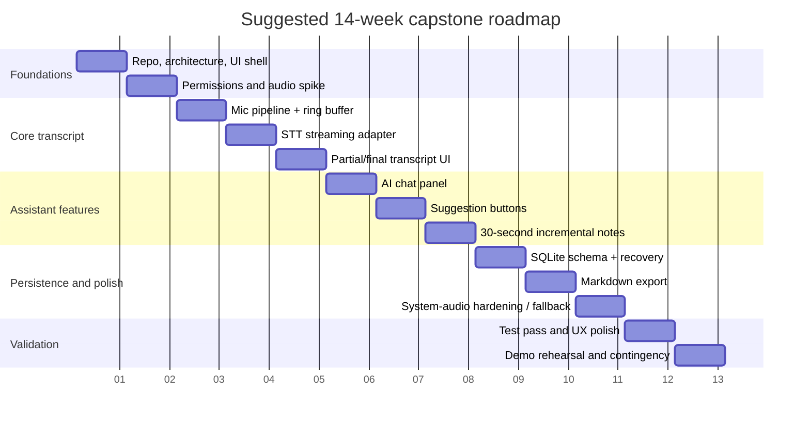

# Building an emeet MVP for a Semester Capstone

## Executive summary

This project is technically feasible within one academic semester **if the MVP is aggressively scoped and the riskiest macOS-specific feature—meeting-audio capture beyond the microphone—is treated as a schedule risk rather than assumed to be “free.”** The most realistic architecture is a native Swift app using **SwiftUI for UI**, **AVFoundation/AVAudioEngine for microphone capture**, and **either Core Audio taps on macOS 14.2+ or ScreenCaptureKit** for meeting/system audio capture, with a **streaming cloud STT provider** for the first release and **SQLite** for local persistence. Apple’s current platform APIs now explicitly support system-audio capture via `NSAudioCaptureUsageDescription` and Core Audio taps, and ScreenCaptureKit can capture window/app/display content plus associated audio, but both paths add permissions and interoperability complexity that should be validated in the first two weeks. citeturn11search1turn13search0turn13search12turn11search8turn29view0turn29view1

For a capstone MVP, the strongest default recommendation is **OpenAI for text generation plus one streaming STT path**, with **OpenAI GPT-Realtime-Whisper** as the simplest single-vendor live-transcription option, and **GPT-5.4 mini** or another fast mini-tier text model for reply suggestions, note updates, and the live chat box. OpenAI’s current pricing for GPT-Realtime-Whisper is **$0.017/min**, while GPT-5.4 mini is **$0.75/M input tokens and $4.50/M output tokens**; that keeps note/suggestion costs modest relative to transcription. Google Cloud Speech-to-Text V2 and Azure Speech are both viable alternatives and are slightly simpler to justify in compliance-heavy environments because their official docs expose region/encryption/security controls clearly, but they add account setup and a second provider surface for LLM features. citeturn40view0turn6view4turn7view2turn34view0turn10search2turn35view0

The right semester strategy is therefore: **build a stable microphone-first product, add one meeting-audio capture path only after an early feasibility spike succeeds, ship live transcript + right-side chat + the two suggestion buttons + 30-second incremental notes + Markdown export + local SQLite, and defer diarization/local Whisper/multi-provider/vector search/overlay integrations.** That scope is rigorous enough for a capstone, analytically defensible, and demonstrable in a live meeting simulation. Whisper itself was not designed as a native streaming model, and streaming wrappers add their own latency policies; by contrast, today’s provider-native streaming APIs and on-device frameworks such as WhisperKit and Apple SpeechAnalyzer make strong Phase 2 candidates once the MVP is stable. citeturn21view0turn21view1turn18search0turn19view0turn30search1turn30search2

Assumptions used in this report: **14-week semester** as the midpoint of the requested 12–16 week range, **1–2 student developers** as the default delivery shape, **Apple Silicon Macs** as the target hardware, and **macOS 14.2+** as the practical minimum if you want modern system-audio capture and WhisperKit compatibility. WhisperKit’s current Swift package lists **macOS 14.0+**, while Core Audio system-audio capture permission is documented for **macOS 14.2+**. citeturn19view0turn11search1

## Recommended MVP scope and rationale

The recommended MVP should include exactly the features that create a compelling end-to-end demo while avoiding the nonlinear complexity introduced by diarization, retrieval, or full provider abstraction too early. The product slice I would defend in a capstone review is: **start/stop meeting, microphone capture, optional meeting-audio capture if the early spike succeeds, real-time transcript, right-side AI chat panel, user-triggered “What should I say?” and “Follow-up questions” buttons, notes/action-item refresh every 30 seconds, post-meeting Markdown export, OpenAI API key entry, and local SQLite transcript storage**. That scope is large enough to show systems thinking across audio, streaming inference, UX, data modeling, and privacy, but still small enough to complete in one semester. The main reason to keep multi-provider selection and local ASR out of the MVP is not that they are impossible; it is that they multiply test surface, permissions edge cases, and support burden. citeturn25search0turn24view1turn19view0turn27view0

The most important scoping decision is to treat **speaker diarization as deferred** unless your capstone specifically studies ASR diarization. Pyannote-style diarization pipelines are multi-stage systems combining segmentation, embedding, and clustering, and even Argmax’s on-device SpeakerKit adds a second ML subsystem plus extra model downloads and more complicated meeting UX around unstable speaker labels. In a meeting assistant where the primary value is fast transcript, actionable notes, and context-aware suggestions, diarization is high effort for relatively low first-semester product leverage. citeturn22search9turn22search12turn19view0

I would also **defer local WhisperKit, Apple SpeechAnalyzer, vector search, Notion/Google Docs export, floating overlay, owner/deadline extraction, and multi-provider UI** to Phase 2. WhisperKit and Apple SpeechAnalyzer are both attractive, but each creates a different compatibility matrix and benchmarking burden. Vector search is unnecessary before you have enough transcript volume to justify semantic retrieval, and Markdown export is materially cheaper to implement and easier to grade than document-platform integrations. GitHub Models is worth designing for architecturally, but not worth making first-class in the MVP because its current BYOK path is still public preview for organizations and is limited to OpenAI and AzureAI; GitHub Copilot itself is a developer product, not the cleanest app-embedding surface for a meeting assistant. citeturn19view0turn30search1turn24view1turn24view0turn23search4turn23search8

A prioritized MVP list is below.

| Priority | Feature | Keep in MVP | Why |
|---|---|---:|---|
| Highest | Real-time transcript with partial/final states | Yes | Core user value and prerequisite for all other AI features. Streaming STT providers explicitly support partial/intermediate results. citeturn1view7turn8view1turn6view4 |
| Highest | Microphone capture | Yes | Lowest-risk audio path on macOS; AVFoundation authorization model is straightforward. citeturn17search0turn17search1turn17search2 |
| High | Right-side AI chat panel | Yes | Makes the assistant visible and demonstrable during a capstone. Apple’s SwiftUI/macOS command system supports shortcut-rich UI patterns. citeturn14search17turn14search23turn15search0turn15search1 |
| High | “What should I say?” button | Yes | High perceived intelligence; safer than unsolicited always-on coaching because it is user-triggered. citeturn27view0 |
| High | “Follow-up questions” button | Yes | Simple prompt architecture; clearly grounded in transcript context. citeturn27view0turn27view1 |
| High | Notes/action items every 30s | Yes | Strong demo value if implemented incrementally rather than by re-summarizing the entire transcript every time. citeturn27view1turn27view2 |
| High | Markdown export | Yes | Low implementation cost and very clear stakeholder value. |
| Medium | Meeting/system audio capture | Yes, but as a protected risk | Feasible on macOS, but the hardest platform-specific feature. Validate early. citeturn13search0turn11search8turn29view0 |
| Medium | OpenAI API-key support | Yes | Simplifies the first provider and keeps hosting optional. OpenAI still advises against shipping secrets in client apps for production. citeturn25search0turn25search5 |
| Medium | Local SQLite storage | Yes | Fast, simple, offline-friendly persistence. SQLite is not encrypted by default, so secrets should stay in Keychain. citeturn16search21turn16search0turn16search16 |
| Deferred | Speaker diarization | No | Too much extra ML and UX complexity for MVP. citeturn22search9turn19view0 |
| Deferred | WhisperKit local STT | No | Valuable, but only after MVP capture/transcript UX is stable. citeturn18search0turn19view0 |
| Deferred | Multi-model providers | No | Architectural hooks yes; end-user switching no. citeturn24view1turn24view0 |
| Deferred | Vector search | No | Useful later; not required for first-semester product value. |
| Deferred | Floating overlay | No | Increases UX and window-management complexity. |
| Deferred | Notion/Google Docs export | No | Easy to explain, hard to harden. |

## Detailed tech stack and architecture

The recommended stack is **Swift + SwiftUI** on macOS, with selective **AppKit bridging** for menu-bar commands, advanced window control, and accessibility polish. For audio, use **AVAudioEngine** as the default microphone pipeline. If you need system or meeting audio, prefer an early spike comparing **Core Audio taps** against **ScreenCaptureKit**. Core Audio taps are the more direct system-audio solution because Apple documents them as capturing outgoing audio from a process or group of processes and gates them with `NSAudioCaptureUsageDescription` on macOS 14.2+. ScreenCaptureKit is also viable, especially when the user intentionally selects a meeting window or display, and Apple documents that it can capture screen content from displays, applications, and windows, along with their audio, through `SCStreamOutput`. citeturn13search0turn13search12turn11search1turn11search8turn29view0turn29view1

I recommend the following concrete build choices for the MVP. Use **AVAudioEngine** for mic capture and per-buffer callbacks. Normalize all capture to an internal **48 kHz float PCM** processing bus, then resample to **16 kHz mono PCM** for most STT providers unless the provider expects something else. Add a **ring buffer**, **VAD gate**, and **segment assembler** before the provider adapter. If you must support speaker playback plus mic-only capture, consider Apple’s **voice-processing APIs / Voice-Processing I/O Audio Unit** for acoustic echo cancellation and noise suppression; if you are digitally capturing remote meeting audio separately via ScreenCaptureKit or Core Audio taps, use that direct feed instead of relying on echo cancellation to “recover” remote speech from a room-mic path. Apple explicitly documents voice-processing APIs and Voice-Processing I/O properties for speech-enhancement scenarios. citeturn14search0turn14search2turn14search6turn29view3

For transport, a native macOS app does **not** need WebRTC as the default networking choice. OpenAI’s realtime stack supports client-side ephemeral-token flows and a WebRTC interface, but Apple already provides `URLSessionWebSocketTask`, and for transcript/suggestion workloads a WebSocket or SSE path is materially simpler to reason about than RTC media channels. WebRTC remains useful later if you want full duplex low-latency voice sessions or to reuse its audio-processing modules, but even Google’s own WebRTC native-code page still frames native code as browser-developer infrastructure rather than the first thing app developers should reach for. citeturn25search5turn25search1turn14search1turn14search5turn31search8turn31search11

For STT, the decision tree is straightforward. **OpenAI GPT-Realtime-Whisper** is the easiest first implementation if you want one provider for both live transcription and LLM features. **Google Cloud Speech-to-Text** is strong if you want mature interim-results semantics, regional endpoints, and CMEK support. **Azure Speech** is strong if you need Microsoft governance language and explicit “no data trace” documentation for real-time transcription. **WhisperKit** is a good on-device Phase 2 path because it already supports real-time streaming and VAD on Apple Silicon, but it is still a client-side inference system you must benchmark and package. **Apple SpeechAnalyzer / SpeechTranscriber** is an additional official on-device alternative if you target the very latest Apple platforms. Whisper itself was trained around 30-second audio context windows and is not inherently a streaming model; that is why systems such as Whisper-Streaming add local-agreement/self-adaptive latency policies. citeturn40view0turn6view1turn8view1turn34view0turn35view0turn18search0turn19view0turn30search1turn30search2turn21view0turn21view1

For LLM generation, use a fast mini-tier text model with **streaming enabled**, **structured outputs** for notes/action items, and **human-in-the-loop UX** for suggestions. OpenAI’s structured-outputs docs explicitly support strict JSON Schema adherence, which is ideal for summary snapshots, action-item extraction, tooltip rationale, and bounded UI rendering. OpenAI’s safety guidance also explicitly recommends moderation, adversarial testing, and human review of outputs before they are used in practice. That fits your app especially well because a meeting assistant should suggest, not commit on the user’s behalf. citeturn27view1turn27view0

The architecture below is the recommended MVP system design.



This diagram reflects Apple’s capture APIs, provider-native streaming transcription, OpenAI-style structured generation for note state, and local persistence/export. citeturn13search0turn29view1turn1view7turn27view1

A representative interaction flow is below.



The exact provider calls can vary, but the architectural principle should remain the same: **event-driven transcript ingestion, bounded-context generation, local persistence, user-triggered suggestions**. citeturn1view7turn18search12turn27view1turn27view2

A practical SQLite schema for the MVP is below. Keep provider secrets **out of SQLite** and in **Keychain**. Apple’s Keychain docs describe secure encrypted storage for keychain items, while SQLite itself does not encrypt database files by default. citeturn16search0turn16search16turn16search21turn16search5

| Table | Key columns | Purpose | Notes |
|---|---|---|---|
| `meetings` | `id`, `title`, `start_time`, `end_time`, `source_mode`, `stt_provider`, `llm_provider`, `locale` | One row per meeting/session | `source_mode` can be `mic`, `window_audio`, `system_audio`, `mixed` |
| `transcript_segments` | `id`, `meeting_id`, `seq`, `start_ms`, `end_ms`, `text`, `is_final`, `confidence`, `speaker_label`, `source` | Partial/final transcript atoms | Index on `(meeting_id, seq)` and `(meeting_id, start_ms)` |
| `summary_snapshots` | `id`, `meeting_id`, `version`, `window_start_ms`, `window_end_ms`, `summary_json`, `markdown`, `created_at` | Every 30s note state | Store strict JSON plus rendered Markdown |
| `action_items` | `id`, `meeting_id`, `snapshot_id`, `title`, `owner`, `due_date`, `status`, `evidence_start_segment_id`, `evidence_end_segment_id` | Extracted action-item candidates | `status` should begin as `candidate` |
| `chat_messages` | `id`, `meeting_id`, `role`, `message_type`, `content`, `related_segment_range`, `provider`, `model`, `created_at` | Chat and suggestion history | `message_type` can be `chat`, `suggestion`, `followup`, `note_update` |
| `embedding_jobs` | `id`, `entity_type`, `entity_id`, `embedding_model`, `status`, `created_at` | Future vector-search hook | Do not implement in MVP; reserve the seam |

For the **30-second note-update strategy**, do **not** resend the full transcript every time. Instead, maintain a compact structured `SummaryState` object containing current summary bullets, decision log, unresolved questions, and action-item candidates. Every 30 seconds, send: the previous `SummaryState`, the transcript delta since the last note pass, and a short rolling context window such as the last 90–120 seconds. OpenAI’s structured-output feature makes this reliable, and the latency guidance explicitly favors bounded prompts, shared prefixes, fewer round-trips, and streaming. This turns note generation from an O(n²)-ish “keep re-summarizing the meeting from scratch” pattern into a bounded incremental update loop. citeturn27view1turn27view2turn26search2

The STT comparison below captures the strongest current options for your capstone.

| Option | Deployment | Streaming support | Privacy posture | Official pricing surfaced in sources | MVP fit |
|---|---|---|---|---|---|
| OpenAI GPT-Realtime-Whisper | Cloud | Native live streaming STT | API business data not used for training by default; abuse logs retained up to 30 days by default | **$0.017/min** citeturn40view0turn33search1turn33search2 | **Best single-provider MVP path** |
| Google Cloud STT V2 | Cloud | `streaming_recognize` with interim results, `is_final`, `stability`; regional endpoints | Regionalized service, data residency, CMEK support | **$0.016/min** standard recognition in V2 pricing surfaced here citeturn6view1turn8view1turn34view0turn7view2 | Best alternative if you prefer Google infra |
| Azure Speech | Cloud | Real-time transcription with intermediate results | Real-time audio processed in server memory; docs state no storage at rest for real-time; in-transit encryption | **$1.00/hour** surfaced from official pricing snippet | Strong enterprise/governance option citeturn6view4turn35view0turn10search2 |
| WhisperKit | On-device | Real-time streaming + VAD on Apple Silicon | Highest privacy; no cloud STT variable cost | No per-minute API fee | Best Phase 2 local path; requires packaging, benchmarking, model download handling citeturn18search0turn19view0turn20search1 |
| Apple SpeechAnalyzer | On-device | Official live speech-to-text API on new Apple platforms | Highest privacy; Apple-native | No per-minute API fee | Worth benchmarking if you can target the newest OS only citeturn30search1turn30search2turn30search10 |

## Implementation plan with week-by-week milestones and acceptance tests

A 14-week plan is realistic if you protect the critical path. The critical path is **permissions → audio capture → transcript streaming → UI update loop → incremental notes → export**. Everything else should be attached to that spine, not built separately. The first two weeks matter disproportionately because they determine whether meeting-audio capture remains in MVP or becomes a stretch goal. citeturn17search0turn11search2turn13search0



A week-by-week milestone table is below.

| Week | Focus | Deliverable | Acceptance gate |
|---|---|---|---|
| 1 | Project setup, architecture, UI skeleton | SwiftUI shell, transcript view placeholder, right-side panel placeholder, app state model | App launches cleanly, window layout stable, basic keyboard commands wired |
| 2 | Audio-capture feasibility spike | Mic capture prototype; proof-of-concept for either Core Audio taps or ScreenCaptureKit | Can display input level meters for mic; can document exactly which meeting-audio path works on target Mac/apps |
| 3 | Production-grade mic pipeline | AVAudioEngine capture, resampling, ring buffer, background worker queues | 30-minute continuous mic capture runs without crash or memory leak |
| 4 | Streaming STT adapter | OpenAI or alternative STT provider hooked up with partial/final transcript events | Partial transcript appears within target budget; final transcript stabilizes after pause |
| 5 | Transcript model and UI | Live transcript view, segment finalization, auto-scroll, local buffering | Transcript remains readable during fast speech; finalization logic does not duplicate text |
| 6 | Persistence and recovery | SQLite `meetings` + `transcript_segments`; crash-safe resume behavior | Killing and relaunching the app preserves prior meeting transcript |
| 7 | Right-side AI chat | Chat box can ask questions about the latest in-meeting context | User can ask “summarize the last two minutes” and get a grounded answer |
| 8 | “What should I say?” | User-triggered suggestion button with three candidate replies | Suggestions return within target latency and are grounded in transcript context |
| 9 | “Follow-up questions” | Follow-up generator with categorized prompts | Output includes at least one clarifying, one risk-probing, and one next-step question |
| 10 | Incremental notes | 30-second summary snapshots using structured outputs | Notes update without reprocessing the whole meeting; action-item candidates persist |
| 11 | Markdown export | Post-meeting export of transcript + summary + action items | Exported file opens cleanly in any Markdown editor |
| 12 | Meeting-audio hardening | If system/window audio works, stabilize it; otherwise ship mic-first fallback UX | Demo path is deterministic on target hardware |
| 13 | Test and polish | Latency tuning, error states, permission messaging, accessibility fixes | Permission-denied and offline states are understandable and non-fatal |
| 14 | Demo rehearsal and contingency | Final build, scripted demo, backup recording, performance logs | Demo succeeds twice in a row on clean restart |

The realistic effort is about **250–350 engineering hours** for a mic-first MVP and **350–500 hours** if you insist on robust direct meeting-audio capture in the MVP. A strong solo developer can possibly finish the mic-first version; a **2-person team** is materially safer. The minimum skill mix is: **one macOS/audio engineer**, **one AI/application engineer**, and enough UX/testing discipline to keep the product demonstrable. If split across roles, the smallest comfortable team is: native macOS/audio, AI integration/data layer, and shared QA/UX responsibility. This is an engineering estimate rather than a vendor-sourced number.

## Risk analysis and mitigation

The dominant technical risk is **meeting/system audio capture on macOS**, not the LLM or STT layer. Apple now documents two real capture paths—Core Audio taps and ScreenCaptureKit—but both are entangled with permissions, target-app behavior, and OS-version assumptions. ScreenCaptureKit additionally requires Screen Recording permission, and Apple’s sample guidance notes that the app may need a restart after the user grants permission the first time. That means your first-run onboarding and demo environment must be rehearsed, and your product must remain valuable even when the system-audio path fails. The mitigation is simple: **your MVP should always have a mic-only success path.** citeturn13search0turn11search2turn29view1turn17search0

The second major risk is **latency blowup from bad prompt design**. If every 30-second note refresh resubmits the entire accumulated transcript, latency and token spend will steadily rise, and the UI will feel worse as the meeting progresses. OpenAI’s current latency guidance explicitly recommends fewer requests, shared prompt prefixes, bounded context, and streaming. The mitigation is to implement **incremental state updates**, with one model call for note state and a separate, user-triggered path for suggestions. Do not make reply suggestions a constantly firing background job. citeturn27view2turn26search2

The third risk is **hallucinated or socially awkward suggestions**. Whisper’s own paper discusses incorrect but plausible speaker attributions/names, and generative models are inherently capable of confident-but-wrong phrasing. A meeting assistant should therefore generate *candidate language*, not claims of fact, and should surface uncertainty when the transcript is incomplete. The mitigation is: ground all suggestions in the most recent transcript window, require structured outputs with evidence segment references, cap suggestions at three short options, and never allow the app to auto-send or auto-speak anything. OpenAI’s safety guidance strongly favors human oversight in outputs used in practice. citeturn21view1turn27view0turn27view1

The fourth risk is **privacy and key management**. OpenAI’s own guidance says not to deploy a standard API key in client-side environments such as browsers or mobile apps; a desktop capstone is less exposed than a public SaaS, but the general principle still applies. For a class project, a locally stored user-provided key in **Keychain** is acceptable as a prototype choice, but the report should state clearly that a production version would move to a small backend that proxies requests or mints ephemeral client secrets for realtime sessions. Keychain is the correct place for secrets; SQLite is not. SQLite also does not encrypt database files by default, so transcript-at-rest protection must be considered separately if your evaluation emphasizes privacy. citeturn25search0turn25search5turn16search0turn16search16turn16search21turn16search5

The fifth risk is **regulatory and consent obligations**. Meeting transcripts and voice data can be personal data. Microsoft’s speech privacy documentation explicitly states that audio and transcripts may be regulated under privacy and communications laws and that the customer is responsible for obtaining necessary permissions. For GDPR, the core principles most relevant here are lawfulness/transparency and data minimization. For CCPA/CPRA, the practical design implications are notice, the ability to know/delete/correct data, and limits around sensitive personal information. The mitigation in an MVP is straightforward: explicit in-app consent banner before recording, clear purpose labels in permission prompts, local-first storage by default, user-visible delete/export controls, and no silent background capture. This is product design, not just legal wording. citeturn35view0turn38search0turn38search3turn38search6turn39view0

Open questions and limitations remain. The exact behavior of Core Audio taps and/or ScreenCaptureKit with **Zoom, Teams, Google Meet in Chrome, and Safari** should be empirically validated on your target Mac before you freeze MVP scope. The best on-device STT choice between **WhisperKit** and **Apple SpeechAnalyzer** also depends on your target OS floor and grading criteria; the sources gathered here show both are promising, but this report does not include your own benchmark data yet. Those uncertainties should be presented honestly in the capstone report rather than hidden.

## Cost estimate and provider comparison

A financially realistic MVP can be built with **no mandatory backend hosting** if you adopt a local desktop architecture and let the user supply their own provider key. That makes the fixed platform cost extremely low for a student project. The tradeoff is security posture: OpenAI explicitly recommends against deploying standard API keys in client-side environments, so this is defensible for a capstone prototype but not for a public production release. If you later add a proxy or ephemeral-token service, fixed hosting appears, but a meeting assistant does not intrinsically require a heavy always-on server if transcripts and exports remain local. citeturn25search0turn25search5

To make costs concrete, assume **40 meeting hours per month** for one user, **notes refreshed every 30 seconds**, and a fast mini-tier text model for suggestions/notes. Under that assumption, STT dominates variable cost; note generation is comparatively cheap if you use bounded incremental prompts. Using the official prices surfaced in the gathered sources, **OpenAI GPT-Realtime-Whisper** is **$40.80/month** for 40 hours, **Google STT V2** is **$38.40/month**, and **Azure Speech** is **about $40.00/month**. A compact text-generation layer using **GPT-5.4 mini** for notes, suggestions, and chat is usually only a few extra dollars per month under bounded prompts. citeturn40view0turn7view2turn10search2

The table below uses one concrete monthly usage model for comparison: 40 meeting hours, 4,800 note-update calls/month, 400 “What should I say?” calls/month, and 120 free-form chat turns/month. The LLM estimate assumes an efficient incremental design, not wasteful full-transcript resubmission.

| Stack option | STT cost assumption | Estimated LLM cost assumption | Estimated monthly variable total | Notes |
|---|---:|---:|---:|---|
| OpenAI only | 2,400 min × $0.017 = **$40.80** | ~**$6.7** using GPT-5.4 mini for notes/suggestions/chat | **~$47.5** | Simplest MVP integration surface. citeturn40view0 |
| Google STT + OpenAI text | 2,400 min × $0.016 = **$38.40** | ~**$6.7** | **~$45.1** | Slightly cheaper STT; two providers. citeturn7view2turn40view0 |
| Azure Speech + OpenAI text | 40 hr × $1.00 = **$40.00** | ~**$6.7** | **~$46.7** | Strong compliance story; two providers. citeturn10search2turn40view0 |
| WhisperKit or Apple SpeechAnalyzer + OpenAI text | **$0 variable STT** | ~**$6.7** | **~$6.7** | Lowest variable cost; highest client compute/benchmark burden. citeturn19view0turn30search1turn40view0 |

A second comparison that matters for architecture is provider strategy.

| Provider path | Why it is appealing | Why it should or should not be in MVP |
|---|---|---|
| OpenAI direct API | One vendor for live transcription, streaming responses, structured outputs, moderation, and clear realtime pricing | **Recommended for MVP** because it minimizes integration seams. citeturn40view0turn27view1turn27view0 |
| Azure Speech + Azure/OpenAI text | Better enterprise/governance posture and region/security language | Good alternative if your reviewer values compliance more than simplicity. citeturn35view0turn28search1 |
| Google STT + OpenAI text | Mature STT semantics, regional endpoints, CMEK | Good if STT quality/ops matter more than single-vendor simplicity. citeturn6view1turn34view0turn36search0 |
| GitHub Models | Good experimentation/governance layer; GitHub Models API now exists; BYOK supports OpenAI/AzureAI in public preview | **Do not prioritize in MVP**; treat as Phase 2/provider-abstraction target, not day-one UX. citeturn23search8turn24view1turn28search0 |
| GitHub Copilot / Codex as first-class providers | High brand recognition | Low value for a meeting assistant versus direct model APIs; deprioritize. citeturn23search4turn24view0 |

The clearest cost conclusion is that **a good prompt architecture matters more than shaving fractions of a cent off the text model**, because transcription time will likely dominate variable spend. So the best cost-control lever is not “find a cheaper LLM first”; it is “avoid reprocessing the entire transcript every 30 seconds.” OpenAI’s prompt caching and latency guidance strengthen that conclusion. citeturn26search2turn27view2

## Suggested prompts for live suggestions and follow-up generation

The core prompt-design principle is to **optimize for grounded utility, not charisma**. The suggestions should be short, socially natural, and explicitly anchored to recent transcript context. They should avoid inventing facts, commitments, dates, or owner names. Because the feature is safety-sensitive in a social sense, keep it **user-triggered** and return structured outputs with evidence references rather than pure free text. OpenAI’s structured-output and safety guidance fit this pattern closely. citeturn27view1turn27view0

A recommended application-side input bundle is:

- `meeting_goal`
- `user_role`
- `conversation_stage`
- `latest_transcript_window`
- `last_non_user_turn`
- `last_user_turn`
- `summary_state`
- `constraints` such as tone, brevity, no invented facts
- `output_schema`

A good **“What should I say?”** system prompt template is:

```text
You are the emeet assistant that suggests brief, natural replies for the user.
Your job is not to decide for the user, but to offer grounded candidate responses.

Rules:
- Use only information supported by the transcript window or summary state.
- Do not invent facts, commitments, dates, owners, budgets, or decisions.
- If context is insufficient, prefer clarification language.
- Keep each suggestion under 25 words unless the user asks otherwise.
- Return exactly 3 options with different intents:
  1) direct answer
  2) clarifying response
  3) strategic / next-step response
- For each option include:
  - `text`
  - `intent`
  - `why`
  - `evidence_segment_ids`
  - `risk_flag` where risk_flag is one of: low, medium, high

Context:
meeting_goal: {{meeting_goal}}
user_role: {{user_role}}
conversation_stage: {{conversation_stage}}
summary_state: {{summary_state_json}}
latest_transcript_window: {{latest_transcript_window}}
last_non_user_turn: {{last_non_user_turn}}
last_user_turn: {{last_user_turn}}
extra_constraints: {{extra_constraints}}
```

Its corresponding JSON Schema can be as simple as:

```json
{
  "type": "object",
  "properties": {
    "options": {
      "type": "array",
      "minItems": 3,
      "maxItems": 3,
      "items": {
        "type": "object",
        "properties": {
          "text": { "type": "string" },
          "intent": { "type": "string", "enum": ["direct", "clarify", "next_step"] },
          "why": { "type": "string" },
          "evidence_segment_ids": {
            "type": "array",
            "items": { "type": "integer" }
          },
          "risk_flag": { "type": "string", "enum": ["low", "medium", "high"] }
        },
        "required": ["text", "intent", "why", "evidence_segment_ids", "risk_flag"],
        "additionalProperties": false
      }
    }
  },
  "required": ["options"],
  "additionalProperties": false
}
```

A strong **“Follow-up questions”** system prompt template is:

```text
You are the emeet assistant that proposes useful follow-up questions.

Rules:
- Use only the supplied transcript and summary state.
- Do not ask questions that assume facts not in evidence.
- Generate 5 questions total:
  - 2 clarification questions
  - 1 risk or constraint question
  - 1 stakeholder / ownership question
  - 1 next-step / timeline question
- Questions must sound natural in a live meeting.
- Keep each question under 18 words where possible.
- Return:
  - `question`
  - `category`
  - `why`
  - `evidence_segment_ids`

Context:
meeting_goal: {{meeting_goal}}
user_role: {{user_role}}
summary_state: {{summary_state_json}}
latest_transcript_window: {{latest_transcript_window}}
```

For live notes every 30 seconds, use a **state-revision prompt**, not a fresh-summary prompt:

```text
You maintain a meeting state object.

Revise the previous state using only the transcript delta and recent context.
Preserve prior valid information unless the new transcript clearly changes it.
Mark uncertain action items as `candidate`.
Do not infer owners or deadlines unless stated or strongly implied.
Return strict JSON matching the schema.

previous_state: {{previous_state_json}}
recent_context: {{recent_context_window}}
transcript_delta: {{transcript_delta}}
```

The important implementation detail is that the UI should render the assistant’s output as **suggestions with rationale**, not as authoritative answers. That reduces the social risk of hallucination and aligns with human-in-the-loop safety guidance. citeturn27view0turn27view1

## Testing checklist and demo script

The testing strategy should be framed around **measurable acceptance criteria**, not “it seems to work.” For a capstone, reviewers will respond well to explicit latency, stability, and correctness gates. A practical MVP target is: **partial transcript visible within 1 second of speech onset, final segment committed within 2 seconds after a pause, button-triggered reply suggestions within 2 seconds in normal conditions, note refresh finish within 5 seconds at the 30-second cadence, 60-minute meeting without crash, and no transcript loss after app restart**. These are product targets recommended for this project; they are not vendor guarantees.

A concise testing checklist is below.

- **Permissions and onboarding**
  - Microphone permission prompt appears once and is recoverable if denied. citeturn17search0turn17search2
  - If ScreenCaptureKit is used, Screen Recording permission flow is documented and restart behavior is tested. citeturn11search2turn29view1
  - If Core Audio taps are used, `NSAudioCaptureUsageDescription` is present and tested on target macOS. citeturn11search1turn13search7

- **Audio pipeline**
  - Continuous mic capture for 60 minutes without crash or runaway memory.
  - Resampling produces intelligible STT results for quiet and noisy speech.
  - Meeting-audio capture works for the selected demo environment, or the app cleanly falls back to mic-only mode.

- **Transcript quality**
  - Partial transcript updates are visibly progressive.
  - Final transcript does not duplicate or reorder segments.
  - Timestamp ordering remains monotonic.
  - App handles silence, interruptions, and quick turn-taking.

- **Suggestion quality**
  - “What should I say?” always returns 3 short options.
  - Suggestions do not invent facts absent from transcript.
  - “Follow-up questions” includes clarification, risk, ownership, and timeline coverage.

- **Notes and action items**
  - Notes update every 30 seconds using prior state plus delta.
  - Action items are marked `candidate` when owner/date are uncertain.
  - Final Markdown export includes transcript, summary, decisions, and action items.

- **Persistence and recovery**
  - Transcript segments survive app close/reopen.
  - Export works offline after transcript is already stored.
  - Deleting a meeting deletes local transcript, summary, and chat artifacts.

- **Security and privacy**
  - API key stored in Keychain, not plain preferences/database. citeturn16search0turn16search16
  - No secrets appear in logs.
  - Local database encryption posture is documented honestly if you are not using SQLCipher/SEE. citeturn16search21turn16search5
  - UI makes cloud-processing status visible.

- **Accessibility and UX**
  - Keyboard shortcuts exist for start/stop, “What should I say?”, and “Follow-up questions.” citeturn14search23turn14search8turn14search11
  - Transcript auto-scroll can be paused by the user.
  - Right-side panel remains usable at common macOS window sizes. citeturn15search7turn15search6

A capstone demo should be scripted so that it highlights the system’s strengths while avoiding nondeterministic paths. A recommended live demo sequence is:

1. Launch the app on a pre-authorized Mac and show the clean meeting setup screen.  
2. Start a meeting and speak a short agenda aloud; show partial transcript appearing immediately.  
3. Play or simulate a remote participant segment through the chosen meeting-audio path, or state clearly that the demo is using mic-first mode by design.  
4. Let the transcript accumulate for about 45–60 seconds.  
5. Click **“What should I say?”** after a question from the simulated participant; show three suggestions with different intents.  
6. Click **“Follow-up questions”** and show the categorized prompts.  
7. Wait for the scheduled **30-second note refresh** and show updated summary/action items.  
8. Ask one question in the **AI chat panel**, such as “What decisions have been made so far?”  
9. End the meeting and export **Markdown**.  
10. Open the Markdown file and show transcript, notes, and action items.  
11. If time permits, relaunch the app and show that the meeting is preserved in SQLite history.

The demo fallback plan should be explicit: if live meeting-audio capture fails, switch to a mic-only scenario and continue. That is not a weakness; it is evidence that you identified and managed the true platform risk instead of overpromising.
