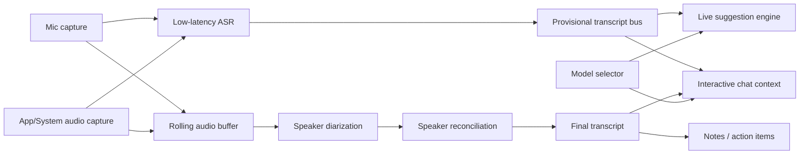

# macOS 會議助理的說話者分離深度研究

## 執行摘要

如果你的產品目標是「即時轉錄 + 即時建議回覆 + 會後筆記 / action items + 可互動 chat box」，那麼**說話者分離不能被當成單一路徑**來設計。對即時 UX 最實用的結論是：

第一，**單一混音音軌上的 speaker diarization 可以做到「誰在何時說話」的可用程度，但很難穩定做到「這個人是誰」**。OpenAI 的 `gpt-4o-transcribe-diarize`、pyannote、SpeakerKit 這類系統，本質上先回答的是 session-local 的 `speaker_0 / speaker_1 / speaker_2`；若要把它穩定映射成真實身份，必須再引入**已知語音參考 / voiceprint / 會議平台 participant metadata / 每人獨立音軌**。OpenAI 官方文件已支援 `known_speaker_names` 與 `known_speaker_references`；pyannoteAI 也明確把 diarization 與 voiceprint identification 分開設計。citeturn39view0turn10search0turn10search5turn10search8

第二，**對你的產品來說，「我 vs 其他人」其實比「所有人互相分清」容易很多**。如果你能在 macOS 上把**麥克風**與**會議 app / 系統輸出音訊**分成兩條路徑，則「我說的話」可以直接來自 mic path，「其他人說的話」來自 app / system-audio path；這已經把最重要的產品問題從「困難的單通道 diarization」降級成「可控的音訊路由」。Apple 的 ScreenCaptureKit 已提供 app audio 與 microphone 的分離輸出型別；Core Audio tap 也能針對 process 或 process group 擷取輸出音訊。citeturn34search0turn34search3turn34search7turn23search6turn23search20

第三，**若你要真正支援「即時建議回覆」按鈕，最好的架構通常不是等 diarization 完整收斂再做建議，而是用「快的 provisional ASR」先驅動建議，再用「較慢但較穩的 diarization」回補與修正 transcript attribution**。WhisperKit 論文給出的 streaming ASR 結果，顯示其平均逐詞延遲約 0.45 秒、confirmed text 約在 1.7 秒級別；相對地，OpenAI 官方也明說 diarized streaming 只在 segment 完成後才輸出最終 speaker assignment，而不是對未完結 segment 持續流出 partial speaker labels。citeturn19view2turn39view0

第四，**如果你能直接拿到每位參與者的獨立音軌，speaker attribution 會從「統計推斷」變成「來源事實」**。Zoom RTMS 已支援 per-participant audio packet，且也支援 mixed stream 或最多 3 位 active speakers 的 multi-stream 輸出；Zoom 本機錄製也可輸出「每位參與者一個 audio file」。WebRTC 若是你自己控制的應用，遠端音訊本來就是 track-based；但若你是對黑盒會議 app 或瀏覽器做 OS-level 擷取，通常只會拿到**已混合後的 app output**。Teams 的真正即時 raw media access 則走 application-hosted media bot 路線，要求 C#/.NET 與 Windows Server on Azure，官方甚至明確寫出這條路**不建議當作 AI meeting agent 的主要做法**。citeturn33view1turn33view0turn33view2turn31view0turn28search2turn28search9turn31view3turn31view4

綜合來看，對 emeet 這個 macOS app，**最務實的產品路線是 hybrid**：本機先做低延遲 ASR 與「我 vs 其他人」分離；真正多人 diarization 與會後高品質整併，則用 SpeakerKit / pyannote / 雲端 API 在 rolling window 或 post-pass 補正。若你未來要深度整合 Zoom，RTMS 幾乎會是所有方案裡「最像正解」的一條路；若是 Teams，則平台層整合成本與限制明顯更高。citeturn13view1turn13view5turn31view2turn31view3turn31view4

## 方案比較

下表把你指定的幾條路線，連同幾個值得留意的研究 / 生產方案，一起放到同一個工程框架下比較。表中「macOS 整合性」與「隱私影響」是根據部署方式、runtime、SDK 型態做的工程判斷；DER 只填**官方或論文有公開**的數字，沒有就明確標成未公開。

| 方案 | 公開 DER | 即時能力 | overlap 處理 | 語言 / 多語 | 運算需求 | 授權 / 商用 | macOS 整合性 | 隱私影響 | 主要依據 |
|---|---|---|---|---|---|---|---|---|---|
| **OpenAI `gpt-4o-transcribe-diarize`** | **未見官方公開 DER**；官方重點在 API 能力與 diarized JSON，而非 benchmark DER。 | 檔案轉錄支援 `stream=true`，但 diarized speaker assignment 會等 segment 完成才定稿；官方 guide 明寫**目前只支援 `/v1/audio/transcriptions`，尚未支援 Realtime API**。不適合把「即時 speaker label」當作唯一即時訊號。 | 官方文件未公開 overlap-specific 指標或架構細節。 | 官方 STT guide 表示可轉錄音訊原語言；支援已知 speaker reference clips。 | 雲端 API。 | 專有 API；定價頁與 model page 顯示其為付費模型。 | **中**：HTTP API 最容易接，但真正低延遲 speaker-aware streaming 目前受限。 | **高**：音訊要上傳雲端。 | citeturn39view0turn39view1turn20search1turn20search0 |
| **pyannote.audio `community-1`** | 官方 benchmark 範例：AMI-IHM **12.9%**、AMI-SDM **19.9%**、AISHELL-4 **12.2%**、AliMeeting **24.5%**、CALLHOME **16.6%**。不同資料集差異很大。 | 以本機 batch / pipeline 為主；官方 open-source pipeline 沒有把 streaming 當主產品敘事。適合 rolling-window 或 post-pass。 | pyannote 長期重視 overlap；其 2021 segmentation paper 在 AMI / DIHARD3 / VoxConverse 相對 VBx 有 **13–17%** 相對 DER 改善。 | benchmark 橫跨英語、中文與多語資料集；屬實務上的 multilingual diarization。 | Python + PyTorch；SDBench 曾在 **M2 Ultra / PyTorch MPS** 上 benchmark pyannote v3.1。 | toolkit 為 **MIT**；預訓練模型權重需依 Hugging Face / pyannote 條件取得。 | **中低**：你得橋接 Python/PyTorch 與 Swift/macOS audio stack。 | **低**：可完全本機。 | citeturn4search0turn9search5turn15view0turn16view4turn38search15 |
| **pyannoteAI `precision-2`** | 官方 benchmark 範例：AMI-IHM **12.9%**、AMI-SDM **15.6%**、AISHELL-4 **10.6%**、AliMeeting **20.3%**、CALLHOME **16.0%**；官方頁面也標示較 `community-1` 更佳。 | pyannoteAI 官網主打 **real-time diarization under 150ms**；同時提供 identification / voiceprints。 | 官方模型頁也提供 **exclusive diarization mode**，方便和 STT 對齊。 | 官網宣稱 language-agnostic / multilingual by default。 | 雲端 API。 | 專有 API / SaaS。 | **中**：API 容易接，但屬雲端依賴。 | **高**：音訊與 voiceprints 上雲。 | citeturn4search2turn10search5turn10search10turn10search11 |
| **WhisperKit + SpeakerKit OSS** | **未公開單一 headline DER**；Argmax 公開說法是跨 13 個資料集與 Pyannote **可比**，SDBench 論文則稱 SpeakerKit 對 pyannote v3.1 達 **9.6x** 速度提升且 error rates 相近。 | WhisperKit 有 real-time streaming ASR；**SpeakerKit OSS 文件偏 file diarization**。Argmax 文件明示「real-time speaker diarization / real-time transcription with speakers」是 **Pro SDK** 能力。 | SpeakerKit OSS repo 表示其在 Apple Silicon 上執行 **Pyannote v4 (community-1)**；有 exclusive reconciliation 選項。 | WhisperKit 針對多語 ASR；SpeakerKit 本身是語者分離，語言相依性低。 | Apple Silicon + Core ML；原生 Swift。 | **MIT**（OSS SDK）；Pro 版另行訂閱。 | **高**：這是目前最原生的 macOS / Swift 路線。 | **低**：可完全本機。 | citeturn13view1turn13view0turn13view5turn17search0turn19view2 |
| **NVIDIA NeMo Sortformer** | 本次檢索未找到單一官方 cross-dataset headline DER；論文主打 permutation-resolved diarization，官方 docs 提供 offline / online 版本。 | 官方 docs 明示有 **online** Sortformer；另有 streaming Sortformer 論文，報告在 **0.32 秒 latency** 仍具競爭力。 | 屬 end-to-end diarization 家族，對 permutation / overlap 較傳統 clustering 更友善。 | 本次檢索到的官方文件未明寫 multilingual 保證。 | Python / NVIDIA 生態；較偏 server research stack。 | 模型授權需逐一查 model card；本文未核對單一商用授權。 | **低**：不適合當第一版 macOS 原型主軸。 | 可本機或伺服器，視部署而定。 | citeturn38search10turn38search1turn38search19 |
| **EEND / Streaming EEND-EDA** | 原始 EEND 論文主張在真實與模擬 conversation 上優於 x-vector clustering baseline；但本次檢索未取到單一穩定 headline DER。 | Streaming EEND-EDA 論文報告 **1 秒 chunk 平均計算時間約 0.13 秒**，能處理 overlap 與可變 speaker 數。 | **強**：EEND 的核心賣點就是把 diarization 轉成 multi-label 問題，顯式處理 overlap。 | 研究導向；本次檢索未見對商用品質的多語保證。 | 研究 / server stack 為主。 | 依實作而異；不是單一產品。 | **低**：較適合 R&D 支線，不適合最快上市路徑。 | 視部署而定。 | citeturn38search3turn38search6 |

**判讀重點：**

如果你只看「今天就能做出 macOS 原型」這件事，最合理的優先序通常是：**WhisperKit + SpeakerKit OSS** 做本機原型；**pyannote.audio** 做 server-side/reference baseline；**OpenAI diarization** 做快速雲端驗證與 API 對照；若往 Zoom 深度整合，再考慮 RTMS 直接吃平台流。citeturn13view1turn9search5turn39view0turn31view2

如果你只看「即時 speaker-aware suggestions」這件事，表面上 OpenAI API 最簡單，但實際上**它目前比較像高品質 diarized transcription API，而不是已成熟的 speaker-aware realtime substrate**；官方 guide 與 autogenerated Realtime reference 的說法目前不完全一致，保守做法應以 guide 為準，不把 Realtime diarization 當硬依賴。citeturn39view0turn39view1

## 可行性與風險

### 單一混音音軌到底能不能可靠知道誰在說話

可以，但要把「可靠」拆成三個層級看：

**第一層是 turn attribution**：也就是 `speaker_0`、`speaker_1` 在什麼時間段說話。這層是 speaker diarization 的核心問題，也是目前大多數系統最有把握的輸出。即使如此，SDBench 仍顯示不同資料集間 DER 波動極大；資料集的 overlap ratio、speaker congestion、遠場條件，會直接把難度拉高。像 AliMeeting 與 ICSI 這類 overlap / congestion 較重的資料集，就被論文直接描述為「predictably challenging」。citeturn15view0turn16view1

**第二層是 session-local identity consistency**：也就是 30 分鐘前的 `speaker_1` 和現在的 `speaker_1` 是否真的是同一個人。這一層通常依賴 embedding + clustering 能力；在會議型資料上，clean close-talk 條件可到低十幾的 DER，但 far-field、多人搶話、筆電外放回授、相似音色、短句輪替都會讓 clustering confusion 快速上升。pyannote 官方 benchmark 與 SDBench 同時支持這個結論：在 meeting / conversational 條件下，低十幾到二十幾 DER 是比較現實的區間，而不是「接近完美」。citeturn4search0turn15view0turn16view3

**第三層才是真實身份 naming**：也就是把 `speaker_1` 變成「Alice」。這一步如果沒有外部錨點，單靠單通道 diarization 通常不夠穩。OpenAI 之所以提供 `known_speaker_references`，pyannoteAI 之所以把 voiceprint 做成獨立能力，正是因為 diarization 與 identification 是兩件不同的事。你的產品若需要 UI 上真正顯示人名，應該優先利用：會議平台 participant metadata、已知 speaker enrollment、或 per-track audio，而不是期望混音 diarization 自己猜出姓名。citeturn39view0turn10search0turn10search6turn10search13

### overlap speech 為什麼特別麻煩

重疊語音會同時破壞兩件事：**誰在講**與**STT 正確對齊哪個 speaker**。EEND 原始論文把傳統 clustering-based diarization 的一個核心弱點直接寫出來：它「不能正確處理 overlapped speech」；pyannote 的 overlap-aware segmentation 論文也顯示，在 AMI、DIHARD3、VoxConverse 上，針對 overlap 的建模能帶來明顯相對 DER 改善。換句話說，**overlap 不是小誤差，而是系統性失敗來源**。citeturn38search3turn38search15

對你的 meeting assistant 而言，overlap 最大的產品風險不是 transcript 稍微醜一點，而是**建議回覆按鈕會在錯的人身上觸發錯的語境**。例如上一句其實是對方打斷你，但系統把最後 active speaker 鎖到你自己，接下來「What should I say?」就可能用錯視角。這也是為什麼我建議把「live suggestions」建立在**最新已確認的 speaker state + 保守規則**，而不是建立在抖動中的 provisional diarization 上。這是工程判斷，但其風險來源與上面論文結論一致。citeturn39view0turn38search3turn38search15

### 我 vs 其他人為什麼容易很多

因為這不再是「辨識聲紋群聚」，而是「利用不同音訊來源做 source-grounded attribution」。如果你的 app 能同時抓到：

- 一條**麥克風**路徑；
- 一條**會議 app / 系統輸出**路徑；

那麼「我說的」可直接從 mic stream 來，「其他人說的」可從 app/system stream 來。Apple 已在 ScreenCaptureKit 中提供 `.audio` 與 `.microphone` 類型的分離輸出，且 Apple 工程師在論壇進一步指出，這兩種 sample buffer 甚至可能帶著不同 sample rate / channel format，因此必須分開寫入與處理。這等於是在 OS capture 層就承認 app audio 與 mic audio 是兩種不同來源。citeturn34search0turn34search3turn34search7

這種方法的失敗模式也很清楚：如果你用喇叭外放而非耳機，遠端聲音可能回灌進麥克風；如果會議 app 自己做強力 AEC / noise suppression / voice isolation，則你捕捉到的 mic 內容可能與實際送進會議的內容不同。Teams 的 voice isolation 官方就明說它會保留你的聲音、濾掉背景聲與其他講者，以避免回音。這對「我 vs 其他人」未必是壞事，但表示**你不能假設每個 app 的 mic 路徑都是 raw mic**。citeturn24search0

### 多軌是不是幾乎等於完美解法

只要多軌是真的「每位參與者各自獨立」、而不是「幾個 active speakers 被暫時拆分」，答案幾乎是**接近 yes**。Zoom RTMS 官方文件已經把這件事講得很明白：音訊可以是每位參與者 packet，也可以是 merged packet；`AUDIO_MULTI_STREAMS` 甚至可讓每個 active speaker 以獨立 stream 輸出，最多 3 位 active speakers / 20ms。這類平台級資料本身就帶 `user_id` / `user_name`，speaker attribution 不再靠聲學猜測。citeturn33view1turn33view0turn33view2

但你要注意兩件事。其一，**Zoom RTMS 的 multi-stream 是 active-speaker-centered，不是任意大會議全員永久獨立 stem**；其二，**Teams 與一般黑盒桌面 app 並沒有給你同等易用的本地路徑**。Teams 的 raw media 官方解法是 application-hosted media bot，且要求 C#/.NET、Windows Server on Azure；WebRTC 則只有在你**控制那個 WebRTC app 本身**時，`ontrack` 才會讓你取得分開的 remote tracks。若你只是從 macOS 外部去抓 Chrome / Safari / Teams 的輸出，那通常只會拿到混音後的 app output。citeturn31view4turn31view3turn28search2turn28search9

## 推薦架構

### 最符合產品現實的三種路線

**本機優先原型**最適合用來驗證 UI 與 UX：WhisperKit 做 streaming ASR，SpeakerKit 做本機 diarization / 後處理，LLM 建議層則做 provider-agnostic 的 adapter。WhisperKit 論文已證明它可在 Apple 裝置上做低延遲 streaming ASR；SpeakerKit OSS 則是目前最貼近你技術棧的 Apple Silicon diarization 路線。缺點是 open-source SpeakerKit 的公開文件較偏離線 diarization，真正「real-time transcription with speakers」目前仍主要放在 Pro SDK 功能表內。citeturn19view2turn13view1turn13view5

**伺服器優先原型**最適合快速比較品質上限：你可以用 OpenAI diarization API 或 pyannote / pyannoteAI 在 server 端跑 rolling windows，把結果回傳給本地 UI。這條路最大優點是實作速度快、可快速驗證會後品質；最大缺點是**live suggestions 會被網路與 segment-finalization 拖慢**。尤其 OpenAI 官方自己就寫明 diarized deltas 不會對尚未 finalized 的 segment 持續輸出 partial speaker assignments。citeturn39view0turn10search9

**混合式路線**通常最適合真正產品化：本地 ASR 負責 0.5–1 秒級別的即時文字流，本地音訊路由先把「我 vs 其他人」拆掉；較慢但更穩的多人 diarization，則在 rolling buffer 或會議後段補正 speaker labels、整理 notes、改寫 action items。這種雙速架構最符合你列出的按鈕型 UX，因為「What should I say?」不需要等到最終 DER 最佳化，而「meeting notes / action items / chat box replay」則可以吃後補的高品質 speaker attribution。這是工程建議，但與 OpenAI / WhisperKit / SpeakerKit 目前各自的能力邊界完全一致。citeturn39view0turn19view2turn13view5

### 建議的資料流

這個圖的關鍵不是「多一個 bus」，而是**把 live path 與 quality path 拆開**。你真正要低延遲的是 suggestion engine，而不是會後 transcript 的最終 speaker attribution。OpenAI 的 diarized streaming 行為與 WhisperKit 的 streaming 論文結果都支持這種拆法：一條路求快，一條路求穩。citeturn39view0turn19view2

### 具體實作選項

**選項一：WhisperKit + 麥克風 / app-audio 分離 + SpeakerKit 後補**  
這是我最推薦的第一版。ASR 走 WhisperKit；音訊來源在 macOS 先分成 mic 與 app audio；對 UI 明確區分「我剛說了什麼」與「會議剛剛在講什麼」。SpeakerKit 先做 rolling-window 或 segment-level diarization，不必硬追每 200ms 都更新整個 speaker timeline。這條路對隱私最好，也最符合你要做 selectable models / buttons 的產品形態。citeturn13view1turn13view5turn19view2turn34search0

**選項二：WhisperKit 本機 ASR + pyannote server-side diarization**  
如果你想先得到「比較成熟的 diarization baseline」而不想被 Swift / Core ML 細節卡住，這條路很實際。pyannote community-1 的公開 benchmark 與重疊語音相關研究都很扎實，當 reference baseline 很有價值。你的 UI 與產品邏輯可以先穩定，之後再把 server diarization 逐步替換成本機 SpeakerKit。citeturn4search0turn9search5turn38search15

**選項三：Zoom-first 深度整合 + RTMS**  
如果你明確知道產品會重押 Zoom 場景，RTMS 的資料型別幾乎是你能得到的最佳工程條件：structured audio packets、participant identities、active speaker events、mixed / multi-stream 選項，而且不用「可疑 bot joins」。這會大幅降低 speaker attribution 的不確定性，也讓 notes / CRM / real-time coaching 更穩。缺點是平台依賴非常重，且屬 Zoom 生態專案，不再是一般性的 macOS 外掛。citeturn31view2turn33view1turn33view0turn33view2

### 粗估延遲預算

下表不是 vendor SLA，而是根據公開資料與合理工程拆解做的**保守預估**：

| 架構 | 文字可見延遲 | speaker label 穩定延遲 | 適合按鈕 UX 嗎 |
|---|---:|---:|---|
| WhisperKit streaming + 本機 source split | 約 **0.5–1.0 秒**；WhisperKit 論文均值約 0.45 秒 on M3 Max class benchmark | 「我 vs 其他人」幾乎可即時；多人 session-local labels 仍建議 1–3 秒視窗穩定化 | **很適合** |
| OpenAI diarized transcription API | 取決於網路 + segment 完成；speaker assignment 於 segment finalize 後才穩定 | 通常比文字本身慢，因 speaker label 不會對未完 segment 提前定稿 | **普通**，更適合 quality path |
| pyannote / SpeakerKit rolling-window diarization | 取決於 window 長度與重算策略 | 若追求穩定 labels，通常比即時文字慢 | **適合作為補正層** |

WhisperKit 的 0.45 秒數字來自其 streaming ASR 論文；OpenAI 的限制則直接來自官方 diarization 說明。多人 label 的 1–3 秒，是基於會議型 UX 對穩定度與 turn completion 的工程估計，不是某家官方承諾。citeturn19view2turn39view0

## 評測與實驗設計

### 先量什麼，不要只量 DER

若你的產品真的是 meeting assistant，而不只是 diarization demo，建議最少同時量四件事：

- **DER**：仍然是最常見的主指標，pyannote.metrics 把它定義為 false alarm、missed detection、confusion 的總和除以總時長。citeturn37search0
- **JER**：Jaccard Error Rate 對每位 speaker 給較平均的權重，能補 DER 對長講者偏重的盲點。citeturn40search0
- **Speaker-change timestamp precision / recall / F1**：對你的「Follow-up questions」與「What should I say?」特別重要，因為這兩個功能常卡在「到底是不是輪到我了」。近年的 SCD / multi-task 研究直接以 timestamp P/R/F1 作為此類任務指標。citeturn40search18
- **WDER 或 diarized-transcript quality**：對 notes 和 action items 更重要。DiarizationLM 這類工作甚至就是針對詞級 attribution 與 transcript 可讀性做後處理。citeturn12search15turn12search17

換句話說，你應該把實驗分成兩層：**audio-centric 指標**看 DER/JER/SCD；**product-centric 指標**看哪些 speaker attribution 錯誤真的會讓建議回覆、摘要、action items 出錯。citeturn37search0turn40search0turn40search18turn12search17

### 資料集怎麼選

SDBench 已經把你多半會用到的會議 / 對話資料集整理得很完整，包含 CALLHOME、DIHARD-III、ICSI、AMI-IHM、AMI-SDM、VoxConverse、AliMeeting、AISHELL-4、AVA、EGO4D 等。對你的產品，我建議優先挑以下子集：

| 測試目的 | 建議資料集 | 為什麼 |
|---|---|---|
| close-talk 會議上限 | **AMI-IHM** | 代表頭戴 / 近講麥克風條件，可看理想情況。 |
| far-field 真實會議 | **AMI-SDM、ICSI** | 更貼近筆電 / 房間麥克風與遠場會議。 |
| overlap / 會議擁擠度 | **AliMeeting、DIHARD-III** | SDBench 指出其 overlap ratio / congestion 更高。 |
| 中文會議 | **AISHELL-4、AliMeeting** | 直接測中文情境。 |
| 開放域對話與網路影片 | **VoxConverse、AVA** | 看在非標準會議音訊上的穩健性。 |

SDBench 對這些資料集還提供了 overlap ratio、speaker congestion、median speaker count 等統計，剛好能用來對應你產品最在意的 failure modes。citeturn15view0turn16view1

### 一定要跑的情境

你至少要把下面幾類場景系統化，不然 DER 再漂亮也可能對產品沒意義：

- **兩人、三人、五人、八人**；
- **耳機會議** vs **筆電喇叭外放**；
- **整段無 overlap**、**偶發打斷**、**頻繁搶話**；
- **固定座位說話** vs **走動 / 遠近改變**；
- **乾淨環境** vs **咖啡廳 / 辦公室背景噪音**；
- **中英混合 / 中文專有名詞**；
- **自己長講** vs **你很少講，大多在聽**。

其中最值得你額外加上的，是**自己真實產品場景的回放集**：Zoom、Teams、Google Meet / WebRTC browser 各抓 10–20 場，因為 meeting app 自己的 AEC、noise suppression、AGC，會把公開 benchmark 上沒出現的失真帶進來。這不是公開資料直接給出的結論，但與平台文檔對 media streaming / audio handling 的差異完全一致。citeturn31view2turn31view3turn28search2

### Apple Silicon 的最低可行硬體

公開資料並沒有直接寫出「最低推薦 Mac 配置」，所以這裡只能給**保守工程建議**。已知的硬資料是：

- WhisperKit 論文的低延遲結果是在 **M3 Max** benchmark 上呈現。citeturn19view2
- SDBench 把 pyannote v3.1 與 SpeakerKit benchmark 在 **M2 Ultra Mac Studio**。citeturn15view0
- SpeakerKit blog 又顯示它在 **iPhone** 也能很快跑完檔案 diarization。citeturn13view0

因此，若只是做產品原型，我會把**M2 / 16GB unified memory**視為最低可行起點；若你要同時跑本機 ASR、rolling diarization、桌面 UI、向量索引和一個本機小模型做 suggestion，則**M3 Pro / Max 與 24GB+** 會更像穩妥的開發／示範機。這是基於上述 benchmark 的工程推論，不是官方最低需求。citeturn19view2turn15view0turn13view0

## macOS 與會議軟體整合

### macOS 音訊擷取現實

在 macOS 上，你可用的主要原生路徑有兩條：

**ScreenCaptureKit**：Apple 官方定位就是用來擷取 screen 與 audio content；新版本還加入 **microphone capture**，並可把 `.audio` 與 `.microphone` 當成不同 output type 來接。這對你的產品非常有用，因為它讓你不必先解決「單通道把自己跟別人分開」這個硬問題。citeturn23search20turn34search0turn34search3turn34search8

**Core Audio process taps**：Apple 官方文件摘要明確寫出，它能擷取**特定 process 或 process group 的 outgoing audio**，且建立方式是 `AudioHardwareCreateProcessTap` + aggregate device。這條路對「只抓 Zoom / Teams / Chrome 某個 app 的播出聲音」特別重要，因為你不一定要抓全系統音訊。citeturn23search6turn23search2turn21search14

實作上要小心 format：Apple 論壇已指出 app audio 與 microphone audio 常常不是同一個 sample rate / channel count，若你把它們暴力寫進同一個 writer input，檔案容器會被弄壞。你的 pipeline 應該一開始就把 mic 與 app audio 當成兩條獨立 stream。citeturn34search7

### 虛擬音訊裝置

如果你要跨 app 做更靈活的 routing，而不想一開始就深入 Core Audio tap / driver 細節，最常見的是 **BlackHole** 與 **Loopback**：

- **BlackHole** 是開源的 macOS virtual audio loopback driver，主打零額外延遲，授權是 **GPL-3.0**。若你要隨產品安裝 / 綁定散佈，應先做授權合規評估。citeturn37search1turn37search15
- **Loopback** 是 Rogue Amoeba 的商業路由工具，官方頁面明寫它可以把**application sources** 與 **audio input devices** 組合成虛擬裝置，對快速做 POC 很方便。citeturn37search2

若你用 BlackHole 的 Multi-Output Device，官方 wiki 還特別提醒內建輸出或另一個 2-channel 裝置應設為 top/primary device，否則容易出現「音訊 / 視訊不播放」的 macOS routing 問題。這是非常實務的坑。citeturn37search4

### Zoom、Teams、WebRTC 的差異

**Zoom**  
如果你只是從 macOS 外部抓 Zoom app 的聲音，通常拿到的是 app output 混音；但 Zoom 平台整合能力是三者裡最成熟的。對離線會後處理，Zoom desktop app 本機錄製可輸出**每位參與者各自的 audio file**。對真正即時 AI workflows，RTMS 官方已提供 structured meeting data、WebSocket 傳輸、active speaker events，甚至 per-participant audio packets 與 multi-stream audio option。citeturn31view0turn31view2turn33view1turn33view0turn33view2

**Teams**  
Teams 的平台能力比較「企業整合化」。若你只是做本地 macOS 助理，從 OS 層抓 Teams 音訊最終仍多半是混音。若你想拿 raw media，官方路徑是 application-hosted media bot，且要求 **Microsoft.Graph.Communications.Calls.Media .NET**、**C#/.NET**、**Windows Server on Azure**。更重要的是，Microsoft 自己在 Real-time Media docs 直接寫出：**對 AI agents for meetings，這條路不推薦**，而比較建議 Copilot Studio 或 Graph meeting transcripts。citeturn31view4turn31view3

**WebRTC browsers**  
若會議產品是你自己做的 WebRTC app，那很好：remote media 本來就以 track / stream 的形式進入 `RTCPeerConnection`，`ontrack` 會在新 track 加進來時觸發。這對 per-participant attribution 幾乎是天然優勢。可是一旦你不是控制那個 WebRTC app，而只是從 macOS 抓 Chrome / Safari 的輸出，那你看到的通常是瀏覽器已經混好的 app audio。citeturn28search1turn28search2turn28search9

### 權限與 UX

你的產品至少會碰到兩類權限：

- **Microphone**：Apple 文件要求 `NSMicrophoneUsageDescription`，而且第一次錄音時系統會提示 user grant record permission。citeturn36search1turn36search3turn36search0
- **Screen / app audio capture**：若你走 ScreenCaptureKit / screen-recording 類路徑，會涉及螢幕錄製權限與相關的 capture access 流程。Apple 公開 API 以 `CGRequestScreenCaptureAccess()` / `CGPreflightScreenCaptureAccess()` 為入口。citeturn35search0turn35search3turn35search16

UX 上，我建議把權限文案與 routing 模式說清楚，並在 UI 中明確區分：

- **只聽我**；
- **只聽會議**；
- **我 + 會議**；
- **高品質說話者標記可能延後數秒修正**。

這能顯著降低使用者對 live suggestions 的誤解，尤其當 speaker attribution 在 overlap 區段還會被回補修正時。這是產品建議，但與上述平台能力邊界直接相關。citeturn39view0turn34search7

## 結論與未決問題

如果把你的需求翻成工程決策，最重要的結論只有三個：

**最值得先做的版本**，不是「在單一混音音檔上追求完美 multi-speaker naming」，而是**先把 mic 與 app audio 分離，穩定支援我 vs 其他人，並用低延遲 ASR 驅動即時建議**。這會最快讓你的「What should I say?」「Follow-up questions」「interactive chat」真正可用。citeturn34search0turn34search7turn19view2

**最值得當 macOS 原型主軸的技術組合**，是 **WhisperKit + SpeakerKit OSS / rolling reconciliation**。原因不只是它本機、隱私友善，而是它最符合你的技術棧：Swift、Apple Silicon、原生音訊路由、可插拔 LLM provider。pyannote.audio 應該是你的對照 baseline；OpenAI diarization 則適合當雲端 quality comparator，而不是產品唯一依賴。citeturn13view1turn13view5turn9search5turn39view0

**如果未來要做真正高可信 speaker attribution**，最佳路不是把單通道 diarization 魔改到極致，而是盡快接入**平台層 identity / per-track audio**。Zoom RTMS 在這方面最成熟；Teams 可以做，但進入門檻與架構束縛大得多；WebRTC 則只有在你控制通訊應用本身時才真有優勢。citeturn31view2turn33view1turn31view3turn31view4turn28search2

### 未決問題與限制

有幾個點，需要你在正式選型前保持保守：

OpenAI 文件目前存在一個**小但重要的邊界不一致**：speech-to-text guide 明寫 `gpt-4o-transcribe-diarize` 尚未支援 Realtime API，但 autogenerated Realtime reference 的 schema 仍把它列為可選 model。對產品規劃而言，應以 guide 的實際文字行為說明為準，不要先賭未正式完成的 Realtime diarization。citeturn39view0turn39view1

SpeakerKit OSS 目前公開資料對「即時多人 diarization」的訊號是**半開放、半商用**：open-source 路徑明確可做本機 diarization，但 real-time speaker diarization / real-time transcription with speakers 在 Argmax 文件中主要出現在 Pro SDK 能力表。若你最終產品硬性要求 fully-local、fully-native、fully-realtime 多人 speaker labels，應在開發早期就做 POC 驗證，而不要只讀 marketing 文案。citeturn13view5turn13view1turn13view0

最後，沒有任何公開 benchmark 能保證「單一混音 + 多人搶話 + 遠場 + 會議 app DSP + 即時 speaker naming」會穩定到像字幕組那樣乾淨。SDBench 反而說明了相反的事：**speaker diarization 到今天仍不是 solved problem**，而且跨資料集 variance 很高。你的產品要成功，關鍵會是**把不確定性包裝成正確的系統設計**，而不是期待某個模型獨自解決所有場景。citeturn15view0turn16view3turn38search19
