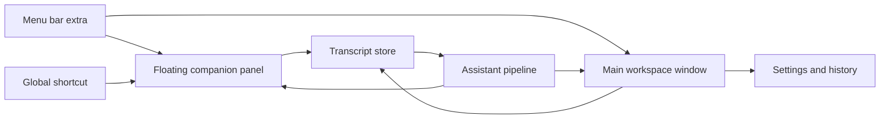
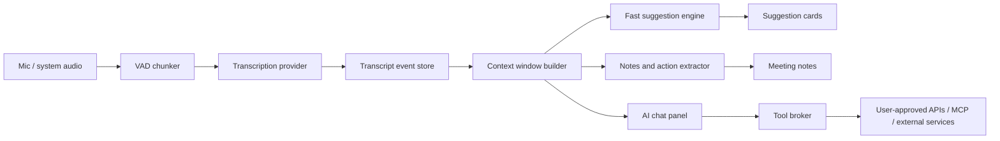
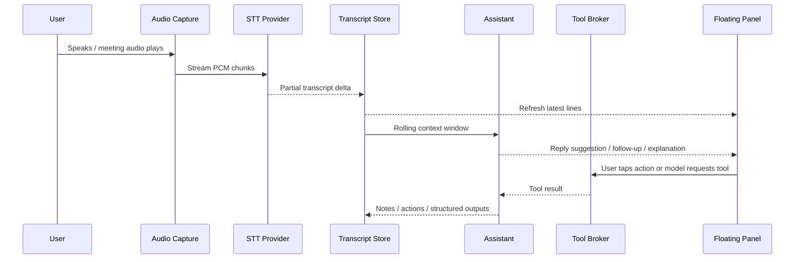

# Architecture and UI/UX for emeet

## Executive Summary

For emeet on macOS, the strongest default architecture is **hybrid rather than single-surface**: a conventional SwiftUI app with a **main workspace window** for transcript history, notes, settings, and exports; a **MenuBarExtra** for quick status and control; and a **compact floating companion panel** for in-meeting use. This fits Apple’s windowing model better than an always-visible overlay, keeps the UI discoverable, and supports both fast “glance and act” behavior during calls and deeper post-meeting workflows afterward. Apple’s own guidance positions menu bar extras as a way to expose app-specific functionality while the app is not frontmost, and SwiftUI/AppKit now provide good window-management primitives for companion windows and utility panels. citeturn15search0turn15search9turn15search16turn12view0turn14view0

If no deployment target is specified, the cleanest product strategy is a **tiered compatibility ladder**: target **macOS 13+** as the broad baseline so you can use `MenuBarExtra` and `SMAppService`; add **macOS 15+** enhancements such as SwiftUI’s `windowLevel(.floating)` for simpler floating-window behavior; and optionally unlock **macOS 26+** features such as `SpeechAnalyzer` / `SpeechTranscriber` for newer on-device speech pipelines and the `FoundationModels` framework for Apple’s on-device LLM on Apple Intelligence-capable Macs. That tiering keeps the architecture stable while letting you progressively adopt newer Apple APIs where they materially improve UX, privacy, or latency. citeturn12view1turn8search0turn27search1turn28search8turn28search17turn32search0turn32search12

The most important engineering decision is to **separate realtime transcription from assistance generation**. Do not make the whole UI or notes pipeline depend on one monolithic “AI stream.” Instead, maintain a normalized transcript event log, then run secondary intelligence tasks over it: fast suggestion generation over the last few utterances, slower summarization over topic windows, and post-meeting action extraction over finalized transcript chunks. Apple’s speech APIs, OpenAI’s Realtime/Responses APIs, Anthropic tool loops, Gemini Live, and GitHub’s model/tooling surfaces all support this decoupled approach in different ways. citeturn6view4turn21view0turn21view1turn21view3turn21view5turn21view7

The app should stay **quiet by default**. In a live call, the UI should show no more than the latest transcript lines, one or two high-confidence suggestions, and a small set of explicit user actions like “What should I say?”, “Follow-up questions”, “Summarize current topic”, “Extract action items”, and “Explain this.” The expanded workspace can expose the full transcript, suggestion history, AI chat, and export tools, but the floating surface should optimize for attention economy rather than feature density. Apple’s HIG on windows, layout, toolbars, writing, and accessibility all point toward exactly that kind of focused, low-noise utility design. citeturn15search1turn15search4turn15search24turn15search3turn15search5

Audio capture and permissions are the area with the most architectural risk. Local mic capture is straightforward with AVFoundation, but good capture of remote participants in Zoom/Meet/Teams depends on **system or app audio capture**, which means ScreenCaptureKit or Core Audio taps, plus the right privacy disclosures and explicit user permission flows. You should design the product so that it still degrades gracefully if only microphone access is available. citeturn23search1turn23search4turn2view7turn4view5turn25search17

## Recommended App Architectures

The ideal product surface is not “main window versus menu bar versus floating panel.” It is **all three, with different jobs**. The menu bar surface is the control tower. The floating panel is the in-meeting cockpit. The main window is the archive, settings, and full-workspace surface. SwiftUI supports `MenuBarExtra`, `Window`, `WindowGroup`, and `openWindow`; AppKit gives you the additional precision needed for floating, nonactivating utility panels. citeturn15search9turn11search6turn27search3turn12view5turn26search1turn26search5



The recommended architecture is a **hybrid utility app**. Keep a normal app bundle and a normal settings/history window, but let users operate it primarily from the menu bar and a summonable companion panel during meetings. This preserves discoverability, makes onboarding and permissions easier, and avoids turning the floating surface into a bloated desktop replacement. It also maps well to Apple’s lifecycle and service APIs: `MenuBarExtra` on macOS Ventura and later, `LSUIElement` for true agent-style behavior if you choose it, and `SMAppService` for explicit login item behavior on macOS 13 and later. citeturn12view1turn15search0turn8search2turn8search0

A **menu-bar-only agent app** is viable, but it should usually be an opt-in mode, not the default. Apple’s `LSUIElement` makes it possible to run as an agent app without a Dock presence, and `MenuBarExtra` can be the primary scene of an app. The trade-off is that agent-style apps are easier to lose, harder to debug, and more dependent on excellent menu bar and panel UX. For a first release, the operational simplicity of a normal app with utility surfaces is usually better. citeturn8search2turn12view1turn15search9

A **full overlay or HUD** should be treated as specialized, not primary. It can feel attractive for live assistance, but it is easier to make intrusive, more fragile across Spaces/full-screen workflows, and more likely to require AppKit-specific window behaviors to behave well. AppKit’s collection-behavior flags can help floating windows join Spaces or act as auxiliary full-screen surfaces, but that is precisely why overlays should be limited to compact, explicit-use moments rather than persistent occupation of the user’s screen. citeturn34search2turn34search0turn34search4turn34search5

### App-type comparison

| App type | Best role | Strengths | Weaknesses | Recommendation |
|---|---|---|---|---|
| Main window app | Settings, history, transcript archive, post-meeting review | Discoverable, standard windowing, easier permissions/onboarding | Too heavy for live-call use by itself | Necessary |
| Menu bar app | Status, quick controls, fast entry point | Low-friction access when app is not frontmost | Poor fit for rich transcript/chat workflows if used alone | Necessary |
| Floating panel | In-meeting transcript and suggestions | Best balance of glanceability and speed | Needs careful sizing, focus, and z-order behavior | Necessary |
| Overlay / HUD | Temporary emergency prompt or mini-coach | Maximal visibility | Highest attention cost and most fragile behavior | Optional only |

The table above is an architectural synthesis, but the enabling platform facts are concrete: `MenuBarExtra` exists specifically for common functionality while the app is not active; `Window` is intended for supplemental functionality; AppKit `NSPanel` supports floating and nonactivating behavior; and SwiftUI plus AppKit provide increasingly strong placement, restoration, toolbar, and window-level APIs for utility windows. citeturn15search9turn27search3turn26search1turn26search4turn26search5turn14view0turn12view0

```text
Analytical fit for live meetings
Hybrid menu bar + floating panel   █████
Main window + detachable panel     ████
Menu bar only                      ██
Persistent overlay / HUD           ██
```

### Recommended architecture variants

A **baseline architecture** should target **macOS 13+** and use SwiftUI for most UI, AppKit only for panel/window control, AVFoundation for microphone capture, ScreenCaptureKit for remote/system audio where enabled, a transcript event store, and a provider abstraction over STT + LLM backends. This is the best balance between capability and compatibility. citeturn12view1turn8search0turn2view7turn23search17

A **premium modern architecture** can target **macOS 15+ or macOS 26+** and simplify some windowing with SwiftUI floating window levels while also gaining newer Apple intelligence features such as `SpeechAnalyzer`, `SpeechTranscriber`, and `FoundationModels`. This is attractive if you are comfortable narrowing hardware/OS compatibility in exchange for more on-device privacy and less dependence on third-party APIs for some tasks. citeturn27search1turn28search8turn28search17turn32search12

## UI and UX for In-Meeting Use

A meeting assistant is a **secondary attention surface**, not the primary stage. That single fact should drive the entire design. The floating panel should be readable at a glance, keyboard-first, and latency-transparent. It should show what the model heard, what it inferred, and what it suggests, without forcing the user to read large blocks of text or track a constantly shifting interface. Apple’s writing guidance explicitly favors simple, plain language written with accessibility and localization in mind, while the HIG for windows and layout emphasizes adaptable, user-controlled windows rather than rigid surfaces. citeturn15search3turn15search1turn15search4turn15search16

The best interaction model is **three-state**. When idle, the app lives in the menu bar and perhaps a dormant shortcut. During a meeting, a compact floating panel shows only the latest transcript and top actions. When expanded, the user gets a full workspace with transcript, suggestions, AI chat, and notes. This makes the app feel light during calls while still giving power users a place to inspect context, sources, and history afterward. SwiftUI’s scene/window model and AppKit-backed panels support this separation very well. citeturn12view0turn14view0turn26search1

### Compact floating panel mockup

```text
┌ Meeting Companion ───────────────────────────────────────┐
│ ● Live    EN-US    Zoom    00:18                        │
│                                                          │
│ Heard just now                                           │
│ “Can we realistically ship this by Friday?”              │
│                                                          │
│ Suggested reply                                          │
│ “If scope stays fixed, Friday is possible. If we add     │
│ review changes, I’d want to confirm after today’s test.”│
│                                                          │
│ [What should I say?] [Follow-up questions] [Explain this]│
│ [Summarize topic]   [Extract action items]               │
│                                                          │
│ Current topic: release timing                            │
│ Action candidate: confirm QA cut-off owner @Alex         │
└──────────────────────────────────────────────────────────┘
```

The compact panel should strongly prefer **short answer cards over chat bubbles**. A suggestion card should include: the suggested wording, a one-line rationale or “why,” a freshness indicator, and an action strip such as **Copy**, **Insert into chat draft**, **Ask follow-up**, or **Pin**. Keeping these actions explicit reduces accidental automation and helps accessibility by making each card a coherent action target rather than a cluster of tiny affordances. SwiftUI’s accessibility APIs are well suited to modeling the whole card as a combined element with named actions. citeturn16search7turn16search4turn16search5

### Expanded workspace mockup

```text
┌ Toolbar: Meeting • Export • Search • Filters • Settings ─────────────────────┐
│ Transcript                     │ Suggestions                 │ AI Chat        │
│                                │                             │                │
│ Alex: Can we ship Friday?      │ Reply                       │ Ask anything   │
│ You : We need to verify QA…    │ If scope stays fixed...    │ about current  │
│ Priya: What blocks remain?     │                             │ topic, terms,  │
│                                │ Follow-up                   │ or decisions   │
│ ─ Topic break ─                │ - What is the QA cutoff?   │                │
│ Release timing                 │ - Which tasks are at risk? │                │
│                                │                             │                │
│ Action candidates              │ Explain this                │ chat thread    │
│ - Confirm QA cutoff owner Alex │ “Cutoff” = last acceptable │ with tools     │
│ - Freeze scope by 4 PM         │ point for candidate build  │ history        │
└───────────────────────────────────────────────────────────────────────────────┘
```

The expanded workspace should use a **three-column mental model**: transcript on the left as source-of-truth, suggestions in the center as the short-term action plane, and AI chat on the right as the exploratory plane. This prevents the chat panel from displacing the transcript, which is a common UX failure in meeting tools. Apple’s toolbar guidance also supports grouping controls into logical sections rather than flattening everything into one busy row. citeturn15search24turn15search1

### Suggested UI rules

Do not show more than **two auto-generated suggestion cards** at once. More than that turns the panel into a reading task. Keep the latest high-confidence suggestion at the top, and let lower-priority helpers such as “Explain this” or “Summarize current topic” appear only after an explicit user action or a detected pause. This is not an Apple rule; it is a cognitive-load recommendation derived from the fact that the user’s primary job remains the meeting itself. The Apple HIG’s emphasis on clarity, focused windows, grouped controls, and plain language supports this restrained approach. citeturn15search2turn15search24turn15search3

The default action on suggestion cards should be **Copy**, not direct typing into another app. If you later add “paste into active app” or richer cross-app insertion, treat it as an advanced feature because controlling other apps routes you toward macOS accessibility automation APIs such as `AXUIElement`, which increases permission surface area and fragility. citeturn36search2turn36search5turn36search14

For the specific one-tap buttons you listed, use them as **stable intents** rather than ephemeral prompt labels. “What should I say?” should always generate a short, sayable response. “Follow-up questions” should always produce no more than three short questions. “Summarize current topic” should summarize only the active topic window, not the entire meeting. “Extract action items” should prefer verbs and owners. “Explain this” should explain the currently selected term, sentence, or topic. Stable intent semantics improve trust, caching, evaluation, and localization. This is a product recommendation, but it aligns with Apple’s guidance on clear, plain writing and accessible labeling. citeturn15search3turn10search7

## Platform Constraints and System Capabilities

The technical hard part is not SwiftUI. It is **audio capture on macOS under privacy controls**. On macOS 10.14 and later, microphone access requires explicit user authorization. Apple’s AVFoundation authorization docs and platform resource keys make that baseline clear. For any meeting assistant, permissions must be explained in product language before the system prompt appears; otherwise, denial rates and user confusion will be high. citeturn23search1turn23search4turn9search11

For **microphone capture**, AVFoundation is the straightforward path. `AVAudioEngine` is useful in real-time contexts, and `installTap` lets you observe PCM buffers while the engine runs, but Apple documents that you can have only **one tap per bus**, which means your architecture should fan out buffers from a single audio service rather than allowing every subsystem to register its own tap. That matters for live transcription, VAD, waveform rendering, and recording. citeturn25search22turn25search1

For **call/system audio**, ScreenCaptureKit is the highest-confidence Apple-native route. Apple introduced it as a high-performance screen-capture framework and explicitly called out app-level audio filtering; Apple also notes that user consent for screen capture is stored in the system privacy settings. More recent ScreenCaptureKit updates added microphone capture support and improved capture control, which makes it much more relevant for emeet-style apps than it was at launch. citeturn2view7turn23search24turn4view5

If you need **outgoing audio from a specific process or set of processes**, Core Audio taps are another official route. Apple’s Core Audio tap documentation says an audio tap object can specify which process or group of processes it captures from and can choose mixdown options. That can be powerful when you want “conference audio only” rather than whole-screen capture, but it is a more specialized path than basic microphone capture. citeturn25search17turn3search21

For **speech-to-text**, Apple now has two very different generations of APIs. The older Speech framework can recognize live or prerecorded audio, and Apple previously highlighted local on-device recognition for supported cases. The newer `SpeechAnalyzer` / `SpeechTranscriber` stack is the more important forward-looking option: Apple introduced it in the newest SDK generation, positioned it for more use cases than `SFSpeechRecognizer`, and explicitly demonstrated conversation-quality transcription, long-form use, distant speech, and live result handling through async sequences. Apple’s documentation also marks the new “advanced speech-to-text capabilities” sample and `SpeechTranscriber` as **macOS 26.0+** functionality. citeturn23search17turn28search11turn6view4turn35search1turn28search8turn28search17

That leads to a clear version strategy. If you need maximal compatibility, use either the older Speech framework or a cloud/on-device third-party STT provider behind an abstraction. If you can require the newest Apple stack, `SpeechAnalyzer` and `SpeechTranscriber` should be your primary Apple-native path. Apple also notes that `SpeechTranscriber` supports a set of current languages with more to come, and recommends `DictationTranscriber` when the device or language is unsupported. citeturn28search4turn35search9

The privacy disclosure for speech is subtle. Apple’s `NSSpeechRecognitionUsageDescription` key is specifically described as the message that tells users why the app is requesting to **send user data to Apple’s speech recognition servers**. That means you should not collapse microphone permission and speech permission into one generic explanation. If your product can operate fully locally on some paths and remotely on others, reflect that distinction in onboarding and settings. citeturn23search2turn23search22

For **background and startup behavior**, use standard app lifecycle patterns unless you truly need helper executables. `SMAppService` is Apple’s current API for registering LoginItems, LaunchAgents, and LaunchDaemons, but a meeting assistant should usually stay in the simpler world of a main app plus optional login item. Apple’s `LSUIElement` flag gives you agent-app behavior without a Dock icon when you want it. LaunchDaemons and privileged helpers are for very different classes of software and unnecessarily complicate review, trust, debugging, and distribution for a meeting assistant. citeturn8search0turn8search3turn8search4turn8search2

For **global shortcuts**, the cleanest product path is to use a proper hotkey registration mechanism rather than a raw event tap if all you need is “summon panel” and a few global commands. The open-source `KeyboardShortcuts` package is widely used, explicitly says it is sandboxed and Mac App Store compatible, and notes that it uses Carbon for global hotkeys because Apple has not shipped a modern replacement yet. By contrast, Apple’s Quartz event-tap documentation makes clear that broad key monitoring routes you toward Input Monitoring or Accessibility-style permissions depending on how you use the tap. citeturn24view0turn33search2turn33search0turn33search20turn33search11

### Permissions and capture matrix

| Capability | Typical API path | User-facing system permission | Notes |
|---|---|---|---|
| Microphone speech capture | `AVAudioEngine`, `AVCaptureSession` | Microphone | Baseline requirement |
| Remote/app/system audio capture | `ScreenCaptureKit`, Core Audio taps | Screen & System Audio Recording, or capture-specific disclosures | Needed for full call context |
| Server-backed Apple speech recognition | Speech framework paths that use Apple servers | Speech Recognition | Explain why audio leaves device |
| Arbitrary key monitoring or app control | Event taps / AX APIs | Input Monitoring and/or Accessibility | Avoid unless feature truly requires it |

The table is a product-facing synthesis, but its underlying permission surfaces come directly from Apple’s AVFoundation authorization docs, Speech resource keys, Screen & System Audio Recording support materials, Quartz event services, and Accessibility APIs. citeturn23search1turn23search22turn23search24turn33search2turn33search11turn36search2

## SwiftUI and AppKit Implementation Notes

The app should be **SwiftUI-first, AppKit-selective**. SwiftUI is now mature enough for most macOS utility UI, including `MenuBarExtra`, `Window`, `WindowGroup`, toolbars, settings, and state-driven layout. The missing pieces for this product are mostly window-behavior details, where AppKit still matters: `NSPanel`, nonactivating behavior, collection behavior across Spaces, and compatibility on older macOS releases. Apple’s own guidance on using SwiftUI with AppKit strongly supports this mixed approach. citeturn11search11turn11search5turn11search20

### Scene structure

```swift
import SwiftUI

@main
struct EmeetApp: App {
    @State private var appState = AppState()

    var body: some Scene {
        Window("emeet", id: "main") {
            MainWorkspaceView()
                .environment(appState)
        }

        MenuBarExtra("emeet", systemImage: "text.bubble") {
            MenuBarStatusView()
                .environment(appState)
        }
        // On newer systems, you can choose menu or window presentation style.

        Settings {
            SettingsView()
                .environment(appState)
        }
    }
}
```

Use `Window` for singleton-style supplemental surfaces and `openWindow` to summon them programmatically from menu actions or shortcuts. Reserve `WindowGroup` only if you truly want per-meeting multiwindow behavior. SwiftUI’s newer window APIs also support controlled placement, restoration, sizing, and launch behavior for windows that should feel more utility-like than document-like. citeturn27search3turn12view5turn14view0

### Floating companion window

On **macOS 15+**, SwiftUI’s scene-level window APIs begin to reduce the amount of AppKit bridging you need. In particular, `WindowLevel.floating` exists for macOS 15+, and SwiftUI exposes a `windowLevel(_:)` scene modifier. If you need broader compatibility or more control, back the companion surface with an `NSPanel`. citeturn27search1turn27search12turn26search1turn26search8

```swift
// Pseudocode / AppKit-backed panel controller
final class CompanionPanelController: NSWindowController {
    init(rootView: some View) {
        let panel = NSPanel(
            contentRect: NSRect(x: 0, y: 0, width: 420, height: 260),
            styleMask: [.titled, .fullSizeContentView, .nonactivatingPanel],
            backing: .buffered,
            defer: false
        )

        panel.isFloatingPanel = true
        panel.level = .floating
        panel.collectionBehavior = [
            .canJoinAllApplications,
            .fullScreenAuxiliary
        ]
        panel.titleVisibility = .hidden
        panel.titlebarAppearsTransparent = true
        panel.isMovableByWindowBackground = true
        panel.contentView = NSHostingView(rootView: rootView)

        super.init(window: panel)
    }

    @available(*, unavailable)
    required init?(coder: NSCoder) { nil }
}
```

`NSPanel` is the right conceptual model for this surface because Apple explicitly distinguishes floating panels from normal windows, and `nonactivatingPanel`, floating panel behavior, and `NSWindow.Level` exist precisely for utility-style windows. The placement/cross-Space behavior shown above is a pragmatic pattern, not a guarantee that every overlay behavior will feel “system-like” in every full-screen scenario. citeturn26search1turn26search4turn26search5turn26search8turn34search0turn34search5

### Global shortcuts

```swift
// Third-party example using KeyboardShortcuts
import KeyboardShortcuts

extension KeyboardShortcuts.Name {
    static let toggleCompanion = Self("toggleCompanion")
}

@MainActor
final class HotkeyController {
    init(appState: AppState) {
        KeyboardShortcuts.onKeyUp(for: .toggleCompanion) {
            appState.toggleCompanionPanel()
        }
    }
}
```

In-app shortcuts should still use SwiftUI’s native `.keyboardShortcut`, but the system-wide summon command is best handled by a dedicated global-hotkey layer. For this product, that is usually preferable to event taps because it avoids unnecessary Input Monitoring or Accessibility obligations. citeturn7search0turn24view0turn33search20

### Audio capture pipeline

```swift
import AVFoundation

actor MicrophoneCaptureService {
    private let engine = AVAudioEngine()
    private var continuation: AsyncStream<AVAudioPCMBuffer>.Continuation?

    func stream() -> AsyncStream<AVAudioPCMBuffer> {
        AsyncStream { continuation in
            self.continuation = continuation
        }
    }

    func start() throws {
        let input = engine.inputNode
        let format = input.outputFormat(forBus: 0)

        input.installTap(onBus: 0, bufferSize: 1024, format: format) { [weak self] buffer, _ in
            self?.continuation?.yield(buffer)
        }

        try engine.start()
    }

    func stop() {
        engine.inputNode.removeTap(onBus: 0)
        engine.stop()
        continuation?.finish()
    }
}
```

This pattern is appropriate for a single ownership model over microphone capture. If you need waveform, VAD, recording, and STT at once, fan out from one capture owner. Apple documents that taps can be installed and removed while the engine runs, but only one tap can be installed on a given bus. If you need voice cleanup for local speech in noisy environments, Apple’s voice-processing APIs via `AVAudioEngine` are also worth evaluating because they provide echo cancellation, noise suppression, automatic gain control, and mic-mode support. citeturn25search1turn25search24turn25search22turn6view6

### Transcript pipeline abstraction

```swift
struct TranscriptDelta: Sendable {
    let text: String
    let isFinal: Bool
    let timestamp: Date
    let speakerHint: String?
}

protocol TranscriptionProvider: Sendable {
    func start(
        locale: Locale,
        audio: AsyncStream<AudioChunk>
    ) async throws -> AsyncStream<TranscriptDelta>
}

protocol AssistantProvider: Sendable {
    func suggest(
        context: MeetingContext,
        intent: AssistantIntent
    ) async throws -> AssistantResult
}
```

Keep STT, assistant inference, and tool execution behind separate protocols. That lets you swap Apple-native STT for OpenAI/Gemini/Whisper-style streaming; route “What should I say?” to a very fast lower-latency model; and route “Extract action items” to a slower, more structured model. It also keeps GitHub/Copilot/Codex-style coding assistance from contaminating the general-purpose meeting assistant path. citeturn21view0turn21view1turn21view5turn21view7turn22search3

### Performance notes

Live transcript UIs often become slow for an unglamorous reason: too many view updates. Apple’s recent SwiftUI performance material and Instruments guidance explicitly call out long-running `body` calculations and frequent update causes. For this app, keep transcript state append-only, finalize segments instead of mutating large arrays repeatedly, debounce suggestion recomputation, and profile with the SwiftUI instrument early rather than after the UI starts hitching. citeturn25search0turn25search5turn25search13

Use structured logging, not `print`, for pipeline visibility and diagnostics. Apple’s OS logging system exposes `Logger`, and it integrates with Console, the `log` tool, and Xcode. Pair it with signposts around audio chunking, transcript updates, and suggestion latency so you can see where the system actually stalls. citeturn30search3turn30search7turn30search11

For local persistence of meetings, snippets, and action items, Apple’s `SwiftData` is the default first choice if you want a modern Swift-native persistence layer that works smoothly with SwiftUI. If you anticipate heavy transcript search or custom SQL workflows, a lower-level database stack may still be preferable, but `SwiftData` is the right baseline until proven otherwise. citeturn30search2turn30search14

## Data Flow and Model/API Integration

The product architecture should treat the meeting assistant as **three parallel lanes**. Lane one is low-latency audio-to-transcript. Lane two is short-horizon assistance for the last utterance or topic turn. Lane three is longer-horizon synthesis for notes, summaries, and action extraction. This division matches the capabilities exposed by modern speech and model APIs: speech/transcription streams for lane one, fast tool-capable chat or realtime agents for lane two, and more structured agent loops for lane three. citeturn21view0turn21view1turn21view3turn21view5



### Sequence diagram



### Provider strategy

For Apple-native speech, `SpeechAnalyzer` and `SpeechTranscriber` are the strongest long-term Apple path on the newest OS generation, especially when paired with Apple Intelligence features on supported Macs. Apple explicitly frames the new stack as better suited than `SFSpeechRecognizer` for more use cases and demonstrates live transcription via async streams, with conversation-oriented presets such as progressive transcription. citeturn35search1turn28search8turn28search17turn35search11

For OpenAI, the clearest split is: use **Realtime** when you need persistent low-latency audio sessions, and use **Responses** when you need an agentic text/action loop, multi-turn tool orchestration, file/web search, or remote MCP. OpenAI’s docs explicitly distinguish voice-agent sessions, translation sessions, and transcription sessions in Realtime, and they position Responses as a unified agent interface with built-in tools, function calling, and remote MCP support. citeturn21view0turn21view1turn21view2

For Anthropic, a similar split exists but with different mechanics. Claude tool use distinguishes **client tools** that your app executes and **server tools** that Anthropic executes, and the streaming docs note that tool use may introduce pauses while the model is assembling structured tool input. That makes Claude attractive for chat, notes, and structured tool workflows, but it is less naturally a single-stack answer for a speech-centered macOS meeting assistant unless you pair it with another STT path. citeturn21view3turn21view4

For Google, **Gemini Live** is the closest analogue to an end-to-end low-latency multimedia backend for an app like emeet. Google’s official docs describe it as a stateful WebSocket API for realtime voice and vision, with raw PCM audio streaming and function calling support. That makes it a legitimate alternative to OpenAI Realtime for the “listens and responds continuously” lane. citeturn21view5turn21view6

For GitHub, distinguish three things that people often blur together: **GitHub Models** as an inference/control plane, **GitHub Copilot MCP** as a tool/context extension mechanism, and **Copilot/Codex-style coding agents** as specialized coding surfaces. GitHub Models lets you invoke many models through GitHub credentials and a PAT with `models` scope; GitHub also offers BYOK for GitHub Models, but the official docs say support is currently limited to OpenAI and AzureAI in public preview. GitHub’s MCP docs position MCP as the way to extend Copilot with tools and external systems across multiple Copilot surfaces. citeturn21view7turn21view8turn21view9

That distinction matters for your product. If the meeting assistant is for developers, then **Codex/Copilot-like capabilities are best modeled as optional skills**, not the primary meeting brain. Use them when the user asks things like “Explain this stack trace,” “Draft the follow-up issue,” or “Create a PR note from the action items.” Do not let the coding agent become the owner of the meeting transcript pipeline. OpenAI itself positions Codex as a coding agent that reads, edits, and runs code, which is a fundamentally different center of gravity from a transcript-first meeting assistant. citeturn22search3turn22search10

### Third-party API comparison

| Provider / stack | Strongest role in this app | Audio-native | Tool-capable | Best used for |
|---|---|---|---|---|
| Apple SpeechAnalyzer + SpeechTranscriber | On-device Apple-native STT on newest OS | Yes | No LLM/tool layer by itself | Live transcript |
| Apple FoundationModels | On-device Apple-native LLM on supported Macs | No | App-defined tools/callbacks | Private notes, explanations, summaries |
| OpenAI Realtime | Persistent low-latency audio session | Yes | Yes | Live assistance |
| OpenAI Responses | Agentic text/tool loop | Not the primary audio path | Yes, including remote MCP | Notes, actions, AI chat |
| Anthropic Messages + tools | Structured tool/chat workflows | No native speech-focused stack in same way | Yes | AI chat, notes, extraction |
| Gemini Live | Low-latency voice+vision agent | Yes | Yes | Live assistance alternative |
| GitHub Models / Copilot MCP | Governance, model routing, developer tools | Not the primary speech layer | Yes | Dev-team integrations, coding-related actions |

The capability mapping above is a synthesis, but its factual basis comes from the providers’ own documentation: Apple’s Speech and Foundation Models docs; OpenAI’s Realtime, Responses, and tools docs; Anthropic’s tool-use and streaming docs; Gemini Live and function-calling docs; and GitHub’s Models and MCP docs. citeturn28search8turn32search0turn32search12turn21view0turn21view1turn21view2turn21view3turn21view4turn21view5turn21view6turn21view7turn21view8turn21view9

### Tool-broker design

All external APIs should sit behind a **tool broker with explicit approval policy**. Even when a vendor supports autonomous tool use, your app should decide what “autonomous” means. This is especially important if you expose GitHub, issue trackers, calendars, or code actions. GitHub’s own documentation warns that once an MCP server is configured, Copilot cloud agent can use those tools autonomously and will not ask for approval, and that support is limited in specific ways. In a meeting assistant, that is too loose as a default. Build your own confirmation and scoping layer above the tool API. citeturn21view10

```text
Suggested latency budget for a smooth meeting assistant
Engineering target, not a platform guarantee

Audio chunking / pause detect     50–120 ms   ███
Partial STT visible               150–500 ms  ██████
Top suggestion available          300–1200 ms ███████████
UI re-render after delta          <16 ms/frame █
```

That budget is an engineering recommendation rather than a platform promise, but it follows directly from the fact that the major providers expose streaming / persistent-session primitives and Apple’s latest speech APIs emphasize live async result delivery. citeturn21view0turn21view5turn35search9

## Security, Accessibility, Localization, and HIG Alignment

Security should be designed around **least privilege and clear boundaries**. Use the **App Sandbox** unless you have a concrete reason not to. Enable the **Hardened Runtime**. Store provider tokens and refresh credentials in **Keychain Services** rather than plaintext config files. Keep third-party SDK compliance current with **privacy manifests**, which Apple now requires developers to reason about both for their own apps and for third-party code they include. citeturn17search14turn17search1turn17search5turn17search18turn17search3turn17search15turn17search26

Transcript text and meeting notes are especially sensitive. Architecturally, the safest model is to separate **raw transcript**, **derived notes**, **tool credentials**, and **telemetry** into different storage classes. Credentials belong in the keychain. Raw transcript and notes can sit in local persistence with clear retention controls. Telemetry should avoid full transcript payloads unless the user explicitly opts in. Apple’s security and privacy framework documentation does not prescribe that schema, but it strongly points toward limiting privileges and treating sensitive user data as protected by default. citeturn17search13turn17search14turn17search18

Accessibility is not optional for this category. SwiftUI already provides built-in accessibility support and explicit APIs such as `accessibilityAction` and `accessibilityElement(children:)`; Apple’s HIG accessibility guidance emphasizes that accessible interfaces should work regardless of a person’s capabilities or interaction mode. In practical terms, that means the floating panel must be fully keyboard navigable, suggestion cards must be exposed as meaningful grouped accessibility elements, and all critical controls must have stable names and shortcuts. citeturn16search7turn16search4turn16search5turn16search13turn15search5

The transcript surface deserves extra care. Do not expose every punctuation-level update as a separate accessibility announcement. Instead, group updates by utterance or finalized segment, make the “latest transcript” region identifiable, and provide manual actions such as “Read latest suggestion” or “Pin current suggestion.” SwiftUI’s grouping and custom accessibility actions are specifically designed for these kinds of higher-level interactions. citeturn16search2turn16search4turn16search5

Localization should use **two layers**. Static UI strings belong in **String Catalogs**, which Apple recommends in Xcode 15 and later and which can automatically parse SwiftUI strings after builds. Model-generated content belongs behind a **response-language policy** that may differ from the UI locale. In practice, that means the app might have an English UI while generating Chinese meeting summaries, or vice versa. Apple’s guidance on writing also explicitly advises writing with localization in mind and avoiding jargon. citeturn10search24turn10search8turn15search3

For Chinese and English specifically, the floating panel should avoid fixed-height button stacks and overly narrow cards. CJK text expands vertically and changes the visual balance of dense utility panels. That is a design recommendation rather than a quoted Apple rule, but Apple’s layout guidance strongly reinforces the need to test resizable windows and multiple arrangements rather than assuming one compact layout is universally stable. citeturn15search4turn15search16

### HIG-aligned checklist

| Design area | Recommended decision |
|---|---|
| Menu bar | Use it for quick access and status, not full workflow ownership |
| Windows | Let users move/resize primary windows; keep the companion panel compact |
| Toolbars | Group controls by function and keep the row quiet |
| Labels | Prefer short, direct labels over prompt-like phrasing everywhere |
| Accessibility | Make suggestion cards grouped, named, and keyboard actionable |
| Localization | Use String Catalogs for static UI; keep LLM language configurable |

This checklist is a synthesis of Apple’s HIG materials on the menu bar, windows, layout, toolbars, labels, writing, and accessibility rather than a direct excerpt from any single page. citeturn15search0turn15search1turn15search4turn15search24turn10search7turn15search3turn15search5

## Recommended Stack and Prioritized Sources

A high-confidence implementation stack looks like this: **SwiftUI** for the main UI; **AppKit** for a compatibility-safe floating companion panel; **AVFoundation** for mic capture; **ScreenCaptureKit** or **Core Audio taps** for remote/system audio capture where enabled; **SwiftData** for local meeting artifacts; **Logger / OSLog** for diagnostics; **SMAppService** for optional launch-at-login; **Keychain Services** for secrets; and a provider abstraction over speech + LLM backends so you can route to Apple-native, OpenAI, Anthropic, Gemini, or GitHub-backed workflows without rewriting the app surface. citeturn11search11turn26search1turn23search1turn2view7turn25search17turn30search2turn30search3turn8search0turn17search18

If you want the most pragmatic shipping path, start with **macOS 13+**, use **KeyboardShortcuts** for the summon hotkey, add a **floating AppKit panel**, and keep your model layer provider-neutral. Then add modern code paths for **macOS 15+** floating window levels and **macOS 26+** Apple-native STT / on-device LLM features. That keeps the first version buildable and testable without betting the whole app on the newest OS generation. citeturn12view1turn24view0turn27search1turn28search8turn32search12

### Source priority

**Highest priority** should go to Apple’s own platform material: HIG pages for the menu bar, windows, layout, toolbars, writing, and accessibility; WWDC sessions such as *What’s new in SwiftUI* (for `MenuBarExtra`), *Work with windows in SwiftUI*, *Tailor macOS windows with SwiftUI*, *Bring advanced speech-to-text to your app with SpeechAnalyzer*, *What’s new in ScreenCaptureKit*, and *Optimize SwiftUI performance with Instruments*; and the primary API references for `SMAppService`, `LSUIElement`, `NSPanel`, `NSWindow.Level`, Speech, ScreenCaptureKit, Keychain Services, and privacy manifests. citeturn15search0turn15search1turn15search4turn15search24turn15search3turn15search5turn12view1turn12view0turn14view0turn35search1turn4view5turn25search0turn8search0turn8search2turn26search1turn26search8turn17search18turn17search3

**Second priority** should go to the primary model-provider docs: OpenAI Realtime, Responses, and tools; Anthropic tool use and streaming; Gemini Live and function calling; GitHub Models, BYOK, and MCP. Those are the authoritative sources for capability boundaries, tool-call semantics, and governance implications. citeturn21view0turn21view1turn21view2turn21view3turn21view4turn21view5turn21view6turn21view7turn21view8turn21view9turn21view10

**Third priority** should go to mature macOS-focused packages that smooth rough edges rather than redefine the architecture. The most defensible examples here are `KeyboardShortcuts` for user-configurable global hotkeys and Sparkle if you distribute outside the Mac App Store and want a longstanding macOS-native updater path. Use these as tactical helpers, not architectural anchors. citeturn24view0turn30search0turn30search4

### Open questions and limitations

The precise **best audio-capture strategy for remote participants** still depends on whether you want whole-meeting capture, app-specific capture, mic-only fallback, or a combination, and on the minimum macOS version you are willing to support. Apple’s APIs now cover more of this space than before, but you still need a deliberate compatibility matrix and real-world testing across Zoom, Meet, Teams, Bluetooth headsets, and multi-display setups. citeturn2view7turn4view5turn25search17

A second unresolved choice is whether you want a **regular app by default** or an **agent-style `LSUIElement` mode** by default. The research strongly supports a hybrid surface model, but product strategy still matters: discoverability and onboarding favor a normal app, while minimalism favors an agent. Both are viable; the most conservative recommendation is a normal app with an optional utility-only mode later. citeturn8search2turn15search0turn15search9

A third open decision is how far to push **on-device intelligence**. Apple’s newest speech and foundation-model APIs are promising, but they require the newest OS generation and compatible hardware. If your target audience includes older Macs or mixed-language meetings outside Apple’s current support envelope, a provider-neutral architecture remains the safer foundation. citeturn28search8turn28search17turn32search12turn28search4
