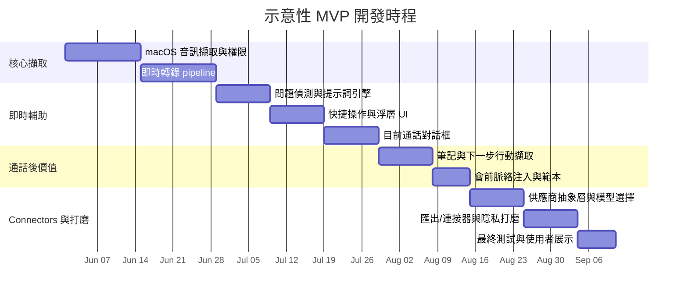

# macOS 會議助理畢業專題的產品定位與競爭分析

## 執行摘要

這個市場在**轉錄、摘要與行動項目擷取**方面已經相當擁擠。Otter、Fireflies、Granola、Fathom、tl;dv、Notion、Zoom 與 Teams 都涵蓋了某種版本的「錄下會議、摘要會議，並讓內容可搜尋」。相對**較不飽和**的是一種 **macOS 原生、低摩擦、即時戰術型副駕**：它能在對話*進行中*協助使用者判斷該說什麼，同時維持私密、跨平台且可彈性選擇模型。現有產品確實提供其中一些片段，例如 Otter AI Chat/voice、Fireflies Live Assist/Sales Assist、Fathom 的對話式會議助理、Zoom meeting questions/My Notes，以及 Teams Facilitator/Copilot，但這些體驗通常綁定在平台生態系中、偏向通話後工作流程最佳化，或鎖定更廣泛的團隊部署，而不是 macOS 上個人使用的「即時回應層」。 citeturn36view0turn19search0turn25view0turn12search0turn14search9

最強烈的建議是**不要**一次鎖定「所有」痛點。如果必須從你的簡報類別中選擇，最好的切入點是**銷售通話**，更精確地說，是**高風險的外部對話**，例如探索型通話、產品示範、客戶成功通話，以及顧問/客戶會議。這個區隔有明確的 ROI、重複出現的會議模式、對異議處理與下一步行動的真實痛點，也能從現有廠商在銷售輔助、CRM 同步與輔導上的投入看出清楚需求。相較之下，**一般會議助理**對學術 MVP 來說太寬泛，**線上課堂筆記**未能充分運用你最具差異性的即時回覆功能，而**面試輔助**若作為公開定位，則會帶來較高的公平性、同意與聲譽風險。 citeturn6search1turn18search9turn25view0turn8search9turn3search20turn12search4

因此，產品應該定位為**私密、低 bot 或無 bot、模型無關的 macOS 即時會議副駕**，而不是另一個通用筆記工具。它的差異化不應該是「我們也能做轉錄」或「我們可以呼叫 API」，因為這些正在快速成為整個品類的基本門檻。差異化應該是：以目前逐字稿與可選的會前脈絡為基礎，提供**即時、由使用者主動觸發的戰術輔助**，並有明確的快捷操作，例如**「我該說什麼？」**與**「追問問題」**，再加上可支援外部模型與 API 的彈性供應商層。 citeturn18search1turn20search5turn3search8turn21search3turn29search5turn28search1turn10search0

## 研究框架與假設

這份評估主要奠基於 **2026 年 5 月 25 日**查核的**官方產品頁、價格頁、說明中心與 API/developer docs**。在有幫助時，我也使用了**近期二手評論**來辨識官方行銷頁面容易低估的實務限制，尤其是 Zapier 2026 年的 AI 會議助理比較，以及 The Verge 近期關於 Granola 分享/隱私預設值的報導。官方繁體中文文件主要可在 Microsoft support 找到；多數其他廠商呈現的仍以英文文件為主。 citeturn33view0turn32search2turn14search3turn14search4

由於你的簡報尚未指定**目標使用者區隔**、**預算**與**時程**，因此仍有幾個假設是開放的。這很重要。此市場的定價與包裝對區隔高度敏感。Teams Copilot 與 Zoom AI Companion 這類企業原生工具受益於平台綑綁，而獨立工具則透過免費增值入口、無 bot 體驗，或專門的銷售工作流程功能競爭。因為你的專案是畢業專題，而不是公司規模的導入，最有防禦力的路徑是最佳化**使用者價值的清晰度與可展示的核心互動**，而不是追求企業管理功能的廣度。 citeturn16view1turn15search4turn25view0turn3search3turn36view0

最後一個市場提醒：標價與可用性有時會**因地區而異**，也可能隨計費週期、促銷期間或帳號資格不同而改變。這在 Microsoft 與 Zoom 文件中尤其明顯，在某些動態渲染的價格頁中也多少可見。因此，下方比較聚焦於**定價模式與目前公開的價格訊號**，而不是採購等級的報價。 citeturn16view1turn15search4turn12search7

## 應鎖定哪些痛點

根本的痛點模式很清楚：現代工作充滿中斷、臨時會議與薄弱的後續追蹤。Microsoft 的 2025 Work Trend Index 報告指出，員工在工作日中大約每兩分鐘就會被會議、電子郵件或訊息提醒中斷一次；Atlassian 則指出，**77%** 的工作者經常參加那種最後只是再排另一場會議的會議。換句話說，商業痛點不只是「我需要一份逐字稿」，也包括「我需要幫助自己保持方向、問出更好的問題，並在時機消失前捕捉下一步」。 citeturn35search5turn35search1turn35search2turn35search6

也就是說，你目前的功能構想更明顯偏向**即時對話支援**，而不是被動的歸檔筆記。即時轉錄、問題分析、自然回覆建議、快捷操作，以及即時問 AI 對話框，最有價值的情境都是使用者承受**互動壓力**的時候。這也是為什麼**線上課堂筆記**作為主要切入點較弱：課堂筆記使用者確實會受益於轉錄與摘要，但他們通常從「我該說什麼？」得到的價值，低於銷售人員、顧問、創辦人、招募人員或客戶成功人員。關於講課情境中 AI 輔助筆記的研究確實指出，它對理解與認知負擔有幫助，這支持教育作為未來可能的相鄰市場，但它與你最具差異性的互動介面，並不像即時外部通話那樣契合。 citeturn35search7turn35search0

作為第一個市場切入點，**銷售通話**是你提出的選項中最合適的。證據雖然是間接的，但很強：Fireflies 明確投入 **Sales Assist** 與知識型即時建議；Otter 有 **OtterPilot for Sales** 與「Assist: call objectives + live coaching」；Fathom 強調 **CRM 欄位同步、Deal View、輔導指標與 AI 評分卡**；tl;dv 推動 CRM 填寫與搜尋/報告；甚至 Zoom 與 Teams 這類平台套件，也越來越把會議轉化為行動導向的工作流程。這代表痛點已被驗證、買方理解 ROI，而且會議格式具有足夠重複性，讓快捷操作提示能立刻顯得有用。 citeturn6search1turn19search0turn18search9turn36view0turn25view0turn8search2turn12search0turn14search1

**面試輔助**不應該是公開的主要定位。其功能機制與你的概念有所重疊，但這是風險更高的主張。主要廠商反覆強調參與者同意與隱私控制：Granola 建議在轉錄他人之前一律先取得同意；Zoom 對部分參與者提供明確的 AI 同意設定與提示；Fathom 則表示，沒有任何方式可以在完全沒有可見性或同意機制的情況下靜默錄製。因此，若將應用程式定位成隱密的面試輔導，會在產品尚未作為合法工作工具建立信任之前，就先引發公平性/合規性的敘事。如果你真的探索面試工作流程，較安全的框架是**模擬面試、內部面試官支援，或面試後整理**，而不是秘密的真實面試輔助。 citeturn3search20turn12search4turn22search0

**對你「應該鎖定哪些痛點？」這個問題的建議答案：**先選擇**銷售通話**，並設計 UX，使其未來可以擴展為**一般高風險會議助理**。第一版**不要**定位為「適用所有會議」，也**不要**以面試輔助作為主打。

**一句話產品定位：**  
**一款私密、macOS 原生的高風險外部對話即時會議副駕，能用使用者偏好的 AI 模型與 connector，將即時逐字稿轉化為有脈絡依據的回覆建議、追問問題與可執行的下一步。**

## 競品比較

| 工具 | 核心功能 | 互動模式 | 已知限制 | 定價模式 | 整合與 API | 證據 |
|---|---|---|---|---|---|---|
| **Otter.ai** | 即時轉錄、講者識別、摘要、行動項目、會議內/跨會議 AI Chat、會議工作流程、即時筆記/字幕、銷售/招募使用情境 | Otter 加入 Zoom、Teams 與 Google Meet；桌面/行動/web；AI Chat 可在會議中與會議後使用；文件中說明了 Zoom 的 voice mode | 較低階方案有分鐘數與單場會議上限；API/Webhooks 僅限 Enterprise；獨立評論指出它較不擅長處理技術語言/專業術語 | Free Basic；Pro；Business；Enterprise。官方價格顯示 Pro 為年繳 $8.33 / 月繳 $16.99，Business 為年繳 $19.99 / 月繳 $30，Enterprise 客製 | Slack、Salesforce、HubSpot、Zapier、Google Drive、Zoom/Meet/Teams、MCP server、Public API、Webhooks | citeturn36view0turn31search0turn31search2turn18search1turn33view0 |
| **Fireflies.ai** | 自動轉錄、AI 摘要、AskFred、AI Skills、主題分析、Live Assist、Sales Assist、桌面浮動面板、多語轉錄 | Bot 可加入會議，或桌面 app 可錄製系統音訊；Live Assist 在會議期間顯示即時筆記/逐字稿/建議 | 免費方案使用轉錄額度、AI credits 與儲存空間上限；系統音訊模式沒有具名講者、沒有儲存的音訊/影片檔，也沒有 Sales Assist；評論者指出 UI 可能顯得雜亂 | 免費增值、以席位計價的方案系列，包含 Free、Pro、Business、Enterprise；進階功能也會消耗 AI credits | 依方案層級/文件不同，提供 50+ 到 100+ app 整合、CRM/dialer/support 整合、GraphQL API、Webhooks、MCP connector support | citeturn6search0turn19search0turn19search1turn19search3turn19search5turn20search0turn20search10turn6search5turn33view0 |
| **Granola** | 無 bot 會議筆記、即時轉錄、通話後 AI 強化摘要、範本、跨筆記 Granola Chat、團隊空間 | 在使用者電腦上透過系統音訊與麥克風運作；沒有會議 bot；iPhone app 支援實體會議與撥出電話 | 除非使用者開啟筆記，否則不會開始轉錄；iPhone 無法擷取虛擬會議音訊，也不支援來電；Zapier 評論指出沒有影片錄製/播放；近期報導對分享連結行為提出隱私批評 | Basic 免費；Business 為 $14/user/month；Enterprise 起價 $35/user/month | Notion、Slack、HubSpot、Attio、Affinity、Zapier；API 存取；適用於 ChatGPT/Claude 風格工具的 MCP | citeturn4search0turn4search3turn4search1turn4search11turn3search3turn3search22turn3search0turn3search4turn3search8turn32search2turn33view0 |
| **Fathom** | 無限錄製/轉錄、摘要、進階摘要、AI 行動項目、Ask Fathom chat、片段/播放清單、團隊搜尋、Deal View、輔導指標、AI 評分卡 | Bot 加入 Zoom/Meet/Teams，或 beta 版無 bot 擷取；Mac/Windows 桌面 app | 僅支援 Mac/Windows；一次只能錄一場會議；無法上傳外部錄音；部分通話類型不支援；評論者指出 Meet 與 Teams 上有些小問題；無 bot 在價格頁仍標示為 beta | 個人免費；Premium；Team；Business。官方價格顯示 Premium 年繳 $16 / 月繳 $20，Team 年繳 $15 / 月繳 $19，Business 年繳 $25 / 月繳 $34 | Slack、Asana、HubSpot、Salesforce、Zapier/Make、ChatGPT、Claude、Public API、Webhooks、MCP | citeturn25view0turn21search0turn21search3turn22search0turn22search1turn22search4turn33view0 |
| **tl;dv** | 錄製、轉錄、AI 筆記/摘要、AI 驅動搜尋、範本、片段、CRM 工作流程、報告/輔導 | 主要是適用於 Zoom、Meet 與 Teams 的 bot 式助理；產品資料中也呈現桌面應用程式/手動筆記 | 平台範圍比「適用任何工具」的產品更窄；並行數量受方案限制；Zapier 評論指出伺服器忙碌時可能無法加入 | Free Forever；Pro；Business；Enterprise。公開 tl;dv 價格參考顯示年繳為 $0 / $18 / $39 / 客製 | 原生整合，外加透過 Zapier 的 5,000+ 整合；有官方 API docs | citeturn8search2turn8search6turn23search0turn23search1turn8search5turn33view0 |
| **Notion AI Meeting Notes** | 會議轉錄、摘要、洞察擷取、在 Notion AI 中可搜尋、工作區內的後續整理、企業搜尋與連接 app 的脈絡 | 「不需要 bot」；適用任何客戶端；存在於 Notion 工作區與 AI 介面中 | 仍為 beta；AI Meeting Notes 是 Business/Enterprise 功能，而 Free/Plus 只能取得有限的免費 AI 回應；已審閱的官方文件更強調擷取/搜尋與工作區記憶，而不是戰術型即時回覆提示 | 以席位計價的 Notion 方案；AI Meeting Notes 定位於 Business/Enterprise | Notion API connections，加上 Slack、GitHub、Google Drive、Jira、Teams 等 AI connectors；Notion 也強調 model-agnostic AI workflows | citeturn10search0turn10search1turn10search2turn17search6turn17search14 |
| **Zoom AI Companion** | 會議摘要、會議問題、My Notes、第三方會議筆記、行動項目擷取、AI Companion 3.0 web 工作介面 | Zoom Meetings 與 Zoom Workplace 內建；也透過 My Notes 支援跨 Teams、Google Meet 與其他第三方情境的筆記 | AI 資格取決於方案與帳號；部分功能有帳號、地區或產業排除；沒有 AI 的 My Notes 仍可保存手動筆記，但強化筆記/逐字稿需要 AI Companion；AI Companion 3.0 優先在 web 推出 | 包含在符合資格的付費 Zoom Workplace 方案中；也提供獨立 AI Companion 訂閱 | 摘要自動傳送到 Slack、第三方會議支援、AI Companion APIs、Zoom AI Services、AI Companion 3.0 中由管理員管理的外部資料整合 | citeturn15search4turn12search0turn27search1turn12search7turn12search11turn15search7turn29search5turn29search7 |
| **Teams Copilot** | 即時會議 Q&A、行動項目、智慧回顧、AI 生成筆記、Facilitator agent、會後摘要，在某些模式下也可不依賴轉錄/錄製運作 | 原生存在於 Teams 會議視窗、chat、recap 與以 Loop 為基礎的筆記中；Facilitator 在會議期間運作 | 授權複雜且偏企業；錄製/轉錄啟用時，某些 recap 體驗更完整；智慧回顧功能可能依能力不同而需要 Teams Premium 或 Microsoft 365 Copilot | Copilot Chat 對符合資格的 Microsoft 365 使用者內含；Microsoft 365 Copilot 是需要合格方案的付費加購項目；某些 recap 功能也可透過 Teams Premium 取得 | Microsoft Graph grounding、Copilot Studio agents、使用同步與聯合式/MCP 模型的 Microsoft 365 Copilot connectors | citeturn14search1turn14search9turn14search19turn13search1turn16view1turn28search1turn28search0turn28search4 |

這個比較揭示了三個重要的模式轉變。第一，**筆記與摘要已經不夠了**；它們是幾乎所有認真競爭者的基礎功能。第二，**無 bot 擷取本身也不再是足夠的差異化**，因為 Granola、Fireflies 桌面系統音訊擷取，以及 Fathom 無 bot 擷取都已經處理了這個角度。第三，**生態系開放性正在快速提升**：Otter 有 MCP 與企業 API，Fireflies 有 GraphQL/MCP，Granola 有 API 與 MCP，Fathom 提供 Public API 加上 ChatGPT/Claude 整合，Zoom 有 AI Companion APIs 與 AI Services，Notion 著重連接器且模型無關，Teams 則透過 Copilot Studio 與連接器擴展。換言之，「連接外部 API」正越來越被視為理所當然。 citeturn18search1turn20search0turn20search5turn3search4turn3search8turn21search3turn29search5turn10search0turn28search1

這就是為什麼你的畢業專題應該少一點追求功能廣度的對齊，多一點掌握一個清晰的互動：**macOS 上快速、可信、由使用者主動觸發的即時輔助**。

## 差異化機會

最強的機會是把產品核心放在**即時戰術輔助**，而不只是會議記憶。多數既有廠商最強的是*會議後*：可搜尋的歸檔、CRM 同步、通話後筆記、報告與行動項目。有些也有會議中功能，但那些通常嵌在更廣泛的平台流程裡。你的專案可以透過把主要體驗做成個人講者隨時可用的**助理浮層**來差異化：一鍵「我該說什麼？」、一鍵「追問問題」、一鍵「摘要最後一分鐘」，全部以目前通話與可選的會前脈絡為依據。 citeturn19search0turn5search18turn14search9turn12search0turn25view0

第二個機會是**供應商彈性搭配有主張的 UX**。單純支援 API 已經不再特別，但**將不同任務路由到不同供應商**可以很有差異。例如，一個模型可以處理低延遲逐字稿摘要，另一個模型可以產生更周全的回覆建議，第三個模型可以透過 MCP 或以連接器為基礎的檢索，回答歷史會議脈絡問題。Notion 明確行銷模型無關工作流程；Zoom 開放 AI Companion APIs 與 AI Services；Microsoft 推動 agents/connectors；Fireflies、Otter、Granola 與 Fathom 都開放 API 或 MCP 介面。你的優勢不是「我們有整合」，而是「使用者可以在不離開會議的情況下，決定哪個模型負責哪項工作」。

第三個機會是**可信任的隱私與同意設計**。如果產品看起來具有欺瞞性，無 bot 或隱形擷取很容易變成負債。更好的做法是清楚地呈現它是**輔助式而非隱密式**：明確的同意操作、可見的擷取狀態、可設定的儲存與刪除，以及對逐字稿脈絡是否保留在本機、送往供應商，或持久化以供日後搜尋的清楚控制。由於這個品類正在合規審查下成熟，廠商越來越把這些控制放在前台。一個在隱私設計上明顯做對的研究專題，會比單純展示聰明提示詞的專題更嚴謹。 citeturn3search20turn26search2turn12search19turn14search19

因此，我會建議的差異化策略是：**成為從「我正在一場困難對話中」到「我有下一句可用的話與清楚的下一個行動」之間最快的路徑，並從一開始就內建模型選擇與隱私控制。**

## 建議範疇與 MVP 時程

由於既有廠商已經在團隊工作區、CRM 同步、評分卡、管理控制、片段庫與企業搜尋上激烈競爭，畢業專題的 MVP 應該保持克制。正確順序是**擷取 → 理解 → 輔助 → 摘要 → 連接**，而不是「打造完整會議平台」。 citeturn25view0turn36view0turn6search0turn10search0turn12search11turn14search1

**MVP** 應該包含能證明你獨特價值的最小功能集合。也就是：一個可以擷取系統音訊與麥克風輸入的 macOS app；即時轉錄；若可行則加入基本講者分段；即時問題偵測；有脈絡依據的回覆建議；有脈絡依據的追問問題建議；一個可以回答目前通話問題的精簡對話框；會後摘要加上下一步行動擷取；以及簡單的供應商抽象層，讓使用者可以在支援的 LLM APIs 中選擇。MVP 也應包含明確的擷取狀態、最低限度的同意/隱私控制，以及注入簡短會前脈絡的方式，例如議程、筆記、職缺描述或客戶簡報。

**加分功能**是那些能提升可用性或上市/推廣清晰度，但不是證明概念所必需的功能。這些包括行事曆同步、自訂會議範本、匯出到 Notion/Slack/Markdown、多語翻譯、跨會議歷史搜尋、可自訂快捷操作按鈕、「discovery call」或「stakeholder sync」等會議類型預設，以及更完整的 CRM/task 系統連接器。這些很重要，但不是差異化的第一個證明。

**僅供研究功能**應該明確排除在第一版之外。我會把「autonomous talking AI」、耳內 whisper mode、完整企業管理 console、大量歷史資料上的強健跨會議檢索，以及完全本機/離線且同級最佳的 ASR+reasoning 放在這個類別。我也會把**針對真實招募或考試型環境的即時面試答案 coaching** 放在僅供研究範疇，因為其產品與倫理負擔對畢業專題而言不成比例。任何以在參與者明確知情的前提下錄製或 coaching 為目標的設計也同樣如此。 citeturn3search20turn12search4turn22search0

精簡分類如下：

| 類別 | 建議功能 |
|---|---|
| **MVP** | macOS 上即時轉錄；以目前通話為依據；「我該說什麼？」與「追問問題」快捷操作；即時問 AI 對話框；會後筆記 + 下一步行動；供應商/模型選擇層；可見的隱私/擷取控制 |
| **加分功能** | 行事曆同步；會前脈絡範本；Notion/Slack 匯出；歷史會議搜尋；多語翻譯；儲存提示詞；會議類型預設；輕量 CRM/task 匯出 |
| **僅供研究** | 語音耳語/隱密輔助模式；自主 agent 參與；企業治理套件；完全本機的最先進推論；將真實面試答案輔導作為公開定位 |

以下是一個示意性的 MVP 順序，假設是學期式開發，而不是新創路線圖：

## 典型使用者情境

**銷售探索通話。** 創辦人、AE 或顧問與潛在客戶進行探索型通話。app 在 macOS 上本機聆聽、即時轉錄，注意到潛在客戶正在詢問預算、時程與整合風險，並浮現兩張卡片：**「我該說什麼？」**與**「追問問題」**。第一張會依據使用者的會前筆記與目前逐字稿建議簡潔回應；第二張會建議兩個能深化資格判斷的探索問題。通話結束後，app 輸出短摘要、聽到的異議與下一步行動。

**客戶成功或升級處理通話。** CSM 正在參加一場緊張的續約或問題升級會議。他們不是用 app 來「銷售」，而是用它來**保持冷靜與結構化**。對話期間，對話框可以回答「客戶說他們的主要阻礙是什麼？」或「在我回應之前，摘要過去兩分鐘」之類的問題。快捷操作會提出釐清問題與收尾回顧句。最後，app 會產生一份適合利害關係人閱讀的後續訊息，包含風險、承諾與負責人。

**創辦人或產品負責人參加合作夥伴/利害關係人會議。** 在跨職能的外部會議中，使用者並不是照著銷售腳本走，但仍然需要支援。app 會用附加的議程或會前備忘錄作為建議依據，協助使用者回應異議、記住談話重點，並在不必移開視線打筆記的情況下捕捉決策。這個情境很重要，因為它展示了助理未來可以擴展到銷售以外，同時仍然在同一種**高風險、即時回應**互動模式中有用。

以上三個情境都保留了相同的核心產品邏輯：使用者正在主動說話、對話很重要、回應窗口很短，而價值在於把逐字稿轉化成立即的下一步，而不只是歸檔。
