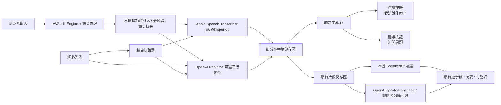

# macOS 會議助理即時逐字稿系統深度研究報告

## 執行摘要

在你給定的假設下——**目標 macOS 版本未指定、可假設 M1/M2 可用、網路條件未指定**——最穩健的結論不是單押某一個方案，而是採用**本機優先、雲端增強、可離線降級的混合式架構**。理由很直接：Apple 原生路徑與 WhisperKit 都能把**隱私、離線可用性、網路韌性、長期成本**控制得很好；OpenAI Realtime 則在**串流事件模型、雲端開發體驗、與後續 AI 功能整合**上很強，但雲端依賴與公開基準透明度仍是重要變數。Apple 最新 `SpeechAnalyzer` / `SpeechTranscriber` 明確支援**可變的部分結果**與**最終結果**、可回傳 `audioTimeRange`、模型透過 `AssetInventory` 下載且**不占用應用程式內記憶體空間**；WhisperKit 則提供 Apple Silicon 原生的裝置端管線、麥克風串流、本地 OpenAI 相容伺服器、SSE 串流、字詞/片段時間戳，以及新近加入的 `SpeakerKit` 做本地說話者分離。OpenAI `gpt-realtime-whisper` 官方則明確支援**差異更新事件**與**完成的最終事件**、可調整延遲/準確率權衡，但官方文件同時提醒：若你需要信心分數、時間戳或說話者分離，必須逐模型/逐端點驗證支援狀態並準備回退方案。citeturn39view0turn8view0turn9view0turn9view1turn36view2turn41view1turn17search4

如果你的第一優先是**產品可靠性與學生專案可做性**，我建議的主路徑是：**AVAudioEngine + Apple Voice Processing 做前處理 → 本機即時轉寫以 WhisperKit 或 Apple SpeechTranscriber 為主 → 將已定稿段落再送入 LLM 做摘要與建議 → 視使用者同意與網路狀態，選擇性把已定稿音訊段落送到 OpenAI 做高品質後處理或說話者分離**。這樣的分工能把即時字幕的核心能力放在本機，避免所有字幕都被網路品質綁架；雲端只承擔「增強」角色，而不是「單點失效」角色。Apple 的語音處理 API 本身提供回音消除、噪音抑制與自動增益控制，這一層不論你後端接 Apple、本地 Whisper、WhisperKit、或 OpenAI，都值得先做。citeturn6search0turn6search2turn39view0turn36view2turn8view0

從**公開可引用數據**看，英語仍是最容易的情境，而**台灣口音國語與 zh+en 語碼轉換**是你設計裡真正的風險區。WhisperKit 公開基準在 Apple M2 Pro 上，`whisper-large-v3-v20240930/turbo` 的平均 WER 約 **6.14**，`distil-large-v3` 約 **6.77**，`large-v3` 約 **7.63**；但這是英語基準，不等於台灣會議語音。對 zh-TW，ROCLING 2023 的 Whisper 微調研究在 Common Voice zh-TW 上報告：未微調 Hugging Face Whisper `medium` / `large-v2` CER 分別約 **13.4 / 12.7**，微調後都可降到 **8.9**；這更接近「台灣華語讀句」能力，而不是遠場會議音訊。對國語-英語語碼轉換，針對 Whisper-large-v3 的公開研究在三個資料集上的零樣本平均 MER 約 **33.52**，加提示詞可到 **21.67**，再加入語音脈絡內學習才更接近 **12.27**；這說明 **zh+en 混講是最不該用直覺估計的區域**。OpenAI 官方則明講 `gpt-4o-transcribe` 與 `gpt-4o-mini-transcribe` 在 FLEURS 與多個既有基準上 **WER 低於原始 Whisper**，而且在口音、噪音與不同語速下較穩健，但官方公開文字沒有給出可直接引用的 zh-TW 與 zh+en 分語言數字，因此在你的場景裡仍必須自己做實測而不能憑品牌決定。citeturn21search0turn30view0turn27view0turn32view0turn32view1

在**成本**上，OpenAI `gpt-realtime-whisper` 目前公開價格是 **US$0.017/分鐘**，即約 **US$1.02/小時**；`gpt-4o-transcribe` 約 **US$0.006/分鐘**，即 **US$0.36/小時**；`gpt-4o-mini-transcribe` 約 **US$0.003/分鐘**，即 **US$0.18/小時**。因此，若你把即時路徑放在 Realtime，而會後再跑一次高品質檔案轉錄，雲端成本大約是 **US$1.38/小時** 等級。對學生專案，**20 小時/月**大約是 **US$20.4 / 月** 的純即時成本，或 **US$27.6 / 月** 的即時 + 最終清理成本；對 **1000 小時/月** 等級產品則約是 **US$1,020 / 月** 或 **US$1,380 / 月**。相較之下，本機轉寫在你已擁有 M1/M2 Mac 的前提下，**邊際雲成本近乎為零**；真正的代價是整合複雜度、模型下載體驗、與裝置電池/熱設計。citeturn8view1turn35search0turn34search5turn34search7

最終建議可以濃縮成一句話：**不要把「即時字幕」與「最終高品質稿」當成同一條管線。** 即時路徑應追求低延遲、穩定的部分結果、使用者可立即閱讀；最終路徑才追求高品質段落切分、說話者標籤、較準確的標點與後續摘要。這樣你才能同時滿足會議助理最實際的三件事：看得到、跟得上、斷線也不死。citeturn39view0turn9view1turn42view0

## 比較基準與核心選項

下表先把你要求的幾個主要選項，用**實作層面**而不是行銷標籤來比較。

| 方案 | 即時部分結果 / 最終結果 | 時間戳 / 說話者分離 | macOS 整合性 | 本機資源與硬體 | 成本與隱私 | 核心判斷 |
|---|---|---|---|---|---|---|
| Apple 原生 `SpeechAnalyzer` / `SpeechTranscriber` | 有。WWDC 範例明確展示**可變**與**最終**結果；停止時需呼叫 finalize，避免重複與遺漏。 | 有 `audioTimeRange`；公開資料中**未見官方宣稱內建說話者分離**。 | 非常高。`SpeechAnalyzer.bestAvailableAudioFormat`、`AssetInventory`、`AsyncStream` 都是直接為平台整合設計。 | 模型下載到系統儲存；Apple 明說模型不增加應用程式下載體積，也不在應用程式記憶體空間內運作。 | 無每小時 API 費；裝置端隱私最佳。 | **若可鎖定較新 OS / 硬體，這是最平台原生、隱私最佳的選項之一。** 但 Apple 沒公開 WER/CER 表，透明度較弱。 citeturn39view0 |
| Apple 傳統 `SFSpeechRecognizer` | 有。`shouldReportPartialResults` 可回報部分結果。 | 可回傳轉寫結果；`addsPunctuation` 可要求加標點。公開資料未見內建說話者分離。 | 高，但較舊；需處理授權與裝置端能力檢查。 | 是否完全裝置端取決於 `supportsOnDeviceRecognition` 與 `requiresOnDeviceRecognition`。 | 可能依語言/裝置而異；官方舊文件仍提醒 Speech framework 常假設需要網路。 | **適合作為舊版/回退路徑**，不建議作為未來主架構核心。 citeturn40search0turn40search1turn40search2turn40search8turn40search20 |
| OpenAI Realtime `gpt-realtime-whisper` | 有。`conversation.item.input_audio_transcription.delta` 與 `completed` 事件是官方主流程。 | 官方即時文件明說：若需要信心分數、時間戳、說話者分離，必須逐模型/端點確認並準備回退方案。 | 中等。macOS 端自己負責音訊擷取、重採樣、WebSocket/WebRTC。 | 本機只需音訊緩衝區；模型算力在雲端。輸入建議 24 kHz 單聲道 PCM。 | **US$1.02/小時**；資料預設不作訓練，但濫用監測記錄預設可保留最長 30 天，企業可申請 ZDR / 修改版濫用監測。 | **很適合做雲端即時字幕 / AI 代理管線**，但不應在網路未知時作為唯一字幕引擎。 citeturn8view0turn9view0turn9view1turn8view1turn13view0turn13view1 |
| OpenAI 檔案轉錄 `gpt-4o-transcribe` / `gpt-4o-transcribe-diarize` | 不是即時優先；偏請求-回應 / 檔案工作流程。 | `gpt-4o-transcribe-diarize` 支援 `diarized_json` 與說話者片段；`whisper-1` 支援 `verbose_json` 與字詞/片段時間戳。 | 中等。較適合會後清理，而非主即時路徑。 | 雲端。 | `gpt-4o-transcribe` 約 **US$0.36/小時**；隱私控制同 API 資料政策。 | **很適合當「最終稿 / 會後清理 / 說話者標籤」路徑**，不適合作唯一即時路徑。 citeturn35search1turn34search2turn34search3turn34search4turn35search0 |
| `openai/whisper` 參考實作 | 不是天生串流；官方說 `transcribe()` 以 **30 秒滑動視窗**運作。 | Whisper 天生有時間戳 token；但官方 Python 參考實作不是以即時 UI 為主。 | 低到中。Python/FFmpeg 整合，在原生 macOS 應用程式中成本較高。 | 模型大小與記憶體開銷高；官方 README 列 `turbo` 約 809M 參數、約 6GB VRAM，`large` 約 10GB VRAM。 | 本機免費，隱私好。 | **更像基準與研究母體**，不建議直接當原生即時產品引擎。 citeturn36view1turn38view2 |
| WhisperKit | 有。支援檔案轉寫、麥克風串流、本地伺服器 SSE 串流；最新生態還有 `SpeakerKit` 本地說話者分離。 | 本地伺服器支援字詞 / 片段時間戳；`SpeakerKit` 可補說話者標記。 | 非常高。Swift 套件、Core ML、Apple Silicon 定向最佳化。 | 供應商論文指出 large-v3-turbo 可壓縮到 **0.6GB**，並以 Apple Neural Engine 為主要優化目標。 | 本機隱私好、邊際成本低。 | **若你想做真正的原生 macOS 應用程式，WhisperKit 是目前最務實的本機主力候選。** citeturn36view2turn41view0turn41view1turn41view4turn17search4turn42view0 |
| faster-whisper | 原生庫本身偏批次 / 片段轉寫；即時多依賴外部串流封裝。 | 支援 `word_timestamps=True` 與 VAD；說話者分離需配 WhisperX/其他方案。 | 中等偏低。Python 生態很成熟，但對原生 Swift 應用程式不如 WhisperKit。 | 在 macOS 上 **CTranslate2 Python wheels 不提供 GPU 執行**；也就是 Mac 上通常是 CPU 路徑。 | 本機免費，隱私好。 | **很適合伺服器或 Python 工具鏈；對原生 macOS 應用程式，它是好後備，不是最佳第一選擇。** citeturn36view0turn37view0turn37view1turn37view4turn36view3turn36view4 |
| 混合式 | 有，可把本機部分結果與雲端最終結果分離。 | 可用本機時間戳 + 雲端說話者分離最終稿，或反過來。 | 最複雜，但也最穩。 | 可依電量/熱/網路切換模型。 | 隱私、成本、準確度三者可調。 | **這是我對會議助理場景的推薦架構。** citeturn39view0turn9view1turn35search1turn17search4 |

有三個關鍵判斷值得單獨強調。第一，**Apple 原生路徑與 WhisperKit 是 macOS 應用程式的一級公民**；它們讓你的擷取、格式轉換、即時 UI、離線回退比較「順手」。第二，**OpenAI Realtime 的價值更多在雲端事件模型與後續代理能力，而不只是 ASR 本身**；如果你同時需要「我該說什麼？」「追問問題」「會議摘要」，雲端管線通常比較容易整合。第三，**faster-whisper 在 macOS 上的最大結構性限制是僅能使用 CPU**；這不是它模型不好，而是它在 Apple 平台的執行路徑天生沒有 WhisperKit 那麼對味。citeturn36view3turn36view4turn36view2turn8view0

## 技術能力與整合分析

從**音訊擷取與前處理**看，無論你最終把音訊送到 Apple、OpenAI、WhisperKit 或 faster-whisper，最值回票價的事情都是先把擷取層設計好。Apple 的語音處理 API 明確提供**回音消除、噪音抑制、自動增益控制**，而且可透過 `AVAudioEngine` 的語音處理模式或 `AUVoiceProcessingIO` 取得。對會議助理來說，這一層直接決定遠端喇叭回音、機械鍵盤、風扇噪音與近講/遠講的可用度；它不只是「音訊優化」，而是後端模型成本與錯字率的前置放大器。citeturn6search0turn6search2turn6search3

從**格式與取樣率**看，Apple 最新 `SpeechTranscriber` 不要求你猜格式，而是由 `SpeechAnalyzer.bestAvailableAudioFormat(compatibleWith:)` 告訴你最佳目標格式；WWDC 範例也明說實作上要把不同來源的音訊先轉成這個格式再餵進分析器。OpenAI Realtime 官方則明確建議，若用 `audio/pcm`，就送 **24 kHz 單聲道 PCM**。Whisper 官方參考實作則會把輸入重採樣到 **16 kHz**。WhisperKit 對檔案輸入支援 `wav/mp3/m4a/flac`，如果做麥克風串流則由你的應用程式自己負責 PCM 緩衝區管線。這意味著：**擷取層必須內建重採樣器 / 格式轉接器**，這不該留給各後端各自處理。citeturn39view0turn8view0turn29view0turn41view2

從**部分結果與最終結果合併邏輯**看，Apple 與 OpenAI 兩邊都已經把「UI 不可直接把所有部分結果當真」寫進官方範例/文件。Apple 的做法是同時維護 `volatileTranscript` 與 `finalizedTranscript`，一旦最終結果來了就清掉可變內容，否則會產生重複。OpenAI 的做法是以 `item_id` 追蹤發話輪次，因為不同語音輪次的完成事件排序不保證。你的資料模型因此不應該是「單一字串」，而應該是**以片段為中心、有版本、帶狀態機**：每段至少有 `segmentId / source / state(partial|final) / startTime / endTime / revision`。這樣才能正確做部分結果替換、回溯修正與跨後端調和。citeturn39view0turn9view0turn9view1

從**時間戳與說話者標籤**看，三條路差異很大。Apple 最新 API 可以從屬性字串的 run 讀到 `audioTimeRange`，很適合做逐段同步高亮，但公開資料裡沒有看到 Apple 內建說話者分離的官方說明。OpenAI 即時轉錄文件則沒有把時間戳/說話者分離當成保證能力，反而明說你必須驗證支援與準備回退方案。OpenAI 檔案轉錄端則把功能切得很清楚：`whisper-1` 可走 `verbose_json` 和 `timestamp_granularities` 拿字詞/片段時間戳；`gpt-4o-transcribe-diarize` 可回 `diarized_json` 與說話者片段。WhisperKit 的本地伺服器支援字詞 / 片段時間戳，而 `SpeakerKit` 則提供本地說話者分離。若你的產品真的要在即時畫面上可靠地顯示「說話者 A/B」，**不要把整件事綁在單一即時 ASR 模型身上**；分成即時字幕與發話後 / 會後說話者分離會穩得多。citeturn39view0turn9view1turn34search2turn34search3turn34search4turn35search3turn35search11turn41view4turn17search4

從**macOS 整合難度**看，Apple 原生與 WhisperKit 幾乎是兩個最合理的第一選擇。Apple 原生需要麥克風/語音權限與模型資產管理；Apple 的教學與搜尋結果都指向你要設定 `NSMicrophoneUsageDescription` 與 `NSSpeechRecognitionUsageDescription`。WhisperKit 則直接以 Swift Package 方式加入，對原生 macOS 應用程式很友善，甚至還提供本地 OpenAI 相容伺服器讓你沿用既有 SDK。相對地，faster-whisper 雖然成熟，但它更像是適合 Python / 工具鏈 / 後端的方案；如果你的主體是 SwiftUI/AppKit 應用程式，維護 Python 執行環境、打包、沙盒、更新與崩潰面都會比較複雜。citeturn5search0turn5search3turn36view2turn41view0turn36view3

以下放三段**代表性整合範例**。它們刻意寫成「接近可用的虛擬程式碼」，目的是幫你定義介面，而不是逐字貼上就能編譯。Apple 路徑的關鍵是 `AsyncStream`、`bestAvailableAudioFormat`、`volatile`/`final`；OpenAI 路徑的關鍵是 **24k PCM、delta/completed 事件**；WhisperKit 路徑的關鍵是 **本地模型初始化 + 串流 / 本地伺服器**。相關欄位與事件名稱都對應官方文件與 README。citeturn39view0turn8view0turn9view0turn36view2turn41view1

```swift
// Apple SpeechAnalyzer / SpeechTranscriber 虛擬 Swift
import Speech
import AVFAudio

final class AppleLiveTranscriber {
    private let engine = AVAudioEngine()
    private var analyzer: SpeechAnalyzer?
    private var transcriber: SpeechTranscriber?
    private var inputContinuation: AsyncStream<AnalyzerInput>.Continuation?

    func start() async throws {
        let t = SpeechTranscriber(
            locale: Locale(identifier: "zh-TW"),
            transcriptionOptions: [],
            reportingOptions: [.volatileResults],
            attributeOptions: [.audioTimeRange]
        )
        let a = SpeechAnalyzer(modules: [t])
        let targetFormat = await SpeechAnalyzer.bestAvailableAudioFormat(compatibleWith: [t])

        // 在這裡用 AssetInventory 確認模型可用...

        let (stream, continuation) = AsyncStream<AnalyzerInput>.makeStream()
        self.transcriber = t
        self.analyzer = a
        self.inputContinuation = continuation

        try await a.start(inputSequence: stream)

        let input = engine.inputNode
        let sourceFormat = input.outputFormat(forBus: 0)

        input.installTap(onBus: 0, bufferSize: 1024, format: sourceFormat) { buffer, _ in
            if let converted = convert(buffer, from: sourceFormat, to: targetFormat) {
                continuation.yield(.audioBuffer(converted))
            }
        }

        try engine.start()

        Task {
            for try await result in t.results {
                if result.isFinal {
                    commitFinal(result.text, timeRangesFrom: result.text)
                } else {
                    updateVolatile(result.text)
                }
            }
        }
    }

    func stop() async throws {
        engine.stop()
        inputContinuation?.finish()
        try await analyzer?.finalizeAndFinish(through: nil)
    }
}
```

```swift
// OpenAI Realtime 虛擬 Swift
// PCM16 單聲道 24kHz -> base64 -> input_audio_buffer.append

func openRealtimeSession() async throws {
    let ws = try await RealtimeWebSocket.connect(url: realtimeURL, apiKey: apiKey)

    try await ws.sendJSON([
        "type": "session.update",
        "session": [
            "type": "transcription",
            "audio": [
                "input": [
                    "format": ["type": "audio/pcm", "rate": 24000],
                    "transcription": [
                        "model": "gpt-realtime-whisper",
                        "language": "zh"
                    ]
                ]
            ]
        ]
    ])

    Task {
        for try await event in ws.events {
            switch event.type {
            case "conversation.item.input_audio_transcription.delta":
                renderPartial(itemID: event.item_id, delta: event.delta)
            case "conversation.item.input_audio_transcription.completed":
                commitFinal(itemID: event.item_id, text: event.transcript)
            default:
                break
            }
        }
    }
}

func sendPcmChunk(_ pcm16Mono24k: Data, ws: RealtimeWebSocket) async throws {
    try await ws.sendJSON([
        "type": "input_audio_buffer.append",
        "audio": pcm16Mono24k.base64EncodedString()
    ])
}
```

```swift
// WhisperKit 虛擬 Swift
import WhisperKit

final class LocalWhisperKitBackend {
    private var pipe: WhisperKit?

    func prepare() async throws {
        // 優先採用多語準確率較好的模型
        pipe = try await WhisperKit(
            WhisperKitConfig(model: "large-v3-v20240930_626MB")
        )
    }

    func transcribeFile(_ path: String) async throws -> String {
        guard let pipe else { throw BackendError.notReady }
        return try await pipe.transcribe(audioPath: path)?.text ?? ""
    }

    // 若要做即時模式，可直接用麥克風串流或啟本地 OpenAI 相容伺服器
}
```

## 準確率、延遲與成本

先說最重要的研究結論：**你不能把不同資料集、不同指標、不同任務型態的數字直接橫向比較。** 這份報告能給你的，是「公開可引用的上限與風險輪廓」，而不是保證某模型在你的會議資料上一定會是某個數字。對英語，WhisperKit 公開 Apple Silicon 基準顯示強勢表現；對 zh-TW，最接近的公開數字是 Common Voice zh-TW 這類讀句資料；對 zh+en 語碼轉換，公開數字顯示難度遠高於單語。OpenAI 官方也只公開「比原始 Whisper 更低 WER」的方向性結果，而沒有放出可直接引用的 zh-TW / zh+en 細部數字。citeturn21search0turn30view0turn27view0turn32view0

下面這張表列的是**最有用、也最能避免誤解的公開數字**。

| 面向 | 可引用數字 | 解讀方式 |
|---|---|---|
| 英語，本機 WhisperKit on Apple Silicon | Apple M2 Pro 上，`whisper-large-v3-v20240930/turbo` 平均 WER 約 **6.14**；`distil-large-v3` 約 **6.77**；`large-v3` 約 **7.63**。同批數據中，`base` / `small` 更快但準確度較差。 | 代表「英語基準上，本機 large-v3-turbo 類路線是可打的」，也說明 **turbo 常是即時產品的甜蜜點**。citeturn21search0 |
| zh-TW 讀句，Whisper 微調 | Common Voice zh-TW 上，Hugging Face Whisper `medium` / `large-v2` 未微調 CER 約 **13.4 / 12.7**；微調後都降到 **8.9**。 | 這是**台灣華語讀句代理指標**，不是遠場會議。它說明台灣華語值得做語系、正規化與領域調適。citeturn30view0 |
| 台語 / 混合正字法風險 | Common Voice `nan-tw` 微調後 CER 約 **50.9–52.8**；台語連續劇最佳 CER 約 **50.7**。 | 如果你的產品未來想碰 Taigi 或台語混入，風險明顯比 zh-TW 國語高很多。citeturn30view0turn29view0 |
| 國語-英語語碼轉換 | Whisper-large-v3 在三個公開語碼轉換資料集上的零樣本平均 MER 約 **33.52**；加入提示詞約 **21.67**；再加 SICL 約 **12.27**。 | **zh+en 是最困難模式。** 單靠現成零樣本模型，會議實務中通常不應樂觀估計。citeturn27view0 |
| OpenAI 新一代轉錄 | OpenAI 官方明示 `gpt-4o-transcribe` / `gpt-4o-mini-transcribe` 在 FLEURS 與多個既有基準上 WER 低於原始 Whisper，且在口音 / 噪音 / 語速場景較穩。 | 方向正面，但**公開文字沒有你需要的 zh-TW/zh+en 具體數字**。對你的應用程式，仍須自建評估集。citeturn32view0turn32view1 |

對**延遲**，有些數字能直接用，有些得誠實標成工程推估。WhisperKit/Apple Silicon 這邊，M2 Pro 上 `large-v3-v20240930/turbo` 的速度約 **12.81–12.85 倍即時**，換句話說，**1 秒音訊的純計算時間約 78ms 左右**；`distil-large-v3/turbo` 約 **15.88 倍**，更快；`large-v3` 只有約 **3.01 倍**，即 1 秒音訊要約 **332ms** 的純計算時間。這說明在 M2 級硬體上，**即時 UX 的主要瓶頸通常不再是模型算力，而是分塊大小、VAD、部分結果穩定度與 UI 修訂策略**。相反地，若你選到完整 `large-v3` 而非 turbo / 蒸餾路線，即時 UX 就會明顯吃緊。citeturn21search0

對 OpenAI Realtime，官方能給你的保證是：`gpt-realtime-whisper` 是**最低延遲的串流轉寫路徑**，而且你可以用 `minimal / low / medium / high / xhigh` 調整延遲/準確率；但官方同時明說**不要假設固定毫秒數**，必須以代表性資料實測。這代表在產品規格上，你應該把雲端即時延遲寫成**服務等級目標（SLO）**而不是外部承諾，例如：`first partial target <= 500ms in good network`、`turn final target <= 1.5s after pause`，並把它們當自己的驗收標準。WhisperKit 論文也提供一個有價值的外部參考：其作者在 M3 Max 上報告平均假設延遲約 **0.45 秒**，確認文字延遲約 **1.7 秒**，但那份比較使用的是 `gpt-4o-transcribe` 等雲端 API、而非你問題裡的 `gpt-realtime-whisper`，因此只能當「雲端確認文字常落在秒級」的旁證，而不是 Realtime 官方數字。citeturn8view0turn9view1turn42view0

對 **faster-whisper**，要特別小心平台差異。它官方 README 的基準很漂亮，但多數是 NVIDIA GPU 或 Intel CPU；`CTranslate2` 官方安裝頁清楚寫到 Python wheels 的 **GPU 支援只在 Linux / Windows**，macOS wheels 不在其列。這表示你在 Mac 上跑 faster-whisper，通常是走 CPU / Apple Accelerate 路。因此，faster-whisper 在 macOS 上仍然能用，尤其適合批次、命令列工具、或本地伺服器，但若你要做一個長時間常駐、重視電池與 UI 反應的原生會議助理，**WhisperKit 通常比 faster-whisper 更自然**。citeturn36view0turn36view3turn36view4

對**成本**，你可以很快地把架構決策量化。`gpt-realtime-whisper` 約 **US$1.02/小時**；`gpt-4o-transcribe` 約 **US$0.36/小時**；`gpt-4o-mini-transcribe` 約 **US$0.18/小時**。因此：  
若是 **學生專案**，假設每月 20 小時會議轉寫，純即時的 OpenAI 成本約 **US$20.4/月**；若再加一條會後高品質最終處理，約 **US$27.6/月**。  
若是**正式產品**，假設每月 1000 小時，純即時約 **US$1,020/月**；即時 + 最終處理約 **US$1,380/月**。  
如果你的字幕即時路徑改成本機，雲端就只剩摘要、行動項目、追問建議與選配清理，成本通常會掉到比較舒服的區間。citeturn8view1turn35search0

## 隱私、合規與穩健性

在**隱私與法遵**上，這類產品最大的風險不是模型，而是**你是否把「錄音」與「個資處理」視為第一等公民功能**。台灣的 PDPA / PDPC 公開資料明確指出，PDPA 的目的在於規範個人資料的蒐集、處理與利用，以避免人格權受侵害；音訊中若能識別自然人，通常就會落入個資處理範圍。歐盟 GDPR 則對個資處理的合法性、目的限制、資料最小化、資訊告知、保留期限與資料主體權利提出更高要求，且對可唯一識別個人的生物特徵資料有更敏感的規範。美國則不是單一法，而是聯邦與各州錄音同意規則並存；可靠來源整理普遍指出，多數州是單方同意，但也有不少州要求全體同意 / 雙方同意，且是否屬於有合理隱私期待的情境會影響判斷。對跨境視訊會議產品，**最安全的產品策略永遠是顯示錄音/轉寫狀態並取得明示同意，而不是賭司法管轄細節**。citeturn43search3turn43search15turn43search7turn43search10turn43search5turn43search17

OpenAI API 的資料政策目前也相當關鍵。官方明示，自 2023-03-01 起，送進 OpenAI API 的資料**預設不會用來訓練模型**，除非你主動選擇加入；但同時，平台預設的濫用監測記錄可能保留**最多 30 天**。合規要求更高的客戶可申請 **Zero Data Retention** 或 **Modified Abuse Monitoring**。官方還說明，資料在傳輸中使用 TLS 1.2+、靜態 AES-256，加上可簽訂 DPA 以支援 GDPR 與其他隱私法遵。這代表：如果你的應用程式可能進入學校、企業、醫療、法律、或台歐混合資料流場景，**不要只問「OpenAI 會不會拿去訓練」；要問的是保存期限、區域處理、DPA、與使用者是否真的同意把會議內容送雲端**。citeturn13view0turn13view1turn14search0

從**韌性設計**看，最好的策略是把即時系統拆成三層：**擷取層、本機逐字稿層、雲端增強層**。擷取層永遠本機持有環形緩衝區；本機逐字稿層永遠可獨立工作；雲端增強層只讀取「已穩定段落」或「可重送片段」。當網路抖動時，不應讓畫面上的字幕整段消失；相反地，應保持本機結果繼續跑，並把雲端狀態降級成「增強暫停」。OpenAI 官方也明確提醒：UI 必須決定如何修訂部分文字，以及如何用 `item_id` 對齊最終逐字稿；Apple 官方範例也明說若不清掉可變內容會重複。你的衝突解決可以採用這套簡單規則：**本機部分結果是即時真相，本機最終結果是顯示真相，雲端最終結果是歸檔真相**；只有在片段關閉後，才允許雲端最終稿替換本地展示稿。citeturn9view1turn39view0

對**UI/UX**，即時字幕不該只是把字往上堆。Apple 在官方展示裡用較低透明度呈現可變內容，再由已定稿內容取代，這就是很好的預設。我的建議是：  
畫面上只顯示**當前穩定前綴 + 一段不穩定尾巴**；  
時間戳預設只釘在已定稿段落，不要對每個部分結果刷新時戳；  
說話者標籤若來自發話後說話者分離，就先顯示「未標註」或暫時群組，不要假裝即時結果一定正確；  
「我該說什麼？」與「追問問題」應該綁定已定稿的發話輪次，而不是逐 token 重算。  
一個務實的延遲預算是：**字幕首次部分結果目標 300–500ms；發話最終結果目標 0.8–1.5s；AI 建議卡目標 1.5–3s**。其中 AI 建議最好只吃已定稿內容或高穩定度部分結果，否則使用者會看到建議內容跟著字幕來回改，認知成本非常高。這些預算是工程建議，不是供應商 SLA。官方可支撐的部分是：Apple / OpenAI 都已經把部分結果修訂問題明示為產品方必須自行設計處理。citeturn39view0turn9view1

## 推薦架構、優先實作步驟與測試計畫

在你的使用情境裡，我的**推薦方案**是：

**核心設計**：  
**本機即時字幕** 以 `WhisperKit` 或 Apple `SpeechTranscriber` 擔任主後端；  
**Apple 語音處理** 做擷取前處理；  
**OpenAI** 不拿來當唯一即時 ASR，而拿來做兩件事：  
其一，網路良好且使用者同意時，做雲端平行增強；  
其二，會後或發話輪次層級用 `gpt-4o-transcribe` / `gpt-4o-transcribe-diarize` 做高品質清理、說話者標記、與後續摘要。  
若你必須支援較舊 OS 或 Apple 新 API 不可用，再退到 `SFSpeechRecognizer` 或純本機 WhisperKit。這樣的排序同時尊重了 **macOS 整合性、zh-TW/zh+en 風險、網路不確定性、與長期成本**。citeturn39view0turn36view2turn8view0turn35search1



對**執行路由**，建議你一開始就把後端抽象成協定，而不是先綁死某個 SDK。決策邏輯可以很簡單：  
若 `privacyMode == strict` 或 `network == poor`，強制本機；  
若 `languageHint in {zh-TW, en, mixed}` 且本機模型已就緒，先跑本機；  
若 `network == good && userConsentedCloud == true`，把已定稿段落鏡像到雲端做清理；  
若 `deviceThermalState` 高或電池低，從 `large-v3-turbo` 降到較小模型；  
若 `codeSwitchProbability` 高，增加發話最終結果的等待窗口，避免過早提交。  
這套邏輯的價值不在「花俏」，而在於讓你的產品不會在錯誤的時間做錯誤的事。citeturn8view0turn9view1turn21search0turn27view0

下面是一段簡化後的**執行期編排虛擬程式碼**：

```swift
func chooseBackend(ctx: Context) -> RoutingDecision {
    if ctx.privacyMode == .strict || ctx.network.quality == .poor {
        return .localOnly(primary: .whisperKitOrApple)
    }

    if ctx.osSupportsAppleSpeech && ctx.localeSupportedByApple {
        if ctx.needsLowestFrictionNativeIntegration {
            return .localOnly(primary: .appleSpeech)
        }
    }

    if ctx.userConsentedCloud && ctx.network.rttMs < 150 {
        return .hybrid(
            live: .localWhisperKit,
            cloudEnhancement: .openAIRealtimeOptional,
            finalCleanup: .openAITranscribeDiarize
        )
    }

    return .localOnly(primary: .whisperKit)
}
```

**優先實作步驟**我建議按這個順序走。  
先做 **音訊層**：`AVAudioEngine` 擷取、語音處理、重採樣、環形緩衝區、片段 id。  
再做 **單一本機後端**：我建議先上 WhisperKit，因為你最容易拿到可測的即時路徑與本地伺服器；若你鎖新 OS，可同步做 Apple `SpeechTranscriber` 轉接器。  
第三步才做 **逐字稿狀態機**：部分/最終、穩定前綴、修訂版。  
第四步做 **UI**：可變 / 最終結果差異化、時間戳、段落滾動。  
第五步再做 **OpenAI 增強**：先接會後定稿，再看即時平行路徑是否必要。  
最後才接 **AI 建議** 與 **摘要**。這個順序的關鍵，是不要把「LLM 魔法」放在「字幕可用」之前。citeturn39view0turn36view2turn8view0

**測試計畫**至少要分成準確率、延遲、穩健性三組。  
準確率：英語用 LibriSpeech / Earnings22；台灣華語用 Common Voice zh-TW 外加你自行錄製的台灣口音會議音；語碼轉換用 SEAME、NTUML2021、ASCEND、CSZS-correct；如果做多輪對話摘要，再加你自己的會議實錄集。  
延遲：量 `capture -> first partial`、`capture -> stable partial`、`pause -> final`、`AI suggestion ready`。  
穩健性：量離線切換成功率、WebSocket 重連成功率、部分結果修正次數、空白/截斷逐字稿、長會議記憶體成長。OpenAI 官方產品檢查清單還特別提醒要把數字、日期、貨幣、產品名稱、領域詞彙放進評估集，並分開追蹤空白 / 截斷 / 延遲逐字稿，而不是只看 WER。citeturn9view1turn42view0turn27view0turn30view0

若是**學生專案規模**，我會把樣本量設成：  
**英文 2 小時、zh-TW 2 小時、zh+en 語碼轉換 2 小時、噪音與遠講 2 小時**，合計至少 **8 小時** 的帶標註資料；  
其中至少要包含：單人近講、雙人輪流、三到五人會議、筆電喇叭外放回音、咖啡店噪音、弱網路模擬、30 分鐘以上長會議。  
若是**正式產品上線前**，我會把代表性錄音擴到 **20–30 小時以上**，而且要做 1–2 小時的長工作階段浸泡測試，看記憶體、發熱、部分結果修正漂移與重新連線行為。這些是會議助理真正會踩到的坑，比漂亮的單句基準更重要。citeturn9view1turn42view0

最後，這份研究也有三個**你應明確知道的限制**。  
第一，Apple 目前公開資料對 SpeechTranscriber 的**公開 WER/CER 透明度不足**；它看起來產品化程度高，但你不能只靠品牌名判斷準確率。  
第二，OpenAI 對語音模型公開的是**方向性優勢**與事件介面，而非你最需要的 **zh-TW / zh+en 細部基準**。  
第三，我沒有在這份報告中給出一個可嚴格辯護的**本機每小時能耗數字**，因為我收集到的第一手或官方文件更集中在模型延遲、大小與平台能力，而不是可直接引用的 Wh / 小時結果。若你之後要做產品化決策，能耗應由你自己的 `powermetrics` / Instruments / 電池耗電 A/B 測試測出。citeturn39view0turn32view0turn42view0

綜合以上，我對你的 macOS 會議助理的明確建議是：**以 WhisperKit 或 Apple SpeechTranscriber 做本機即時逐字稿主引擎；以 Apple 語音處理改善輸入；以 OpenAI 作為可選的雲端增強與會後清理；用帶片段版本的逐字稿儲存區解決部分/最終結果與衝突合併；把評估資源集中在 zh-TW 與 zh+en 語碼轉換，而不是只看英文。** 這是目前在工程可行性、產品體驗、成本、與隱私之間，最平衡也最不脆弱的做法。citeturn36view2turn39view0turn8view0turn27view0turn30view0turn6search0
