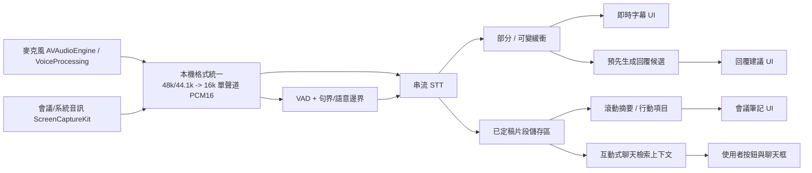
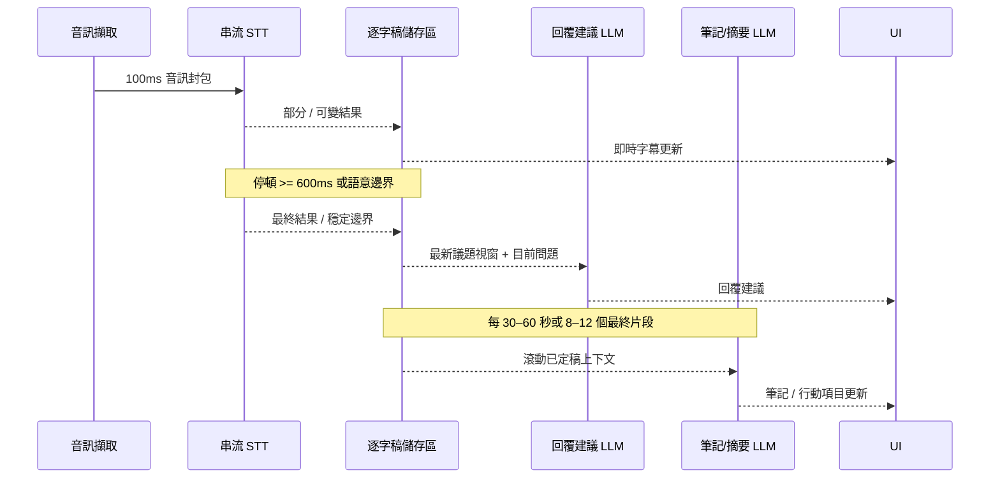

# macOS 會議助理的音訊分塊與即時處理策略研究報告

## 執行摘要

對於 macOS 會議助理這類產品，最穩健的初始架構不是「把音訊每隔固定幾秒丟進 AI」，而是把系統拆成三層：第一層用 macOS 原生音訊管線擷取麥克風與會議音訊；第二層用串流 STT 持續產生**部分 / 可變**與**已定稿**逐字稿；第三層再以「穩定文字事件」而不是原始音訊事件，驅動回覆建議、會議筆記、行動項目與互動式聊天。Apple 在最新 SpeechAnalyzer / SpeechTranscriber 設計裡就明確區分了可即時顯示但會改動的可變結果與最終結果，並提供定稿流程；AWS、Google、Azure、Deepgram 也都在官方文件中區分暫時/部分與最終事件。這個分層能把低延遲需求與高準確需求解耦，是本題最重要的架構結論。citeturn38view0turn9view0turn26view0turn9view1turn27search7

如果只回答「多久送一次 AI」：**送往 STT 的音訊封包**建議維持在約 **100 ms** 左右，並控制在 **50–200 ms** 的範圍內；AWS 官方明確建議 PCM 串流分塊設為 50–200 ms，Google 也警告過大或過於爆量的分塊會降低 VAD 逾時的準確性，而串流辨識本身只支援 gRPC。**送往 LLM 的上下文更新**則不應跟音訊封包同頻，而應採**混合觸發**：在偵測到穩定子句/句子邊界時立即更新，若對方長時間連續發言則以 **6–10 秒心跳更新**補齊；**會議筆記 / 行動項目**則以 **30–60 秒** 或 **8–12 個已定稿發話**為一輪更新。對回覆建議而言，30 秒更新幾乎一定過慢；對筆記整理而言，30–60 秒通常可接受。citeturn32view0turn12view2turn9view5turn23search0turn23search1

VAD 的選型上，若你要一個可今天就上線、CPU 成本低、效果又比傳統門檻法穩定很多的方案，**Silero VAD** 是最好的預設值；如果你極度在意依賴少、原生 C/C++ 易整合，**WebRTC VAD** 仍是極佳的回退方案。近期一篇比較 WebRTC、Silero 與 RMS 的研究指出，Silero 在該測試集上明顯優於 WebRTC，而遲滯機制對 WebRTC 有幫助、對 Silero 幫助不大；Silero 官方實作本身也提供 threshold、min_silence_duration_ms、speech_pad_ms 等可直接拿來調參的欄位。若你需要高品質重疊語音處理、較強的近即時說話者分離 / 分段，pyannote 更強，但它更重，不適合作為最前線低延遲閘門。citeturn22view1turn20search10turn20search1turn6search1turn21search4turn21academia20

若產品目標包含「當下能看、之後要準」，最佳策略不是在所有功能上追求同一種延遲，而是做**雙軌輸出**：**顯示層**依賴部分/可變逐字稿，讓 UI 快速更新；**儲存層與筆記層**只在最終結果或高穩定度條件成立時提交。這點也符合多家 STT 官方介面：Google 會在暫時結果提供 `stability`，AWS 會提供 `IsPartial` 與每詞 `Stable` 標記，Azure 的 `Recognizing` 只給文字估計與偏移/時長，而 `Recognized` 才是完成發話後的最終結果；Deepgram 則把 `is_final` 與 `speech_final` 分開。你的資料結構必須原生支援「同一時間軸片段被修訂」這件事。citeturn26view0turn15view1turn9view1turn27search1turn27search3

在 macOS 上，建議把 **麥克風** 與 **系統/會議音訊** 儘量分流擷取：麥克風可用 AVAudioEngine 輸入擷取點，若涉及喇叭回授與語音通話場景，Apple 的語音處理 API 內建回音消除、噪音抑制、自動增益控制；系統/會議音訊則可用 ScreenCaptureKit 擷取，官方文件與 WWDC 內容指出其可提供高品質低 CPU 負擔的螢幕/音訊擷取，支援設定音訊取樣率與聲道數，並可達 48 kHz 立體聲。若支援 macOS 15 以上，ScreenCaptureKit 也有 `captureMicrophone` 屬性可用。對外傳輸前，再在本機降混 / 重採樣成 16 kHz 或 24 kHz 單聲道 PCM16 給雲端 STT，或直接餵給 Apple SpeechAnalyzer / 本機 Whisper 管線。citeturn37view0turn34view0turn35search0turn35search11turn35search13turn29search14

## 延遲目標與設計原則

人類對話的換手極快。跨語言會話研究顯示，發話轉換的平均間隔大約在 **200 ms** 左右，而較一般性的綜述也指出日常會話的中位延遲常低於 **300 ms**。這意味著，如果你的系統是在對方完全講完後，才把最後一大段文字送進 LLM、再等模型生成建議，那麼多半趕不上使用者要回話的時機。對會議助理而言，真正可行的做法是：**在對方說話期間，就用部分逐字稿預先滾動生成候選建議；在句界或端點出現時，只做輕量重新排序、補完與 UI 更新。** 這個原則比任何單一分塊大小更重要。citeturn23search0turn23search1turn23search14turn27search7turn38view0

因此，建議將產品延遲目標拆成四個不同服務等級。**即時字幕**以「越早越好」為主，部分結果更新應以數百毫秒級的節奏持續滾動；**回覆建議**若是主動畫面上的「可能怎麼回」，應該在穩定語意邊界後 **500–1000 ms** 內完成第一次可用更新，最好在對方仍在發話時就預先計算；**按鈕式請求**例如「我該說什麼？」可接受稍慢，但仍應盡量壓在 **1–2.5 秒** 內；**筆記 / 行動項目**可接受較高延遲，通常 **15–60 秒** 都在合理範圍，會議結束後再做一次高品質整合即可。前兩者是對話關鍵路徑，後兩者不是。前者應以部分結果 + 穩定邊界為主，後者應以已定稿逐字稿為主。這些時間目標不是某一家 API 的硬規格，而是根據人類發話輪替、STT 暫時/最終行為與會議助理使用情境推導出的工程目標。citeturn23search0turn23search1turn9view0turn26view0turn9view1turn27search1

下圖是最建議的整體資料流：把音訊擷取、串流辨識、逐字稿狀態管理、建議生成與摘要生成分開，讓每層可以各自做不同頻率的更新與不同品質等級的提交。這個分層同時符合 Apple 新 SpeechAnalyzer 的結果模型、雲端 STT 的暫時/最終模型，以及 Whisper-Streaming 這類本機串流轉寫實作對「已確認/未確認」的分離。citeturn38view0turn17view1turn27search7turn26view0



## 分塊策略比較

如果把「分塊」拆開看，實際上有三種不同層級：**傳輸分塊**、**辨識分塊**、**語意分塊**。傳輸分塊是你多久送一次音訊封包；辨識分塊是 STT 何時產生部分結果 / 最終結果；語意分塊才是你何時把上下文送進 LLM。工程上最常犯的錯是把三者綁成同一個節奏。AWS 官方建議 PCM 音訊以 50–200 ms 分塊傳送；Google 串流辨識限定 gRPC，並警告若音訊分塊太大或送得過快會使語音活動逾時的測量不準；Deepgram 與 AWS 也都把終點偵測建立在停頓 / VAD / 字詞時間之上，而不是要求你每 5 秒切一次句。這些都指向同一結論：**對 STT，先維持小而均勻的傳輸分塊；對 LLM，再用較高層的文字事件節流。** citeturn32view0turn12view2turn9view5turn9view2turn9view0

| 策略 | 典型觸發 | 優點 | 缺點 | 結論 | 主要依據 |
|---|---|---|---|---|---|
| 固定 5 秒 | 每累積 5 秒文字或音訊就送 LLM | 實作簡單；長談話不會餓死 UI | 常在詞中切斷；語意邊界差；token 與重算成本偏高 | 可作回退心跳，但不應是唯一策略 | AWS 建議傳輸分塊小而均勻；Whisper-Streaming 指出不看內容的分段會造成邊界品質差。 citeturn32view0turn17view1 |
| 固定 10 秒 | 每 10 秒送一次 | 更省 token / API 成本 | 對回覆建議通常偏慢；討論主題常已換檔 | 不適合即時回覆建議，可用於低頻摘要 | 人類發話間隔極短；STT 暫時/最終結果支援更細粒度邊界。 citeturn23search0turn26view0turn9view0 |
| 固定 30 秒 | 每 30 秒送一次 | 成本最低 | 幾乎不適合對話建議；只適合粗摘要 | 不建議用於回覆建議 | Whisper-Streaming 明指先錄長段再處理會導致高延遲與差的片段邊界。 citeturn17view1 |
| 句子邊界 | 標點 + 穩定文字 + 短停頓 | 跟語意最對齊；最適合建議/問答 | 依賴 STT 標點與穩定度；長句會拖延 | 最適合 LLM 更新，但要有心跳補充 | Semantic VAD 以標點/語意輔助端點判定，可顯著降延遲；多家 STT 都提供暫時/最終結果與時間偏移。 citeturn24view0turn26view0turn9view1turn15view1 |
| 純 VAD 端點 | 靜音間隔達閾值即送 | 速度快；不需等待完整句號 | 可能切到半句；噪音場景易誤判 | 適合觸發「可能講完了」，不適合直接當最終語意塊 | Deepgram 端點判定完全依賴音訊 VAD；噪音環境會失靈。 citeturn11view1turn9view2 |
| 混合式 | 句界優先；若無句界則 6–10 秒心跳；按 `utterance_end` / `speech_final` 立即刷新 | 延遲、品質、成本三者最均衡 | 實作較複雜 | **最推薦的產品策略** | 綜合 Apple 可變/最終、AWS/Google/Deepgram 邊界訊號與人類發話輪替特性。 citeturn38view0turn15view1turn26view0turn11view0turn23search1 |

就本題的核心問題——**要多久把內容送進 AI**——我的建議是：

第一，**送進 STT 的音訊**：維持 **100 ms** 左右的小封包，並保持均勻節奏；這落在 AWS 官方建議的 50–200 ms 內，也能避免 Google 所警告的大分塊對逾時/端點判定精度的傷害。第二，**送進回覆建議 LLM 的文字**：不是每 100 ms 送，而是在**穩定子句/句子邊界**立即送一次；若對方持續長篇發言、遲遲沒有句界，則用 **6–10 秒心跳更新**一次。第三，**送進筆記 / 行動項目 LLM 的文字**：以 **30–60 秒** 或 **8–12 個已定稿段落**做增量摘要。第四，**使用者按下「我該說什麼？」** 時，不要只送最後一句，而是送**最近 1–3 分鐘已定稿逐字稿 + 目前未完成問題的部分逐字稿 + 滾動摘要 + 已決議事項 / 開放問題**。這樣既能保住語境，也不會把整場會議原文重送給模型。citeturn32view0turn12view2turn9view0turn11view0turn38view0

## VAD 與語意邊界

在 VAD 上，主流工程觀點仍然是「用聲學 VAD 決定開始/停止」，代表性方案是 WebRTC VAD 與各雲端 STT 的內建端點判定。這條路徑的優勢是成熟、快、工程成本低。WebRTC VAD 的硬限制非常清楚：只接受 16-bit 單聲道 PCM，支援 8/16/32/48 kHz，影格必須是 10/20/30 ms，並提供 0–3 的侵略度模式；WebRTC 原始碼也明確顯示它有針對不同影格長度與模式的不同門檻。這代表它非常適合做前線閘門，但不擅長理解語意是否「說完」。citeturn6search1turn6search11

較新的主流替代方案是 **Silero VAD**。它仍舊夠輕量，但比 WebRTC 更接近現代神經式 VAD：官方 repo 宣稱一個 30+ ms 分塊在單一 CPU 執行緒上小於 1 ms 即可處理，模型很小，支援 8k/16k，並直接暴露 `threshold`、`min_speech_duration_ms`、`min_silence_duration_ms`、`speech_pad_ms` 等參數。2026 年一篇針對真實數位音訊流的比較實驗指出，在其測試集上 Silero 顯著優於 WebRTC，而對 WebRTC 加上遲滯機制有小幅好處，對 Silero 則幾乎沒顯著收益。這個結果雖然來自小型資料集，不能視為放諸四海皆準，但足以支持「Silero 作為預設，WebRTC 作為回退」的工程選擇。citeturn20search1turn20search10turn22view1

較非主流但很值得納入視野的觀點，是**不要把端點完全建立在靜音上**。Semantic VAD 這條研究路線直接把標點預測與語意訊號加入端點判定；其 2023 Interspeech 論文聲稱，相較於傳統尾端靜音式分段，可在後端 CER 幾乎不惡化的情況下，把平均延遲降低 **53.3%**。Deepgram 的官方文件也間接支持這個方向：它區分了音訊式端點判定與以字詞時間為基礎的 `utterance_end_ms`，並明言如果要更快偵測最終結果內部的間隔，客戶端分析往往比純伺服器端 `utterance_end` 更快。換句話說，**只靠聲學靜音切點是夠用但不是最佳；語意邊界與詞時間戳才是更高階的觸發訊號。** citeturn24view0turn11view0turn11view1

| VAD / 邊界方案 | 運作方式 | 強項 | 弱項 | 建議用途 | 主要依據 |
|---|---|---|---|---|---|
| WebRTC VAD | 傳統統計式 VAD；10/20/30 ms 影格；模式 0–3 | 超輕量、原生整合容易、可寫成純前線閘門 | 噪音 / 音樂 / 非典型會議環境較易誤判 | 回退、低依賴部署、前線喚醒與粗端點 | citeturn6search1turn6search11 |
| Silero VAD | 輕量神經 VAD；可調閾值與靜音/填補 | 準確度與魯棒性普遍較佳；CPU 成本仍低 | 仍需模型依賴；與 WebRTC 相比較重 | **預設首選** | citeturn20search1turn20search10turn22view1 |
| pyannote VAD / 分段 | 以分段管線做語音活動 / 感知重疊的分段 | 在重疊語音與說話者分離場景更強，可做近即時強化 | 模型重、即時性與部署複雜度較高 | 近即時後處理、會後校正、說話者分離強化 | citeturn21search4turn21academia20turn22view0 |
| 純伺服器端點判定 | 由 STT 供應商根據停頓/VAD 決定 `speech_final` | 工程最簡單 | 噪音下可能卡住或過早切斷 | 可作基準線，但不應是唯一邊界來源 | citeturn9view2turn11view1 |
| 語意邊界 | 標點 + 字詞時間 + 穩定度 + 停頓 | 最接近「真的說完一個意思」 | 需更多中繼資料與客戶端邏輯 | **回覆建議、問答、精準切句的首選** | citeturn24view0turn26view0turn15view1 |

建議的初始參數如下，這些是**工程起始值**，不是標準答案。若用 **Silero**，可從**高閾值 0.50、低閾值 0.35、開始保持 120–160 ms、停止靜音 500–700 ms、前置保留 150 ms、後置保留 200 ms** 起跑；若環境有大量鍵盤聲、背景音樂或風扇噪音，可把高閾值提到 0.55、低閾值提到 0.40。若用 **WebRTC**，建議先用 **20 ms 影格 + 侵略度模式 2**，再以 **160 ms 連續語音才開始、600 ms 靜音才結束** 的遲滯狀態機包住；當噪音很多時再試模式 3。若你已經使用雲端 STT，也仍建議保留**本地客戶端 VAD / 邊界層**，因為它能讓 UI 與 LLM 在供應商還沒發最終結果之前就先進入預備狀態。這些值應透過實驗再調，但作為第一版足夠合理。支持它們的不是單一來源，而是 WebRTC / Silero 的可調參數設計、雲端 STT 的端點判定行為，以及 Semantic VAD 對「靜音不是唯一邊界訊號」的證據。citeturn20search10turn6search1turn22view1turn24view0turn11view1

## 逐字稿狀態模型與滾動摘要

資料模型的核心原則是：**部分結果與最終結果必須分倉；顯示態與儲存態不能共用同一份可變字串。** 這不是純粹的程式風格問題，而是 STT API 本身的事件語義要求。Apple SpeechTranscriber 會輸出可變與最終結果，WWDC 範例甚至直接把 `volatileTranscript` 與 `finalizedTranscript` 分開維護；Google 的 `StreamingRecognitionResult` 會在暫時結果時提供 `isFinal=false` 與 `stability`；AWS 會回傳 `IsPartial`，並可標記詞級別 `Stable`；Azure 的 `Recognizing` 與 `Recognized` 事件也分別對應可改動估計與發話完成後的最終結果。這些 API 的共通點是：**你不能假設先看到的文字就是最後會留下來的文字。** citeturn38view0turn26view0turn15view1turn9view1

建議的儲存模式是**事件來源逐字稿記錄 + 可變的作用中假設**。也就是說，對每個通道 / 說話者 / 來源維護一個 `active_partial`，它可以被新事件覆蓋；另一方面，所有已定稿片段以不可變、只能附加的方式寫入 `segments[]`。如果供應商允許更強的中繼資料，例如 Google 的 `stability`、AWS 的 `Stable`、Deepgram 的 `is_final` / `speech_final` 與字詞時間，就把它們保存在片段中繼資料裡，因為這些欄位之後對 UI 呈現、再次摘要、以及錯誤回溯都很重要。若因斷線或串流輪替導致某段部分結果尚未收到最終結果，就用 `soft_committed=false` 與 `reconciliation_state=pending` 保留，等新的供應商工作階段或回補批次識別完成後再調和。這比直接「把部分結果接到全文」穩健得多。citeturn26view0turn15view1turn27search11turn31search11

下面的 JSON 綱要是適合第一版產品的實務範例：

```json
{
  "event_type": "transcript.partial",
  "stream_id": "meeting-2026-05-25-a",
  "source": "system_audio",
  "channel": 1,
  "speaker_hint": "remote_unknown",
  "segment_id": "seg-active-001",
  "revision": 7,
  "start_ms": 912340,
  "end_ms": 916980,
  "text": "我覺得我們應該可以發布",
  "tokens": [
    { "t": "我", "start_ms": 912340, "end_ms": 912480 },
    { "t": "覺得", "start_ms": 912500, "end_ms": 912790 },
    { "t": "我們", "start_ms": 912820, "end_ms": 912940 },
    { "t": "應該", "start_ms": 912960, "end_ms": 913220 },
    { "t": "可以", "start_ms": 913260, "end_ms": 913710 },
    { "t": "發布", "start_ms": 913760, "end_ms": 914040 }
  ],
  "provider": {
    "name": "google-stt",
    "is_final": false,
    "stability": 0.78
  },
  "boundary": {
    "vad_state": "speech",
    "pause_after_ms": 180,
    "semantic_boundary": false
  },
  "display": {
    "render": true,
    "persist": false
  }
}
```

```json
{
  "event_type": "transcript.final",
  "stream_id": "meeting-2026-05-25-a",
  "source": "system_audio",
  "channel": 1,
  "speaker_id": "spk_remote_2",
  "segment_id": "seg-004218",
  "supersedes_active_segment_id": "seg-active-001",
  "start_ms": 912340,
  "end_ms": 917420,
  "text": "我覺得我們應該可以下週發布這個版本。",
  "words": [
    { "word": "我", "start_ms": 912340, "end_ms": 912480, "confidence": 0.99 },
    { "word": "覺得", "start_ms": 912500, "end_ms": 912790, "confidence": 0.97 },
    { "word": "我們", "start_ms": 912820, "end_ms": 912940, "confidence": 0.98 },
    { "word": "應該", "start_ms": 912960, "end_ms": 913220, "confidence": 0.96 },
    { "word": "可以", "start_ms": 913260, "end_ms": 913710, "confidence": 0.91 },
    { "word": "發布", "start_ms": 913760, "end_ms": 914040, "confidence": 0.95 },
    { "word": "這個", "start_ms": 914060, "end_ms": 914250, "confidence": 0.95 },
    { "word": "下週", "start_ms": 914280, "end_ms": 914510, "confidence": 0.94 },
    { "word": "版本", "start_ms": 914540, "end_ms": 914890, "confidence": 0.95 }
  ],
  "provider": {
    "name": "google-stt",
    "is_final": true,
    "speech_final": null
  },
  "boundary": {
    "commit_reason": "semantic_boundary_or_provider_final",
    "pause_after_ms": 620,
    "topic_boundary": false
  },
  "display": {
    "render": true,
    "persist": true
  }
}
```

滾動摘要建議採**雙層或三層摘要**，不要只有一個會議摘要。會議助理真正需要的通常是三種上下文：第一種是**最近 1–3 分鐘原始已定稿逐字稿**，用來支援按鈕與聊天框的近場語境；第二種是**當前議題滾動摘要**，長度控制在約 150–300 tokens，維持最近決策、爭點、待答問題；第三種是**整場會議摘要**，以較低頻更新，保留大方向、已決議事項與行動項目。這樣做可以避免每次按鈕都把整場逐字稿重送出去，也能避免摘要過度壓縮而喪失最新語境。這種設計與 Apple Call Summarization、Notes/Voice Memos 的逐字稿→摘要分層思路一致，也符合 Whisper-Streaming / 串流 STT 在已確認文字上逐步建立穩定上下文的運作邏輯。citeturn38view0turn17view1

可用的增量摘要綱要例如：

```json
{
  "summary_state": {
    "meeting_id": "meeting-2026-05-25-a",
    "updated_at_ms": 923000,
    "window_start_ms": 840000,
    "window_end_ms": 923000,
    "current_topic": "發版規劃",
    "rolling_summary_short": "團隊傾向下週發版，但仍有 QA 風險與文件未完成問題。",
    "rolling_summary_long": "本段聚焦發布時程，產品主張下週上線，工程認為需視 QA 與遷移檢查清單完成度而定。",
    "open_questions": [
      "QA 檢查清單是否能在週三前完成？",
      "遷移回復計畫是否已經審核？"
    ],
    "decisions": [
      "暫定以下週為目標發版週"
    ],
    "action_items": [
      {
        "id": "ai-17",
        "owner": "QA 負責人",
        "task": "在週三前完成回歸檢查清單",
        "due_hint": "本週三",
        "evidence_segment_ids": ["seg-004201", "seg-004218"]
      }
    ]
  }
}
```

對按鈕操作而言，最實用的批次規則是：

**「我該說什麼？」**：`最近 60–180 秒已定稿逐字稿` + `當前未完成問題的部分逐字稿` + `rolling_summary_short` + `使用者角色/目標`。  
**「追問問題」**：同上，但提示詞偏重 `open_questions`、`未閉合議題`、`尚未確認的風險`。  
**互動式聊天框**：優先檢索 `finalized segments` 與 `rolling summaries`，必要時再回看最近作用中的部分結果。  

這樣會比「只送最後一句」穩定得多，也比「每次送整場逐字稿」便宜且更快。它是工程上的綜合建議，而不是特定 API 的要求。被引用的官方證據主要支持部分/最終雙態與時間戳的必要性。citeturn38view0turn26view0turn15view1turn9view1

## macOS 實作架構與串流協定

在 macOS 上，最值得善用的是 Apple 自家兩套能力：**AVAudioEngine / 語音處理**與 **ScreenCaptureKit / SpeechAnalyzer**。針對本題的會議助理，建議基礎擷取架構為：麥克風路徑使用 `AVAudioEngine.inputNode.installTap(...)` 或更底層的語音處理 I/O；如果你的應用程式需要處理本機喇叭回放進入麥克風的回授，Apple 的語音處理 API 內建回音消除、噪音抑制、自動增益控制，並建議用於 VoIP 類場景。系統或應用程式音訊則由 ScreenCaptureKit 擷取；WWDC 22 明確說明 ScreenCaptureKit 可擷取螢幕與音訊內容，支援取樣率與聲道數，並且可將音訊配置成 48 kHz 立體聲。對模型而言，再在本機統一轉成單聲道 PCM16 即可。citeturn34view0turn38view0turn37view0

Apple 最新的 SpeechAnalyzer / SpeechTranscriber 尤其適合做**本機優先 STT**。WWDC25 的內容指出，SpeechAnalyzer 透過 async sequence 回傳按音訊時間軸排序的結果；SpeechTranscriber 提供 `.volatileResults` 與 `result.isFinal`；它有 `bestAvailableAudioFormat` 可對齊分析格式，也有 `finalizeAndFinishThroughEndOfInput()` 可在停止時沖刷最後結果。Apple 並明言這套新 STT 模型是為長格式錄音、會議與即時轉錄這類低延遲高準確場景設計，且在裝置上運行，支援部分語言並可用 AssetInventory 下載模型。對不支援語言/裝置，則有 DictationTranscriber 回退。若你的第一版想優先保護隱私、降低雲端成本、在 macOS 上深度整合，這是最值得優先試的 STT 路徑。citeturn38view0

另一方面，若你需要供使用者切換不同外部 STT 或需要更成熟的雲端串流能力，則應做**供應商轉接器**，把 STT 與 LLM 徹底解耦。Google Cloud 的串流 STT 是**僅限 gRPC**，可送語音活動事件與逾時，暫時結果有 `isFinal` 與 `stability`；AWS Transcribe 支援 **HTTP/2** 與 **WebSocket**，串流格式支援 PCM/FLAC/Ogg-Opus，且明確推薦無損格式；Deepgram 的 STT 則是 **WebSocket** 為核心，並提供 `endpointing`、`speech_final`、`utterance_end_ms`、`Finalize` 訊息；Azure Speech 主路徑則是 **Speech SDK**，即時辨識可得到 `Recognizing` / `Recognized` 事件，原生輸入格式是單聲道 16-bit PCM 8k/16k，也可透過 GStreamer 支援 OPUS/OGG、FLAC 等壓縮格式。這些供應商應只透過標準化轉接器暴露出統一事件：`partial`、`final`、`utterance_end`、`error`、`flush_complete`。citeturn9view5turn12view2turn28search0turn32view0turn14view4turn14view5turn27search1turn27search11turn14view2turn14view3

| STT 選項 | 協定 / 介面 | 典型輸入 | 部分 / 最終模型 | 優勢 | 風險或限制 | 主要依據 |
|---|---|---|---|---|---|---|
| Apple SpeechAnalyzer / SpeechTranscriber | 本機 API，音訊以分析器輸入串流餵入 | 由 `bestAvailableAudioFormat` 決定，AVAudioPCMBuffer 先轉換 | `.volatileResults` + `result.isFinal`；支援 finalize | 裝置端、隱私佳、適合長格式與即時轉錄 | 語言覆蓋有限，需管理模型安裝 | citeturn38view0 |
| Google Cloud STT | gRPC 雙向串流 | 一般建議無損格式，LINEAR16 / FLAC | `isFinal` + `stability`；有 VAD 事件/逾時 | 官方中繼資料豐富；語音活動事件清楚 | 僅限 gRPC；長串流需處理串流輪替 | citeturn9view5turn26view0turn12view2turn31search0turn14view4 |
| AWS Transcribe | HTTP/2 或 WebSocket | PCM16 / FLAC / Ogg-Opus | `IsPartial`，可開 `Stable` | 分塊建議清楚；部分結果穩定化對字幕 UX 友善 | 高穩定度會犧牲少量準確度 | citeturn28search0turn32view0turn15view0turn15view1 |
| Deepgram Streaming | WebSocket | `linear16`、`opus`、`ogg-opus` 等 | `is_final`、`speech_final`、`utterance_end_ms`、`Finalize` | 端點判定/間隔偵測工具完整；客戶端/伺服器邊界彈性大 | `utterance_end_ms` 依賴暫時結果；噪音場景仍需客戶端邏輯 | citeturn14view5turn27search1turn11view0turn27search11 |
| Azure Speech | Speech SDK（平台 SDK 為主） | 單聲道 PCM16 8k/16k；壓縮格式可透過 GStreamer | `Recognizing` / `Recognized` | SDK 路徑成熟；最終結果有字詞級時間戳 | `Recognizing` 階段沒有逐詞時間戳 | citeturn14view2turn14view3turn9view1 |
| 本機 Whisper 類 | 無固定網路協定；由本地程序處理 | 本機音訊緩衝區 | 需自行做已確認 / 未確認 | 隱私強、可離線；Apple Silicon 生態成熟 | 原始 Whisper 非真串流；天真分塊容易切壞邊界 | citeturn17view0turn17view1turn18search0turn19search0 |

對編碼與網路的結論也很直接。Google 與 AWS 都建議無損音訊，Google 明白指出有損編解碼器可能降低辨識準確度，尤其是有背景噪音時；AWS 與 Azure 也都把 16-bit 單聲道 PCM 視為預設實務格式。這代表若網路不是主要瓶頸，**上行到雲端 STT 的安全預設應是 16 kHz 單聲道 PCM16**。若你真的要跨弱網路情境，才考慮 Opus/Ogg-Opus，但應預期額外編碼成本與可能的準確度折損。對 macOS 端來說，ScreenCaptureKit 可先以高品質取樣取得系統音訊，再在本地降混 / 重採樣；這通常比直接要求擷取來源就輸出低品質 STT 格式更穩。citeturn14view4turn10search5turn32view0turn14view2turn37view0

若你考慮本機 Whisper 路線，必須注意「原始 Whisper 很強，但不是為低延遲串流設計」。OpenAI Whisper 論文本身強調它是基於大規模弱監督資料訓練的強健 ASR 模型；但 Whisper-Streaming 論文明確指出，很多天真的即時實作會先收滿長片段再跑，因此延遲大、片段邊界品質差。該論文的 LocalAgreement-2 做法在英語 ESIC 長語音上報告約 **3.3 秒** 平均延遲；以 1 秒 MinChunkSize 時，英語 WER 約比離線高 **2%**。如果你要提供「高準確本機模式」，比較合理的是：**用 Whisper / faster-whisper / whisper.cpp 做近即時已定稿逐字稿**，並讓 UI 仍由較快的部分 STT 承擔。不要用單一天真 Whisper 分塊同時解決所有需求。citeturn17view0turn17view1turn18search0turn19search0

下面這張時序圖對第一版實作尤其重要：即時 UI、穩定提交、回覆建議與摘要更新不應共用同一個觸發條件。



具體到第一版參數，我會建議直接這樣落地：

**音訊擷取**：麥克風與系統音訊分流；本地保留高品質緩衝區，但 STT 路徑統一為單聲道 PCM16。  
**STT 傳輸**：約 **100 ms** 一包。  
**VAD**：Silero ONNX 預設；高閾值 0.50 / 低閾值 0.35；開始 120–160 ms；停止 500–700 ms；前置保留 150 ms；後置保留 200 ms。WebRTC 回退用 20 ms 影格、模式 2。  
**回覆建議**：在句子 / 穩定子句邊界立即刷新；若無邊界就每 **6–10 秒** 心跳更新。  
**筆記 / 行動項目**：每 **30–60 秒** 或 **8–12 個已定稿片段**更新一次。  
**按鈕批次**：`最近 1–3 分鐘已定稿內容` + `滾動摘要` + `當前部分問題` + `會議角色/目標`。  
**停止流程**：先停止擷取，再呼叫供應商沖刷 / 定稿；Apple 用 `finalizeAndFinishThroughEndOfInput()`，Deepgram 用 `Finalize` 訊息。citeturn38view0turn27search11turn32view0turn20search10turn6search1

## 測試計畫與評估指標

測試不應只做 ASR 準確率，因為這個產品真正賣點是「即時建議是否來得及、筆記是否可靠、聊天是否拿到正確上下文」。建議把實驗拆成四組消融實驗。第一組是**分塊消融**：比較固定 5 秒、固定 10 秒、純 VAD、句子邊界、混合式五種策略，看它們對字幕穩定度、建議延遲與筆記品質的影響。第二組是 **VAD 消融**：WebRTC 模式 1/2/3、Silero 閾值 0.45/0.50/0.55、最小靜音 300/500/700/1000 ms 的組合。第三組是 **STT 事件策略消融**：僅部分結果、僅最終結果、部分結果 + 穩定度閘門、部分結果穩定化開/關。第四組是**供應商消融**：Apple 裝置端、選定的雲端 STT、以及可選的本機 Whisper 定稿處理。這些比較最終會直接決定 UX，而不只是模型分數。這是本報告的建議性設計，不是特定文獻規範；不過其合理性建立在官方 API 都暴露部分/最終結果、邊界與字詞時間的事實之上。citeturn38view0turn26view0turn15view1turn9view1

建議的核心量測指標如下。**STT 層**：最終逐字稿的 WER / CER；首次部分結果時間；語音結束到最終提交延遲；部分結果變動率，亦即某段文字從第一次顯示到最終結果為止被改寫了多少字或 token。**建議層**：邊界到首次建議延遲、使用者點擊率、人工評分的相關性 / 可行動性 / 語氣適切性，以及幻覺 / 根據錯誤率。**筆記層**：摘要忠實度、行動項目 precision / recall、負責人 / 期限擷取準確率、筆記新鮮度延遲。**系統層**：CPU、記憶體、網路上行、丟包 / 掉影格、重新連線後遺失字數。這些指標組合起來，才會反映產品的真實成功條件。citeturn17view1turn23search1turn26view0turn15view1

若要量化「建議多快才算可用」，最值得做的不是只看平均延遲，而是看**邊界命中率**：有多少次在對方明顯釋出發話權（停頓、問句、點名你回答）後，系統能在使用者實際開始說話前，已經給出至少一個可用候選。由於人類對話的換手間隔非常短，這個指標會比平均延遲更貼近使用者主觀感受。另一個非常重要的指標是**部分結果後悔率**：系統因為過早使用部分逐字稿而生成錯誤建議的比例。若部分結果後悔率太高，代表你應該把「即時預算」與「最終顯示」再多切開一層，例如先只在背景計算，等穩定度超過門檻再公開顯示。citeturn23search0turn23search1turn26view0turn15view1

一個可操作的基準套件應至少包含三種會議資料：**安靜單講者螢幕分享**、**多人快速對話與插話**、**混合噪音與遠距收音**。如果產品打算支援本機與雲端兩種 STT，還要再做**斷網 / 高延遲 / 供應商逾時**測試。Google 官方要求串流工作階段最長約 5 分鐘，且音訊必須以接近即時的速率送出；Deepgram 官方也提醒斷線後若要回補音訊，最多只能以 **1.25 倍即時**補流，否則即時延遲會快速累積。這意味著你的測試計畫必須包含**長會議串流輪替**與**重新連線策略**；不測這兩項，長會議產品通常會在真實使用情境中失敗。citeturn31search0turn31search11

### 未決問題與限制

本報告刻意把焦點放在 **macOS 音訊處理策略、STT 事件模型與 LLM 更新節奏**，而不是某一個特定商業 STT/LLM 的最新定價或專屬功能清單。原因是你的產品需求本質上更像「架構設計問題」而不是「單一供應商選型問題」。仍然存在的開放問題包括：Apple 裝置端 STT 對多語會議與說話者分離的實際表現、你的目標語言組合、是否需要完全離線模式、以及 GitHub Copilot/Codex 這類自帶 API 在你想用的部署模型下是否支援你要的互動模式。這些不影響本報告的整體結論，但會影響最終供應商組合與提示詞設計。citeturn38view0turn28search21

## 隱私安全與優先參考資料

這類產品的隱私邊界非常敏感，因為它同時碰到**麥克風、螢幕/系統音訊、逐字稿、會議摘要、外部 API 金鑰**。在 macOS 端，至少要正確處理麥克風授權、Screen Recording 授權與網路傳輸安全。Apple 文件明言，在 macOS 10.14 之後，相機與麥克風需要明確授權；ScreenCaptureKit 第一次執行時也會要求 Screen Recording 權限；App Transport Security 則是 Apple 平台預設的網路安全基線，用來提高隱私與資料完整性。從產品策略上看，**預設應採本機優先**：能在本機完成的 STT 先在本機做；若要把資料送到外部 API，優先送**已定稿文字或精簡摘要**，只在使用者明確選擇時才送原始音訊。citeturn29search11turn29search3turn29search2turn29search6turn38view0

外部 API 金鑰的處理，不應放在 plist、明文設定檔、或可輕易導出的 user defaults。Apple 文件把 Keychain 視為儲存小型敏感資訊（密碼、金鑰）的最佳位置，並指出 Keychain 項目會被加密儲存在磁碟上。對「使用者自帶 API key」的會議助理，最務實的做法是：**金鑰存 Keychain；應用程式內只保留短期工作階段 token / 記憶體內用戶端；若未必要代理，盡量直接由用戶端連供應商；若一定要經你的伺服器，則伺服器僅持有加密後的 secrets，並讓使用者可明確切換資料流向。** 這些屬於成熟的本地安全實務。citeturn30search2turn30search1turn30search0

就產品資料治理而言，至少要實作四件事。第一，**錄音與轉錄顯示中的顯著告知**，不要讓使用者對「系統音訊是否被擷取」有誤解。第二，**來源標記**，例如麥克風、系統音訊、聊天框上下文、LLM 生成內容，彼此要能區分。第三，**最小傳送原則**，回覆建議通常不需要整場原始音訊；多數情況只要最近 1–3 分鐘已定稿逐字稿 + 滾動摘要。第四，**可刪除性與可審計性**，至少要能刪逐字稿、刪筆記、清空摘要，並知道哪些內容被送到哪一個供應商。Apple 對 App Privacy 的整體方向，就是強調以架構與權限設計建立信任；這點在此類產品尤其關鍵。citeturn29search15turn29search2turn29search3turn30search2

以下是我認為最值得優先閱讀、且對實作最直接有用的參考來源；全部都是本報告實際依據：

**Apple 與 macOS 基礎**
1. Apple WWDC25《Bring advanced speech-to-text to your app with SpeechAnalyzer》：SpeechAnalyzer / SpeechTranscriber、可變/最終結果、模型安裝、定稿流程。citeturn38view0  
2. Apple WWDC22《Meet ScreenCaptureKit》：如何擷取螢幕與音訊、取樣率 / 聲道數、低 CPU 負擔。citeturn37view0  
3. Apple WWDC23《What’s new in voice processing》：語音處理、AEC、噪音抑制、AGC、macOS 語音活動偵測。citeturn34view0  
4. Apple 安全文件：ATS、媒體擷取授權、Keychain。citeturn29search2turn29search6turn29search11turn30search2  

**串流 STT 官方文件**
5. Google Cloud Speech-to-Text：StreamingRecognize、語音活動事件/逾時、StreamingRecognitionResult。citeturn9view5turn12view2turn26view0turn31search0  
6. Amazon Transcribe：串流最佳實務、部分結果穩定化、HTTP/2 / WebSocket。citeturn32view0turn15view0turn28search0  
7. Deepgram：端點判定、utterance_end、暫時結果、Finalize、連線錯誤後復原。citeturn11view0turn11view1turn27search1turn27search11turn31search11  
8. Azure Speech：Recognizing/Recognized、音訊輸入串流、透過 GStreamer 使用壓縮音訊。citeturn9view1turn14view2turn14view3  

**開源與研究**
9. Whisper 論文《Robust Speech Recognition via Large-Scale Weak Supervision》。citeturn17view0  
10. Whisper-Streaming 論文《Turning Whisper into Real-Time Transcription System》：感知內容的串流、3.3 秒延遲、WER 權衡。citeturn17view1  
11. Faster-Whisper 儲存庫：與原始 Whisper 的速度/記憶體改進。citeturn18search0  
12. whisper.cpp repo：Apple Silicon / Metal 最佳化。citeturn19search0  
13. Silero VAD repo 與參數說明。citeturn20search1turn20search10  
14. WebRTC VAD 介面與原始閾值實作。citeturn6search1turn6search11  
15. Semantic VAD 論文：把標點 / 語意納入端點判定，報告可降低平均延遲。citeturn24view0  
16. 2026 年 VAD 比較研究：Silero、WebRTC、視窗大小、遲滯機制。citeturn22view1  

綜合以上，我最推薦的第一版產品路線是：**macOS 分流擷取 + 本機優先或以轉接器為基礎的串流 STT + 部分/最終雙態逐字稿儲存區 + 混合式邊界觸發 + 回覆建議與筆記分頻更新**。在這個框架下，你可以很容易再接上使用者自帶的 LLM API，例如 GitHub Copilot/Codex 或其他供應商，而且不必把整個音訊與 UI 架構重做一遍。這是目前從官方文件、學術研究與成熟開源實作綜合起來，最穩健、最可落地的答案。citeturn38view0turn37view0turn32view0turn26view0turn17view1turn20search10
