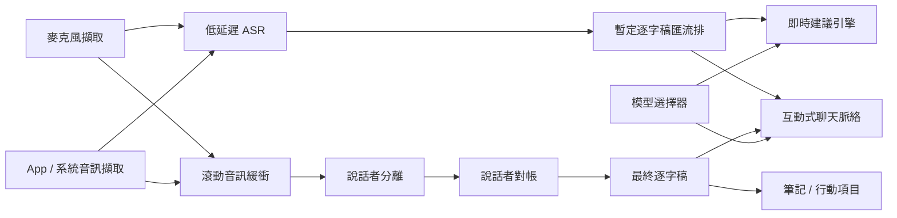

# macOS 會議助理的說話者分離深度研究

## 執行摘要

如果你的產品目標是「即時轉錄 + 即時建議回覆 + 會後筆記 / 行動項目 + 可互動聊天框」，那麼**說話者分離不能被當成單一路徑**來設計。對即時使用者體驗最實用的結論是：

第一，**單一混音音軌上的說話者分離可以做到「誰在何時說話」的可用程度，但很難穩定做到「這個人是誰」**。OpenAI 的 `gpt-4o-transcribe-diarize`、pyannote、SpeakerKit 這類系統，本質上先回答的是工作階段內的 `speaker_0 / speaker_1 / speaker_2`；若要把它穩定映射成真實身份，必須再引入**已知語音參考 / 聲紋 / 會議平台參與者中繼資料 / 每人獨立音軌**。OpenAI 官方文件已支援 `known_speaker_names` 與 `known_speaker_references`；pyannoteAI 也明確把說話者分離與聲紋識別分開設計。citeturn39view0turn10search0turn10search5turn10search8

第二，**對你的產品來說，「我 vs 其他人」其實比「所有人互相分清」容易很多**。如果你能在 macOS 上把**麥克風**與**會議 App / 系統輸出音訊**分成兩條路徑，則「我說的話」可以直接來自麥克風路徑，「其他人說的話」來自 App / 系統音訊路徑；這已經把最重要的產品問題從「困難的單通道說話者分離」降級成「可控的音訊路由」。Apple 的 ScreenCaptureKit 已提供 App 音訊與麥克風的分離輸出型別；Core Audio tap 也能針對程序或程序群組擷取輸出音訊。citeturn34search0turn34search3turn34search7turn23search6turn23search20

第三，**若你要真正支援「即時建議回覆」按鈕，最好的架構通常不是等說話者分離完整收斂再做建議，而是用「快速的暫定 ASR」先驅動建議，再用「較慢但較穩的說話者分離」回補與修正逐字稿歸屬**。WhisperKit 論文給出的串流 ASR 結果，顯示其平均逐詞延遲約 0.45 秒、已確認文字約在 1.7 秒級別；相對地，OpenAI 官方也明說，具說話者分離的串流只在片段完成後才輸出最終說話者指派，而不是對未完結片段持續串流出局部說話者標籤。citeturn19view2turn39view0

第四，**如果你能直接拿到每位參與者的獨立音軌，說話者歸屬會從「統計推斷」變成「來源事實」**。Zoom RTMS 已支援每位參與者的音訊封包，且也支援混合串流或最多 3 位活躍說話者的多串流輸出；Zoom 本機錄製也可輸出「每位參與者一個音訊檔」。WebRTC 若是你自己控制的應用，遠端音訊本來就是以 track 為基礎；但若你是對黑盒會議 App 或瀏覽器做作業系統層級擷取，通常只會拿到**已混合後的 App 輸出**。Teams 的真正即時原始媒體存取則走 application-hosted media bot 路線，要求 C#/.NET 與 Azure 上的 Windows Server，官方甚至明確寫出這條路**不建議當作 AI 會議代理的主要做法**。citeturn33view1turn33view0turn33view2turn31view0turn28search2turn28search9turn31view3turn31view4

綜合來看，對你這個 macOS 會議助理 App，**最務實的產品路線是混合式**：本機先做低延遲 ASR 與「我 vs 其他人」分離；真正多人說話者分離與會後高品質整併，則用 SpeakerKit / pyannote / 雲端 API 在滾動視窗或後處理補正。若你未來要深度整合 Zoom，RTMS 幾乎會是所有方案裡「最像正解」的一條路；若是 Teams，則平台層整合成本與限制明顯更高。citeturn13view1turn13view5turn31view2turn31view3turn31view4

## 方案比較

下表把你指定的幾條路線，連同幾個值得留意的研究 / 生產方案，一起放到同一個工程框架下比較。表中「macOS 整合性」與「隱私影響」是根據部署方式、執行環境、SDK 型態做的工程判斷；DER 只填**官方或論文有公開**的數字，沒有就明確標成未公開。

| 方案 | 公開 DER | 即時能力 | 重疊語音處理 | 語言 / 多語 | 運算需求 | 授權 / 商用 | macOS 整合性 | 隱私影響 | 主要依據 |
|---|---|---|---|---|---|---|---|---|---|
| **OpenAI `gpt-4o-transcribe-diarize`** | **未見官方公開 DER**；官方重點在 API 能力與具說話者分離的 JSON，而非基準測試 DER。 | 檔案轉錄支援 `stream=true`，但具說話者分離的說話者指派會等片段完成才定稿；官方指南明寫**目前只支援 `/v1/audio/transcriptions`，尚未支援 Realtime API**。不適合把「即時說話者標籤」當作唯一即時訊號。 | 官方文件未公開重疊語音專屬指標或架構細節。 | 官方 STT 指南表示可轉錄音訊原語言；支援已知說話者參考片段。 | 雲端 API。 | 專有 API；定價頁與模型頁顯示其為付費模型。 | **中**：HTTP API 最容易接，但真正低延遲、理解說話者的串流目前受限。 | **高**：音訊要上傳雲端。 | citeturn39view0turn39view1turn20search1turn20search0 |
| **pyannote.audio `community-1`** | 官方基準測試範例：AMI-IHM **12.9%**、AMI-SDM **19.9%**、AISHELL-4 **12.2%**、AliMeeting **24.5%**、CALLHOME **16.6%**。不同資料集差異很大。 | 以本機批次 / pipeline 為主；官方開源 pipeline 沒有把串流當作主要產品敘事。適合滾動視窗或後處理。 | pyannote 長期重視重疊語音；其 2021 segmentation 論文在 AMI / DIHARD3 / VoxConverse 相對 VBx 有 **13–17%** 相對 DER 改善。 | 基準測試橫跨英語、中文與多語資料集；屬實務上的多語說話者分離。 | Python + PyTorch；SDBench 曾在 **M2 Ultra / PyTorch MPS** 上對 pyannote v3.1 做基準測試。 | 工具包為 **MIT**；預訓練模型權重需依 Hugging Face / pyannote 條件取得。 | **中低**：你得橋接 Python/PyTorch 與 Swift/macOS 音訊堆疊。 | **低**：可完全本機。 | citeturn4search0turn9search5turn15view0turn16view4turn38search15 |
| **pyannoteAI `precision-2`** | 官方基準測試範例：AMI-IHM **12.9%**、AMI-SDM **15.6%**、AISHELL-4 **10.6%**、AliMeeting **20.3%**、CALLHOME **16.0%**；官方頁面也標示較 `community-1` 更佳。 | pyannoteAI 官網主打 **150ms 以下的即時說話者分離**；同時提供識別 / 聲紋。 | 官方模型頁也提供**互斥說話者分離模式**，方便和 STT 對齊。 | 官網宣稱不依賴語言 / 預設支援多語。 | 雲端 API。 | 專有 API / SaaS。 | **中**：API 容易接，但屬雲端依賴。 | **高**：音訊與聲紋上雲。 | citeturn4search2turn10search5turn10search10turn10search11 |
| **WhisperKit + SpeakerKit OSS** | **未公開單一代表性 DER**；Argmax 公開說法是跨 13 個資料集與 Pyannote **可比**，SDBench 論文則稱 SpeakerKit 對 pyannote v3.1 達 **9.6x** 速度提升且錯誤率相近。 | WhisperKit 有即時串流 ASR；**SpeakerKit OSS 文件偏檔案說話者分離**。Argmax 文件明示「即時說話者分離 / 具說話者的即時轉錄」是 **Pro SDK** 能力。 | SpeakerKit OSS repo 表示其在 Apple Silicon 上執行 **Pyannote v4 (community-1)**；有互斥式對帳選項。 | WhisperKit 針對多語 ASR；SpeakerKit 本身是說話者分離，語言相依性低。 | Apple Silicon + Core ML；原生 Swift。 | **MIT**（OSS SDK）；Pro 版另行訂閱。 | **高**：這是目前最原生的 macOS / Swift 路線。 | **低**：可完全本機。 | citeturn13view1turn13view0turn13view5turn17search0turn19view2 |
| **NVIDIA NeMo Sortformer** | 本次檢索未找到單一官方跨資料集代表性 DER；論文主打排列已解析的說話者分離，官方文件提供離線 / 線上版本。 | 官方文件明示有**線上** Sortformer；另有串流 Sortformer 論文，報告在 **0.32 秒延遲**下仍具競爭力。 | 屬端到端說話者分離家族，對排列 / 重疊語音較傳統分群更友善。 | 本次檢索到的官方文件未明寫多語保證。 | Python / NVIDIA 生態；較偏伺服器研究堆疊。 | 模型授權需逐一查模型卡；本文未核對單一商用授權。 | **低**：不適合當第一版 macOS 原型主軸。 | 可本機或伺服器，視部署而定。 | citeturn38search10turn38search1turn38search19 |
| **EEND / Streaming EEND-EDA** | 原始 EEND 論文主張在真實與模擬對話上優於 x-vector 分群基線；但本次檢索未取到單一穩定代表性 DER。 | Streaming EEND-EDA 論文報告 **1 秒區塊平均計算時間約 0.13 秒**，能處理重疊語音與可變說話者數。 | **強**：EEND 的核心賣點就是把說話者分離轉成多標籤問題，顯式處理重疊語音。 | 研究導向；本次檢索未見對商用品質的多語保證。 | 研究 / 伺服器堆疊為主。 | 依實作而異；不是單一產品。 | **低**：較適合 R&D 支線，不適合最快上市路徑。 | 視部署而定。 | citeturn38search3turn38search6 |

**判讀重點：**

如果你只看「今天就能做出 macOS 原型」這件事，最合理的優先序通常是：**WhisperKit + SpeakerKit OSS** 做本機原型；**pyannote.audio** 做伺服器端 / 參考基線；**OpenAI 說話者分離**做快速雲端驗證與 API 對照；若往 Zoom 深度整合，再考慮 RTMS 直接吃平台流。citeturn13view1turn9search5turn39view0turn31view2

如果你只看「即時理解說話者的建議」這件事，表面上 OpenAI API 最簡單，但實際上**它目前比較像高品質具說話者分離的轉錄 API，而不是已成熟的、理解說話者的即時基底**；官方指南與自動產生的 Realtime 參考文件說法目前不完全一致，保守做法應以指南為準，不把 Realtime 說話者分離當硬依賴。citeturn39view0turn39view1

## 可行性與風險

### 單一混音音軌到底能不能可靠知道誰在說話

可以，但要把「可靠」拆成三個層級看：

**第一層是輪次歸屬**：也就是 `speaker_0`、`speaker_1` 在什麼時間段說話。這層是說話者分離的核心問題，也是目前大多數系統最有把握的輸出。即使如此，SDBench 仍顯示不同資料集間 DER 波動極大；資料集的重疊語音比例、說話者擁擠度、遠場條件，會直接把難度拉高。像 AliMeeting 與 ICSI 這類重疊語音 / 擁擠度較重的資料集，就被論文直接描述為「可預期地具挑戰性」。citeturn15view0turn16view1

**第二層是工作階段內身份一致性**：也就是 30 分鐘前的 `speaker_1` 和現在的 `speaker_1` 是否真的是同一個人。這一層通常依賴嵌入 + 分群能力；在會議型資料上，乾淨近講條件可到低十幾的 DER，但遠場、多人搶話、筆電外放回授、相似音色、短句輪替都會讓分群混淆快速上升。pyannote 官方基準測試與 SDBench 同時支持這個結論：在會議 / 對話條件下，低十幾到二十幾 DER 是比較現實的區間，而不是「接近完美」。citeturn4search0turn15view0turn16view3

**第三層才是真實身份命名**：也就是把 `speaker_1` 變成「Alice」。這一步如果沒有外部錨點，單靠單通道說話者分離通常不夠穩。OpenAI 之所以提供 `known_speaker_references`，pyannoteAI 之所以把聲紋做成獨立能力，正是因為說話者分離與識別是兩件不同的事。你的產品若需要 UI 上真正顯示人名，應該優先利用：會議平台參與者中繼資料、已知說話者註冊、或每人獨立音軌，而不是期望混音說話者分離自己猜出姓名。citeturn39view0turn10search0turn10search6turn10search13

### 重疊語音為什麼特別麻煩

重疊語音會同時破壞兩件事：**誰在講**與**STT 正確對齊哪個說話者**。EEND 原始論文把傳統以分群為基礎的說話者分離的一個核心弱點直接寫出來：它「不能正確處理重疊語音」；pyannote 的重疊感知分割論文也顯示，在 AMI、DIHARD3、VoxConverse 上，針對重疊語音的建模能帶來明顯相對 DER 改善。換句話說，**重疊語音不是小誤差，而是系統性失敗來源**。citeturn38search3turn38search15

對你的會議助理而言，重疊語音最大的產品風險不是逐字稿稍微醜一點，而是**建議回覆按鈕會在錯的人身上觸發錯的語境**。例如上一句其實是對方打斷你，但系統把最後活躍說話者鎖到你自己，接下來「我該說什麼？」就可能用錯視角。這也是為什麼我建議把「即時建議」建立在**最新已確認的說話者狀態 + 保守規則**，而不是建立在抖動中的暫定說話者分離上。這是工程判斷，但其風險來源與上面論文結論一致。citeturn39view0turn38search3turn38search15

### 我 vs 其他人為什麼容易很多

因為這不再是「辨識聲紋群聚」，而是「利用不同音訊來源做以來源為依據的歸屬」。如果你的 App 能同時抓到：

- 一條**麥克風**路徑；
- 一條**會議 App / 系統輸出**路徑；

那麼「我說的」可直接從麥克風串流來，「其他人說的」可從 App / 系統串流來。Apple 已在 ScreenCaptureKit 中提供 `.audio` 與 `.microphone` 類型的分離輸出，且 Apple 工程師在論壇進一步指出，這兩種 sample buffer 甚至可能帶著不同取樣率 / 聲道格式，因此必須分開寫入與處理。這等於是在作業系統擷取層就承認 App 音訊與麥克風音訊是兩種不同來源。citeturn34search0turn34search3turn34search7

這種方法的失敗模式也很清楚：如果你用喇叭外放而非耳機，遠端聲音可能回灌進麥克風；如果會議 App 自己做強力 AEC / noise suppression / voice isolation，則你捕捉到的麥克風內容可能與實際送進會議的內容不同。Teams 的 voice isolation 官方就明說它會保留你的聲音、濾掉背景聲與其他講者，以避免回音。這對「我 vs 其他人」未必是壞事，但表示**你不能假設每個 App 的麥克風路徑都是原始麥克風**。citeturn24search0

### 多軌是不是幾乎等於完美解法

只要多軌是真的「每位參與者各自獨立」、而不是「幾個活躍說話者被暫時拆分」，答案幾乎是**接近 yes**。Zoom RTMS 官方文件已經把這件事講得很明白：音訊可以是每位參與者封包，也可以是合併封包；`AUDIO_MULTI_STREAMS` 甚至可讓每個活躍說話者以獨立串流輸出，最多 3 位活躍說話者 / 20ms。這類平台級資料本身就帶 `user_id` / `user_name`，說話者歸屬不再靠聲學猜測。citeturn33view1turn33view0turn33view2

但你要注意兩件事。其一，**Zoom RTMS 的多串流是以活躍說話者為中心，不是任意大會議全員永久獨立 stem**；其二，**Teams 與一般黑盒桌面 App 並沒有給你同等易用的本地路徑**。Teams 的原始媒體官方解法是 application-hosted media bot，且要求 C#/.NET、Azure 上的 Windows Server；WebRTC 則只有在你**控制那個 WebRTC App 本身**時，`ontrack` 才會讓你取得分開的遠端 tracks。若你只是從 macOS 外部去抓 Chrome / Safari / Teams 的輸出，那通常只會拿到混音後的 App 輸出。citeturn31view4turn31view3turn28search2turn28search9

## 推薦架構

### 最符合產品現實的三種路線

**本機優先原型**最適合用來驗證 UI 與 UX：WhisperKit 做串流 ASR，SpeakerKit 做本機說話者分離 / 後處理，LLM 建議層則做不綁定供應商的 adapter。WhisperKit 論文已證明它可在 Apple 裝置上做低延遲串流 ASR；SpeakerKit OSS 則是目前最貼近你技術棧的 Apple Silicon 說話者分離路線。缺點是開源 SpeakerKit 的公開文件較偏離線說話者分離，真正「具說話者的即時轉錄」目前仍主要放在 Pro SDK 功能表內。citeturn19view2turn13view1turn13view5

**伺服器優先原型**最適合快速比較品質上限：你可以用 OpenAI 說話者分離 API 或 pyannote / pyannoteAI 在伺服器端跑滾動視窗，把結果回傳給本地 UI。這條路最大優點是實作速度快、可快速驗證會後品質；最大缺點是**即時建議會被網路與片段定稿拖慢**。尤其 OpenAI 官方自己就寫明，具說話者分離的增量資料不會對尚未定稿的片段持續輸出局部說話者指派。citeturn39view0turn10search9

**混合式路線**通常最適合真正產品化：本地 ASR 負責 0.5–1 秒級別的即時文字流，本地音訊路由先把「我 vs 其他人」拆掉；較慢但更穩的多人說話者分離，則在滾動緩衝或會議後段補正說話者標籤、整理筆記、改寫行動項目。這種雙速架構最符合你列出的按鈕型 UX，因為「我該說什麼？」不需要等到最終 DER 最佳化，而「會議筆記 / 行動項目 / 聊天框重播」則可以吃後補的高品質說話者歸屬。這是工程建議，但與 OpenAI / WhisperKit / SpeakerKit 目前各自的能力邊界完全一致。citeturn39view0turn19view2turn13view5

### 建議的資料流

這個圖的關鍵不是「多一個匯流排」，而是**把即時路徑與品質路徑拆開**。你真正要低延遲的是建議引擎，而不是會後逐字稿的最終說話者歸屬。OpenAI 的具說話者分離串流行為與 WhisperKit 的串流論文結果都支持這種拆法：一條路求快，一條路求穩。citeturn39view0turn19view2

### 具體實作選項

**選項一：WhisperKit + 麥克風 / App 音訊分離 + SpeakerKit 後補**  
這是我最推薦的第一版。ASR 走 WhisperKit；音訊來源在 macOS 先分成麥克風與 App 音訊；對 UI 明確區分「我剛說了什麼」與「會議剛剛在講什麼」。SpeakerKit 先做滾動視窗或片段級說話者分離，不必硬追每 200ms 都更新整個說話者時間軸。這條路對隱私最好，也最符合你要做可選模型 / 按鈕的產品形態。citeturn13view1turn13view5turn19view2turn34search0

**選項二：WhisperKit 本機 ASR + pyannote 伺服器端說話者分離**  
如果你想先得到「比較成熟的說話者分離基線」而不想被 Swift / Core ML 細節卡住，這條路很實際。pyannote community-1 的公開基準測試與重疊語音相關研究都很扎實，當參考基線很有價值。你的 UI 與產品邏輯可以先穩定，之後再把伺服器說話者分離逐步替換成本機 SpeakerKit。citeturn4search0turn9search5turn38search15

**選項三：Zoom 優先深度整合 + RTMS**  
如果你明確知道產品會重押 Zoom 場景，RTMS 的資料型別幾乎是你能得到的最佳工程條件：結構化音訊封包、參與者身份、活躍說話者事件、混合 / 多串流選項，而且不用「可疑 bot 加入會議」。這會大幅降低說話者歸屬的不確定性，也讓筆記 / CRM / 即時指導更穩。缺點是平台依賴非常重，且屬 Zoom 生態專案，不再是一般性的 macOS 外掛。citeturn31view2turn33view1turn33view0turn33view2

### 粗估延遲預算

下表不是供應商 SLA，而是根據公開資料與合理工程拆解做的**保守預估**：

| 架構 | 文字可見延遲 | 說話者標籤穩定延遲 | 適合按鈕 UX 嗎 |
|---|---:|---:|---|
| WhisperKit 串流 + 本機來源分離 | 約 **0.5–1.0 秒**；WhisperKit 論文在 M3 Max 等級基準測試上的均值約 0.45 秒 | 「我 vs 其他人」幾乎可即時；多人工作階段內標籤仍建議用 1–3 秒視窗穩定化 | **很適合** |
| OpenAI 具說話者分離的轉錄 API | 取決於網路 + 片段完成；說話者指派於片段定稿後才穩定 | 通常比文字本身慢，因說話者標籤不會對未完成片段提前定稿 | **普通**，更適合品質路徑 |
| pyannote / SpeakerKit 滾動視窗說話者分離 | 取決於視窗長度與重算策略 | 若追求穩定標籤，通常比即時文字慢 | **適合作為補正層** |

WhisperKit 的 0.45 秒數字來自其串流 ASR 論文；OpenAI 的限制則直接來自官方說話者分離說明。多人標籤的 1–3 秒，是基於會議型 UX 對穩定度與發話輪次完成的工程估計，不是某家官方承諾。citeturn19view2turn39view0

## 評測與實驗設計

### 先量什麼，不要只量 DER

若你的產品真的是會議助理，而不只是說話者分離展示，建議最少同時量四件事：

- **DER**：仍然是最常見的主指標，pyannote.metrics 把它定義為誤報、漏檢、混淆的總和除以總時長。citeturn37search0
- **JER**：Jaccard Error Rate 對每位說話者給較平均的權重，能補 DER 對長講者偏重的盲點。citeturn40search0
- **說話者切換時間戳的 precision / recall / F1**：對你的「追問問題」與「我該說什麼？」特別重要，因為這兩個功能常卡在「到底是不是輪到我了」。近年的 SCD / 多任務研究直接以時間戳 P/R/F1 作為此類任務指標。citeturn40search18
- **WDER 或具說話者分離的逐字稿品質**：對筆記和行動項目更重要。DiarizationLM 這類工作甚至就是針對詞級歸屬與逐字稿可讀性做後處理。citeturn12search15turn12search17

換句話說，你應該把實驗分成兩層：**以音訊為中心的指標**看 DER/JER/SCD；**以產品為中心的指標**看哪些說話者歸屬錯誤真的會讓建議回覆、摘要、行動項目出錯。citeturn37search0turn40search0turn40search18turn12search17

### 資料集怎麼選

SDBench 已經把你多半會用到的會議 / 對話資料集整理得很完整，包含 CALLHOME、DIHARD-III、ICSI、AMI-IHM、AMI-SDM、VoxConverse、AliMeeting、AISHELL-4、AVA、EGO4D 等。對你的產品，我建議優先挑以下子集：

| 測試目的 | 建議資料集 | 為什麼 |
|---|---|---|
| 近講會議上限 | **AMI-IHM** | 代表頭戴 / 近講麥克風條件，可看理想情況。 |
| 遠場真實會議 | **AMI-SDM、ICSI** | 更貼近筆電 / 房間麥克風與遠場會議。 |
| 重疊語音 / 會議擁擠度 | **AliMeeting、DIHARD-III** | SDBench 指出其重疊語音比例 / 擁擠度更高。 |
| 中文會議 | **AISHELL-4、AliMeeting** | 直接測中文情境。 |
| 開放域對話與網路影片 | **VoxConverse、AVA** | 看在非標準會議音訊上的穩健性。 |

SDBench 對這些資料集還提供了重疊語音比例、說話者擁擠度、說話者數中位數等統計，剛好能用來對應你產品最在意的失敗模式。citeturn15view0turn16view1

### 一定要跑的情境

你至少要把下面幾類場景系統化，不然 DER 再漂亮也可能對產品沒意義：

- **兩人、三人、五人、八人**；
- **耳機會議** vs **筆電喇叭外放**；
- **整段無重疊語音**、**偶發打斷**、**頻繁搶話**；
- **固定座位說話** vs **走動 / 遠近改變**；
- **乾淨環境** vs **咖啡廳 / 辦公室背景噪音**；
- **中英混合 / 中文專有名詞**；
- **自己長講** vs **你很少講，大多在聽**。

其中最值得你額外加上的，是**自己真實產品場景的回放集**：Zoom、Teams、Google Meet / WebRTC browser 各抓 10–20 場，因為會議 App 自己的 AEC、noise suppression、AGC，會把公開基準測試上沒出現的失真帶進來。這不是公開資料直接給出的結論，但與平台文件對媒體串流 / 音訊處理的差異完全一致。citeturn31view2turn31view3turn28search2

### Apple Silicon 的最低可行硬體

公開資料並沒有直接寫出「最低推薦 Mac 配置」，所以這裡只能給**保守工程建議**。已知的硬資料是：

- WhisperKit 論文的低延遲結果是在 **M3 Max** 基準測試上呈現。citeturn19view2
- SDBench 把 pyannote v3.1 與 SpeakerKit 基準測試在 **M2 Ultra Mac Studio**。citeturn15view0
- SpeakerKit blog 又顯示它在 **iPhone** 也能很快跑完檔案說話者分離。citeturn13view0

因此，若只是做產品原型，我會把**M2 / 16GB 統一記憶體**視為最低可行起點；若你要同時跑本機 ASR、滾動說話者分離、桌面 UI、向量索引和一個本機小模型做建議，則**M3 Pro / Max 與 24GB+** 會更像穩妥的開發／示範機。這是基於上述基準測試的工程推論，不是官方最低需求。citeturn19view2turn15view0turn13view0

## macOS 與會議軟體整合

### macOS 音訊擷取現實

在 macOS 上，你可用的主要原生路徑有兩條：

**ScreenCaptureKit**：Apple 官方定位就是用來擷取螢幕與音訊內容；新版本還加入**麥克風擷取**，並可把 `.audio` 與 `.microphone` 當成不同輸出型別來接。這對你的產品非常有用，因為它讓你不必先解決「單通道把自己跟別人分開」這個硬問題。citeturn23search20turn34search0turn34search3turn34search8

**Core Audio 程序 tap**：Apple 官方文件摘要明確寫出，它能擷取**特定程序或程序群組的輸出音訊**，且建立方式是 `AudioHardwareCreateProcessTap` + aggregate device。這條路對「只抓 Zoom / Teams / Chrome 某個 App 的播出聲音」特別重要，因為你不一定要抓全系統音訊。citeturn23search6turn23search2turn21search14

實作上要小心格式：Apple 論壇已指出 App 音訊與麥克風音訊常常不是同一個取樣率 / 聲道數，若你把它們暴力寫進同一個 writer input，檔案容器會被弄壞。你的 pipeline 應該一開始就把麥克風與 App 音訊當成兩條獨立串流。citeturn34search7

### 虛擬音訊裝置

如果你要跨 App 做更靈活的路由，而不想一開始就深入 Core Audio tap / driver 細節，最常見的是 **BlackHole** 與 **Loopback**：

- **BlackHole** 是開源的 macOS 虛擬音訊 loopback 驅動程式，主打零額外延遲，授權是 **GPL-3.0**。若你要隨產品安裝 / 綁定散佈，應先做授權合規評估。citeturn37search1turn37search15
- **Loopback** 是 Rogue Amoeba 的商業路由工具，官方頁面明寫它可以把**應用程式來源**與**音訊輸入裝置**組合成虛擬裝置，對快速做 POC 很方便。citeturn37search2

若你用 BlackHole 的 Multi-Output Device，官方 wiki 還特別提醒內建輸出或另一個 2-channel 裝置應設為 top/primary device，否則容易出現「音訊 / 視訊不播放」的 macOS 路由問題。這是非常實務的坑。citeturn37search4

### Zoom、Teams、WebRTC 的差異

**Zoom**  
如果你只是從 macOS 外部抓 Zoom App 的聲音，通常拿到的是 App 輸出混音；但 Zoom 平台整合能力是三者裡最成熟的。對離線會後處理，Zoom desktop app 本機錄製可輸出**每位參與者各自的音訊檔**。對真正即時 AI 工作流程，RTMS 官方已提供結構化會議資料、WebSocket 傳輸、活躍說話者事件，甚至每位參與者音訊封包與多串流音訊選項。citeturn31view0turn31view2turn33view1turn33view0turn33view2

**Teams**  
Teams 的平台能力比較「企業整合化」。若你只是做本地 macOS 助理，從作業系統層抓 Teams 音訊最終仍多半是混音。若你想拿原始媒體，官方路徑是 application-hosted media bot，且要求 **Microsoft.Graph.Communications.Calls.Media .NET**、**C#/.NET**、**Azure 上的 Windows Server**。更重要的是，Microsoft 自己在 Real-time Media docs 直接寫出：**對 meetings 的 AI agents，這條路不推薦**，而比較建議 Copilot Studio 或 Graph meeting transcripts。citeturn31view4turn31view3

**WebRTC 瀏覽器**  
若會議產品是你自己做的 WebRTC App，那很好：遠端媒體本來就以 track / stream 的形式進入 `RTCPeerConnection`，`ontrack` 會在新 track 加進來時觸發。這對每位參與者歸屬幾乎是天然優勢。可是一旦你不是控制那個 WebRTC App，而只是從 macOS 抓 Chrome / Safari 的輸出，那你看到的通常是瀏覽器已經混好的 App 音訊。citeturn28search1turn28search2turn28search9

### 權限與 UX

你的產品至少會碰到兩類權限：

- **麥克風**：Apple 文件要求 `NSMicrophoneUsageDescription`，而且第一次錄音時系統會提示使用者授予錄音權限。citeturn36search1turn36search3turn36search0
- **螢幕 / App 音訊擷取**：若你走 ScreenCaptureKit / 螢幕錄製類路徑，會涉及螢幕錄製權限與相關的擷取存取流程。Apple 公開 API 以 `CGRequestScreenCaptureAccess()` / `CGPreflightScreenCaptureAccess()` 為入口。citeturn35search0turn35search3turn35search16

UX 上，我建議把權限文案與路由模式說清楚，並在 UI 中明確區分：

- **只聽我**；
- **只聽會議**；
- **我 + 會議**；
- **高品質說話者標記可能延後數秒修正**。

這能顯著降低使用者對即時建議的誤解，尤其當說話者歸屬在重疊語音區段還會被回補修正時。這是產品建議，但與上述平台能力邊界直接相關。citeturn39view0turn34search7

## 結論與未決問題

如果把你的需求翻成工程決策，最重要的結論只有三個：

**最值得先做的版本**，不是「在單一混音音檔上追求完美多人說話者命名」，而是**先把麥克風與 App 音訊分離，穩定支援我 vs 其他人，並用低延遲 ASR 驅動即時建議**。這會最快讓你的「我該說什麼？」「追問問題」「互動式聊天」真正可用。citeturn34search0turn34search7turn19view2

**最值得當 macOS 原型主軸的技術組合**，是 **WhisperKit + SpeakerKit OSS / 滾動對帳**。原因不只是它本機、隱私友善，而是它最符合你的技術棧：Swift、Apple Silicon、原生音訊路由、可插拔 LLM 供應商。pyannote.audio 應該是你的對照基線；OpenAI 說話者分離則適合當雲端品質比較器，而不是產品唯一依賴。citeturn13view1turn13view5turn9search5turn39view0

**如果未來要做真正高可信說話者歸屬**，最佳路不是把單通道說話者分離魔改到極致，而是盡快接入**平台層身份 / 每人獨立音軌**。Zoom RTMS 在這方面最成熟；Teams 可以做，但進入門檻與架構束縛大得多；WebRTC 則只有在你控制通訊應用本身時才真有優勢。citeturn31view2turn33view1turn31view3turn31view4turn28search2

### 未決問題與限制

有幾個點，需要你在正式選型前保持保守：

OpenAI 文件目前存在一個**小但重要的邊界不一致**：speech-to-text 指南明寫 `gpt-4o-transcribe-diarize` 尚未支援 Realtime API，但自動產生的 Realtime 參考文件 schema 仍把它列為可選模型。對產品規劃而言，應以指南的實際文字行為說明為準，不要先賭未正式完成的 Realtime 說話者分離。citeturn39view0turn39view1

SpeakerKit OSS 目前公開資料對「即時多人說話者分離」的訊號是**半開放、半商用**：開源路徑明確可做本機說話者分離，但即時說話者分離 / 具說話者的即時轉錄在 Argmax 文件中主要出現在 Pro SDK 能力表。若你最終產品硬性要求完全本機、完全原生、完全即時的多人說話者標籤，應在開發早期就做 POC 驗證，而不要只讀行銷文案。citeturn13view5turn13view1turn13view0

最後，沒有任何公開基準測試能保證「單一混音 + 多人搶話 + 遠場 + 會議 App DSP + 即時說話者命名」會穩定到像字幕組那樣乾淨。SDBench 反而說明了相反的事：**說話者分離到今天仍不是已解問題**，而且跨資料集變異很高。你的產品要成功，關鍵會是**把不確定性包裝成正確的系統設計**，而不是期待某個模型獨自解決所有場景。citeturn15view0turn16view3turn38search19
