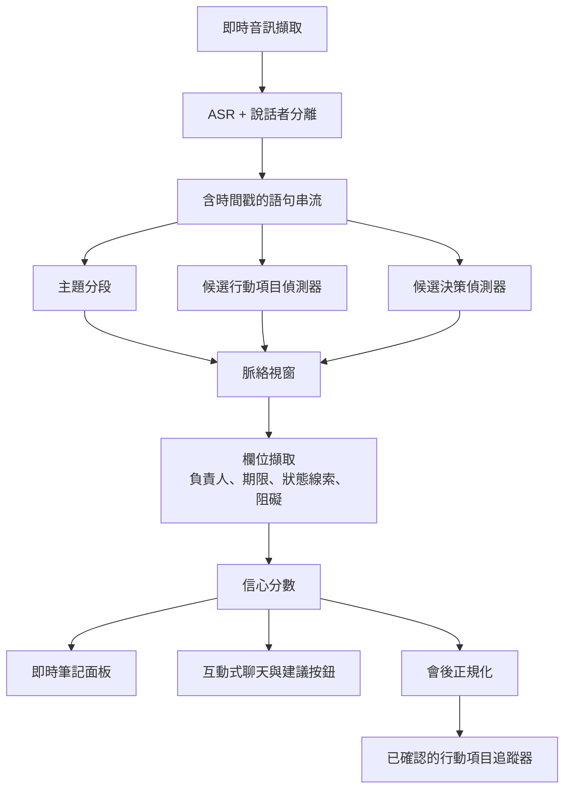
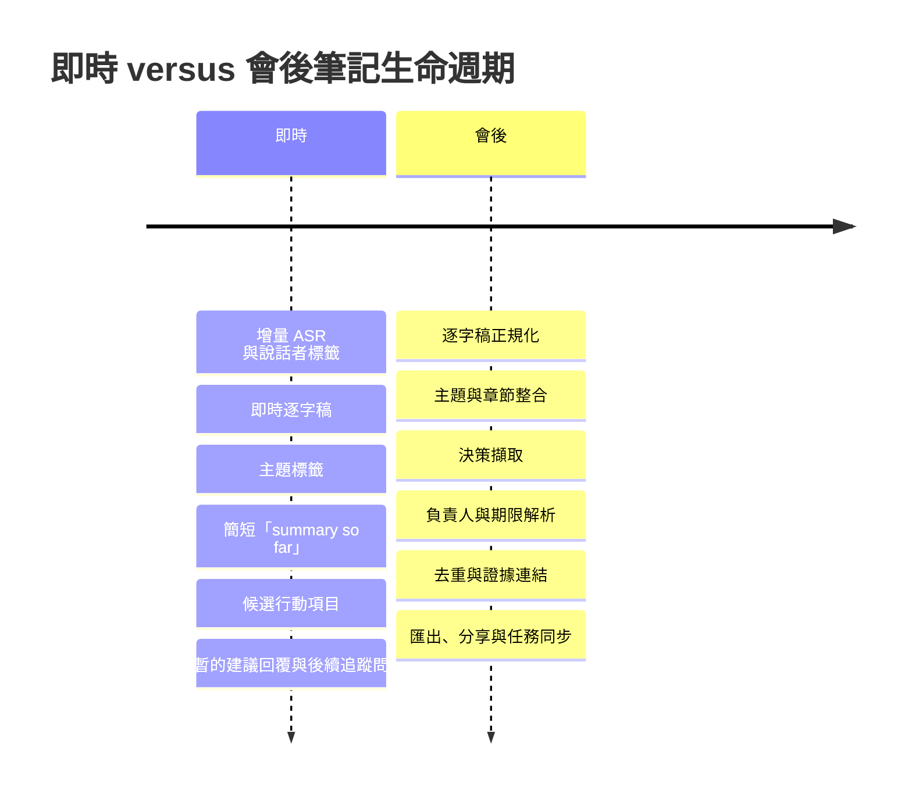

# 為 macOS 會議輔助工具設計會議筆記與行動項目格式

## 執行摘要

這類 App 最強的設計模式**不是**單一通用的筆記檢視，而是一套**雙重表徵系統**：一個低延遲的**即時重點檢視**，用於會議中的認知輔助；以及一個更完整的**會後階層式會議紀錄檢視**，用於重建脈絡、分享與任務追蹤。這項建議與 HCI 研究一致：研究顯示「重點」有助於與會者快速回想與規劃每週任務，而階層式會議紀錄更能支援深入補進度與理解脈絡；它也符合 Fireflies、Google Meet、Teams、Zoom、Otter 與 Notion 目前的產品行為，這些產品越來越傾向將即時輔助與回顧產物分開。 citeturn16view2turn16view7turn29view3turn28view0turn27view4turn27view2turn29view0turn29view1

就筆記格式本身而言，最穩健的標準章節集合就是你指定的這一組：**TL;DR、主題、決策、行動項目、待釐清問題、風險/阻礙，以及後續追蹤**。證據顯示，這些章節不應全部以相同方式運作。「決策」與「行動項目」需要分開，因為 Google Meet、Teams、Fireflies 與 Feishu 等會議系統已經將結果與下一步區分開來，而 HCI 研究也顯示，使用者往往需要逐字稿脈絡，才能判斷某段話究竟是已定案的決策、暫定建議，還是一項任務。 citeturn28view1turn27view4turn29view2turn22view9turn33view1

一個達到正式產品等級的**行動項目**物件，應該一律包含必要欄位：**負責人、期限、脈絡與狀態**，並且通常還應加入**證據片段**、**信心分數**與**外部同步狀態**。這項建議直接受到產品與研究模式支持：Microsoft 的回顧原型使用了可編輯的指派對象與日期欄位，並附上逐字稿脈絡；Fireflies 會公開顯示附有相關說話者的行動項目；Feishu 明確宣稱可擷取決策、行動項目、指派對象與期限；Google Meet 的筆記系統則將 Decisions 與 Next steps 分開，並可列出已指派的任務。 citeturn16view0turn16view7turn29view2turn22view9turn28view1

在擷取方面，證據**不**支持預設採用純粹「讓 LLM 摘要所有內容」的方法。更好的架構是一條**混合式管線**：ASR 與說話者分離、語句層級與主題層級的候選偵測、明確的負責人/日期/脈絡擷取，接著才是以證據視窗為基礎的 LLM 正規化或改寫。早期會議 NLP 研究發現，詞彙、時間、韻律與對話行為訊號都能實質改善行動項目與決策偵測；後續研究則顯示，當模型取得額外脈絡，例如共指資訊時，行動項目的改寫品質會提升。與此同時，HCI 研究發現，若從逐字稿衍生出的行動項目缺乏足夠的社交與對話脈絡，使用者往往會給予較差評價。 citeturn19view0turn19view1turn19view3turn21view0turn33view1

即時輔助應該是**短暫、保守且可逆的**。Fireflies 的即時介面與 Google Meet 的「目前摘要」證明，會議中的回顧摘要很有用；但 Teams 與 Zoom 也顯示，最可靠的結構化回顧通常會在會議結束後產生，因為那時已可取得完整逐字稿與保留/儲存路徑。對於 **「我該說什麼？」** 與 **「追問問題」** 這類按鈕，設計應遵循 HCI 的**先詢問再介入**原則：建議應以短暫提示形式出現，而不是自主行為。 citeturn29view3turn29view4turn28view0turn27view4turn27view3turn35view0

macOS 方面的具體建議，是採用**重視隱私、模型可插拔、可行時本地優先**的設計。Apple 目前的平台指引強調裝置端 foundation models、透過 SpeechAnalyzer 進行進階裝置端轉錄、受保護資源提示，以及 help tags、popovers、progress indicators 等短暫且具支援性的 UI affordances。GitHub Models 與 Copilot 文件則展示了一種務實模式：模型目錄、並排評估、Auto model selection，以及透過 MCP 進行標準化的脈絡/工具整合。 citeturn23view1turn5search8turn5search26turn5search1turn5search13turn5search16turn5search19turn22view10turn22view11turn22view12turn23view0turn6search17turn6search9

最後，評估應衡量**不只是摘要文字品質**。會議摘要研究顯示，標準自動指標，甚至目前的 LLM 評估器，在長篇會議逐字稿上都很弱，或具有自我偏誤；因此產品應追蹤擷取的 precision/recall、負責人與期限準確率、完整性/簡潔性/忠實性、使用者編輯成本、下游確認，以及已確認任務的完成率。使用者的編輯、分享與脈絡查找是特別有價值的遙測資料，因為研究顯示它們是相關性與品質的強訊號。 citeturn26view0turn38view0turn38view1turn38view2

## 筆記架構與標準格式

最乾淨的文件模型，是單一**會議物件**搭配兩種同步呈現：

1. 一個針對目前參與者最佳化的**即時工作檢視**，以及  
2. 一個針對回顧、分享與執行最佳化的**會後紀錄**。  

這與會議回顧研究中的「重點 versus 階層式會議紀錄」區分直接一致；在這些研究中，重點扮演記憶提示，而會議紀錄式檢視則提供更完整的時間順序紀錄。 citeturn16view4turn16view2turn16view1

| 章節 | 建議內容 | 即時行為 | 會後行為 | 證據基礎 |
|---|---|---|---|---|
| TL;DR | 3 至 5 句簡潔說明最重要的事項 | 顯示為「目前摘要」，並謹慎重新整理 | 在逐字稿清理後定稿 | Google Meet 使用會議中的「目前摘要」；Fireflies 提供簡短即時回顧；回顧研究發現重點可作為快速提醒。 citeturn28view0turn29view4turn16view2 |
| 主題 | 附時間戳與逐字稿視窗連結的主題標籤 | 動態主題標籤；使用者可釘選或忽略 | 轉換為含標題與時間範圍的穩定章節 | Fireflies 會產生動態主題建議與連結到主題的筆記；Teams recap 會顯示 chapters 與 topics。 citeturn29view4turn27view4 |
| 決策 | 已定案的結果，每一項都附決策狀態與證據 | 只在信心高或多個訊號一致時顯示 | 正規化措辭並附上證據片段 | Google Meet 提供專用 Decisions 章節與明確狀態標籤；經典會議研究將決策相關對話行為與主題片段和一般討論分開建模。 citeturn28view1turn19view3turn19view5 |
| 行動項目 | 命令式任務陳述，加上負責人、期限、脈絡、狀態 | 顯示為建議候選項，絕不在 App 外靜默同步 | 確認、去重，並可選擇匯出 | Microsoft 的回顧 UI 使用指派對象/日期/脈絡；Fireflies 包含相關說話者；Feishu 宣稱可擷取負責人/期限。 citeturn16view7turn29view2turn22view9 |
| 待釐清問題 | 未解決議題、模糊處、待核准事項 | 在即時場景很有用；作為後續追蹤提示浮現 | 將未解決項目與決策分開保留 | 會議 QA 與脈絡研究指出，互動式問題處理是一級使用情境；未解決項目通常比起弱決策，更適合被建模為問題。 citeturn15view4turn33view1 |
| 風險/阻礙 | 依賴關係、阻礙、法律/合規風險、缺少的輸入 | 只有在證據強時才以警示顯示 | 會後以負責人/依賴連結擴充 | Feishu 明確支援風險點等自訂擷取維度；HCI 工作顯示，判斷某段話是否為實際阻礙時，常需要脈絡。 citeturn22view9turn33view1 |
| 後續追蹤 | 要寄出的 email、要傳閱的文件、下一場會議、外部任務同步 | 會議中與行動項目分開保留 | 經確認後轉換為對外產物 | Fireflies AskFred、Otter AI Chat 與 Zoom AI Companion 支援後續追蹤產生與以會議為基礎的草稿撰寫。 citeturn3search2turn2search12turn27view3 |

此 App 建議採用的**行動項目**紀錄如下：

```json
{
  "id": "ai_024",
  "title": "寄出修訂後的 onboarding email 文案",
  "owner": "Ava",
  "deadline": "2026-05-28",
  "context": "launch review 前需要；取決於法律核准後的措辭",
  "status": "Proposed",
  "confidence": 0.91,
  "evidence": [
    {
      "speaker": "Ava",
      "timestamp": "00:14:22",
      "text": "我會在星期四前寄出修訂後的 onboarding 文案。"
    }
  ],
  "topic_id": "launch_readiness",
  "sync_state": "not_exported"
}
```

這裡有兩個重要的設計選擇。第一，**脈絡必須是明確的**，不能是隱含的。研究與原型工作顯示，使用者往往需要鄰近的逐字稿脈絡，才能理解任務的意思；Microsoft 的回顧原型也明確提供了圍繞偵測到的筆記與任務的「show context」功能。第二，**狀態一開始應是 `Proposed`**，而不是過早設為 `Open` 或 `Assigned`，因為只靠逐字稿擷取容易出錯，使用者需要有機會先確認意思，App 才能讓該項目進入可執行狀態。 citeturn16view7turn33view1turn38view3

實用的狀態分類如下：

- **Proposed**  
- **Confirmed**  
- **In Progress**  
- **Blocked**  
- **Done**  
- **Deferred**

這是一項產品建議，而不是已發布的標準；但它與會議回顧研究及產品 UI 所暗示的「草稿建議」與「已驗證任務」之間的區隔一致，這些產品 UI 往往要求使用者在下游使用前先檢閱、編輯或分享。 citeturn38view0turn27view3turn29view2

## 從逐字稿擷取決策與行動項目

會議輔助工具應將擷取視為一個**多階段資訊擷取問題**，而不是單一龐大的摘要步驟。既有研究與產品行為共同指向一個分層工作流程：語句層級偵測、主題/決策分段、欄位擷取、證據連結，最後才是表層改寫。 citeturn19view0turn19view3turn21view0turn15view7

下方工作流程呈現建議架構。



最有用的擷取方法彼此並不互斥，而是互補。

| 方法 | 使用內容 | 優點 | 弱點 | 建議角色 |
|---|---|---|---|---|
| 啟發式與模式規則 | 承諾動詞、命令式語句、「can you」、「I’ll」、「let’s」、TIMEX/日期表達、說話者角色 | 非常快、透明、容易依情境調整 | 面對間接承諾、多語細微差異、諷刺、破碎語句時脆弱 | 即時模式中的第一輪候選產生器。早期會議研究發現詞彙、時間與 TIMEX 特徵有助於行動項目偵測。 citeturn19view0turn19view1turn19view2 |
| 傳統監督式語句分類 | 詞彙、脈絡、韻律、句法、時間、對話行為特徵 | 適合在吵雜逐字稿中進行高召回的候選項發現 | 需要標註資料；通常需要依會議類型分別校準 | 在 LLM 正規化之前用於候選排序。早期研究中，韻律與細粒度對話行為特徵實質提升了 F-measure。 citeturn19view1turn19view0 |
| 決策相關 DA 與主題片段偵測 | 對話行為、主題結構、韻律、詞彙線索 | 更能區分「關於某主題的討論」與「已達成決策」 | 若沒有良好的主題分段與 DA 特徵，較難維護 | 用於決策章節，而不是從一般摘要文字推論決策。 citeturn19view3turn19view5 |
| 具脈絡感知的論元擷取 | 共指、命名實體、日期解析、說話者身分、鄰近輪次 | 更能補齊負責人/期限/脈絡；改善改寫品質 | 對說話者分離與代名詞錯誤敏感 | 負責人/期限/脈絡欄位所必需。Microsoft 報告指出，提供額外脈絡資訊時，行動項目改寫會改善。 citeturn21view0turn16view5 |
| LLM 正規化或摘要 | 證據視窗、章節摘要、逐字稿檢索 | 產生易讀筆記、合併重複項目、生成自然語言後續追蹤草稿 | 若不受約束，最容易發生幻覺、過度概括或錯誤指派 | 僅在擷取與 grounding 之後使用，並讓輸出連結到證據。可解釋性與長脈絡評估工作強烈支持證據對齊，以及對會議摘要保持謹慎。 citeturn15view7turn26view0turn38view3 |
| 混合式正式產品管線 | 以上方法的組合 | 在延遲、可控性與可讀性之間取得最佳平衡 | 工程複雜度較高 | 建議作為此 App 的預設架構。 citeturn19view0turn19view3turn21view0turn33view1 |

一個有用的心智模型是：**行動**與**決策**是不同物件。決策是已定案的結果；行動項目是未來義務。像「Let’s move launch to sprint 14」這樣的語句是**候選決策**，而「Ava will update the launch deck by Thursday」則是**候選行動項目**。關於決策相關對話行為的會議研究，加上 Google Meet 將 Decisions 與 Next steps 分開的產品模式，都支持這種區分。 citeturn19view5turn28view1

實用的**信心分數**應結合多個訊號，而不是相信單一模型機率。最可辯護的組成包括：逐字稿品質、說話者分離確定性、語句線索強度、已擷取欄位的完整度、鄰近脈絡支持，以及跨視窗或跨模型的一致性。這直接承襲自早期研究：多種特徵類別都很重要；Microsoft 發現額外脈絡能改善行動項目改寫；HCI 證據也顯示，缺少脈絡時使用者會遇到困難。 citeturn19view0turn21view0turn33view1

建議的門檻策略偏保守：

| 信心區間 | UI 處理 | 外部副作用 | 備援 UX |
|---|---|---|---|
| **0.85 以上** | 以**建議行動**或**候選決策**形式插入筆記，附可見徽章與證據連結 | 不自動建立外部任務；允許一鍵確認 | 若缺少負責人或日期，保留該項目但明確標示缺失欄位 |
| **0.65 至 0.84** | 保留在檢閱托盤，或作為相關主題旁的內嵌標籤 | 絕不自動匯出 | 顯示短證據視窗與快速操作：「Confirm」、「Edit」、「Dismiss」 |
| **0.45 至 0.64** | 預設不推入主要筆記正文 | 無 | 只有在使用者開啟「Possible tasks/decisions」或透過聊天詢問時才顯示 |
| **低於 0.45** | 抑制主動浮現 | 無 | 僅透過逐字稿搜尋保留可檢索性 |

這項門檻策略是一項設計建議，但它由三個反覆出現的發現所支撐：使用者重視可編輯的筆記與任務項目，逐字稿脈絡會提升信任，而脈絡不足的自動生成行動項目可能產生誤判與額外清理工作。 citeturn16view7turn38view0turn33view1

一個示範性擷取範例可以讓差異更具體。

**逐字稿摘錄**

> **Ava:** 我會在星期四前寄出修訂後的 onboarding 文案。  
> **Ben:** 我們把 SSO rollout 延到 sprint 14，等法律核准後再做吧。  
> **Chen:** 你可以在星期五的 client review 前給我兩張投影片嗎？  
> **Ava:** 可以，我也會把那些寄出去。  
> **Ben:** 那我們就對延期 rollout 這件事達成一致了。

**擷取輸出**

- **決策**  
  - *SSO rollout 延後到 sprint 14，並等待法律核准。*  
  - 狀態：`Aligned`  
  - 信心：`0.88`

- **行動項目**  
  - 標題：*寄出修訂後的 onboarding 文案*  
  - 負責人：*Ava*  
  - 期限：*星期四*  
  - 脈絡：*launch review 前需要*  
  - 狀態：`Proposed`  
  - 信心：`0.93`

- **行動項目**  
  - 標題：*寄出兩張 client-review 投影片*  
  - 負責人：*Ava*  
  - 期限：*星期五`*  
  - 脈絡：*Chen 為 client review 所要求*  
  - 狀態：`Proposed`  
  - 信心：`0.79`

第二項任務的信心較低，因為日期附著在會議事件（「星期五的 client review」）上，而不是清楚附著在寄送動作本身。這正是應產生檢閱提示，而不是靜默匯出的模糊情況。這項建議與會議行動項目 HCI 工作中描述的脈絡失敗情形一致。 citeturn33view1

## 即時與會後流程

即時筆記與會後筆記應被視為**共享同一份資料的不同產品**，而不是同一個產物在不同時間生成的版本。即時工作的目標是降低認知負荷並支援參與；會後工作的目標則是最大化連貫性、完整性與可執行性。這項區分受到「Markup as You Talk」的強力支持，該研究將輕量提示視為降低會議中筆記負擔的方法；目前 Fireflies、Google Meet、Teams、Zoom 與 Otter 的產品行為也支持這一點。 citeturn30search0turn29view3turn28view0turn27view4turn27view3turn29view0



| 面向 | 即時筆記 | 會後筆記 | 證據基礎 |
|---|---|---|---|
| 主要目標 | 支援注意力、記憶提示與參與 | 產生可靠紀錄與可執行後續追蹤 | 關於記憶提示與回顧設計的 HCI 工作支持這種區分。 citeturn30search0turn16view4 |
| 延遲容忍度 | 非常低；使用者需要立即但部分的協助 | 較高；使用者接受較慢但更豐富的綜合整理 | Fireflies Live Assist 與 Google Meet「目前摘要」是會議中的功能；Teams 與 Zoom 則強調會後回顧。 citeturn29view3turn28view0turn27view4turn27view2 |
| 準確度要求 | 足以協助當下 | 高到足以分享、匯出與採取行動 | Google 與 Zoom 都承認回顧文件會在會議後或會議結束後不久產生；Teams 的 recap 明確是會後功能。 citeturn28view2turn27view2turn27view4 |
| UI affordance | 標籤、徽章、內嵌 popovers、快速確認/編輯 | 章節、區段、篩選器、匯出、證據下鑽 | Fireflies 提供即時建議與即時筆記；Teams recap 顯示 chapters、topics 與個人化時間軸標記。 citeturn29view4turn27view4 |
| 安全自動化程度 | 低；建議應是暫定的 | 中；可以接受定稿與去重 | HCI 工作顯示，只有逐字稿的行動項目若缺少脈絡，可能造成誤導。 citeturn33view1 |
| 最佳同步目標 | 僅限內部筆記工作區 | Docs、tasks、CRM、email 等外部系統 | Google 將 notes docs 儲存到 Drive/Calendar；Teams 在 chat/calendar 顯示 recap；Zoom 與 Fireflies 支援會後回顧與分享/匯出。 citeturn28view2turn27view4turn29view2turn27view2 |

**互動式聊天框**應建構為以逐字稿為 grounding 的檢索層，而不是與證據脫節的自由形式聊天機器人。MeetingQA 明確主張在逐字稿之上建立互動式會議瀏覽器與 QA 介面；Fireflies、Otter 與 Zoom 也清楚展現市場對以會議為 grounding 的 Q&A 的產品需求。正確設計是「回答 + 證據連結 + 跳到該時刻」，而不是「只有回答」。 citeturn15view4turn29view4turn29view0turn27view3

**「我該說什麼？」**按鈕應根據最近的主題視窗、使用者選定的角色，以及目前會議目標，產生 **1 至 3 個簡短、私密、短暫的回覆建議**。除非使用者將建議釘選，否則主題一變更，建議就應消失。這是正確平衡，因為關於包容性 AI agents 的研究發現，人們偏好會**觀察、詢問，然後才介入**的系統，而不是自主介入；Apple 對 popovers、help tags 與 feedback 的介面指引，也比持續且具侵入性的面板更適合這種短暫輔助模式。 citeturn35view0turn5search13turn5search1turn5search16

**「追問問題」**按鈕應優先處理未解決實體與釐清點：缺少的成功指標、未解決反對意見、阻礙、缺少負責人、缺少日期，或尚未驗證的假設。Fireflies 的即時介面已經提供面向後續追蹤的提示與動態主題建議；Google Meet 的「目前摘要」以及可設定的 Decisions/Next steps 章節也顯示，當使用者晚加入或暫時失去脈絡時，這些衍生提示特別有價值。 citeturn29view4turn28view0turn28view1

## 情境模板與範例輸出

針對特定情境設計模板值得投入工程成本。QMSum 之所以被建立，明確是因為不同使用者會在多種領域中對會議提出不同問題；Fireflies 也已透過提供許多摘要模板，將此產品洞察落地，其中包含 Team Meeting 與 Interview Summary。因此，單一固定模板弱於一個小而有意識設計的模板庫。 citeturn15view5turn29view2

| 情境 | 建議重點 | 模板備註 | 範例摘錄 |
|---|---|---|---|
| **專案會議** | 里程碑、依賴關係、決策、風險、負責人、日期 | 保留所有標準章節。在風險/阻礙或行動項目中加入 **Dependencies** 作為結構化子欄位。 | *決策：SSO rollout 延後到 sprint 14，等待法律審查。風險：release 文案被合規編修阻礙。行動：Ava 在星期四前寄出更新後的 onboarding 文案。* |
| **客戶訪談** | 客戶目標、痛點、反對意見、需求、承諾、商務風險 | 加入**客戶目標**、**痛點**、**反對意見**與**商務後續追蹤**。除非客戶明確承諾，否則決策應保持精簡。 | *主題：onboarding 摩擦。待釐清問題：SSO 是否為 Q3 must-have。後續追蹤：在星期五前寄出 pricing sheet 與 2-slide summary。* |
| **招聘面試** | 證據、訊號、未回答問題、推薦狀態 | 加入**依能力分類的證據**與**疑慮**。將**決策**視為「推薦狀態」，而非最終招聘結果，除非流程要求。 | *證據：強的 systems-debugging 解釋。待釐清問題：大規模 distributed systems 深度。後續追蹤：在推薦定稿前收集 second-loop feedback。* |
| **課堂或研究討論** | 假設、主張、證據、閱讀資料、實驗、待釐清問題 | 加入**閱讀資料**、**假設**、**實驗設計**、**待檢查引用**。風險通常會變成方法論阻礙。 | *TL;DR：小組將研究範圍縮小到 retrieval grounding。待釐清問題：雙語評估是否應包含 code-switching。行動：Chen 在星期一前比較 QMSum 與 MeetingBank。* |
| **團隊站會** | 昨天/今天/阻礙/請求、輕量決策、去重任務 | 壓縮 TL;DR 與主題。強調**阻礙**與**需要協助**。對跨天重複的狀態項目去重。 | *今天：完成 billing endpoint tests。阻礙：staging DB access。後續追蹤：DevOps 在下午 2 點前恢復 access。除非優先順序改變，決策通常很少。* |

更完整的**專案會議**範例很有幫助，因為這個模板最接近完整測試整套系統。

**示範筆記輸出**

**TL;DR**  
團隊一致同意將 SSO rollout 延後到 sprint 14，直到法律核准。Launch-readiness 工作會並行持續，但修訂後的 onboarding email 文案與 client-review 投影片仍有時間壓力。主要阻礙是對外材料中的合規措辭。

**主題**  
- Launch readiness  
- SSO rollout timing  
- Client review prep

**決策**  
- SSO rollout 延後到 sprint 14，並等待法律核准。  
- Client review 將在本週五以縮減版 deck 進行。

**行動項目**  
- Ava — 寄出修訂後的 onboarding 文案 — 星期四 — `Proposed`  
- Ava — 寄出兩張 client-review 投影片 — 星期五 — `Proposed`  
- Legal — 審查對外 SSO 措辭 — 未明確說明日期 — `Needs owner/date confirmation`

**待釐清問題**  
- 法律審查預期會在 sprint planning 前還是之後完成？  
- 星期五的 client review 是否需要更新後的 security language？

**風險/阻礙**  
- 合規措辭可能阻礙 launch communications。  
- 缺少法律回覆時間可能延誤最終文件。

**後續追蹤**  
- 在星期五的 client review 後分享 deck。  
- 在下週 planning meeting 重新討論 SSO rollout timing。

**示範擷取出的行動項目**

| 標題 | 負責人 | 期限 | 脈絡 | 狀態 | 信心 |
|---|---|---|---|---|---|
| 寄出修訂後的 onboarding 文案 | Ava | 星期四 | launch-readiness communications 需要 | Proposed | 0.93 |
| 寄出兩張 client-review 投影片 | Ava | 星期五 | client-review preparation 期間被要求 | Proposed | 0.79 |
| 審查對外 SSO 措辭 | Legal | 不清楚 | 阻礙 release communications | Proposed | 0.58 |

最後一列很重要。正確的 UX **不是**丟棄它，也**不是**立刻匯出它。正確的 UX 是將它保留為可見但尚未解決的項目：「負責人/日期不清楚 — 會後確認。」這種行為直接受到會議輔助 HCI 工作中關於脈絡模糊的發現所啟發。 citeturn33view1

## 評估與資料策略

此 App 的評估應該是**多層次的**。會議摘要研究顯示，標準重疊指標，甚至目前基於 LLM 的評估器，在長篇逐字稿資料上都不夠可靠，常與人類判斷相關性弱，且有強烈自我偏誤。因此，正式產品系統應結合擷取指標、忠實度指標與工作流程指標。 citeturn26view0

| 指標家族 | 衡量內容 | 為何重要 | 證據基礎 |
|---|---|---|---|
| **擷取品質** | 行動項目的 precision、recall、F1；決策的 precision、recall、F1；負責人準確率；期限正規化準確率 | 這是核心 IE 問題。文字寫得好但擷取錯，仍然是糟糕的會議輔助工具。 | 關於行動項目與決策的會議 IE 論文直接評估這個層級。 citeturn19view1turn19view3 |
| **摘要忠實度** | 完整性、簡潔性、忠實性 | 若會議筆記遺漏關鍵事實、過度包含低價值文字，或誤述事實，就會失敗 | CREAM 顯示這三個面向是核心，且目前評估器在會議上很難做好。 citeturn26view0 |
| **使用者成本** | 每則筆記/任務的中位編輯次數、定稿筆記所需時間、脈絡查找率 | 低編輯負擔是擷取實際有幫助的營運訊號 | Asthana 的工作顯示，編輯、分享與來源查找是關於品質與相關性的有用回饋訊號。 citeturn38view0turn38view2 |
| **工作流程採用** | 確認率、匯出率、分享率、重新開啟率、至少有一個被接受行動項目的會議百分比 | 顯示筆記是否在展示之外有價值 | 回顧系統中的分享與章節開啟行為，是有資訊量的品質訊號。 citeturn38view0turn38view1 |
| **結果品質** | 已確認任務的完成率、逾期率、阻礙解決率 | 衡量擷取項目是否改善執行，而不只是文件化 | 這是產品指標建議，但它自然來自 App 目的與目前會議工具對責任歸屬的重視。 citeturn29view2turn27view4 |
| **安全與信任** | 誤判產生的外部任務建立、隱私模式使用率、即時建議駁回率 | 過度自動化會快速削弱信任 | HCI 研究顯示，糟糕脈絡與侵入式自動化會降低感知有用性。 citeturn33view1turn35view0 |

應優先處理的**資料來源**應根據功能選擇，而不是只看名聲。

| 優先來源群組 | 在此 App 中的最佳用途 | 優先原因 |
|---|---|---|
| **含摘要或會議紀錄的會議語料庫**：AMI、QMSum、MeetingBank、ELITR Minuting Corpus | 主題結構化、回顧產生、會議紀錄式格式、長脈絡評估 | 這些是長篇會議摘要與會議紀錄的核心公開 benchmark。QMSum 加入查詢導向使用情境；MeetingBank 與 ELITR 對類會議紀錄輸出特別有用。 citeturn18search16turn15view5turn11search1turn18search11 |
| **行動與決策語料庫**：ICSI、MRDA、AIMU、Chinese action-item corpus | 行動項目與決策偵測、對話行為建模、雙語擷取工作 | ICSI/MRDA 與 AIMU 是會議行動理解的基礎；若英文與中文都是產品優先事項，Chinese action-item corpus 很重要。 citeturn18search2turn18search14turn20view1turn25view0 |
| **可解釋性與 QA 語料庫**：ExplainMeetSum、MeetingQA | 證據連結、以逐字稿為 grounding 的聊天、來源標註 | 這些直接支持 App 的互動式聊天與「show evidence」能力。 citeturn15view7turn15view4 |
| **官方產品文件與範例輸出**：Google Meet、Teams、Zoom、Otter、Fireflies、Notion、Feishu | 章節設計、即時/會後分流、任務欄位、回顧 affordances、隱私控制 | 這些來源顯示使用者已對目前工具有何期待，以及市場正朝哪裡收斂。 citeturn29view0turn29view1turn29view2turn28view1turn27view4turn27view2turn22view9 |
| **內部遙測與經檢閱的使用者修正** | 門檻調整、模板品質、模型重新訓練 | 回顧系統研究顯示，編輯與相關互動是高價值回饋訊號。 citeturn38view0 |

在評估方法上，強健的設置如下：

- 在上述公開語料庫上進行離線 benchmark 評估，  
- 在正式產品中使用**影子模式**，讓系統只建議任務而不匯出，  
- 透過成對比較進行人類審查，評估完整性與簡潔性，以及  
- 持續從編輯、確認、分享與外部任務完成取得遙測。  

整體策略同時承襲會議評估文獻與回顧系統 HCI 工作所辨識出的產品回饋訊號。 citeturn26view0turn38view0

## macOS UX、隱私與實作風險

在 macOS 上，App 應該像一層**陪伴式輔助層**，而不是第二個桌面環境。Apple 的 HIG 將 popovers 描述為位於內容上方的短暫覆蓋層，將 help tags/tooltips 描述為簡短的脈絡輔助，並將 progress indicators 描述為工作正在推進的訊號。這支持小型且有錨點的介面：逐字稿中的內嵌行動標籤、用於「我該說什麼？」與「追問問題」的短暫 popovers，以及用於較慢會後正規化的輕量進度狀態。 citeturn5search13turn5search1turn5search16turn5search19

隱私與離線行為應是**一級產品設定**，而不是藏在偏好設定裡。Apple 目前的平台資料同時強調可在沒有網路連線時運作的裝置端 foundation models，以及透過 SpeechAnalyzer 進行進階裝置端轉錄；這讓現代 Mac 上有意義的本地優先路徑變得實際可行。與此同時，目前商業產品儲存或分發會議輸出的方式差異很大：Google Meet 將生成的 notes docs 儲存到 Drive 並附加到 Calendar；Teams 將 transcript/recap 資料儲存在 Exchange Online 與 OneDrive；Zoom 可以分享 summaries，並允許刪除相關資產；Notion 則宣稱 Enterprise 與 LLM providers 之間為零資料保留，非 Enterprise 方案則有有限保留。嚴肅的產品應在 UI 中清楚揭露這些保留後果。 citeturn23view1turn28view2turn27view1turn27view2turn37search1turn37search5

模型選擇應遵循類似原則：**預設簡單，需要時明確**。GitHub Models 提供模型目錄、API 存取與量化評估；GitHub Copilot 文件展示了目前模型下拉選單與 Auto model selection；MCP 提供一種將模型連接到工具與資料來源的標準化方式。對此 App 而言，正確 UX 是以 **Auto** 作為預設，並為至少三條管線提供進階的逐任務覆寫：**即時輔助**、**會後回顧**與**互動式聊天**。UI 也應為每個 provider 選項顯示兩個徽章：**延遲等級**與**隱私模式**。GitHub 自己的比較資料指出，有些模型提供較低延遲，另一些則提供較少幻覺或更強的任務特定效能，而這正是 App 必須呈現的取捨。 citeturn22view10turn22view11turn22view12turn23view0turn6search17turn6search9

雙語英文/中文 App 也**不應依賴單一上游 provider** 滿足所有能力。Google Meet 目前的 note-taking 與 transcript 支援僅限一組已定義的 spoken languages，這裡顯示的 note-taking 流程不包含中文；Teams 的 multilingual recap 包含簡體中文；Feishu 則明確強調中文會議摘要，並包含行動項目、負責人、期限與決策。這表示中文支援應在擷取層與評估資料中有意識地設計，而不是假設單一整合產品已經涵蓋。 citeturn28view0turn28view3turn27view4turn22view9

主要實作風險如下。

| 風險 | 為何重要 | 建議緩解方式 | 證據基礎 |
|---|---|---|---|
| **ASR 與說話者分離錯誤** | 錯誤說話者歸屬會連鎖導致錯誤負責人指派與誤導性摘要 | 預設顯示逐字稿證據；允許快速修正負責人；在資料模型中將「說話者」與「任務負責人」分開 | 會議回顧工作報告了代名詞/姓名問題；Zoom 指出若未提供代名詞，LLM 可能會自行選擇；HCI 工作將轉錄錯誤標記為具干擾性。 citeturn16view5turn27view2turn33view1 |
| **脈絡流失** | 局部看似合理的語句，作為行動項目時仍可能在整體上是錯的 | 要求脈絡視窗、主題連結與證據下鑽；避免只憑逐字稿匯出 | HCI 研究中的使用者常要求更多周邊脈絡，且對脈絡貧乏的行動項目評價不佳。 citeturn16view7turn33view1 |
| **誤判或低價值行動項目** | 造成清理負擔，且可能比漏掉項目更快降低信任 | 使用保守門檻；將外部同步放在確認之後 | 「More to Meetings」發現許多生成的行動項目品質差或價值低；回顧研究顯示刪除訊號具有歧義，應謹慎解讀。 citeturn33view1turn38view3 |
| **隱私與同意摩擦** | 會議錄音/轉錄可能違反常規或政策期待 | 在需要時取得同意、可見的錄音/轉錄狀態、本地限定模式、保留儀表板 | Asthana 的研究提到錄音不適與隱私疑慮；Google、Teams、Zoom 與 Notion 都將儲存/保留作為明確營運問題。 citeturn38view3turn28view2turn27view1turn27view2turn37search1 |
| **過度侵入的即時輔助** | 會議中的自主性可能造成社交干擾 | 讓建議短暫且由使用者叫出；偏好「先詢問再介入」 | 包容性會議研究發現，使用者偏好 Observe–Ask–Intervene 模式，而不是完全自主。 citeturn35view0 |
| **指標漂移與幻覺式「好摘要」** | 漂亮的摘要仍可能遺漏關鍵行動或捏造內容 | 使用擷取指標，加上完整性/簡潔性/忠實性與人類審查來評估 | CREAM 顯示標準評估器與 LLM 評估器在長篇會議摘要上仍不可靠。 citeturn26view0 |
| **模型 provider 變動** | API、模型可用性、政策與延遲都會隨時間改變 | 使用 provider abstraction、固定的評估套件，以及逐任務路由政策 | GitHub 文件明確支援模型目錄、評估、Auto selection 與基於 MCP 的工具整合。 citeturn22view10turn22view11turn23view0 |

一個有用的產品策略表述是：**主流市場方向**正在 Otter、Fireflies、Google Meet、Teams 與 Zoom 中，朝更積極的筆記、摘要、任務與會議中 Q&A 自動化發展。**少數但更有 HCI 支持的立場**則更保守：優先考量脈絡證據、人工驗證、低負擔提示，以及尊重隱私的運作，而不是自主行動。基於已發布證據中對脈絡流失、隱私不適，以及偏好先詢問再介入行為的發現，第二種做法是嚴肅 macOS 會議輔助工具更安全的預設。 citeturn29view0turn29view2turn28view0turn27view4turn27view3turn33view1turn30search0turn35view0turn38view3
