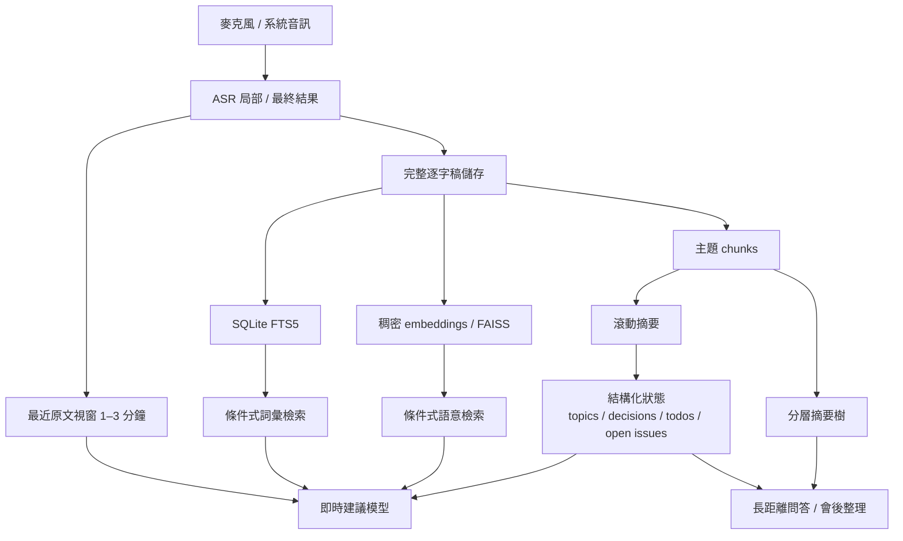
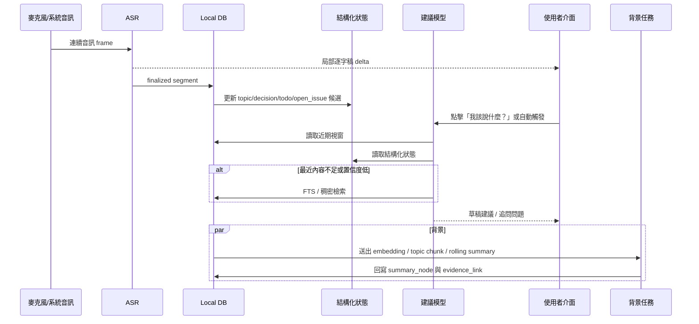

# macOS 會議助理的 LLM 脈絡管理與記憶架構研究

## 執行摘要

對一個要在 macOS 上同時提供即時轉錄、即時回覆建議、會議摘要與行動項目、互動式聊天，以及「我該說什麼？」「追問問題」按鈕的會議助理而言，**最佳實務不是把整份逐字稿一路塞進超長脈絡**，而是採用**分層記憶**：把最新的原文片段、滾動摘要、結構化狀態、完整逐字稿檔案庫，以及條件式檢索拆成不同層，分別服務不同延遲目標。這種方向與 MemGPT 的分層記憶觀念、RAPTOR 的樹狀摘要 / 檢索做法，以及對長脈絡中段資訊利用不佳的實證研究相符；後者顯示即使商用模型已提供 1M token 等級的上下文，單純依賴長脈絡仍不是穩健方案。citeturn39search0turn39search1turn11search6turn21search5turn36search15

若以產品體驗排序，**最低延遲路徑**應優先服務兩種場景：即時字幕與「我現在該怎麼回」。人類對談平均換手間隙大約在 200 毫秒量級，對話系統研究也長期把 250–500 毫秒級的反應視為自然互動的重要區間；同時，OpenAI Realtime 與 Gemini Live 這類官方介面本身就是為低延遲串流互動設計。因此，產品設計上應把「第一版建議」和「轉錄局部結果」放在最短路徑，把「高品質整理」放在背景路徑。citeturn7search0turn7search5turn10search0turn10search6turn8search0turn32view1

在儲存與檢索層，若產品第一階段是**單使用者、單裝置或少量跨裝置同步**，我建議把**SQLite + FTS5 + 本地向量索引**當成預設，而不是一開始就上 Milvus 或 Pinecone。原因不是 Milvus/Pinecone 不好，而是它們更適合雲端多租戶或大規模向量查詢；相對地，SQLite FTS5 已能提供外部內容表、`content_rowid` 對映、prefix index 與 BM25 類全文搜尋，而 FAISS 則可作為本地稠密檢索的零服務成本元件。對桌面型本地優先 App 來說，這條路在隱私、成本、可追溯性與除錯性上通常更優。citeturn25search0turn24search5turn24search2turn24search1turn24search6turn24search0

在模型部署上，**最合理的是混合式**：轉錄、最近 1–3 分鐘建議、基礎聊天可先盡量本地；高品質總結、跨段推理與複雜問答則可作為可選的雲端升級。Apple 已提供可直接存取 Apple Intelligence 核心裝置端 LLM 的 Foundation Models framework；Apple Speech 提供本地語音辨識能力；而在開源路徑上，MLX 針對 Apple Silicon 的統一記憶體做了最佳化，`llama.cpp` 則把 Apple Silicon 視為一級公民並透過 Metal 最佳化。若要追求更穩定的雲端品質與串流 API，OpenAI、Anthropic、Gemini 都有官方串流 / 即時路徑與提示詞 / 脈絡快取機制可用。citeturn4search22turn14search14turn4search24turn5search6turn5search0turn5search3turn5search1turn10search1turn21search17turn33view0

整體結論很明確：**把「最近原文 + 結構化狀態 + 滾動摘要」當成第一級記憶，把「完整逐字稿 + 條件式混合檢索」當成第二級記憶，把「遞迴摘要 / 分層摘要」當成背景整理層**。這會比「全靠長脈絡」或「一律先做向量搜尋」更符合會議助理的延遲、隱私、成本與工程複雜度。citeturn11search6turn11search1turn12search0turn39search1turn39search0

## 產品約束與延遲預算

會議助理其實不是單一工作流，而是同時包含四條不同的延遲路徑：**字幕路徑、即時建議路徑、互動問答路徑、背景整理路徑**。把它們混成同一套脈絡管線，通常就是延遲失控與 token 浪費的開始。官方文件也把串流轉錄、串流對話、批次摘要、提示詞快取明確分成不同產品模式；這代表你在架構上也應該分流，而不是期待單一 API 調用同時最佳化全部目標。citeturn15search1turn10search0turn10search2turn8search1turn22search5

下表是可操作的**工程延遲預算**。這不是官方 SLA，而是依據人類對談節奏與官方即時介面的設計方向，推導出的產品設計目標。

| 功能面 | 建議目標 | 為何這樣切 | 若超時會發生什麼 |
|---|---:|---|---|
| 局部字幕顯示 | 200–500 ms 內有第一批字 | 人類對談換手很快，字幕若太慢，使用者會失去「跟上現場」的感覺。citeturn7search0turn7search5turn15search1 | 會覺得「字幕在追會議」而不是「字幕在陪會議」 |
| 最終逐字稿定稿 | 0.8–2.0 s | Realtime transcription 官方就提供延遲 / 準確率取捨；這是合理的定稿區間。citeturn15search1 | 後續摘要與檢索會吃到太多未定稿內容 |
| 「我該說什麼？」第一版建議 | 0.5–1.2 s | 這個按鈕服務的是當下發言壓力，不必一開始就最完美，但必須先可用。citeturn7search0turn10search6turn32view1 | 使用者已經開口，建議才出現 |
| 「追問問題」短清單 | 0.8–1.5 s | 問題生成可以比答句稍慢，但仍應維持互動感。citeturn7search5turn8search0 | UI 像背景任務，不像互動工具 |
| 滾動摘要 / 決策 / todo 更新 | 5–15 s 背景刷新 | 這些是「次即時」資訊，重點是穩定與可追溯，不是毫秒級。citeturn12search0turn13search2 | 摘要過舊，聊天與結束後筆記失真 |
| 會後總結與行動項目 | 10–60 s 內完成 | 適合 map-reduce / 遞迴摘要，非即時路徑。citeturn12search0turn12search5turn13search2 | 用戶等待感上升，但不破壞會中互動 |

對 macOS 本地優先設計而言，**本地資料要成為權威副本**。本地優先的核心主張本來就是本地可讀寫、可離線、可跨裝置同步，但不是把伺服器當唯一真相來源；這非常符合會議內容高度敏感、又常需離線的場景。SQLite 的 WAL 模式也很適合這類桌面管線，因為它讓讀取與寫入併行更友善，而不需要你先引入大型伺服器資料層。citeturn38search0turn19search1turn19search13

安全面上，macOS 的**最低標準**應該是：密鑰放 Keychain、磁碟至少依賴 FileVault 保護、資料庫可另外用 SQLCipher 做 App 級加密。Apple 的官方文件明確指出 Keychain 是儲存小型敏感資料的加密資料庫；FileVault 提供整碟保護；SQLCipher 則是在 SQLite 之上提供 256-bit AES database encryption。對會議逐字稿、參與者資訊、摘要與待辦這類資料，這三層要分工，而不是只押注其中一層。citeturn37search2turn37search0turn37search1turn19search6turn19search18

## 記憶架構與脈絡管理技術

先講核心判斷：**長脈絡不是記憶架構。** 近年的商用模型雖然已能處理 1M token 級別上下文，但研究顯示模型在長上下文中對「中間位置」資訊的利用並不穩定；而 MemGPT、LongMem、RAPTOR 這一系工作之所以重要，就是因為它們都在嘗試把「有限脈絡視窗」變成「有層次的外部記憶系統」，而不是繼續把所有東西硬塞進提示詞。citeturn11search6turn39search0turn39search3turn39search1turn21search5turn36search15

因此，針對你的產品功能，應把記憶技術分成以下幾類看待：

| 技術 | 主要優點 | 主要缺點 | 最適合的產品功能 | 判斷 |
|---|---|---|---|---|
| **滑動原文視窗** | 最低延遲、保留原句、最適合即時回話。 | token 線性成長；跨長時間議題容易遺漏。citeturn11search6 | 「我該說什麼？」 | 必要，不能省 |
| **近期視窗 1–3 分鐘** | 對會中回應最實用；與人類短期對談節奏最接近。 | 若議題在 5–20 分鐘前，單靠此層不夠。citeturn7search0turn7search5 | 即時建議、追問問題 | 建議作為第一級記憶 |
| **滾動摘要** | 能把超出近期視窗的內容壓成低 token 成本的背景脈絡。 | 會累積摘要誤差；需定期重算。 | 會中持續摘要、聊天背景 | 建議作為第二級記憶 |
| **遞迴摘要 / Summ^N** | 能處理任意長度會議；適合長會議與會後整理。 | 多階段摘要有誤差傳遞；即時性較差。citeturn12search0turn12search4 | 會後摘要、長文件整理 | 背景任務適合 |
| **map-reduce 摘要** | 天然可平行化，實作容易，對長文穩定。 | 橫跨 chunk 的推理較弱。citeturn12search5turn11search3 | 會後總結、批次報告 | 工程性價比高 |
| **分層記憶 / 樹狀檢索** | 適合跨層級抽象與長時段問題查詢。citeturn39search0turn39search1turn39search3 | 建置與維護最複雜。 | 互動聊天、跨主題追問 | 作為成熟期升級 |
| **結構化狀態** | 直接服務 UI：topics、decisions、todos、open issues。 | 需要 schema、抽取器與一致性策略。 | 摘要卡片、行動項目、聊天 | 強烈建議與摘要並存 |
| **向量檢索** | 處理語意改寫查詢。 | 不是每次都該觸發；成本與複雜度高。citeturn11search1turn11search0 | 聊天查舊事、跨段檢索 | 條件式，不要常駐 |

對你的 use case，我建議的**分層記憶模型**如下：



這裡最關鍵的設計選擇，是把**「最近原文」與「結構化狀態」當成即時路徑的一等公民**。很多系統只做滾動摘要，結果「我該說什麼？」輸出的措辭變得太抽象、不像真人當場會講的話；反過來只保留原始逐字稿，則摘要與跨段回溯會一路膨脹。把這兩層拆開，才能同時兼顧口語保真與長時記憶壓縮。會議摘要研究也支持這點：長會議摘要常需要先定位相關跨度再做摘要，且行動項目導向整理與一般通用摘要不是同一件事。citeturn13search9turn12search11turn13search2

**結構化狀態**不應只是一個最後輸出的 JSON，而應該是中繼記憶層。建議至少維護以下物件：`topic`、`decision`、`todo`、`open_issue`、`participant_stance`、`risk_or_blocker`。這層的價值在於：聊天框查詢、摘要卡片、追問問題生成，都可以先查結構化狀態，再決定是否回頭讀原文。這比每次都從逐字稿重做抽取更穩，也更易做證據對應。citeturn13search2turn13search9

## 檢索、索引與證據鏈設計

對會議逐字稿檢索，**稠密檢索不是唯一答案，很多時候甚至不是第一答案**。Milvus 官方文件與 Pinecone 官方文件都把全文 / 稀疏與稠密的互補性寫得很清楚：稠密搜尋擅長語意改寫，全文 / 稀疏搜尋擅長保留專有名詞、縮寫、日期、數字與精確匹配。會議場景恰好大量包含人名、ticket ID、產品名、日期、數值、版本號，所以全文與語意混合檢索通常比純向量檢索更可靠。citeturn26search0turn26search2turn26search1turn26search5

### 建議的檢索路由

1. **先查結構化狀態**：若問題是「我們最後決定什麼？」「誰負責後續追蹤？」先查 `decision` / `todo`。
2. **再查近期視窗**：若問題與最近 1–3 分鐘相關，不做任何索引查詢。
3. **有詞彙錨點時先 FTS5**：人名、產品名、日期、版本號、工單號。
4. **語意不明或跨段追溯時再做稠密檢索**。
5. **最終用鄰接展開**：把命中的 segment 前後各擴 1–3 段，以免切得過碎。
6. **只在需要時做混合融合**：例如 Reciprocal Rank Fusion 或加權合併。

這種「條件式觸發」很接近 Self-RAG 的精神：檢索應該是按需，而不是固定每個請求都做。citeturn11search1

### 檢索後端比較

下表中的「延遲、複雜度」是**相對工程評級**，不是官方保證；功能與計費則以官方文件為準。

| 方案 | 典型部署 | 功能重點 | 成本特徵 | 隱私 | 工程複雜度 | 我對此產品的判斷 |
|---|---|---|---|---|---|---|
| **SQLite FTS5** | 完全本地 | external content table、`content_rowid`、prefix index、BM25 類全文搜尋。citeturn25search0 | 幾乎只有本地磁碟成本。 | 最佳 | 低 | 第一階段首選 |
| **FAISS + SQLite metadata** | 完全本地 | FAISS 是 similarity search library，可在本機做稠密檢索；metadata 另存。citeturn24search5turn24search2 | 無服務費；但要自己做持久化與映射。 | 最佳 | 中 | 本地語意檢索首選 |
| **Milvus / Zilliz Cloud** | 雲端／自管 | Milvus 2.5 已支援原生全文 / BM25 與混合搜尋。citeturn26search0turn26search2turn26search12 | Zilliz Cloud 為 pay-as-you-go，另有免費層。citeturn24search1 | 中 | 中高 | 適合團隊版／多租戶後期 |
| **Pinecone** | 雲端託管 | serverless、稠密 + 稀疏混合、metadata。citeturn26search1turn26search5 | 依 storage / read units / write units 計費。citeturn24search0turn24search6 | 中 | 中 | 若你要快速雲端上線可考慮，但單機版偏重 |
| **本地混合** | SQLite + FAISS | exact match 與 semantic 同時有；證據映射最清楚。 | 本地零邊際 API 成本。 | 最佳 | 中 | 最推薦的預設組合 |

如果你現在做的是**單人桌面 App**，我不建議一開始就把 Pinecone 或 Zilliz Cloud 放進核心路徑。那會讓你在還沒證明檢索真的必要之前，先承擔雲端成本、網路延遲、離線不可用與資料外送面積。只有在你要做**跨會議、跨裝置、跨使用者、雲端團隊知識庫**時，Milvus / Pinecone 的優勢才真正開始出現。citeturn24search0turn24search1turn38search0

### 逐字稿 segment ID 與摘要證據對應

這個產品若要可信，**摘要、決策與 todo 必須能回指原始逐字稿段落**。我建議把逐字稿切成「finalized utterance 段」作為最小證據單位，而不是直接以 provider chunk 當真相。SQLite FTS5 的 external content table 很適合這件事，因為你可以把 FTS rowid 直接對到自己的 `segment_rowid`，再用 triggers 維持一致性。SQLite 官方文件也明確提醒：external content table 的一致性要由應用端自己負責，常見做法就是 triggers。citeturn25search0

建議 schema 可以長這樣：

```sql
CREATE TABLE transcript_segment (
  segment_rowid INTEGER PRIMARY KEY,
  segment_id TEXT UNIQUE NOT NULL,          -- 例如 mtg_123_000123_000145_spkA
  meeting_id TEXT NOT NULL,
  speaker_id TEXT,
  start_ms INTEGER NOT NULL,
  end_ms INTEGER NOT NULL,
  text TEXT NOT NULL,
  is_final INTEGER NOT NULL DEFAULT 1,
  revision_of_segment_id TEXT,
  topic_id TEXT,
  token_count INTEGER,
  created_at TEXT NOT NULL,
  updated_at TEXT NOT NULL
);

CREATE VIRTUAL TABLE transcript_fts USING fts5(
  text,
  content='transcript_segment',
  content_rowid='segment_rowid',
  prefix='2 3 4'
);

CREATE TABLE summary_node (
  node_id TEXT PRIMARY KEY,
  meeting_id TEXT NOT NULL,
  level TEXT NOT NULL,                      -- rolling / topic / section / final
  span_start_ms INTEGER,
  span_end_ms INTEGER,
  summary_text TEXT NOT NULL,
  parent_node_id TEXT,
  version INTEGER NOT NULL,
  created_at TEXT NOT NULL
);

CREATE TABLE evidence_link (
  target_type TEXT NOT NULL,                -- summary_node / decision / todo / open_issue
  target_id TEXT NOT NULL,
  segment_id TEXT NOT NULL,
  quote_start_char INTEGER,
  quote_end_char INTEGER,
  weight REAL,
  PRIMARY KEY (target_type, target_id, segment_id)
);

CREATE TABLE state_item (
  item_id TEXT PRIMARY KEY,
  meeting_id TEXT NOT NULL,
  item_type TEXT NOT NULL,                  -- topic / decision / todo / open_issue
  canonical_text TEXT NOT NULL,
  status TEXT,
  assignee TEXT,
  due_date TEXT,
  confidence REAL,
  last_updated_at TEXT NOT NULL
);

CREATE TABLE embedding_ref (
  segment_id TEXT NOT NULL,
  embedding_model TEXT NOT NULL,
  vector_slot INTEGER NOT NULL,
  PRIMARY KEY (segment_id, embedding_model)
);
```

這種設計的意義在於：**摘要與狀態不直接「擁有」事實，`transcript_segment` 才擁有事實，`evidence_link` 只是在做證據鏈。** 這樣一來，若 ASR 修正了一段逐字稿，你只要更新 segment 與其關聯證據，再局部重算受影響的 summary node / state item，而不需要整庫重跑。這也比把一切交給 hosted file search 更適合會議助理，因為你需要的是**跨度級 provenance**，不只是「大致來自哪個 chunk」。citeturn25search0turn27search1turn21search15turn27search6

### 同步與一致性

若你走本地優先，我建議把 **SQLite/SQLCipher 當單機真相來源**，再額外維護一張 append-only `sync_oplog`。對單使用者多裝置同步來說，CRDT 並非必需；本地優先論文指出 CRDT 是很有潛力的基礎，但它真正必要的場景通常是多方同時編輯與長時間離線衝突。若你的 App 主要是「同一個使用者在 Mac 與 iPhone / iPad 間同步」，大多數資料類型可用**不可變逐字稿 + 欄位級 merge 的狀態**解決。只有在你要做協作式會議筆記編輯時，才值得把 note body 升級到 Automerge 這種 CRDT。citeturn38search0turn19search19turn19search0

## 模型部署、API 整合與成本

### 部署路徑的現實選擇

本產品可以分成三種部署哲學：**全本地、全雲端、混合式**。全本地最有隱私優勢；全雲端最有模型品質與運維便利；混合式則最符合桌面會議助理的實際需求。Apple 已將裝置端 LLM 能力透過 Foundation Models 開放給 App；MLX 則針對 Apple Silicon 的統一記憶體最佳化，`mlx-lm` 支援量化與微調；`llama.cpp` 也已明確把 Apple Silicon + Metal 當成一級路徑。這意味著「本地小模型 + 雲端大模型」在 macOS 上是很可行的工程選擇。citeturn4search22turn5search6turn5search0turn5search3turn5search19turn5search1

對語音路徑，Apple Speech framework 能處理即時或預錄音訊，官方也早就展示過裝置端辨識與自訂詞彙；OpenAI 則把即時轉錄與語音轉文字分成 Realtime transcription 與 Audio API 兩條路，並提供 `gpt-realtime-whisper` 的延遲 / 準確率調節；Gemini Live 也是雙向即時串流；Anthropic 目前以文字 / SSE 串流為主，因此若你要做低延遲字幕或語音互動，OpenAI / Gemini 的官方即時路徑更直觀。citeturn14search14turn4search21turn4search24turn15search1turn10search0turn8search0turn8search1

### 部署與整合選項比較

| 選項 | 優勢 | 主要風險 | 隱私面 | 開發複雜度 | 適合角色 |
|---|---|---|---|---|---|
| **Apple Foundation Models** | 官方裝置端 LLM，最貼近 Apple 生態與本地優先。citeturn4search22 | 平台可用性與能力邊界受 Apple 生態限制。 | 高 | 低中 | 本地摘要、輕量聊天、離線模式 |
| **MLX / MLX-LM** | 針對 Apple Silicon 統一記憶體；可量化、可微調。citeturn5search6turn5search0turn5search3 | 你要自己負責模型挑選、封裝、基準測試。 | 高 | 中高 | 本地 open-weight LLM 路徑 |
| **llama.cpp** | Apple Silicon + Metal 成熟；部署彈性高。citeturn5search1 | 需要自己處理模型 / 脈絡 / KV cache 工程。 | 高 | 中高 | 本地推理、fallback |
| **OpenAI 直連 API** | Realtime、Responses、提示詞快取、轉錄路徑完整。citeturn10search0turn10search2turn10search1turn15search1 | 有預設日誌保留；依網路與 token 計費。citeturn20search0turn20search11 | 中 | 中 | 雲端高品質建議、會後整理 |
| **Anthropic 直連 API** | SSE 串流、提示詞快取、ZDR、1M 脈絡。citeturn8search1turn21search17turn21search0turn21search5 | 即時音訊能力不是它的主軸；價格中高。citeturn30view0 | 中高 | 中 | 高品質聊天、長文推理 |
| **Gemini 直連 API** | Live API、價格低、脈絡快取、ZDR 路徑。citeturn8search0turn33view0turn22search4 | 預設 abuse monitoring 與 paid/free 行為差異要弄清楚。citeturn22search14turn22search2 | 中 | 中 | 成本敏感、低延遲雲端路徑 |
| **GitHub Models / Copilot BYOK** | 可用 GitHub 憑證與統一 token unit 計費；可把 OpenAI / Anthropic / Google 等模型掛到 Copilot。citeturn34view2turn34view0turn34view1 | 不是以即時音訊 / 轉錄為核心設計。 | 中 | 低中 | 模型評估、內部開發工具整合 |
| **Codex** | 是很好的程式碼代理。citeturn36search1turn36search2turn36search18 | 不是會議助理執行階段的最佳推理核心。 | N/A | 低 | 用來幫你開發 App，不是當 App 執行階段 |

我對 **GitHub Copilot / GitHub Models / Codex** 的判斷是：**它們更適合「開發與評估層」，不是會議助理的核心執行階段層。** GitHub Models 的價值在於模型 catalog、統一權限與 token-unit 計費；Copilot BYOK 的價值在於企業治理與既有供應商金鑰整合；Codex 的價值則在於幫你寫、測、修這個 App 本身。若你的產品要處理麥克風串流、會議字幕與即時建議，仍然應優先接 OpenAI / Gemini 這類官方即時路徑。citeturn34view2turn34view0turn34view1turn36search1turn15search1turn8search0

### 提示詞快取與脈絡快取的實際用法

會議助理非常適合使用快取，但前提是你要**只快取穩定前綴**。像系統指令、品牌語氣、會議目標、參與者背景、常見縮寫表、你的個人溝通風格，這些都適合快取；不適合快取的，是每秒都在改變的逐字稿尾端。OpenAI 已把提示詞快取當成近代模型的基礎能力；Anthropic 明確給出 5 分鐘 / 1 小時 cache write 與 cache hit 定價；Google 的 paid tier 也把脈絡快取獨立列價。citeturn10search1turn30view0turn33view0

### 成本估算

以下做兩個**工程估算**。假設：

- 60 分鐘會議；
- 30 次「我該說什麼？ / 追問問題」呼叫；
- 每次平均送出 **1,500 input tokens + 120 output tokens**；
- 會後再做一次 **20,000 input + 1,500 output** 的高品質總結。

| 用途 | 模型 | 估算成本 | 依據 |
|---|---|---:|---|
| 30 次即時建議 | OpenAI `gpt-5.4-mini` | 約 **$0.05** | input $0.75 / MTok、output $4.50 / MTok；依 45k input、3.6k output 換算。citeturn29view0 |
| 30 次即時建議 | Anthropic Claude Haiku 4.5 | 約 **$0.063** | input $1 / MTok、output $5 / MTok。citeturn30view0 |
| 30 次即時建議 | Gemini `gemini-3.1-flash-lite` | 約 **$0.017** | text input $0.25 / MTok、output $1.50 / MTok。citeturn33view0 |
| 會後高品質總結 | OpenAI `gpt-5.4` | 約 **$0.073** | input $2.50 / MTok、output $15 / MTok。citeturn29view0 |
| 會後高品質總結 | Claude Sonnet 4.6 | 約 **$0.083** | input $3 / MTok、output $15 / MTok。citeturn30view0 |
| 會後高品質總結 | Gemini `gemini-3.5-flash` | 約 **$0.044** | input $1.50 / MTok、output $9 / MTok。citeturn33view0 |
| 60 分鐘檔案轉錄 | OpenAI `gpt-4o-transcribe` | 約 **$0.36** | 官方估算 $0.006 / 分鐘。citeturn29view0 |

這些數字說明兩件事。第一，**即時建議本身未必昂貴**，真正昂貴的是你若每次都帶太多脈絡、或無條件做檢索與大模型總結。第二，**模型分層很重要**：用便宜模型承接快路徑，用較強模型承接慢路徑，能把成本壓到每場會議幾分到幾角美金的量級。citeturn29view0turn30view0turn33view0

### 隱私與資料保留取捨

若你要把會議內容送雲端，必須把供應商的保留與 ZDR 選項講清楚。OpenAI 官方文件說 API 內容預設會產生濫用監控日誌，通常保留到 30 天，並對符合條件的端點提供 Zero Data Retention；Anthropic 明確提供 ZDR，且說明在標準政策下不會未經你明示許可就把保留資料拿去訓練；Gemini Developer API 則說付費服務不會用 prompts / responses 改進產品，但預設 abuse monitoring 會保留 55 天，若專案獲准可進一步走 ZDR。這意味著**對高敏感會議內容，本地優先不是偏好，而是稽核與風險控制上的優勢**。citeturn20search0turn20search11turn21search0turn21search3turn22search4turn22search14

## 實驗設計與評估方法

你需要的不是單一基準測試，而是一個**四層評估框架**：ASR 層、檢索層、建議層、摘要 / 行動項目層。QMSum 提供 query-based meeting summarization，AMI 提供約 100 小時多模態會議語料，而 action-item-driven meeting summarization 論文則可用來驗證決策 / 行動項目導向整理是否比純摘要更適配你的產品。citeturn13search9turn13search1turn13search2

建議的**主要實驗矩陣**如下：

| 實驗變因 | 比較組 | 主要觀察值 |
|---|---|---|
| 近期視窗長度 | 30s / 60s / 180s | 即時建議延遲、人工有用度、token 使用 |
| 記憶策略 | 僅滑動視窗 / +滾動摘要 / +結構化狀態 / +混合檢索 / +分層摘要 | 相關性、幻覺率、跨段問題正確率 |
| 檢索策略 | 永遠檢索 / 只詞彙 / 只稠密 / 觸發時混合 | Recall@k、MRR、P95 延遲、token 成本 |
| 摘要策略 | rolling / map-reduce / recursive Summ^N / RAPTOR-style tree | 筆記品質、decision/todo coverage、證據可追溯性 |
| 模型部署 | 全本地 / 混合 / 全雲 | P50/P95 延遲、成本、隱私風險、開發負擔 |

量測指標建議分成六組。**延遲**：局部字幕首字時間、最終逐字稿定稿時間、建議首 token 時間、完整建議完成時間。**ASR**：WER/CER、領域術語召回率、人名 / 縮寫正確率。**檢索**：Recall@k、MRR、NDCG、證據跨度精準率。**建議品質**：人工評分「可說、得體、貼題、不中斷對話」。**摘要品質**：ROUGE、BERTScore、decision/todo coverage、錯誤歸因率。**成本**：每會議 token 數、cache hit rate、embedding 數、每會議總成本。這些指標本身是工程通用指標；其中特別要注意的是，對會議助理來說，**人工有用度評分規準比 ROUGE 更重要**，因為「像不像人當下會說的話」不是傳統摘要指標能完整捕捉的。這一點可用 QMSum 的 query-based 性質與 action-item 研究來支撐。citeturn13search9turn13search2

下面這個 sequence diagram，描述的是我建議的**即時資料流與記憶更新方式**：



一個很重要但常被忽略的實驗，是**檢索觸發閾值**。Self-RAG 的核心啟發在於：不該固定把檢索當成每次都要走的程序。你的 App 應該量測「不檢索時是否已足夠好」，並只在缺關鍵證據、問題明顯跨段、或 query 含詞彙錨點時再啟動混合檢索。這個閾值通常比選哪一家向量資料庫更影響整體成本與延遲。citeturn11search1

## 建議架構與實作里程碑

綜合以上分析，我給出的**推薦架構**是：

- **本地權威資料層**：SQLite（WAL） + SQLCipher，密鑰放 Keychain。citeturn19search1turn19search6turn37search2  
- **記憶層**：  
  - Tier 0：ASR 局部緩衝  
  - Tier 1：最近原文逐字稿 1–3 分鐘  
  - Tier 2：rolling summary  
  - Tier 3：structured state（topics / decisions / todos / open issues）  
  - Tier 4：完整逐字稿儲存 + FTS5 + 稠密索引  
  - Tier 5：topic-level / section-level / final-level hierarchical summaries  
- **檢索策略**：預設不檢索；有詞彙錨點先 FTS；語意改寫與長距離追溯再 dense；必要時 hybrid fusion。  
- **模型策略**：  
  - 快路徑：本地小模型或低成本雲端小模型  
  - 慢路徑：較強雲端模型做會後總結、跨段問答  
  - 只快取穩定前綴，不快取持續變動逐字稿。citeturn10search1turn21search17turn33view0  
- **證據策略**：所有摘要 / 決策 / todo 都必須能回指 `segment_id`。  
- **同步策略**：先做單使用者 append-only oplog；只有在多人同時編輯筆記時，再把 note body 升級到 CRDT。citeturn38search0turn19search19

我建議的里程碑順序如下：

| 里程碑 | 內容 | 產出物 | 風險控制重點 |
|---|---|---|---|
| **第一階段** | 本地轉錄、逐字稿儲存、近期視窗、基本按鈕建議 | 可用 MVP | 先把延遲與證據做對 |
| **第二階段** | 滾動摘要 + 結構化狀態 | 即時筆記 / 行動項目卡片 | 控制摘要漂移與狀態 schema 穩定性 |
| **第三階段** | SQLite FTS5 + 本地稠密檢索 | 聊天框可查舊事、可追證據 | 僅在觸發器觸發時檢索 |
| **第四階段** | 雲端高品質總結與可選供應商 | 高品質 final notes、進階聊天 | 做清楚 ZDR / 保留 / 地域配置 |
| **第五階段** | 本地優先同步、跨裝置備份 | Mac / iPhone / iPad 同步 | 單使用者先做 oplog，不急著 CRDT |
| **第六階段** | 分層摘要樹與主題層次檢索 | 長會議與跨會議問答更穩 | 用評估證明價值再增加複雜度 |

最後，若只能選一條最務實的落地路線，我的建議是：

**先做「本地優先 + SQLite FTS5 + 近期視窗 + 滾動摘要 + 結構化狀態」；等你用實驗證明檢索的實際收益後，再加本地 FAISS；等你確定有團隊知識庫或多租戶需求後，再考慮 Milvus / Pinecone。** 這條路最符合桌面會議助理的延遲、成本、隱私與維護平衡。citeturn25search0turn24search5turn24search6turn24search0turn24search1turn38search0

**核心來源與短註解**

| 來源 | 短註解 |
|---|---|
| Stivers et al., *Universals and cultural variation in turn-taking in conversation* citeturn7search0 | 人類對談換手時間的經典基線，適合拿來定義即時建議的 UX 天花板。 |
| Levinson & Torreira, *Timing in turn-taking* citeturn7search5 | 補充說明人類對談為何對延遲極端敏感。 |
| Liu et al., *Lost in the Middle* citeturn11search6 | 證明「長脈絡 ≠ 穩定記憶」，是本報告不建議全靠超長提示詞的核心證據。 |
| Packer et al., *MemGPT* citeturn39search0 | 分層記憶與虛擬脈絡的代表性研究。 |
| Sarthi et al., *RAPTOR* citeturn39search1 | 樹狀摘要與多層檢索，適合長會議與跨主題問答。 |
| Zhang et al., *Summ^N* citeturn12search0 | 長輸入多階段摘要框架，對會後總結和 map-reduce / 遞迴設計非常實用。 |
| Zhong et al., *QMSum* citeturn13search9 | query-based 會議摘要 benchmark，直接對應聊天框與「追問舊事」功能。 |
| Golia & Kalita, *Action-Item-Driven Summarization of Long Meeting Transcripts* citeturn13search2 | 強調行動項目導向整理與一般摘要不同，支持結構化狀態的必要性。 |
| SQLite FTS5 官方文件 citeturn25search0 | `content_rowid`、external content table、triggers、一致性責任，都在這裡。 |
| FAISS 官方文件／Repo citeturn24search5turn24search2 | 本地稠密檢索的標準工具，適合與 SQLite metadata 搭配。 |
| Milvus full-text / hybrid search 官方文件 citeturn26search0turn26search2 | 說明 sparse/dense 混合在 RAG 中的合理性。 |
| Pinecone hybrid search 官方文件 citeturn26search1 | 雲端 managed hybrid 檢索設計的直接參考。 |
| OpenAI 即時轉錄 / 提示詞快取 / 定價 citeturn15search1turn10search1turn29view0 | 即時轉錄、快取與成本設計的官方依據。 |
| Anthropic ZDR / 提示詞快取 / 定價 citeturn21search0turn21search17turn30view0 | 隱私合規與快取成本的代表性官方文件。 |
| Gemini Live / pricing / ZDR / abuse monitoring citeturn8search0turn33view0turn22search4turn22search14 | 低成本低延遲雲端方案與其資料治理邊界。 |
| Ink & Switch, *Local-first software* citeturn38search0 | 本地優先架構的原典，適合決定同步與真相來源。 |
| Apple Foundation Models / MLX / Speech / FileVault / Keychain citeturn4search22turn5search6turn14search14turn37search1turn37search2 | macOS / Apple Silicon 本地 AI 路線的核心官方與準官方依據。 |
