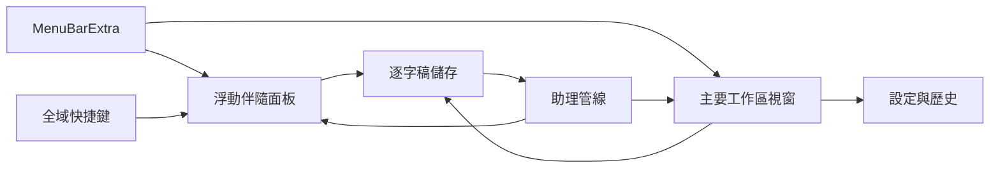
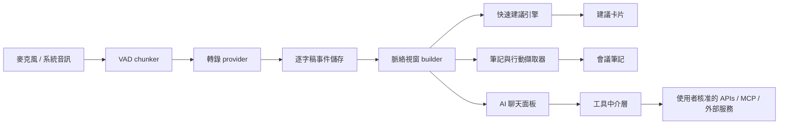
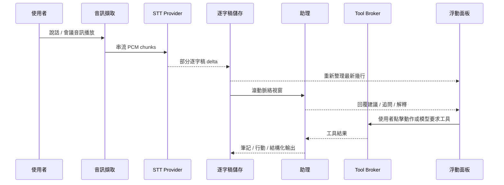

# 輕量 macOS SwiftUI 會議助理的架構與 UI/UX

## 執行摘要

對 macOS 上的會議助理 app 來說，最強的預設架構是**混合式，而不是單一介面**：以傳統 SwiftUI app 搭配一個用於逐字稿歷史、筆記、設定與匯出的**主要工作區視窗**；一個用於快速狀態與控制的 **MenuBarExtra**；以及一個供會議中使用的**精簡浮動伴隨面板**。這比永遠可見的 overlay 更符合 Apple 的視窗模型，能讓 UI 更容易被發現，也同時支援通話中的快速「掃一眼並行動」行為，以及會後更深入的工作流程。Apple 自身的指引把選單列附加項目定位為在 app 不是最前景時公開 app 特定功能的方式，而 SwiftUI/AppKit 現在也已經為伴隨視窗與工具面板提供良好的視窗管理基礎。 citeturn15search0turn15search9turn15search16turn12view0turn14view0

如果沒有指定部署目標，最乾淨的產品策略是**分層相容性階梯**：以 **macOS 13+** 作為廣泛基準，讓你可以使用 `MenuBarExtra` 與 `SMAppService`；加入 **macOS 15+** 增強功能，例如 SwiftUI 的 `windowLevel(.floating)`，以簡化浮動視窗行為；並可選擇性解鎖 **macOS 26+** 功能，例如用於較新裝置端語音管線的 `SpeechAnalyzer` / `SpeechTranscriber`，以及在支援 Apple Intelligence 的 Mac 上使用 Apple 裝置端 LLM 的 `FoundationModels` framework。這種分層能保持架構穩定，同時讓你在新的 Apple API 能實質改善 UX、隱私或延遲時逐步採用。 citeturn12view1turn8search0turn27search1turn28search8turn28search17turn32search0turn32search12

最重要的工程決策是**將即時轉錄與輔助生成分離**。不要讓整個 UI 或筆記管線依賴單一巨大的「AI 串流」。相反地，維護一份正規化的逐字稿事件紀錄，然後在其上執行次級智慧任務：針對最近幾句話快速生成建議、針對主題視窗進行較慢的摘要，以及針對已完成的逐字稿區塊在會後擷取行動項目。Apple 的語音 API、OpenAI 的 Realtime/Responses API、Anthropic 工具迴圈、Gemini Live，以及 GitHub 的模型/工具介面，都能以不同方式支援這種解耦方法。 citeturn6view4turn21view0turn21view1turn21view3turn21view5turn21view7

這個 app 應該**預設保持安靜**。在即時通話中，UI 不應顯示超過最新幾行逐字稿、一到兩個高信心建議，以及少量明確的使用者動作，例如「我該說什麼？」、「追問問題」、「摘要目前主題」、「擷取行動項目」與「解釋這段」。展開後的工作區可以呈現完整逐字稿、建議歷史、AI 聊天與匯出工具，但浮動介面應該針對注意力經濟最佳化，而不是追求功能密度。Apple HIG 對視窗、版面、工具列、寫作與無障礙的指引，都指向這種聚焦、低噪音的工具設計。 citeturn15search1turn15search4turn15search24turn15search3turn15search5

音訊擷取與權限是架構風險最高的領域。本機麥克風擷取透過 AVFoundation 很直接，但若要良好擷取 Zoom/Meet/Teams 中遠端參與者的聲音，就取決於**系統或 app 音訊擷取**，也就是 ScreenCaptureKit 或 Core Audio taps，並且需要正確的隱私揭露與明確的使用者授權流程。你應該把產品設計成即使只有麥克風存取權，也能優雅降級。 citeturn23search1turn23search4turn2view7turn4view5turn25search17

## 建議的 App 架構

理想的產品介面不是「主要視窗 vs. 選單列 vs. 浮動面板」。它應該是**三者皆有，各司其職**。選單列介面是控制塔。浮動面板是會議中的座艙。主要視窗則是封存、設定與完整工作區介面。SwiftUI 支援 `MenuBarExtra`、`Window`、`WindowGroup` 與 `openWindow`；AppKit 則提供浮動、非啟用式工具面板所需的額外精準度。 citeturn15search9turn11search6turn27search3turn12view5turn26search1turn26search5



建議架構是一個**混合式工具 app**。保留正常 app bundle 與一般的設定/歷史視窗，但讓使用者在會議期間主要透過選單列與可呼出的伴隨面板操作。這能保留可發現性，讓 onboarding 與權限流程更容易，也避免把浮動介面變成臃腫的桌面替代品。它也很契合 Apple 的生命週期與服務 API：macOS Ventura 及更新版本上的 `MenuBarExtra`、如果你選擇真正 agent 風格行為時可用的 `LSUIElement`，以及 macOS 13 及更新版本上用於明確登入項目行為的 `SMAppService`。 citeturn12view1turn15search0turn8search2turn8search0

**純選單列 agent app** 是可行的，但通常應該是可選模式，而非預設。Apple 的 `LSUIElement` 讓 app 可以在沒有 Dock 存在感的情況下以 agent app 執行，而 `MenuBarExtra` 也可以成為 app 的主要 scene。取捨是 agent 風格 app 更容易被使用者找不到、較難除錯，也更依賴優秀的選單列與面板 UX。對第一版來說，一個正常 app 搭配工具介面的營運簡潔性通常更好。 citeturn8search2turn12view1turn15search9

**完整覆蓋層或 HUD** 應該被視為特殊化功能，而不是主要介面。它對即時輔助來說看似很有吸引力，但更容易變得侵入、更容易在 Spaces/全螢幕工作流程中出問題，也更可能需要 AppKit 特定的視窗行為才會表現良好。AppKit 的 collection behavior 旗標可以幫助浮動視窗加入 Spaces 或作為全螢幕輔助介面，但這也正是覆蓋層應該被限制在精簡、明確使用時刻，而不是長時間佔據使用者螢幕的原因。 citeturn34search2turn34search0turn34search4turn34search5

### App 類型比較

| App 類型 | 最適合角色 | 優勢 | 弱點 | 建議 |
|---|---|---|---|---|
| 主要視窗 app | 設定、歷史、逐字稿封存、會後檢視 | 容易被發現、標準視窗行為、權限/onboarding 較容易 | 單獨用於即時通話太笨重 | 必要 |
| 選單列 app | 狀態、快速控制、快速入口 | app 不在最前景時仍可低摩擦存取 | 若單獨使用，不適合豐富的逐字稿/聊天工作流程 | 必要 |
| 浮動面板 | 會議中的逐字稿與建議 | 可掃視性與速度的最佳平衡 | 需要謹慎處理尺寸、焦點與 z-order 行為 | 必要 |
| Overlay / HUD | 暫時的緊急提示或迷你教練 | 最大可見度 | 注意力成本最高，行為也最脆弱 | 僅可選 |

上表是架構綜合，但支撐它的平台事實很具體：`MenuBarExtra` 的存在正是為了在 app 不活躍時提供常用功能；`Window` 旨在提供補充功能；AppKit `NSPanel` 支援浮動與非啟用行為；而 SwiftUI 加上 AppKit 正為工具視窗提供越來越強的定位、還原、工具列與視窗層級 API。 citeturn15search9turn27search3turn26search1turn26search4turn26search5turn14view0turn12view0

```text
即時會議的分析適配度
混合式選單列 + 浮動面板   █████
主要視窗 + 可分離面板       ████
僅選單列                    ██
持續性 overlay / HUD         ██
```

### 建議的架構變體

**基準架構** 應以 **macOS 13+** 為目標，主要 UI 使用 SwiftUI，僅在面板/視窗控制上使用 AppKit；麥克風擷取使用 AVFoundation；在啟用時以 ScreenCaptureKit 擷取遠端/系統音訊；採用逐字稿事件儲存；並在 STT + LLM 後端之上建立 provider abstraction。這是在能力與相容性之間最好的平衡。 citeturn12view1turn8search0turn2view7turn23search17

**進階現代架構** 可以鎖定 **macOS 15+ 或 macOS 26+**，用 SwiftUI 浮動視窗層級簡化部分視窗行為，同時取得較新的 Apple Intelligence 功能，例如 `SpeechAnalyzer`、`SpeechTranscriber` 與 `FoundationModels`。如果你願意用較窄的硬體/OS 相容性換取更多裝置端隱私，以及在某些任務上更少依賴第三方 API，這會很有吸引力。 citeturn27search1turn28search8turn28search17turn32search12

## 會議中使用的 UI 與 UX

會議助理是**次要注意力介面**，不是主要舞台。這個單一事實應該驅動整個設計。浮動面板應該可以一眼讀懂、以鍵盤優先，並且讓延遲透明可感。它應該顯示模型聽到了什麼、推論了什麼、建議了什麼，而不強迫使用者閱讀大段文字或追蹤不斷變動的介面。Apple 的寫作指引明確偏好簡單、平實且考慮無障礙與在地化的語言，而 HIG 對視窗與版面的指引也強調可調整、由使用者控制的視窗，而非僵硬介面。 citeturn15search3turn15search1turn15search4turn15search16

最好的互動模型是**三狀態**。閒置時，app 位於選單列，也可能只保留一個休眠快捷鍵。會議期間，精簡浮動面板只顯示最新逐字稿與主要動作。展開時，使用者得到包含逐字稿、建議、AI 聊天與筆記的完整工作區。這讓 app 在通話中感覺輕量，同時仍讓 power users 能在會後檢視脈絡、來源與歷史。SwiftUI 的 scene/window 模型與 AppKit 支援的面板非常適合這種分離。 citeturn12view0turn14view0turn26search1

### 精簡浮動面板示意圖

```text
┌ 會議伴隨工具 ─────────────────────────────────────────┐
│ ● 即時    EN-US    Zoom    00:18                    │
│                                                       │
│ 剛剛聽到                                              │
│ 「我們真的能在週五前出貨嗎？」                         │
│                                                       │
│ 建議回覆                                              │
│ 「如果範圍維持不變，週五是有可能的。如果我們加入        │
│ review 變更，我會想在今天測試後再確認。」              │
│                                                       │
│ [我該說什麼？] [追問問題] [解釋這段]                  │
│ [摘要主題]     [擷取行動項目]                         │
│                                                       │
│ 目前主題：發布時程                                     │
│ 行動候選：確認 QA cut-off 負責人 @Alex                │
└───────────────────────────────────────────────────────┘
```

精簡面板應強烈偏好**短回答卡片，而不是聊天泡泡**。建議卡片應包含：建議措辭、一行理由或「為什麼」、新鮮度指標，以及例如**複製**、**插入聊天草稿**、**詢問追問**或**釘選**的動作列。保持這些動作明確可以降低意外自動化，並透過讓每張卡片成為一致的動作目標，而不是一群細小 affordances 的集合，來協助無障礙。SwiftUI 的無障礙 API 很適合把整張卡片建模為帶有命名動作的 combined element。 citeturn16search7turn16search4turn16search5

### 展開工作區示意圖

```text
┌ 工具列：會議 • 匯出 • 搜尋 • 篩選器 • 設定 ─────────────────────────┐
│ 逐字稿                         │ 建議                         │ AI 聊天       │
│                                │                              │               │
│ Alex：週五能出貨嗎？            │ 回覆                         │ 詢問任何      │
│ 你  ：我們需要確認 QA...         │ 如果範圍維持不變...          │ 關於目前      │
│ Priya：還有哪些阻礙？           │                              │ 主題、術語    │
│                                │ 追問                         │ 或決策的問題  │
│ ─ 主題分隔 ─                   │ - QA cutoff 是什麼？         │               │
│ 發布時程                       │ - 哪些任務有風險？           │               │
│                                │                              │               │
│ 行動候選                       │ 解釋這段                     │ 帶工具        │
│ - 確認 QA cutoff 負責人 Alex    │ 「Cutoff」= candidate build │ 歷史的        │
│ - 下午 4 點前凍結範圍           │ 最後可接受時間點             │ chat thread   │
└─────────────────────────────────────────────────────────────────────────────┘
```

展開工作區應使用**三欄心智模型**：左側逐字稿作為可信來源，中間建議作為短期行動平面，右側 AI 聊天作為探索平面。這能避免聊天面板取代逐字稿，而這是會議工具中常見的 UX 失敗。Apple 的工具列指引也支持將控制項依邏輯區段分組，而不是把所有東西壓扁成一列忙亂的控制列。 citeturn15search24turn15search1

### 建議的 UI 規則

一次不要顯示超過**兩張自動生成的建議卡片**。超過這個數量，面板就會變成閱讀任務。讓最新的高信心建議位於頂端，並讓較低優先序的輔助功能，例如「解釋這段」或「摘要目前主題」，只在使用者明確動作後或偵測到停頓時出現。這不是 Apple 規則；它是一個 cognitive-load 建議，來自使用者主要工作仍然是會議本身這個事實。Apple HIG 對清晰、聚焦視窗、分組控制與平實語言的強調，支持這種克制做法。 citeturn15search2turn15search24turn15search3

建議卡片上的預設動作應該是**複製**，而不是直接輸入到另一個 app。如果日後加入「貼到目前 app」或更豐富的跨 app 插入，應將它視為進階功能，因為控制其他 app 會把你帶向 macOS 無障礙自動化 API，例如 `AXUIElement`，這會增加權限表面積與脆弱性。 citeturn36search2turn36search5turn36search14

對你列出的特定一鍵按鈕，請將它們作為**穩定 intent**，而不是短暫 prompt 標籤。「我該說什麼？」應該永遠生成短而可說出口的回應。「追問問題」應該永遠產生不超過三個短問題。「摘要目前主題」應該只摘要目前活躍的主題視窗，而不是整場會議。「擷取行動項目」應該偏好動詞與負責人。「解釋這段」應該解釋目前選取的術語、句子或主題。穩定的 intent 語義能改善信任、快取、評估與在地化。這是產品建議，但它符合 Apple 對清楚、平實寫作與無障礙標籤的指引。 citeturn15search3turn10search7

## 平台限制與系統能力

技術上的難點不是 SwiftUI，而是**macOS 隱私控制下的音訊擷取**。在 macOS 10.14 及更新版本上，麥克風存取需要明確的使用者授權。Apple 的 AVFoundation authorization 文件與平台 resource keys 清楚說明了這個基準。對任何會議助理而言，權限必須在系統提示出現前以產品語言說明；否則拒絕率與使用者困惑都會很高。 citeturn23search1turn23search4turn9search11

對**麥克風擷取**來說，AVFoundation 是直接路徑。`AVAudioEngine` 在即時情境中很有用，而 `installTap` 可讓你在 engine 執行時觀察 PCM 緩衝區，但 Apple 文件指出每個 bus 只能有**一個 tap**，這表示你的架構應該從單一音訊服務分流緩衝區，而不是允許每個子系統註冊自己的 tap。這對即時轉錄、VAD、波形渲染與錄音都很重要。 citeturn25search22turn25search1

對**通話/系統音訊**而言，ScreenCaptureKit 是可信度最高的 Apple 原生路徑。Apple 推出它時將其定位為高效能螢幕擷取 framework，並明確提到 app 層級音訊過濾；Apple 也指出使用者對螢幕擷取的同意會儲存在系統隱私設定中。較新的 ScreenCaptureKit 更新加入了麥克風擷取支援並改善擷取控制，這讓它比剛推出時更適合會議助理 app。 citeturn2view7turn23search24turn4view5

如果你需要**來自特定行程或行程集合的輸出音訊**，Core Audio taps 是另一條官方路徑。Apple 的 Core Audio tap 文件說明 audio tap 物件可以指定要擷取哪些行程或行程群組，並可選擇 mixdown 選項。當你想要「只擷取會議音訊」而不是整個螢幕擷取時，這會很強大，但它比基本麥克風擷取更特殊化。 citeturn25search17turn3search21

對**語音轉文字**而言，Apple 現在有兩個非常不同世代的 API。較舊的 Speech framework 可以辨識即時或預先錄製的音訊，而 Apple 先前也針對受支援案例強調本機裝置端辨識。較新的 `SpeechAnalyzer` / `SpeechTranscriber` stack 則是更重要的前瞻選項：Apple 在最新 SDK 世代引入它，將其定位為比 `SFSpeechRecognizer` 適用更多使用案例，並明確展示對話品質轉錄、長篇使用、遠距語音，以及透過 async sequences 處理即時結果。Apple 文件也將新的「進階語音轉文字能力」範例與 `SpeechTranscriber` 標示為 **macOS 26.0+** 功能。 citeturn23search17turn28search11turn6view4turn35search1turn28search8turn28search17

這導向清楚的版本策略。如果需要最大相容性，請在 abstraction 後方使用較舊的 Speech framework，或使用雲端/裝置端第三方 STT provider。如果可以要求最新 Apple stack，`SpeechAnalyzer` 與 `SpeechTranscriber` 應該成為主要 Apple-native 路徑。Apple 也指出 `SpeechTranscriber` 支援一組目前語言並會加入更多語言，並在裝置或語言不受支援時建議使用 `DictationTranscriber`。 citeturn28search4turn35search9

語音隱私揭露很微妙。Apple 的 `NSSpeechRecognitionUsageDescription` key 被特別描述為告訴使用者 app 為何要求**將使用者資料傳送到 Apple 語音辨識伺服器**的訊息。這表示你不應把麥克風權限與語音權限合併成一個泛用說明。如果你的產品在某些路徑可以完全本機運作，而另一些路徑會遠端處理，請在 onboarding 與設定中反映這個差異。 citeturn23search2turn23search22

對**背景與啟動行為**而言，除非真的需要 helper executables，否則請使用標準 app 生命週期模式。`SMAppService` 是 Apple 目前用於註冊 LoginItems、LaunchAgents 與 LaunchDaemons 的 API，但會議助理通常應該留在更簡單的世界：一個主要 app 加上可選登入項目。當你想要沒有 Dock icon 的 agent-app 行為時，Apple 的 `LSUIElement` flag 可以做到。LaunchDaemons 與 privileged helpers 是給非常不同類型的軟體使用，對會議助理來說會不必要地複雜化審查、信任、除錯與發佈。 citeturn8search0turn8search3turn8search4turn8search2

對**全域快捷鍵**而言，如果你只需要「呼出面板」和少數全域命令，最乾淨的產品路徑是使用正規快捷鍵註冊機制，而不是原始 event tap。開源 `KeyboardShortcuts` 套件被廣泛使用，明確說明其支援沙盒並與 Mac App Store 相容，也指出它使用 Carbon 來做全域快捷鍵，因為 Apple 尚未推出現代替代品。相較之下，Apple 的 Quartz event-tap 文件清楚指出，廣泛鍵盤監聽會依你使用 tap 的方式把你帶向 Input Monitoring 或 Accessibility 類型的權限。 citeturn24view0turn33search2turn33search0turn33search20turn33search11

### 權限與擷取矩陣

| 能力 | 典型 API 路徑 | 使用者可見的系統權限 | 備註 |
|---|---|---|---|
| 麥克風語音擷取 | `AVAudioEngine`, `AVCaptureSession` | 麥克風 | 基準需求 |
| 遠端/app/系統音訊擷取 | `ScreenCaptureKit`, Core Audio taps | Screen & System Audio Recording，或擷取特定揭露 | 完整通話脈絡所需 |
| Apple 伺服器支援的語音辨識 | 使用 Apple 伺服器的 Speech framework 路徑 | Speech Recognition | 說明為何音訊會離開裝置 |
| 任意鍵盤監聽或 app 控制 | Event taps / AX APIs | Input Monitoring 和/或 Accessibility | 除非功能真的需要，否則避免 |

這張表是面向產品的綜合，但其底層權限表面直接來自 Apple 的 AVFoundation 授權文件、Speech resource keys、Screen & System Audio Recording 支援資料、Quartz event services 與 Accessibility APIs。 citeturn23search1turn23search22turn23search24turn33search2turn33search11turn36search2

## SwiftUI 與 AppKit 實作筆記

這個 app 應該**以 SwiftUI 為主、選擇性使用 AppKit**。SwiftUI 現在已經成熟到足以處理大多數 macOS 工具型 UI，包括 `MenuBarExtra`、`Window`、`WindowGroup`、工具列、設定與狀態驅動版面。這個產品缺少的部分主要是視窗行為細節，而這正是 AppKit 仍然重要的地方：`NSPanel`、非啟用行為、跨 Spaces 的 collection behavior，以及較舊 macOS 版本的相容性。Apple 自身關於將 SwiftUI 與 AppKit 搭配使用的指引，很支持這種混合方法。 citeturn11search11turn11search5turn11search20

### Scene 結構

```swift
import SwiftUI

@main
struct MeetingAssistantApp: App {
    @State private var appState = AppState()

    var body: some Scene {
        Window("會議助理", id: "main") {
            MainWorkspaceView()
                .environment(appState)
        }

        MenuBarExtra("會議助理", systemImage: "text.bubble") {
            MenuBarStatusView()
                .environment(appState)
        }
        // 在較新的系統上，你可以選擇選單或視窗呈現樣式。

        Settings {
            SettingsView()
                .environment(appState)
        }
    }
}
```

針對 singleton 風格的補充介面，使用 `Window`；並使用 `openWindow` 從選單動作或快捷鍵以程式方式呼出它們。只有在你真的想要每場會議各自多視窗行為時，才保留 `WindowGroup`。SwiftUI 較新的視窗 API 也支援受控的定位、還原、尺寸與啟動行為，讓應該更像工具而不是文件的視窗能有合適手感。 citeturn27search3turn12view5turn14view0

### 浮動伴隨視窗

在 **macOS 15+** 上，SwiftUI 的 scene 層級視窗 API 開始減少你需要的 AppKit 橋接。尤其 `WindowLevel.floating` 存在於 macOS 15+，而 SwiftUI 也公開了 `windowLevel(_:)` scene modifier。如果你需要更廣泛相容性或更多控制，請以 `NSPanel` 支援伴隨介面。 citeturn27search1turn27search12turn26search1turn26search8

```swift
// 偽程式碼 / AppKit 支援的面板控制器
final class CompanionPanelController: NSWindowController {
    init(rootView: some View) {
        let panel = NSPanel(
            contentRect: NSRect(x: 0, y: 0, width: 420, height: 260),
            styleMask: [.titled, .fullSizeContentView, .nonactivatingPanel],
            backing: .buffered,
            defer: false
        )

        panel.isFloatingPanel = true
        panel.level = .floating
        panel.collectionBehavior = [
            .canJoinAllApplications,
            .fullScreenAuxiliary
        ]
        panel.titleVisibility = .hidden
        panel.titlebarAppearsTransparent = true
        panel.isMovableByWindowBackground = true
        panel.contentView = NSHostingView(rootView: rootView)

        super.init(window: panel)
    }

    @available(*, unavailable)
    required init?(coder: NSCoder) { nil }
}
```

`NSPanel` 是這個介面的正確概念模型，因為 Apple 明確區分浮動面板與一般視窗，而 `nonactivatingPanel`、浮動面板行為與 `NSWindow.Level` 正是為工具型視窗而存在。上方顯示的定位/跨 Space 行為是務實模式，不保證每種覆蓋層行為在所有全螢幕情境中都會有「系統感」。 citeturn26search1turn26search4turn26search5turn26search8turn34search0turn34search5

### 全域快捷鍵

```swift
// 使用 KeyboardShortcuts 的第三方範例
import KeyboardShortcuts

extension KeyboardShortcuts.Name {
    static let toggleCompanion = Self("toggleCompanion")
}

@MainActor
final class HotkeyController {
    init(appState: AppState) {
        KeyboardShortcuts.onKeyUp(for: .toggleCompanion) {
            appState.toggleCompanionPanel()
        }
    }
}
```

App 內快捷鍵仍應使用 SwiftUI 原生的 `.keyboardShortcut`，但系統範圍的呼出命令最好由專門的全域快捷鍵層處理。對這個產品來說，這通常比 event taps 更可取，因為它避免了不必要的 Input Monitoring 或 Accessibility 義務。 citeturn7search0turn24view0turn33search20

### 音訊擷取管線

```swift
import AVFoundation

actor MicrophoneCaptureService {
    private let engine = AVAudioEngine()
    private var continuation: AsyncStream<AVAudioPCMBuffer>.Continuation?

    func stream() -> AsyncStream<AVAudioPCMBuffer> {
        AsyncStream { continuation in
            self.continuation = continuation
        }
    }

    func start() throws {
        let input = engine.inputNode
        let format = input.outputFormat(forBus: 0)

        input.installTap(onBus: 0, bufferSize: 1024, format: format) { [weak self] buffer, _ in
            self?.continuation?.yield(buffer)
        }

        try engine.start()
    }

    func stop() {
        engine.inputNode.removeTap(onBus: 0)
        engine.stop()
        continuation?.finish()
    }
}
```

這個模式適合麥克風擷取的單一擁有權模型。如果你同時需要波形、VAD、錄音與 STT，請從單一擷取擁有者分流。Apple 文件說明 taps 可以在 engine 執行時安裝與移除，但給定 bus 上一次只能安裝一個 tap。如果你需要在嘈雜環境中清理本機語音，Apple 透過 `AVAudioEngine` 提供的語音處理 API 也值得評估，因為它們提供回音消除、降噪、自動增益控制與麥克風模式支援。 citeturn25search1turn25search24turn25search22turn6view6

### 逐字稿管線抽象

```swift
struct TranscriptDelta: Sendable {
    let text: String
    let isFinal: Bool
    let timestamp: Date
    let speakerHint: String?
}

protocol TranscriptionProvider: Sendable {
    func start(
        locale: Locale,
        audio: AsyncStream<AudioChunk>
    ) async throws -> AsyncStream<TranscriptDelta>
}

protocol AssistantProvider: Sendable {
    func suggest(
        context: MeetingContext,
        intent: AssistantIntent
    ) async throws -> AssistantResult
}
```

將 STT、助理推論與工具執行放在各自獨立的 protocols 後方。這讓你可以將 Apple-native STT 換成 OpenAI/Gemini/Whisper 風格串流；把「我該說什麼？」路由到非常快速、低延遲的模型；並把「擷取行動項目」路由到較慢但更結構化的模型。它也能避免 GitHub/Copilot/Codex 風格的 coding assistance 污染通用會議助理路徑。 citeturn21view0turn21view1turn21view5turn21view7turn22search3

### 效能筆記

即時逐字稿 UI 經常因為一個不華麗的原因變慢：太多 view 更新。Apple 近期的 SwiftUI 效能材料與 Instruments 指引明確點出長時間執行的 `body` 計算與頻繁更新原因。對這個 app 而言，讓逐字稿狀態只追加、定稿段落而不是反覆修改大型陣列、對建議重新計算做 debounce，並且在 UI 開始卡頓後才處理之前，就及早使用 SwiftUI instrument 進行 profile。 citeturn25search0turn25search5turn25search13

為了管線可見性與診斷，請使用結構化記錄，而不是 `print`。Apple 的 OS logging system 提供 `Logger`，並與 Console、`log` tool 和 Xcode 整合。將它與音訊切塊、逐字稿更新與建議延遲周圍的 signposts 搭配，讓你能看見系統實際卡在哪裡。 citeturn30search3turn30search7turn30search11

對會議、本段摘錄與行動項目的本機持久化而言，如果你想要一個能與 SwiftUI 順暢配合的現代 Swift 原生持久化層，Apple 的 `SwiftData` 是預設第一選擇。如果你預期會有大量逐字稿搜尋或自訂 SQL 工作流程，較底層的資料庫 stack 可能仍然更適合，但在未被證明不適合前，`SwiftData` 是正確基準。 citeturn30search2turn30search14

## 資料流與模型/API 整合

產品架構應把會議助理視為**三條平行通道**。第一條是低延遲音訊轉逐字稿。第二條是針對最後一句話或主題輪次的短視野輔助。第三條是針對筆記、摘要與行動項目擷取的長視野綜合。這個分工符合現代語音與模型 API 公開的能力：第一條使用語音/轉錄串流，第二條使用快速且具工具能力的聊天或即時 agents，第三條使用更結構化的 agent 迴圈。 citeturn21view0turn21view1turn21view3turn21view5



### 序列圖



### Provider 策略

對 Apple-native 語音而言，`SpeechAnalyzer` 與 `SpeechTranscriber` 是最新 OS 世代中最強的長期 Apple 路徑，尤其與受支援 Mac 上的 Apple Intelligence 功能搭配時更是如此。Apple 明確將新 stack 描述為比 `SFSpeechRecognizer` 更適合更多使用案例，並透過 async streams 展示即時轉錄，以及漸進式轉錄等面向對話的預設配置。 citeturn35search1turn28search8turn28search17turn35search11

對 OpenAI 而言，最清楚的分工是：當你需要持久低延遲音訊工作階段時使用 **Realtime**；當你需要 agentic 文字/動作迴圈、多輪工具編排、檔案/網頁搜尋或 remote MCP 時使用 **Responses**。OpenAI 文件明確區分 Realtime 中的語音 agent 工作階段、翻譯工作階段與轉錄工作階段，並將 Responses 定位為具備內建工具、function calling 與 remote MCP 支援的統一 agent 介面。 citeturn21view0turn21view1turn21view2

對 Anthropic 而言，也存在類似分工，但機制不同。Claude 工具使用區分由你的 app 執行的 **client tools** 與由 Anthropic 執行的 **server tools**，而 streaming 文件指出工具使用可能在模型組裝結構化工具輸入時帶來停頓。這讓 Claude 對聊天、筆記與結構化工具工作流程很有吸引力，但除非你把它與另一條 STT 路徑搭配，否則它較不自然地成為以語音為中心的 macOS 會議助理單一 stack 答案。 citeturn21view3turn21view4

對 Google 而言，**Gemini Live** 是最接近端到端低延遲多媒體會議助理後端的類似物。Google 官方文件將其描述為用於即時語音與視覺的 stateful WebSocket API，支援 raw PCM 音訊串流與 function calling。這讓它成為「持續聆聽並回應」通道上 OpenAI Realtime 的合理替代方案。 citeturn21view5turn21view6

對 GitHub 而言，要區分人們常混在一起的三件事：作為 inference/control plane 的 **GitHub Models**、作為工具/脈絡擴充機制的 **GitHub Copilot MCP**，以及作為特殊 coding surfaces 的 **Copilot/Codex 風格 coding agents**。GitHub Models 讓你透過 GitHub credentials 與帶有 `models` scope 的 PAT 呼叫多種模型；GitHub 也提供 GitHub Models 的 BYOK，但官方文件說明目前支援在 public preview 中限於 OpenAI 與 AzureAI。GitHub 的 MCP 文件將 MCP 定位為用來在多個 Copilot surfaces 上以工具與外部系統擴充 Copilot 的方式。 citeturn21view7turn21view8turn21view9

這個區分對你的產品很重要。如果會議助理是給開發者使用，那麼**類 Codex/Copilot 能力最好被建模為可選 skills**，而不是主要的會議大腦。當使用者詢問「解釋這個 stack trace」、「起草後續 issue」或「根據行動項目建立 PR note」時使用它們。不要讓 coding agent 成為會議逐字稿管線的擁有者。OpenAI 自身將 Codex 定位為會讀取、編輯與執行程式碼的 coding agent，這與逐字稿優先的會議助理重心根本不同。 citeturn22search3turn22search10

### 第三方 API 比較

| Provider / stack | 在這個 app 中最強的角色 | Audio-native | 具工具能力 | 最適合用於 |
|---|---|---|---|---|
| Apple SpeechAnalyzer + SpeechTranscriber | 最新 OS 上的裝置端 Apple-native STT | 是 | 本身沒有 LLM/tool layer | 即時逐字稿 |
| Apple FoundationModels | 受支援 Mac 上的裝置端 Apple 原生 LLM | 否 | App 定義的工具/回呼 | 私密筆記、解釋、摘要 |
| OpenAI Realtime | 持久低延遲音訊 session | 是 | 是 | 即時輔助 |
| OpenAI Responses | Agentic text/tool loop | 不是主要音訊路徑 | 是，包含 remote MCP | 筆記、行動、AI 聊天 |
| Anthropic Messages + tools | 結構化工具/聊天工作流程 | 沒有同等的原生語音導向 stack | 是 | AI 聊天、筆記、擷取 |
| Gemini Live | 低延遲語音+視覺 agent | 是 | 是 | 即時輔助替代方案 |
| GitHub Models / Copilot MCP | 治理、模型路由、開發者工具 | 不是主要語音層 | 是 | 開發團隊整合、程式碼相關動作 |

上方能力對應是綜合，但其事實基礎來自供應商自身文件：Apple 的 Speech 與 Foundation Models 文件；OpenAI 的 Realtime、Responses 與 tools 文件；Anthropic 的 tool-use 與 streaming 文件；Gemini Live 與 function-calling 文件；以及 GitHub 的 Models 與 MCP 文件。 citeturn28search8turn32search0turn32search12turn21view0turn21view1turn21view2turn21view3turn21view4turn21view5turn21view6turn21view7turn21view8turn21view9

### 工具中介層設計

所有外部 API 都應位於一個**具明確核准政策的工具中介層**後方。即使供應商支援自主工具使用，你的 app 仍應決定「自主」的意思。若你公開 GitHub、議題追蹤器、行事曆或程式碼動作，這尤其重要。GitHub 自身文件警告，一旦 MCP server 被設定，Copilot cloud agent 就可以自主使用那些工具且不會請求核准，而支援也有特定限制。在會議助理中，這作為預設太寬鬆。請在工具 API 上方建立自己的確認與範圍層。 citeturn21view10

```text
順暢會議助理的建議延遲預算
工程目標，而非平台保證

音訊切塊 / 停頓偵測        50–120 ms   ███
部分 STT 可見               150–500 ms  ██████
主要建議可用                300–1200 ms ███████████
delta 後 UI 重新渲染        <16 ms/frame █
```

這個預算是工程建議，而不是平台承諾，但它直接來自主要供應商都公開串流/持久工作階段基礎元件，以及 Apple 最新語音 API 強調即時 async 結果交付的事實。 citeturn21view0turn21view5turn35search9

## 安全性、無障礙、在地化與 HIG 對齊

安全性應圍繞**最小權限與清楚邊界**設計。除非有具體理由，否則使用 **App Sandbox**。啟用 **Hardened Runtime**。將供應商 token 與更新憑證儲存在 **Keychain Services**，而不是明文設定檔。讓第三方 SDK 合規與 **privacy manifests** 保持最新，因為 Apple 現在要求開發者同時為自己的 app 與包含的第三方程式碼思考這些問題。 citeturn17search14turn17search1turn17search5turn17search18turn17search3turn17search15turn17search26

逐字稿文字與會議筆記尤其敏感。從架構上看，最安全的模型是將**原始逐字稿**、**衍生筆記**、**工具憑證**與**遙測資料**分成不同儲存類別。憑證屬於 keychain。原始逐字稿與筆記可以放在具清楚保留控制的本機持久化中。除非使用者明確 opt in，否則 telemetry 應避免完整逐字稿 payloads。Apple 的安全與隱私 framework 文件沒有規定這套 schema，但它強烈指向限制權限，並將敏感使用者資料預設視為受保護。 citeturn17search13turn17search14turn17search18

無障礙對這類產品不是可選項。SwiftUI 已提供內建無障礙支援，以及 `accessibilityAction` 與 `accessibilityElement(children:)` 等明確 API；Apple 的 HIG 無障礙指引強調，可存取介面應不受個人能力或互動模式限制而正常運作。實務上，這代表浮動面板必須能完整以鍵盤導覽，建議卡片必須以有意義的分組無障礙元素呈現，而所有關鍵控制項都必須有穩定名稱與快捷鍵。 citeturn16search7turn16search4turn16search5turn16search13turn15search5

逐字稿介面值得額外用心。不要把每個標點符號層級的更新都作為獨立無障礙公告公開。相反地，依發話或已定稿段落分組更新，讓「最新逐字稿」區域可被識別，並提供「朗讀最新建議」或「釘選目前建議」等手動動作。SwiftUI 的分組與自訂無障礙動作正是為這類較高層次互動而設計。 citeturn16search2turn16search4turn16search5

在地化應使用**兩層**。靜態 UI 字串屬於 **String Catalogs**，Apple 在 Xcode 15 及更新版本中建議使用它，而且它可以在 builds 後自動解析 SwiftUI strings。模型生成內容應位於一個**回應語言政策**後方，而該政策可能不同於 UI locale。實務上，這代表 app 可能有英文 UI 但生成中文會議摘要，或反過來。Apple 的寫作指引也明確建議寫作時考慮在地化並避免 jargon。 citeturn10search24turn10search8turn15search3

針對中文與英文，浮動面板尤其應避免固定高度按鈕堆疊與過窄卡片。CJK 文字會垂直擴張，也會改變密集工具面板的視覺平衡。這是設計建議，而不是 Apple 規則原文，但 Apple 的版面指引強烈支持測試可調整大小的視窗與多種排列，而不是假設一種精簡版面能普遍穩定。 citeturn15search4turn15search16

### 與 HIG 對齊的檢查清單

| 設計領域 | 建議決策 |
|---|---|
| 選單列 | 用於快速存取與狀態，而不是擁有完整工作流程 |
| 視窗 | 讓使用者移動/調整主要視窗大小；保持伴隨面板精簡 |
| 工具列 | 依功能分組控制項，並讓整列保持安靜 |
| 標籤 | 各處都偏好短而直接的標籤，而不是類 prompt 措辭 |
| 無障礙 | 讓建議卡片可分組、具名稱，並能以鍵盤操作 |
| 在地化 | 靜態 UI 使用 String Catalogs；保持 LLM 語言可設定 |

這份檢查清單是對 Apple HIG 中選單列、視窗、版面、工具列、標籤、寫作與無障礙材料的綜合，而不是任何單一頁面的直接摘錄。 citeturn15search0turn15search1turn15search4turn15search24turn10search7turn15search3turn15search5

## 建議技術棧與優先來源

高可信度的實作技術棧如下：**SwiftUI** 用於主要 UI；**AppKit** 用於相容性安全的浮動伴隨面板；**AVFoundation** 用於麥克風擷取；在啟用時使用 **ScreenCaptureKit** 或 **Core Audio taps** 擷取遠端/系統音訊；**SwiftData** 用於本機會議 artifacts；**Logger / OSLog** 用於診斷；**SMAppService** 用於可選開機登入；**Keychain Services** 用於機密；並在語音 + LLM 後端之上建立供應商抽象層，讓你可以路由到 Apple 原生、OpenAI、Anthropic、Gemini 或 GitHub 支援的工作流程，而不必重寫 app 介面。 citeturn11search11turn26search1turn23search1turn2view7turn25search17turn30search2turn30search3turn8search0turn17search18

如果你想要最務實的出貨路徑，請從 **macOS 13+** 開始，使用 **KeyboardShortcuts** 做呼出快捷鍵，加入一個**浮動 AppKit panel**，並保持模型層供應商中立。接著再加入 **macOS 15+** 浮動視窗層級與 **macOS 26+** Apple 原生 STT / 裝置端 LLM 功能的現代程式碼路徑。這能讓第一版可建置、可測試，而不把整個 app 押在最新 OS 世代上。 citeturn12view1turn24view0turn27search1turn28search8turn32search12

### 來源優先順序

**最高優先順序** 應給 Apple 自身平台材料：HIG 中關於選單列、視窗、版面、工具列、寫作與無障礙的頁面；WWDC sessions，例如 *What’s new in SwiftUI*（關於 `MenuBarExtra`）、*Work with windows in SwiftUI*、*Tailor macOS windows with SwiftUI*、*Bring advanced speech-to-text to your app with SpeechAnalyzer*、*What’s new in ScreenCaptureKit* 與 *Optimize SwiftUI performance with Instruments*；以及 `SMAppService`、`LSUIElement`、`NSPanel`、`NSWindow.Level`、Speech、ScreenCaptureKit、Keychain Services 與 privacy manifests 的主要 API 參考。 citeturn15search0turn15search1turn15search4turn15search24turn15search3turn15search5turn12view1turn12view0turn14view0turn35search1turn4view5turn25search0turn8search0turn8search2turn26search1turn26search8turn17search18turn17search3

**第二優先順序** 應給主要模型供應商文件：OpenAI Realtime、Responses 與 tools；Anthropic tool use 與 streaming；Gemini Live 與 function calling；GitHub Models、BYOK 與 MCP。這些是能力邊界、工具呼叫語義與治理影響的權威來源。 citeturn21view0turn21view1turn21view2turn21view3turn21view4turn21view5turn21view6turn21view7turn21view8turn21view9turn21view10

**第三優先順序** 應給成熟、聚焦 macOS 的套件，用來撫平粗糙邊角，而不是重新定義架構。這裡最站得住腳的例子是 `KeyboardShortcuts`，用於使用者可設定的全域快捷鍵；以及如果你在 Mac App Store 外發佈並想要長期存在的 macOS 原生更新器路徑，可使用 Sparkle。請把它們作為戰術輔助，而非架構錨點。 citeturn24view0turn30search0turn30search4

### 開放問題與限制

精確的**遠端參與者最佳音訊擷取策略**仍取決於你想要整場會議擷取、特定 app 擷取、僅麥克風備援，或其組合，也取決於你願意支援的最低 macOS 版本。Apple 的 API 現在比以前涵蓋更多這個空間，但你仍需要有意識的相容性矩陣，以及在 Zoom、Meet、Teams、藍牙耳機與多螢幕配置上進行真實世界測試。 citeturn2view7turn4view5turn25search17

第二個未決選擇是你預設想要**一般 app**，還是預設想要 **agent-style `LSUIElement` mode**。研究強烈支持混合介面模型，但產品策略仍然重要：可發現性與 onboarding 有利於一般 app，而極簡性有利於 agent。兩者都可行；最保守的建議是先採用一般 app，日後再加入可選的純工具模式。 citeturn8search2turn15search0turn15search9

第三個開放決策是要把**裝置端智慧**推到多遠。Apple 最新的語音與 foundation-model APIs 很有前景，但它們需要最新 OS 世代與相容硬體。如果你的目標受眾包含較舊的 Mac，或涵蓋超出 Apple 目前支援範圍的混合語言會議，供應商中立架構仍然是更安全的基礎。 citeturn28search8turn28search17turn32search12turn28search4
