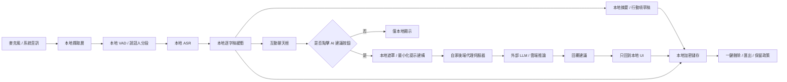

# macOS 會議助理應用程式的隱私、安全與倫理深度研究報告

## 執行摘要

對一個在 macOS 上提供即時轉錄、即時回覆建議、會議筆記與行動項目、互動式聊天框，以及「我該說什麼？」與「追問問題」按鈕的會議助理應用程式而言，最穩健的設計原則不是先問「能不能做」，而是先問「在什麼條件下，才應該做」。從法規、平台安全與倫理風險三條線索交叉看，最重要的結論是：**把這類產品預設成「全體參與者可見、可理解、可控制、可刪除、可稽核」的系統**，而不是把它做成「技術上可錄、先錄再說」的系統。美國聯邦法對許多私人情境給出「一方同意」基線，但加州對保密通訊採全體同意；EU/英國、台灣、中國、日本、澳洲則多半不能被簡化成單一的「一方/雙方同意」標籤，因為真正適用的是通訊保密、隱私、個資、職場監控與跨境傳輸等多重規範疊加。對跨境產品而言，**工程上的產品規則應直接採「明示通知 + 積極同意 + 同意證據留存 + 一鍵停止/刪除」**。citeturn39view0turn40view0turn9search0turn8search4turn10search0turn18search2turn22search0turn24search2

技術上，最佳實務不是純本地，也不是把所有內容都送雲端，而是**本地優先、雲端例外、按鈕觸發、資料最小化**。Apple 明確把 Keychain 定位為儲存密碼、金鑰、憑證與其他「小塊敏感資料」的加密資料庫，同時建議一般資料檔案仍存放於檔案系統；Apple 也提供 Secure Enclave 作為與主處理器隔離的硬體金鑰管理器，而 ATS 預設要求安全連線，採用 TLS 1.2、前向安全性與強密碼學。把這些訊號合起來，對會議助理最合理的架構是：**逐字稿與筆記本身存於加密檔案或加密資料庫；資料加密金鑰由 Keychain 管理；若需要硬體保護，使用 Secure Enclave 管理金鑰對，而不是把大型內容或任意 API 金鑰直接塞進 Secure Enclave**。citeturn33search1turn33search6turn26search2turn26search9turn27search3turn27search0

如果這是學生專題或展示，最強的建議不是研究更多模型，而是**降低真實資料風險**：預設使用合成對話、模擬通話、事先同意的參與者，以及轉錄前/送雲端前的名稱、公司名、郵件、電話、金額、病歷或法律事項自動遮罩；更進一步，避免把真實會議內容用於模型訓練，聚焦在產品流程展示。這不只是「保守」，而是最貼近 GDPR/UK GDPR 的資料最小化與儲存限制，也符合 Apple 近年的裝置端處理、透明與控制設計方向。citeturn34search9turn34search0turn28search14turn28search15turn31search1turn31search7turn31search2turn32search1

## 法域比較與同意設計

### 核心判斷原則

就產品設計而言，**不要把「法律可能允許一方同意」錯誤理解成「產品應該默默錄」**。即使在一方同意法域，若你同時做即時轉錄、筆記萃取、行動項目、雲端 AI 建議、跨境傳輸、供未來搜尋與匯出，你處理的不只是「錄音」，而是完整的個人資料處理鏈。這會同時觸發透明度、目的限制、資料最小化、安全措施、刪除權、資料可攜與紀錄保存等要求。當產品可能跨境、跨校園、跨企業、跨供應商時，工程規格最好直接採最高通用標準：**全體通知、全體可見、全體可理解、全體可退出**。citeturn5search1turn5search4turn5search6turn5search7turn8search4turn11view0turn18search2turn23search4

### 司法轄區比較表

| 法域 | 錄音／轉錄同意的高信心判斷 | 產品層面的同意揭露要求 | 日誌與證據保留建議 | 主要官方依據 |
|---|---|---|---|---|
| 美國聯邦 | **一方同意基線**：18 U.S.C. §2511 對非公權力人規定，只要當事人一方同意即可，但若目的在犯罪或侵權則不適用。州法可更嚴格。 | 啟動前顯示「正在錄音 / 轉錄 / 是否送雲端 AI」；不要把聯邦基線當成「可隱藏錄音」。 | 至少留存開始者、時間、顯示版本、是否開啟雲端、停止時間。 | citeturn39view0 |
| 加州 | **全體同意**：Penal Code §632 對保密通訊要求全體當事人同意；是否屬保密通訊，取決於是否合理期待內容只限於當事人。 | 需在開始前明示，且錄音指示應持續可見。 | 留存所有當事人已知曉／同意的證據；若有人退出，應立即停止。 | citeturn40view0 |
| EU / GDPR | **不是單純一方/雙方模型**：重點在合法依據、透明度、資料最小化、儲存限制與安全；若以同意為基礎，控制者須能證明同意；高風險監控可能需要 DPIA。音訊錄製通常較侵入。 | 層級式告知：目的、合法依據、是否雲端處理、保存期間、接收者、跨境傳輸、權利與申訴方式。 | 若以同意為基礎，必須能證明同意；Article 30 要求處理活動紀錄；高風險情境要做 DPIA。 | citeturn5search1turn5search4turn5search5turn5search6turn5search7turn36search17turn36search0turn9search1turn9search3 |
| 英國 | **不是單純一方/雙方模型**：LBP Regulations 對某些商務攔截有例外，但 UK GDPR 仍要求清楚且簡潔的隱私資訊；ICO 明示音訊監控高度侵入，應預設關閉。 | 需清楚告知誰在錄、為何錄、錄什麼、保存多久、是否分享、如何行使權利。 | ICO 建議記錄同意的「誰／何時／如何／對何事」；保留與目的相稱的證據。 | citeturn1search15turn8search4turn8search5turn8search0turn34search0 |
| 台灣 | **不宜簡化成一方同意**：刑法 315-1 對非公開活動、言論、談話的祕密錄音錄影設有限制；若處理可識別個資，個資法要求告知、同意（在適用時）與刪除/更正權。實務上對會議助理產品應採明示全體同意。 | 開始前告知蒐集目的、類別、利用期間/地區/對象/方式、權利與不提供時影響。 | 若主張同意，蒐集者負舉證責任；應留存同意證據與刪除/更正處理紀錄。 | citeturn10search0turn11view0turn12view2 |
| 中國 | **不是單純一方/雙方模型**：PIPL 要求充分知情下的同意、顯著方式告知；敏感個資需特定目的、充分必要與單獨同意；跨境提供需符合法定機制。若涉及聲紋等生物識別資料，要求更高。 | 必須明示目的、方式、種類、保存期限、接收方與跨境去向；敏感資料與境外提供應單獨告知/同意。 | PIPIA 報告與處理情況記錄至少保存三年；應具備刪除權處理機制。 | citeturn18search2turn17search4turn19search1turn19search3turn37search0turn37search6turn37search4 |
| 日本 | **無全國單一一方/雙方標籤**：PPC 指出，若錄音內容可識別個人，屬個人資料；APPI 本身不要求一定要把「正在錄音」單獨告知對方，但需要通知/公開利用目的，並遵守安全管理與第三方提供規則。產品上仍應採明示全體通知。 | 至少告知利用目的、第三方提供、保存與安全措施；若要跨服務分享，需看 APPI 的第三方提供規則。 | 保留利用目的告知證據、同意與第三方提供紀錄；於不再需要時刪除或停止使用。 | citeturn22search0turn20search0turn21search0turn21search3 |
| 澳洲 | **法制碎片化**：聯邦 TIA Act + 州/領地監控裝置法並行；AGD 也明示對私下對話的監聽/錄音禁令主要在州與領地法。OAIC 指出通話錄音中的聲音可能構成個資。跨澳洲產品應直接採全體同意。 | 錄音前告知目的、是否保存、是否分享；隱私政策需公開透明。 | 依 OAIC，應建立取得與記錄同意的程序；個資不再需要時應銷毀或去識別化；若發生嚴重資料外洩，可能觸發 NDB 通知。 | citeturn24search0turn24search2turn24search4turn23search3turn23search0turn23search14turn23search12turn35search7 |

### 同意揭露與記錄的實務做法

就「揭露」而言，最少應拆成四層。第一層是開始前的短告知：是否錄音、是否轉錄、是否送雲端、保存多久。第二層是進行中的可視狀態：錄音/轉錄中、雲端 AI 開或關、誰啟動。第三層是詳版隱私說明：處理目的、法源、接收者、跨境、權利、刪除與申訴管道。第四層是行為型微告知：例如按下「我該說什麼？」時再提示「本次會將最近 N 句摘要發送至雲端模型」。這種分層告知符合 ICO 對清楚簡潔隱私資訊與分層做法的方向，也符合 Apple 對情境式權限說明、不得操弄同意的要求。citeturn8search4turn8search1turn28search20turn38view1

就「記錄」而言，最穩健的同意記錄不應只記一個布林值。至少應記：會議 ID、開始/停止時間、啟動者、司法轄區判斷依據、畫面文案版本雜湊、各項開關狀態（錄音、轉錄、筆記、雲端建議、保存）、參與者確認方式、刪除/匯出/分享事件、供應商傳輸事件與回應狀態。這不是因為所有法域都逐欄強制規定，而是因為 GDPR 對同意的可證明性、Article 30 的處理活動紀錄，ICO 對同意記錄，與 NIST 對審計日誌的定義，都指向同一件事：**你需要可重建事實，而不是只留下「曾經同意過」一句話**。citeturn5search4turn36search17turn8search5turn30search2turn30search17

## 建議技術架構與安全設計

### 架構原則

對這類產品，最推薦的不是「所有功能都裝置端化」，而是**本地優先、最小傳輸、按需雲端、可驗證刪除**。把音訊擷取、VAD（語音活動偵測）、第一階段 ASR、說話人分段、初步筆記/行動項抽取放在裝置端；只有當使用者主動按下「我該說什麼？」或「追問問題」時，才把經過最小化與遮罩的最近對話摘要送到雲端模型。這樣做一方面貼近 Apple 近年的裝置端處理、透明與控制方向，另一方面也能降低 GDPR/PIPL 的跨境與供應商暴露面。citeturn28search14turn28search15turn29search0turn29search4turn5search1turn19search1

### 建議的隱私優先混合架構

上圖的關鍵不是「有沒有雲」，而是**雲只看到最小必要片段**。如果不經代理伺服器直接把供應商 API 主金鑰放在裝置端，金鑰外洩風險、供應商濫用面、金鑰輪替難度與稽核能力都會明顯變差；OWASP 也明確把機密管理的核心放在集中儲存、配發、輪替、稽核。對公開上線產品，**最好的做法通常是裝置端只持有短效、作用域受限的權杖，真正的第三方 API 秘密放在自家後端**。citeturn30search10turn33search1turn33search6

### 金鑰、加密與本地儲存

Apple 把 Keychain 定位成儲存密碼、加密金鑰、憑證、秘密資訊與其他「小塊敏感資料」的加密資料庫，而一般資料檔案應存於檔案系統；Secure Enclave 則是與主處理器隔離的硬體金鑰管理器，但 Apple 也明確說它支援的是特定型別的私鑰，而不是任意字串秘密。工程上的合理落地是：**不要把整份逐字稿丟進 Keychain；把逐字稿存在加密檔案/SQLite；用每場會議一把資料加密金鑰 DEK；DEK 由 Keychain 保護；若要更強保護，用 Secure Enclave 保護 KEK/私鑰，再包裝 DEK**。citeturn33search1turn33search6turn26search2turn26search9

在靜態資料保護上，FileVault 能提供磁碟層的靜態加密，但它不應是應用程式加密的唯一防線。FileVault 可保護遺失裝置、離線磁碟讀取等風險；應用層加密則可降低本機惡意程式、備份外流、或資料被複製到其他環境時的暴露面。對會議逐字稿、行動項目、匯出檔與嵌入向量索引，應視為同等敏感資料處理。citeturn26search3turn26search6turn26search10

在傳輸保護上，應盡量走 Apple 的 ATS/URLSession 預設安全路徑，避免任意放寬 ATS。Apple 指出 ATS 以 TLS 1.2、前向安全性與強密碼學建立安全通訊；關閉 ATS 或容許任意載入會降低隱私與資料完整性。對會議助理而言，這代表：**所有後端與第三方模型連線都應滿足 ATS；若非必要，不加例外；如需額外保護，可在伺服器信任驗證之上再加入憑證釘選或私有 CA 管理**。citeturn27search3turn27search5turn27search0turn27search6

### macOS 平台安全控制

對 macOS 應用程式本身，至少應啟用 App Sandbox，因為 Apple 明確把它描述為由核心層執行的存取控制技術，用於限制應用程式對系統資源與使用者資料的存取，降低應用程式被入侵時的破壞面。權限上應採最小 entitlements；不要在應用程式啟動時就申請麥克風，而是在真正開始轉錄時才申請；也不要要求不必要的 Full Disk Access。citeturn26search1turn26search5turn26search8

## 威脅模型與控制措施

### 威脅模型

這類應用程式同時暴露三種高價值資產：**內容資產**（音訊、逐字稿、筆記、行動項目）、**控制資產**（API 金鑰、權杖、管理權限）、以及**證據資產**（同意紀錄、匯出/刪除/分享日誌）。其中最容易被低估的威脅不是傳統中間人攻擊（MITM），而是「合法功能被不當使用」：例如課堂、學生社團、面試、師生會議、醫療諮詢、法律討論、績效會談，被某一方藉由應用程式做到不對稱監控。ICO 對音訊監控的描述非常明確：音訊監控具高度侵入性，因此應特別謹慎，且預設關閉。citeturn8search0turn5search1turn41search5

| 資產 / 面向 | 主要威脅 | 可能後果 | 建議控制 |
|---|---|---|---|
| 原始音訊 | 未經同意啟動、背景偷偷錄 | 法律風險、信任崩潰、紀律/校規問題 | 強制啟動前同意閘門、持續可視橫幅、全程可見狀態、快捷鍵停止 |
| 逐字稿與筆記 | 本機惡意程式、未加密檔案、備份外流 | 敏感內容大量暴露 | 應用層加密、每會議 DEK、Keychain 保護金鑰、Sandbox、匯出後水印與存取控制 |
| API 機密 | 裝置端硬編碼、長效權杖洩漏 | 供應商濫用、成本失控、資料外傳 | 不在客戶端存主密鑰；改用代理伺服器 + 短效權杖；金鑰輪替與稽核 |
| 傳輸通道 | 低安全 TLS、ATS 例外、第三方 SDK 外傳 | 竊聽、資料完整性受損 | ATS 預設、最小第三方 SDK、供應商 DPA、網域允許清單 |
| AI 提示 / 輸出 | 提示注入、越權摘要、幻覺行動項目 | 誤導使用者、錯誤決策、社交風險 | 人在迴路、AI 只建議不自動送出、不自動執行、輸出標註 AI 生成 |
| 同意與稽核日誌 | 日誌被篡改或缺失 | 無法證明合規、爭議無法還原 | 只能附加／具防竄改證明的日誌、權限隔離、時間戳與版本雜湊 |
| 匯出與分享 | 任意分享、過度可攜、含未遮罩敏感資訊 | 二次擴散 | 匯出前預覽、欄位級選擇、敏感詞遮罩、下載連結時效化 |

上表裡最值得額外點出的，是互動式聊天框與「我該說什麼？」按鈕帶來的 **AI 代理化風險**。如果系統把會議內容直接餵給模型，模型又能自動產生訊息、寄信、建立行事曆或呼叫外部工具，那麼對話內容本身就可能成為提示注入載體。OWASP 對 AI 代理類系統的建議非常明確：要記錄決策中繼資料、工具呼叫、結果，並對高風險動作保有人類授權與審計軌跡。對你的應用程式，最佳做法是：**永遠不要自動代替使用者發送內容；最多只給草稿；所有高風險動作都保持點擊確認**。citeturn30search7turn41search10turn41search14

## 介面透明度、倫理風險與學生專題展示

### 透明與可控制的使用者介面／使用者體驗（UI / UX）模式

對這種產品，最好的 UI 不是「把同意做得更不打擾」，而是「把狀態做得不可能被忽略」。macOS 本身已透過橘點、綠點、紫點提示麥克風、相機與系統音訊正在使用；你的應用程式應再額外提供**應用內持續顯示**：例如視窗上方常駐狀態列，顯示「正在轉錄」「雲端建議：關／開」「保留：只在本機／24 小時／直到手動刪除」「本次由 XXX 啟動」。Apple 同時要求開發者透明說明資料用法、第三方 SDK 蒐集，以及不得操弄、誘導或強迫使用者同意不必要的資料存取。citeturn28search7turn28search16turn38view1

建議把同意拆成至少四個獨立控制，而不是一個總開關：**錄音、轉錄、雲端 AI 建議、保留會議資料**。這樣做的原因是各法域對同意的要求都在反對綁定式同意；OAIC 對同意的解釋包含自願、知情、即時且具體，UK/EU 也要求清楚且細粒度。對教育場景，還建議在介面上加一個「敏感會議模式」，一鍵關閉雲端處理、匯出與長期保存。citeturn23search0turn8search4turn5search4

### 倫理風險與緩解

倫理上，這類產品至少有四類高風險。第一是**監控與權力不對稱**：學生、實習生、下屬或求職者可能很難真正自由拒絕被錄。第二是**偏差與不公平**：ASR 可能對口音、性別表現、語碼切換、非標準語更差；LLM 建議也可能偏向較強勢或較「職場化」說話風格。第三是**錯誤自動化**：AI 摘要可能漏掉否定詞、誤判責任歸屬，或把討論中的假設寫成決議。第四是**濫用**：錄到的逐字稿可被再利用於騷擾、勒索、學術不端、深偽材料或人格模仿。NIST AI RMF 將隱私增強、可問責且透明、有害偏見受管理且公平、安全、具防護且有韌性視為核心可信任特性，也提醒隱私風險會影響安全、偏差與透明度。citeturn41search0turn41search2turn41search5

因此，核心緩解措施應包括：**預設不把用戶資料用於訓練；AI 輸出永遠標示為草稿；不得自動送出；建立偏差評估集；對不同語者群體量測 WER / 建議錯誤率；給使用者快速回報與更正管道；保持人工最終裁量**。對高風險會議，應提供「不生成建議、只本地顯示逐字稿」模式。citeturn41search8turn41search10turn41search14

### 學生專題展示的低風險做法

若這是學生專題，最安全的做法是把真正想展示的能力拆開：展示 UI 流程、展示本地轉錄、展示回覆建議品質、展示刪除與匯出能力，但**不要以真實敏感會議做資料來源**。建議優先順序是：使用合成腳本與合成音訊；若一定要真人參與，僅找已明確同意的參與者，並避開健康、法律、成績、財務、未成年人隱私、師生紀律等內容；展示版本預設遮罩姓名、電話、電子郵件、公司名與地址；匯出檔加上「展示資料／合成或已同意樣本」標記。ICO 對匿名化／假名化的指引，以及 HHS 對去識別化的方法，都支持這種「先降低可識別性，再用於測試或展示」的方向。citeturn31search1turn31search7turn31search2turn31search8turn32search1

## 模板、實作清單與優先建議

### 建議的同意文案與 UI 文案

以下文案是**產品模板**，不是跨法域直接可上線的最終法律文本；正式上線前仍應依目標市場調整。其設計基礎來自透明度、最小化、可撤回與可證明同意等要求。citeturn5search4turn5search6turn8search4turn11view0turn18search2

**開始前對話框**

> **此功能會即時轉錄本次會議**  
> 我們會使用你的麥克風／系統音訊建立逐字稿、會議筆記與行動項目。  
>  
> 你可選擇：  
> - 僅在本機處理  
> - 在你點擊「我該說什麼？」或「追問問題」時，將最近的精簡內容傳送到雲端 AI 產生建議  
>  
> 我們會保存：  
> - 原始音訊：[不保存 / 24 小時 / 自訂]  
> - 逐字稿與筆記：[會後刪除 / 30 天 / 手動刪除]  
>  
> **你確認已告知所有參與者，且已取得其同意。**  
> [ ] 我已閱讀並同意開始轉錄  
> [開始轉錄] [取消]

**會議進行中橫幅**

> 正在轉錄 • 雲端 AI：關閉  
> 參與者已同意 • 保留：僅本機直到手動刪除  
> [停止] [刪除此會議] [匯出] [開啟雲端建議]

**按下「我該說什麼？」前的微告知**

> 將傳送最近 60 秒的**精簡摘要**到雲端模型以產生回覆建議。  
> 不會自動送出訊息。  
> [繼續] [取消]

**刪除確認**

> 這會刪除本機逐字稿、筆記、快取與搜尋索引，並對雲端資料送出刪除請求。  
> 法規或安全所需的最小審計紀錄可能會保留。  
> [永久刪除] [取消]

### 保留與刪除政策模板

保留政策不應寫成單一固定天數，而應寫成**目的導向 + 最短必要期間 + 類型區分**。UK ICO 明確表示法律通常不替你指定保存期限，但你必須能提出正當理由；若不再需要識別個人，就應匿名化。這意味著模板應區分「內容資料」與「證據資料」。citeturn34search0turn34search11turn35search18

**保留政策模板**

- **原始音訊**：預設不保存；若使用者明確開啟，保存期間為 `[0–24 小時 / 使用者自訂短期]`，到期自動刪除。  
- **逐字稿 / 筆記 / 行動項目**：保存至 `[會議結束即刪除 / 30 天 / 使用者手動刪除]`；若僅為即時輔助而非歷史知識庫，預設不長留。  
- **雲端推論暫存**：對供應商要求 `不訓練 / 不保存`；若供應商無法做到，應在 UI 中單獨揭露並預設關閉。  
- **匯出檔**：由使用者決定下載位置；應用程式不持續保留副本。  
- **同意與審計中繼資料**：只保留證明合規、安全與爭議處理所需的最小欄位，期間為 `[例如 6–12 個月]`；若你在中國法域進行需要 PIPIA 的處理，相關評估報告與處理紀錄應至少保存三年。  
- **刪除請求處理**：收到使用者刪除請求後，在 `[例如 7–30 天]` 內完成；若法律要求暫停刪除，僅保留儲存與必要安全措施，不再作其他處理。citeturn37search0turn37search6turn37search4turn35search18turn34search0

### 具體實作清單

以下清單按「最值得先做」排序，而不是按工程模組排序。每一項都對風險曲線有明顯影響。citeturn26search1turn27search3turn33search1turn28search14turn38view1turn30search17

**立即必做**

1. 啟動前同意閘門：未勾選「已告知所有參與者並取得同意」不得開始。citeturn40view0turn8search4turn11view0  
2. 進行中持續可視指示：狀態列 + 轉錄中橫幅，不只依賴 macOS 系統指示器。citeturn28search7turn28search16  
3. App Sandbox + 最小權限：僅在需要時申請麥克風，不要求不必要的授權項目。citeturn26search1turn26search5  
4. ATS 無例外：所有外部連線必須滿足安全基準。citeturn27search3turn27search0  
5. 逐字稿加密儲存：內容走加密檔案/DB，金鑰走 Keychain。citeturn33search1turn33search6  
6. 不把第三方模型 API 主金鑰放在客戶端；改用後端代理伺服器與短效權杖。citeturn30search10turn33search1  
7. 一鍵刪除：刪本機內容、搜尋索引、快取，並送出雲端刪除請求。citeturn35search18turn37search6  
8. 匯出前預覽與遮罩：讓使用者選擇是否隱去姓名/電子郵件/電話/公司名。citeturn35search0turn31search1  

**公開展示前應完成**

1. 合成資料與同意樣本資料雙軌流程。citeturn31search2turn32search1  
2. 「雲端建議」預設關閉，且只在按鈕觸發時送最小必要片段。citeturn28search14turn5search1  
3. 同意／刪除／匯出／分享審計日誌。citeturn5search4turn30search2turn30search17  
4. 不用使用者內容做模型訓練，除非另行取得獨立主動選擇加入。citeturn5search1turn18search2turn38view1  
5. 第三方 SDK 清點與隱私標籤文件化。citeturn38view1  

**若要正式上線到多法域**

1. 做 DPIA / 風險評估，特別是系統性監控、敏感內容與未成年人場景。citeturn36search0turn37search0  
2. 做供應商 DPA、跨境傳輸機制、資料流圖與處理活動紀錄。citeturn19search1turn36search17  
3. 建立事件通報流程與資料外洩應變手冊。citeturn5search7turn35search7turn37search0  
4. 對 ASR/LLM 做偏差與錯誤評估，明確標示 AI 輸出只是建議。citeturn41search0turn41search14  

### 優先建議

若只能先做最重要的五件事，我的排序如下。

**第一優先**：把產品規則直接設成**全體同意 + 顯式啟動 + 持續可見**。這一點同時解決加州、EU/UK 透明度、台灣個資告知、中國知情同意、澳洲碎片化法制的不確定性。citeturn40view0turn8search4turn11view0turn18search2turn24search2

**第二優先**：做成**本地優先、按鍵才送雲端**。即時轉錄與筆記盡量本地化；只有點按 AI 建議按鈕才上傳最小片段。這會同時降低法律、倫理與供應商風險。citeturn28search14turn29search0turn5search1

**第三優先**：**不要把第三方供應商密鑰放在客戶端**。Keychain 適合小塊秘密，但客戶端持有長效供應商主密鑰本身就是架構弱點；改採代理伺服器 + 短效權杖。citeturn33search1turn33search6turn30search10

**第四優先**：把**一鍵刪除、匯出與同意記錄**做完整。很多團隊會把錄音功能做完，但刪除與證據鏈做半套；在真實爭議裡，後者常比模型品質更重要。citeturn5search4turn36search17turn35search18turn30search2

**第五優先**：學生專題階段，**不要收真實敏感資料**。用合成資料和已同意樣本，一樣能展示產品能力，但風險曲線完全不同。citeturn31search2turn31search7turn32search1

### 開放問題與限制

這份報告優先使用官方法條、官方監理指引與 Apple 官方文件，但仍有幾點需要在實際上線前做在地法律確認。第一，**EU 與澳洲都不是單一法域答案**：EU 還有成員國規則與職場監控實務；澳洲還有州/領地監控裝置法。第二，**台灣、日本與中國對「會議參與者自行錄音」的可否範圍，在實務上高度依賴事實情境**，不能只靠單一句法條做絕對判斷。第三，若產品進入**校園、醫療、法律、未成年人、勞動管理**等特殊情境，還可能疊加校規、行業規範、契約或雇傭法要求。這些不是此報告能完全取代的正式法律意見。citeturn24search2turn9search0turn10search0turn22search0turn37search4
