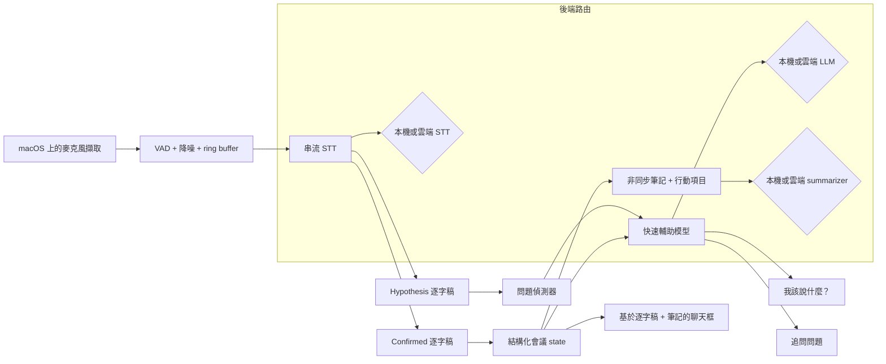

# 在 Apple Silicon 上打造即時 macOS 會議助理

## 執行摘要

在 Apple Silicon 上開發一款具備即時轉錄、回覆輔助、追問建議、筆記與聊天介面的 macOS 會議助理 App，在技術上是可行的，但前提是必須狹義定義「即時」，並為每個元件分配預算。在人類對話中，平均輪替間隙大約落在 200 ms 左右，這表示若回覆輔助系統等到完整、修飾過的答案才輸出，往往會錯過社交互動的時間窗口，除非它能提早串流部分意圖。與此同時，傳統電信指引顯示，高度互動的語音任務會受到遠低於 400 ms 的延遲影響，而一般 UX 指引仍將約 100 ms 視為「瞬時」回饋的邊界，約 1 s 則是流程開始感覺被打斷的邊界。實務上，會議助理因此應該鎖定三種不同的即時層級，而不是只設定單一目標：100 ms 內的立即 UI 確認、大致低於 1 秒範圍的即時字幕片段，以及在足以回答問題的內容已知後約 0.8–1.5 s 內出現第一個有用的回覆輔助。citeturn5search13turn39view0turn5search18turn36search8turn37search0

在轉錄路徑上，Apple 目前的原生技術堆疊對會議使用情境而言，實質上比舊版語音 API 更強：Apple 的 WWDC 2025 SpeechAnalyzer session 明確表示，新模型更快、更有彈性，且適合講座、會議與對話等長篇與遠距音訊。如果你需要完全本機的次要路徑或更廣泛的模型控制，WhisperKit 與 whisper.cpp 是本文審閱來源中最強的 Apple 中心開源選項。WhisperKit 的論文報告，透過雙重「hypothesis」與「confirmed」串流可達到低於 1 秒的轉錄行為，透過 stateful Core ML 在 M3 ANE 上降低 45% 的解碼器延遲，並讓該解碼器路徑每次 forward pass 的能耗下降 75%；whisper.cpp 則記錄了透過 Metal 與 Core ML 針對 Apple Silicon 最佳化，在 Apple Neural Engine 上執行 encoder 時，相較只用 CPU 執行可取得超過 3 倍加速。citeturn38search1turn19view0turn12view1turn12view6

對於本機回覆輔助，Apple Silicon 的效能足以在適當硬體上產生短建議，但解碼吞吐量高度受記憶體頻寬限制，而不是純粹取決於生成能力。公開的 llama.cpp Apple Silicon benchmark 顯示，7B Q4 文字生成在 M1 MacBook Air 上約為 14.13 tok/s，在 M2 10-GPU 系統上約為 21.91 tok/s，在 M2 Pro 16-GPU 系統上約為 37.87 tok/s，在 M3 Max 40-GPU 系統上約為 66.31 tok/s。值得注意的是，M3 Pro 在解碼上可能落後 M2 Pro，因為 Apple 官方規格顯示 M3 Pro 的記憶體頻寬低於 M2 Pro，而 Apple 的 MLX 研究也另外指出，time-to-first-token 受運算限制，後續生成則受記憶體頻寬限制。這讓架構結論很直接：對於常駐的本機輔助，應維持小型且量化的即時助理模型，並將較大模型保留給非同步筆記、明確按鈕點擊或雲端升級。citeturn14view3turn14view1turn14view2turn26search1turn26search2turn33search11

最穩健的產品架構預設上應是混合式：裝置端音訊擷取與 VAD、在隱私或網路品質需要時採用裝置端串流 STT、用於「我該說什麼？」與「追問問題」的小型本機 LLM，以及可選的雲端模型，用於更高品質的改寫、行動項目擷取與困難的長上下文查詢。GitHub Copilot 不應被視為本機模型後端，因為 GitHub 自己的文件將 Copilot 模型描述為透過 AWS、Anthropic、Google Cloud 等供應商雲端託管。OpenAI Codex 則是分裂的：Codex Web 是雲端型，Codex CLI 則在使用者電腦本機執行。兩者都偏向程式設計，而不是會議導向，因此只有在你明確想要一般 agent adapter layer 時，它們才適合作為可插拔後端。citeturn25search1turn25search4turn25search9

## 即時在現場會議中的意義

會議助理最常見的設計失敗，是把「即時」視為單一數字。更好的做法，是根據使用者實際任務來定義它。

第一項任務是**感知上的即時感**。當使用者開始說話、要求協助或點擊按鈕時，App 必須幾乎立刻確認該事件。Apple 的回應性指引將主執行緒工作超過約 100 ms 視為 hang，而 Apple 的顯示指引指出，60 Hz 螢幕每 16.7 ms 更新一次。對這類工作而言，音量表、輸入指示器、「listening…」提示與逐字稿游標移動，都應該在端到端遠低於 100 ms 的時間內完成，最好落在一個 frame 或數個 frame 以內。citeturn36search8turn37search0

第二項任務是**字幕即時性**。使用者可以接受略微落後說話者的部分字幕，但不能落後到姓名、數字或後續輪替來得太晚而失去實用性。OpenAI 的 realtime transcription guide 明確將此定位為延遲與準確率的取捨：較低延遲會產生更早的部分文字，而較高延遲會透過更多上下文改善品質。Deepgram 的 latency guide 也同樣區分 transcript latency 與 end-of-turn latency，並指出串流工作負載的伺服器端轉錄延遲已最佳化到 300 ms 或以下，再疊加網路與客戶端緩衝。實務上，如果第一段部分文字通常能在約 300–700 ms 內可見，而穩定文字約在 1–2 s 內跟上，會議字幕體驗就具備有意義的即時性。這是從供應商串流語意推導出的工程判斷，不是通用標準。citeturn24view1turn24view0

第三項任務是**對話輔助即時性**。人類 turn-taking 研究顯示，各語言的平均輪替間隙接近 200 ms，因此若系統等到對方完全停止、每個字都 finalized，然後才開始思考，通常會對自然的即興回應來說太慢。可用的產品定義因此不是「完整最終答案」，而是「第一個有用建議在使用者回覆窗口關閉前出現」。這通常代表在足以理解問題後約 0.8–1.5 s 內出現短而可中斷的輔助片段，而不是在整段話語完美 finalized 之後。超過約 2 s 後，輔助對困難問題仍然有幫助，但會越來越像「事後建議」，而不是即時輪替支援。citeturn5search13turn5search18turn39view0

第四項任務是**會議摘要即時性**。筆記與行動項目不需要 turn-taking 速度。它們需要的是新鮮度、穩定性與低干擾。在會議軟體中，每 30–90 s 或在主題邊界更新一次摘要面板，仍可算是功能上的即時，只要可見延遲小到足以讓使用者信任它是即時產物，而不是後處理批次工作。這正是 WhisperKit 這類系統會將低延遲 hypothesis stream 與更穩定的 confirmed stream 分開的原因：UI 可以保持回應性，同時不讓不穩定文字污染持久筆記。citeturn19view0

因此，會議助理的實用門檻圖如下：

| 層級 | 精確定義 | 強目標 | 通常可接受 | 通常太慢 |
|---|---|---:|---:|---:|
| UI 確認 | 使用者事件到可見回饋 | < 50 ms | < 100 ms | > 100 ms |
| 即時字幕片段 | 相關音訊到第一個可見片段 | 300–700 ms | 700–1500 ms | > 2000 ms |
| 即時字幕穩定文字 | 話語結束到穩定逐字稿 | 500–1200 ms | 1200–2500 ms | > 3000 ms |
| 回覆輔助 | 問題證據到第一個有用片語 | 800–1200 ms | 1200–1500 ms | > 2000 ms |
| 按鈕驅動追問 | 點擊到第一段串流文字 | 150–500 ms | 500–1000 ms | > 1500 ms |

這些數值區間是由對話輪替、語音延遲指引、UI 回應性指引與串流 API 行為綜合而成的工程目標，而不是已發表的單一來源標準。citeturn5search13turn39view0turn5search18turn36search8turn37search0turn24view0turn24view1

```mermaid
gantt
    title 強即時體驗的會議助理延遲預算
    dateFormat  X
    axisFormat %L ms

    section 音訊路徑
    擷取 + VAD + enqueue           :a1, 0, 40
    STT 第一個部分結果              :a2, 40, 500
    穩定逐字稿                      :a3, 500, 900

    section 輔助路徑
    問題偵測 + retrieval            :b1, 350, 120
    LLM 第一批串流 token            :b2, 470, 350
    第一個有用回覆建議              :milestone, 820, 0

    section UI 路徑
    渲染逐字稿 delta                :c1, 540, 20
    渲染輔助卡片                    :c2, 820, 20
```



## 延遲拆解與量測方式

只有在每個區段都被分開量測時，延遲預算才會變得可執行。對會議助理而言，有四個支撐負載的延遲維度。

第一個是**音訊擷取延遲**。在 Apple 平台上，硬體與 engine 時間資訊會透過 Core Audio timestamp 暴露。Apple 的 AudioDeviceIOBlock 文件將 timestamp 描述為 buffer 中第一個 frame 被傳遞給硬體的時間，而 Audio Unit latency 文件則說明 presentation latency 包含裝置延遲、safety offset、I/O buffer size 與音訊鏈中的 processing latency。Apple 自己針對 Logic Pro 與 MainStage 的專業音訊支援文件也重申了實務規則：較小的 I/O buffer 會降低延遲，但會消耗更多處理餘裕；較大的 buffer 則相反。在會議助理中，這個維度應該從硬體或 engine timestamp 量測到 buffer 被加入 STT pipeline 的時刻，而不是從「按下麥克風按鈕」開始。citeturn35search15turn35search11turn35search9turn35search1

第二個是 **STT 延遲**，且它必須至少拆成三項指標：transcript latency、stable-text latency 與 end-of-turn latency。Deepgram 的文件明確做出這項區分，並建議為串流系統同時量測 transcript latency 與 EOT latency。OpenAI 的 realtime transcription 文件加入了一個直接相關的控制點：`audio.input.transcription.delay`，設定範圍從 `minimal` 到 `xhigh`，應透過實證調校，因為確切的毫秒影響會隨設定而變。這表示你的 benchmark harness 應記錄：最後一個貢獻 token 的音訊 sample timestamp、第一個 hypothesis token 的 timestamp、第一個 confirmed token 的 timestamp、utterance-end event 的 timestamp，以及最終 transcript commit 的 timestamp。citeturn24view0turn24view1

第三個是 **LLM 回應延遲**。在這裡，正確的 KPI 幾乎從來不是總完成時間。它是一組指標：turn-detection latency、request dispatch time、time to first token、time to first useful phrase、steady-state tokens per second，以及 full-response time。Anthropic 的 streaming 文件提醒，tool-use 可能會在 streaming event 之間引入安靜空檔，即使模型仍在工作；Apple 與 Google 的 real-time 系統也同樣鼓勵以連續串流來思考，而不是一個不透明 request。對會議助理而言，「time to first useful phrase」是最重要的指標，因為像「Start with: ‘Yes, here’s the main point…’」這類建議，即使段落剩餘部分稍後才串流，也已經有用。citeturn24view2turn24view4

第四個是 **UI 更新延遲**。Apple 關於回應性與 hitches 的指引提供了兩個直接相關的硬性限制：將主執行緒停滯維持在約 100 ms 以下以避免 hang，並記得 60 Hz 的 frame budget 是 16.7 ms。因此 UI 至少應記錄四個點：收到 model delta、套用 state update、layout/commit 完成，以及 frame displayed。如果逐字稿捲動或輔助卡片造成可見 hitches，問題就不再是「LLM latency」；它是 render-loop latency。citeturn36search8turn37search0

足以做工程決策的量測矩陣如下：

| 維度 | 要記錄什麼 | 標準量測方法 | 預期強範圍 |
|---|---|---|---|
| 音訊擷取 | hardware/engine timestamp → STT enqueue | `AudioTimeStamp` / input callback timestamp + enqueue 周圍的 `os_signpost` | 調校 buffer 後 p95 5–40 ms |
| STT 第一個部分結果 | 最後一個貢獻 sample → 第一個可見 hypothesis token | per-chunk signposts；記錄 token times 與 contributing sample offset | 300–700 ms |
| STT 穩定/最終 | utterance end → 穩定/最終可見逐字稿 | VAD/EOT signpost + confirmed transcript signpost | 500–2000 ms |
| LLM 第一個 token | request start → 第一個串流 token | websocket/SSE timestamping + signposts | 依後端而定，150–1200 ms |
| 第一個有用建議 | request start → 第一個語意上可用的子句 | 後處理 token stream；標記第一個 phrase boundary | 300–1500 ms |
| UI data-to-visible | delta received → frame displayed | `os_signpost` + Core Animation / hitches instruments | < 50 ms，且沒有 > 100 ms stalls |

要使用的 instruments 也很直接。Apple 記錄了 `os_signpost`/Points of Interest 用於標記 intervals、Instruments 中的 Power Profiler 用於 subsystem power costs、CPU Counters 與 Processor Trace 用於 Apple Silicon CPU 分析、audio performance instruments 用於 engine timing，以及 Core ML tooling 用於 inference timing 與 compute-device usage。對網路行為而言，Apple 的 WWDC network guidance 明確指向 `networkQuality` 與 Network Link Conditioner，用於真實延遲測試。citeturn31search4turn31search1turn31search3turn35search2turn2search15turn30search6

## 架構與緩衝策略

正確的架構不是一個巨大的 pipeline。它是三條共享音訊與逐字稿 state，但不共享延遲預算的 pipeline。

第一條是**字幕 pipeline**。這條 pipeline 應該連續接收麥克風音訊、執行本機 VAD 與 echo/noise gating，並餵給會同時輸出不穩定與穩定文字的串流 STT 系統。即使你選擇其他後端，WhisperKit 的「hypothesis」與「confirmed」串流仍提供了有用的概念模型：用不穩定文字呈現捲動的即時逐字稿，但只用穩定文字產生持久筆記、行動項目、embeddings 與 chat grounding。這能讓介面保持活潑，同時避免因追溯性的逐字稿修正造成筆記震盪。citeturn19view0

第二條是**輔助 pipeline**。這條 pipeline 不應等待完整逐字稿 finalization。它應該觀察最近的即時逐字稿窗口、偵測可能的問題或請求，並觸發小而快的模型回傳短串流輔助。「我該說什麼？」按鈕應該用最後一段穩定逐字稿加上窄範圍 rolling hypothesis window，依需求強制觸發這條路徑。「追問問題」按鈕應使用相同上下文，但輸出固定的小型候選問題清單。這條路徑非常受益於 streaming；即使是提早顯示的一句建議也很有用，而來得太晚的完美段落通常沒有用。Anthropic 的文件在這裡是一個有用提醒：當涉及 tool use 時，streaming 可能在模型工作時出現可見暫停，因此 tool-heavy flows 應該在 critical path 上少用。citeturn24view2

第三條是**筆記 pipeline**。這應該在穩定逐字稿窗口上非同步執行，而不是逐 token 執行。實用設計是階層式摘要：維持一個 30–90 s 的 rolling topic buffer，將其摘要為結構化筆記與行動項目候選，再把這些摘要折疊進更長期的會議 state。這能防止 LLM context 無限制成長，並實質降低長會議退化。核心原因是演算法性的：transformer attention 成本會隨 sequence length 成長，KV-cache memory 也會隨 sequence length 成長，使長 prompt 與長 session 隨時間變慢、變重。citeturn22search0turn22search1turn22search2

強參考架構如下：



適合第一版實作的緩衝預設應該保守，而不是極端：將輸入音訊維持在短而固定大小的 frames，只在送往網路前做適度 batching，並為逐字稿 UI、輔助、筆記與 archival logging 各自維持獨立且有界的 queues。應避免的是單一無界 queue，因為它的 backlog 會讓 App 在 90 分鐘會議中看起來越來越「laggy」。這在混合式 stack 中尤其重要，因為網路路徑變化會悄悄增加 queue dwell time。

Streaming 與 non-streaming 最好被視為互補，而不是互斥。Streaming 在感知延遲、部分實用性與流暢 UX 上勝出。Non-streaming 則在實作簡單性、輸出穩定性，有時也在準確率上勝出。Hugging Face 的 Whisper large-v3 指引明確指出，當單一長檔的速度很重要時，chunked processing 較佳；而當速度較不重要時，sequential long-form algorithm 最多可提高約 0.5% WER。OpenAI 的 realtime transcription 文件也透過可設定 delay 明確呈現相同取捨。含意很清楚：字幕與輔助使用 streaming，但持久筆記與最終匯出使用穩定窗口或 non-streaming passes。citeturn15search7turn24view1

網路變異比許多 App 團隊假設的更重要。Deepgram 的 latency guide 將 connection latency 與 per-message latency 分開。IETF RTP guidance 將 jitter 定義為 packet spacing 與 timing 的變化，而 packet-delay-variation 工作之所以存在，正是因為變異，而不只是平均 RTT，會決定即時系統需要多少緩衝。因此，Apple 的 `networkQuality` guidance 與 Network Link Conditioner 支援不是可有可無的加分項；它們是任何混合式設計可接受的最低 benchmark setup 的一部分。實用 policy 是：保持 websocket 溫熱、持續量測 loaded latency 與 reconnect time，並在 loaded responsiveness 惡化到 streaming deltas 無法在產品可用窗口內抵達時，切換到本機 STT 或本機輔助。citeturn24view0turn6search1turn6search3turn30search6

## Apple Silicon 效能與長會議永續性

Apple Silicon 讓這個類別特別有吸引力，因為硬體採用 unified memory，且裝置端 ML 工具已經實質改善。Apple 的 Core ML 指引強調完全裝置端執行、隱私、高效率 transformer operations、model compression 與 stateful models。Apple 的 stateful-model 文件表示，從 macOS 15 開始，model state 可以在 inference runs 之間持續存在。WhisperKit 的論文正好展示這在實務中為什麼重要：透過將 decoder KV cache 保存在 state 中，而不是以 tensor 形式來回傳輸，團隊將 M3 ANE 上的 decoder latency 從 8.4 ms 降到 4.6 ms，並將該 forward pass 的能耗從 1.5 W 降到 0.3 W。對於要跑 1–4 小時的會議助理而言，這類逐步效率正是合理筆電功能與熱問題之間的差別。citeturn21search2turn21search0turn19view0

Apple 硬體上也存在重要的 runtime 分工。MLX 針對 Apple Silicon 的 unified memory model 最佳化，目前在 CPU 與 GPU 上執行 operations，而不是 ANE。這讓它對本機 LLM 很有吸引力，尤其當你想要開發彈性與容易導入模型時。相較之下，whisper.cpp 的 Core ML 路徑與 Apple 原生 Core ML stacks 可以對支援的模型與 operators 使用較適合 ANE 的執行方式。這暗示一種刻意不對稱的設計：對 always-on streaming STT 使用 Core ML / ANE 導向執行，因為每瓦功耗最重要；對短 burst 回覆生成使用 GPU 導向本機 runtimes，例如 MLX 或 llama.cpp，因為彈性更重要。citeturn12view2turn12view4turn11search2turn12view6

審閱來源中的本機 LLM benchmark 資料足以支撐具體的裝置層級指引。下表使用公開 llama.cpp Apple Silicon benchmark 結果，針對 full Metal offload 的 7B Q4 模型。這些不是你應用程式的精確延遲，但它們是可重現且有用的解碼吞吐量基準。

| Apple Silicon 等級 | Prompt processing, 7B Q4 | Text generation, 7B Q4 | 對會議輔助的解讀 |
|---|---:|---:|---|
| M1 MacBook Air 8 GPU | 115.67 tok/s | 14.13 tok/s | 可用於短本機提示；保持輸出短、上下文裁切。citeturn14view3 |
| M2 10 GPU | 179.57 tok/s | 21.91 tok/s | 可接受裝置端短「我該說什麼？」串流。citeturn14view1 |
| M2 Pro 16 GPU | 294.24 tok/s | 37.87 tok/s | 對 3B–8B 量化模型而言，是舒適的本機助理層級。citeturn14view1 |
| M3 Pro 18 GPU | 341.67 tok/s | 30.74 tok/s | Prompt processing 較好，但 decode 可能落後 M2 Pro，因為頻寬很重要。citeturn14view2turn26search1turn26search2 |
| M3 Max 40 GPU | 759.70 tok/s | 66.31 tok/s | 強大的 local-first 機器；適合更豐富的裝置端輔助。citeturn14view2 |

M2 Pro 對 M3 Pro 的結果不是雜訊；它強化了一個真實的系統原則。Apple 官方規格顯示，在引用設定中 M2 Pro 的記憶體頻寬為 200 GB/s，M3 Pro 為 150 GB/s，而 Apple 的 MLX 研究指出 TTFT 受運算限制，後續 token 生成受記憶體頻寬限制。像即時輔助這種解碼密集應用，因此不一定會隨晶片世代單調改善。如果你的產品依賴持續本機生成吞吐量，記憶體頻寬至少和 CPU 世代同樣重要。citeturn26search1turn26search2turn33search11

對於更高規模的本機推論，較新的 Apple 中心研究很有前景，但尚未成為多數團隊應最佳化的預設基準。一篇 2026 年 vLLM-MLX 論文報告，在特定模型與 Apple 硬體上，吞吐量比 llama.cpp 高 21%–87%，並在 M4 Max 上達到最高 525 tok/s、16 個 concurrent requests 下 aggregate throughput 為 4.3 倍。這令人印象深刻，但它是較新 framework 在較新 silicon 上的結果，不是今日需要穩定、可除錯單使用者行為的正式產品會議助理最安全的起點。對大多數團隊而言，今天信心最高的 production choices 仍是本機 LLM 採用 MLX 或 llama.cpp，而本機 STT 採用 Apple SpeechAnalyzer / Core ML / WhisperKit。citeturn13view1turn13view3turn34view0

1–4 小時會議中的效能可能退化，但原因不是單一的。主要原因是可預測的。第一，如果逐字稿與 prompt context 無限制成長，transformer prefill 會變慢，KV-cache memory 會隨 sequence length 成長。第二，如果在無風扇或輕散熱系統上持續推動 GPU-heavy 本機模型，熱限制與電源狀態變化可能降低持續吞吐量。第三，如果透過網路串流，變動的 RTT、jitter 或 websocket reconnect 行為即使在伺服器處理時間維持不變時，也會悄悄增加有效逐字稿延遲。工程結論是，長期穩定性主要是架構問題：限制 contexts、階層式摘要、重設或壓縮長 sessions，並讓本機 always-on 工作具備電力效率。citeturn22search0turn22search1turn22search2turn19view0turn24view0turn6search1turn6search3

## STT 與 LLM 選項比較

下列表格優先列出對 macOS 會議助理可信，且審閱來源提供足夠文件可支持架構決策的選項。若供應商未發布可直接比較的標準化延遲或準確率數據，表格會明確說明，而不是假裝資料比實際上更乾淨。

### STT 選項

| 選項 | 執行位置 | 來源文件記錄內容 | 延遲與準確率含意 | 成本 | 隱私態勢 |
|---|---|---|---|---|---|
| Apple SpeechTranscriber via SpeechAnalyzer | 裝置端 | Apple 將 SpeechTranscriber 描述為適合一般對話，並表示新的 SpeechAnalyzer 模型更快、更有彈性，且適合會議、講座與對話。citeturn38search0turn38search1 | 是 privacy-first macOS App 的強候選；需自行 benchmark，因為 Apple 在本文審閱來源中未發布可直接比較的 WER/latency table。 | 無每分鐘 API 費用。 | 最佳隱私；逐字稿可完全留在裝置端。citeturn21search2turn38search1 |
| WhisperKit | 裝置端 | WhisperKit 記錄 real-time streaming 與 device benchmarks；維護者報告在 M2 Ultra 上，以預設 ANE-only config 執行 Large V3 Turbo 可達 42× real-time，使用 GPU+ANE 可達 72×。論文報告低於 1 秒的 latency 行為，以及透過 stateful ANE execution 降低功耗。citeturn12view7turn16view0turn19view0 | 優秀的 Apple-first 本機 fallback 或主要 STT 路徑，尤其適合長會議與離線使用。 | 無每分鐘 API 費用。 | 裝置端。 |
| whisper.cpp with Core ML encoder | 裝置端 | whisper.cpp 透過 Metal 與 Core ML 針對 Apple Silicon 最佳化；Core ML encoder 支援可相較 CPU-only 產生超過 3 倍加速；首次執行較慢，因為模型編譯具有裝置特異性。citeturn12view1turn12view6 | 當你想要原始控制與 C/C++ 可攜性時，是非常強的開源基準，但必須自行 benchmark streaming wrappers 與 correction behavior。 | 無每分鐘 API 費用。 | 裝置端。 |
| OpenAI GPT-Realtime-Whisper | 雲端 | OpenAI 記錄 realtime transcription deltas、從 `minimal` 到 `xhigh` 的 delay controls，以及 $0.017/min 定價。OpenAI 也記錄較新的 GPT-4o transcribe models 相較原始 Whisper 改善 WER。citeturn24view1turn9search0turn32search0 | 網路可靠時是強大的 managed streaming 選項；確切 app-level latency 取決於 delay setting 與 RTT。 | GPT-Realtime-Whisper 為 $0.017/min。citeturn9search0 | 音訊/逐字稿離開裝置。 |
| Deepgram streaming STT | 雲端 | Deepgram 區分 transcript latency 與 EOT latency，並表示 streaming 的伺服器端 transcription latency 已最佳化到 300 ms 或以下。Deepgram 文件與產品頁強調 streaming 使用；在審閱來源中，目前 flagship models 的定價細節不像 OpenAI 或 Google 那樣清楚暴露。citeturn24view0turn23search8 | 從文件看延遲態勢優秀；仍需在自己的 RTT 與 buffering 條件下 benchmark。 | 採購前直接驗證目前 plan/model pricing。 | 音訊/逐字稿離開裝置。 |
| Google Cloud Speech-to-Text with Chirp | 雲端 | Google 文件將 Chirp 3 定位為提供強化的多語言準確率與速度。Google 定價頁表示依 processed audio seconds 計費，review-page snippet 顯示 standard recognition 的費率例如 logging 為 $0.016/min、without logging 為 $0.024/min。citeturn32search2turn8search0 | 良好的 managed 多語言選項；延遲必須在自己的 gRPC/WebSocket 路徑中 benchmark。 | retrieved pricing snippet 中 standard recognition 約從 logging $0.016/min 或 without logging $0.024/min 起。citeturn8search0 | 音訊/逐字稿離開裝置。 |

### 即時輔助與筆記的 LLM 選項

| 選項 | 執行位置 | 來源文件記錄內容 | 延遲與品質含意 | 成本 | 隱私態勢 |
|---|---|---|---|---|---|
| Apple Foundation Models framework | 裝置端 | Apple 記錄對裝置端模型的直接 Swift 存取，並強調 guided generation、tool calling 與 offline operation。citeturn2search0turn1search2 | 對 privacy-first、低網路依賴、Apple-only deployments 具吸引力；需謹慎 benchmark，因為針對這個精確會議助理任務的公開比較延遲/品質資料，在審閱來源中仍然稀少。 | 無 API 費用。 | 裝置端。 |
| Local MLX / llama.cpp with 3B–8B quantized instruct model | 裝置端 | MLX 是 unified-memory、Apple-Silicon-focused、CPU/GPU-only；llama.cpp 透過 NEON、Accelerate 與 Metal 針對 Apple Silicon 最佳化。公開 Apple Silicon benchmarks 顯示有意義的裝置端解碼率，但 long-context slowdown 與 runtime tradeoffs 仍然真實存在。citeturn12view2turn12view4turn12view0turn34view0turn14view1turn14view2turn14view3 | 最適合即時短輔助、較低隱私風險與可預測成本；若 prompts 沒有嚴格限縮，對細膩社交推理會弱於 frontier cloud models。 | 除本機運算/電池外無 API 費用。 | 裝置端。 |
| OpenAI Realtime / text models | 雲端 | OpenAI pricing docs 揭露 GPT-Realtime 與 GPT-Realtime-mini token prices，而 OpenAI realtime docs 聚焦低延遲 audio/text interaction。citeturn7search4turn23search5 | 對快速串流建議與雲端筆記而言是強 managed option；品質/成本取捨高度取決於 model choice。 | retrieved pricing snippet 中 GPT-Realtime-mini text pricing 為 $0.60/M input、$2.40/M output；audio pricing 較高。citeturn7search4 | Prompt 與逐字稿離開裝置。 |
| Anthropic Claude Haiku 4.5 | 雲端 | Anthropic 將 Haiku 4.5 記錄為 latency-sensitive applications 中最快的 Claude，並給出官方定價 $1/M input 與 $5/M output tokens。Anthropic 也記錄 tool use 可能在 streaming 期間引入安靜空檔。citeturn24view3turn40search3turn40search12turn24view2 | 低延遲文字輔助的強雲端選項；hot path 上避免複雜 tool chains。 | $1/M input，$5/M output。citeturn40search3 | Prompt 與逐字稿離開裝置。 |
| Gemini Live / Gemini Flash Live | 雲端 | Google 的 Live API 明確定位於透過 stateful WebSockets 進行低延遲 real-time voice 與 vision interaction，並支援 barge-in 與 tool use。citeturn24view4turn23search11 | 若想要單一 live multimodal agent path，具吸引力；須謹慎 benchmark，因為 pricing 與 latency 會依確切 Live model generation 而異。 | Token-billed；驗證目前正式環境中的確切 Live model generation 與費率。 | Prompt、音訊與逐字稿離開裝置。 |
| GitHub Copilot / Codex adapters | 多數為雲端，Codex CLI 本機執行除外 | GitHub 將 Copilot models 記錄為由 AWS、Anthropic、Google Cloud 等供應商雲端託管。OpenAI 記錄 Codex Web 是 cloud-based，而 Codex CLI 是在使用者機器本機執行。citeturn25search1turn25search4turn25search9 | 只適合作為 backend-adapter experiment；這些產品偏向程式設計，不偏向會議，因此通常不適合自然對話輔助。 | 以產品方案為基礎，未針對此用例最佳化。 | 依產品路徑而異；Copilot 不是 local-only。 |

從這些表格可得出一個設計含意：如果產品承諾是**隱私優先且在不穩定 Wi‑Fi 下可靠**，最強組合是 Apple SpeechAnalyzer 或 WhisperKit 作為 STT，加上 Apple Foundation Models 或小型本機 MLX/llama.cpp 模型作為輔助，並可選擇雲端升級做筆記匯出。如果產品承諾是**品質優先且使用 managed infrastructure**，則採用本機音訊擷取與緩衝，再接雲端 STT 與快速雲端文字模型，但在網路回應性下降時，仍應為 STT 保留本機緊急 fallback，並保留最小本機回覆產生器。citeturn38search1turn19view0turn2search0turn12view2turn24view4turn24view3turn30search6

## 可重現 benchmark 計畫與 scripts

可信的 benchmark 計畫需要分離 silicon、battery state、thermal state、model choice 與 network condition。最低測試矩陣應至少包含 M1/M2/M3 家族中的一台 base-tier machine、一台 Pro-tier machine，以及一台 Max-tier machine。例如：M1 Air 16 GB、M2 Pro Mac mini 16–32 GB，以及 M3 Max MacBook Pro 36–64 GB。Benchmark scenarios 應包含安靜的單人會議、吵雜的雙人重疊情境、含領域術語的長篇 monologue，以及含 rolling notes 與 chat interactions 的 90 分鐘 stress run。這些情境應在 local-only mode、cloud-only mode 與 hybrid mode 中執行；hybrid mode 還應在良好 Wi‑Fi、受限 Wi‑Fi，以及透過 Link Conditioner 或真實 `networkQuality` logging 造成的受損網路條件下執行。citeturn30search6turn17view0turn12view5

最重要的 KPIs 是：

- caption first-partial latency、stable-transcript latency 與 EOT latency；
- first useful coaching latency 與 tokens/s；
- UI hitches 與 main-thread stalls；
- 1 h、2 h 與 4 h runs 中的 CPU/GPU/ANE utilization 與 power；
- memory high-water mark、context length 與 queue backlog；
- degradation slope over time，而不只是 median performance。

對 instrumentation 而言，Apple 自己的工具已足以完成大多數工作：signposts/Points of Interest 用於 interval timing，Power Profiler 用於 subsystem power，CPU Counters 與 Processor Trace 用於 CPU analysis，audio instruments 用於 input timing，而 Core ML instrumentation 用於 inference timing 與 compute-device usage。citeturn31search4turn31search1turn31search3turn35search2turn2search15

一個實用的 Swift signpost wrapper 足以錨定整個 trace：

```swift
import os

enum Perf {
    static let log = OSLog(subsystem: "com.example.meetingassistant", category: .pointsOfInterest)
    static let signposter = OSSignposter(log: log)
}

struct Span {
    let state: OSSignpostIntervalState
    init(_ name: StaticString) {
        state = Perf.signposter.beginInterval(name)
    }
    func end(_ message: StaticString = "") {
        Perf.signposter.endInterval(message, state)
    }
}

// 範例用法
func handleAudioBuffer(_ bufferID: UInt64) {
    let span = Span("AudioCaptureToEnqueue")
    // 將 PCM 加入 STT 佇列
    span.end("buffer=\(bufferID)")
}
```

Capture path 應記錄 engine 或 hardware timestamp、enqueue time，以及第一個 transcript callback。Assistance path 應記錄 question-detected time、request dispatch time、first token、first useful phrase 與 completion。UI layer 應記錄 delta-received time 與 frame-displayed time。

對本機 STT benchmarking 而言，WhisperKit 已經附帶可重現的 benchmark workflow。其 `BENCHMARKS.md` 記錄了 `make list-devices`、`make benchmark-devices`、Xcode/Fastlane setup、output locations 與 JSON export。如果你想先取得跨裝置 Apple-native STT measurements，而不想一開始就發明自己的 harness，這是最高信心的起點。citeturn17view0

對本機 LLM benchmarking 而言，在審閱來源中最清楚的可重現基準，是公開 llama.cpp Apple Silicon thread，該 thread 發布了標準 7B 模型所用的精確 benchmark command：

```bash
git checkout 8e672efe
make clean && make -j llama-bench && ./llama-bench \
  -m ./models/llama-7b-v2/ggml-model-f16.gguf  \
  -m ./models/llama-7b-v2/ggml-model-q8_0.gguf \
  -m ./models/llama-7b-v2/ggml-model-q4_0.gguf \
  -p 512 -n 128 -ngl 99 2> /dev/null
```

該 benchmark 明確用於比較 Apple Silicon M-series devices，並同時報告 prompt-processing 與 text-generation tokens per second。citeturn12view5

對 macOS 上的長會議 power 與 system profiling 而言，最小 shell harness 應平行蒐集 network state、power samples 與 app logs：

```bash
#!/usr/bin/env bash
set -euo pipefail

RUN_ID="${1:-run-$(date +%Y%m%d-%H%M%S)}"
mkdir -p "$RUN_ID"

# 執行前擷取網路回應性快照
networkQuality -c > "$RUN_ID/networkquality_pre.json" || true

# 開始電力取樣（多數系統需要 sudo）
sudo powermetrics --samplers cpu_power,gpu_power,thermal \
  --show-process-energy -i 1000 > "$RUN_ID/powermetrics.txt" &
PWR_PID=$!

# 蒐集 App signposts / logs
log stream --style compact \
  --predicate 'subsystem == "com.example.meetingassistant"' \
  > "$RUN_ID/app.log" &
LOG_PID=$!

echo "正在執行 benchmark... 完成後按 Ctrl+C"
wait || true

kill $PWR_PID $LOG_PID 2>/dev/null || true
networkQuality -c > "$RUN_ID/networkquality_post.json" || true
```

而對 post-processing，analysis script 不應止步於平均值。它應計算 p50、p95、p99 與 slope-over-time segments，因為 4 小時會議通常是透過 drift 而不是明顯 crash 失敗。簡單的 analysis pipeline 應將 metrics bucket 成 15 分鐘窗口，並回答這些問題：EOT latency 是否上升、first useful suggestion time 是否上升、watts 是否上升，以及 queue depth 是否增加？

Release candidates 的 pass/fail gate 可以簡單且嚴格：

- 沒有 p95 main-thread stall 超過 100 ms；
- 在選定 production path 上沒有 p95 caption first-partial 超過 1.5 s；
- 在使用者目標硬體層級上，沒有 p95「我該說什麼？」first useful suggestion 超過 2 s；
- 90 分鐘 soak run 中，沒有超過已定義門檻的 monotonic latency drift；
- 沒有 unbounded memory growth。

## 可行建議

如果產品目標是嚴肅的 macOS 會議助理，最佳近期架構是**local-first STT 加上 bounded-context assistance 加上 asynchronous notes**。這是以今日 Apple Silicon 生態系同時滿足隱私與延遲限制的最強方式。Apple 目前的原生語音 stack 明確瞄準會議與長篇對話，而 WhisperKit 則提供成熟的開源替代方案，並具備直接處理延遲與功耗的 ANE-aware performance work。citeturn38search1turn19view0

對輔助層而言，先從**小型本機模型**開始，而不是大型本機模型。在 M1-class machines 上，使用短 prompts 與極短 outputs，因為 7B Q4 約 14 tok/s 對一句串流提示是可行的，但不適合沉重的多功能 agent 行為。在 M2 Pro，尤其是 M3 Max 上，裝置端輔助會舒適許多。這也是 M-series SKU 選擇很重要的地方：對解碼密集使用而言，記憶體頻寬通常才是真正瓶頸。citeturn14view3turn14view1turn14view2turn26search1turn26search2turn33search11

兩個按鈕不應該對稱實作。**「我該說什麼？」** 應接到系統中最快的低上下文路徑：最近的穩定逐字稿、窄範圍近期 hypothesis window、小型 prompt template，以及短串流答案。**「追問問題」** 可以容忍稍高延遲，並應使用較豐富的上下文摘要。聊天框應建構在穩定逐字稿、rolling summaries 與擷取出的行動項目之上，而不是直接建立在原始完整會議 token history 上。這能同時控制延遲與退化。WhisperKit 記錄的 confirmed/hypothesis separation 是支持這項決策最清楚的 pattern。citeturn19view0

雲端後端應有意識地使用，而不是反射性使用。OpenAI Realtime、Anthropic Haiku 與 Gemini Live 都適合高品質或更高能力輔助，但它們會引入 transport variability，且在某些架構中，會在 tools 或 endpointing 周圍引入額外安靜時間。它們最適合明確的使用者動作、fallback paths 或更高品質的筆記生成，而不是最內層 always-on hot path，除非你能透過 instrumentation 證明真實網路路徑能穩定維持在延遲預算內。citeturn23search5turn24view2turn24view3turn24view4turn24view0turn30search6

長會議 slowdown 的單一最大原因會是**上下文成長**，而不是 Apple Silicon 本身。保持即時輔助 prompt 有界、摘要舊上下文，並將會議視為一連串已壓縮的 topical states，而不是一段無止境成長的對話。Transformer 與 KV-cache 文獻清楚指出 scaling 方向，而 Apple Silicon benchmark 證據也強化了必須管理 long-context behavior，而不是假設它會自動消失。citeturn22search0turn22search1turn22search2turn34view0

最後，如果你需要清楚的產品決策樹：

- 如果**隱私/離線能力**是最高需求，選擇 Apple SpeechAnalyzer 或 WhisperKit，加上 Apple Foundation Models 或小型 MLX/llama.cpp 模型。
- 如果**最佳整體回應品質**是最高需求，且網路可接受，保持 capture 與 buffering 本機化，但對明確輔助與筆記使用雲端 LLM。
- 如果你必須支援**所有 M1/M2/M3 消費級筆電且避免使用者挫折**，讓雲端 LLM 成為豐富建議的預設，並將本機 LLM 限制在緊急 fallback 或非常短的輔助。
- 如果你打算積極行銷**「real-time」**，除非你能在代表性硬體與網路上證明 p95 first useful suggestions 低於約 1.5 s，且 p95 caption partials 低於約 1.5 s，否則不要使用這個詞。

## 開放問題與限制

這個領域中的部分資訊並未以標準化、apples-to-apples 的方式發布。特別是，供應商通常不會在相同硬體與網路假設下，發布可直接比較的 emeet-style TTFT、stable-transcript latency，或真實世界 1–4 小時 degradation curves。Apple 的原生語音與 foundation-model stacks 也比 Whisper/llama 風格生態系更新，因此公開第三方 benchmark coverage 比開源 runtimes 更少。基於這些原因，本報告中最重要的數字是**量測框架與每元件延遲預算**，而不是任何位於你自己的目標裝置與工作負載之外的單一 headline benchmark。
