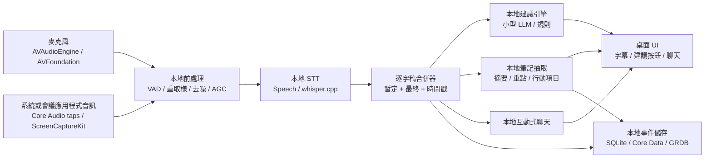
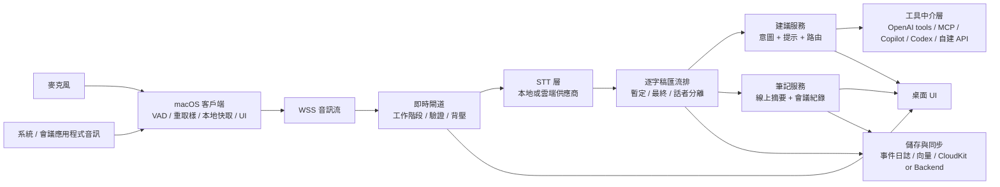
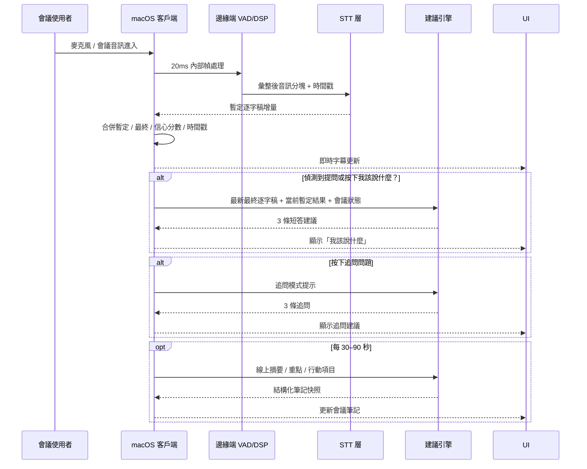

# macOS 會議助理應用程式的 AI 管線與系統架構深度研究

## 執行摘要

這類產品的核心，不是單一模型，而是**低延遲音訊處理、可回滾的逐字稿事件流、分層式摘要與建議管線、以及可治理的工具代理層**。就工程可行性與產品風險而言，最佳預設不是「全雲端」，也不是「全本地」，而是**本地優先的混合式架構**：音訊擷取、VAD、重取樣、部分逐字稿合併、敏感資料過濾、UI 與本地快取在 macOS 端執行；較重的 LLM 推理、跨供應商路由、工具/API 執行、雲端同步與觀測在後端執行。這樣能同時利用 Apple Silicon 上的本地推論能力，以及 OpenAI、Anthropic、GitHub Copilot/Codex 等現代工具呼叫與代理能力。citeturn20view2turn35search0turn35search4turn35search16turn21view1turn21view5turn21view6turn21view7turn21view8turn21view9turn37view0turn37view1

若你的首要目標是**隱私、離線能力與法遵可解釋性**，完全本地版是成立的，尤其在 Apple Silicon 上：`whisper.cpp` 已對 ARM NEON、Accelerate、Metal、Core ML 做優化，並提供明確的記憶體級距；Core ML 與 MLX 也都明確針對 Apple silicon、統一記憶體、功耗與延遲而設計。這使得「本地 STT + 小型本地 LLM + 本地筆記抽取」在現代 Mac 上是可行的。但一旦你要同時支援高品質即時建議、跨模型切換、工具/API 代理、複雜長上下文與雲端同步，混合式仍是更穩妥的產品預設。citeturn20view2turn35search0turn35search4turn35search16turn38search0turn38search8

最大的實作難點，並不是 LLM 本身，而是**雙音源擷取與即時一致性**：你必須同時處理麥克風與會議應用程式或系統輸出音訊，最好分通道而不是先混音；此外，逐字稿必須同時支援易變的暫定結果、最終段落、時間戳、信心分數、增量修正與後處理合併。Apple 已提供 AVAudioEngine/AVFoundation 麥克風擷取能力，也提供 Core Audio taps 與 ScreenCaptureKit 來擷取輸出音訊或畫面/音訊內容；同時，Speech framework、OpenAI Realtime transcription、Deepgram streaming STT 等都提供暫定／中期結果與即時事件流。citeturn24search1turn24search3turn24search8turn14search3turn14search1turn14search0turn21view0turn27search7turn27search20turn27search11

我的總結建議是：**產品預設採混合式本地優先；同時保留完全本地企業模式作為高隱私 SKU；把「說什麼」與「追問什麼」做成低延遲專用管線，把會後筆記與行動項目做成較重的第二輪處理；所有外部 API 與 Copilot/Codex 類工具，必須經過中介層、政策層、審批與稽核。**citeturn21view5turn21view6turn21view7turn21view8turn21view9turn22view0turn22view1turn22view2

## 研究前提與設計原則

本報告依你的假設，採用以下前提：目標平台為 **現代 macOS 12+、Apple Silicon、網路狀況可變、使用者重視隱私**。這會直接推導出一個產品原則：**音訊採集與逐字稿熱路徑必須本地優先；雲端只接管你無法在本地便宜且穩定完成的事情。**

下表明確列出本報告覆蓋的研究維度與對應設計焦點。

| 維度 | 本報告焦點 |
|---|---|
| 系統變體 | 完全本地與客戶端加後端兩種架構、資料流、資源、可行性 |
| 元件配置 | 客戶端／伺服器之間對音訊、STT、LLM、筆記、儲存、金鑰的拆分 |
| 音訊傳輸 | WebSocket 設計、PCM/Opus、分塊、緩衝、抖動處理 |
| 供應商抽象 | 適配器、路由、備援、自帶金鑰（BYOK）、MCP / 工具使用 / 函式呼叫 |
| 逐字稿管線 | VAD、暫定／最終逐字稿、標點、信心分數、話者、校正 |
| 筆記管線 | 線上摘要、重點、行動項目、會議紀錄、模板、儲存與同步 |
| 建議管線 | 意圖偵測、上下文管理、提示範本、UI 延遲 |
| 離線模式 | 本地 STT/LLM、降級策略、快取、回線後同步 |
| 可靠性 | 重試、背壓、平順降級、遙測 |
| 安全與隱私 | 加密、PII、同意、GDPR、金鑰管理 |
| 效能 | CPU/GPU/ANE、記憶體、量化、能耗 |
| 實作細節 | Apple API、開源函式庫、WebSocket 技術棧、後端、容器化、部署 |
| 驗證 | 延遲、WER/DER、建議品質、資源耗用、UX 測試 |

從平台能力看，最關鍵的前提有三個。第一，macOS 端可用 AVAudioEngine 與音訊 tap 做即時音訊擷取；第二，Apple 也提供 ScreenCaptureKit 與 Core Audio taps 來處理畫面與輸出音訊內容；第三，你的應用程式若進入沙盒，就必須處理麥克風授權項目、音訊擷取用途說明，以及可能的螢幕錄製權限。這表示「能不能聽見整場會議」首先是平台權限與音訊路由問題，之後才是 AI 問題。citeturn24search1turn24search3turn24search8turn14search0turn14search1turn32search6turn7search3turn7search7turn7search19

另一個常被忽略的原則是：**不要先混音再做 STT，除非你被平台限制逼不得已。** 如果能把麥克風與應用程式／系統音訊分開處理，你會同時得到更好的逐字稿品質、更便宜的後端費用、更容易的說話者歸屬，以及更可靠的「現在輪到我講什麼」判斷。對真正的多人單聲道混音，完美即時話者分離仍然昂貴且不穩定；因此熱路徑應優先使用**來源分離**，完整多講者話者分離留給後處理第二輪處理。citeturn14search3turn14search1turn30view0turn30view1turn30view2

## 系統變體與取捨

Apple 端本地 STT 與裝置端 ML 已相當成熟：Speech framework 可提供逐字稿、替代解讀、時間資訊與信心分數；`requiresOnDeviceRecognition` 可強制避免把音訊送上網路，但 Apple 也明言本地模式可能較不準；另一方面，`whisper.cpp` 對 Apple Silicon/Metal/Core ML 的支援很強，且其文件明確列出 base/small/medium/large 級別的記憶體占用，並指出在 Apple Silicon 上透過 Core ML/ANE 執行 encoder 可比 CPU-only 快超過 3 倍。這些事實支撐了完全本地變體的可行性。citeturn27search0turn27search6turn40search1turn29search3turn29search7turn29search10turn20view2

同時，雲端即時模型與工具代理能力也已成熟。OpenAI 的 Realtime / transcription session 可提供逐字稿增量與音訊事件流；OpenAI 與 Anthropic 都支援函式／工具呼叫；GitHub Copilot 提供 BYOK 與 MCP 政策管理；Codex 既可本地 CLI 執行，也可在雲端環境中讀寫與執行程式碼。這些能力使得混合式變體在**工具可擴充性、品質上限、供應商切換與治理**方面明顯更強。citeturn21view0turn27search7turn21view5turn21view6turn21view7turn21view8turn21view9turn37view0turn37view1turn37view2

下圖綜合了 Apple 的本地音訊能力、裝置端推論能力，以及現代雲端 STT/LLM/工具介面，整理出兩種可行架構。citeturn14search0turn14search3turn24search1turn20view2turn35search0turn35search16turn21view1turn21view6

| 變體 | 延遲 | 隱私 | 基礎設施成本 | 實作複雜度 | 離線能力 | 現代 Mac 可行性 | 最適合的場景 |
|---|---|---|---|---|---|---|---|
| 完全本地 | **最低網路依賴**；STT 很低，建議生成取決於本地模型大小 | **最高**；原始音訊可完全不出機器 | 低雲端費，但高客戶端硬體壓力 | 高；模型打包、升級、量化、效能調校都在客戶端 | **最強** | **可行**；尤其是本地 STT + 小型建議模型 | 高隱私企業、離線、法遵敏感 |
| macOS + 後端 | 多一跳網路；但可用更大模型與更成熟工具鏈 | 中到高；取決於送出音訊還是逐字稿，以及是否做邊緣端遮罩 | 中到高；需要 STT/LLM/API 成本與後端運維 | **最高整體系統複雜度**，但產品能力最完整 | 中；需設計降級模式 | **最實用**；也是最易擴功能 | SaaS、跨裝置同步、工具代理、較高品質需求 |

關於資源與可行性，可下更具體的工程判斷。`whisper.cpp` 文件列出的記憶體占用約為：base ~388MB、small ~852MB、medium ~2.1GB、large ~3.9GB；Core ML/ANE 可為編碼器帶來顯著加速。再加上 Core ML 與 MLX 都直接針對 Apple silicon、統一記憶體與功耗最佳化，而 Meta 也將 Llama 3.2 的 1B/3B 文字模型定位為能放上邊緣端／行動裝置，因此在 Apple Silicon 16GB 統一記憶體的 Mac 上，**本地 STT + 1B–3B 級本地建議模型**是合理預設；對 32GB 級機器，**7B 級 int4 模型**可以考慮，但仍應視視訊會議本身、瀏覽器/Zoom 以及本地索引所吃掉的統一記憶體而定。這一段的 7B 可行性屬於基於模型參數量與量化的工程估算，而非單一官方數字。citeturn20view2turn35search0turn35search4turn35search16turn35search9turn38search0turn38search8

## 元件配置與即時管線

如果把需求拆成熱路徑與冷路徑，最合理的元件邊界如下：**客戶端熱路徑**處理音訊擷取、VAD、重取樣、暫定逐字稿 UI、快捷建議按鈕與本地快取；**伺服器熱路徑**只做必要的供應商 STT 與低延遲建議編排；**伺服器冷路徑**再做會議紀錄、完整摘要、外部工具執行與同步。這樣可以把「字幕出來」與「建議出來」的 SLA，從會後會議紀錄生成與工具代理的 SLA 中分離。OpenAI 的延遲指南也建議從減少 token、減少請求、並行化與讓使用者更早看見結果等角度優化整體互動。citeturn22view2turn21view0turn27search7

| 元件 | 主要責任 | 建議位置 | 傳遞資料 | 協定 / 介面 | 主要失敗模式 |
|---|---|---|---|---|---|
| 麥克風擷取 | 讀取麥克風 PCM、裝置切換 | 客戶端 | PCM 幀、時間戳 | AVAudioEngine / AVFoundation | 權限拒絕、輸入路由改變、取樣率漂移 |
| 應用程式／系統音訊擷取 | 擷取會議聲音、最好與麥克風分離 | 客戶端 | PCM 幀、來源標籤 | Core Audio taps / ScreenCaptureKit | 無權限、抓不到特定應用程式、輸出路由變更 |
| 邊緣端 DSP | VAD、AGC、重取樣、降噪 | 客戶端 | 單聲道／立體聲音訊分塊 | 本地 DSP 管線 | CPU 過載、延遲堆積、失真 |
| STT 熱路徑 | 暫定／最終逐字稿 | 客戶端或伺服器 | 逐字稿增量、時間戳、信心分數 | Speech / whisper.cpp / cloud STT | 語言誤判、暫定結果抖動、供應商逾時 |
| 逐字稿合併器 | 合併易變／最終段落 | 客戶端 | 不可變事件 + 可變即時片段 | 只能附加的事件模型 | 重疊段錯誤、時間軸飄移 |
| 建議規劃器 | 意圖偵測、按鈕建議 | 客戶端或伺服器 | 短上下文狀態、最新輪次 | 本地 LLM / 雲端 LLM | 高延遲、低相關、誤觸發 |
| 互動式聊天 | 回答使用者在會中提問 | 伺服器為主；可有本地備援 | 逐字稿檢索、筆記、工具結果 | chat completion / responses | 長上下文成本、引用舊資料 |
| 筆記抽取器 | 線上摘要、重點、行動項目 | 伺服器為主；本地可做簡化版 | 結構化 JSON | 結構化輸出 | 幻覺負責人/到期日、過度摘要 |
| 工具中介層 | 呼叫外部 API、Copilot/Codex | 伺服器 | 工具綱要、政策、審計日誌 | 函式呼叫 / MCP / 供應商 SDK | 提示注入、越權操作、成本爆量 |
| 儲存 | 原始事件日誌、衍生物件、搜尋索引 | 客戶端 + 伺服器 | 逐字稿事件、筆記快照 | SQLite / Core Data / CloudKit / 後端 DB | 合併衝突、損毀、同步空洞 |
| 金鑰管理器 | API 金鑰、工作階段權杖、加密金鑰 | 客戶端 + 伺服器 | 加密後的秘密 | Keychain / Secure Enclave / KMS | 金鑰外洩、作用域過大、輪替失敗 |
| 可觀測性 | 追蹤、指標、崩潰 | 客戶端 + 伺服器 | 追蹤跨度、指標、日誌 | OTel / Prometheus / Sentry | 無法定位熱路徑瓶頸 |

音訊傳輸方面，IETF 的 WebSocket RFC 明確指出 WebSocket 是在 TCP 上的雙向通訊協定，資料以訊息／幀傳送，而訊息可能被中間層切分或合併；這表示你**不能只靠 WebSocket 幀邊界當作音訊語意邊界**，必須自行加入序號、單調時間戳、串流 ID。Opus RFC 則明確把 Opus 定位成互動式語音/音訊編碼器，支援低延遲幀與封包遺失隱蔽（PLC）。citeturn25view1turn25view0

| 傳輸選項 | 建議用途 | 優點 | 缺點 | 建議預設 |
|---|---|---|---|---|
| 透過 WSS 二進位傳送 PCM16 | 自建後端、除錯、最小編碼複雜度 | 最簡單、精確、好除錯 | 頻寬高、TCP 抖動時排隊明顯 | 內網/企業版可用 |
| 透過 WSS 二進位傳送 Opus | 網路波動大、長會議 | 頻寬低、適合互動式音訊、PLC 有利穩定 | 需額外編解碼、伺服器要支援 | **網路可變時首選** |
| 供應商原生 JSON + base64 音訊 | 直連 OpenAI Realtime 等 | 接官方事件格式最省整合 | base64/JSON 有額外開銷 | 只在直連供應商時用 |
| 僅上傳逐字稿 | 高隱私 / 低頻寬 | 原始音訊不離機器、成本低 | 無法重跑 STT/diarization | 純本地或嚴格隱私模式 |

對於分塊與取樣率，本報告的工程預設如下。**內部處理幀長**建議 20ms；**上行傳輸**可每 40–100ms 聚合 2–5 幀，避免過多 WebSocket 訊息開銷；**抖動緩衝**建議 100–250ms；若傳送佇列超過門檻，優先降級建議頻率，不要降級 STT。ScreenCaptureKit 官方支援 8k、16k、24k、48k；Deepgram 對原始音訊要求明確給出編碼與取樣率；OpenAI Realtime WebSocket 例子則示範以 JSON 事件傳送 base64 PCM16 音訊。實務上應採 **擷取端保真、上行依供應商調整**：例如客戶端保留 48k 原始音訊作錄製與備援，送 STT 前再轉成 16k 或 24k 單聲道。這裡「20ms/40–100ms/100–250ms」是工程建議，不是單一官方硬性數字。citeturn32search0turn21view4turn21view3turn21view1turn21view2turn31view0turn25view0

逐字稿管線應分成四層。第一層是 **邊緣端 VAD**：可用本地 Speech 模組、WebRTC/Silero 類 VAD 或供應商端 VAD 作第二保護；Deepgram 的端點偵測與語句結束明確以 VAD/停頓判斷段落結束，OpenAI 轉錄 API 的 `chunking_strategy=auto` 也會先做響度正規化與 VAD 邊界選擇。第二層是 **STT**：本地可用 Apple Speech / `whisper.cpp`，雲端可用 OpenAI Realtime transcription 或 Deepgram streaming。第三層是 **品質修正**：標點、智慧格式化、詞彙表增強、前文提示串接。第四層是 **段落合併器**：把暫定文字、最終文字、時間戳、信心分數合併成不可變事件流。citeturn27search11turn27search8turn27search14turn30view3turn21view0turn27search7turn27search20turn27search2turn29search3turn29search7turn27search25

就 Apple 的能力而言，Speech framework 本身可回傳替代解讀、信心分數與時間資訊；較新的 SpeechTranscriber 也可在易變結果模式下，讓同一段詞組被多次更新直至更穩定。若你必須支援真的離線模式，Apple 的 `requiresOnDeviceRecognition` 能強制不送網路，但 Apple 已明言本地請求可能較不準；因此它很適合作為備援，而不是唯一生產級 STT。citeturn27search0turn27search6turn40search1turn40search4turn29search3turn29search10

話者分離方面，應把「熱路徑可用」與「完整話者標籤」拆開看。OpenAI 提供內建話者分離的轉錄模型；但如果你改走自架 `pyannote`，它更擅長離線/批次，而其社群討論也明確表示即時串流音訊並非當前直接支援的主用法。`pyannote/speaker-diarization-3.0` 的示例更多是對音訊檔執行管線，並在 V100 + CPU 條件下達到約 1 小時音訊 1.5 分鐘完成。對 macOS 會議助理而言，最務實方案是**熱路徑先做來源分離標籤（我方麥克風 / 遠端音訊 / 可能的應用程式來源）**，會後第二輪處理再做真正多講者話者分離。citeturn30view2turn30view0turn30view1

建議管線則應採 **兩段式**。第一段是超輕量的意圖偵測：偵測「有人在問你問題」、「剛出現反對意見」、「需要回覆但你沉默超過 N ms」、「使用者按了我該說什麼？ / 追問問題」。這一段可以是規則 + 小型模型。第二段才是建議生成：把最近 30–120 秒最終逐字稿、當前暫定結果、會議狀態、使用者角色與按鈕意圖送入提示。為了壓低成本與延遲，靜態前綴、系統指令、工具定義與角色設定應放在提示前面，變動內容放尾端，以提高提示快取命中；OpenAI 與 Anthropic 都明確說明完全相同前綴快取能降低延遲與成本。citeturn22view0turn22view1turn22view2

這三個 UI 動作應對應三種不同 SLA。**我該說什麼？** 要求最短延遲，建議輸出 3 條可直接說出口的短句，並附語氣風格標籤與風險標記。**追問問題** 可以偏探索式，輸出 3 條追問，分成釐清／推進／收束三類。**互動式聊天框** 則可以走較慢但更完整的 RAG + 工具路徑，允許查整場逐字稿、會議狀態與外部工具。這三條路不要共用同一個巨型提示；應共享事件資料，但分開獨立優化。對結構化提取與 UI 穩定性，使用 JSON Schema/結構化輸出明顯優於自由文生成。citeturn28search0turn28search4turn22view2

外部 API、Copilot、Codex 的整合不應直接暴露在會議 LLM 前，而應透過**LLM 供應商抽象層 + 工具中介層**。OpenAI、Anthropic 都把工具使用／函式呼叫設計成「模型決定呼叫、應用程式負責執行」；GitHub Copilot 允許 BYOK 與 MCP 政策，並強調可用允許清單登錄檔限制可用伺服器；Codex 則有本地 CLI 與雲端代理兩種形態，而且官方明確寫出 Codex 能讀取、編輯並執行程式碼。對會議助理而言，這代表**Codex/Copilot 一律只能在顯式使用者操作下觸發**，例如使用者在聊天框明確要求「根據剛才的決議幫我起一個 issue / PR 草稿」。citeturn21view5turn21view6turn21view7turn21view8turn21view9turn37view0turn37view1turn37view2

下圖是一個建議的即時時序。它把音訊、逐字稿、建議與 UI 拆成可觀測的事件節點，而不是單一長請求。citeturn25view1turn21view0turn27search7turn22view2

## 筆記、離線、可靠性與安全

會議筆記管線不應直接吃「整場會議全文」反覆重跑，而應採**層級式線上摘要**。MeetingBank 顯示真實長會議摘要資料稀缺且上下文很長；近期關於線上會議摘要的研究也指出，線上摘要與離線摘要是不同問題，實務上需要分段政策與累積摘要策略。因此，最穩妥的做法是每 30–90 秒產生一個摘要快照，內含：當前主題、已確認決策、待確認事項、行動項目、風險點；會議結束後再跑一次較重的會議紀錄處理。citeturn28search2turn28search6turn28search14

在抽取層面，建議把筆記拆成明確結構綱要，而不是只存自由文字。至少要有：`highlights[]`、`decisions[]`、`actions[]`、`owners[]`、`due_dates[]`、`open_questions[]`、`evidence_turn_ids[]`。使用結構化輸出的好處是，你可以把 UI、同步、搜尋、任務建立與會後電子郵件全部建立在同一份穩定 JSON 上，而不是在自由文裡重新解析。這一點對行動項目偵測尤其重要，因為會議摘要與行動項目本來就是學術上獨立評估的任務，AMI/MeetingBank 都是常用的基準來源。citeturn28search0turn28search4turn28search11turn28search3

儲存策略上，我建議採**只能附加的原始事件日誌 + 衍生檢視**。也就是說，原始逐字稿事件、段落狀態轉換、摘要快照、工具呼叫日誌都是不可變事件；真正顯示在 UI 上的「最新筆記」只是衍生物化檢視。這樣的好處是：暫定逐字稿修正不會破壞歷史、同步衝突較容易處理、會後第二輪處理可重算衍生物件。若你接受 Apple 生態綁定，Core Data + CloudKit 很適合作為私有 iCloud 同步；Apple 官方也明確指出 Core Data 可與 CloudKit 同步，而 CloudKit 私有資料庫可配置加密欄位並保護 PII。若你要顯式控制結構綱要、遷移與 WAL 行為，SQLite/GRDB 會更直接。citeturn8search1turn8search7turn8search5turn8search2turn8search14

離線模式應被視為一級功能，而不是例外。至少應支援：本地音訊擷取、本地 VAD、本地 STT、本地字幕、本地簡版「我該說什麼？」、本地筆記快照與本地儲存。被降級的功能包括：雲端供應商路由、真正多講者話者分離、外部工具/API、跨裝置同步，以及較大模型的高品質會後會議紀錄。當網路恢復時，系統再把原始事件日誌與筆記快照上傳、重放、重算雲端品質版結果。Apple 的裝置端語音與 `requiresOnDeviceRecognition` 為這種降級模式提供了平台支點，但品質上要接受備援水準。citeturn29search3turn29search10turn27search0turn40search4

可靠性上，最重要的是**明確的背壓與平順降級順序**。我的建議順序是：先停用自動建議，再降低筆記更新頻率，再停止外部工具，最後才影響 STT；而 STT 失敗時，先保留音訊檔與事件索引，稍後補轉錄。所有非冪等的結果都要帶 `segment_id` / `note_snapshot_id` / `tool_call_id`。對觀測，OpenTelemetry 提供追蹤／指標／日誌的標準基礎；Prometheus 明確建議你對每個函式庫、子系統、服務都要有基本指標；Sentry 則可補上 Apple 平台的崩潰與效能監控。citeturn22view3turn22view4turn9search2

安全與隱私方面，**金鑰絕不能散落在提示或應用程式套件**。Apple 官方將 Keychain 定位為存放密碼與加密金鑰等小型機密的正確位置，CryptoKit 則是建議優先使用的加密框架；若是混合式架構，供應商主金鑰應只存在後端，客戶端只拿短時效工作階段權杖；若是純本地 BYOK 模式，使用者輸入的 OpenAI/Anthropic/GitHub 金鑰也只應存於 Keychain，並嚴格最小權限。GitHub 在 Copilot BYOK 文件中也明確建議遵守最小權限。citeturn7search0turn7search4turn7search1turn7search17turn21view8

法遵上，GDPR 對控制者／處理者的責任分工、合法依據、儲存限制與完整性／機密性都寫得很清楚。對你這種產品，若你把逐字稿、筆記、行動項目或 PII 交由外部 STT/LLM 處理，外部供應商通常會落入處理者或子處理者範疇；這要求你在合約、刪除政策、地區控制與資料外洩處理上明確化。產品上至少應提供：清楚的同意 UX、資料保存期限、純本地模式、僅逐字稿上雲模式、以及邊緣端遮罩模式。至於各地會議錄音同意規則並不一致，這一點仍需依實際市場做法律審查。citeturn33view0turn33view1turn33view2turn33view3

若你考慮更進一步的隱私保護個人化，技術上有三種路。第一是**完全裝置端模型**；第二是**裝置端微調／詞彙調整**，Core ML 明確支援裝置端重新訓練或微調；第三才是**聯邦學習**。McMahan 的經典論文已指出 FL 的主要限制是通訊成本；Apple 也已有把聯邦學習結合差分隱私用於端到端 ASR 的研究。我的判斷是：**v1 不要上 FL**，因為它會把產品變成 ML 平台；先做本地個人化、詞彙表與提示層級調整更實際。citeturn12search1turn12search0turn12search4turn12search2turn12search6

## 評估、技術棧與實作清單

評估上，**STT 要看 WER/CER，話者分離要看 DER，UX 要看 SUS，再加上你自己的產品指標**。WER 是 ASR 的常用指標；DER 是話者分離的標準誤差定義；SUS 則是長年可比較的可用性量表。對會議助理這類系統，我不建議只看模型分數，還要同時看建議採納率、到被接受回覆的編輯距離、行動項目精確率/召回率、會議紀錄忠實度與能耗影響。citeturn15search0turn15search5turn15search6

| 評估面向 | 建議指標 | 建議產品目標 |
|---|---|---|
| 即時逐字稿 | 麥克風／應用程式音訊 → 暫定延遲、最終延遲、WER/CER | 暫定 p50 < 700ms；最終 p50 < 2.5s |
| 話者/來源標註 | DER 或來源歸屬準確率 | 熱路徑先看「我方 vs 遠端」標註正確率 |
| 建議品質 | 採納率、編輯後採納率、人工相關性分數 | `我該說什麼？` 被點擊或複製率持續提升 |
| 筆記品質 | 行動項目精確率/召回率、負責人/到期日準確率、忠實度審查 | 負責人/到期日不幻覺優先於覆蓋率 |
| 系統資源 | CPU/GPU/ANE 使用率、RSS/統一記憶體、耗電 | 60 分鐘會議不應造成明顯熱降頻 |
| 使用體驗 | SUS、任務成功率、首次上手時間 | 新使用者在首次會議中能理解字幕/按鈕/筆記三塊功能 |

| 層級 | 推薦技術棧 | 為什麼 |
|---|---|---|
| macOS 客戶端 | SwiftUI + AppKit bridge；AVAudioEngine / AVFoundation；Core Audio taps；ScreenCaptureKit | Apple 官方音訊與 UI 路徑最穩；可直接拿到低延遲音訊與系統權限模型。citeturn24search1turn24search3turn14search3turn14search0 |
| 客戶端 WebSocket | **Network.framework** 優先；`URLSessionWebSocketTask` 次之；必要時 Starscream | Apple 的 TN3151 明確建議除非有特殊理由，新的 WebSocket 程式碼優先用 Network framework；`URLSessionWebSocketTask` 仍可作較高階的訊息導向傳輸。citeturn17search3turn17search0 |
| 本地 STT | `whisper.cpp` 為主；Apple Speech 作備援；若你未來提高部署目標版本，可再評估 SpeechAnalyzer/SpeechTranscriber | `whisper.cpp` 對 Apple Silicon/Metal/Core ML/ANE 友好；Speech framework 提供替代解讀、信心、時間與裝置端備援。citeturn20view2turn27search0turn27search6turn29search3turn40search4 |
| 本地 LLM | MLX 或 Core ML 轉換後模型；1B–3B 作熱路徑建議 | Apple 明確把 MLX/Core ML 都做成 Apple silicon 低延遲、低功耗路線；小模型適合即時建議。citeturn35search0turn35search4turn35search16turn38search0turn38search8 |
| 本地儲存 | SQLite/GRDB 或 Core Data | SQLite/GRDB 適合顯式事件流；Core Data 更適合與 CloudKit 打通。citeturn8search2turn8search14turn8search1 |
| 同步 | CloudKit private DB 或自建後端同步 | Apple 官方強調 CloudKit 私有資料庫同步與加密欄位能力。citeturn8search5turn8search7 |
| 後端閘道 | Python FastAPI 先行；若極端追求效能可用 Rust `axum`；若團隊偏 Swift 可用 Vapor/SwiftNIO | FastAPI 在 WebSocket 開發效率高；axum 適合更高效 async；Vapor/SwiftNIO 可維持同語言棧。citeturn18search0turn18search1turn36search2turn36search4turn36search0 |
| 自架 LLM 服務化 | vLLM | 支援連續批次、前綴快取、串流、工具呼叫與相容 OpenAI 的 API。citeturn39view1 |
| 自架 STT 服務化 | `faster-whisper` | 以 CTranslate2 重作 Whisper，文件明言可更快且更省記憶體，適合作為自架後端 STT。citeturn39view0 |
| 外部工具層 | 自建工具中介層 + 供應商適配器（OpenAI / Anthropic / GitHub / 自建 API / MCP） | 工具呼叫與 MCP 應由你的應用程式執行與治理，不應讓模型直接擁有權限。citeturn21view5turn21view6turn21view7turn21view9 |
| 部署 | Docker；多租戶再上 Kubernetes Deployment | Docker 適合封裝；Kubernetes Deployment 適合滾動更新與副本編排。citeturn18search2turn18search3 |

| 功能 | 優先級 | 估計工作量 | 主要風險 |
|---|---|---:|---|
| 麥克風 + 應用程式／系統音訊擷取與權限流程 | 最高 | 2–4 週 | macOS 權限、不同會議應用程式路由差異 |
| 逐字稿熱路徑（VAD + STT + 合併器） | 最高 | 3–6 週 | 暫定/最終合併錯誤、延遲堆積 |
| 我該說什麼？ / 追問問題 | 最高 | 4–8 週 | 相關性與延遲同時達標不易 |
| 線上摘要 + 行動項目 | 高 | 3–6 週 | 負責人/到期日幻覺、長會議漂移 |
| 即時逐字稿上的互動式聊天 | 高 | 3–5 週 | 上下文治理、引用舊段落 |
| LLM 供應商抽象層 + 路由 + 備援 | 高 | 3–6 週 | 成本爆量、錯誤路由、隱私模式切換 |
| 工具中介層 + Copilot/Codex/MCP 適配 | 中高 | 4–8 週 | 提示注入、越權、審計需求 |
| 離線模式 + 回線後同步 | 高 | 3–5 週 | 衝突解決、重放成本 |
| 遙測 + 錯誤監控 + SLA 儀表板 | 高 | 2–4 週 | 熱路徑觀測不足、難以定位 p95 |
| 合規、資料保留、刪除與金鑰輪替 | 高 | 2–4 週 | 法遵流程與工程實作脫節 |

整體排序上，我會把開發路線圖排成這樣：**先做擷取與逐字稿熱路徑，再做兩個按鈕式建議，再做筆記，最後才做聊天與外部工具代理。** 原因很直接：沒有穩定字幕與事件流，後面所有能力都會變成脆弱的提示工程。對會議助理而言，真正的護城河是低延遲、可重算、可觀測的事件架構，而不是哪一家單一模型。citeturn22view2turn21view0turn28search6

優先來源建議如下，依重要性排序。  
**Apple 官方**：AVFoundation/AVAudioEngine、Core Audio taps、ScreenCaptureKit、Speech framework、Keychain/CryptoKit、Network.framework/TN3151、Core ML/MLX、CloudKit/Core Data。citeturn24search1turn24search3turn14search3turn14search0turn27search0turn7search0turn7search1turn17search3turn35search0turn35search16turn8search1turn8search5  
**標準與主論文**：RFC 6455 WebSocket、RFC 6716 Opus、McMahan 2017 聯邦學習、MeetingBank 2023、2025 線上會議摘要、pyannote.metrics DER。citeturn25view1turn25view0turn12search4turn28search2turn28search6turn15search5  
**供應商官方文件**：OpenAI Realtime/Transcription/Structured Outputs/Prompt Caching/Tools/Codex、Anthropic Tool Use/Prompt Caching、GitHub Copilot BYOK/MCP。citeturn21view0turn21view1turn21view5turn21view6turn22view0turn28search0turn21view7turn22view1turn21view8turn21view9turn37view0turn37view1  
**實作型開源**：`whisper.cpp`、`faster-whisper`、vLLM。citeturn20view2turn39view0turn39view1

本研究的主要限制有三點。第一，若你真的必須完整支援 macOS 12.x，某些較新的 Apple 音訊與語音 API 必須加上作業系統版本判斷或替代路徑；第二，多講者即時話者分離在本地熱路徑仍不是最成熟的部分，建議先靠來源分離與會後第二輪處理；第三，會議錄音/同意的法律要求跨司法管轄區差異很大，這部分不能只靠工程設計，仍需法律審查。上述限制不改變架構結論，但會影響你的 SKU 與推出策略。
