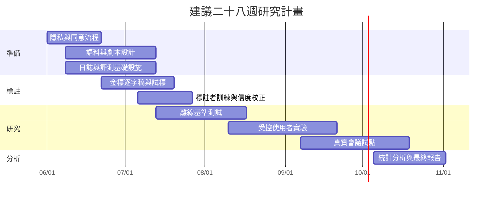

隱私或隱私保護設定下是否仍能保留會議摘要能力，結果並非一面倒悲觀；如果你的目標客群是高敏感產業，這條路線可列為中期研發支線。短期內更實際的作法，仍是 **裝置端優先、最小必要上傳、內容與遙測分層儲存**。([arxiv.org](https://arxiv.org/abs/2503.16771))

### macOS 權限、同意與資料治理

Apple 官方文件要求 macOS 應用程式在存取麥克風時申請明確授權；若你用 ScreenCaptureKit 或螢幕錄製路徑取得分頁／應用程式音訊，則需要 Screen Recording（螢幕錄製）權限，而第一次授權後可能需要重新啟動應用程式。這件事看似工程細節，但在使用者研究裡其實會直接影響初次導入阻力、流失率與實驗內的第一印象。([developer.apple.com](https://developer.apple.com/documentation/bundleresources/requesting-authorization-for-media-capture-on-macos?language=objc))

研究倫理上，HHS 的知情同意指引要求使用者在充分理解風險、用途與保存方式後提供有效同意；GDPR 第 6 條則要求個資處理具有合法依據。對會議助理而言，建議把資料治理寫成明確操作規則：

- 會議前：告知錄音／轉寫／模型處理／保存期限；
- 會議中：提供顯著的錄製／助理啟用指示；
- 會議後：允許下載、刪除、撤回後續分析同意；
- 分析層：將原始內容、去識別化逐字稿、聚合遙測分層保存；
- 預設：原始音訊短 TTL，研究另行明確主動選擇加入。  

這裡不提供特定法域的錄音法規解釋，但**跨法域產品一定要讓法務先審錄音與同意流程**。([hhs.gov](https://www.hhs.gov/ohrp/regulations-and-policy/guidance/faq/informed-consent/index.html))

## 時程、資源、風險與限制

會議產品的常見失敗，不是模型太差，而是**研究切得太薄**：只做離線 WER，沒有使用者研究；只做問卷，沒有金標事件；只做真實試點，卻沒有可重現工程回歸。另一方面，會議系統也有清楚的已知風險：自動指標與人評落差、主動介入打斷會議流暢度、會議回顧的歸屬風險、模型供應商漂移，以及隱私顧慮導致的場域樣本偏誤。([aclanthology.org](https://aclanthology.org/2024.findings-emnlp.393.pdf))

### 建議時程

### 資源估算

| 角色 | 建議投入 | 主要工作 |
|---|---:|---|
| 人機互動／使用者體驗（HCI / UX）研究負責人 | 0.5 FTE × 6 個月 | 研究設計、量表、使用者實驗、結果整合 |
| macOS 工程師 | 1.0 FTE × 6 個月 | 音訊擷取、權限流程、事件日誌記錄、介面量測 |
| 語音／ASR 工程師 | 1.0 FTE × 4 個月 | STT 管線、串流評估、聲學壓測 |
| LLM / API 工程師 | 1.0 FTE × 4 個月 | 提示凍結、供應商抽象層、模型日誌記錄 |
| 資料科學家／實驗分析師 | 0.75 FTE × 4 個月 | 基準測試框架、統計分析、報表 |
| 標註管理者 | 0.5 FTE × 5 個月 | 規範編寫、試標、品質控管 |
| 雙語標註者 | 6 人 × 150–200 小時 | 逐字稿校訂、事件標註、人評 |
| 受控實驗參與者 | 72 人 | 主試驗 |
| 場域試點參與者／團隊 | 30–50 人或 20–30 團隊 | 真實會議試點 |
| 協作演員 | 6–12 人兼職 | 標準化即時情境 |

### 主要風險、限制與對策

| 風險或限制 | 具體問題 | 緩解方式 |
|---|---|---|
| 自動指標失真 | ROUGE / BERTScore 看起來進步，但負責人／歸屬仍錯 | 人工事實性 + 決策／行動項目 F1 必列為主指標 |
| 主動提示打斷會議 | 用戶覺得工具「很聰明但很吵」 | 預設改為隨選或被動提示；加入安靜模式與節流 |
| 模型漂移 | 供應商更新模型或自動選模改變結果 | 凍結已解析模型 ID；正式試驗禁用自動選模；提示與版本全記錄 |
| 公共資料與真實會議落差 | AMI / MeetingBank 與私有企業會議風格不同 | 公共基準測試 + 半合成情境 + 真實試點三層並行 |
| 混語與口音覆蓋不足 | 台灣雙語技術會議與星馬／北美差異大 | 目標式招募口音分層；SEAME 作壓測，不作唯一代表 |
| 隱私阻力 | 敏感會議無法錄音，導致場域樣本偏保守 | 裝置端優先、可見指示、短 TTL、會後即刪、可撤回同意 |
| 高 WER 仍假裝有信心 | 低準確逐字稿會污染建議／筆記 | 顯示低信心狀態；信心太低時退回僅字幕模式或停用建議 |
| 行為採納率誤導 | 介面誘導可能讓採納率高，但品質不高 | 採納率作為次要指標，永遠綁定人工品質分數看 |
| 學習與新奇效應 | 第一次使用覺得酷，第二次就煩 | 練習情境、分兩次場次、洗脫期、場域追蹤 2–4 週 |

### 開放問題與邊界

仍有幾個必須誠實保留的開放問題。

其一，**沒有任何單一公共語料庫能同時代表台灣華語、跨國英語、星馬混語、企業技術展示與真實敏感會議**。所以本報告雖已提供公共語料主幹，仍建議你額外建立一小套自有半腳本化雙語會議集，否則產品會在最重要的場景上失真。

其二，**會議專用自動評估器正在快速演進，但還不到可以取代人評的地步**。較新的比較式評估器與多 LLM 評估器很值得接入開發流程，但目前最穩妥的做法仍是把它們當成預警與排序工具，而不是最終裁決者。([aclanthology.org](https://aclanthology.org/2025.coling-industry.48.pdf))

其三，**若產品要同時支援多供應商模型、自動選模與自帶金鑰，研究設計就必須把「平台層變異」當成正式因子**。否則你最後量到的是一個動態平台的混合效應，而不是某個清楚定義的會議助理。GitHub 官方文件已足夠提醒這件事：模型可用性、政策限制與自動選模都不是固定常數。([docs.github.com](https://docs.github.com/en/copilot/reference/auto-model-selection))
