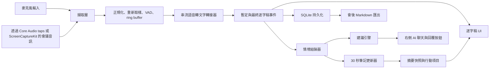
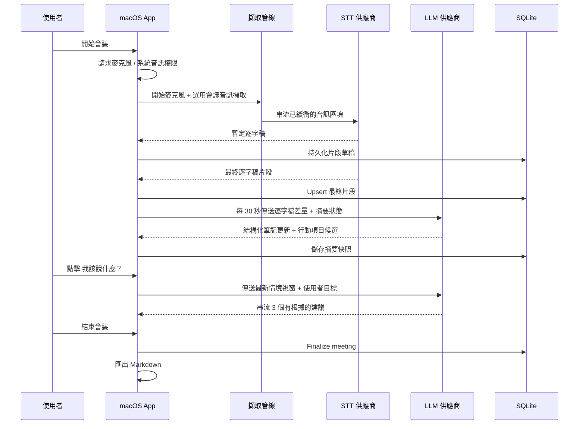
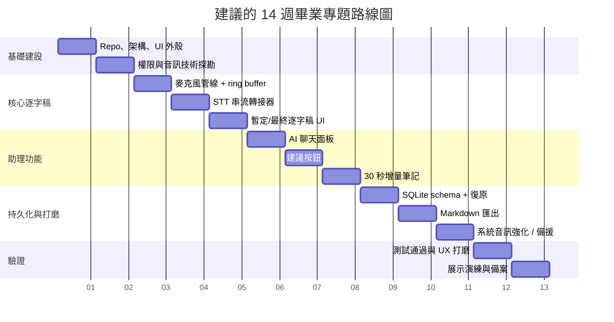

# 為一學期畢業專題打造 macOS 會議助理 MVP

## 執行摘要

這個專案在一個學期內具有技術可行性，**前提是 MVP 必須積極限縮範圍，並且把最具風險的 macOS 特定功能，也就是麥克風以外的會議音訊擷取，視為排程風險，而不是假設它可以「免費」完成。** 最實際的架構是使用原生 Swift App，以 **SwiftUI 建構 UI**、以 **AVFoundation/AVAudioEngine 擷取麥克風音訊**，並針對會議/系統音訊擷取採用 **macOS 14.2+ 的 Core Audio taps 或 ScreenCaptureKit**，第一版則搭配一個**雲端串流語音轉文字供應商**與 **SQLite** 做本地持久化。Apple 目前的平台 API 已明確透過 `NSAudioCaptureUsageDescription` 和 Core Audio taps 支援系統音訊擷取，而 ScreenCaptureKit 可以擷取視窗/App/顯示器內容與其相關音訊；但這兩條路徑都會增加權限與互通性複雜度，應該在前兩週驗證。 citeturn11search1turn13search0turn13search12turn11search8turn29view0turn29view1

對於畢業專題 MVP，最穩健的預設建議是**使用 OpenAI 進行文字生成，再搭配一條串流語音轉文字路徑**；其中 **OpenAI GPT-Realtime-Whisper** 是最簡單的單一供應商即時轉錄選項，而 **GPT-5.4 mini** 或其他快速 mini 級文字模型則負責回應建議、筆記更新與即時聊天框。OpenAI 目前 GPT-Realtime-Whisper 的價格是 **$0.017/min**，而 GPT-5.4 mini 是 **$0.75/M input tokens 與 $4.50/M output tokens**；這會讓筆記/建議成本相對於轉錄成本維持在合理水準。Google Cloud Speech-to-Text V2 和 Azure Speech 都是可行替代方案，且在重視合規的環境中稍微更容易說服，因為它們的官方文件清楚列出區域、加密與安全控制；但它們會增加帳號設定，以及 LLM 功能之外的第二個供應商介面。 citeturn40view0turn6view4turn7view2turn34view0turn10search2turn35view0

因此，正確的一學期策略是：**先做出穩定的麥克風優先產品，只有在早期可行性技術探勘成功後才加入一條會議音訊擷取路徑，交付即時逐字稿 + 右側聊天 + 兩個建議按鈕 + 30 秒增量筆記 + Markdown 匯出 + 本地 SQLite，並延後說話者分離、本地 Whisper、多供應商、向量搜尋、浮動覆蓋視窗整合。** 這個範圍足以符合畢業專題的嚴謹度，在分析上也站得住腳，並且能在即時會議模擬中展示。Whisper 本身並不是作為原生串流模型設計，串流包裝器也會引入自己的延遲策略；相較之下，現今供應商原生的串流 API，以及 WhisperKit 和 Apple SpeechAnalyzer 這類裝置端框架，在 MVP 穩定後會是很好的第二階段候選方案。 citeturn21view0turn21view1turn18search0turn19view0turn30search1turn30search2

本報告使用的假設如下：**14 週學期**作為題目指定 12–16 週範圍的中間值，**1–2 位學生開發者**作為預設交付形式，**Apple Silicon Macs** 作為目標硬體，以及如果你想要現代化系統音訊擷取和 WhisperKit 相容性，**macOS 14.2+** 是實務上的最低版本。WhisperKit 目前的 Swift package 列出 **macOS 14.0+**，而 Core Audio 系統音訊擷取權限則記載於 **macOS 14.2+**。 citeturn19view0turn11search1

## 建議的 MVP 範圍與理由

建議的 MVP 應該只包含足以形成有說服力端到端展示的功能，同時避免太早引入說話者分離、檢索或完整供應商抽象所帶來的非線性複雜度。我會在畢業專題審查中主張的產品切片是：**開始/停止會議、麥克風擷取、若早期技術探勘成功則加入選用會議音訊擷取、即時逐字稿、右側 AI 聊天面板、使用者觸發的 “我該說什麼？” 與 “追問問題” 按鈕、每 30 秒刷新筆記/行動項目、會後 Markdown 匯出、OpenAI API key 輸入，以及本地 SQLite 逐字稿儲存**。這個範圍夠大，能展現音訊、串流推論、UX、資料建模與隱私方面的系統性思考；但也仍小到能在一學期內完成。把多供應商選擇與本地 ASR 留在 MVP 之外，主要原因不是它們不可能，而是它們會倍增測試面、權限邊界案例與支援負擔。 citeturn25search0turn24view1turn19view0turn27view0

最重要的範圍決策，是除非你的畢業專題明確研究 ASR 說話者分離，否則應該把 **speaker diarization（說話者分離）延後**。Pyannote 類型的 diarization pipeline 是結合分段、嵌入與分群的多階段系統；即使是 Argmax 的裝置端 SpeakerKit，也會多出第二個 ML 子系統、額外模型下載，以及圍繞不穩定說話者標籤所產生的更複雜會議 UX。對於主要價值是快速逐字稿、可執行筆記與情境感知建議的會議助理而言，說話者分離對第一學期產品槓桿來說投入高、回報相對低。 citeturn22search9turn22search12turn19view0

我也會把 **本地 WhisperKit、Apple SpeechAnalyzer、向量搜尋、Notion/Google Docs 匯出、浮動覆蓋視窗、負責人/期限擷取，以及多供應商 UI** 延到第二階段。WhisperKit 和 Apple SpeechAnalyzer 都很有吸引力，但各自會建立不同的相容性矩陣與基準測試負擔。向量搜尋在你擁有足夠逐字稿量、能證明語意檢索價值之前並不必要；而 Markdown 匯出的實作成本遠低於文件平台整合，也更容易評分。GitHub Models 值得在架構上預留，但不值得在 MVP 中做成第一級功能，因為它目前的 BYOK 路徑對組織仍是 public preview，且僅限 OpenAI 和 AzureAI；GitHub Copilot 本身是開發者產品，並不是嵌入會議助理 App 時最乾淨的介面。 citeturn19view0turn30search1turn24view1turn24view0turn23search4turn23search8

優先排序後的 MVP 清單如下。

| 優先級 | 功能 | 保留於 MVP | 原因 |
|---|---|---:|---|
| 最高 | 具備 partial/final（暫定/最終）狀態的即時逐字稿 | 是 | 核心使用者價值，也是所有其他 AI 功能的前提。串流語音轉文字供應商明確支援 partial/intermediate results（暫定/中間結果）。 citeturn1view7turn8view1turn6view4 |
| 最高 | 麥克風擷取 | 是 | macOS 上風險最低的音訊路徑；AVFoundation 授權模型很直接。 citeturn17search0turn17search1turn17search2 |
| 高 | 右側 AI 聊天面板 | 是 | 讓助理在畢業專題展示中清楚可見且可操作。Apple 的 SwiftUI/macOS command system 支援快捷鍵豐富的 UI 模式。 citeturn14search17turn14search23turn15search0turn15search1 |
| 高 | “我該說什麼？” 按鈕 | 是 | 具有很高的智慧感；因為由使用者觸發，比未經要求、永遠開啟的輔導更安全。 citeturn27view0 |
| 高 | “追問問題” 按鈕 | 是 | 提示詞架構簡單；明確根植於逐字稿情境。 citeturn27view0turn27view1 |
| 高 | 每 30 秒產生筆記/行動項目 | 是 | 如果以增量方式實作，而不是每次重新摘要整份逐字稿，展示價值很強。 citeturn27view1turn27view2 |
| 高 | Markdown 匯出 | 是 | 實作成本低，且利害關係人價值非常清楚。 |
| 中 | 會議/系統音訊擷取 | 是，但作為受保護的風險 | 在 macOS 上可行，但這是最困難的平台特定功能。及早驗證。 citeturn13search0turn11search8turn29view0 |
| 中 | OpenAI API key 支援 | 是 | 簡化第一個供應商，並讓託管服務變成選用。OpenAI 仍建議不要在正式產品的客戶端 App 中出貨 secrets。 citeturn25search0turn25search5 |
| 中 | 本地 SQLite 儲存 | 是 | 快速、簡單、離線友善的持久化。SQLite 預設不加密，因此 secrets 應留在 Keychain。 citeturn16search21turn16search0turn16search16 |
| 延後 | Speaker diarization（說話者分離） | 否 | 對 MVP 來說增加太多 ML 與 UX 複雜度。 citeturn22search9turn19view0 |
| 延後 | WhisperKit 本地 STT | 否 | 有價值，但應在 MVP 擷取/逐字稿 UX 穩定後再做。 citeturn18search0turn19view0 |
| 延後 | 多模型供應商 | 否 | 可以保留架構接點；不做終端使用者切換。 citeturn24view1turn24view0 |
| 延後 | Vector search（向量搜尋） | 否 | 之後有用；但不是第一學期產品價值所必需。 |
| 延後 | Floating overlay（浮動覆蓋視窗） | 否 | 增加 UX 與視窗管理複雜度。 |
| 延後 | Notion/Google Docs export（匯出） | 否 | 容易說明，但難以強化到穩定。 |

## 詳細技術堆疊與架構

建議的堆疊是 macOS 上的 **Swift + SwiftUI**，並選擇性以 **AppKit bridging** 支援選單列命令、進階視窗控制與無障礙細節打磨。音訊方面，使用 **AVAudioEngine** 作為預設麥克風管線。如果需要系統或會議音訊，建議進行早期技術探勘，比較 **Core Audio taps** 與 **ScreenCaptureKit**。Core Audio taps 是較直接的系統音訊解法，因為 Apple 文件將其描述為可擷取某個 process 或一組 processes 的輸出音訊，並在 macOS 14.2+ 上以 `NSAudioCaptureUsageDescription` 管控。ScreenCaptureKit 也可行，特別是當使用者刻意選擇某個會議視窗或顯示器時；Apple 文件說明它可以透過 `SCStreamOutput` 擷取顯示器、應用程式與視窗的螢幕內容及其音訊。 citeturn13search0turn13search12turn11search1turn11search8turn29view0turn29view1

我建議 MVP 採用以下具體建置選擇。使用 **AVAudioEngine** 進行麥克風擷取與每個 buffer 的 callback。將所有擷取統一正規化到內部 **48 kHz float PCM** 處理匯流排，接著為大多數 STT 供應商重新取樣成 **16 kHz mono PCM**，除非供應商期待其他格式。在供應商轉接器前加入 **ring buffer**、**VAD gate** 和 **segment assembler**。如果必須支援喇叭播放加上僅麥克風擷取，請考慮 Apple 的 **voice-processing APIs / Voice-Processing I/O Audio Unit** 來做聲學回音消除與噪音抑制；如果你透過 ScreenCaptureKit 或 Core Audio taps 分別數位擷取遠端會議音訊，則應使用那條直接訊號來源，而不是仰賴回音消除從室內麥克風路徑「還原」遠端語音。Apple 明確記載 voice-processing APIs 和 Voice-Processing I/O properties 可用於語音增強情境。 citeturn14search0turn14search2turn14search6turn29view3

傳輸方面，原生 macOS App 預設**不需要**使用 WebRTC 作為網路傳輸選擇。OpenAI 的 realtime stack 支援客戶端臨時權杖流程和 WebRTC 介面，但 Apple 已提供 `URLSessionWebSocketTask`，而對逐字稿/建議工作負載來說，WebSocket 或 SSE 路徑比 RTC 媒體通道更容易推理。若之後想要全雙工低延遲語音工作階段，或重用其音訊處理模組，WebRTC 仍然有用；但即使 Google 自己的 WebRTC native-code 頁面，也仍把 native code 定位為瀏覽器開發者基礎設施，而不是 App 開發者首先該使用的工具。 citeturn25search5turn25search1turn14search1turn14search5turn31search8turn31search11

STT 的決策樹很直接。如果你想用單一供應商同時處理即時轉錄與 LLM 功能，**OpenAI GPT-Realtime-Whisper** 是最容易的第一個實作。若你想要成熟的中間結果語意、區域端點與 CMEK 支援，**Google Cloud Speech-to-Text** 很強。若你需要 Microsoft 治理相關表述與即時轉錄「no data trace」的明確文件，**Azure Speech** 很強。**WhisperKit** 是很好的裝置端第二階段路徑，因為它已在 Apple Silicon 上支援 real-time streaming 和 VAD，但它仍是一套客戶端推論系統，你必須做基準測試與封裝。若你的目標是最新 Apple 平台，**Apple SpeechAnalyzer / SpeechTranscriber** 則是另一個官方裝置端替代方案。Whisper 本身是圍繞 30 秒音訊情境視窗訓練，並非天生的串流模型；這就是為什麼 Whisper-Streaming 這類系統會加入 local-agreement/self-adaptive latency policies。 citeturn40view0turn6view1turn8view1turn34view0turn35view0turn18search0turn19view0turn30search1turn30search2turn21view0turn21view1

LLM 生成方面，使用快速 mini 級文字模型，並啟用**串流**、用**結構化輸出**產生筆記/行動項目，以及對建議採用**人在迴路 UX**。OpenAI 的 structured-outputs 文件明確支援嚴格遵守 JSON Schema，這很適合摘要快照、行動項目擷取、提示說明理由與受限 UI rendering。OpenAI 的安全指南也明確建議 moderation、adversarial testing，以及在輸出被實務使用前進行人工審查。這非常符合你的 App，因為會議助理應該提出建議，而不是代表使用者承諾。 citeturn27view1turn27view0

以下架構是建議的 MVP 系統設計。



這張圖反映 Apple 的擷取 API、供應商原生串流轉錄、OpenAI 風格的結構化生成筆記狀態，以及本地持久化/匯出。 citeturn13search0turn29view1turn1view7turn27view1

代表性的互動流程如下。



確切的供應商呼叫可以不同，但架構原則應保持一致：**事件驅動的逐字稿接收、受限情境生成、本地持久化、使用者觸發的建議**。 citeturn1view7turn18search12turn27view1turn27view2

一個實用的 MVP SQLite schema 如下。請將供應商 secrets **排除在 SQLite 之外**，並放在 **Keychain**。Apple 的 Keychain 文件描述了 keychain items 的安全加密儲存，而 SQLite 本身預設不會加密資料庫檔案。 citeturn16search0turn16search16turn16search21turn16search5

| 資料表 | 主要欄位 | 用途 | 備註 |
|---|---|---|---|
| `meetings` | `id`, `title`, `start_time`, `end_time`, `source_mode`, `stt_provider`, `llm_provider`, `locale` | 每場會議/session 一列 | `source_mode` 可以是 `mic`, `window_audio`, `system_audio`, `mixed` |
| `transcript_segments` | `id`, `meeting_id`, `seq`, `start_ms`, `end_ms`, `text`, `is_final`, `confidence`, `speaker_label`, `source` | 暫定/最終逐字稿原子單位 | 在 `(meeting_id, seq)` 和 `(meeting_id, start_ms)` 建 index |
| `summary_snapshots` | `id`, `meeting_id`, `version`, `window_start_ms`, `window_end_ms`, `summary_json`, `markdown`, `created_at` | 每 30 秒的筆記狀態 | 儲存嚴格 JSON 與已渲染的 Markdown |
| `action_items` | `id`, `meeting_id`, `snapshot_id`, `title`, `owner`, `due_date`, `status`, `evidence_start_segment_id`, `evidence_end_segment_id` | 擷取出的行動項目候選 | `status` 應從 `candidate` 開始 |
| `chat_messages` | `id`, `meeting_id`, `role`, `message_type`, `content`, `related_segment_range`, `provider`, `model`, `created_at` | 聊天與建議歷史 | `message_type` 可以是 `chat`, `suggestion`, `followup`, `note_update` |
| `embedding_jobs` | `id`, `entity_type`, `entity_id`, `embedding_model`, `status`, `created_at` | 未來向量搜尋接點 | 不在 MVP 實作；先保留架構接點 |

對於 **30 秒筆記更新策略**，**不要**每次都重新傳送完整逐字稿。相反地，維護一個精簡的結構化 `SummaryState` 物件，包含目前摘要條列、決策紀錄、未解問題與行動項目候選。每 30 秒傳送：上一個 `SummaryState`、自上次筆記處理以來的逐字稿差量，以及一段短滾動情境視窗，例如最近 90–120 秒。OpenAI 的 structured-output 功能讓這件事更可靠，而延遲指南也明確偏好受限 prompt、共享前綴、較少往返與串流。這會把筆記生成從 O(n²) 近似的「每次都從頭重新摘要整場會議」模式，轉為受限的增量更新迴圈。 citeturn27view1turn27view2turn26search2

以下 STT 比較整理出目前最適合你畢業專題的選項。

| 選項 | 部署 | 串流支援 | 隱私姿態 | 來源中呈現的官方價格 | MVP 適配度 |
|---|---|---|---|---|---|
| OpenAI GPT-Realtime-Whisper | 雲端 | 原生即時串流語音轉文字 | API business data 預設不會用於訓練；abuse logs 預設最多保留 30 天 | **$0.017/min** citeturn40view0turn33search1turn33search2 | **最佳單一供應商 MVP 路徑** |
| Google Cloud STT V2 | 雲端 | `streaming_recognize` 搭配 interim results、`is_final`、`stability`；區域端點 | 區域化服務、資料駐留、CMEK 支援 | 此處來源呈現 V2 pricing 中 standard recognition 為 **$0.016/min** citeturn6view1turn8view1turn34view0turn7view2 | 如果偏好 Google 基礎設施，是最佳替代方案 |
| Azure Speech | 雲端 | 即時轉錄搭配中間結果 | 即時音訊在伺服器記憶體中處理；文件聲明即時處理沒有 storage at rest；傳輸中加密 | 由官方 pricing snippet 呈現 **$1.00/hour** | 強企業/治理選項 citeturn6view4turn35view0turn10search2 |
| WhisperKit | 裝置端 | Apple Silicon 上支援即時串流 + VAD | 最高隱私；沒有雲端 STT 可變成本 | 無每分鐘 API 費用 | 最佳第二階段本地路徑；需要處理封裝、基準測試、模型下載處理 citeturn18search0turn19view0turn20search1 |
| Apple SpeechAnalyzer | 裝置端 | 新 Apple 平台上的官方即時語音轉文字 API | 最高隱私；Apple-native | 無每分鐘 API 費用 | 如果只鎖定最新 OS，值得做基準測試 citeturn30search1turn30search2turn30search10 |

## 逐週里程碑與驗收測試的實作計畫

如果你保護好關鍵路徑，14 週計畫是實際的。關鍵路徑是**權限 → 音訊擷取 → 逐字稿串流 → UI 更新迴圈 → 增量筆記 → 匯出**。其他所有東西都應附著在這條主軸上，而不是分開建造。前兩週尤其重要，因為它們會決定會議音訊擷取是留在 MVP，還是變成延伸目標。 citeturn17search0turn11search2turn13search0



逐週里程碑表如下。

| 週次 | 重點 | 交付物 | 驗收門檻 |
|---|---|---|---|
| 1 | 專案設定、架構、UI 骨架 | SwiftUI 外殼、逐字稿檢視佔位、右側面板佔位、App 狀態模型 | App 可乾淨啟動、視窗版面穩定、基本鍵盤命令已接好 |
| 2 | 音訊擷取可行性技術探勘 | 麥克風擷取 prototype；Core Audio taps 或 ScreenCaptureKit 其中之一的概念驗證 | 能顯示麥克風輸入音量表；能清楚記錄目標 Mac/apps 上哪條會議音訊路徑可行 |
| 3 | 生產等級麥克風管線 | AVAudioEngine 擷取、重新取樣、ring buffer、背景工作佇列 | 30 分鐘連續麥克風擷取不當機或記憶體洩漏 |
| 4 | 串流語音轉文字轉接器 | OpenAI 或替代 STT 供應商接上暫定/最終逐字稿事件 | 暫定逐字稿在目標時間內出現；最終逐字稿在停頓後穩定 |
| 5 | 逐字稿模型與 UI | 即時逐字稿檢視、片段最終化、自動捲動、本地緩衝 | 快速說話時逐字稿仍可讀；最終化邏輯不重複文字 |
| 6 | 持久化與復原 | SQLite `meetings` + `transcript_segments`；crash-safe resume behavior | 強制關閉並重新啟動 App 後，先前會議逐字稿仍保留 |
| 7 | 右側 AI 聊天 | 聊天框可以針對最新會議情境提問 | 使用者可問「summarize the last two minutes」並得到有根據的回答 |
| 8 | “我該說什麼？” | 使用者觸發的建議按鈕，提供三個候選回覆 | 建議在目標延遲內回傳，並根植於逐字稿情境 |
| 9 | “追問問題” | 後續問題生成器搭配分類提示 | 輸出至少包含一個澄清問題、一個風險探詢問題和一個下一步問題 |
| 10 | 增量筆記 | 使用 structured outputs 的 30 秒摘要快照 | 筆記更新時不重新處理整場會議；行動項目候選會持久化 |
| 11 | Markdown 匯出 | 會後匯出逐字稿 + 摘要 + 行動項目 | 匯出的檔案可在任何 Markdown 編輯器中乾淨開啟 |
| 12 | 會議音訊強化 | 如果系統/視窗音訊可行就穩定化；否則交付麥克風優先的備援 UX | 展示路徑在目標硬體上具備確定性 |
| 13 | 測試與打磨 | 延遲調校、錯誤狀態、權限訊息、無障礙修正 | 權限遭拒與離線狀態可理解且不致命 |
| 14 | 展示演練與備案 | 最終 build、腳本化展示、備用錄影、效能 logs | 展示在乾淨重啟後連續成功兩次 |

實際工作量約為 **250–350 工程工時**，可完成麥克風優先的 MVP；若你堅持在 MVP 中做穩健的直接會議音訊擷取，則約為 **350–500 小時**。能力強的 solo developer 可能可以完成麥克風優先版本；但 **2 人團隊**安全得多。最低技能組合是：**一位 macOS/audio engineer**、**一位 AI/application engineer**，以及足夠的 UX/測試紀律，讓產品可展示。如果拆分角色，最小舒適團隊是：原生 macOS/audio、AI integration/data layer，以及共用 QA/UX responsibility。這是工程估算，而不是供應商來源數字。

## 風險分析與緩解

主要技術風險是 **macOS 上的會議/系統音訊擷取**，不是 LLM 或 STT 層。Apple 現在記載了兩條真正的擷取路徑：Core Audio taps 與 ScreenCaptureKit；但兩者都與權限、目標 App 行為、OS 版本假設纏在一起。ScreenCaptureKit 另外需要螢幕錄製權限，而 Apple 的範例指南提到使用者第一次授予權限後，App 可能需要重新啟動。這表示你的首次啟動導覽與展示環境必須演練，而且就算系統音訊路徑失敗，產品也必須仍有價值。緩解方式很簡單：**你的 MVP 永遠都應該有僅麥克風的成功路徑。** citeturn13search0turn11search2turn29view1turn17search0

第二個主要風險是**糟糕的 prompt 設計導致延遲暴增**。如果每次 30 秒筆記刷新都重新提交整段累積逐字稿，延遲和 token 花費會穩定上升，UI 也會隨著會議進行越來越差。OpenAI 目前的延遲指南明確建議減少請求、共用 prompt 前綴、使用受限情境與串流。緩解方式是實作**增量狀態更新**，用一次模型呼叫更新筆記狀態，並把建議設成另一條由使用者觸發的路徑。不要讓回覆建議變成持續觸發的背景工作。 citeturn27view2turn26search2

第三個風險是**產生幻覺或社交上尷尬的建議**。Whisper 自己的論文討論了不正確但看似合理的說話者歸屬/姓名，而生成模型本質上能產生自信但錯誤的表述。因此，會議助理應該生成*候選話術*，而不是事實宣稱；也應該在逐字稿不完整時呈現不確定性。緩解方式是：所有建議都根植於最近的逐字稿視窗、要求 structured outputs 並附上 evidence segment references、將建議限制為三個短選項，而且永遠不允許 App 自動傳送或自動朗讀任何內容。OpenAI 的安全指南強烈偏好對實務使用的輸出進行人工監督。 citeturn21view1turn27view0turn27view1

第四個風險是**隱私與金鑰管理**。OpenAI 自己的指南說不要在瀏覽器或行動 App 等客戶端環境部署 standard API key；桌面畢業專題比 public SaaS 暴露程度低，但一般原則仍然適用。對課堂專案而言，把使用者提供的 key 本地存入 **Keychain** 是可以接受的原型選擇，但報告應清楚說明，正式產品版本會改成一個小型後端，負責代理請求或為 realtime sessions 簽發 ephemeral client secrets。Keychain 是 secrets 的正確位置；SQLite 不是。SQLite 預設也不會加密資料庫檔案，所以如果你的評分強調隱私，就必須另行考慮靜態逐字稿保護。 citeturn25search0turn25search5turn16search0turn16search16turn16search21turn16search5

第五個風險是**法規與同意義務**。會議逐字稿與語音資料可能是個人資料。Microsoft 的 speech privacy 文件明確指出，音訊和逐字稿可能受到隱私與通訊法律規範，而客戶負責取得必要權限。對 GDPR 而言，這裡最相關的核心原則是合法性/透明度與資料最小化。對 CCPA/CPRA 而言，實務設計意涵是通知、能夠知道/刪除/更正資料，以及對敏感個人資訊的限制。MVP 的緩解方式很直接：錄音前明確的 App 內同意橫幅、權限提示中清楚的目的標籤、預設本地優先儲存、使用者可見的刪除/匯出控制，以及沒有靜默背景擷取。這是產品設計，不只是法律文字。 citeturn35view0turn38search0turn38search3turn38search6turn39view0

仍有一些開放問題與限制。Core Audio taps 和/或 ScreenCaptureKit 搭配 **Zoom、Teams、Chrome 中的 Google Meet、Safari** 的確切行為，應該在凍結 MVP 範圍前於你的目標 Mac 上實測驗證。**WhisperKit** 與 **Apple SpeechAnalyzer** 之間最佳的裝置端 STT 選擇，也取決於你的目標 OS 下限與評分標準；此處蒐集到的來源顯示兩者都有潛力，但本報告尚未包含你自己的基準測試資料。這些不確定性應在畢業專題報告中誠實呈現，而不是隱藏。

## 成本估算與供應商比較

如果你採用本地桌面架構，並讓使用者提供自己的供應商 key，財務上實際的 MVP 可以做到**沒有強制後端託管**。這讓學生專案的固定平台成本極低。取捨是安全姿態：OpenAI 明確建議不要在客戶端環境部署 standard API keys，因此這對畢業專題原型來說可辯護，但不適合公開正式版。如果之後加入代理或 ephemeral-token service，固定託管成本就會出現；但如果逐字稿與匯出都維持本地，會議助理本質上不需要沉重的常駐伺服器。 citeturn25search0turn25search5

為了讓成本具體化，假設一位使用者每月有 **40 小時會議**、**每 30 秒刷新筆記**，並使用快速 mini 級文字模型產生建議/筆記。在這個假設下，STT 會主導可變成本；如果你使用受限的增量 prompts，筆記生成相對便宜。使用蒐集來源中呈現的官方價格，**OpenAI GPT-Realtime-Whisper** 對 40 小時是 **$40.80/month**，**Google STT V2** 是 **$38.40/month**，而 **Azure Speech** 是**約 $40.00/month**。使用 **GPT-5.4 mini** 進行筆記、建議與聊天的精簡文字生成層，在受限 prompts 下通常每月只會多幾美元。 citeturn40view0turn7view2turn10search2

下表使用一個具體的每月用量模型進行比較：40 小時會議、每月 4,800 次筆記更新呼叫、每月 400 次 “我該說什麼？” 呼叫，以及每月 120 次自由聊天輪次。LLM 估算假設採用高效率增量設計，而不是浪費地重新提交完整逐字稿。

| 堆疊選項 | STT 成本假設 | LLM 成本估算假設 | 每月可變成本估算總額 | 備註 |
|---|---:|---:|---:|---|
| OpenAI only | 2,400 min × $0.017 = **$40.80** | 使用 GPT-5.4 mini 處理筆記/建議/聊天約 **$6.7** | **約 $47.5** | 最簡單的 MVP 整合介面。 citeturn40view0 |
| Google STT + OpenAI text | 2,400 min × $0.016 = **$38.40** | 約 **$6.7** | **約 $45.1** | STT 稍便宜；兩個供應商。 citeturn7view2turn40view0 |
| Azure Speech + OpenAI text | 40 hr × $1.00 = **$40.00** | 約 **$6.7** | **約 $46.7** | 強合規論述；兩個供應商。 citeturn10search2turn40view0 |
| WhisperKit or Apple SpeechAnalyzer + OpenAI text | **$0 variable STT** | 約 **$6.7** | **約 $6.7** | 最低可變成本；最高客戶端運算/基準測試負擔。 citeturn19view0turn30search1turn40view0 |

另一個對架構很重要的比較是供應商策略。

| 供應商路徑 | 吸引人的原因 | 為什麼應該或不應該放在 MVP |
|---|---|---|
| OpenAI direct API | 一個供應商處理即時轉錄、串流回應、結構化輸出、moderation，以及清楚的 realtime pricing | **建議用於 MVP**，因為它把整合接縫降到最低。 citeturn40view0turn27view1turn27view0 |
| Azure Speech + Azure/OpenAI text | 更好的企業/治理姿態與區域/安全表述 | 如果你的審查者比起簡單性更重視合規，這是好替代方案。 citeturn35view0turn28search1 |
| Google STT + OpenAI text | 成熟的 STT 語意、區域端點、CMEK | 如果 STT 品質/營運比單一供應商簡單性更重要，這是好選擇。 citeturn6view1turn34view0turn36search0 |
| GitHub Models | 良好的實驗/治理層；GitHub Models API 現已存在；BYOK 在 public preview 中支援 OpenAI/AzureAI | **不要在 MVP 優先處理**；把它視為第二階段/供應商抽象目標，而不是第一天就要做的 UX。 citeturn23search8turn24view1turn28search0 |
| GitHub Copilot / Codex 作為 first-class providers | 品牌知名度高 | 相較於 direct model APIs，對會議助理價值低；降低優先級。 citeturn23search4turn24view0 |

最清楚的成本結論是，**良好的 prompt 架構比在文字模型上省下幾分之一美分更重要**，因為轉錄時間很可能主導可變支出。所以最佳成本控制槓桿不是「先找更便宜的 LLM」；而是「避免每 30 秒重新處理整份逐字稿」。OpenAI 的 prompt caching 與延遲指南強化了這個結論。 citeturn26search2turn27view2

## 即時建議與後續問題生成的建議 prompts

核心 prompt 設計原則是**針對有根據的實用性最佳化，而不是針對個人魅力最佳化**。建議應簡短、社交上自然，並明確錨定於近期逐字稿情境。它們應避免捏造事實、承諾、日期或負責人姓名。由於這個功能在社交層面具有安全敏感性，請保持**使用者觸發**，並回傳帶有 evidence references 的 structured outputs，而不是純自由文字。OpenAI 的 structured-output 與 safety guidance 很符合這種模式。 citeturn27view1turn27view0

建議的應用端輸入組合是：

- `meeting_goal`
- `user_role`
- `conversation_stage`
- `latest_transcript_window`
- `last_non_user_turn`
- `last_user_turn`
- `summary_state`
- `constraints`，例如語氣、簡潔、不捏造事實
- `output_schema`

一個好的 **「我該說什麼？」** 系統提示詞模板是：

```text
你是一個會議助理，負責為使用者建議簡短、自然的回覆。
你的工作不是替使用者做決定，而是提供有根據的候選回應。

規則：
- 只使用逐字稿視窗或摘要狀態支援的資訊。
- 不要捏造事實、承諾、日期、負責人、預算或決策。
- 如果情境不足，優先使用澄清語句。
- 除非使用者另有要求，否則每個建議保持在 25 個詞以下。
- 回傳正好 3 個 options，且具有不同 intents：
  1) 直接回答
  2) 澄清式回應
  3) 策略性 / 下一步回應
- 每個 option 都包含：
  - `text`
  - `intent`
  - `why`
  - `evidence_segment_ids`
  - `risk_flag`，其中 risk_flag 是下列之一：low、medium、high

Context:
meeting_goal: {{meeting_goal}}
user_role: {{user_role}}
conversation_stage: {{conversation_stage}}
summary_state: {{summary_state_json}}
latest_transcript_window: {{latest_transcript_window}}
last_non_user_turn: {{last_non_user_turn}}
last_user_turn: {{last_user_turn}}
extra_constraints: {{extra_constraints}}
```

其對應的 JSON Schema 可以很簡單：

```json
{
  "type": "object",
  "properties": {
    "options": {
      "type": "array",
      "minItems": 3,
      "maxItems": 3,
      "items": {
        "type": "object",
        "properties": {
          "text": { "type": "string" },
          "intent": { "type": "string", "enum": ["direct", "clarify", "next_step"] },
          "why": { "type": "string" },
          "evidence_segment_ids": {
            "type": "array",
            "items": { "type": "integer" }
          },
          "risk_flag": { "type": "string", "enum": ["low", "medium", "high"] }
        },
        "required": ["text", "intent", "why", "evidence_segment_ids", "risk_flag"],
        "additionalProperties": false
      }
    }
  },
  "required": ["options"],
  "additionalProperties": false
}
```

一個強的 **「追問問題」** 系統提示詞模板是：

```text
你是一個會議助理，負責提出有用的後續問題。

規則：
- 只使用提供的逐字稿和摘要狀態。
- 不要提出假設未被證據支持的問題。
- 總共生成 5 個 questions：
  - 2 個澄清問題
  - 1 個風險或限制問題
  - 1 個利害關係人 / 權責問題
  - 1 個下一步 / 時程問題
- 問題必須聽起來像即時會議中的自然說法。
- 盡可能讓每個問題保持在 18 個詞以下。
- 回傳：
  - `question`
  - `category`
  - `why`
  - `evidence_segment_ids`

Context:
meeting_goal: {{meeting_goal}}
user_role: {{user_role}}
summary_state: {{summary_state_json}}
latest_transcript_window: {{latest_transcript_window}}
```

對於每 30 秒的即時筆記，使用**狀態修訂 prompt**，而不是全新摘要 prompt：

```text
你負責維護一個會議狀態物件。

只使用逐字稿差量與近期情境來修訂先前狀態。
除非新的逐字稿明確改變資訊，否則保留先前有效資訊。
將不確定的行動項目標記為 `candidate`。
除非有明確陳述或強烈暗示，否則不要推斷負責人或期限。
回傳符合 schema 的 strict JSON。

previous_state: {{previous_state_json}}
recent_context: {{recent_context_window}}
transcript_delta: {{transcript_delta}}
```

重要的實作細節是，UI 應該把助理輸出呈現為**有理由的建議**，而不是權威答案。這會降低幻覺造成的社交風險，並符合人在迴路的安全指引。 citeturn27view0turn27view1

## 測試清單與展示腳本

測試策略應圍繞**可衡量的驗收標準**，而不是「看起來可以用」。對畢業專題而言，審查者會對明確的延遲、穩定性與正確性門檻有良好反應。實用的 MVP 目標是：**語音開始後 1 秒內可見暫定逐字稿、停頓後 2 秒內提交最終片段、一般狀況下按鈕觸發的回覆建議在 2 秒內出現、以 30 秒節奏進行的筆記刷新在 5 秒內完成、60 分鐘會議不 crash，且 App 重啟後沒有逐字稿遺失**。這些是針對本專案建議的產品目標；它們不是供應商保證。

簡潔的測試清單如下。

- **權限與 onboarding**
  - 麥克風權限提示只出現一次，且被拒絕時可恢復。 citeturn17search0turn17search2
  - 如果使用 ScreenCaptureKit，螢幕錄製權限流程已記錄，且重新啟動行為已測試。 citeturn11search2turn29view1
  - 如果使用 Core Audio taps，`NSAudioCaptureUsageDescription` 已存在，並在目標 macOS 上測試。 citeturn11search1turn13search7

- **音訊管線**
  - 連續麥克風擷取 60 分鐘，沒有 crash 或記憶體失控成長。
  - 重新取樣對安靜與嘈雜語音都產生可理解的 STT 結果。
  - 會議音訊擷取可在選定展示環境中運作，或 App 能乾淨地回退到僅麥克風模式。

- **逐字稿品質**
  - 暫定逐字稿更新明顯是漸進式的。
  - 最終逐字稿不會重複或重排片段。
  - 時間戳排序保持單調遞增。
  - App 能處理沉默、打斷與快速輪流發言。

- **建議品質**
  - “我該說什麼？” 永遠回傳 3 個短選項。
  - 建議不會捏造逐字稿中沒有的事實。
  - “追問問題” 涵蓋澄清、風險、權責與時程。

- **筆記與行動項目**
  - 筆記每 30 秒使用先前狀態加差量更新。
  - 負責人/日期不確定時，行動項目會標記為 `candidate`。
  - 最終 Markdown 匯出包含逐字稿、摘要、決策與行動項目。

- **持久化與復原**
  - 逐字稿片段在 App 關閉/重新開啟後仍保留。
  - 逐字稿已儲存後，匯出可離線運作。
  - 刪除會議會刪除本地逐字稿、摘要與聊天產物。

- **安全與隱私**
  - API key 存在 Keychain，不存在純文字 preferences/database。 citeturn16search0turn16search16
  - Logs 中沒有 secrets。
  - 如果沒有使用 SQLCipher/SEE，需誠實記錄本地資料庫加密姿態。 citeturn16search21turn16search5
  - UI 讓雲端處理狀態可見。

- **Accessibility 與 UX**
  - Start/stop、“我該說什麼？” 與 “追問問題” 都有鍵盤快捷鍵。 citeturn14search23turn14search8turn14search11
  - 使用者可以暫停逐字稿自動捲動。
  - 右側面板在常見 macOS 視窗尺寸下仍可使用。 citeturn15search7turn15search6

畢業專題展示應寫好腳本，凸顯系統優勢，同時避免不確定路徑。建議的現場展示順序是：

1. 在已預先授權的 Mac 上啟動 App，展示乾淨的會議設定畫面。  
2. 開始會議，並大聲說出一段短議程；展示暫定逐字稿立即出現。  
3. 透過選定的會議音訊路徑播放或模擬遠端參與者片段；或明確說明此展示按設計採用麥克風優先模式。  
4. 讓逐字稿累積約 45–60 秒。  
5. 在模擬參與者提問後點擊 **“我該說什麼？”**；展示三個具備不同意圖的建議。  
6. 點擊 **“追問問題”** 並展示分類提示。  
7. 等待排程的 **30 秒筆記刷新**，展示更新後的摘要/行動項目。  
8. 在 **AI 聊天面板** 問一個問題，例如「目前已經做了哪些決策？」  
9. 結束會議並匯出 **Markdown**。  
10. 開啟 Markdown 檔案，展示逐字稿、筆記與行動項目。  
11. 如果時間允許，重新啟動 App，展示會議已保存在 SQLite 歷史紀錄中。
