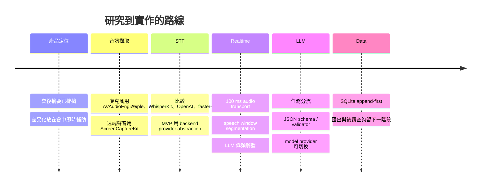
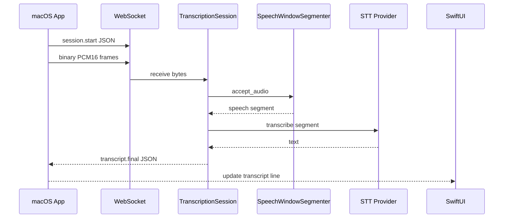

# emeet

macOS App 畢業專題報告

<div class="subtitle">
即時逐字稿、回覆建議、追問問題、會議筆記、下一步行動，以及可切換的 AI provider。
</div>

<div class="meta">
emeet
</div>

<!--
開場先用一句話講清楚：這不是單純會後摘要工具，而是會議進行中輔助使用者思考和回應的桌面副駕。
-->

---
layout: section
---

# 先看 Live Demo

先展示可跑的系統，再回頭解釋研究與技術選型。

---

# Demo Flow

<div class="steps">

1. 啟動 backend。
2. 打開 macOS App。
3. 按下 `Start Meeting`。
4. 觀察麥克風與系統音訊音量。
5. 看到 `Self` / `Other` 逐字稿。
6. 點 `What should I say?`。
7. 點 `Follow-up questions`。
8. 等待 30 秒自動整理 Meeting Notes。
9. 匯出 Markdown 會議紀錄。
10. 切換 provider/model，展示模型可選。

</div>

---

# Demo Commands

Backend faster-whisper demo:

```bash
cd apps/backend
source .venv/bin/activate
MEETING_BACKEND_PROVIDER=faster-whisper ./scripts/dev.sh
```

Apple Silicon local STT demo:

```bash
cd apps/backend
source .venv/bin/activate
MEETING_BACKEND_PROVIDER=mlx-whisper \
MEETING_BACKEND_MODEL=large-v3-turbo \
./scripts/dev.sh
```

macOS App:

```bash
cd apps/macos/emeet
./Scripts/build-app.sh
open .build/app/emeet.app
```

---

# Demo Screen: What To Point Out

<div class="grid two">

<div>

## Left

- Microphone level
- System audio level
- Screen Recording permission state
- Event log

</div>

<div>

## Center / Right

- Transcript lines
- Source label: `Self` / `Other`
- Provider/model/thinking controls
- Reply and follow-up buttons
- Auto-summary countdown
- Notes and next actions

</div>

</div>

---
layout: section
---

# 我想做什麼

不是另一個會後摘要工具，而是會議中的即時輔助層。

---

# Project Goal

<div class="statement">
讓使用者在會議中「聽得清楚、回得自然、記得住下一步」。
</div>

核心功能：

- 生成即時逐字稿。
- 分析對方問題並生成可直接說出口的回覆建議。
- 產生追問問題，協助釐清需求、限制、責任與時程。
- 同步整理會議筆記與下一步行動。
- 提供可切換 provider/model 的 AI layer。

---

# Why This Is Interesting

現有產品多半擅長：

- 會後摘要
- 搜尋逐字稿
- 產生 action items
- 和 Zoom、Teams、Notion、CRM 整合

本專題想切的空間是：

<div class="callout">
macOS 上個人可用、低摩擦、跨會議平台、由使用者主動觸發的即時對話副駕。
</div>

---

# Product Positioning

研究文件的結論：

<div class="quote">
不要把 MVP 做成完整會議平台。先證明一件最有價值的互動：當我正在對話裡，我可以快速知道下一句該怎麼回、還能問什麼、以及後續要做什麼。
</div>

因此第一版鎖定：

- macOS 原生 App
- 私密、透明、可停止
- 逐字稿作為所有 AI 功能的 grounding
- 使用者按鈕觸發建議，不讓 AI 自動替人發言

---
layout: section
---

# 研究歷程

從產品定位一路拆到音訊、STT、Realtime、LLM、儲存與安全。

---

# Research Map

<div class="grid two">

<div>

## Product

- `00` 需求整理
- `01` 產品定位與競爭分析
- `06` 即時回應建議
- `07` 會議筆記與行動項目
- `15` 一學期 MVP 規劃

</div>

<div>

## System

- `02` 音訊擷取
- `03` 即時逐字稿
- `04` 分塊與即時處理
- `09` 模型供應商與 BYOK
- `13` AI 管線與系統架構
- `16` SQLite 儲存
- `17` 提示詞與結構化輸出

</div>

</div>

---

# Research Timeline



---

# What I Learned First

最早的錯誤直覺是：

<div class="bad">
把聲音每幾秒丟給 AI，讓 AI 一次做完轉錄、理解、回答、筆記。
</div>

研究後的結論是：

<div class="good">
音訊、STT、逐字稿狀態、LLM 輔助、筆記與儲存都要分層，因為它們的延遲、容錯與資料契約完全不同。
</div>

---

# TTS or STT?

需求裡常會口語化說「把聲音丟 AI 做 TTS」，但這裡核心其實是：

<div class="grid two">

<div>

## STT / ASR

Speech to Text

語音轉文字

本專題核心：

- 即時逐字稿
- 逐字稿餵給 LLM
- 由文字產生建議與筆記

</div>

<div>

## TTS

Text to Speech

文字轉語音

延伸功能：

- 把 AI 建議念出來
- 風險較高
- MVP 不做，避免 AI 代替使用者說話

</div>

</div>

---
layout: section
---

# 技術線一：抓聲音

先解決「App 到底聽得到什麼」。

---

# Audio Capture Options

| 路線 | 適合情境 | 優勢 | 風險 |
|---|---|---|---|
| `AVAudioEngine` | 麥克風 | 官方、低延遲、易 demo | 只聽得到自己或房間聲音 |
| `ScreenCaptureKit` | 系統/會議音訊 | 不需安裝 driver，可抓遠端聲音 | 需要 Screen Recording 權限 |
| 虛擬音訊裝置 | Big Sur/Monterey 回退 | 路由可控 | 使用者設定成本高 |
| 會議 SDK / WebRTC | 自己控制會議堆疊 | 可拿原始 track | 產品範圍變重 |

---

# Final Audio Choice

<div class="grid two">

<div>

## Chosen

- `AVAudioEngine` for microphone
- `ScreenCaptureKit` for system audio
- 兩條 source 分開送 backend
- UI 顯示 `Self` / `Other`

</div>

<div>

## Why

- 對 macOS prototype 最務實
- 不需 driver installation
- source-based speaker hint 足夠 MVP
- 完整 diarization 延後

</div>

</div>

Code evidence:

- `MicrophoneCaptureService.swift`
- `SystemAudioCaptureService.swift`
- `PCM16AudioConverter.swift`
- `SampleBufferPCM16AudioConverter.swift`

---

# Audio Format

macOS 端統一轉成 backend 好處理的格式：

```text
sample_rate: 16000
channels: 1
sample_width: 2
encoding: PCM16 little-endian
frame size: about 100 ms
```

Why:

- Whisper 類模型常用 16 kHz mono。
- PCM16 容易除錯，不必先解 Opus。
- 先把 capture rate 和 ASR input rate 分開，降低 provider 依賴。

---
layout: section
---

# 技術線二：即時逐字稿

STT 不是單一模型問題，而是事件流問題。

---

# STT Provider Options

| 選項 | 位置 | 優勢 | MVP 判斷 |
|---|---|---|---|
| Apple Speech / SpeechAnalyzer | 裝置端 | 隱私、平台整合 | 新 OS 能力強，需另做相容性 |
| WhisperKit | 裝置端 | Apple Silicon 友善 | 很適合第二階段 |
| `mlx-whisper` | 本機 backend | Apple Silicon demo 快 | 目前採用 |
| `faster-whisper` | Python backend | VPS/GPU/CPU 彈性 | 目前採用 |
| OpenAI / Gemini realtime | 雲端 | 串流與整合成熟 | 可作 future provider |

---

# Current STT Pipeline



---

# Speech Window Segmentation

目前 backend 沒有把每個 100 ms frame 都送模型，而是先做 speech window。

```text
min_segment_ms = 800
silence_ms = 700
max_segment_ms = 8000
vad_rms_threshold = 0.012
```

設計理由：

- leading silence 不送模型。
- 聽到 speech 後才開始累積。
- 靜音夠久就 finalize。
- 一直有人講話時，用 max duration 強制切段。
- session end 時 flush。

Code evidence: `meeting_backend/transcription/segmenter.py`

---

# Transcript Event Contract

```json
{
  "type": "transcript.final",
  "segment_id": "seg_macos-system-..._0001",
  "source": "system",
  "speaker_hint": "other",
  "start_ms": 1200,
  "end_ms": 4200,
  "text": "對方剛剛問的問題",
  "revision": 1,
  "is_final": true,
  "confidence": 0.0,
  "provider": "mlx-whisper"
}
```

這讓 UI 可以用 `segment_id` 更新或新增一行，而不是把整份逐字稿當成一個大字串。

---
layout: section
---

# 技術線三：Realtime

不是所有功能都追求同一個「即時」。

---

# Realtime Budget

| 層級 | 目標 | 原型做法 |
|---|---|---|
| UI feedback | 按下按鈕立即有狀態 | SwiftUI state |
| Audio transport | 小而穩定的封包 | 約 100 ms PCM16 |
| STT final | 停頓後產生 final segment | speech window |
| Suggestion | 使用者按鈕後 1-3 秒內可用 | `/v1/assistant/respond` |
| Notes | 低頻穩定更新 | 30 秒 final transcript |

核心原則：

<div class="callout">
逐字稿可以快；筆記和建議要穩。不要讓不穩定 partial transcript 污染會議紀錄。
</div>

---

# Why Not Send Every Chunk To LLM?

如果每 100 ms 呼叫 LLM：

- token 成本會爆炸。
- 模型會一直看到未完成句子。
- 建議會跟著 partial transcript 抖動。
- UI 會變得吵且不可信。

目前選擇：

- `What should I say?`：使用者按下時才送最近 16 行 transcript。
- `Follow-up questions`：使用者按下時才送最近 16 行 transcript。
- `meeting_notes`：每 30 秒只送 final transcript。

---

# Latency Observability

macOS client 目前有兩種 latency 訊號：

```text
client.ping -> server.pong
```

用於 backend RTT。

```text
audio timeline end_ms -> transcript event arrival
```

用於 transcription latency 粗估。

Code evidence:

- `TranscriptionWebSocketClient.startHeartbeat`
- `handlePong`
- `handleTranscriptionLatency`

---
layout: section
---

# 技術線四：AI 建議與模型選擇

模型可選，但 UI 契約不能跟著模型漂移。

---

# Assistant Provider Layer

Current providers:

| Provider | Purpose |
|---|---|
| `ollama` | local model |
| `openai-compatible` | LM Studio, vLLM, llama.cpp server, OpenAI API |
| `codex-cli` | experimental agent provider |
| `github-copilot-cli` | experimental CLI provider |

Provider discovery:

```http
GET /v1/assistant/providers
```

Response includes models, auth mode, endpoint risk, availability, notes.

---

# Why Provider Abstraction?

研究結論：

- 不同模型適合不同任務。
- 即時建議需要低延遲和保守語氣。
- 會議筆記需要忠實度和結構。
- 本機模型適合隱私模式。
- CLI agent 適合展示 extensibility，但不適合高頻會議 hot path。

因此 UI 讓使用者選：

- provider
- model
- thinking setting

但 backend 統一回：

- `drafts`
- `notes`
- `actions`

---

# Assistant Request

```json
{
  "action": "what_should_i_say",
  "provider": "ollama",
  "model": "llama3.2",
  "thinking": "medium",
  "transcript": [
    {
      "source": "system",
      "source_label": "Other",
      "speaker_hint": "other",
      "start_ms": 1200,
      "end_ms": 4200,
      "text": "對方剛剛問的問題",
      "is_final": true
    }
  ]
}
```

目前只送逐字稿文字與 metadata，不把原始音訊直接送給 LLM。

---

# Prompt Strategy

`assistant/prompts.py` 將任務拆開：

- `what_should_i_say`
- `follow_up_questions`
- `meeting_notes`
- `chat`

System prompt 重點：

- 你是即時會議助理。
- 只能使用 transcript context。
- 不要編造事實、owner、日期、預算、承諾。
- 只回 JSON。

User prompt 放 action、thinking、task instruction 和最近 transcript window。

---

# Output Contract

```json
{
  "drafts": [
    {
      "title": "保守回覆",
      "detail": "我可以先確認範圍，再給你一個更可靠的時程。",
      "badge": "AI",
      "icon_name": "checkmark.seal"
    }
  ],
  "notes": [
    {
      "title": "目前結論",
      "detail": "- 尚未確認正式 deadline。"
    }
  ],
  "actions": [
    {
      "title": "確認下一步與負責人",
      "owner": "Unassigned",
      "state": "Draft"
    }
  ]
}
```

`schema.py` 會 normalize 並 validate，避免 UI 直接解析自由文。

---
layout: section
---

# 技術線五：筆記與儲存

把會議變成可回放、可匯出的事件。

---

# Meeting Notes Strategy

研究結論：

- 會中筆記要短、保守、可逆。
- 會後紀錄可以較完整。
- action item 必須避免猜 owner 和 due date。
- 最好保留 evidence segment ids。

目前原型：

- final transcript 來了先更新 local draft。
- `Start Meeting` 後啟動 30 秒倒數。
- 倒數到 0 時呼叫 `meeting_notes` action。
- 回傳 `notes` / `actions` 後替換 UI draft。

---

# SQLite MVP Schema

目前 backend 實作 append-first local storage：

| Table | Stores |
|---|---|
| `sessions` | WebSocket session and source metadata |
| `transcript_segments` | transcript partial/final events |
| `assistant_runs` | request metadata and latency |
| `assistant_suggestions` | reply drafts and follow-up suggestions |
| `notes` | meeting notes |
| `actions` | next actions |

研究中的完整 schema 包含 meeting-level objects、FTS5、memory snapshots、provider configs。MVP 先保留最小可驗證事件。

---

# Export

macOS App 目前可匯出 Markdown：

- Export time
- STT endpoint
- Assistant provider/model
- Meeting Notes
- Next Actions
- AI Suggestions
- Transcript

Code evidence:

- `CaptureViewModel.exportMeetingRecords`
- `CaptureViewModel.exportMarkdown`

---
layout: section
---

# 最後選擇的技術線

研究建議很多，MVP 需要保守收斂。

---

# Final Stack

<div class="grid two">

<div>

## Client

- SwiftUI macOS App
- `AVAudioEngine`
- `ScreenCaptureKit`
- PCM16 converter
- WebSocket client
- Provider/model controls
- Markdown export

</div>

<div>

## Backend

- FastAPI
- WebSocket STT endpoint
- speech-window segmenter
- `faster-whisper` / `mlx-whisper`
- assistant provider abstraction
- JSON schema validation
- SQLite storage

</div>

</div>

---

# Why This Stack

<div class="decision">

MVP 的目標不是證明某個模型最強，而是證明完整會議輔助 loop 可行。

</div>

所以我選：

- 官方 macOS 音訊 API，降低環境依賴。
- Python backend，讓 STT provider 和 assistant provider 快速替換。
- 16 kHz PCM16 protocol，容易測試和除錯。
- source-based `Self` / `Other`，先避免 diarization 風險。
- JSON output contract，讓 UI 穩定。
- 30 秒 notes，避免 LLM 過度頻繁。

---

# What Changed From The Research Plan

| 研究建議 | 實作取捨 |
|---|---|
| WhisperKit / Apple SpeechAnalyzer 很適合本機路線 | 先用 backend `mlx-whisper`，降低 Swift 包裝與模型生命週期成本 |
| 完整 SQLite schema | 先用 append-first MVP schema |
| 完整 speaker diarization | 先用 source separation |
| 即時建議可預先生成 | 先用按鈕觸發，降低干擾 |
| 多 provider BYOK UI | 先支援 provider discovery 和 OpenAI-compatible endpoint |
| 完整 floating panel | 先做 main workspace，之後再抽出 companion panel |

---

# Privacy Boundary

目前資料邊界：

- 原始音訊只送到本機 backend STT WebSocket。
- Assistant API 只收逐字稿文字和 metadata。
- Ollama 和 localhost OpenAI-compatible 可留在本機。
- 外部 OpenAI-compatible endpoint 會收到逐字稿文字。
- API key 由 backend environment 提供，macOS App 不直接保存 key。

產品原則：

<div class="callout">
錄音、轉寫、模型處理和保存期限都必須對使用者可見，且可以停止、刪除、匯出。
</div>

---
layout: section
---

# 展望

讓原型變成更完整、更可驗證的研究成果。

---

# Engineering Next Steps

1. 加上 meeting-level API、查詢、FTS 與 export API。
2. 升級 VAD：Silero/WebRTC，加上語意邊界。
3. 加入 rolling summary state，避免長會議 context 變慢。
4. 將 assistant schema 版本化，加入 evidence segment ids。
5. 補完整會議聊天框。
6. 量測 latency：capture-to-final、RTT、button-to-suggestion、notes refresh。
7. 測試 Zoom、Google Meet、Teams 的系統音訊穩定性。

---

# Research Next Steps

評估不只看「模型回答漂不漂亮」。

| 面向 | 指標 |
|---|---|
| STT | WER/CER、final latency、revision rate |
| Source label | `Self` / `Other` attribution accuracy |
| Suggestion | usefulness、speakability、acceptance rate |
| Follow-up | information gain、non-duplicate rate |
| Notes | faithfulness、action item precision/recall |
| UX | interruption cost、SUS、demo task success |

---

# Product Next Steps

可以延伸的方向：

- 更完整的浮動 companion panel。
- 本機 STT provider：WhisperKit 或 Apple SpeechAnalyzer。
- 本機 LLM provider：Ollama、LM Studio、MLX。
- 會前 context：議程、客戶資料、文件摘要。
- 會後整理：決策、風險、未解問題、action item evidence。
- Connector：Notion、Google Docs、GitHub Issues、Jira。
- 高隱私模式：local-only、短 TTL、手動刪除。

---

# Final Takeaway

<div class="statement">
這個專題的核心不是單一 AI 模型，而是把會議中的聲音變成可信的事件流，再把事件流轉成可用的即時輔助。
</div>

我最後選擇的路線：

- macOS 官方音訊擷取
- 本地優先 backend
- STT provider abstraction
- 低頻穩定 LLM 呼叫
- 結構化 JSON contract
- 可切換模型/provider
- 明確的隱私邊界

---
layout: end
---

# Q&A

Demo repo:

```text
README.md
AGENTS.md
docs/slides/slides.md
docs/research/translated/
```

<style>
.slidev-layout {
  font-size: 30px;
  line-height: 1.35;
  letter-spacing: 0;
}

.slidev-layout h1,
.slidev-layout h2 {
  letter-spacing: 0;
}

.slidev-layout table {
  font-size: 20px;
}

.slidev-layout code {
  font-size: 0.82em;
}

.subtitle {
  margin-top: 24px;
  max-width: 900px;
  color: var(--comment);
  font-size: 34px;
}

.meta {
  margin-top: 56px;
  color: var(--cyan);
  font-weight: 700;
}

.grid.two {
  display: grid;
  grid-template-columns: minmax(0, 1fr) minmax(0, 1fr);
  gap: 34px;
  align-items: start;
}

.steps {
  font-size: 30px;
}

.callout,
.quote,
.statement,
.decision,
.good,
.bad {
  border: 1px solid rgb(248 248 242 / 18%);
  border-radius: 8px;
  padding: 20px 24px;
  background: rgb(68 71 90 / 55%);
  box-shadow: 0 18px 50px rgb(0 0 0 / 16%);
}

.quote {
  font-size: 30px;
  color: var(--foreground);
}

.statement {
  font-size: 40px;
  font-weight: 760;
}

.decision {
  border-color: rgb(189 147 249 / 40%);
  background: rgb(189 147 249 / 14%);
  font-size: 34px;
  font-weight: 700;
}

.good {
  border-color: rgb(80 250 123 / 40%);
  background: rgb(80 250 123 / 12%);
}

.bad {
  border-color: rgb(255 85 85 / 42%);
  background: rgb(255 85 85 / 12%);
}
</style>
