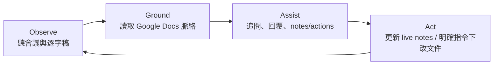
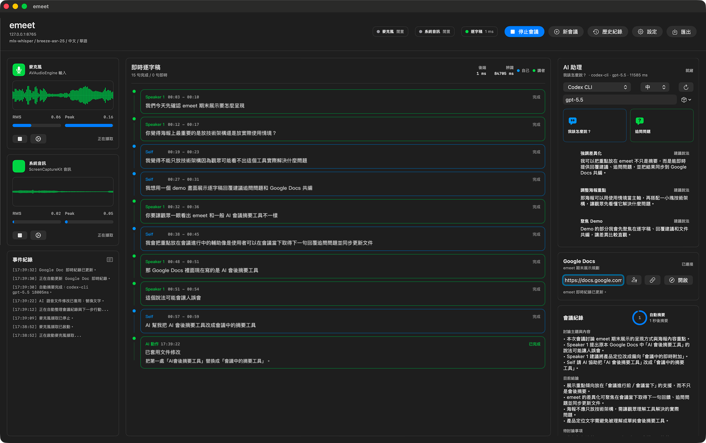
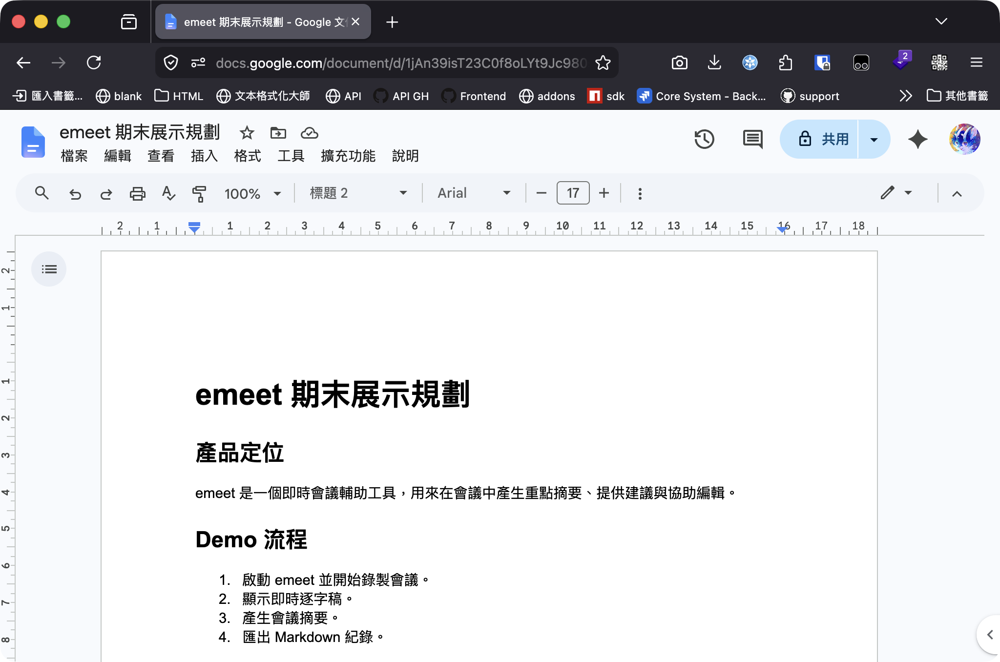

# emeet - Agentic Meeting Assistant

毛宥鈞・百川專題探索期末報告

<!-- 不是再做一個會後摘要工具，而是讓 AI 在會議中參照共同文件、協助追問與回覆，並在可控範圍內更新工作文件。 -->

---
layout: section
---

「這會怎麼開這麼久？」  
「現在講到哪？」  
「等我整理一下」

---

# Problem

會議中的痛點不是「會後忘記」，而是「當下處理不了」。

## 使用者同時要做

- 聽懂對方在說什麼
- 對照 Google Docs 目前內容
- 判斷是否需要追問
- 避免太快做出承諾
- 記錄決策與下一步
- 更新共同文件

## 現有工具多半偏向

- 錄音與轉錄
- 會後摘要
- action items
- 會後搜尋與回顧

關鍵問題其實發生在會議進行中。

<!--
時間：0:35–1:10
這張講痛點。不要急著講技術。重點是讓老師理解：會議工具不只是「記得住」，而是會議中能不能幫我跟上討論。
-->

---

# Project Goal

建立一個私密、低干擾、可切換模型的會議副駕，讓使用者在會議中即時閱讀 reference，並取得追問、回覆、notes/actions 與可控文件更新支援。

## MVP 聚焦

- macOS 原生 App
- 麥克風 + 系統音訊擷取
- Google Docs 文件脈絡作為 AI grounding
- `Follow-up questions` / `What should I say?`
- 每 30 秒整理 meeting notes / next actions
- 明確語音指令下執行有限文件編輯

<!--
時間：1:10–1:45
這張把目前功能收斂成一個目標。強調功能不變，但敘事從「即時會議紀錄」提升成「文件脈絡上的會議副駕」。
-->

---

# Product Positioning

| 類型 | 主要價值 | emeet 的切入點 |
|---|---|---|
| AI notetaker | 會後摘要與回顧 | 不只整理會後內容 |
| 會議平台內建 AI | 綁定 Zoom / Teams / Meet | macOS 本機擷取，跨會議平台 |
| 文件 AI | 幫忙寫文件 | 文件成為會議中的 grounding |

> emeet 的差異化：會議中的共同文件先成為 AI 可以引用的脈絡，再提供 follow-up support。

<!--
時間：1:45–2:15
這張把競品比較簡化。原本簡報裡工具比較太長，8 分鐘不適合逐項講。直接講 positioning。
-->

---

# Agentic Loop

| 階段 | 目前 emeet 做什麼 |
|---|---|
| Observe | macOS 擷取麥克風與系統音訊，後端產生 final transcript |
| Ground | 連接 Google Docs，讀取 title、summary、snippets |
| Assist | 按鈕觸發追問、保守回覆、會議紀錄與下一步 |
| Act | 同步 live notes，明確語音指令下做 bounded document edit |

<!--
時間：2:15–2:55 解決問題或決策的經典邏輯框架（常用於軍事戰術、心理學及行動方案）
Observe (觀察)： 收集現況資訊。客觀檢視周遭環境、局勢或面臨的問題，不帶主觀偏見地確認「發生了什麼事」。
Ground (立足/反思)： 釐清自身狀況。穩固基礎，確認目前的資源、限制、核心目標與客觀事實，避免做出不切實際的判斷。
Assist (協助/分析)： 規劃解決途徑。思考或尋求能改善現況的協助、工具、策略或合作夥伴，評估各種行動方案的利弊。
Act (行動)： 執行並調整。採取明確、具體且可衡量的步驟來解決問題，並隨時根據觀察到的結果進行修正。

這裡的 agentic 不是讓 AI 自己做所有決策，而是能根據脈絡提出或執行受控的下一步。
-->

---

# System Architecture

```mermaid
flowchart LR
    Mic[Microphone<br/>AVAudioEngine] --> Mac[macOS SwiftUI App]
    System[System Audio<br/>ScreenCaptureKit] --> Mac
    Mac --> PCM[16 kHz mono PCM16]
    PCM --> WS[WebSocket<br/>~100 ms frames]
    WS --> Backend[FastAPI Backend]
    Backend --> Seg[Speech-window<br/>Segmentation]
    Seg --> STT[faster-whisper / mlx-whisper]
    STT --> Transcript[transcript.final]
    Transcript --> UI[SwiftUI State]
    UI --> Assistant[Assistant Request]
    Docs[Google Docs<br/>snapshot / snippets] --> Assistant
    Assistant --> Provider[Ollama / OpenAI-compatible / CLI]
    Provider --> JSON[drafts / notes / actions]
    JSON --> UI
    JSON --> SQLite[(SQLite)]
    UI --> Docs
```

<!--
時間：2:55–3:25
這張快速帶過技術架構，不要深入每個模組。講三件事就好：前端抓音訊與呈現 UI；後端做 STT、assistant、storage；Google Docs context 會進入 assistant request。
-->

---
layout: section
---

# Live Demo

情境：期末報告討論

<!--
時間：3:25–3:35
切入 demo。這張只停 10 秒。
-->

---
layout: image
---

---
layout: image
---

---

# Safety Boundary

| 風險層級 | 例子 | 目前策略 |
|---|---|---|
| 低 | 逐字稿、追問、回覆建議 | 可自動產生或按鈕觸發 |
| 中 | meeting notes、action item 草稿 | 使用 final transcript + 文件脈絡整理 |
| 高 | 修改 Google Docs | 只接受明確語音指令與 bounded intent |
| 更高 | 寄信、發訊息、建立外部任務 | - |

<!--
時間：6:15–6:55
這張回答老師可能擔心的 agent 風險。重點：不是完全 autonomous，而是 human-in-the-loop / bounded actions。
-->

---

# Technical Decisions

## 為什麼這樣做

- `AVAudioEngine`：穩定擷取麥克風
- `ScreenCaptureKit`：不用 bot 也能抓系統音訊
- PCM16 / 16 kHz / mono：統一 STT input
- speech window：避免每 100 ms 都呼叫 Whisper
- JSON output contract：UI 不解析自由文字

## 已知取捨

- 還不是真正 token-level streaming
- RMS VAD 在吵雜環境不夠穩
- speaker label 不是完整 diarization
- 文件編輯還需要 preview / confirm UI
- 長會議需要更好的 memory 與 evidence link

<!--
時間：6:55–7:25
這張快速展示你有工程判斷，不是單純把模型接起來。不要逐項講太久。
-->

---

# Current Result

## 已完成

- 可展示端到端 macOS App + FastAPI backend
- 麥克風與系統音訊雙來源擷取
- WebSocket audio streaming + STT
- Google Docs connect / context / live notes
- `Follow-up questions` / `What should I say?`
- meeting notes / actions / Markdown export
- 模型供應商抽象與 SQLite 儲存

---

## 下一步

- Google Docs edit preview / confirm
- evidence_segment_ids：讓每個 note/action 回鏈逐字稿
- Silero / WebRTC VAD
- true partial transcript
- Google Drive / Notion / Jira 作為後續 action layer

<!--
時間：7:25–7:50
這張總結成果與限制。下一步不要講成已完成，而是說它們是自然延伸。
-->

---

# Conclusion

emeet 目前還是 MVP，但已經展示了一個方向：

**AI meeting assistant 可以從會後記錄員，變成會議進行中可以參照、維護，並協助推進會議進行的 Agentic meeting copilot。**

<!--
時間：7:50–8:00
收斂到一句話。講完直接 Q&A。
-->

---
layout: end
---
